# Git

## 1 概述

### 1.1 概述

* Git 是一个免费的、开源的==分布式版本控制系统== ，可以快速高效地处理从小型到大型的各种项目
* Git 易于学习，占地面积小，性能 极快 。 它具有廉价的本地 库 ，方便的暂存区域和多个工作流分支等特性。 其性能优于 Subversion、 CVS、 Perforce 和 ClearCase 等 版本控制 工具。
* 官网地址：http://git-scm.com/

### 1.2 版本控制

* 版本控制是一种记录文件内容变化，以便将来查阅特定版本修订情况的系统
* 版本控制其实最重要的是可以记录文件修改历史记录，从而让用户能够查看历史版本，方便版本切换

### 1.3 版本控制工具

* 集中式版本控制工具

  * CVS、SVN、VSS

  * 集中化的版本控制系统诸如 CVS、SVN 等，都有一个单一的集中管理的服务器，保存所有文件的修订版本，而协同工作的人们都通过客户端连到这台服务器，取出最新的文件或者提交更新。多年以来，这已成为版本控制系统的标准做法。

  * 这种做法带来了许多好处，每个人都可以在一定程度上看到项目中的其他人正在做些什么。而管理员也可以轻松掌控每个开发者的权限，并且管理一个集中化的版本控制系统，要远比在各个客户端上维护本地数据库来得轻松容易。

  * 事分两面，有好有坏。这么做显而易见的缺点是中央服务器的单点故障。如果服务器宕机一小时，那么在这一小时内，谁都无法提交更新，也就无法协同工作。

    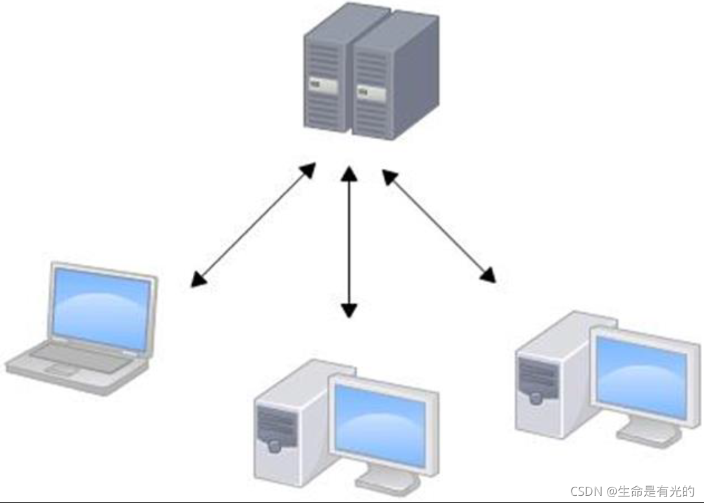

* 分布式版本控制工具

  * Git、Mercurial、…
  * 像 Git 这种分布式版本控制工具 ，客户端提取的不 最新版本的文件快照，而是把代码仓库完整地镜像下来 (本地库) 。这 样 任何一处协同工作用的文件发生故障，事后都可以用其他客户端的本地仓库进行 恢复。因为每个客户端的每一次文件提取操作，实际上都是一次对整个文件仓库的完整备份 。

* 分布式的版本控制系统出现之后，解决了集中式版本控制系统的缺陷 :

  * 服务器断网的情况下也可以进行开发，因为版本控制是在本地进行的

  * 每个客户端保存的也都是整个完整的项目 ，包含历史记录 更加安全

    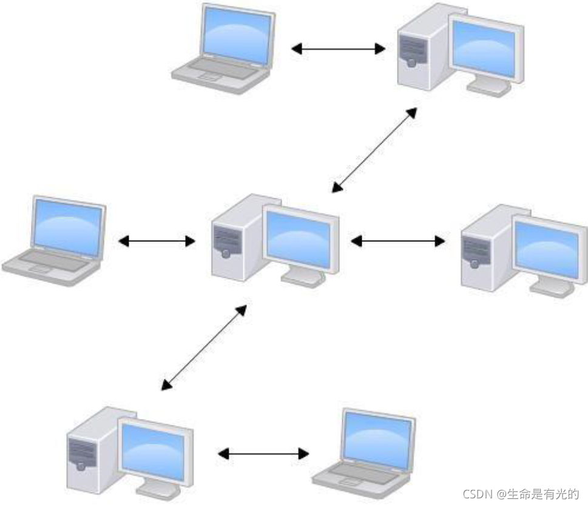

### 1.4 Git 简史

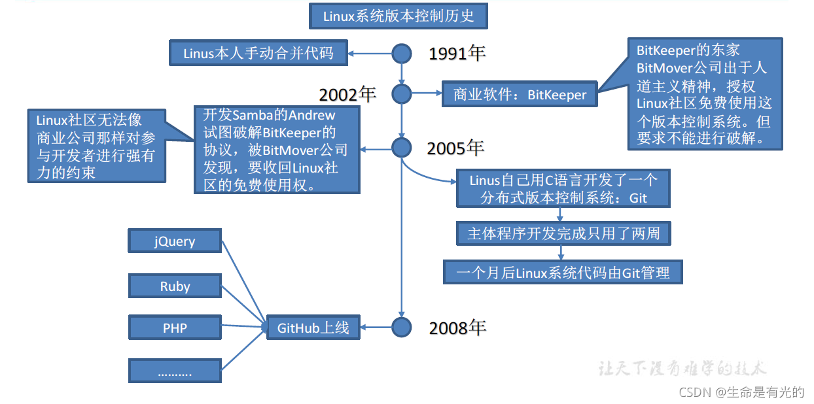

### 1.5 Git 工作机制

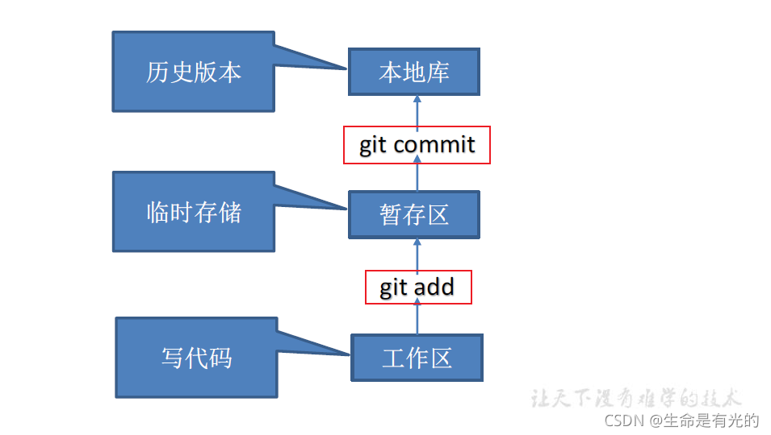

### 1.6 Git 和代码托管中心

* 代码托管中心是基于网络服务器的远程代码仓库，一般我们简单称为远程库
  * 局域网
    * GitLab
  * 互联网
    * GitHub
    * Gitee

## 2 Git 安装

官网地址：http://git-scm.com/

最好安装在自己电脑开发或者环境目录下

Git 安装目录名，不用修改，直接点击下一步。

Git 的默认编辑器，建议使用默认的 Vim 编辑器，然后点击下一步。

默认分支名设置，选择让 Git 决定，分支名默认为 master，下一步。

修改 Git 的环境变量，选第一个，不修改环境变量，只在 Git Bash 里使用 Git。

选择后台客户端连接协议，选默认值 OpenSSL，然后下一步。

配置 Git 文件的行末换行符， Windows 使用 CRLF Linux 使用 LF，选择第一个自动转换，然后继续下一步。

选择 Git 终端类型，选择默认的 Git Bash 终端，然后继续下一步。

选择 Git pull 合并的模式，选择默认，然后下一步。

选择 Git 的凭据管理器，选择默认 的跨平台的凭据管理器 ，然后下一步 。

其他配置，选择默认设置，然后下一步。

实验室功能，技术还不成熟， 有已知的 bug，不要勾选，然后点击右下角的 Install 按钮，开始安装 Git

点击 Finish 按钮， Git 安装成功！

右键任意位置，在右键菜单里选择 Git Bash Here 即可打开 Git Bash 命令行终端。在 Git Bash 终端里输入 git --version 查看 git 版本，如图所示，说明 Git 安装成功。

## 3 Git 常用命令

|                命令名称                |        作用        |
| :------------------------------------: | :----------------: |
| `git config --global user.name 用户名` |    设置用户签名    |
| `git config --global user.email 邮箱`  |    设置用户签名    |
|               `git init`               |  ==初始化本地库==  |
|              `git status`              | ==查看本地库状态== |
|            `git add 文件名`            |  ==添加到暂存区==  |
|    `git commit m "日志信息" 文件名`    |  ==提交到本地库==  |
|              `git reflog`              |  ==查看历史记录==  |
|        `git reset hard 版本号`         |    ==版本穿梭==    |

### 3.1 设置用户签名

#### 3.1.1 基本语法

`git config --global user.name` 用户名

`git config --global user.email` 邮箱

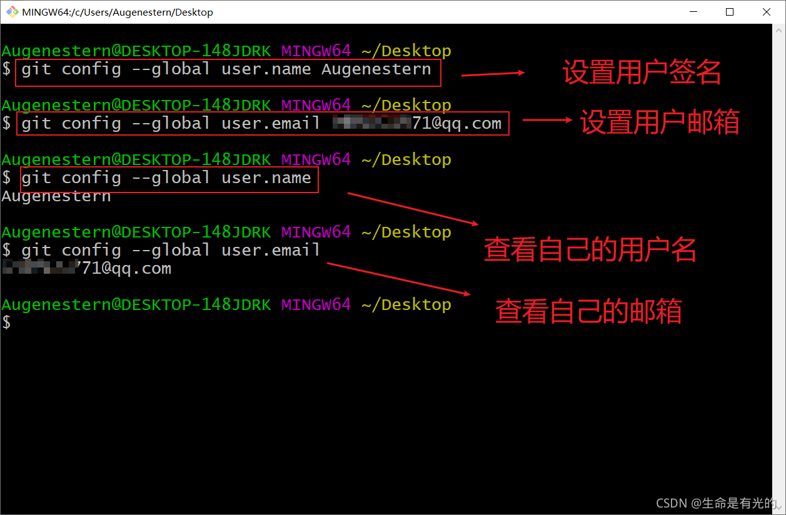

并且在自己 `C:\Users\Augenestern` 下有个 `.gitconfig `文件，打开里面就是我们设置的用户签名

#### 3.1.2 说明

签名的作用是区分不同操作者身份。用户的签名信息在每一个版本的提交信息中能够看到，以此确认本次提交是谁做的。==Git 首次安装必须设置一下用户签名，否则无法提交代码==。

注意：这里设置用户签名和将来登录 GitHub（或其他代码托管中心）的账号没有任何关系。

### 3.2 初始化本地库
基本语法：`git init`

### 3.3 查看本地库状态

基本语法：`git status`

* 首次查看，工作区没有任何文件

#### 3.3.1 新增文件

语法：`vim hello.txt` ， 然后按 i 键进入 INSERT，要想复制粘贴 ，需要先按 esc 键，之后 `yy `复制，`p `粘贴

文件内容输入完毕，需要先按:, 输入 `wq`，然后才算完成新增文件，再次查看

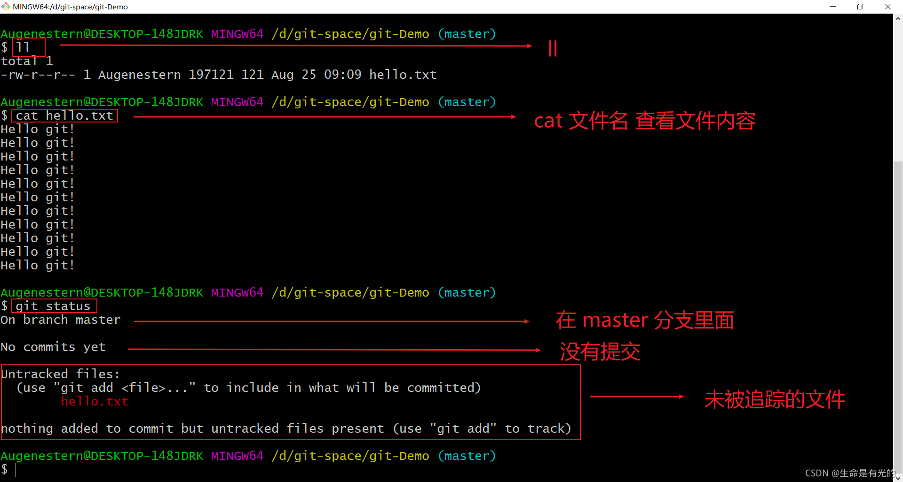

### 3.4 添加暂存区

#### 3.4.1 将工作区的文件添加到暂存区
基本语法：`git add 文件名`

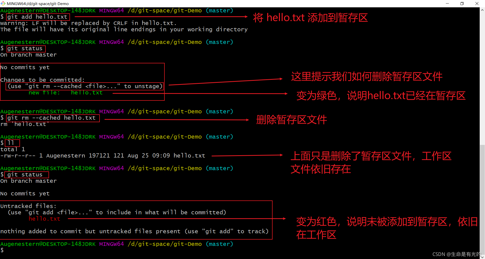

### 3.5 提交本地库

#### 3.5.1 将工作区的文件提交到本地库
基本语法：`git commit -m` "日志信息" 文件名

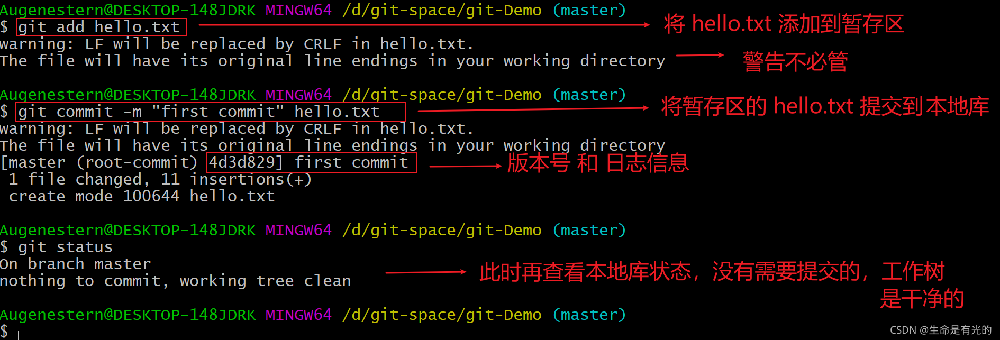

### 3.6 修改文件

语法：`vim 文件名`

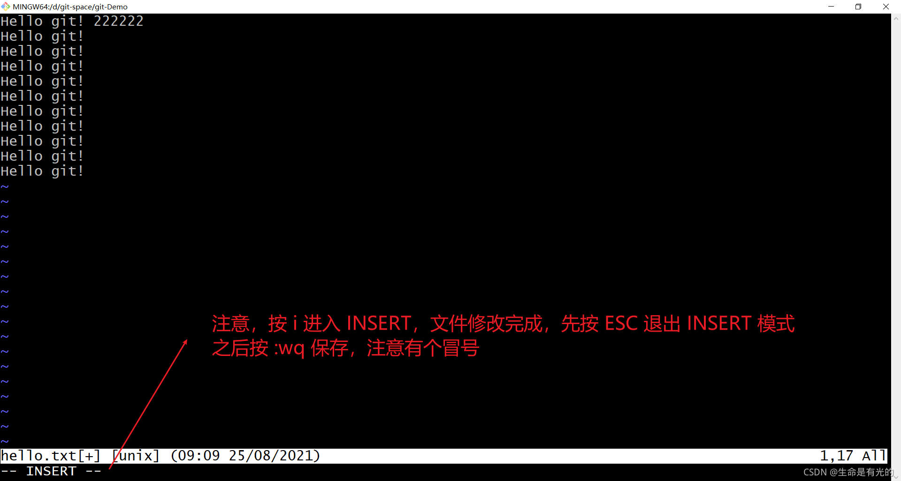

### 3.7 历史版本

#### 3.7.1 查看历史版本
基本语法：

* `git reflog` 查看版本信息

* `git log` 查看版本详细信息

  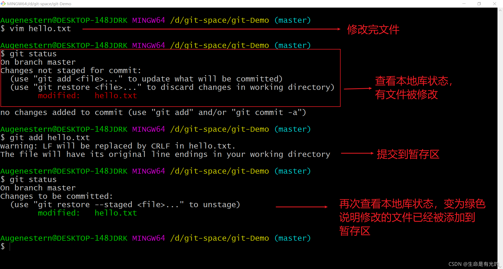

  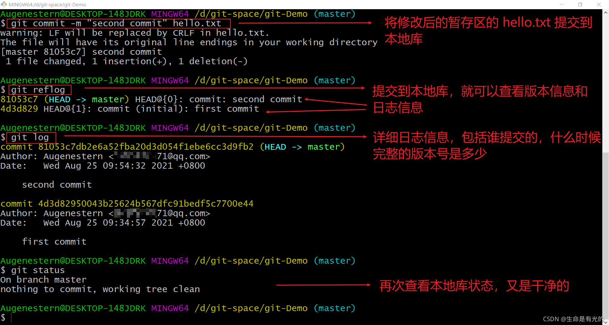

但是我们工作区的 hello.txt 始终只有一个文件存在

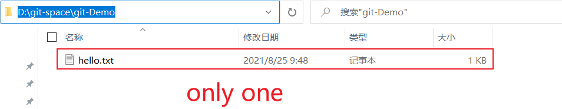

3.7.2、版本穿梭
语法：`git reset --hard` 版本号

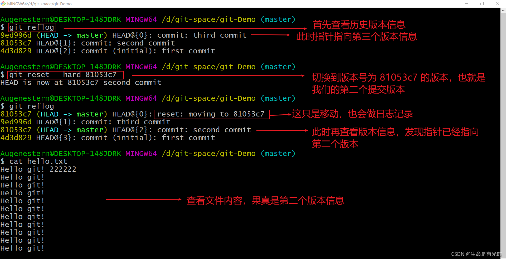

### 3.8 切换版本原理

Git 切换版本，底层其实是移动的 HEAD 指针，具体原理如下图所示

HEAD 指针指向 master 分支，master 分支指向 first 版本，

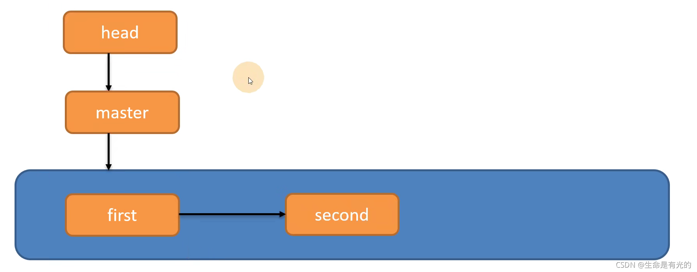

之后有了 second 版本，master 指针指向 second 版本

之后有了 third 版本，master 指针指向 third 版本

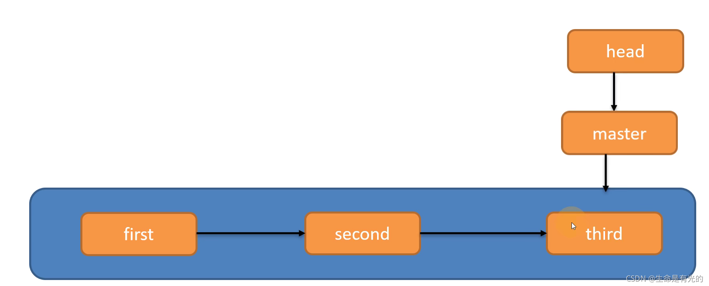

如果我们想穿越回去，只需要让 master 指针指向 first 版本或者 second 版本

## 4 Git 分支

### 4.1 什么是分支

* 在版本控制过程中，同时推进多个任务，为每个任务，我们就可以创建每个任务的单独分支
* 使用分支意味着程序员可以把自己的工作从开发主线上分离开来，开发自己分支的时候，不会影响主线分支的运行
* 对于初学者而言，分支可以简单理解为副本，一个分支就是一个单独的副本

### 4.2 分支的好处

* 同时并行推进多个功能开发，提高开发效率。

* 各个分支在开发过程中，如果某一个分支开发失败，不会对其他分支有任何影响。失败的分支删除重新开始即可。

### 4.3 分支的操作

|       命令名称        |             作用             |
| :-------------------: | :--------------------------: |
|  `git branch 分支名`  |           创建分支           |
|    `git branch -v`    |           查看分支           |
| `git checkout 分支名` |           切换分支           |
|  `git merge 分支名`   | 把指定的分支合并到当前分支上 |

#### 1.3.1 查看分支

基本语法：`git branch -v`

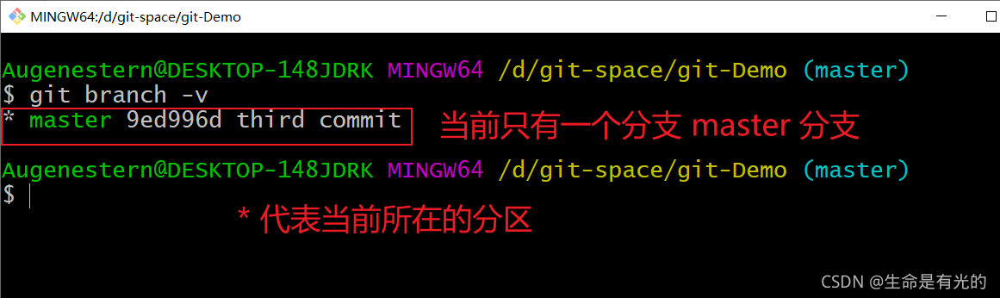

#### 1.3.2 创建分支

基本语法：`git branch 分支名`

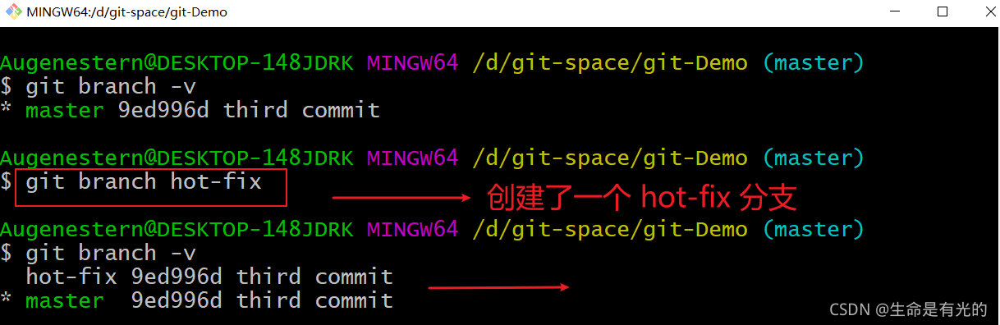

#### 1.3.3 切换分支
基本语法：`git checkout 分支名`

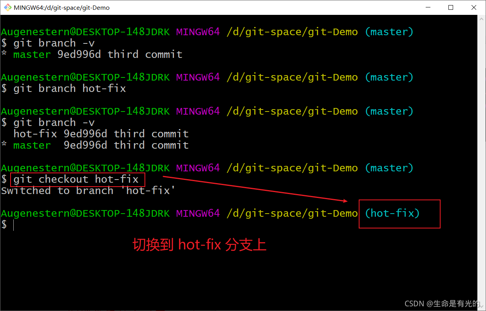

#### 1.3.4 修改分支

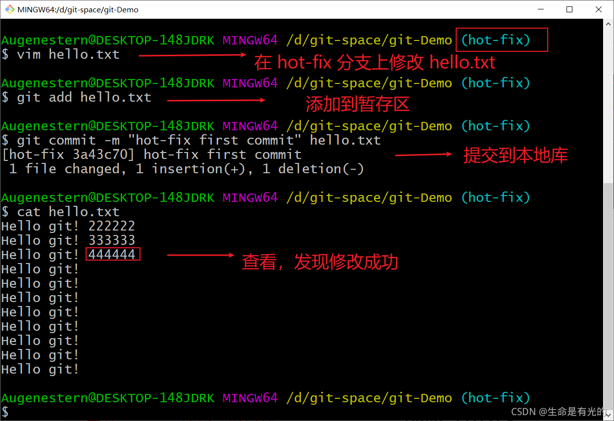

#### 1.3.5 合并分支

基本语法：`git merge 分支名`

##### 正常合并不冲突

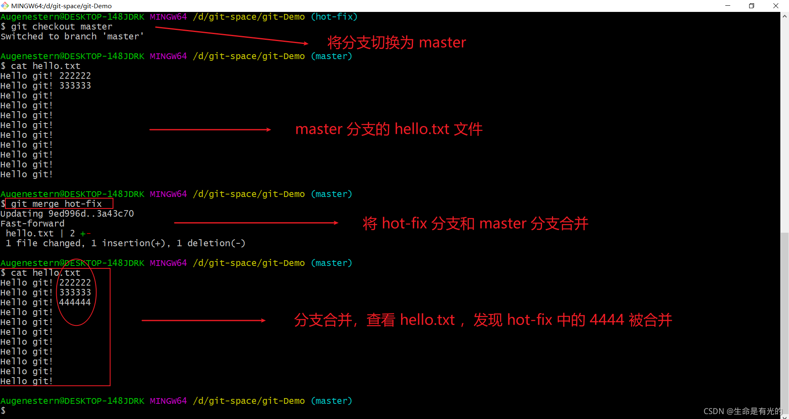

##### 合并产生冲突

冲突产生的原因：

* 合并分支时，两个分支在==同一个文件的同一个位置==有两套完全不同的修改。
* 有两套完全不同的修改。 Git 无法替我们决定使用哪一个。必须 人为决定新代码内容。

例如，我们首先在 master 分支的倒数第二行进行修改，并将其添加到暂存区，再提交到本地库

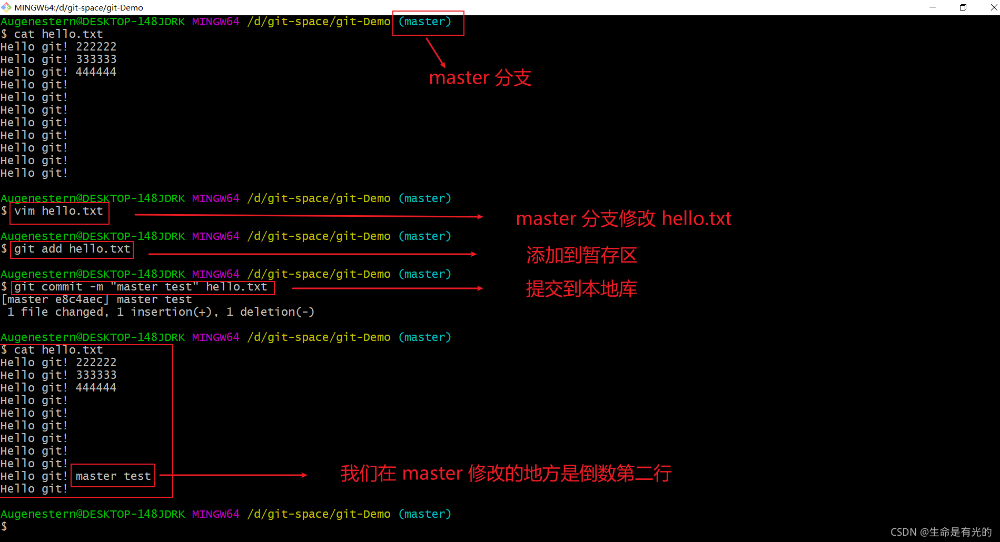

接着，我们去 hot-fix 分支的倒数第一行进行修改，并将其添加到暂存区，再提交到本地库

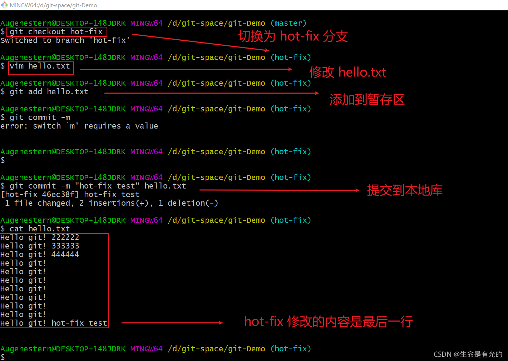

之后我们在 master 分支上合并 hot-fix 分支，发现产生冲突

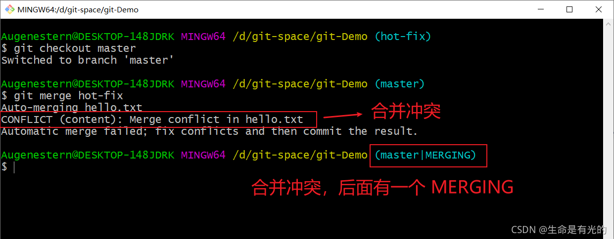

##### 解决冲突

编辑有冲突的文件，删除特殊符号，决定要使用的内容

特殊符号：`<<<<<< HEAD` 当前分支的代码` =======` 合并过来的代码 `>>>>>>>hot-fix`

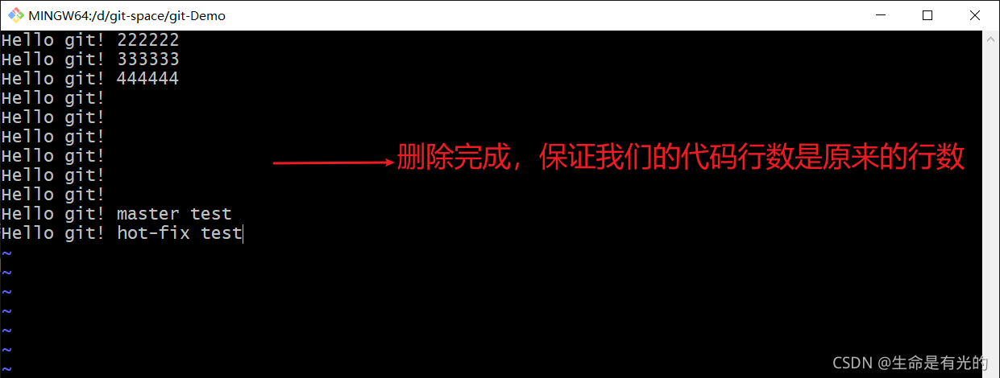

删除完成之后保存，再次添加到暂存区，并再次提交到本地库 (注意：此时使用 git commit 命令时候不能带文件名)

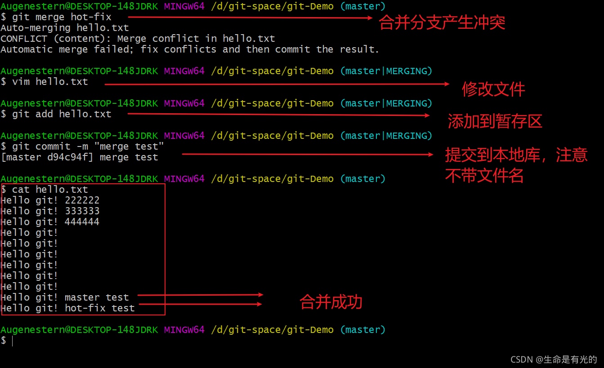

## 5 Git 团队协作机制
### 5.1 团队内协作

举个例子：岳不群首先用 git 初始化自己的本地库，写了一套华山剑法，利用push 命令将自己的本地库推送到代码托管中心 (Github、Gitee)，大弟子令狐冲通过 clone 克隆命令完整的复制到自己的本地库，令狐冲修改两招之后将自己的本地库再次 push 到代码托管中心，这样岳不群就可以通过 pull 命令拉取令狐冲修改的代码 来更新自己的本地库。

2.2、跨团队协作

令狐冲请东方不败改代码，东方不败通过 fork 命令从岳不群的的远程库中拿取代码，再通过 clone 克隆命令到自己的本地库，修改完成后使用 push 推送到在自己的远程库，使用 Pull request 拉取请求给岳不群，岳不群审核完成后使用 merge 命令合并对方的代码到自己的远程库中，再通过 pull 命令到自己的本地库中，这样修改过后的华山剑法岳不群和令狐冲就都可以使用了。

3、Github
3.1、创建远程仓库
3.1.1、Github 远程仓库

3.1.2、Gitee 远程仓库

3.2、远程仓库操作
命令名称	作用
git remote -v	查看当前所有远程地址别名
git remote add 别名 远程地址	起别名
git push 别名 分支	推送本地分支上的内容克隆到本地
git clone 远程地址	将远程仓库的内容克隆到本地
git pull 远程库地址别名 远程分支名	将远程仓库对于分支最新内容拉下来后与当前本地分支直接合并
3.2.1、创建远程仓库别名
①、Gihub
基本语法：

git remote -v 查看当前所有远程地址别名
git remote add 别名 远程地址 起别名

注意：起的别名最好和本地库的名称一致

②、Gitee

3.2.2、推送本地分支到远程仓库
基本语法：git push 别名 分支

我们输入 gitee 的用户名和密码，会提示推送成功，我们在 gitee 上查看我们的 git-demo 仓库，发现有我们推送的 hello.txt 文件

3.2.3、拉取远程库分支到本地库
语法：git pull 别名 分支

我们在远程库进行 hello.txt 的文件修改

然后在本地库将远程库的代码 拉取

3.2.3、克隆远程仓库到本地
基本语法：git clone 远程地址

我们另一台用户需要克隆我们的远程仓库到他的本地库，由于是使用一台电脑模拟，所以在克隆之前需要在 凭据管理器下删除我们之前的 gitee 凭据

我们新建一个文件夹 git-clone，然后在此文件夹下右键 git bash here，之后进行克隆

3.3、邀请加入团队
3.3.1、Gitee
我们在 git-clone (假设这是大弟子令狐冲) 文件夹里面进行代码修改，修改完后添加到暂存区，再提交到本地库，之后 push 到我们的远程库

我们在 git-demo 仓库点击管理 -> 仓库成员管理 -> 添加仓库成员 -> 邀请用户

我们在第二哥 gitee 账号里面可以接收到如下图：

令狐成成为仓库开发者被拉入团队后，我们再次在令狐冲文件夹使用进行 push

push 到远程库成功，我们在远程库查看

3.3.2、Github

填入想要合作的人

复制地址并发给该用户

在 atguigulinghuchong 这个账号 中的 地址 栏 复制 收到邀请 的 链接 ，点击接受邀请。

3.4、跨团队协作
3.4.1、Gitee
将远程仓库的地址复制发给邀请跨团队协作的人，比如东方不败。

在东方不败的 Gitee 账号里的地址栏复制收到的链接，然后点击 Fork 将项目叉到自己的本地仓库

接下来点击上方的 Pull Requests 请求，并创建一个新的请求 。

合并之后我们在岳不群的 git-demo 下就可以看到东方不败的代码

3.4.2、Github
将远程仓库的地址复制发给邀请跨团队协作的人，比如东方不败。

在东方不败的 GitHub 账号里的地址栏复制收到的链接，然后点击 Fork 将项目叉到自己的本地仓库

东方不败就可以在线编辑叉取过来的文件。编辑完毕后，填写描述信息并点击左下角绿色按钮提交。

3.5、SSH 免密登录
3.5.1、Gitee
在 C 盘 User 自己的账户下右键 git bash here，ssh-keygen -t rsa -C 自己的邮箱签名

这样就会生成 .ssh 文件夹，里面有私钥和公钥

之后在 gitee 上添加公钥

这样我们可以借助 ssh 链接来拉取和推送代码，并且不需要进行登录

3.5.2、Github