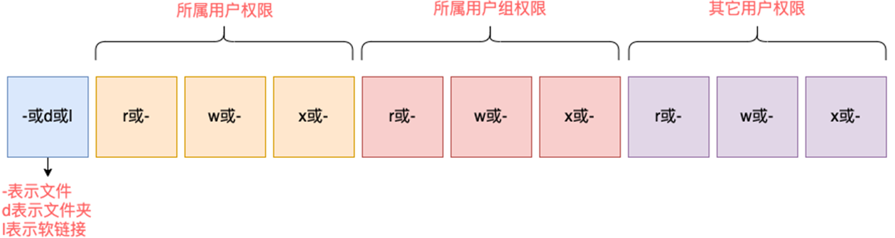

# Linux

## 第02章 Linux基础命令

### 2.1 Linux的目录结构

- `/`, 根目录是最顶级的目录了
- Linux只有一个顶级目录: `/`
- 路径描述的层次关系同样适用`/`来表示
- `/home/itheima/a.txt`, 表示根目录下的home文件夹内有itheima文件夹, 内有a.txt

### 2.2 ls命令

功能: 列出文件夹信息

语法: `ls [-l -h -a] [参数]`

- 参数: 被查看的文件夹, 不提供参数, 表示查看当前工作目录
- -l, 以列表形式查看
- -h, 配合-l, 以更加人性化的方式显示文件大小
- -a, 显示隐藏文件

### 2.3 隐藏文件、文件夹

在Linux中以`.`开头的, 均是隐藏的。

默认不显示出来, 需要`-a`选项才可查看到。

### 2.3 pwd命令

功能: 展示当前工作目录

语法: `pwd`

### 2.4 cd命令

功能: 切换工作目录

语法: `cd [目标目录]`

参数: 目标目录, 要切换去的地方, 不提供默认切换到`当前登录用户HOME目录`

### 2.5 HOME目录

每一个用户在Linux系统中都有自己的专属工作目录, 称之为HOME目录。

- 普通用户的HOME目录, 默认在: `/home/用户名`

- root用户的HOME目录, 在: `/root`

FinalShell登陆终端后, 默认的工作目录就是用户的HOME目录

### 2.6 相对路径、绝对路径

- 相对路径, 非`/`开头的称之为相对路径

  相对路径表示以`当前目录`作为起点, 去描述路径, 如`test/a.txt`, 表示当前工作目录内的test文件夹内的a.txt文件

- 绝对路径, 以`/`开头的称之为绝对路径

  绝对路径从`根`开始描述路径

### 2.7 特殊路径符

- `.`, 表示当前, 比如./a.txt, 表示当前文件夹内的`a.txt`文件
- `..`, 表示上级目录, 比如`../`表示上级目录, `../../`表示上级的上级目录
- `~`, 表示用户的HOME目录, 比如`cd ~`, 即可切回用户HOME目录

### 2.8 mkdir命令

功能: 创建文件夹

语法: `mkdir [-p] 参数`

- 参数: 被创建文件夹的路径
- 选项: -p, 可选, 表示创建前置路径

### 2.9 touch命令

功能: 创建文件

语法: `touch 参数`

- 参数: 被创建的文件路径

### 2.10 cat命令

功能: 查看文件内容

语法: `cat 参数`

- 参数: 被查看的文件路径

### 2.11 more命令

功能: 查看文件, 可以支持翻页查看

语法: `more 参数`

- 参数: 被查看的文件路径
- 在查看过程中: 
  - `空格`键翻页
  - `q`退出查看

### 2.12 cp命令

功能: 复制文件、文件夹

语法: `cp [-r] 参数1 参数2`

- 参数1, 被复制的
- 参数2, 要复制去的地方
- 选项: -r, 可选, 复制文件夹使用

示例: 

- cp a.txt b.txt, 复制当前目录下a.txt为b.txt
- cp a.txt test/, 复制当前目录a.txt到test文件夹内
- cp -r test test2, 复制文件夹test到当前文件夹内为test2存在

### 2.13 mv命令

功能: 移动文件、文件夹

语法: `mv 参数1 参数2`

- 参数1: 被移动的
- 参数2: 要移动去的地方, 参数2如果不存在, 则会进行改名

### 2.14 rm命令

功能: 删除文件、文件夹

语法: `rm [-r -f] 参数...参数`

- 参数: 支持多个, 每一个表示被删除的, 空格进行分隔
- 选项: -r, 删除文件夹使用
- 选项: -f, 强制删除, 不会给出确认提示, 一般root用户会用到

> rm命令很危险, 一定要注意, 特别是切换到root用户的时候。

### 2.15 which命令

功能: 查看命令的程序本体文件路径

语法: `which 参数`

- 参数: 被查看的命令

### 2.16 find命令

功能: 搜索文件

语法1按文件名搜索: `find 路径 -name 参数`

- 路径, 搜索的起始路径
- 参数, 搜索的关键字, 支持通配符*,  比如: `*`test表示搜索任意以test结尾的文件

### 2.17 grep命令

功能: 过滤关键字

语法: `grep [-n] 关键字 文件路径`

- 选项-n, 可选, 表示在结果中显示匹配的行的行号。
- 参数, 关键字, 必填, 表示过滤的关键字, 带有空格或其它特殊符号, 建议使用””将关键字包围起来
- 参数, 文件路径, 必填, 表示要过滤内容的文件路径, 可作为内容输入端口

> 参数文件路径, 可以作为管道符的输入

### 2.18 wc命令

功能: 统计

语法: `wc [-c -m -l -w] 文件路径`

- 选项, -c, 统计bytes数量
- 选项, -m, 统计字符数量
- 选项, -l, 统计行数
- 选项, -w, 统计单词数量
- 参数, 文件路径, 被统计的文件, 可作为内容输入端口


> 参数文件路径, 可作为管道符的输入

### 2.19 管道符|

写法: `|`

功能: 将符号左边的结果, 作为符号右边的输入

示例: 

`cat a.txt | grep itheima`, 将cat a.txt的结果, 作为grep命令的输入, 用来过滤`itheima`关键字

可以支持嵌套: 

`cat a.txt | grep itheima | grep itcast`

### 2.20 echo命令

功能: 输出内容

语法: `echo 参数`

- 参数: 被输出的内容

### 2.21 `反引号

功能: 被两个反引号包围的内容, 会作为命令执行

示例: 

- echo \`pwd\`, 会输出当前工作目录

### 2.22 tail命令

功能: 查看文件尾部内容

语法: `tail [-f] 参数`

- 参数: 被查看的文件
- 选项: -f, 持续跟踪文件修改

### 2.23 head命令

功能: 查看文件头部内容

语法: `head [-n] 参数`

- 参数: 被查看的文件
- 选项: -n, 查看的行数

### 2.24 重定向符

功能: 将符号左边的结果, 输出到右边指定的文件中去

- `>`, 表示覆盖输出
- `>>`, 表示追加输出

## 第03章 用户和权限

### 3.1 root用户

#### `su` 命令

* 语法: `su [-] [用户名]`
  * 符号是可选的, 表示是否在切换用户后加载环境变量（后续讲解）, 建议带上
  * 参数: 用户名, 表示要切换的用户, 用户名也可以省略, 省略表示切换到root
  * 切换用户后, 可以通过exit命令退回上一个用户, 也可以使用快捷键: ctrl + d

#### `sudo` 命令

为普通命令授权, 临时以root身份运行

* 配置sudo认证
  1. 切换到root用户, 执行`visudo`命令, 会自动通过vi编辑器打开: /etc/sudoers
  2. 在文件最后添加 `itheima ALL = (ALL)    NOPASSWD: ALL`
  3. 运行`sudo`命令将不再需要输入密码

### 3.2 用户管理

#### 概述

Linux系统中可以: 

* 配置多个用户
* 配置多个用户组
* 用户可以加入多个用户组中

Linux中关于权限的管控级别有2个级别, 分别是: 

* 针对用户的权限控制
* 针对用户组的权限控制

比如, 针对某文件, 可以控制用户的权限, 也可以控制用户组的权限。

所以, 我们需要学习在Linux中进行用户、用户组管理的基础命令, 为后面学习权限控制打下基础。

#### 用户组管理

以下命令需root用户执行

* 创建用户组  `groupadd [用户组名]`

* 删除用户组  `groupdel [用户组名]`

为后续演示, 我们创建一个itcast用户组: groupadd itcast

#### 用户管理

以下命令需root用户执行

* 创建用户

  `useradd [-g -d] [用户名]`

  * 选项: -g指定用户的组, 不指定-g, 会创建同名组并自动加入, 指定-g需要组已经存在, 如已存在同名组, 必须使用-g

  * 选项: -d指定用户HOME路径, 不指定, HOME目录默认在: /home/用户名

* 删除用户

  `userdel [-r] [用户名]`

  * 选项: -r, 删除用户的HOME目录, 不使用-r, 删除用户时, HOME目录保留

* 查看用户所属组

  `id [用户名]`

  * 参数: 用户名, 被查看的用户, 如果不提供则查看自身

* 修改用户所属组

  `usermod -aG [用户组] [用户名]`

  * 将指定用户加入指定用户组

* 查看用户

  `getent` 查看系统用户信息

  * `getent passwd` 查看用户名:密码(x):用户ID:组ID:描述信息(无用):HOME目录:执行终端(默认bash)
  * `getent group` 查看用户组

#### 用户权限

* 认知权限信息

  权限细节总共分为10个槽位

  

  > 举例: drwxr-xr-x, 表示: 
  >
  > * 这是一个文件夹, 首字母d表示
  > * 所属用户(右上角图序号2)的权限是: 有r有w有x, rwx
  > * 所属用户组(右上角图序号3)的权限是: 有r无w有x, r-x （-表示无此权限）
  > * 其它用户的权限是: 有r无w有x, r-x

* rwx

  * r表示读权限
  * w表示写权限
  * x表示执行权限

  针对文件、文件夹的不同, rwx的含义有细微差别

  * r, 针对文件可以查看文件内容
  * 针对文件夹, 可以查看文件夹内容, 如ls命令
  * w, 针对文件表示可以修改此文件
  * 针对文件夹, 可以在文件夹内: 创建、删除、改名等操作
  * x, 针对文件表示可以将文件作为程序执行
  * 针对文件夹, 表示可以更改工作目录到此文件夹, 即cd进入

#### 权限修改

##### chmod

使用chmod命令, 修改文件、文件夹的权限信息。

注意, 只有文件、文件夹的所属用户或root用户可以修改。

1. 语法

   `chmod [-R] [权限] [文件或文件夹]` 

   * -R为对文件夹内的全部内容应用同样的操作

   > `chmod u=rwx,g=rx,o=x hello.txt`, 将文件权限修改为: rwxr-x--x
   >
   > * 其中: u表示user所属用户权限, g表示group组权限, o表示other其它用户权限
   >
   > `chmod -R u=rwx,g=rx,o=x test`, 将文件夹test以及文件夹内全部内容权限设置为: rwxr-x--x
   >
   > * 除此之外, 还有快捷写法: chmod 751 hello.txt 将hello.txt的权限修改为751

2. 权限的数字序号

	权限可以用3位数字来代表, 第一位数字表示用户权限, 第二位表示用户组权限, 第三位表示其它用户权限。

	数字的细节如下: r记为4, w记为2, x记为1, 可以有: 

    | 数字 |    权限    | 标记 |
    | :--: | :--------: | :--: |
    |  0   | 无任何权限 | ---  |
    |  1   | 仅有x权限  | --x  |
    |  2   | 仅有w权限  | -w-  |
    |  3   | 有w和x权限 | -wx  |
    |  4   | 仅有r权限  | r--  |
    |  5   | 有r和x权限 | r-x  |
    |  6   | 有r和w权限 | rw-  |
    |  7   | 有全部权限 | rwx  |

##### chown

使用chown命令, 可以修改文件、文件夹的所属用户和用户组

普通用户无法修改所属为其它用户或组, 所以此命令只适用于root用户执行

1. 语法

   `chown [-R] [用户] [:] [用户组] [文件或文件夹]`

   * 选项, -R, 同chmod, 对文件夹内全部内容应用相同规则
   * 选项, 用户, 修改所属用户
   * 选项, 用户组, 修改所属用户组
   * : 用于分隔用户和用户组

## 第04章 实用操作

### 4.1 快捷键

#### 强制停止

`ctrl + c`

1. 程序运行时强制停止
2. 命令输入错误, 重新输入

#### 退出/登出

`ctrl + d`

1. 退出账户登录
2. 退出某些特定程序的专属页面
3. 不能用于退出vi/vim

#### 历史命令搜索

`history`

* 查看历史输入过的命令

`! + [前缀]`

* 自动执行上次匹配前缀的命令

`ctrl + r`

* 输入内容匹配历史命令
* 回车键可以直接执行
* 键盘左右键, 可以得到此命令（不执行）

#### 光标移动快捷键

`ctrl + a`

* 跳到命令开头

`ctrl + e`

* 跳到命令结尾

`ctrl + <-`  

* 向左跳一个单词

`ctrl + ->`

* 向右跳一个单词

#### 清屏

通过快捷键`ctrl + l`, 可以清空终端内容

或通过命令`clear`得到同样效果

### 4.2 软件安装/卸载

#### apt命令

`apt [-y] [install | remove | search] [软件名称]`

* apt install wget, 安装wget
* apt remove wget, 移除wget
* apt search wget, 搜索wget

### 4.3 systemctl

#### 语法

`systemtl [start | stop | status | enable | disable] [服务名]`

* start -> 启动
* stop -> 关闭
* status -> 查看状态
* enable -> 开启开机自启
* disable -> 关闭开机自启

#### 功能

##### 内置服务

系统内置的服务比较多, 比如: 

* NetworkManager, 主网络服务

* network, 副网络服务

* firewalld, 防火墙服务

* sshd, ssh服务（FinalShell远程登录Linux使用的就是这个服务）

##### 第三方软件

`yum install -y ntp`, 安装ntp软件

* 可以通过ntpd服务名, 配合systemctl进行控制

`yum install -y httpd`, 安装apache服务器软件

* 可以通过httpd服务名, 配合systemctl进行控制

### 4.4 软连接

#### 语法

`ln -s [参数1] [参数2]`

* -s, 创建软链接
* 参数1: 被链接的文件或文件夹
* 参数2: 要链接去的目的地

> 实例:
>
> * `ln -s /etc/yum.conf ~/yum.conf`
> * `ln -s /etc/yum ~/yum`

#### 功能

在系统中创建软链接, 可以将文件、文件夹链接到其它位置

软连接可以将文件、文件夹链接到其它位置

链接只是一个指向, 并不是物理移动, 类似Windows系统的快捷方式

### 4.5 日期/时区

#### date命令

通过date命令可以在命令行中查看系统的时间

##### 语法

`date [-d] [+格式化字符串]`

* -d 按照给定的字符串显示日期, 一般用于日期计算

* 格式化字符串: 通过特定的字符串标记, 来控制显示的日期格式

  * %Y  年

  * %y  年份后两位数字 (00..99)

  * %m  月份 (01..12)

  * %d  日 (01..31)

  * %H  小时 (00..23)

  * %M  分钟 (00..59)

  * %S  秒 (00..60)

  * %s  自 1970-01-01 00:00:00 UTC 到现在的秒数

> ````
> date +%Y-%m-%d-%H-%M-%S
> 
> ->  2022-11-11-10-07-02
> ````

##### 日期加减

* -d选项, 可以按照给定的字符串显示日期, 一般用于日期计算
  * `date -d "+1 day" +%Y%m%d`    #显示后一天的日期
  * `date -d "-1 day" +%Y%m%d`    #显示前一天的日期
  * `date -d "+1 month" +%Y%m%d`  #显示下个月的日期
  * `date -d "-1 month" +%Y%m%d`  #显示上个月的日期
  * `date -d "+1 year" +%Y%m%d`   #显示下一年的日期
  * `date -d "-1 year" +%Y%m%d`   #显示前一年的日期

#### 修改Linux时区

使用root权限, 执行如下命令, 修改时区为东八区时区

```
rm -f /etc/locatime
sudo ln -s /usr/share/zoneinfo/Asia/Shanghai/etc/localtime
```

将系统自带的localtime文件删除, 并将/usr/share/zoneinfo/Asia/Shanghai文件链接为localtime文件即可

#### npt程序

我们可以通过ntp程序自动校准系统时间

安装ntp: `apt -get install ntp`

1. 启动并设置开机自启: 

   `systemctl start ntpd`

   `systemctl enable ntpd`

   当ntpd启动后会定期的帮助我们联网校准系统的时间

2. 也可以手动校准（需root权限）: ntpdate -u ntp.aliyun.com

   通过阿里云提供的服务网址配合ntpdate（安装ntp后会附带这个命令）命令自动校准

### 4.6 IP地址/主机

#### IP地址

每一台联网的电脑都会有一个地址, 用于和其它计算机进行通讯

IP地址主要有2个版本, V4版本和V6版本（V6很少用, 课程暂不涉及）

IPv4版本的地址格式是: a.b.c.d, 其中abcd表示0~255的数字, 如192.168.88.101就是一个标准的IP地址

可以通过命令: ifconfig, 查看本机的ip地址, 如无法使用ifconfig命令, 可以安装: yum -y install net-tools

#### 特殊IP地址

* 127.0.0.1, 这个IP地址用于指代本机

* 0.0.0.0, 特殊IP地址
  * 可以用于指代本机
  * 可以在端口绑定中用来确定绑定关系（后续讲解）
  * 在一些IP地址限制中, 表示所有IP的意思, 如放行规则设置为0.0.0.0, 表示允许任意IP访问

#### 主机名

每一台电脑除了对外联络地址（IP地址）以外, 也可以有一个名字, 称之为主机名

无论是Windows或Linux系统, 都可以给系统设置主机名

* `hostname` 查看主机名
* `hostnamectl set-hostname [主机名]` 修改主机名(需root)

### 4.7 网络传输

#### 下载和网络请求

##### ping命令

语法: `ping [-c num] [ip或主机名]`

* 选项: -c, 检查的次数, 不使用-c则无限次数持续检查
* 参数: ip或主机名, 被检查的服务器的ip地址或主机名地址

##### wget命令

非交互式的文件下载器, 可以在命令行内下载网络文件

语法: `wget [-b] [url]`

* 选项: -b, 可选, 后台下载, 会将日志写入到当前工作目录的wget-log文件
* 参数: url, 下载链接

> 注意: 无论下载是否完成, 都会生成要下载的文件, 如果下载未完成, 请及时清理未完成的不可用文件

##### curl命令

可以发送网络请求, 可用于: 下载文件, 获取信息等

语法: `curl [-O] [url]`

* 选项: -O, 用于下载文件, 当url式下载链接时, 可以使用此选项保存文件
* 参数: url, 要发起请求的网络地址

#### 端口

端口, 是设备与外界通讯交流的出入口。端口可以分为: 物理端口和虚拟端口两类 

* 物理端口: 又可称之为接口, 是可见的端口, 如USB接口, RJ45网口, HDMI端口等
* 虚拟端口: 是指计算机内部的端口, 是不可见的, 是用来操作系统和外部进行交互使用的

##### 虚拟端口

计算机程序之间的通讯, 通过IP只能锁定计算机, 但是无法锁定具体的程序

通过端口可以锁定计算机上具体的程序, 确保程序之间进行沟通

Linux系统可以支持65535个端口, 这6万多个端口分为3类进行使用:  

* 公认端口: 1~1023, 通常用于一些系统内置或知名程序的预留使用, 如SSH服务的22端口, HTTPS服务的443端 口 非特殊需要, 不要占用这个范围的端口
* 注册端口: 1024~49151, 通常可以随意使用, 用于松散的绑定一些程序/服务 
* 动态端口: 49152~65535, 通常不会固定绑定程序, 而是当程序对外进行网络链接时, 用于临时使用
  * 计算机A的微信连接计算机B的微信, A使用的50001即动态端口, 临时找一个端口作为出口 计算机B的微信使用端口5678, 即注册端口, 长期绑定此端口等待别人连接

##### 查看端口占用

可以通过Linux命令去查看端口的占用情况

* 使用nmap命令, 安装nmap:  apt-get install nmap 
* 语法: `nmap [被查看的IP地址]`

可以通过netstat命令查看指定端口的占用情况

* 安装netstat: apt-get install net-tools

* 语法: `netstat [-anp|grep] [端口号]`

### 4.8 进程管理

#### 进程

程序运行在操作系统中, 是被操作系统所管理的。 为管理运行的程序, 每一个程序在运行的时候, 便被操作系统注册为系统中的一个: 进程 并会为每一个进程都分配一个独有的: 进程ID（进程号）

#### 查看进程

可以通过ps命令查看Linux系统中的进程信息 

语法:  `ps [-e -f]`

* 选项: -e, 显示出全部的进程 
* 选项: -f, 以完全格式化的形式展示信息（展示全部信息） 
* 一般来说, 固定用法就是:  ps -ef 列出全部进程的全部信息

#### 关闭进程

Linux中, 可以通过kill命令关闭进程。 

语法: `kill [-9] [进程ID]`

* 选项: -9, 表示强制关闭进程。不使用此选项会向进程发送信号要求其关闭, 但是否关闭看进程自身的处理机

### 4.9 主机状态

使用`top`命令

使用`htop`命令替代

### 4.10 环境变量

环境变量是操作系统（Windows、Linux、Mac）在运行的时候, 记录的一些关键性信息, 用以辅助系统运行

在Linux系统中执行: env命令即可查看当前系统中记录的环境变量

环境变量是一种KeyValue型结构, 即名称和值

#### 环境变量path

PATH记录了系统执行任何命令的搜索路径, 如上图记录了（路径之间以:隔开）:  

* /usr/local/bin 
* /usr/bin
* /usr/local/sbin
* /usr/sbin
* /home/itheima/.local/bin
* /home/itheima/bin 

当执行任何命令, 都会按照顺序, 从上述路径中搜索要执行的程序的本体 比如执行cd命令, 就从第二个目录/usr/bin中搜索到了cd命令, 并执行

#### \$符号

在Linux系统中, \$符号被用于取”变量”的值

环境变量记录的信息, 除了给操作系统自己使用外, 如果我们想要取用, 也可以使用

取得环境变量的值就可以通过语法: `$环境变量名` 来取得 

比如:  `echo $PATH` 就可以取得PATH这个环境变量的值, 并通过echo语句输出出来

#### 自行设置环境变量

自行设置环境变量 Linux环境变量可以用户自行设置, 其中分为: 

* 临时设置, 语法: export 变量名=变量值

* 永久生效
  * 针对当前用户生效, 配置在当前用户的:  ~/.bashrc文件中
  * 针对所有用户生效, 配置在系统的:  /etc/profile文件中
  * 并通过语法: source 配置文件, 进行立刻生效, 或重新登录FinalShell生

#### 自定义环境变量PATH

环境变量PATH这个项目里面记录了系统执行命令的搜索路径。 这些搜索路径我们也可以自行添加到PATH中去

测试:

* 在当前HOME目录内创建文件夹, myenv, 在文件夹内创建文件mkhaha
* 通过vim编辑器, 在mkhaha文件内填入: echo 哈哈哈哈哈
* 完成上述操作后, 随意切换工作目录, 执行mkhaha命令尝试一下, 会发现无法执

修改PATH的值 

* 临时修改PATH: export PATH=\$PATH:/home/itheima/myenv, 再次执行mkhaha, 无论在哪里都能执行了 或将export PATH=\$PATH:/home/itheima/myenv, 填入用户环境变量文件或系统环境变量文件中去

### 4.11 上传/下载

我们可以通过FinalShell工具, 方便的和虚拟机进行数据交换

在FinalShell软件的下方窗体中, 提供了Linux的文件系统视图, 可以方便的: 

* 浏览文件系统, 找到合适的文件, 右键点击下载, 即可传输到本地电脑
* 浏览文件系统, 找到合适的目录, 将本地电脑的文件拓展进入, 即可方便的上传数据到Linux中

#### rz, sz命令

当然, 除了通过FinalShell的下方窗体进行文件的传输以外, 也可以通过rz、sz命令进行文件传输。 rz、sz命令需要安装, 可以通过: yum -y install lrzsz, 即可安装

* rz命令, 进行上传, 语法: `rz`
* sz命令, 进行下载, 语法: `sz [要下载的文件]`
  * 文件会自动下载到桌面的: fsdownload文件夹中

### 4.12 压缩/解压缩

#### 压缩格式 

市面上有非常多的压缩格式

* zip格式: Linux、Windows、MacOS, 常用 • 7zip: Windows系统常用
* rar: Windows系统常用
* tar: Linux、MacOS常用
* gzip: Linux、MacOS常用 

在Windows系统中常用的软件如: winrar、bandizip等软件, 都支持各类常见的压缩格式, 这里不多做讨论。我们现在要学习, 如何在Linux系统中操作: tar、gzip、zip这三种压缩格式, 完成文件的压缩、解压操作

#### tar命令

Linux和Mac系统常用有2种压缩格式，后缀名分别是: 

* .tar，称之为tarball，归档文件，即简单的将文件组装到一个.tar的文件内，并没有太多文件体积的减少，仅仅是简单的封装 
* .gz，也常见为.tar.gz，gzip格式压缩文件，即使用gzip压缩算法将文件压缩到一个文件内，可以极大的减少压缩后的体积

针对这两种格式，使用tar命令均可以进行压缩和解压缩的操作

语法:  `tar [-c -v -x -f -z -C] [参数1 参数2 参数3...]`

* -c，创建压缩文件，用于压缩模式
* -v，显示压缩、解压过程，用于查看进度
* -x，解压模式
* -f，要创建的文件，或要解压的文件，-f选项必须在所有选项中位置处于最后一个
* -z，gzip模式，不使用-z就是普通的tarball格式
* -C，选择解压的目的地，用于解压模式

##### tar压缩

tar的常用组合为: 

* `tar -cvf test.tar 1.txt 2.txt 3.txt` 
  * 将1.txt 2.txt 3.txt 压缩到test.tar文件内
* `tar -zcvf test.tar.gz 1.txt 2.txt 3.txt` 
  * 将1.txt 2.txt 3.txt 压缩到test.tar.gz文件内，使用gzip模式 

注意: 

* -z选项如果使用的话，一般处于选项位第一个
* -f选项，必须在选项位最后一个

##### tar解压

常用的tar解压组合有

* `tar -xvf test.tar`
  * 解压test.tar，将文件解压至当前目录
* `tar -xvf test.tar -C /home/itheima`
  * 解压test.tar，将文件解压至指定目录(/home/itheima)
* `tar -zxvf test.tar.gz -C /home/itheima` 
  * 以Gzip模式解压test.tar.gz，将文件解压至指定目录（/home/itheima） 

注意: 

* -f选项，必须在选项组合体的最后一位
* -z选项，建议在开头位置
* -C选项单独使用，和解压所需的其它参数分开

#### zip命令

##### zip压缩

可以使用zip命令，压缩文件为zip压缩包 

语法: `zip [-r] [参数1 参数2 参数3...]`

* -r，被压缩的包含文件夹的时候，需要使用-r选项，和rm、cp等命令的-r效果一致 

> 示例:  
>
> * `zip test.zip a.txt b.txt c.txt` 
>   * 将a.txt b.txt c.txt 压缩到test.zip文件内
> * `zip -r test.zip test itheima a.txt` 
>   * 将test、itheima两个文件夹和a.txt文件，压缩到test.zip文件内

##### unzip解压

使用unzip命令，可以方便的解压zip压缩包 

语法: `unzip [-d] [参数]`

* -d，指定要解压去的位置，同tar的-C选项
* 参数，被解压的zip压缩包文件

> 示例: 
>
> * `unzip test.zip`
>   * 将test.zip解压到当前目录
> * `unzip test.zip -d /home/itheim`
>   * 将test.zip解压到指定文件夹内（/home/itheima） 多一句没有，少一句不行，用最短时间，教会更实用的技术！ 高级软件人才培训专家 总结总结 1. Linux系统常用的压缩

## 第05章 实战

Null

## 第X章 常用操作

### 软件配置

#### zsh

```shell
# If you come from bash you might have to change your $PATH.
# export PATH=$HOME/bin:/usr/local/bin:$PATH

# Path to your oh-my-zsh installation.
export ZSH="$HOME/.oh-my-zsh"

# Set name of the theme to load --- if set to "random", it will
# load a random theme each time oh-my-zsh is loaded, in which case,
# to know which specific one was loaded, run: echo $RANDOM_THEME
# See https://github.com/ohmyzsh/ohmyzsh/wiki/Themes
ZSH_THEME="robbyrussell"

# Set list of themes to pick from when loading at random
# Setting this variable when ZSH_THEME=random will cause zsh to load
# a theme from this variable instead of looking in $ZSH/themes/
# If set to an empty array, this variable will have no effect.
# ZSH_THEME_RANDOM_CANDIDATES=( "robbyrussell" "agnoster" )

# Uncomment the following line to use case-sensitive completion.
# CASE_SENSITIVE="true"

# Uncomment the following line to use hyphen-insensitive completion.
# Case-sensitive completion must be off. _ and - will be interchangeable.
# HYPHEN_INSENSITIVE="true"

# Uncomment one of the following lines to change the auto-update behavior
# zstyle ':omz:update' mode disabled  # disable automatic updates
zstyle ':omz:update' mode auto      # update automatically without asking
# zstyle ':omz:update' mode reminder  # just remind me to update when it's time

# Uncomment the following line to change how often to auto-update (in days).
# zstyle ':omz:update' frequency 13

# Uncomment the following line if pasting URLs and other text is messed up.
# DISABLE_MAGIC_FUNCTIONS="true"

# Uncomment the following line to disable colors in ls.
# DISABLE_LS_COLORS="true"

# Uncomment the following line to disable auto-setting terminal title.
# DISABLE_AUTO_TITLE="true"

# Uncomment the following line to enable command auto-correction.
ENABLE_CORRECTION="true"

# Uncomment the following line to display red dots whilst waiting for completion.
# You can also set it to another string to have that shown instead of the default red dots.
# e.g. COMPLETION_WAITING_DOTS="%F{yellow}waiting...%f"
# Caution: this setting can cause issues with multiline prompts in zsh < 5.7.1 (see #5765)
COMPLETION_WAITING_DOTS="true"

# Uncomment the following line if you want to disable marking untracked files
# under VCS as dirty. This makes repository status check for large repositories
# much, much faster.
# DISABLE_UNTRACKED_FILES_DIRTY="true"

# Uncomment the following line if you want to change the command execution time
# stamp shown in the history command output.
# You can set one of the optional three formats:
# "mm/dd/yyyy"|"dd.mm.yyyy"|"yyyy-mm-dd"
# or set a custom format using the strftime function format specifications,
# see 'man strftime' for details.
# HIST_STAMPS="mm/dd/yyyy"

# Would you like to use another custom folder than $ZSH/custom?
# ZSH_CUSTOM=/path/to/new-custom-folder

# Which plugins would you like to load?
# Standard plugins can be found in $ZSH/plugins/
# Custom plugins may be added to $ZSH_CUSTOM/plugins/
# Example format: plugins=(rails git textmate ruby lighthouse)
# Add wisely, as too many plugins slow down shell startup.
plugins=(git command-not-found z zsh-syntax-highlighting zsh-autosuggestions sudo colored-man-pages vi-mode)

source $ZSH/oh-my-zsh.sh

# User configuration

# export MANPATH="/usr/local/man:$MANPATH"

# You may need to manually set your language environment
# export LANG=en_US.UTF-8

# Preferred editor for local and remote sessions
# if [[ -n $SSH_CONNECTION ]]; then
#   export EDITOR='vim'
# else
#   export EDITOR='mvim'
# fi

# Compilation flags
# export ARCHFLAGS="-arch x86_64"

# Set personal aliases, overriding those provided by oh-my-zsh libs,
# plugins, and themes. Aliases can be placed here, though oh-my-zsh
# users are encouraged to define aliases within the ZSH_CUSTOM folder.
# For a full list of active aliases, run `alias`.
#
# Example aliases
# alias zshconfig="mate ~/.zshrc"
# alias ohmyzsh="mate ~/.oh-my-zsh"
eval "$(oh-my-posh init zsh --config ~/.poshthemes/prokyon.omp.json)"
# eval $(thefuck --alias)
export EDITOR=/usr/bin/nvim
export EDITOR=/usr/bin/nvim

# vim mode config
# ---------------

# Activate vim mode.
bindkey -v

# Remove mode switching delay.
KEYTIMEOUT=5

# Change cursor shape for different vi modes.
function zle-keymap-select {
  if [[ ${KEYMAP} == vicmd ]] ||
     [[ $1 = 'block' ]]; then
    echo -ne '\e[1 q'

  elif [[ ${KEYMAP} == main ]] ||
       [[ ${KEYMAP} == viins ]] ||
       [[ ${KEYMAP} = '' ]] ||
       [[ $1 = 'beam' ]]; then
    echo -ne '\e[5 q'
  fi
}
zle -N zle-keymap-select

# Use beam shape cursor on startup.
echo -ne '\e[5 q'

# Use beam shape cursor for each new prompt.
preexec() {
   echo -ne '\e[5 q'
}
```


#### i3

> 参考官网[i3:Debian和Ubuntu仓库 (i3wm.org)](https://i3wm.org/docs/repositories.html)

1. 配置apt仓库并安装

   ```shell
   $ /usr/lib/apt/apt-helper download-file https://debian.sur5r.net/i3/pool/main/s/sur5r-keyring/sur5r-keyring_2022.02.17_all.deb keyring.deb SHA256:52053550c4ecb4e97c48900c61b2df4ec50728249d054190e8a0925addb12fc6
   # dpkg -i ./keyring.deb
   # echo "deb http://debian.sur5r.net/i3/ $(grep '^DISTRIB_CODENAME=' /etc/lsb-release | cut -f2 -d=) universe" >> /etc/apt/sources.list.d/sur5r-i3.list
   # apt update
   # apt install i3
   ```

2. 配置文件 `~/.config/i3/config`

   ```shell
   # Tris file has been auto-generated by i3-config-wizard(1).
   # It will not be overwritten, so edit it as you like.
   #
   # Should you change your keyboard layout some time, delete
   # this file and re-run i3-config-wizard(1).
   #
   
   # i3 config file (v4)
   #
   # Please see https://i3wm.org/docs/userguide.html for a complete reference!
   
   # class                 border  backgr. text    indicator child_border
   client.focused          #29e3e9 #29e3e9 #000000 #df4a16   #29e3e9
   client.focused_inactive #000000 #000000 #ffffff #484e50   #5f676a
   client.unfocused        #000000 #000000 #ffffff #292d2e   #222222
   client.urgent           #29e3e9 #900000 #ffffff #900000   #900000
   client.placeholder      #000000 #0c0c0c #ffffff #000000   #0c0c0c
   
   client.background       #ffffff
   
   set $mod Mod4
   
   # Font for window titles. Will also be used by the bar unless a different font
   # is used in the bar {} block below.
   font pango:monospace 8
   
   # This font is widely installed, provides lots of unicode glyphs, right-to-left
   # text rendering and scalability on retina/hidpi displays (thanks to pango).
   #font pango:DejaVu Sans Mono 8
   
   # Start XDG autostart .desktop files using dex. See also
   # https://wiki.archlinux.org/index.php/XDG_Autostart
   exec --no-startup-id dex --autostart --environment i3
   
   # The combination of xss-lock, nm-applet and pactl is a popular choice, so
   # they are included here as an example. Modify as you see fit.
   
   # xss-lock grabs a logind suspend inhibit lock and will use i3lock to lock the
   # screen before suspend. Use loginctl lock-session to lock your screen.
   exec --no-startup-id xss-lock --transfer-sleep-lock -- i3lock --nofork
   
   # NetworkManager is the most popular way to manage wireless networks on Linux,
   # and nm-applet is a desktop environment-independent system tray GUI for it.
   exec --no-startup-id nm-applet
   
   # Use pactl to adjust volume in PulseAudio.
   set $refresh_i3status killall -SIGUSR1 i3status
   bindsym XF86AudioRaiseVolume exec --no-startup-id pactl set-sink-volume @DEFAULT_SINK@ +10% && $refresh_i3status
   bindsym XF86AudioLowerVolume exec --no-startup-id pactl set-sink-volume @DEFAULT_SINK@ -10% && $refresh_i3status
   bindsym XF86AudioMute exec --no-startup-id pactl set-sink-mute @DEFAULT_SINK@ toggle && $refresh_i3status
   bindsym XF86AudioMicMute exec --no-startup-id pactl set-source-mute @DEFAULT_SOURCE@ toggle && $refresh_i3status
   
   # Use Mouse+$mod to drag floating windows to their wanted position
   floating_modifier $mod
   
   # start a terminal
   bindsym $mod+Return exec i3-sensible-terminal
   
   # kill focused window
   bindsym $mod+Shift+q kill
   
   # start dmenu (a program launcher)
   bindsym $mod+d exec --no-startup-id dmenu_run
   # A more modern dmenu replacement is rofi:
   # bindcode $mod+40 exec "rofi -modi drun,run -show drun"
   # There also is i3-dmenu-desktop which only displays applications shipping a
   # .desktop file. It is a wrapper around dmenu, so you need that installed.
   # bindcode $mod+40 exec --no-startup-id i3-dmenu-desktop
   
   # change focus
   bindsym $mod+h focus left
   bindsym $mod+j focus down
   bindsym $mod+k focus up
   bindsym $mod+l focus right
   
   # alternatively, you can use the cursor keys:
   bindsym $mod+Left focus left
   bindsym $mod+Down focus down
   bindsym $mod+Up focus up
   bindsym $mod+Right focus right
   
   # move focused window
   bindsym $mod+Shift+h move left
   bindsym $mod+Shift+j move down
   bindsym $mod+Shift+k move up
   bindsym $mod+Shift+l move right
   
   # alternatively, you can use the cursor keys:
   bindsym $mod+Shift+Left move left
   bindsym $mod+Shift+Down move down
   bindsym $mod+Shift+Up move up
   bindsym $mod+Shift+Right move right
   
   # split in horizontal orientation
   bindsym $mod+semicolon split h
   
   # split in vertical orientation
   bindsym $mod+v split v
   
   # enter fullscreen mode for the focused container
   bindsym $mod+f fullscreen toggle
   
   # change container layout (stacked, tabbed, toggle split)
   bindsym $mod+s layout stacking
   bindsym $mod+w layout tabbed
   bindsym $mod+e layout toggle split
   
   # toggle tiling / floating
   bindsym $mod+Shift+space floating toggle
   
   # change focus between tiling / floating windows
   bindsym $mod+space focus mode_toggle
   
   # focus the parent container
   bindsym $mod+a focus parent
   
   # focus the child container
   #bindsym $mod+d focus child
   
   # Define names for default workspaces for which we configure key bindings later on.
   # We use variables to avoid repeating the names in multiple places.
   set $ws1 "1"
   set $ws2 "2"
   set $ws3 "3"
   set $ws4 "4"
   set $ws5 "5"
   set $ws6 "6"
   set $ws7 "7"
   set $ws8 "8"
   set $ws9 "9"
   set $ws10 "10"
   
   # #---Gaps---# #
   #set $inner_gaps 6
   #set $outer_gaps 4 
   #for_window [class="^.*"] border pixel 2
   #gaps inner $inner_gaps
   #gaps outer $outer_gaps
   
   # switch to workspace
   bindsym $mod+1 workspace number $ws1
   bindsym $mod+2 workspace number $ws2
   bindsym $mod+3 workspace number $ws3
   bindsym $mod+4 workspace number $ws4
   bindsym $mod+5 workspace number $ws5
   bindsym $mod+6 workspace number $ws6
   bindsym $mod+7 workspace number $ws7
   bindsym $mod+8 workspace number $ws8
   bindsym $mod+9 workspace number $ws9
   bindsym $mod+0 workspace number $ws10
   
   # move focused container to workspace
   bindsym $mod+Shift+1 move container to workspace number $ws1
   bindsym $mod+Shift+2 move container to workspace number $ws2
   bindsym $mod+Shift+3 move container to workspace number $ws3
   bindsym $mod+Shift+4 move container to workspace number $ws4
   bindsym $mod+Shift+5 move container to workspace number $ws5
   bindsym $mod+Shift+6 move container to workspace number $ws6
   bindsym $mod+Shift+7 move container to workspace number $ws7
   bindsym $mod+Shift+8 move container to workspace number $ws8
   bindsym $mod+Shift+9 move container to workspace number $ws9
   bindsym $mod+Shift+0 move container to workspace number $ws10
   
   # reload the configuration file
   bindsym $mod+Shift+c reload
   # restart i3 inplace (preserves your layout/session, can be used to upgrade i3)
   bindsym $mod+Shift+r restart
   # exit i3 (logs you out of your X session)
   bindsym $mod+Shift+e exec "i3-nagbar -t warning -m 'You pressed the exit shortcut. Do you really want to exit i3? This will end your X session.' -B 'Yes, exit i3' 'i3-msg exit'"
   
   # resize window (you can also use the mouse for that)
   mode "resize" {
           # These bindings trigger as soon as you enter the resize mode
   
           # Pressing left will shrink the window’s width.
           # Pressing right will grow the window’s width.
           # Pressing up will shrink the window’s height.
           # Pressing down will grow the window’s height.
           bindsym h resize shrink width 5 px or 5 ppt
           bindsym j resize grow height 5 px or 5 ppt
           bindsym k resize shrink height 5 px or 5 ppt
           bindsym l resize grow width 5 px or 5 ppt
   
           # same bindings, but for the arrow keys
           bindsym Left resize shrink width 5 px or 5 ppt
           bindsym Down resize grow height 5 px or 5 ppt
           bindsym Up resize shrink height 5 px or 5 ppt
           bindsym Right resize grow width 5 px or 5 ppt
   
           # back to normal: Enter or Escape or $mod+r
           bindsym Return mode "default"
           bindsym Escape mode "default"
           bindsym $mod+r mode "default"
   }
   
   bindsym $mod+r mode "resize"
   
   # Start i3bar to display a workspace bar (plus the system information i3status
   # finds out, if available)
   #bar {
   #        status_command i3status
   #	font FiraCode Nerd Font Retina 14
   #	i3bar_command i3bar --transparency
   #	colors {
   #        background #0000007f
   #        statusline #ffffff
   #        separator #ffffff
   #
   #        focused_workspace  #29e3e9 #29e3e9 #000000
   #        active_workspace   #0000007f #0000007f #ffffff
   #        inactive_workspace #0000007f #0000007f #ffffff
   #        urgent_workspace   #2f343a #900000 #ffffff
   #        binding_mode       #2f343a #900000 #ffffff
   #    }
   #}
   
   
   default_border pixel 1
   
   
   exec_always --no-startup-id picom -b
   
   #exec_always --no-startup-id feh --bg-fill /usr/share/backgrounds/warty-final-ubuntu.png
   
   exec_always --no-startup-id feh --bg-fill ~/Pictures/001.png
   exec_always --no-startup-id ~/.config/polybar/launch.sh
   
   ```

#### picom

设置窗口半透明化

直接 `apt-get install picom` 安装

``` shell
hadow = true;
#clear-shadow = true;
detect-rounded-corners = true;
shadow-radius = 5;
shadow-offset-x = 1;
shadow-offset-y = 1;
shadow-opacity = .3;
shadow-ignore-shaped = false;
shadow-exclude = [
    "name = 'Notification'", 
# workaround for conky until it provides window properties:
    "override_redirect = 1 && !WM_CLASS@:s",
    "class_g ?= 'Dmenu'",
#    "class_g ?= 'Dunst'",
# disable shadows for hidden windows:
    "_NET_WM_STATE@:32a *= '_NET_WM_STATE_HIDDEN'",
    "_GTK_FRAME_EXTENTS@:c",
# disables shadows on sticky windows:
#    "_NET_WM_STATE@:32a *= '_NET_WM_STATE_STICKY'",
# disables shadows on i3 frames
    "class_g ?= 'i3-frame'"
];

# shadow-exclude-reg = "x10+0+0";
# xinerama-shadow-crop = true;

#menu-opacity = 0.95;
inactive-opacity = 0.93;
active-opacity = 1;
#alpha-step = 0.01;
#inactive-dim = 0.0;
#blur-background = false;
#blur-kern = "3x3box";

fading = false;
fade-delta = 1;
fade-in-step = 0.03;
fade-out-step = 0.03;
fade-exclude = [ ];

backend = "xrender";
mark-wmwin-focused = true;
mark-ovredir-focused = true;
detect-client-opacity = true;
unredir-if-possible = true;
refresh-rate = 0;
vsync = false;
dbe = false;
#paint-on-overlay = true;
focus-exclude = [ "class_g = 'Cairo-clock'" ];
detect-transient = true;
detect-client-leader = true;
invert-color-include = [ ];
glx-copy-from-front = false;
#glx-swap-method = "undefined";

#opacity-rule = [ 
#"99:name *?= 'Call'", 
#"99:class_g = 'Chromium'", 
#"99:name *?= 'Conky'", 
#"99:class_g = 'Darktable'", 
#"50:class_g = 'Dmenu'", 
#"99:name *?= 'Event'", 
#"99:class_g = 'Firefox'", 
#"99:class_g = 'GIMP'", 
#"99:name *?= 'Image'",
#"99:class_g = 'Lazpaint'", 
#"99:class_g = 'Midori'", 
#"99:name *?= 'Minitube'", 
#"99:class_g = 'Mousepad'",
#"99:name *?= 'MuseScore'", 
#"90:name *?= 'Page Info'", 
#"99:name *?= 'Pale Moon'", 
#"90:name *?= 'Panel'", 
#"99:class_g = 'Pinta'", 
#"90:name *?= 'Restart'", 
#"99:name *?= 'sudo'", 
#"99:name *?= 'Screenshot'", 
#"99:class_g = 'Viewnior'", 
#"99:class_g = 'VirtualBox'", 
#"99:name *?= 'VLC'", 
#"99:name *?= 'Write'", 
#"93:class_g = 'URxvt' && !_NET_WM_STATE@:32a", 
#"0:_NET_WM_STATE@:32a *= '_NET_WM_STATE_HIDDEN'", 
#"96:_NET_WM_STATE@:32a *= '_NET_WM_STATE_STICKY'" 
#];

wintypes : 
{
  tooltip : 
  {
    fade = true;
    shadow = false;
    opacity = 0.85;
    focus = true;
  };
  fullscreen : 
  {
    fade = true;
    shadow = false;
    opacity = 1;
    focus = true;
  };
};
```

#### polybar

``` shell
[colors]
xfs=#e1e1e1
xbs=#29e3e9
xbg=#7f000000
xbg2=#7f000000
xfg=#ffffff

color0=#282828 # ----
color1=#383838 # ---
color2=#4b4b4b # --
color3=#5b5b5b # -
color4=#bdbdbd # +
color5=#cecece # ++
color6=#e0e0e0 # +++
color7=#f5f5f5 # ++++
color8=#eb0029 # red
color9=#E85D00 # orange
colorA=#faa41a # yellow
colorB=#87a566 # green
colorC=#00a489 # aqua
colorD=#4169e1 # blue
colorE=#7851a9 # purple
colorF=#574F4A # brown

[variables]
mpadding = 1
margin = 3 

[bar/i3bar]
background = ${colors.xbg}
foreground = ${colors.xfg}

width = 100%
height = 16
;offset-y = 10
;offset-x = 20

dim-value = 1.0

border-top-size = 2
border-bottom-size = 2 
border-right-size = 0
border-left-size = 0

# bottom = true
wm-restack = i3
#override-redirect = true

font-0 = "sf pro display:style=regular:size=12;3"
;font-0 = "FiraCode Nerd Font:style=regular:size=12;3"

fixed-center = true
spacing = 0
padding-left = 0
padding-right = 0
module-margin-left = 0
module-margin-right = 0 

modules-left = i3 
;modules-center = wlan cpu eth temperature memory battery xkeyboard pulseaudio 
modules-right = mpd date
overline-size = 6
overline-color=${colors.xbs}
underline-size = 3
underline-color=${colors.xbs}

tray-maxsize = 22
tray-padding = 6
tray-position = right
#tray-background = ${colors.xbg2}

enable-ipc = true
border-color =${colors.xbg}

cursor-click = pointer
cursor-scroll = ns-resize

label-urgent-foreground = #000000
label-urgent-background = #29e3e9

[settings]
;https://github.com/jaagr/polybar/wiki/Configuration#application-settings
throttle-output = 5
throttle-output-for = 10
throttle-input-for = 30
screenchange-reload = true
compositing-background = over
compositing-foreground = over
compositing-overline = over
compositing-underline = over
compositing-border = over

; Define fallback values used by all module formats
format-underline =
format-overline =
format-spacing =
format-padding =
format-margin =
format-offset =

[global/wm]
margin-top =0
margin-bottom = 1


[module/left]
type = custom/text
#content="%{T3}%{T-}"
content=""

content-foreground = ${colors.xbg2}
content-background = #00000000

[module/right]
type = custom/text
content=""
#content="%{T3}%{T-}   "

content-foreground = ${colors.xbg2}
content-background = #00000000


[module/line]
type = custom/text
content="%{T3} | %{T-}"

[module/i3]
type = internal/i3
; Only show workspaces defined on the same output as the bar
;
; Useful if you want to show monitor specific workspaces
; on different bars
;
; Default: false
pin-workspaces = true
; This will split the workspace name on ':'
; Default: false
strip-wsnumbers = true
; Sort the workspaces by index instead of the default
; sorting that groups the workspaces by output
; Default: false
index-sort = true
; Create click handler used to focus workspace
; Default: true
enable-click = true
; Create scroll handlers used to cycle workspaces
; Default: true
enable-scroll = false
; Wrap around when reaching the first/last workspace
; Default: true
wrapping-scroll = false
; Set the scroll cycle direction 
; Default: true
reverse-scroll = false
; Use fuzzy (partial) matching on labels when assigning 
; icons to workspaces
; Example: code;♚ will apply the icon to all workspaces 
; containing 'code' in the label
; Default: false
fuzzy-match = true
; ws-icon-[0-9]+ = label;icon
ws-icon-0 = 1;1
#α
ws-icon-1 = 2;2
#β
ws-icon-2 = 3;3
#γ
ws-icon-3 = 4;4
#δ
ws-icon-4 = 5;5
#ε
ws-icon-5 = 6;6
#ζ
ws-icon-6 = 7;7
#η
ws-icon-7 = 8;8
#θ 
ws-icon-default = ♟
; NOTE: You cannot skip icons, e.g. to get a ws-icon-6
; you must also define a ws-icon-5.
; Available tags:
;   <label-state> (default) - gets replaced with <label-(focused|unfocused|visible|urgent)>
;   <label-mode> (default)
format = <label-state> <label-mode>
; Available tokens:
;   %mode%
; Default: %mode%
label-mode = %mode%
label-mode-padding = 2
label-mode-background = #e85d00
; Available tokens:
;   %name%
;   %icon%
;   %index%
;   %output%
; Default: %icon%  %name%
label-focused = %icon%
label-focused-foreground = #000000
label-focused-background = #29e3e9
label-focused-padding = 3
; Available tokens:
;   %nam%
;   %icon%
;   %index%
;   %output%
; Default: %icon%  %name%
label-unfocused = %icon%
label-unfocused-padding = 3
label-unfocused-background = ${colors.xbg2}
; Available tokens:
;   %name%
;   %icon%
;   %index%
;   %output%
; Default: %icon%  %name%
label-visible = %icon%
label-visible-underline = #555555
label-visible-padding = 3
; Available tokens:
;   %name%
;   %icon%
;   %index%
;   %output%
; Default: %icon%  %name%
label-urgent = %icon%
label-urgent-foreground = #000000
label-urgent-background = #bd2c40
label-urgent-padding = 3
; Separator in between workspaces
label-separator = |
label-separator-padding = 2
label-separator-forground = #ffb52a

[module/mpd]
type = internal/mpd
interval = 2
host = 127.0.0.1
port = 6600
;<toggle> - gets replaced with <icon-(pause|play)>
;<toggle-stop> - gets replaced with <icon-(stop|play)>
format-online = <label-song>   <icon-prev>  <icon-stop>  <toggle>  <icon-next>
label-offline = OFFLINE

label-song =  %title%
icon-prev = 
icon-stop = 
icon-play = 
icon-pause = 
icon-next = 
;icon-repeat = 
;icon-repeatone = 
;icon-random = 

toggle-on-foreground = #ff
toggle-off-foreground = #55

label-song-maxlen = 50
label-song-ellipsis = true

[module/date]
format-background=${colors.xbg2}
format-padding = ${variables.mpadding}
type = internal/date
interval = 1
date-alt = %a %Y-%m-%d
date = %a %d
time-alt = %k:%M:%S
time = %k:%M
label = %date% %time%

[module/netspeed]
type = internal/network
interface = wlp2s0
interval = 1.0
format-connected = <label-connected>
format-connected-padding = ${variables.mpadding}
format-connected-background=${colors.xbg2}
label-connected = " 􀁶%upspeed%  􀁸%downspeed%"

[module/wlan]
type = internal/network
interface = wlp2s0
interval = 10
unknown-as-up = true
format-connected = <label-connected>
format-connected-prefix = "  "
format-connected-prefix-foreground = ${colors.foreground}
label-connected = %essid% 
; %ifname% %local_ip% переменные если что
label-connected-foreground = ${colors.xfg}

[module/xbacklight]
type = internal/xbacklight
format = <label>
label = BackLight  %percentage%%
;bar-width = 12
;bar-indicator = |
;bar-indicator-foreground = ${colors.xfg}
;bar-indicator-font = 2
;bar-fill = ─
;bar-fill-font = 2
;bar-fill-foreground = ${colors.xfg}
;bar-empty = ─
;bar-empty-font = 2
;bar-empty-foreground = ${colors.xfg}

[module/backlight-acpi]
inherit = module/xbacklight
type = internal/backlight
card = intel_backlight

;[module/xkeyboard]
;type = internal/xkeyboard
;blacklist-0 = num lock
;format-prefix = " "
;format-prefix-foreground = ${colors.xfg}
;format-prefix-underline = ${colors.colorE}
;label-layout =   %layout%
;label-indicator-padding = 2
;label-indicator-margin = 1
;label-indicator-background = ${colors.xbg}
;label-indicator-underline = ${colors.colorE}

[module/pulseaudio]
type = internal/pulseaudio

format-volume =  <bar-volume>
label-volume-foreground = ${root.foreground}

label-muted =  Mute
label-muted-foreground = #DF2929

bar-volume-width = 10
bar-volume-foreground-0 = ${colors.foreground}
bar-volume-foreground-1 = ${colors.foreground}
bar-volume-foreground-2 = ${colors.foreground}
bar-volume-foreground-3 = ${colors.foreground}
bar-volume-foreground-4 = ${colors.foreground}
bar-volume-foreground-5 = ${colors.foreground}
bar-volume-foreground-6 = ${colors.foreground}
bar-volume-foreground-7 = ${colors.foreground}
bar-volume-foreground-8 = ${colors.foreground}
bar-volume-foreground-9 = ${colors.foreground}

bar-volume-gradient = false
bar-volume-indicator = |
bar-volume-indicator-font = 2
bar-volume-fill = ─
bar-volume-fill-font = 2
bar-volume-empty = ─
bar-volume-empty-font = 2
bar-volume-empty-foreground = ${colors.foreground}
[module/battery]
type = internal/battery
battery = BAT0
adapter = AC0
full-at = 100
format-charging = <animation-charging> <label-charging>
format-charging-padding = ${variables.mpadding}
format-charging-background=${colors.xbg2}
format-discharging-padding = ${variables.mpadding}
format-discharging-background=${colors.xbg2}
format-discharging = <ramp-capacity> <label-discharging>
format-full-prefix = "  􀛨"
format-full-background=${colors.xbg2}
ramp-capacity-0 = "  􀛪 "
ramp-capacity-1 = "  􀛩"
ramp-capacity-2 = "  􀛨"
animation-charging-0 = " 􀒙"
animation-charging-framerate = 500

[module/temperature]
type = internal/temperature
thermal-zone = 0
warn-temperature = 50
format = <label>
format-padding = ${variables.mpadding}
format-background=${colors.xbg2}
format-prefix = " 􀇬"
format-warn-prefix = " 􀇬"
format-warn =<label-warn> 
format-warn-padding = ${variables.mpadding}
format-warn-background=${colors.xbg2}
format-warn-underline = #ff0000
label = %temperature-c%
label-warn = %temperature-c%

[module/cpu]
type = internal/cpu
interval = 1
format = <label> <ramp-coreload>
format-prefix = " "
format-prefix-foreground = ${colors.foreground-alt}
label = %percentage:2%%
ramp-coreload-0 = ▁
ramp-coreload-1 = ▂
ramp-coreload-2 = ▃
ramp-coreload-3 = ▄
ramp-coreload-4 = ▅
ramp-coreload-5 = ▆
ramp-coreload-6 = ▇
ramp-coreload-7 = █

[module/memory]
type = internal/memory
interval = 1
format-prefix = " "
format-prefix-foreground = ${colors.foreground-alt}
;format-underline = #4bffdc
label =  %percentage_used%% [ %mb_swap_used% ]

```


#### feh

设置背景

#### ranger

文件管理器

将默认编辑器配置成neofetch

打开 `~/.config/ranger/rifle.conf`

``` shell
#-------------------------------------------
# Misc
#-------------------------------------------
# Define the "editor" for text files as first action
mime ^text,  label editor = $EDITOR -- "$@"
mime ^text,  label pager  = "$PAGER" -- "$@"
!mime ^text, label editor, ext xml|json|csv|tex|py|pl|rb|js|sh|php = $EDITOR -- "$@"
!mime ^text, label pager,  ext xml|json|csv|tex|py|pl|rb|js|sh|php = "$PAGER" -- "$@"
```

``` shell
#-------------------------------------------
# Misc
#-------------------------------------------
# Define the "editor" for text files as first action
mime ^text,  label editor = nvim -- "$@"
mime ^text,  label pager  = "$PAGER" -- "$@"
!mime ^text, label editor, ext xml|json|csv|tex|py|pl|rb|js|sh|php = nvim -- "$@"
!mime ^text, label pager,  ext xml|json|csv|tex|py|pl|rb|js|sh|php = "$PAGER" -- "$@"
```


#### nvim

文本编辑器

 [nvim.zip](nvim.zip) 


#### tilix

#### glances

#### oh-my-posh

下载 oh my posh

``` shell
sudo wget https://github.com/JanDeDobbeleer/oh-my-posh/releases/latest/download/posh-linux-amd64 -O /usr/local/bin/oh-my-posh
sudo chmod +x /usr/local/bin/oh-my-posh
```

安装主题

``` shell
mkdir ~/.poshthemes
wget https://github.com/JanDeDobbeleer/oh-my-posh/releases/latest/download/themes.zip -O ~/.poshthemes/themes.zip
unzip ~/.poshthemes/themes.zip -d ~/.poshthemes
chmod u+rw ~/.poshthemes/*.omp.*
rm ~/.poshthemes/themes.zip
```

#### 交换Caps与Esc

``` shell
setxkbmap -option caps:swapescape
```

可选: 

`caps:none` 停用

`caps:escape` 交换Esc

`caps:super` 交换Win

需要将其放入`~/.profile`
