# Linux高并发服务器

## Linux系统编程入门

### GCC

### 静态库制作

#### 库

* 库文件是计算机上的一类文件，可以简单的把库文件看成一种代码仓库，它提供给使用者一些可以直接拿来用的变量、函数或类。
* 库是特殊的一种程序，编写库的程序和编写一般的程序区别不大，只是库不能单独运行。
* 库文件有两种，静态库和动态库（共享库），区别是：静态库在程序的链接阶段被复制到了程序中；动态库在链接阶段没有被复制到程序中，而是程序在运行时由系统动态加载到内存中供程序调用。
* 库的好处：
  1. 代码保密
  2. 方便部署和分发

#### 命名规则

* Linux: `libxxx.a`
  * 1ib: 前缀（固定）
    xx: 库的名字，自己起
    .a: 后缀（固定）
* Windows: libxxx.lib

* 静态库的制作：
  * `gcc` 获得 `.o` 文件
  * 将 `.o` 文件打包，使用 ar 工具 (archive)
    `ar rcs libxxx.a xxx.o xxx.o`
    r - 将文件插入备存文件中
    c - 建立备存文件
    s - 索引

### 静态库使用

`gcc main.c -o app -I ./include/ -L ./lib/ -l calc`

  

### 动态库制作

#### 命名规则

* Linux: `libxxx.so`
  * 1ib: 前缀（固定）
    xx: 库的名字，自己起
    .so: 后缀（固定）
* Windows: libxxx.dll

* 静态库的制作：

  * `gcc` 获得 `.o` 文件, 得到与位置无关代码

    `gcc -c -fpic/-fPIC a.c b.c`

  * gcc 得到动态库

    `gcc -shared a.o b.o -o libcalc.so`

### 动态库加载失败原因

* 静态库：GCC进行链接时，会把静态库中代码打包到可执行程序中
* 动态库：GCC进行链接时，动态库的代码不会被打包到可执行程序中
* 程序启动之后，动态库会被动态加载到内存中，通过`ldd(list dynamicdependencies)`命令检查动态库依赖关系
* 如何定位共享库文件呢？
  当系统加载可执行代码时候，能够知道其所依赖的库的红字，但是还需要知道绝对路径。此时就需要系统的动态载入器来获取该绝对路径。对于1f格式的可执行程序，是由1d-1inux.so来完成的，它先后搜索elf文件的DT RPATH段->环境变量`LD LIBRARY PATH` -> `/etc/1d.so.cache` 文件列表 -> `/1ib/,/usr/1ib`目录找到库文件后将其载入内存。

### 解决动态库加载失败问题

`export LD_LIBRARY_PATH=$LD_LIBRARY_PATH:~/downloads/xxx/lib`

### Makefile

#### 作用

* 一个工程中的源文件不计其数，其按类型、功能、模块分别放在若干个目录中，Makefile文件定义了一系列的规则来指定哪些文件需要先编译，哪些文件需要后编译，哪些文件需要重新编译，甚至于进行更复杂的功能操作，因为Makefile文件就像一个Shell脚本一样，也可以执行操作系统的命令。
* Makefile带来的好处就是“自动化编译”，一旦写好，只需要一个make命令，整个工程完全自动编译，极大的提高了软件开发的效率。make是一个命令工具，是一个解释Makefile文件中指令的命令工具，一般来说，大多数的IDE都有这个命令，比如Delphi的make，Visual C++的nmake，Linux 下 GNU的make.

#### 命名规则

* 文件命名
  * makefile或者Makefile

* Makefile规则

  * -个Makefile文件中可以有一个或者多个规则

  * 目标 … : 依赖 …

    ​	命令 (shell命令)

    ​	…

    * 目标：最终要生成的文件(伪目标除外)
    * 依赖：生成目标所需要的文件或是目标
    * 命令：通过执行命令对依赖操作生成目标(命令前必须Tab缩进)

  * 命令在执行之前，需要先检查规则中的依赖是否存在

    * 如果存在，执行命令
    * 如果不存在，向下检查其它的规则，检查有没有一个规则是用来生成这个依赖的，如果找到了，则执行该规则中的命令检测更新，在执行规则中的命令时，会比较目标和依赖文件的时间
    * 如果依赖的时间比目标的时间晚，需要重新生成目标
    * 如果依赖的时间比目标的时间早，目标不需要更新，对应规则中的命令不需要被执行

* 变量

  * 自定义变量
    变量名=变量值 `var=hello`
  * 预定义变量
    AR:归档维护程序的名称，默认值为`ar`
    CC:C编译器的名称，默认值为`cc`
    CXX:C++编译器的名称，默认值为`g++`
    \$@：目标的完整名称
    \$<：第一个依赖文件的名称
    \$^: 所有的依赖文件
  * 获取变量的值
    $ (变量名)

* `$(wildcIrd PATTERN...)`

  * 功能：获取指定目录下指定类型的文件列表
  * 参数：PATTERN  指的是某个或多个目录下的对应的某种类型的文件，如果有多个目录，一般使用空格间隔
  * 返回：得到的若干个文件的文件列表， 文件名之间使用空格间隔
  * 示例：
    `$(wildcard \*.c./sub/\*.c)`
    返回值格式：a.c b.c c.c d.c e.c f.c

### GDB

GDB是由GNU软件系统社区提供的调试工具，同GCC配套组成了一套完整的开发环境，GDB是Linux和许多类Unix系统中的标准开发环境。
一般来说，GDB主要帮助你完成下面四个方面的功能：

1. 启动程序，可以按照自定义的要求随心所欲的运行程序
2. 可让被调试的程序在所指定的调置的断点处停住（断点可以是条件表达式）
3. 当程序被停住时，可以检查此时程序中所发生的事
4. 可以改变程序，将一个BUG产生的影响修正从而测试其他BUG

### 文件IO

## Linux多进程开发

### exec函数族

* exec函数族的作用是根据指定的文件名找到可执行文件，并用它来取代调用进程的内容，换句话说，就是在调用进程内部执行十个可执行文件。
* exec函数族的函数执行成功后不会返回，申为调用进程的实体，包括代码段，数据段和堆栈等都已经被新的内容取代只留下迷程ID等一些表面上的信息仍保持原样颇有些神似"三十六平的金蝉胱壳”。看上去还是旧的躯壳，却已经注入了新的灵魂。只有调用失败了，它们才会返回-1，从原程序的调用点接着往下执行。
* exec函数族的作用是根据指定的文件名找到可执行文件，并用它来取代调用进程的内容，换句话说，就是在调用进程内部执行一个可执行文件。
* exec函数族的函数执行成功后不会返回，因为调用进程的实体，包括代码段，数据段和堆栈等都已经被新的内容取代，只留下进程ID等一些表面上的信息仍保持原样颇有些神似“三十六计”中的“金蝉脱壳”。看上去还是旧的躯壳，却已经注入了新的灵魂。只有调用失败了，它们才会返回-1，从原程序的调用点接着往下执行。

 ### 进程控制

#### 孤儿进程

* 父进程运行结束，但子进程还在运行（未运行结束了，这样的子进程就称为孤儿进程(Orphan Process)
* 每当出现一个孤儿进程的时候，内核就把孤儿进程的父进程设置为init,而init进程会循环地wait()它的已经退出的子进程。这样，当一个孤儿进程凄凉地结束了其生命周期的时候，init进程就会代表党和政府出面处理它的一切善后工作。
* 因此孤儿进程并不会有什么危害。

 #### 僵尸进程

* 每个进程结束之后，都会释放自己地址空间中的用户区数据，内核区的PCB没有办法自己释放掉，需要父进程去释放。
* 进程终止时，父进程尚未回收，子进程残留资源(PCB)存放于内核中，变成僵尸(Zombie)进程。
* 僵尸进程不能被ki11-9杀死。
* 这样就会导致一个问题，如果父进程不调用wait()或waitpid()的话，那么保留的那段信息就不会释放，其进程号就会一直被占用，但是系统所能使用的进程号是有限的，如果大量的产生僵尸进程，将因为没有可用的进程号而导致系统不能产生新的进程，此即为僵尸进程的危害，应当避免。

#### 进程回收

* 在每个进程退出的时候，内核释放该进程所有的资源、包括打开的文件、占用的内存等。但是仍然为其保留一定的信息，这些信息主要主要指进程控制块PCB的信息(包括进程号、退出状态、运行时间等)
* 父进程可以通过调用wait或waitpid得到它的退出状态同时彻底清除掉这个进程。wait()和waitpid()函数的功能一样，区别在于，wait()函数会阻塞waitpid()可以设置不阻塞，waitpid()还可以指定等待哪个子进程结束。
* 注意：一次wait或waitpid调用只能清理一个子进程，清理多个子进程应使用循环。

### 进程间通信

* 进程是一个独立的资源分配单元，不同进程（这里所说的进程通常指的是用户进程）之间的资源是独立的，没有关联，不能在一个进程中直接访问另一个进程的资源。
* 但是，进程不是孤立的，不同的进程需要进行信息的交互和状态的传递等，因此需要进程间通信(IPc:Inter Processes Communication)。
* 进程间通信的目的：
  * 数据传输：一个进程需要将它的数据发送给另一个进程。
  * 通知事件：一个进程需要向另一个或一组进程发送消息，通知它（它们）发生了某种事件（如进程终止时要通知父进程）。
  * 资源共享：多个进程之间共享同样的资源。为了做到这一点，需要内核提供互斥和同步机制。
  * 进程控制：有些进程希望完全控制另一个进程的执行（如 Debug进程)，此时控制讲程希望能够拦截另一个讲程的所有陷入和异常，并能够及时知道它的状态改变

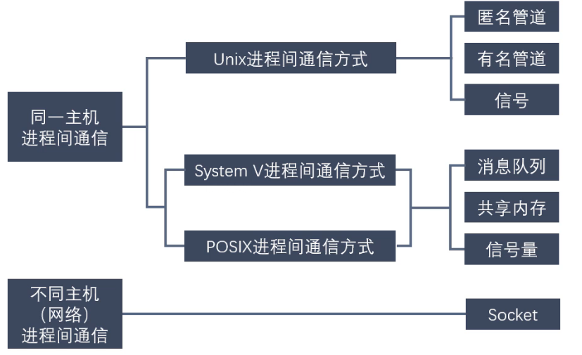

#### 匿名管道

* 管道也叫无名（匿名）管道，它是是UNIX系统IPC(进程间通信)的最古老形式所有的UNIX系统都支持这种通信机制。
* 统计一个目录中文件的数目命令：1s|wc-1,为了执行该命令，she11创建了两个进程来分别执行1s和wc。

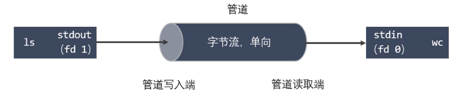

* 管道其实是一个在内核内存中维护的缓冲器，这个缓冲器的存储能力是有限的，不同的操作系统大小不一定相同。
* 管道拥有文件的特质：读操作、写操作，匿名管道没有文件实体，有名管道有文件实体但不存储数据。可以按照操作文件的方式对管道进行操作。
* 一个管道是一个字节流，使用管道时不存在消息或者消息边界的概念，从管道读取数据的进程可以读取任意大小的数据块，而不管写入进程写入管道的数据块的大小是多少。
* 通过管道传递的数据是顺序的，从管道中读取出来的字节的顺序和它们被写入管道的顺序是完全一样的。
* 在管道中的数据的传递方向是单向的，一端用于写入，一端用于读取，管道是半双工的。
* 从管道读数据是一次性操作，数据一旦被读走，它就从管道中被抛弃，释放空间以便写更多的数据，在管道中无法使用1seek()来随机的访问数据。
* 匿名管道只能在具有公共祖先的进程（父进程与子进程，或者两个兄弟进程，具有亲缘关系)之间使用。

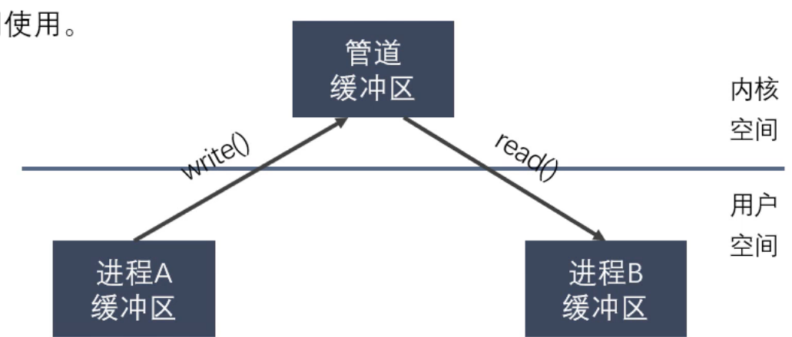

#### 匿名管道的使用

* 创建匿名管道
  `#include <unistd.h>`
  `int pipe(int pipefd[2])`
* 查看管道缓 冲大小命令
  `ulimit -a`
* 查看管道缓冲大小函数
  `#include <unistd.h>`
  `long fpathconf (int fd,int name)`

## LINUX多线程开发

### 线程

`pthread_t`：线程句柄
`pthread_attr_t`：线程属性

`pthread_create()`：创建一个线程
`pthread_exit()`：终止当前线程
`pthread_cancel()`：中断另外一个线程的运行
`pthread_join()`：阻塞当前的线程，直到另外一个线程运行结束
`pthread_attr_init()`：初始化线程的属性
`pthread_attr_setdetachstate()`：设置脱离状态的属性（决定这个线程在终止时是否可以被结合）
`pthread_attr_getdetachstate()`：获取脱离状态的属性
`pthread_attr_destroy()`：删除线程的属性
`pthread_kill()`：向线程发送一个信号

同步函数,用于 mutex 和条件变量

`pthread_mutex_init()`: 初始化互斥锁
`pthread_mutex_destroy()`: 删除互斥锁
`pthread_mutex_lock()`：占有互斥锁（阻塞操作）
`pthread_mutex_trylock()`：试图占有互斥锁（不阻塞操作）。即，当互斥锁空闲时，将占有该锁；否则，立即返回。
`pthread_mutex_unlock()`: 释放互斥锁
`pthread_cond_init()`：初始化条件变量
`pthread_cond_destroy()`：销毁条件变量
`pthread_cond_signal()`: 唤醒第一个调用pthread_cond_wait()而进入睡眠的线程
`pthread_cond_wait()`: 等待条件变量的特殊条件发生
`Thread-local storage`（或者以Pthreads术语，称作线程特有数据）：
`pthread_key_create()`: 分配用于标识进程中线程特定数据的键
`pthread_setspecific()`: 为指定线程特定数据键设置线程特定绑定
`pthread_getspecific()`: 获取调用线程的键绑定，并将该绑定存储在 value 指向的位置中
`pthread_key_delete()`: 销毁现有线程特定数据键

#### 信号量

P(V)操作:P+1，V-1。当然信号量可以时任意自然数，但是常见得信号量时0，1。

P，如果SV的值大于0，则将其减一；若SV的值为0，则挂起执行

V，如果有其他进行因为等待SV而挂起，则唤醒；若没有，则将SV值加一

`sem_init`函数用于初始化一个未命名的信号量

`sem_destory`函数用于销毁信号量

`sem_wait`函数将以原子操作方式将信号量减一,信号量为0时,sem_wait阻塞

`sem_post`函数以原子操作方式将信号量加一,信号量大于0时,唤醒调用sem_post的线程

#### 互斥量

互斥锁,也成互斥量,可以保护关键代码段,以确保独占式访问.当进入关键代码段,获得互斥锁将其加锁;离开关键代码段,唤醒等待该互斥锁的线程。

`pthread_mutex_init` 函数用于初始化互斥锁

`pthread_mutex_destory` 函数用于销毁互斥锁

`pthread_mutex_lock` 函数以原子操作方式给互斥锁加锁

`pthread_mutex_unlock `函数以原子操作方式给互斥锁解锁

#### 条件变量

条件变量提供了一种线程间的通知机制,当某个共享数据达到某个值时,唤醒等待这个共享数据的线程。

`pthread_cond_init` 函数用于初始化条件变量

`pthread_cond_destory `函数销毁条件变量

`pthread_cond_broadcast` 函数以广播的方式唤醒所有等待目标条件变量的线程

`pthread_cond_wait` 函数用于等待目标条件变量.该函数调用时需要传入 mutex参数(加锁的互斥锁) ,函数执行时,先把调用线程放入条件变量的请求队列,然后将互斥锁mutex解锁,当函数成功返回为0时,互斥锁会再次被锁上. 也就是说函数内部会有一次解锁和加锁操作

#### 工具函数

`pthread_equal()`: 对两个线程的线程标识号进行比较
`pthread_detach()`: 分离线程
`pthread_self()`: 查询线程自身线程标识号

### 线程池

## LINUX网络编程

### 7. TCP三次握手
TCP是一种面向连接的单播协议，在发送数据前，通信双方必须在彼此间建立一条连接。所谓的“连接"，其实是客户端和服务器的内存里保存的一份关于对方的信息，如P地址、端口号等。

TCP可以看成是一种字节流，它会处理IP层或以下的层的丢包、重复以及错误问题，在连接的建立过程中，双方需要交换一些连接的参数。这些参数可以放在TCP头部。

TCP提供了一种可靠、面向连接、字节流, 传输层的服务，采用三次握手建立一个连接。采用四次挥手来关闭一个连接。

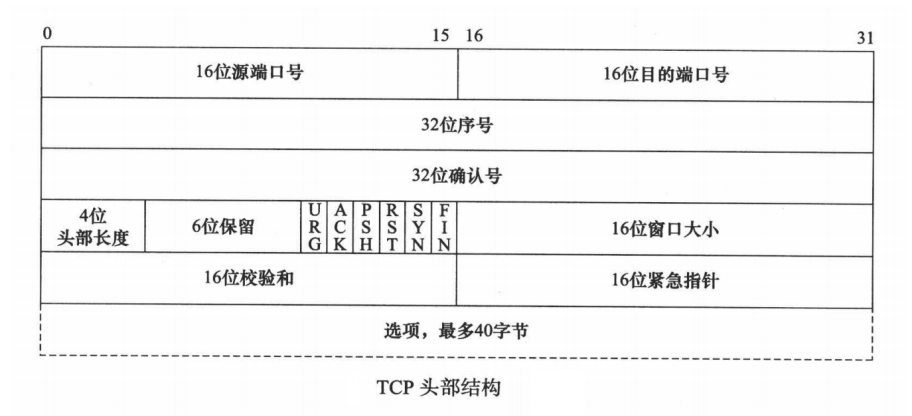

* 16 位端口号（port number）：告知主机报文段是来自哪里（源端口）以及传给哪个上层协议或 应用程序（目的端口）的。进行 TCP 通信时，客户端通常使用系统自动选择的临时端口号。 
* 32 位序号（sequence number）：一次 TCP 通信（从 TCP 连接建立到断开）过程中某一个传输 方向上的字节流的每个字节的编号。假设主机 A 和主机 B 进行 TCP 通信，A 发送给 B 的第一个 TCP 报文段中，序号值被系统初始化为某个随机值 ISN（Initial Sequence Number，初始序号 值）。那么在该传输方向上（从 A 到 B），后续的 TCP 报文段中序号值将被系统设置成 ISN 加上 该报文段所携带数据的第一个字节在整个字节流中的偏移。例如，某个 TCP 报文段传送的数据是字 节流中的第 1025 ~ 2048 字节，那么该报文段的序号值就是 ISN + 1025。另外一个传输方向（从 B 到 A）的 TCP 报文段的序号值也具有相同的含义。 
* 32 位确认号（acknowledgement number）：用作对另一方发送来的 TCP 报文段的响应。其值是 收到的 TCP 报文段的序号值 + 标志位长度（SYN，FIN） + 数据长度 。假设主机 A 和主机 B 进行 TCP 通信，那么 A 发送出的 TCP 报文段不仅携带自己的序号，而且包含对 B 发送来的 TCP 报文段 的确认号。反之，B 发送出的 TCP 报文段也同样携带自己的序号和对 A 发送来的报文段的确认序 - 功能： 客户端连接服务器 - 参数： - sockfd : 用于通信的文件描述符 - addr : 客户端要连接的服务器的地址信息 - addrlen : 第二个参数的内存大小 - 返回值：成功 0， 失败 -1 ssize_t write(int fd, const void *buf, size_t count); // 写数据 ssize_t read(int fd, void *buf, size_t count); // 读数据 号。 
* 4 位头部长度（head length）：标识该 TCP 头部有多少个 32 bit(4 字节)。因为 4 位最大能表示 15，所以 TCP 头部最长是60 字节。 
* 6 位标志位包含如下几项： 
  * URG 标志，表示紧急指针（urgent pointer）是否有效。 ACK 标志，表示确认号是否有效。我们称携带 
  * ACK 标志的 TCP 报文段为确认报文段。 
  * PSH 标志，提示接收端应用程序应该立即从 TCP 接收缓冲区中读走数据，为接收后续数据腾 出空间（如果应用程序不将接收到的数据读走，它们就会一直停留在 TCP 接收缓冲区中）。 
  * RST 标志，表示要求对方重新建立连接。我们称携带 RST 标志的 TCP 报文段为复位报文段。 
  * SYN 标志，表示请求建立一个连接。我们称携带 SYN 标志的 TCP 报文段为同步报文段。 
  * FIN 标志，表示通知对方本端要关闭连接了。我们称携带 FIN 标志的 TCP 报文段为结束报文 段。 
  * 16 位窗口大小（window size）：是 TCP 流量控制的一个手段。这里说的窗口，指的是接收 通告窗口（Receiver Window，RWND）。它告诉对方本端的 TCP 接收缓冲区还能容纳多少 字节的数据，这样对方就可以控制发送数据的速度。 
  * 16 位校验和（TCP checksum）：由发送端填充，接收端对 TCP 报文段执行 CRC 算法以校验 TCP 报文段在传输过程中是否损坏。注意，这个校验不仅包括 TCP 头部，也包括数据部分。 这也是 TCP 可靠传输的一个重要保障。 
  * 16 位紧急指针（urgent pointer）：是一个正的偏移量。它和序号字段的值相加表示最后一 个紧急数据的下一个字节的序号。因此，确切地说，这个字段是紧急指针相对当前序号的偏 移，不妨称之为紧急偏移。TCP 的紧急指针是发送端向接收端发送紧急数据的方法。

```markdown
第一次握手：
1. 客户端将SYN标志位置为1
2. 生成一个随机的32位的序号seq=J ， 这个序号后边是可以携带数据（数据的大小）
第二次握手：
1. 服务器端接收客户端的连接： ACK=1
2. 服务器会回发一个确认序号： ack=客户端的序号 + 数据长度 + SYN/FIN(按一个字节算)
3. 服务器端会向客户端发起连接请求： SYN=1
4. 服务器会生成一个随机序号：seq = K
第三次握手：
1. 客户单应答服务器的连接请求：ACK=1
2. 客户端回复收到了服务器端的数据：ack=服务端的序号 + 数据长度 + SYN/FIN(按一个字节算)
```

### 8. TCP 滑动窗口

> 滑动窗口（Sliding window）是一种流量控制技术。早期的网络通信中，通信双方不会考虑网络的 拥挤情况直接发送数据。由于大家不知道网络拥塞状况，同时发送数据，导致中间节点阻塞掉包， 谁也发不了数据，所以就有了滑动窗口机制来解决此问题。滑动窗口协议是用来改善吞吐量的一种 技术，即容许发送方在接收任何应答之前传送附加的包。接收方告诉发送方在某一时刻能送多少包 （称窗口尺寸）。 
>
> TCP 中采用滑动窗口来进行传输控制，滑动窗口的大小意味着接收方还有多大的缓冲区可以用于 接收数据。发送方可以通过滑动窗口的大小来确定应该发送多少字节的数据。当滑动窗口为 0 时，发送方一般不能再发送数据报。 
>
> 滑动窗口是 TCP 中实现诸如 ACK 确认、流量控制、拥塞控制的承载结构。

窗口理解为缓冲区的大小 

滑动窗口的大小会随着发送数据和接收数据而变化。 

通信的双方都有发送缓冲区和接收数据的缓冲区 

服务器： 

* 发送缓冲区（发送缓冲区的窗口） 
* 接收缓冲区（接收缓冲区的窗口） 

客户端 

* 发送缓冲区（发送缓冲区的窗口） 
* 接收缓冲区（接收缓冲区的窗口）

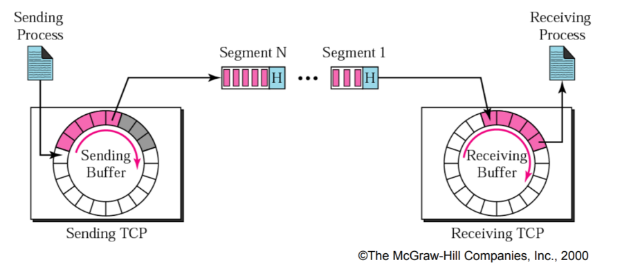

```Markdown
发送方的缓冲区：
	白色格子：空闲的空间
	灰色格子：数据已经被发送出去了，但是还没有被接收
	紫色格子：还没有发送出去的数据
接收方的缓冲区：
	白色格子：空闲的空间
	紫色格子：已经接收到的数据
```

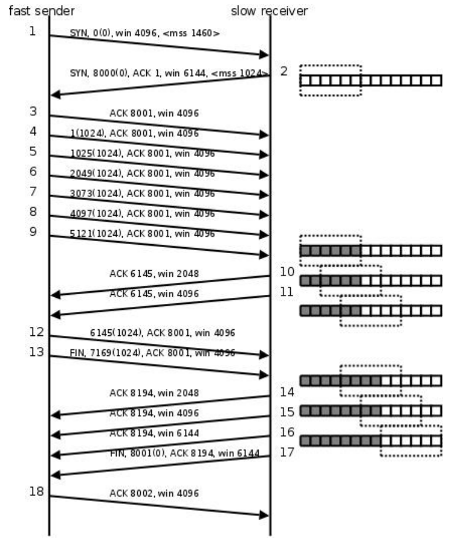

``` markdown
# mss: Maximum Segment Size(一条数据的最大的数据量)
# win: 滑动窗口
1. 客户端向服务器发起连接，客户单的滑动窗口是4096，一次发送的最大数据量是1460
2. 服务器接收连接情况，告诉客户端服务器的窗口大小是6144，一次发送的最大数据量是1024
3. 第三次握手
4. 4-9 客户端连续给服务器发送了6k的数据，每次发送1k
5. 第10次，服务器告诉客户端：发送的6k数据以及接收到，存储在缓冲区中，缓冲区数据已经处理了2k,窗
口大小是2k
6. 第11次，服务器告诉客户端：发送的6k数据以及接收到，存储在缓冲区中，缓冲区数据已经处理了4k,窗
口大小是4k
7. 第12次，客户端给服务器发送了1k的数据
8. 第13次，客户端主动请求和服务器断开连接，并且给服务器发送了1k的数据
9. 第14次，服务器回复ACK 8194, a:同意断开连接的请求 b:告诉客户端已经接受到方才发的2k的数据
c:滑动窗口2k
10. 第15、16次，通知客户端滑动窗口的大小
11. 第17次，第三次挥手，服务器端给客户端发送FIN,请求断开连接
12. 第18次，第四次回收，客户端同意了服务器端的断开请求
```

### TCP 四次挥手

> 四次挥手发生在断开连接的时候，在程序中当调用了close()会使用TCP协议进行四次挥手。 客户端和服务器端都可以主动发起断开连接，谁先调用close()谁就是发起。 因为在TCP连接的时候，采用三次握手建立的的连接是双向的，在断开的时候需要双向断开。

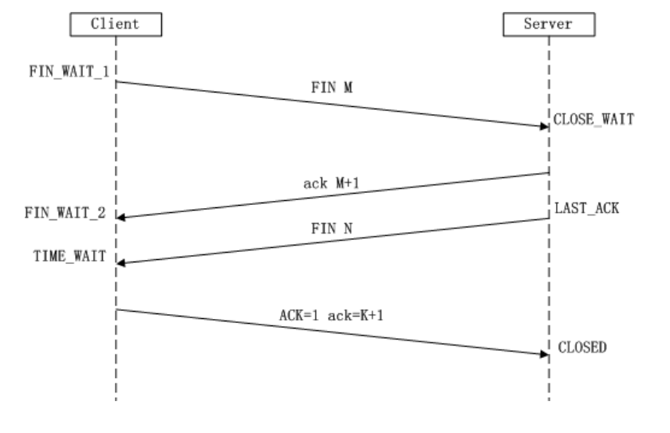

### 10. TCP 通信并发

> 要实现TCP通信服务器处理并发的任务，使用多线程或者多进程来解决。 思路： 
>
> 1. 一个父进程，多个子进程 
> 2. 父进程负责等待并接受客户端的连接
> 3. 子进程：完成通信，接受一个客户端连接，就创建一个子进程用于通信

### 11. TCP 状态转换

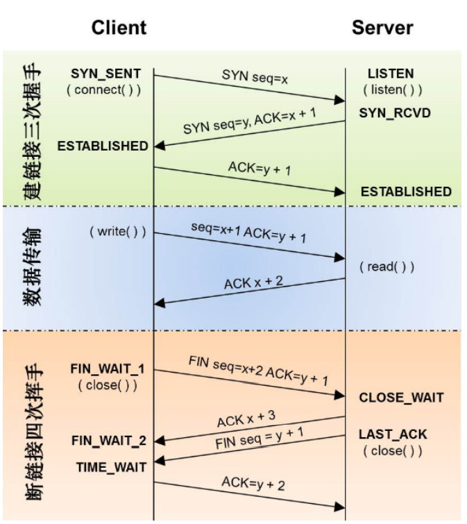

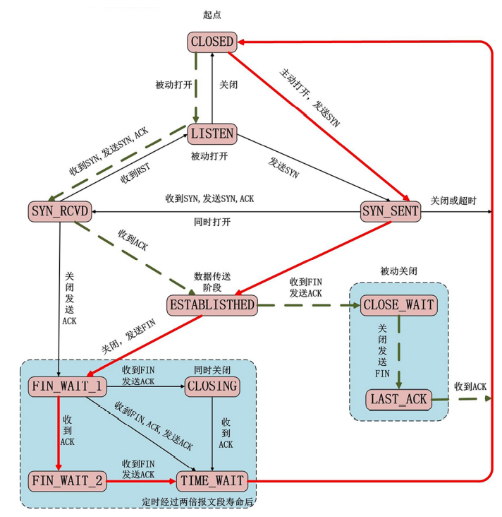

* 2MSL（Maximum Segment Lifetime） 

  主动断开连接的一方, 最后进入一个 TIME_WAIT状态, 这个状态会持续: 2msl 

  * msl: 官方建议: 2分钟, 实际是30s 

    > 当 TCP 连接主动关闭方接收到被动关闭方发送的 FIN 和最终的 ACK 后，连接的主动关闭方 必须处于TIME_WAIT 状态并持续 2MSL 时间。 
    >
    > 这样就能够让 TCP 连接的主动关闭方在它发送的 ACK 丢失的情况下重新发送最终的 ACK。 
    >
    > 主动关闭方重新发送的最终 ACK 并不是因为被动关闭方重传了 ACK（它们并不消耗序列号， 被动关闭方也不会重传），而是因为被动关闭方重传了它的 FIN。事实上，被动关闭方总是 重传 FIN 直到它收到一个最终的 ACK。 

  * 半关闭 

    > 当 TCP 链接中 A 向 B 发送 FIN 请求关闭，另一端 B 回应 ACK 之后（A 端进入 FIN_WAIT_2 状态），并没有立即发送 FIN 给 A，A 方处于半连接状态（半开关），此时 A 可以接收 B 发 送的数据，但是 A 已经不能再向 B 发送数据。 

从程序的角度，可以使用 API 来控制实现半连接状态：

```c++
#include <sys/socket.h>
int shutdown(int sockfd, int how);
sockfd: 需要关闭的socket的描述符
how: 允许为shutdown操作选择以下几种方式:
	SHUT_RD(0): 关闭sockfd上的读功能，此选项将不允许sockfd进行读操作。
        该套接字不再接收数据，任何当前在套接字接受缓冲区的数据将被无声的丢弃掉。
	SHUT_WR(1): 关闭sockfd的写功能，此选项将不允许sockfd进行写操作。进程不能在对此套接字发出写操作。
	SHUT_RDWR(2): 关闭sockfd的读写功能。相当于调用shutdown两次：首先是以SHUT_RD,然后以SHUT_WR。
```

 

使用 close 中止一个连接，但它只是减少描述符的引用计数，并不直接关闭连接，只有当描述符的引用 计数为 0 时才关闭连接。shutdown 不考虑描述符的引用计数，直接关闭描述符。也可选择中止一个方 向的连接，只中止读或只中止写。 

注意:

1. 如果有多个进程共享一个套接字，close 每被调用一次，计数减 1 ，直到计数为 0 时，也就是所用 进程都调用了 close，套接字将被释放。
2. 在多进程中如果一个进程调用了 shutdown(sfd, SHUT_RDWR) 后，其它的进程将无法进行通信。 但如果一个进程 close(sfd) 将不会影响到其它进程。

### ### 12. 端口复用

> 端口复用最常用的用途是: 
>
> * 防止服务器重启时之前绑定的端口还未释放 
> * 程序突然退出而系统没有释放端口

```c++
#include <sys/types.h>
#include <sys/socket.h>
// 设置套接字的属性（不仅仅能设置端口复用）
int setsockopt(int sockfd, int level, int optname, const void *optval, socklen_t
optlen);
    参数：
        - sockfd : 要操作的文件描述符
        - level : 级别 - SOL_SOCKET (端口复用的级别)
        - optname : 选项的名称
        - SO_REUSEADDR
        - SO_REUSEPORT
        - optval : 端口复用的值（整形）
        - 1 : 可以复用
        - 0 : 不可以复用
        - optlen : optval参数的大小
	端口复用，设置的时机是在服务器绑定端口之前。
setsockopt();
bind();
```

### 13 I/O多路复用

I/O 多路复用使得程序==能同时监听多个文件描述符==，能够提高程序的性能，Linux 下实现 I/O 多路复用的 系统调用主要有 select、poll 和 epoll。

#### select

> 主旨思想： 
>
> 1. 首先要构造一个关于文件描述符的列表，将要监听的文件描述符添加到该列表中
> 2. 调用一个系统函数，监听该列表中的文件描述符，直到这些描述符中的一个或者多个进行I/O 操作时，该函数才返回
>    * 这个函数是阻塞 
>    * 函数对文件描述符的检测的操作是由内核完成的 
> 3. 在返回时，它会告诉进程有多少（哪些）描述符要进行I/O操作

```c++
// sizeof(fd_set) = 128 1024
#include <sys/time.h>
#include <sys/types.h>
#include <unistd.h>
#include <sys/select.h>
int select(int nfds, fd_set *readfds, fd_set *writefds,
fd_set *exceptfds, struct timeval *timeout);
    - 参数：
        - nfds : 委托内核检测的最大文件描述符的值 + 1
        - readfds : 要检测的文件描述符的读的集合，委托内核检测哪些文件描述符的读的属性
        - 一般检测读操作
        - 对应的是对方发送过来的数据，因为读是被动的接收数据，检测的就是读缓冲
        区
        - 是一个传入传出参数
        - writefds : 要检测的文件描述符的写的集合，委托内核检测哪些文件描述符的写的属性
        - 委托内核检测写缓冲区是不是还可以写数据（不满的就可以写）
        - exceptfds : 检测发生异常的文件描述符的集合
        - timeout : 设置的超时时间
struct timeval 
{
    long tv_sec; /* seconds */
    long tv_usec; /* microseconds */
};
    - NULL : 永久阻塞，直到检测到了文件描述符有变化
    - tv_sec = 0 tv_usec = 0， 不阻塞
    - tv_sec > 0 tv_usec > 0， 阻塞对应的时间
    - 返回值 :
        - -1 : 失败
        - >0(n) : 检测的集合中有n个文件描述符发生了变化
// 将参数文件描述符fd对应的标志位设置为0
void FD_CLR(int fd, fd_set *set);
// 判断fd对应的标志位是0还是1， 返回值 ： fd对应的标志位的值，0，返回0， 1，返回1
int FD_ISSET(int fd, fd_set *set);
// 将参数文件描述符fd 对应的标志位，设置为1
void FD_SET(int fd, fd_set *set);
// fd_set一共有1024 bit, 全部初始化为0
void FD_ZERO(fd_set *set);
```

#### poll

```c++
#include <poll.h>
struct pollfd 
{
    int fd; /* 委托内核检测的文件描述符 */
    short events; /* 委托内核检测文件描述符的什么事件 */
    short revents; /* 文件描述符实际发生的事件 */
};
struct pollfd myfd;
myfd.fd = 5;
myfd.events = POLLIN | POLLOUT;
int poll(struct pollfd *fds, nfds_t nfds, int timeout);
    - 参数：
        - fds : 是一个struct pollfd 结构体数组，这是一个需要检测的文件描述符的集合
        - nfds : 这个是第一个参数数组中最后一个有效元素的下标 +1
        - timeout : 阻塞时长
            0 : 不阻塞
            -1 : 阻塞，当检测到需要检测的文件描述符有变化，解除阻塞
            >0 : 阻塞的时长
    - 返回值：
        -1 : 失败
        >0（n） : 成功,n表示检测到集合中有n个文件描述符发生变化
```

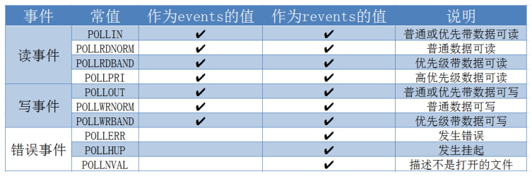

#### epoll

```c++
#include <sys/epoll.h>
// 创建一个新的epoll实例。在内核中创建了一个数据，这个数据中有两个比较重要的数据，一个是需要检
测的文件描述符的信息（红黑树），还有一个是就绪列表，存放检测到数据发送改变的文件描述符信息（双向链表）。
int epoll_create(int size);
    - 参数：
        size : 目前没有意义了。随便写一个数，必须大于0
    - 返回值：
        -1 : 失败
        > 0 : 文件描述符，操作epoll实例的

typedef union epoll_data 
{
    void *ptr;000
    int fd;
    uint32_t u32;
    uint64_t u64;
} epoll_data_t;
struct epoll_event 
{
    uint32_t events; /* Epoll events */
    epoll_data_t data; /* User data variable */
};
    常见的Epoll检测事件：
        - EPOLLIN
        - EPOLLOUT
        - EPOLLERR
// 对epoll实例进行管理：添加文件描述符信息，删除信息，修改信息
int epoll_ctl(int epfd, int op, int fd, struct epoll_event *event);
    - 参数：
        - epfd : epoll实例对应的文件描述符
        - op : 要进行什么操作
            EPOLL_CTL_ADD: 添加
            EPOLL_CTL_MOD: 修改
            EPOLL_CTL_DEL: 删除
        - fd : 要检测的文件描述符
        - event : 检测文件描述符什么事情
// 检测函数
int epoll_wait(int epfd, struct epoll_event *events, int maxevents, int
timeout);
    - 参数：
        - epfd : epoll实例对应的文件描述符
        - events : 传出参数，保存了发送了变化的文件描述符的信息
        - maxevents : 第二个参数结构体数组的大小
        - timeout : 阻塞时间
        - 0 : 不阻塞
        - -1 : 阻塞，直到检测到fd数据发生变化，解除阻塞
        - > 0 : 阻塞的时长（毫秒）
    - 返回值：
        - 成功，返回发送变化的文件描述符的个数 > 0
        - 失败 -1
```

Epoll 的工作模式：

* LT 模式 （水平触发）
  * 假设委托内核检测读事件 -> 检测fd的读缓冲区
  * 读缓冲区有数据 - > epoll检测到了会给用户通知
    * a.用户不读数据，数据一直在缓冲区，epoll 会一直通知
    * b.用户只读了一部分数据，epoll会通知
    * c.缓冲区的数据读完了，不通知

> LT（level - triggered）是缺省的工作方式，并且同时支持 block 和 no-block socket。在这种做法中，内核告诉你一个文件描述符是否就绪了，然后你可以对这个就绪的 fd 进行 IO 操作。如果你不作任何操作，内核还是会继续通知你的。

* ET 模式（边沿触发） 
  * 假设委托内核检测读事件 -> 检测fd的读缓冲区 
  * 读缓冲区有数据 -> epoll检测到了会给用户通知 
    * a.用户不读数据，数据一致在缓冲区中，epoll下次检测的时候就不通知了 
    * b.用户只读了一部分数据，epoll不通知 
    * c.缓冲区的数据读完了，不通知

> ET（edge - triggered）是高速工作方式，只支持 no-block socket。在这种模式下，当描述 符从未就绪变为就绪时，内核通过epoll告诉你。然后它会假设你知道文件描述符已经就绪， 并且不会再为那个文件描述符发送更多的就绪通知，直到你做了某些操作导致那个文件描述 符不再为就绪状态了。但是请注意，如果一直不对这个 fd 作 IO 操作（从而导致它再次变成 未就绪），内核不会发送更多的通知（only once）。 
>
> ET 模式在很大程度上减少了 epoll 事件被重复触发的次数，因此效率要比 LT 模式高。epoll 工作在 ET 模式的时候，必须使用非阻塞套接口，以避免由于一个文件句柄的阻塞读/阻塞写 操作把处理多个文件描述符的任务饿死。

```c++
struct epoll_event 
{
uint32_t events; /* Epoll events */
epoll_data_t data; /* User data variable */
};
常见的Epoll检测事件：
    - EPOLLIN
    - EPOLLOUT
    - EPOLLERR
    - EPOLLET
```


## 项目实战与总结

### 阻塞/非阻塞 同步/异步

> 典型的一次O的两个阶段是什么？数据就绪和数据读写

数据就绪：根据系统○操作的就绪状态

* 阻塞
* 非阻塞

数据读写：根据应用程序和内核的交互方式

* 同步
* 异步

==在处理1O的时候，阻塞和非阻塞都是同步O,只有使用了特殊的AP川才是异步1O。==

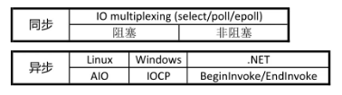

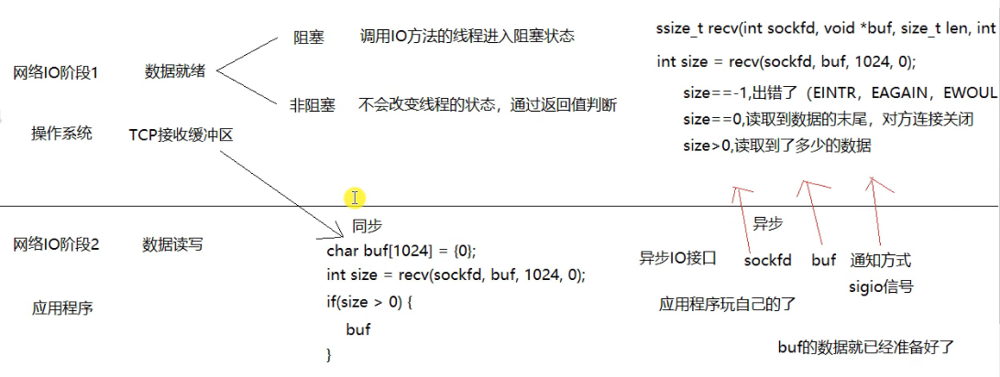

一个典型的网络O接口调用，分为两个阶段，分别是“数据就绪”和“数据读写”，数据就绪阶段分为阻塞和非阻寒，表现得结果就是，阻塞当前线程或是直接返回。

同步表示A向B请求调用一个网络IO接口时（或者调用某个业务逻辑AP引接口时），数据的读写都是由请求方A自己来完成的（不管是阻塞还是非阻塞）；

异步表示A向B请求调用一个网络O接口时（或者调用某个业务逻辑AP接口时)，向B传入请求的事件以及事件发生时通知的A就可以处理其它逻辑了，当B监听到事件处理完成后，会用事先约定好的通知方式，通知处理结果。

### 5种IO模型

* a.阻塞blocking
  调用者调用了某个函数，等待这个函数返回，间什么也不做，不停的去检查这个函数有没有返回，必须等这个函数返回才能进行下一步动作。

  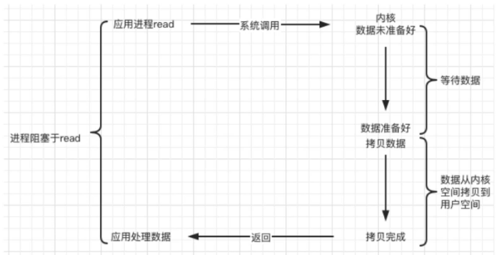

* b.非阻塞non-blocking

  非阻塞等待，每隔一段时间就去检测O事件是否就绪。没有就绪就可以做其他事。非阻塞/O执行系统调用总是立即返回，不管事件是否已经发生，若事件没有发生，则返回-1，此时可以根据o区分这两种情况，对于accept,,recv和send,事件未发生时，errno通常被设置成EAGAIN。

  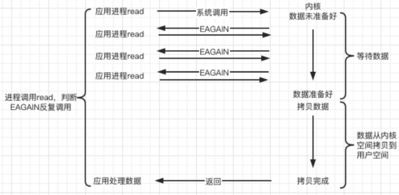

* c.IO复用(IO multiplexing)
  Linux用select/poll/epol函数实现IO复用模型，这些函数也会使进程阻塞，T和阻塞IO所不同的是这些函数可以同时阻塞多个IO操作。而且可以同时对多个读操作、写操作的O函数进行检测。直到有数据可读或可写时，才真正调用IO操作函数。

  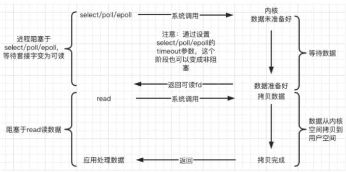

* d.信号驱动(signal-driven)
  Linux用套接口进行信号驱动IO,一个信号处理函数，进程继续运行并不阻塞，当IO事件就绪，进程收到Singal信号，然后处理IO事件。

  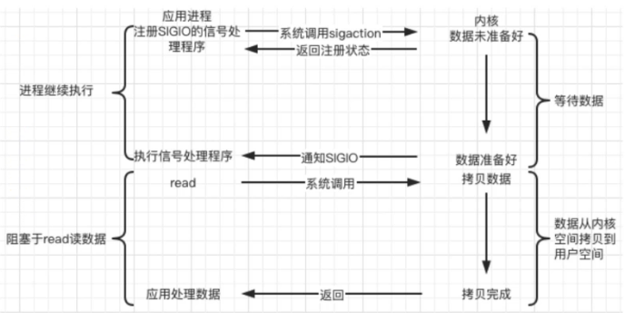

* e.异步(asynchronous)
  Linux中，可以调用 `aio_read` 函数告诉内核描述字缓冲区指针和缓冲区的大小、文件偏移及通知的方式，然后立即返回，当内核将数据拷贝到缓冲区后，再通知应用程序。

  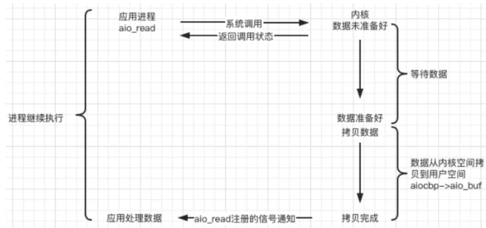

### Web Server(网页服务器)

一个Web Server就是一个服务器软件（程序），或者是运行这个服务器软件的硬件（计算机）。其主要功能是通过HTTP协议与客户端（通常是浏览器(Browser))进行通信，来接收，存储，处理来自客户端的HTTP请求，并对其请求做出HTTP响应，返回给客户端其请求的内容（文件、网页等）或返回一个Error信息。

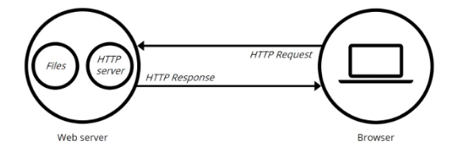

通常用户使用Wb浏览器与相应服务器进行通信。在浏览器中键入“域名”或“IP地址：喘口号”，浏览器则先将你的域名解析成相应的P地址或者直接根据你的P地址向对应的Wb服务器发送一个HTTP请求。这一过程首先要通过TCP协议的三次握手建立与目标Web服务器的连接，然后HTTP协议生成针对目标Wb服务器的HTTP请求报文，通过TCP、IP等协议发送到目标Web服务器上。

### HTTP协议

#### 简介

超文本传输协议(Hypertext Transfer Protocol,HTTP)是一个简单的请求-响应协议，它通常运行在TCP之上。它指定了客户端可能发送给服务器什么样的消息以及得到什么样的响应。请求和响应消息的头以ASC形式给出：而消息内容则具有一个类以MME的格式。HTTP是万维网的数据通信的基础。

HTTP的发展是由蒂姆伯纳斯李于1989年在欧洲核子研究组织(CERN)所发起。HTTP的标准制定由万维网协会(World Wide Web Consortium,W3C)和互联网工程任务组(Internet Engineering Task Force,IETF)进行协调，最终发布了一系列的RFC,其中最善名的是1999年6月公布的RFC2616,定义了HTTP协议中现今广泛使用的一个版本一一HTTP1.1。

#### 概述

HTTP是一个客户端终端（用户）和服务器端（网站）请求和应答的标准(TCP)。通过使用网页浏览器、网络爬
虫或者其它的工具，客户端发起一个HTTP请求到服务器上指定端口（默认端口为80）。我们称这个客户端为用户代理程序(user agent)。应答的服务器上存储着一些资源，比如HTML文件和图像。我们称这个应答服务器为
源服务器(origin server)。在用户代理和源服务器中间可能存在多个“中间层”，比如代理服务器、网关或者隧道(tunnel)。

尽管TCP/IP协议是互联网上最流行的应用，HTTP协议中，并没有规定必须使用它或它支持的层。事实上，HTTP可以在任何互联网协议上，或其他网络上实现。HTTP假定其下层协议提供可靠的传输。因此，任何能够提供这种保证的协议都可以被其使用。因此也就是其在TCP/IP协议族使用TCP作为其传输层。

通常，由HTTP客户端发起一个请求，创建一个到服务器指定端口（默认是8O端口）的TCP连接。HTTP服务器则在那个端口监听客户端的清求。一旦收到请求，服务器会向客户端返回一个状态，比如"HTTP/1.1200OK",以及返回的内容，如请求的文件、错误消息、或者其它信息。

#### 工作原理

HTTP协议定义Web客户端散如何从Web服务器请求Web页面，以及服务器如何把Web页面传送给客户端。HTTP协议采用了请求响应模型。客户端向服务器发送一个请求报文，请求报文包含请求的方法、URL、协议版本、请求头部和请求数据。服务器以一个状态行作为响I向应的内容包括协议的版本、成功或者错误代码、服务器信息、响应头部和响应数据。

以下是HTP请求/响应的步骤：

1. 客户端连接到Web服务器

   一个HTTP客户端，通常是浏览器，与Wb服务器的HTTP瑞口（默认为80）建立一个TCP套接字连接。例如，`http:www.baidu.com`

2. 发送HTP请求

   通过TCP套接字，客户端向Wb服务器发送一个文本的请求报文，一个请求报文由请求行、请求头部、空行和请求数据4部分组成

3. 服务器接受请求并返回HTTP响应

   Wb服务器解析请求，定位请求资源。服务器将资源本写到TCP套接字，由客户端读取。一个响应由状态行、响应头部、空行和响应数据4部分组成

4. 释放连接TCP

   连接若connection模式为close,则服务器主动关闭TCP连接，客户端被动关闭连接，释放TCP连接：若connection模式为keepalive,则该连接会保特一段时间，在该时间内可以继续接收请求

5. 客户端浏览器解析HTML内容

   客户端浏览器首先解析状态行，查看表明清求是否成功的状态代码。然后解析每一个响应头，响应头告知以下为若干字节的HTML文档和文档的字符集。客户端浏览器读取响应数据HTML,根据HTML的语法对其进行格式化，并在浏览器窗口中显示。

例如：在浏览器地址栏键入URL,按下回车之后会经历以下流程：

1. 浏览器向DNS服务器请求解析该URL中的域名所对应的IP地址
2. 解析出P地址后，根据该P地址和默认端口80，和服务器建立TCP连接
3. 浏览器发出读取文件(URL中域名后面部分对应的文件)的HTTP请求，该请求报文作为TCP三次握手的第三个报文的数据发送给服务器
4. 服务器对浏览器请求作出相应,并把对应的HTML文本发送给浏览器
5. 释放TCP链接
6. 浏览器将该HTML文本并显示内容


HTTP协议是基于TCP/IP协议之上的应用层协议，基于请求-响应的模式。HTTP协议规定，请求从客户端发出，最后服务器端响应该请求并返回。换句话说，肯定是先从客户端开始建立通信的，服务器端在没有接收到请求之前不会发送响应。

#### http请求报文格式

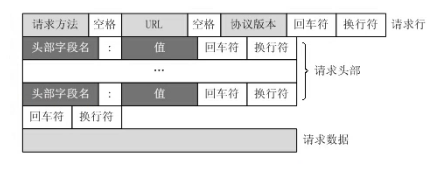

```http
GET / HTTP/1.1
Host: www.baidu.com
User-Agent: Mozilla/5.0 (Windows NT 10.0; Win64; x64; rv:86.0) Gecko/20100101 Firefox/86.0
Accept: text/html,application/xhtml+xml,application/xml;q=0.9,image/webp,/;q=0.8
Accept-Language: zh-CN,zh;q=0.8,zh-TW;q=0.7,zh-HK;q=0.5,en-US;q=0.3,en;q=0.2
Accept-Encoding: gzip, deflate, br
Connection: keep-alive
Cookie: BAIDUID=6729CB682DADC2CF738F533E35162D98:FG=1;
BIDUPSID=6729CB682DADC2CFE015A8099199557E; PSTM=1614320692; BD_UPN=13314752;
BDORZ=FFFB88E999055A3F8A630C64834BD6D0;
__yjs_duid=1_d05d52b14af4a339210722080a668ec21614320694782; BD_HOME=1;
H_PS_PSSID=33514_33257_33273_31660_33570_26350;
BA_HECTOR=8h2001alag0lag85nk1g3hcm60q
Upgrade-Insecure-Requests: 1
Cache-Control: max-age=0
```


#### http响应报文格式

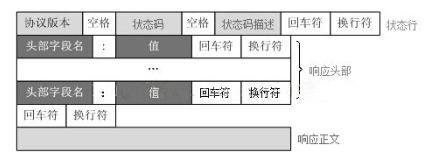

```http
HTTP/1.1 200 OK
Bdpagetype: 1
Bdqid: 0xf3c9743300024ee4
Cache-Control: private
Connection: keep-alive
Content-Encoding: gzip
Content-Type: text/html;charset=utf-8
Date: Fri, 26 Feb 2021 08:44:35 GMT
Expires: Fri, 26 Feb 2021 08:44:35 GMT
Server: BWS/1.1
Set-Cookie: BDSVRTM=13; path=/
Set-Cookie: BD_HOME=1; path=/
Set-Cookie: H_PS_PSSID=33514_33257_33273_31660_33570_26350; path=/; domain=.baidu.com
Strict-Transport-Security: max-age=172800
Traceid: 1614329075128412289017566699583927635684
X-Ua-Compatible: IE=Edge,chrome=1
Transfer-Encoding: chunked
```

#### http请求方法

HTTP/1.1 协议中共定义了八种方法（也叫“动作”）来以不同方式操作指定的资源： 

1. GET：向指定的资源发出“显示”请求。使用 GET 方法应该只用在读取数据，而不应当被用于产生“副 作用”的操作中，例如在 Web Application 中。其中一个原因是 GET 可能会被网络蜘蛛等随意访 问。
2. HEAD：与 GET 方法一样，都是向服务器发出指定资源的请求。只不过服务器将不传回资源的本文 部分。它的好处在于，使用这个方法可以在不必传输全部内容的情况下，就可以获取其中“关于该 资源的信息”（元信息或称元数据）。
3. POST：向指定资源提交数据，请求服务器进行处理（例如提交表单或者上传文件）。数据被包含 在请求本文中。这个请求可能会创建新的资源或修改现有资源，或二者皆有。
4. PUT：向指定资源位置上传其最新内容。 
5. DELETE：请求服务器删除 Request-URI 所标识的资源。
6. TRACE：回显服务器收到的请求，主要用于测试或诊断。
7. OPTIONS：这个方法可使服务器传回该资源所支持的所有 HTTP 请求方法。用'*'来代替资源名称， 向 Web 服务器发送 OPTIONS 请求，可以测试服务器功能是否正常运作。
8. CONNECT：HTTP/1.1 协议中预留给能够将连接改为管道方式的代理服务器。通常用于SSL加密服 务器的链接（经由非加密的 HTTP 代理服务器）。

#### http状态码

所有HTTP响应的第一行都是状态行，依次是当前HTTP版本号，3位数字组成的状态代码，以及描述状态 的短语，彼此由空格分隔。 

状态代码的第一个数字代表当前响应的类型： 

* 1xx消息——请求已被服务器接收，继续处理 
* 2xx成功——请求已成功被服务器接收、理解、并接受 
* 3xx重定向——需要后续操作才能完成这一请求 
* 4xx请求错误——请求含有词法错误或者无法被执行 
* 5xx服务器错误——服务器在处理某个正确请求时发生错误 

虽然 RFC 2616 中已经推荐了描述状态的短语，例如"200 OK"，"404 Not Found"，但是WEB开发者仍 然能够自行决定采用何种短语，用以显示本地化的状态描述或者自定义信息。

|      |              类别              |          原因短语          |
| :--: | :----------------------------: | :------------------------: |
| 1XX  |  Informational(信息性状态码)   |     接收的请求正在处理     |
| 2XX  |      Success(成功状态码)       |      请求正常处理完毕      |
| 3XX  |   Redirection(重定向状态码)    | 需要进行附加操作以完成请求 |
| 4XX  | Client Error(客户端错误状态码) |     服务器无法处理请求     |
| 5XX  | Server Error(服务器错误状态码) |     服务器处理请求出错     |

### 服务器编程基本框架

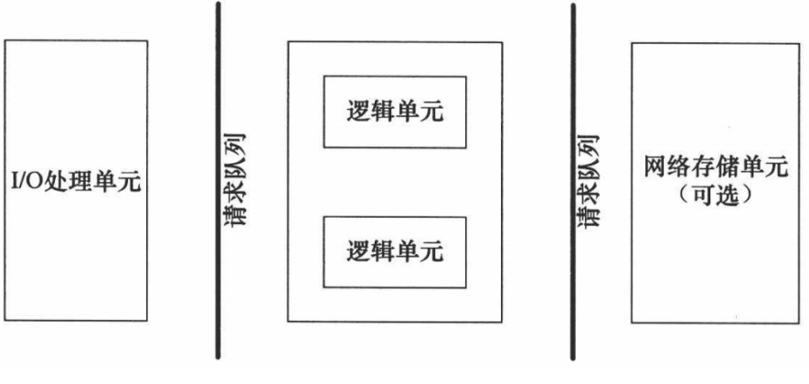

|     模块     |            功能            |
| :----------: | :------------------------: |
| I/O 处理单元 | 处理客户连接，读写网络数据 |
|   逻辑单元   |       业务进程或线程       |
| 网络存储单元 |     数据库、文件或缓存     |
|   请求队列   |    各单元之间的通信方式    |

I/O 处理单元是服务器管理客户连接的模块。它通常要完成以下工作：等待并接受新的客户连接，接收客户数据，将服务器响应数据返回给客户端。但是数据的收发不一定在 I/O 处理单元中执行，也可能在逻辑单元中执行，具体在何处执行取决于事件处理模式。 

一个逻辑单元通常是一个进程或线程。它分析并处理客户数据，然后将结果传递给 I/O 处理单元或者直接发送给客户端（具体使用哪种方式取决于事件处理模式）。服务器通常拥有多个逻辑单元，以实现对多个客户任务的并发处理。 

网络存储单元可以是数据库、缓存和文件，但不是必须的。 

请求队列是各单元之间的通信方式的抽象。I/O 处理单元接收到客户请求时，需要以某种方式通知一个逻辑单元来处理该请求。同样，多个逻辑单元同时访问一个存储单元时，也需要采用某种机制来协调处理竞态条件。请求队列通常被实现为池的一部分。

### 两种高效的事件处理模

服务器程序通常需要处理三类事件：I/O 事件、信号及定时事件。有两种高效的事件处理模式：Reactor 和 Proactor，同步 I/O 模型通常用于实现 Reactor 模式，异步 I/O 模型通常用于实现 Proactor 模式。

#### Reactor 模式

要求主线程（I/O处理单元）只负责监听文件描述符上是否有事件发生，有的话就立即将该事件通知工作 线程（逻辑单元），将 socket 可读可写事件放入请求队列，交给工作线程处理。除此之外，主线程不做 任何其他实质性的工作。读写数据，接受新的连接，以及处理客户请求均在工作线程中完成。 使用同步 I/O（以 epoll_wait 为例）实现的 Reactor 模式的工作流程是：

1. 主线程往 epoll 内核事件表中注册 socket 上的读就绪事件。
2. 主线程调用 epoll_wait 等待 socket 上有数据可读。
3. 当 socket 上有数据可读时，epoll_wait 通知主线程。主线程则将 socket 可读事件放入请求队列。
4. 睡眠在请求队列上的某个工作线程被唤醒，它从 socket 读取数据，并处理客户请求，然后往 epoll 内核事件表中注册该 socket 上的写就绪事件。
5. 当主线程调用 epoll_wait 等待 socket 可写。
6. 当 socket 可写时，epoll_wait 通知主线程。主线程将 socket 可写事件放入请求队列。
7. 睡眠在请求队列上的某个工作线程被唤醒，它往 socket 上写入服务器处理客户请求的结果。

#### Proactor模式

Proactor 模式将所有 I/O 操作都交给主线程和内核来处理（进行读、写），工作线程仅仅负责业务逻 辑。使用异步 I/O 模型（以 aio_read 和 aio_write 为例）实现的 Proactor 模式的工作流程是：

1. 主线程调用 aio_read 函数向内核注册 socket 上的读完成事件，并告诉内核用户读缓冲区的位置， 以及读操作完成时如何通知应用程序（这里以信号为例）。
2. 主线程继续处理其他逻辑。
3. 当 socket 上的数据被读入用户缓冲区后，内核将向应用程序发送一个信号，以通知应用程序数据 已经可用。
4. 应用程序预先定义好的信号处理函数选择一个工作线程来处理客户请求。工作线程处理完客户请求 后，调用 aio_write 函数向内核注册 socket 上的写完成事件，并告诉内核用户写缓冲区的位置，以 及写操作完成时如何通知应用程序。
5. 主线程继续处理其他逻辑。
6. 当用户缓冲区的数据被写入 socket 之后，内核将向应用程序发送一个信号，以通知应用程序数据 已经发送完毕。
7. 应用程序预先定义好的信号处理函数选择一个工作线程来做善后处理，比如决定是否关闭 socket。

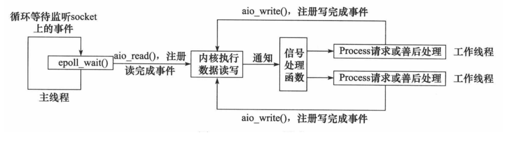

#### 模拟 Proactor 模式

使用同步 I/O 方式模拟出 Proactor 模式。原理是：主线程执行数据读写操作，读写完成之后，主线程向 工作线程通知这一”完成事件“。那么从工作线程的角度来看，它们就直接获得了数据读写的结果，接下 来要做的只是对读写的结果进行逻辑处理。 使用同步 I/O 模型（以 epoll_wait为例）模拟出的 Proactor 模式的工作流程如下：

1. 主线程往 epoll 内核事件表中注册 socket 上的读就绪事件。
2. 主线程调用 epoll_wait 等待 socket 上有数据可读。
3. 当 socket 上有数据可读时，epoll_wait 通知主线程。主线程从 socket 循环读取数据，直到没有更 多数据可读，然后将读取到的数据封装成一个请求对象并插入请求队列。
4. 睡眠在请求队列上的某个工作线程被唤醒，它获得请求对象并处理客户请求，然后往 epoll 内核事 件表中注册 socket 上的写就绪事件。
5. 主线程调用 epoll_wait 等待 socket 可写。
6. 当 socket 可写时，epoll_wait 通知主线程。主线程往 socket 上写入服务器处理客户请求的结果。

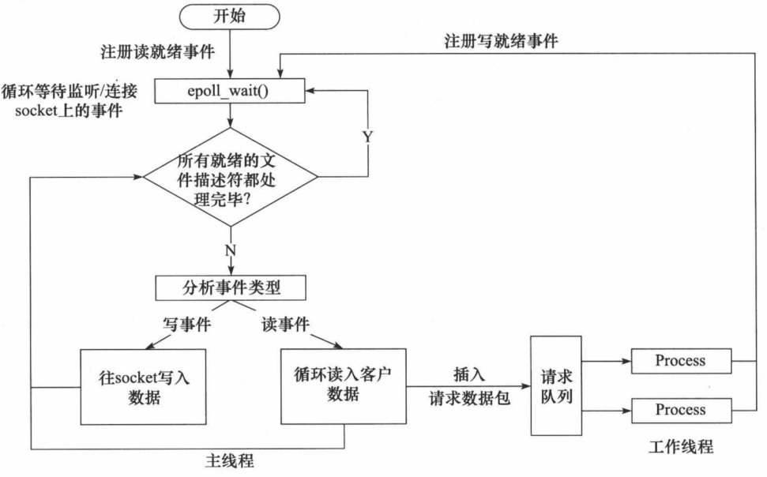

### 线程池

线程池是由服务器预先创建的一组子线程，线程池中的线程数量应该和 CPU 数量差不多。线程池中的所 有子线程都运行着相同的代码。当有新的任务到来时，主线程将通过某种方式选择线程池中的某一个子 线程来为之服务。相比与动态的创建子线程，选择一个已经存在的子线程的代价显然要小得多。至于主 线程选择哪个子线程来为新任务服务，则有多种方式： 

1. 主线程使用某种算法来主动选择子线程。最简单、最常用的算法是随机算法和 Round Robin（轮流 选取）算法，但更优秀、更智能的算法将使任务在各个工作线程中更均匀地分配，从而减轻服务器 的整体压力。 
2. 主线程和所有子线程通过一个共享的工作队列来同步，子线程都睡眠在该工作队列上。当有新的任 务到来时，主线程将任务添加到工作队列中。这将唤醒正在等待任务的子线程，不过只有一个子线 程将获得新任务的”接管权“，它可以从工作队列中取出任务并执行之，而其他子线程将继续睡眠在 工作队列上。

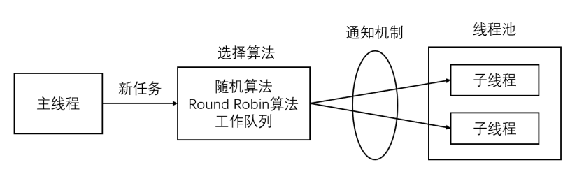

> 线程池中的线程数量最直接的限制因素是中央处理器(CPU)的处理器(processors/cores)的数量 N ：如果你的CPU是4-cores的，对于CPU密集型的任务(如视频剪辑等消耗CPU计算资源的任务)来 说，那线程池中的线程数量最好也设置为4（或者+1防止其他因素造成的线程阻塞）；对于IO密集型的任务，一般要多于CPU的核数，因为线程间竞争的不是CPU的计算资源而是IO，IO的处理一般较慢，多于cores数的线程将为CPU争取更多的任务，不至在线程处理IO的过程造成CPU空闲导 致资源浪费。

* 空间换时间，浪费服务器的硬件资源，换取运行效率。 
* 池是一组资源的集合，这组资源在服务器启动之初就被完全创建好并初始化，这称为静态资源。 
* 当服务器进入正式运行阶段，开始处理客户请求的时候，如果它需要相关的资源，可以直接从池中 获取，无需动态分配。 
* 当服务器处理完一个客户连接后，可以把相关的资源放回池中，无需执行系统调用释放资源。

### 有限自动机

逻辑单元内部的一种高效编程方法：有限状态机（finite state machine）。 

有的应用层协议头部包含数据包类型字段，每种类型可以映射为逻辑单元的一种执行状态，服务器可以 根据它来编写相应的处理逻辑。如下是一种状态独立的有限状态机：

```c++
STATE_MACHINE( Package _pack )
{
    PackageType _type = _pack.GetType();
    switch( _type )
    {
        case type_A:
            process_package_A( _pack );
            break;
        case type_B:
            process_package_B( _pack );
            break;
    }
}
```

这是一个简单的有限状态机，只不过该状态机的每个状态都是相互独立的，即状态之间没有相互转移。 状态之间的转移是需要状态机内部驱动，如下代码：

```c++
STATE_MACHINE()
{
	State cur_State = type_A;
    while( cur_State != type_C )
    {
        Package _pack = getNewPackage();
        switch( cur_State )
        {
            case type_A:
            process_package_state_A( _pack );
            cur_State = type_B;
            break;
            case type_B:
            process_package_state_B( _pack );
            cur_State = type_C;
            break;
        }
    }
}
```

该状态机包含三种状态：type_A、type_B 和 type_C，其中 type_A 是状态机的开始状态，type_C 是状 态机的结束状态。状态机的当前状态记录在 cur_State 变量中。在一趟循环过程中，状态机先通过 getNewPackage 方法获得一个新的数据包，然后根据 cur_State 变量的值判断如何处理该数据包。数据 包处理完之后，状态机通过给 cur_State 变量传递目标状态值来实现状态转移。那么当状态机进入下一 趟循环时，它将执行新的状态对应的逻辑。

### EPOLLONESHOT事件

即使可以使用 ET 模式，一个socket 上的某个事件还是可能被触发多次。这在并发程序中就会引起一个 问题。比如一个线程在读取完某个 socket 上的数据后开始处理这些数据，而在数据的处理过程中该 socket 上又有新数据可读（EPOLLIN 再次被触发），此时另外一个线程被唤醒来读取这些新的数据。于 是就出现了两个线程同时操作一个 socket 的局面。一个socket连接在任一时刻都只被一个线程处理，可 以使用 epoll 的 EPOLLONESHOT 事件实现。 

对于注册了 EPOLLONESHOT 事件的文件描述符，操作系统最多触发其上注册的一个可读、可写或者异 常事件，且只触发一次，除非我们使用 epoll_ctl 函数重置该文件描述符上注册的 EPOLLONESHOT 事 件。这样，当一个线程在处理某个 socket 时，其他线程是不可能有机会操作该 socket 的。但反过来思 考，注册了 EPOLLONESHOT 事件的 socket 一旦被某个线程处理完毕， 该线程就应该立即重置这个 socket 上的 EPOLLONESHOT 事件，以确保这个 socket 下一次可读时，其 EPOLLIN 事件能被触发，进 而让其他工作线程有机会继续处理这个 socket。

### 服务器压力测试

Webbench 是 Linux 上一款知名的、优秀的 web 性能压力测试工具。它是由Lionbridge公司开发。

> * 测试处在相同硬件上，不同服务的性能以及不同硬件上同一个服务的运行状况。 
> * 展示服务器的两项内容：每秒钟响应请求数和每秒钟传输数据量。

基本原理：Webbench 首先 fork 出多个子进程，每个子进程都循环做 web 访问测试。子进程把访问的 结果通过pipe 告诉父进程，父进程做最终的统计结果。
