# Qt入门

## 一、Qt Widgets Application项目

**项目结构：**

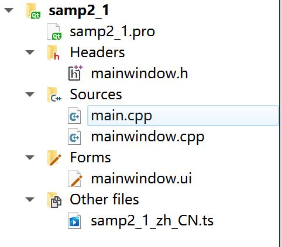

### 1. pro文件

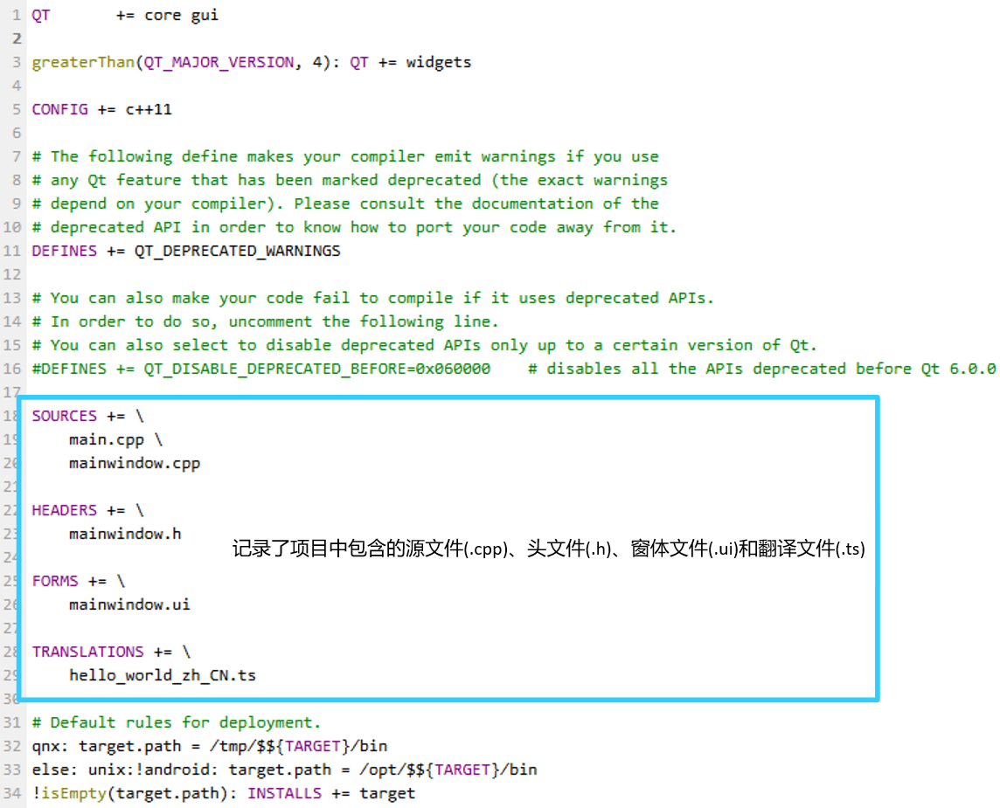

- `Qt += core gui` 项目中加入core gui模块，因此项目中添加模块的方法为：`Qt += 模块名`

~~~
greaterThan(Qt_MAJOR_VERSION, 4): Qt += widgets
~~~

- 上面代码的含义是当Qt版本大于4时，才加入widgets模块

### 2. main.cpp

- main.cpp是主函数文件，其基本框架：

~~~c++
#include <QApplication>
int main(int argc, char *argv[])
{
    QApplication a(argc, argv);
    // 代码
    return a.exec();
}
~~~

- ==Qt中头文件名与类名一致==，知道头文件就知道类名，反之亦然
- Qt头文件是没有 `.h` 的，基本都以大写的 `Q` 开头
- 每个Qt程序==有且只有一个 QApplication 对象==

**Qt Widgets Application main.cpp：**

~~~C++
#include "mainwindow.h"
#include <QApplication>//包含一个应用程序类文件
//main是程序入口 argc命令行变量数量 argv命令行变量数组
int main(int argc, char *argv[])
{
    // a - QApplication应用程序类的对象 在Qt中应用程序对象有且仅有一个（a 用于接受鼠标键盘的命令消息）
    QApplication a(argc, argv);
    // 创建窗口对象MainWindow 
    MainWindow w;
    // 窗口对象w的方法（显示窗口）
    w.show();
    // 让应用程序运行（消息循环）
    return a.exec();
}
~~~

- `MainWindow w;` MainWindow 是自定义的类，继承自 QMainWindow 主窗口类，因此 MainWindow 也是一个主窗口类。w 是 MainWindow 类实例化出的对象，表示一个主窗口。
- `w.show();` 默认情况下，Qt 提供的所有组件（控件、部件）都是隐藏的，不会自动显示。通过调用 MainWindow 类提供的 show() 方法，w 窗口就可以在程序运行后显示出来。
- `return a.exec();` 一个 Qt 界面程序要想接收事件，main() 函数中就必须调用 QApplication 对象的 exec() 函数，它的功能就是使程序能够持续不断地接收各种**事件**。
  - **Qt 事件**指的是应用程序和用户之间的交互过程，如用户按下按钮，点击输入框等


### 3.mainwindow.h和mainwindow.cpp

- 项目定义了一个继承自QMainWindow的主窗口类，并起名为MainWindow，定义部分在mainwindow.h，实现部分在mainwindow.cpp。

~~~c++
//mainwindow.h
#ifndef MAINWINDOW_H
#define MAINWINDOW_H

#include <QMainWindow> // Qt窗口类头文件

QT_BEGIN_NAMESPACE
namespace Ui { class MainWindow; } // 在命名空间UI中声明MainWindow类
QT_END_NAMESPACE

class MainWindow : public QMainWindow // 自定义的MainWindow类（继承自QMainWindow）
{
    Q_OBJECT// 宏 - Qt信号和槽机制

public:
    MainWindow(QWidget *parent = nullptr);// 带参构造函数
    ~MainWindow();// 析构函数

private:
    Ui::MainWindow *ui;// 声明了指向名字空间UI中MainWindow类的对象的指针，它指向可视化设计界面
};
#endif // MAINWINDOW_H
~~~

- 带参的构造函数：==QWidget 是所有组件的基类==，参数parent函数为指向该对象的父对象的指针，若该对象没有父对象，则默认为空指针（==默认析构的时候==）。
  - 父窗口被删除时，所有子窗口也会随之一起被删除。

~~~c++
//mainwindow.cpp
#include "mainwindow.h"
#include "ui_mainwindow.h"

MainWindow::MainWindow(QWidget *parent)// 使用初始化参数列表
    : QMainWindow(parent)              // 执行父类QMainWindow的构造函数
    , ui(new Ui::MainWindow)           // 用new为类分配内存，ui就是MainWindow私有部分定义的指针变量ui
{
    ui->setupUi(this);                 // 执行Ui::MainWindow类的setupUi()函数
}

MainWindow::~MainWindow()
{
    delete ui;// 删除用new创建的对象
}

~~~

### 涉及的英文单词

- widget	n. 小装置
  - [N-COUNT]You can refer to any small device as a widget when you do not know exactly what it is or how it works.

## 二、Qt对象树模型

- QObject会用对象树来管理自己
  - QObject类中有一个私有变量 `QList<QObject*>` ,专门用来存储这个类的子孙后代。
  - 创建一个QObject对象并指定父对象时，就会把自己加入到父对象的children()列表中，也就是 `QList<QObject*>` 变量中。
  - ==父对象析构时，这个`QList<QObject*>` 变量中的所有对象也会被析构==
  - ==父对象并不是继承意义上的父类==

- ==创建QObject时，应指定其父类==

~~~c++
#include "mainwindow.h"

#include <QApplication>

int main(int argc, char *argv[])
{
    QApplication a(argc, argv);
    MainWindow w;
    w.show();
    QLabel lab("hello",&w);// 调用QLabel对象并指定其父对象为 w
    lab.show();// 调用show()方法才能显示Label
    return a.exec();
}
~~~

- **注意：**无法用显式法：`QLabel lab = QLabel("hello",&w);` 来创建对象

### 1. 对象树的析构顺序

- 正常情况下，==后创建的对象会先被析构==

~~~
#include "mainwindow.h"
#include <QApplication>
#include <QLabel>

int main(int argc, char *argv[])
{
    QApplication a(argc, argv);
    MainWindow w;
    w.show();
    QLabel lab("hello",&w);// 调用QLabel对象并指定其父对象为 w
    lab.show();// 调用show()方法才能显示Label
    return a.exec();
}
~~~

- 在该例中，子对象lab后创建，被先析构，然后再析构Mainwindow，最后是a

- 因此，==子对象应在父对象创建后创建==，否则，会出现父对象析构，再析构子对象的情况，而此时已经随父对象析构而析构，因此会出错，此类错误编译不会报错，只有运行时会出现问题。

~~~c++
#include "mainwindow.h"
#include <QApplication>
#include <QLabel>

int main(int argc, char *argv[])
{
    QApplication a(argc, argv);
    //lab 对象在其父对象w之前被声明
    QLabel lab;
    MainWindow w;
    lab.setParent(&w);
    w.show();
    lab.show();
    return a.exec();
}
~~~

上例仅在运行时会出现问题，问题如图：

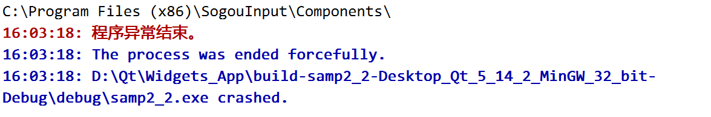

## 三、QWidget对象的实现

- QWidget是能够在屏幕上显示的一切组件的父类，QWidget继承自QObject。

### 1. 对象的代码实现

- **注意： 子对象应在父对象之后创建**
- **注意：应尽快可能在对象初始化的时候就指定其父对象**
- 习惯在堆内存上创建对象 `类名 *对象指针 = new 类构造函数; 对象指针->成员; delete 类指针`

初始化时指定其父对象：

~~~c++
MainWindow w;
QLabel lab("hello",&w);// 初始化时指定其父对象
~~~

设置父对象：

~~~C++
MainWindow w;
QLabel lab;
lab.setParent(&w);// 指定其父对象为主窗口
lab.setText("hello");// 设置文本为 hello
~~~

#### （1）在main.cpp中实现

- 应包含定义对象的头文件如 `#include <QLabel>`

~~~c++
#include "mainwindow.h"
#include <QApplication>
#include <QLabel>

int main(int argc, char *argv[])
{
    QApplication a(argc, argv);
    MainWindow w;
    QLabel lab("hello",&w);// 调用QLabel对象并指定其父对象为 w
    w.show();// show()方法可以将主窗口对象w及其子对象都显示出来
    return a.exec();
}
~~~

**输出：**

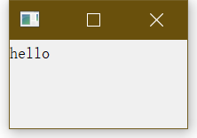

#### （2）在MainWindow自定义类中实现

~~~c++
//mainwindow.h
#ifndef MAINWINDOW_H
#define MAINWINDOW_H

#include <QMainWindow>
#include <QLabel>// 引入 QLabel 文本框组件的头文件
class MainWindow : public QMainWindow
{
    Q_OBJECT

public:
    MainWindow(QWidget *parent = nullptr);
    ~MainWindow();
private:
    QLabel *lab;//定义一个私有的 QLabel 指针对象
};
#endif // MAINWINDOW_H


//mainwindow.cpp
#include "mainwindow.h"

MainWindow::MainWindow(QWidget *parent)
    : QMainWindow(parent)//初始化列表 - 调用父类QMainWindow的构造函数
{
    // 使用new操作符在堆区创建对象
    // 使用this指针可以方便的指定主窗口对象为其父对象
    this->lab = new QLabel("hello",this);
}

MainWindow::~MainWindow()
{
}

//mainwindow.
#include "mainwindow.h"
#include <QApplication>

int main(int argc, char *argv[])
{
    QApplication a(argc, argv);
    MainWindow w;
    w.show();// 只需要调用一次show()方法就可以显示主窗口对象和Lab对象
    return a.exec();
}

~~~

**输出：**


## 四、Qt窗口类

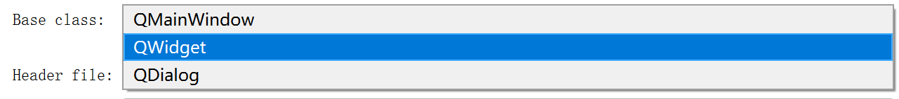

### 1. 基础窗口类

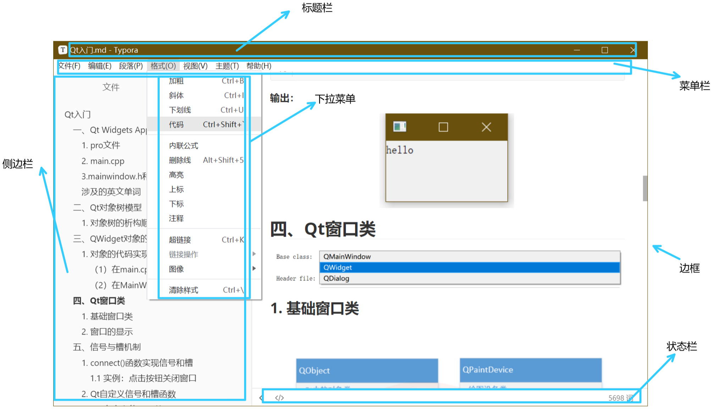

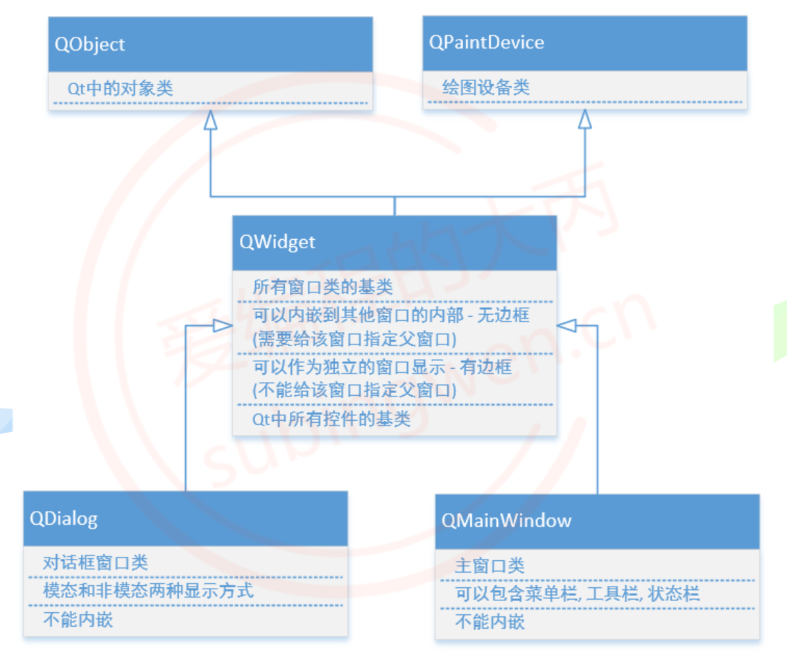


- 常用的窗口类有3个：QMainWindow、QDialog、QWidget

**QWidget**

- 所有窗口的基类
- Qt中的控件（按钮、输入框 ...）也属于窗口，基类都是QWidget
- 可以不内嵌单独显示：独立的窗口，有边框

**QDialog**

- 对话框类，
- 不能内嵌到其他窗口中

**QMainWindow**

- 有工具栏、状态栏、菜单栏。
- 不能内嵌到其他窗口中

### 2. QWidget的显示

> QWidget窗口类的特点
>
> - 所有窗口的子类；
> - 可以内嵌到其他窗口内部 - 无边框，需要指定父窗口
> - 可以作为独立窗口显示 - 有边框，不能给该窗口指定父窗口
> - ==所有窗口及窗口控件都是从QWiget直接或间接派生出来的==；

**内嵌窗口：**

- 内嵌窗口是创建时指定其父对象的窗口

- 依附于某一个大的窗口，作为大窗口的一部分
- 大窗口就是这个内嵌窗口的父窗口
- **父窗口显示的时候，内嵌窗口也被显示出来**
- 内嵌窗口无边框、无标题栏等

**不内嵌的窗口：**

- 创建时没有指定其父对象的窗口

- 这类窗口有边框，有标题栏
- 需要调用函数才能显示

**示例：**

1. 创建Qt Widgets Application项目

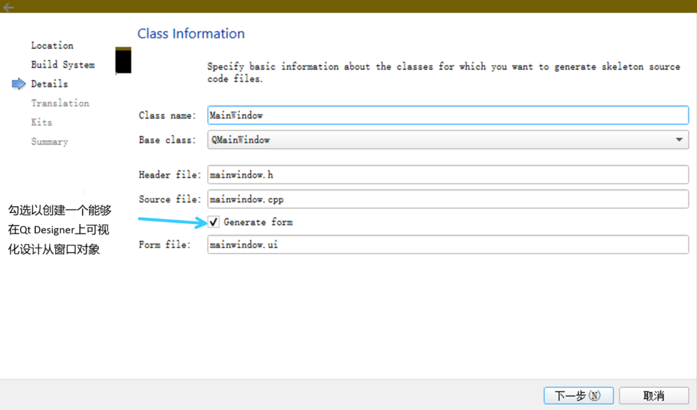

2. 在项目中添加新的Qt 设计师界面类

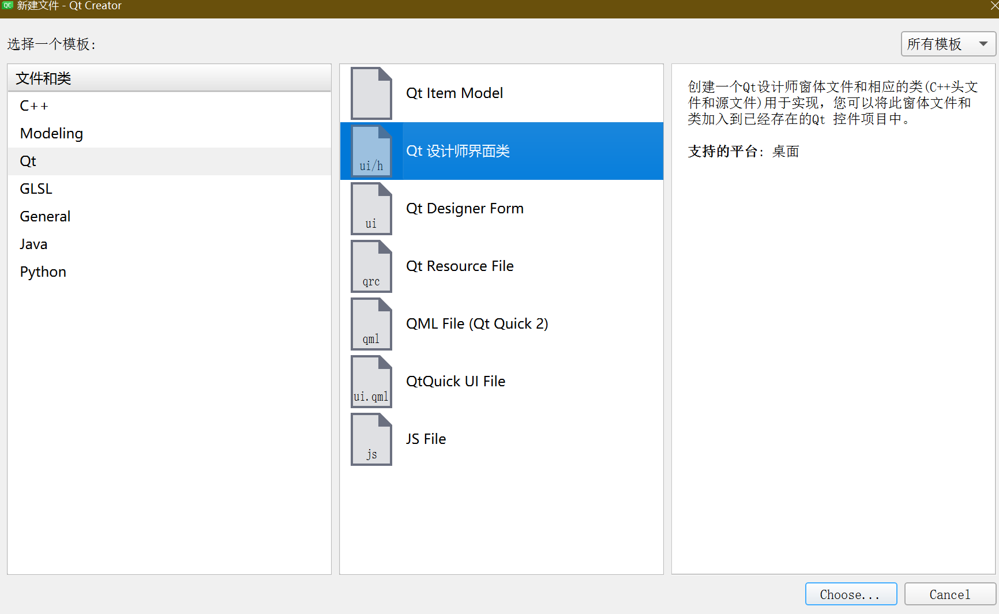

选择界面模板为Widget

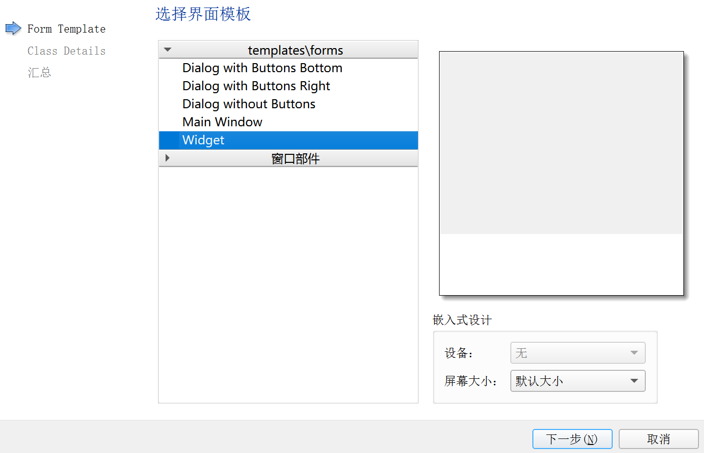

3. 设计Widget窗口

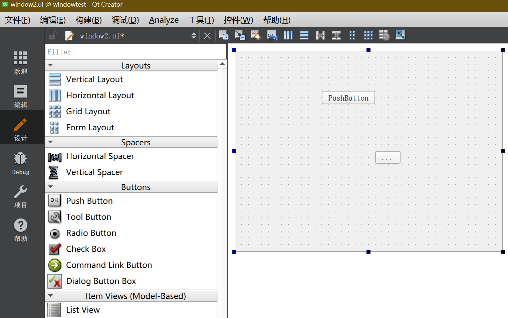

4. 设计程序

**不内嵌的窗口**

```c++
///mainwindow.cpp///
#include "mainwindow.h"
#include "ui_mainwindow.h"
#include "window2.h"

MainWindow::MainWindow(QWidget *parent)
    : QMainWindow(parent)
    , ui(new Ui::MainWindow)
{
    ui->setupUi(this);
    Window2* w2 = new Window2;// 未指定父类
    // 由于未指定父类，需要调用show()将w2窗口显示出来
    w2->show();
}

MainWindow::~MainWindow()
{
    delete ui;
}
```

**结果：**

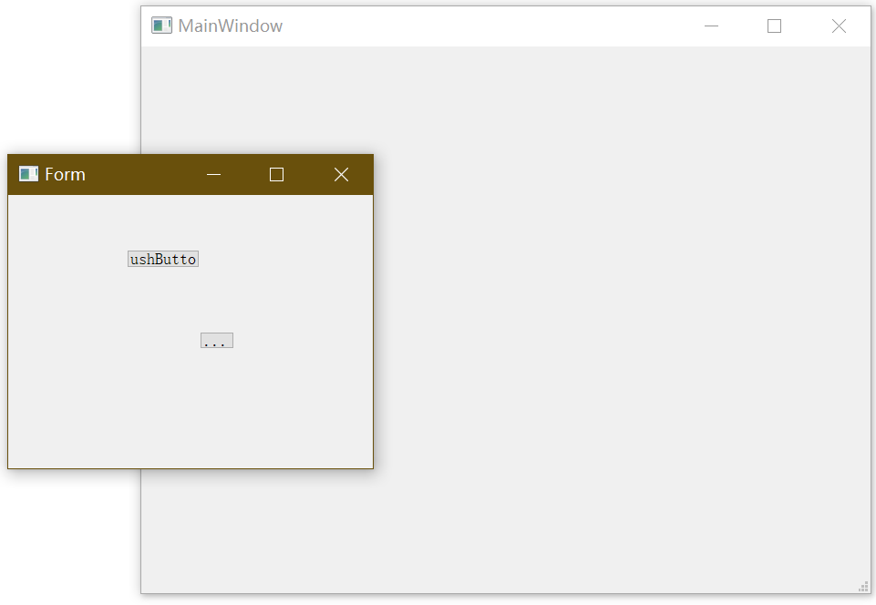

**内嵌窗口**

~~~c++
#include "mainwindow.h"
#include "ui_mainwindow.h"
#include "window2.h"

MainWindow::MainWindow(QWidget *parent)
    : QMainWindow(parent)
    , ui(new Ui::MainWindow)
{
    ui->setupUi(this);
    Window2* w2 = new Window2(this);// 指定父类为主窗口
}

MainWindow::~MainWindow()
{
    delete ui;
}
~~~

**结果：**

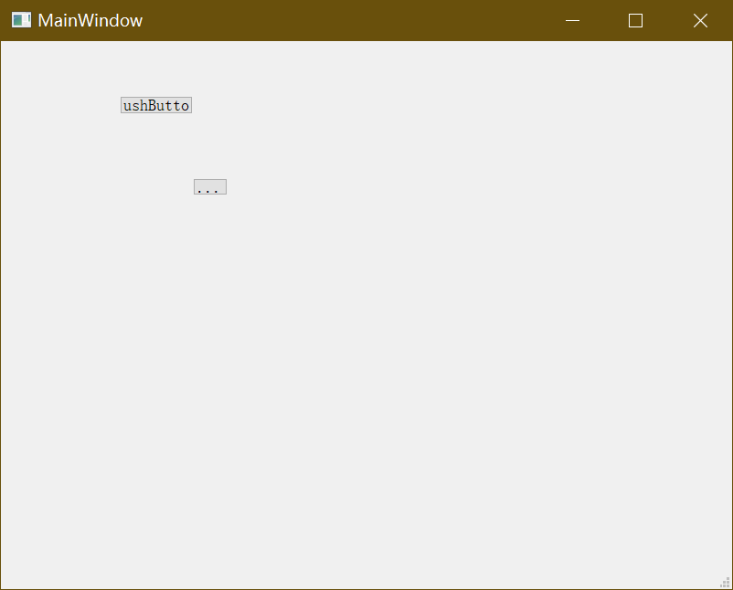

### 3. 窗口坐标体系

#### （1）窗口的坐标原点

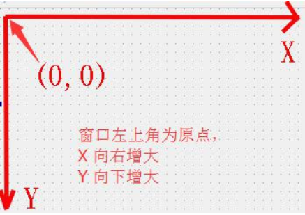

#### （2）窗口的相对坐标

在一个Qt窗口中一般由很多子窗口内嵌到父窗口，子窗口中又可以内嵌子窗口或是其他控件

- 每个子窗口都有自己的坐标原点。
- 子窗口在父窗口中的位置就是该子窗口左上角坐标原点在父窗口中的坐标；
- Qt中窗口显示的时候使用的**相对坐标，相对于自己的父窗口**；
- 将子窗口移动到父窗口的某个位置

~~~c++
// 所有窗口类的基类: QWidget
// QWidget中提供了移动窗口的 API函数
// 参数 x, y是要移动的窗口的左上角的点, 窗口的左上角移动到这个坐标点
void QWidget::move(int x, int y);
void QWidget::move(const QPoint &);
~~~

### 4. QDialog类型窗口的特点

> **对话框窗口类**
>
> - 不能内嵌
> - 模态（`exec()`）和非模态（`show()`）两种显示方式

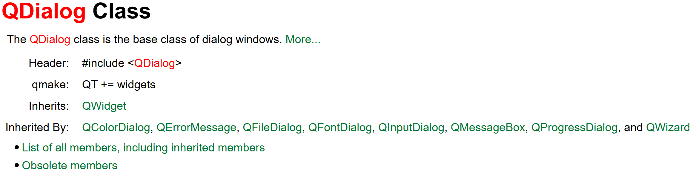

#### （1）模态和非模态两种显示方式

- **非模态：**窗口间能随意切换

> 使用 `show()` 方法显示Dialog窗口

~~~c++
MainWindow::MainWindow(QWidget *parent)
    : QMainWindow(parent)
    , ui(new Ui::MainWindow)
{
    ui->setupUi(this);

    // 虽然指定了MainWindow对象为其父对象，
    // 但Dialog窗口不会嵌入的主窗口中，也不会随父窗口一起显示
    // 但是仍遵循对象树的规则，就是主窗口关闭时，作为子窗口的Dialog窗口也会关闭
    Dialogtest* dlg = new Dialogtest(this);
    dlg->show();// Dialog窗口非模态显示
}
~~~

- **模态：**

> 使用 `exec()` 方法显示Dialog窗口
>
> - 模态显示会**阻塞程序执行**即进行到 `dlg->exec();` 后程序将不再往下执行。除非模态显示窗口关闭，程序才能继续执行。
> - 模态显示时，焦点将保持停留在模态显示的Dialog窗口，无法切换到其他窗口。

```c++
Dialogtest* dlg = new Dialogtest;
dlg->exec();// Dialog窗口非模态显示
```

### 5. QMainWindow

>**主窗口类**
>
>- 可以包含菜单栏(QMenuBar)、工具栏(QToolBar)、状态栏(QStatusBar)
>- 不能内嵌 

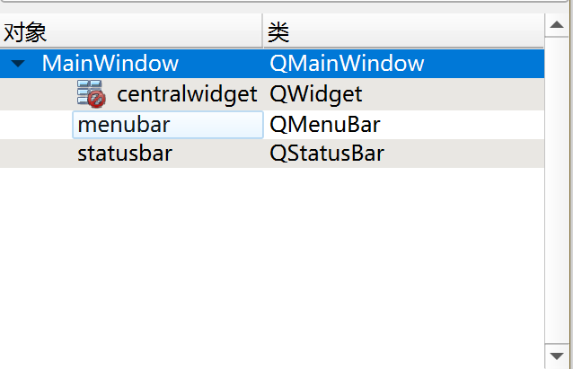

- 菜单栏和状态栏只能有一个，工具栏可以有多个。

### 6. QWidget类常用API


## 五、 Qt数据类型

>- Qt 数据类型是对C/C++ 常用数据类型的封装
>
>- 使用编写Qt程序时，没有必要用Qt定义的数据类型，直接用int、double、就行

### 1. 基础数据类型

> Qt 基本数据类型定义在`#include <QtGlobal>`

### 2. log日志输出

> Qt中进行日志输出，一般不使用c中的 `printf` ，也不使用 C++ 中的 `cout` ，Qt框架提供了专门用于日志输出的类，头文件名为 `QDebug` 使用方法如下：

```c++
#include <QApplication>
#include <QDebug> // 包含QDebug头文件

int main(int argc, char *argv[])
{
    QApplication a(argc, argv);

    int i = 10;
    qDebug() << "hello world!" << endl;
    qDebug() << "i + 1 = " << i + 1 << endl;

    return a.exec();
}
```

**输出结果：**

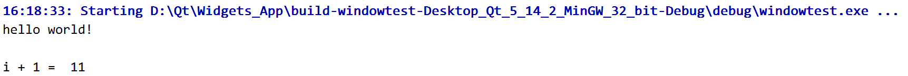

~~~c++
// 和全局函数 qDebug() 类似的日志函数还有: qWarning(), qInfo(), qCritical()
int number = 666;
float i = 11.11;
qWarning() << "Number:" << number << "Other value:" << i;
qInfo() << "Number:" << number << "Other value:" << i;
qCritical() << "Number:" << number << "Other value:" << i;

~~~

### 3. 字符串类型

> C	$\Rightarrow$ `char* `
>
> C ++ $\Rightarrow$ `char*`,`std::String`
>
> Qt	$\Rightarrow$ `QByteArray`, `QString`

#### （1）QByteArray

> - c语言中 `char*` 的升级版本
> - 通过这个类的构造函数申请一块**动态内存**

#### （2）QString

> `QString` 封装好的字符串，内部编码为 `utf8` ，UTF-8 属于 Unicode 字符集，固定使用多个字节（Windows为2字节，linux为3字节）来表示一个字符，这样可以将世界上几乎所有语言的常用字符收录其中

**常用数字类型转QString**

~~~c++
public: static QString QString::number(long n, int base = 10);// base为进制数
public: static QString QString::number(int n, int base = 10);
public: static QString QString::number(double n, char format = 'g', int precision = 6);
~~~


### 4. 几何元素类型

> Qt 对常见的点、线、尺寸和矩形都进行了封装

#### （1）QPoint - 点类

> `QPoint` 类封装了我们常用到的坐标点 `(x,y)` 

**QPoint 构造函数**

~~~c++
QPoint::QPoint();// 无参构造，默认构造，默认(0,0)点
QPoint::QPoint(int xpos, int ypos);// 有参构造，参数为x，y轴坐标
~~~

**设置/修改坐标**

~~~c++
// 设置x轴坐标
void QPoint::setX(int x);
// 设置y轴坐标
void QPoint::setY(int y);
~~~

**获取坐标值/引用**

~~~c++
// 得到x轴坐标
int QPoint::x() const;
// 得到x轴坐标的引用
int &QPoint::rx();
// 得到y轴坐标
int QPoint::y() const;
// 得到y轴坐标的引用
int &QPoint::ry();
~~~

**加减乘除运算**

- **QPoint**对运算符 `+`、`-` 、`* `、`/ `进行了重载。因此可以直接用运算符进行坐标的加减乘除运算

#### （2）QLine - 线段类

> `QLine` 是线类段，封装了两个点类(`QPoint`)。

**构造函数**

~~~c++
QLine::QLine();// 默认构造，空对象
QLine::QLine(const QPoint &p1, const QPoint &p2);// 两点QPoint确定一条线段QLine
QLine::QLine(int x1, int y1, int x2, int y2);// 起点(x1,y1)、终点(x2,y2)确定的一条线段
~~~

**设置/修改**

~~~c++
// 给线段对象设置坐标点
void QLine::setPoints(const QPoint &p1, const QPoint &p2);
// 起始点(x1, y1), 终点(x2, y2)
void QLine::setLine(int x1, int y1, int x2, int y2);
// 设置线段的起点坐标
void QLine::setP1(const QPoint &p1);
// 设置线段的终点坐标
void QLine::setP2(const QPoint &p2);
~~~

**获取坐标点**

~~~c++
// 返回线段的起始点坐标
QPoint QLine::p1() const;
// 返回线段的终点坐标
QPoint QLine::p2() const;
// 返回值线段的中心点坐标, =(.p1() + .p2()) / 2
QPoint QLine::center() const;

// 返回值线段起点的 x 坐标
int QLine::x1() const;
// 返回值线段终点的 x 坐标
int QLine::x2() const;
// 返回值线段起点的 y 坐标
int QLine::y1() const;
// 返回值线段终点的 y 坐标
int QLine::y2() const;
~~~

**平移线段**

~~~c++
// 用给定的坐标点平移这条直线
void QLine::translate(const QPoint &offset);
void QLine::translate(int dx, int dy);// 参数为平移的x，y方向增量
// 用给定的坐标点平移这条直线, 返回平移之后的坐标点
QLine QLine::translated(const QPoint &offset) const;
QLine QLine::translated(int dx, int dy) const;
~~~

**直线对象进行比较**

~~~c++
// 直线对象进行比较
bool QLine::operator!=(const QLine &line) const;
bool QLine::operator==(const QLine &line) const;
~~~

#### （3）QSize - 尺寸类

> Qt中 `QSize` 类用来形容长度和宽度

**构造函数**

~~~c++
QSize::QSize();// 默认构造，对象中宽和高都是无效的
QSize::QSize(int width, int height);// 带参构造，width宽度，height高度
~~~

**设置/修改**

~~~c++
// 设置宽度
void QSize::setWidth(int width)
// 设置高度
void QSize::setHeight(int height);
~~~

**获取尺寸数据**

~~~c++
// 得到宽度
int QSize::width() const;
// 得到宽度的引用
int &QSize::rwidth();
// 得到高度
int QSize::height() const;
// 得到高度的引用
int &QSize::rheight();
~~~

**高度和宽度数据交换**

~~~c++
// 交换高度和宽度的值
void QSize::transpose();
// 交换高度和宽度的值, 返回交换之后的尺寸信息
QSize QSize::transposed() const;
~~~

**加减乘除运算**

- **QSize**对运算符 `+`、`-` 、`* `、`/ `进行了重载。因此可以直接用运算符进行尺寸类的加减乘除运算

#### （4）QRect - 矩形类

> Qt中 `QRect` 类用来描述一个矩阵

**构造函数**

~~~c++
// 构造一个空对象
QRect::QRect();
// 基于左上角坐标, 和右下角坐标构造一个矩形对象
QRect::QRect(const QPoint &topLeft, const QPoint &bottomRight);
// 基于左上角坐标, 和 宽度, 高度构造一个矩形对象
QRect::QRect(const QPoint &topLeft, const QSize &size);
// 通过 左上角坐标(x, y), 和 矩形尺寸(width, height) 构造一个矩形对象
QRect::QRect(int x, int y, int width, int height);
~~~

**设置/修改**

~~~c++
// 设置矩形的尺寸信息, 左上角坐标不变
void QRect::setSize(const QSize &size);
// 设置矩形左上角坐标为(x,y), 大小为(width, height)
void QRect::setRect(int x, int y, int width, int height);
// 设置矩形宽度
void QRect::setWidth(int width);
// 设置矩形高度
void QRect::setHeight(int height);
~~~

**获取值**

~~~c++
// 返回值矩形左上角坐标
QPoint QRect::topLeft() const;
// 返回矩形右上角坐标
// 该坐标点值为: QPoint(left() + width() -1, top())
QPoint QRect::topRight() const;
// 返回矩形左下角坐标
// 该坐标点值为: QPoint(left(), top() + height() - 1)
QPoint QRect::bottomLeft() const;
// 返回矩形右下角坐标
// 该坐标点值为: QPoint(left() + width() -1, top() + height() - 1)
QPoint QRect::bottomRight() const;
// 返回矩形中心点坐标
QPoint QRect::center() const;

// 返回矩形上边缘y轴坐标
int QRect::top() const;
int QRect::y() const;
// 返回值矩形下边缘y轴坐标
int QRect::bottom() const;
// 返回矩形左边缘 x轴坐标
int QRect::x() const;
int QRect::left() const;
// 返回矩形右边缘x轴坐标
int QRect::right() const;

// 返回矩形的高度
int QRect::width() const;
// 返回矩形的宽度
int QRect::height() const;
// 返回矩形的尺寸信息
QSize QRect::size() const;
~~~


## 六、QTimer类

### 1. public/slot function

~~~c++
// 构造函数
QTimer::QTimer(QObject *parent = nullptr);

// 设置定时器时间间隔为 msec (毫秒)
// 默认值是0，一旦窗口系统事件队列中的所有事件都已经被处理完，一个时间间隔为0的QTimer就会触发
void QTimer::setInterval(int msec);
// 获取定时器的时间间隔, 返回值单位: 毫秒
int QTimer::interval() const;

// 根据指定的时间间隔启动或者重启定时器, 需要调用 setInterval() 设置时间间隔
slots: void QTimer::start();
// 启动或重新启动定时器，超时时间隔为msec毫秒。
slots: void QTimer::start(int msec);
// 停止定时器。
slots: void QTimer::stop();

// 设置定时器精度
/*
参数Qt::TimerType为枚举类型：
    - Qt::PreciseTimer		0 	-> 精确的精度, 毫秒级
    - Qt::CoarseTimer   	1	-> 粗糙的精度, 和1毫秒的误差在5%的范围内, 默认精度
    - Qt::VeryCoarseTimer 	2	-> 非常粗糙的精度, 精度在1秒左右
*/
void QTimer::setTimerType(Qt::TimerType atype);
Qt::TimerType QTimer::timerType() const;	// 获取当前定时器的精度

// 如果定时器正在运行，返回true; 否则返回false。
bool QTimer::isActive() const;

// 判断定时器是否只触发一次
bool QTimer::isSingleShot() const;
// 设置定时器是否只触发一次, 参数为true定时器只触发一次, 为false定时器重复触发, 默认为false
void QTimer::setSingleShot(bool singleShot);
~~~

### 2. signals

- 当定时器超时时，该信号就会发出

~~~c++
signals: void QTimer::timeout();
~~~

### 3. static public function

~~~c++
// 其他同名重载函数可以自己查阅帮助文档
/*
功能: 在msec毫秒后发射一次信号, 并且只发射一次
参数:
	- msec:     在msec毫秒后发射信号
	- receiver: 接收信号的对象地址
	- method:   槽函数地址
*/
[static] void QTimer::singleShot(
        int msec, const QObject *receiver, 
        PointerToMemberFunction method);
~~~

### 4. 使用实例

> 设计一个窗口程序，当按钮被点击时，显示当前时间（每秒更新一次）；当按钮再次被按下，时间停止。

#### （1）在Qt Designer中设计界面

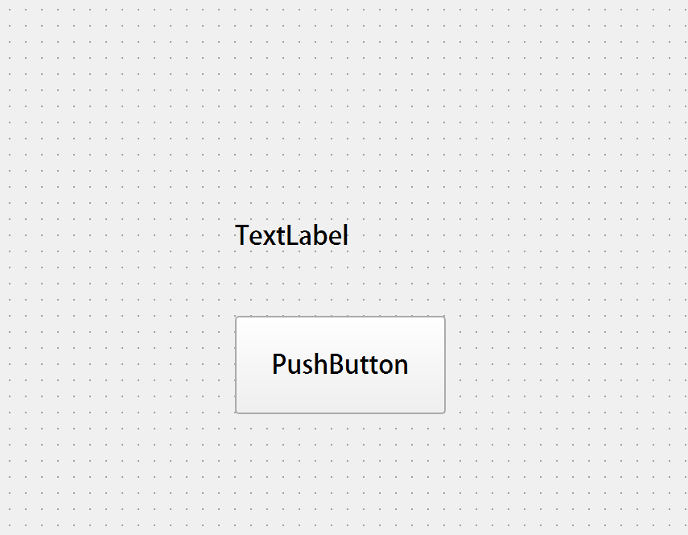

#### （2）编写MainWindow.cpp程序

~~~c++
#include "mainwindow.h"
#include "ui_mainwindow.h"
#include <QTimer> // Qt计时器类头文件
#include <QTime> // Qt时间类头文件

MainWindow::MainWindow(QWidget *parent)
    : QMainWindow(parent)
    , ui(new Ui::MainWindow)
{
    ui->setupUi(this);

    // 创建计时器对象，指定父对象为主窗口
    QTimer* t = new QTimer(this);
    ui->pushButton->setText("开始计时");
	///
    // 按钮对象 pushButton 被点击事件
    // 当定时器在计时时，按钮显示文字应为“结束计时”，按钮按下后，计数器停止，文字变为“开始计时”
    // 当定时器不在计时，按钮显示文字应为“开始计时”，按钮按下后，计数器开始计时，文字变为“开始计时”
    ///
    /* Lambda = 号值传递方式捕获，用 & 会出错，尚不清楚原因 */
    connect(ui->pushButton,&QPushButton::clicked,this,[=]()
    {
        if( t->isActive() ) // 判断定时器是否在运行，是isActive()返回True
        {
            // 计时器是在运行则关闭计时器
            t->stop();// 关闭计时器
            ui->pushButton->setText("开始计时");
        }
        else
        {
            // 计时器没有运行
            t->start(1000);// 以计时时间隔1000ms启动计数器
            ui->pushButton->setText("结束计时");
        }

    });

    // 计时器发送计时间隔信号后，要在label对象中更新时间
    connect(t,&QTimer::timeout,this,[=]{
        QTime tm = QTime::currentTime();// 得到当前系统时间数据
        // 格式化当前得到的系统时间
        QString tmstr = tm.toString("hh:mm:ss.zzz");
        ui->label->setText(tmstr);
    });

}

MainWindow::~MainWindow()
{
    delete ui;
}
~~~

**代码解释补充：**

- `connect()` 函数中，Lambda函数采用 `[=]` 值传递方式，用来捕获上下文中的对象指针，来对对象属性进行修改

~~~c++
QTime tm = QTime::currentTime();// 得到当前系统时间数据
~~~

**查阅 `QTime` 帮助文档：**

*QTime 类的功能描述*

> A QTime object contains a clock time, which it can express as the numbers of hours, minutes, seconds, and milliseconds since midnight. It provides functions for comparing times and for manipulating a time by adding a number of milliseconds.
>
> QTime uses the 24-hour clock format; it has no concept of AM/PM. Unlike [QDateTime](), QTime knows nothing about time zones or daylight-saving time (DST).

*QTime 类的实例化方式*

> A QTime object is typically created either by giving the number of hours, minutes, seconds, and milliseconds explicitly, or by using the static function `currentTime()` , which creates a QTime object that represents the system's local time.

~~~c++
static: QTime QTime::currentTime()
~~~

*QTime 中toString()方法*

~~~c++
public: QString QTime::toString(const QString &format) const
~~~

> Returns the time as a string. The *format* parameter determines the format of the result string.

| Format         | Result       |
| -------------- | ------------ |
| `hh:mm:ss.zzz` | 14:13:09.042 |
| `h:m:s ap`     | 2:13:9 pm    |
| `H:m:s a`      | 14:13:9 pm   |


## 七、信号与槽机制

- [Qt实用技能4-认清信号槽的本质 - 知乎 (zhihu.com)](https://zhuanlan.zhihu.com/p/75126932)

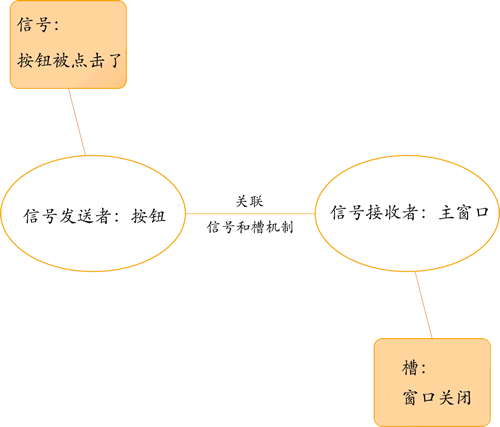

- **信号和槽**机制底层是通过==函数间的相互调用实现的==
  - 每个信号都可以用函数来表示，称为**信号函数**；
  - 每个槽也可以用函数表示，称为**槽函数**

> 例如，“按钮被按下”这个信号可以用 clicked() 函数表示，“窗口关闭”这个槽可以用 close() 函数表示，信号和槽机制实现“点击按钮会关闭窗口”的功能，其实就是 clicked() 函数调用 close() 函数的效果。

**注意：**非所有的控件之间都能通过信号和槽关联起来，信号和槽机制只适用于满足以下条件的控件：

- 控件类必须直接或者间接继承自 QObject 类；
- 控件类中必须包含 private 属性的 Q_OBJECT 宏

### 1. connect()函数实现信号和槽

> connect() 是 QObject 类中的一个静态成员函数，专门用来关联指定的信号函数和槽函数

- 关联某个信号函数和槽函数，需要搞清楚以下 4 个问题：
  - 信号发送对象；
  - 信号函数；
  - 信号接收对象；
  - 接收信号的槽函数；

**connect()函数一般使用形式**

~~~
connect(发送对象指针，&发送对象类::信号函数名，接收对象指针，&槽函数名);
~~~

- 要求信号和槽参数一致，即参数类型一致。
  - 允许槽函数的参数个数比信号函数少，但是==前面的对应参数必须一致==，信号函数的更多参数可以忽略

#### 1.1 实例：点击按钮关闭窗口

- QPushButton帮助文档查询

> QPushButton(const QString &*text*, QWidget **parent* = nullptr)

- 代码实现

~~~c++
//mainwindow.h
#ifndef MAINWINDOW_H
#define MAINWINDOW_H

#include <QMainWindow>
#include <QLabel>		// 引入 QLabel 文本框组件的头文件
#include <QPushButton>	// 引入QPushButton 按钮组件的头文件
class MainWindow : public QMainWindow
{
    Q_OBJECT

public:
    MainWindow(QWidget *parent = nullptr);
    ~MainWindow();
private:
    QLabel *lab;		//定义一个私有的 QLabel 对象指针
    QPushButton *button;//定义一个私有的 QPushButton 对象指针
};
#endif // MAINWINDOW_H

//mainwindow.cpp
#include "mainwindow.h"

MainWindow::MainWindow(QWidget *parent)
    : QMainWindow(parent)
{
    setMinimumSize(500,450);//设置整个界面的最小尺寸为宽500、高450
    setMaximumSize(800,750);//设置整个界面的最大尺寸为宽800、高750
    // 初始化文本框和按钮对象，指定其父对象为主窗口
    this->lab = new QLabel("hello",this);
    this->button = new QPushButton("close",this);

    ///
    // 设置位置和大小
    // 前两个参数为位置坐标(水平、垂直)
    // 后两个参数为大小尺寸(宽度、高度)
    ///
    lab->setGeometry(225,175,100,50);
    button->setGeometry(400,400,100,50);
    connect(button,&QPushButton::clicked,this,&QMainWindow::close);
}

MainWindow::~MainWindow()
{
}

// main.cpp
#include "mainwindow.h"
#include <QApplication>

int main(int argc, char *argv[])
{
    QApplication a(argc, argv);
    MainWindow w;
    w.show();
    return a.exec();
}
~~~

**结果：**

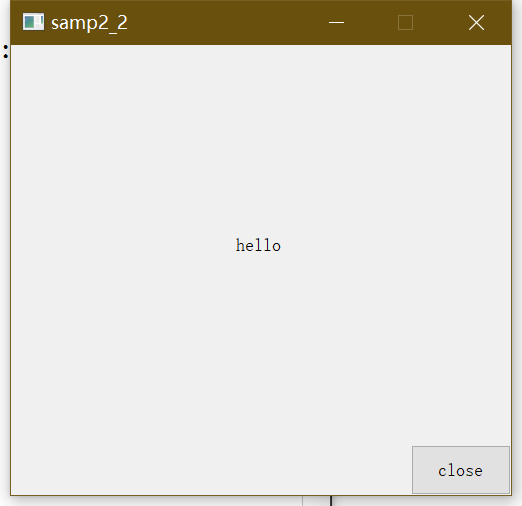

点击close按钮后可将窗口关闭

### 2. Qt自定义信号和槽函数

- Qt 的各个控件类提供了一些常用的信号函数和槽函数，可以满足一般使用要求。
- ==可以根据需要自定义信号函数和槽函数==

#### 2.1 自定义信号函数

**信号函数**指的是符合以下条件的函数：

- 定义在某个类中，该类==直接或间接继承自 QObject 类，且该类中必须有Q_OBJECT宏==；
- ==用 signals 关键字修饰==；
- ==函数只需要声明，不需要实现==；
- 函数的==返回值类型为 void==，参数的类型和个数不限。

**示例：**

~~~c++
///newspaper.h///
#ifndef NEWSPAPER_H
#define NEWSPAPER_H

#include <QObject>

class newspaper : public QObject
{
    Q_OBJECT//凡是 QObject 类，都应该在第一行代码写上 Q_OBJECT
public:
    explicit newspaper(QObject *parent = nullptr);
    void send()//定义触发函数，调用该函数将触发信号函数
    {
        // 给信号函数发送报纸名来进行触发
        emit newPaper("Today Newspaper");
    }
signals:// 信号函数必须用signals关键字修饰
    void newPaper(const QString& name);//定义信号函数，输入参数为报刊名，返回值须为void
};

#endif // NEWSPAPER_H

///newspaper.cpp///
#include "newspaper.h"

//	初始化参数列表执行父类的构造函数
//	 - parent参数来指定对象的父对象
newspaper::newspaper(QObject *parent) : QObject(parent)
{

}
~~~

- emit 是 Qt 对 C++ 的扩展，是一个关键字（其实也是一个宏）。 emit 的含义是发出，也就是发出`newPaper()`信号。  感兴趣的接收者会关注这个信号，可能还需要知道是哪份报纸发出的信号？所以，我们
  将实际的报纸名字 Today Newspaper 当做参数传给这个信号。当接收者连接这个信号时，就可以通过槽函数获得实际值。这样就完成了数据从发出者到接收者的一个转移。  

#### 2.2 自定义槽函数

- Qt中，任何成员函数、static函数、友元函数、虚函数、全局函数和 [Lambda](D:\note_md\cpp\cpp_md\现代C++.md#C++-11-lambda匿名函数) 表达式都可以作为槽函数
- ==槽函数的范围值必须为void==
- ==与信号函数参数一致，槽函数的参数个数只能比信号函数少，不能比信号函数多==
  - 对于带参信号函数，槽函数可以选择接收所有参数，则参数的类型、顺序、个数都必须与信号函数相同；
  - 也可以选择接收前几个参数，这些参数的类型、顺序都必须与信号函数相同；
  - 还可以选择不接受任何参数。
- ==槽函数的参数不能有默认值==
- ==必须自己完成实现代码==
- 槽函数就是成员函数，受到public、protected、private访问控制符的影响。

**示例：**

~~~c++
///reader.h///
#ifndef READER_H
#define READER_H

#include <QObject>
#include <QDebug> // 向控制台输出，需要QDebug类

class Reader : public QObject
{
    Q_OBJECT
public:
    explicit Reader(QObject *parent = nullptr);
public slots:// 槽函数常用public slots修饰
    void receiveNewspaper(const QString& name)
    {
         qDebug() << "Receives Newspaper: " << name;// 向控制台输出字符串
    }
};

#endif // READER_H

///reader.cpp///
#include "reader.h"

Reader::Reader(QObject *parent) : QObject(parent)
{

}
~~~

- slots是Qt扩展关键字，专门用来修饰槽函数。槽函数用slots修饰不是必须的。
- 槽函数通常用public slots修饰

#### 2.3 自定义信号和槽完整实例

> 实现一个报纸和订阅者的例子：
>
> - 有一个报纸类 newspaper，有一个读者类 Reader。 
> - Reader可以订阅newspaper。当 Newspaper 有了新的内容的时候， Reader可以立即得
>   到通知。  

- 在[2.1](#2.1-自定义信号函数)节举例中，定义了newspaper类，公有方式继承QObject。类中定义了信号函数newPaper()，输出参数为字符串，用来将报纸名传给槽函数。定义了信号函数的触发函数send()，使用emit关键字来发出newPaper()信号。

- 在[2.2](#2.2-自定义槽函数)节举例中，定义了Reader类，公有方式继承QObject。类中定义了以public slots修饰的槽函数。其输入参数为字符串，它实现的动作是将报刊名在控制台输出。

**main.cpp**

~~~c++
#include "newspaper.h"	// 使用自定义类newspaper
#include "reader.h"		// 使用自定义类Reader
#include <QApplication>
#include <QObject>		// 需要使QObject的静态成员函数connect

int main(int argc, char *argv[])
{
    QApplication a(argc, argv);
    newspaper pap;
    Reader Tom;
    QObject::connect(&pap,&newspaper::newPaper,&Tom,&Reader::receiveNewspaper);
    pap.send();
    return a.exec();
}
~~~

**结果：**

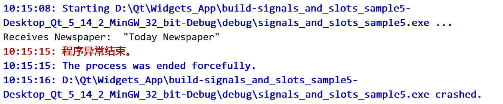

- 输出"Receives Newspaper: Today Newspaper"后程序不会停止，需要 `□` 手动停止

##### 使用[Lambda](D:\note_md\cpp\cpp_md\现代C++.md)表达式作为槽函数

在[2.3](#2.3-自定义信号和槽完整实例)中该用[Lambda](D:\note_md\cpp\cpp_md\现代C++.md)表达式作为槽函数来达到同样的功能，只需修改 `QObject::connect` 这一行。

~~~c++
QObject::connect(&pap,&newspaper::newPaper,&Tom,
    [](const QString& name){
    	qDebug() << "Receives Newspaper: " << name << endl;
    }
);
~~~

#### 2.4 总结注意事项

- ==发送者和接收者都需要是 QObject 的子类（当然，槽函数是全局函数、 Lambda表达式等无需接收者的时候除外）==；  
- ==使用 signals 修饰信号函数，信号是一个函数声明，返回 void，不需要实现函数代码==；  
- ==槽函数是普通的成员函数，作为成员函数，会受到 public、 private、protected 的影响==；  
- ==使用 emit 在恰当的位置发送信号==；  
- ==使用 QObject::connect()函数连接信号和槽== 
- ==任何成员函数、 static 函数、全局函数和 Lambda 表达式都可以作为槽函数==

#### 2.5 信号和槽的更多用法

- 一个信号可以和多个槽相连  

​		如果是这种情况，这些槽会一个接一个的被调用，但是它们的==调用顺序是不确定的==。  

- 多个信号可以连接到一个槽

  只要任意一个信号发出，这个槽就会被调用。

- ==一个信号可以连接到另外的一个信号== 

​	   当第一个信号发出时，第二个信号被发出。除此之外，这种信号-信号的形式和信号-槽的形式没有什么区别

-  槽可以被取消链接  

  这种情况并不经常出现，因为当一个对象 delete 之后， ==Qt 自动取消所有连接到这个对象上面的槽==

## 八、窗口的布局

> **Qt窗口布局的目的**
>
> - 排列有序
> - 主窗口发生大小改变，控件的布局和大小应该一起变化
> - 如果不对控件进行布局，窗口显示出来后有些控件看不到
>
> **布局限制**
>
> - 布局没有限制，非常灵活
> - 各种布局可以无限嵌套，这样可以制成非常复杂的窗口
> - 操作思路：设置布局，在布局中添加窗口，子窗口中再次设置布局，...

### 1. 在UI窗口中设置布局

#### 1.1 方式1

> 第一种方式是使用Qt提供的布局, 从工具箱中找到相关的布局, 然后将其拖拽到UI窗口中

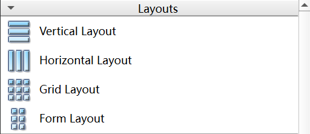

- Vertical Layout 垂直布局
- Horizontal Layout 水平布局
- Grid Layout 网格布局
- Form Layout 表格布局

> 将相应的控件放入到布局对应的红色框内部, 这些控件就按照布局的样式自动排列到一起了

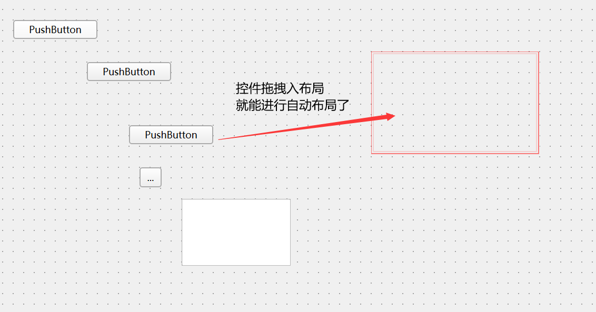

> 还可以选中当前布局，在右键菜单中修改布局

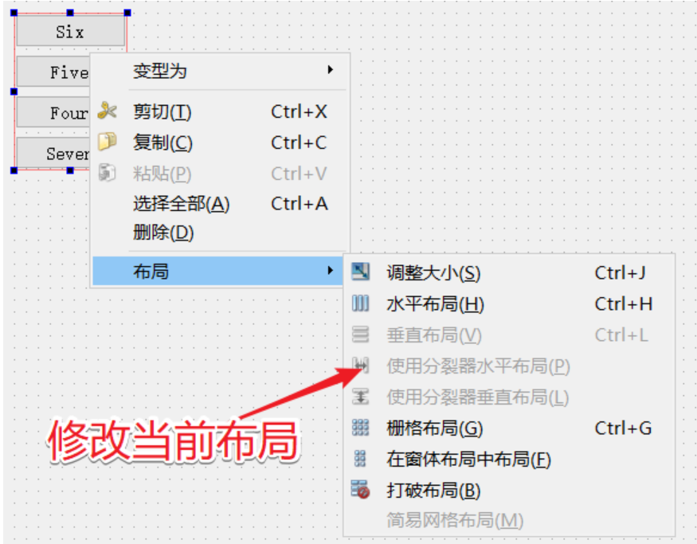

#### 1.2 方式2

> 将空间放入 `QWiget` 内嵌窗口中，对控件进行布局

1. 

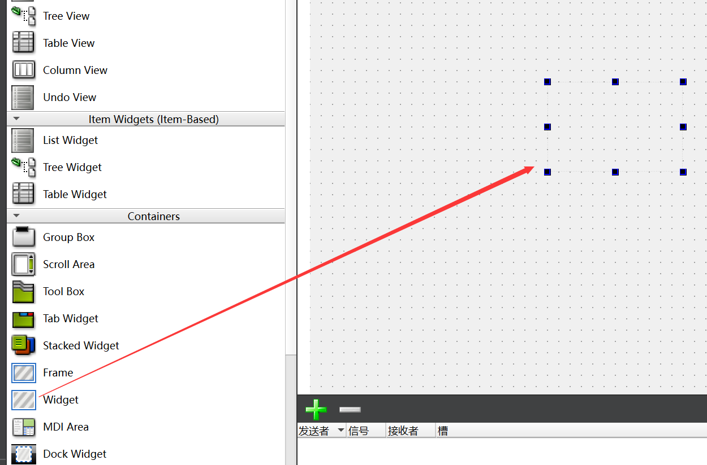

2. 

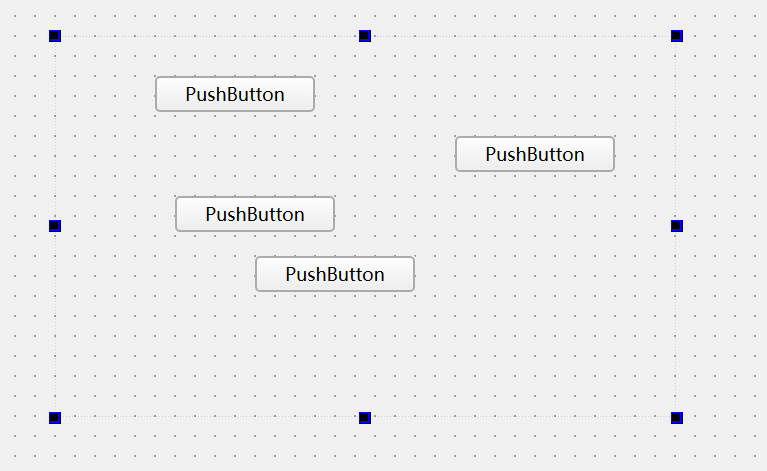

3. 

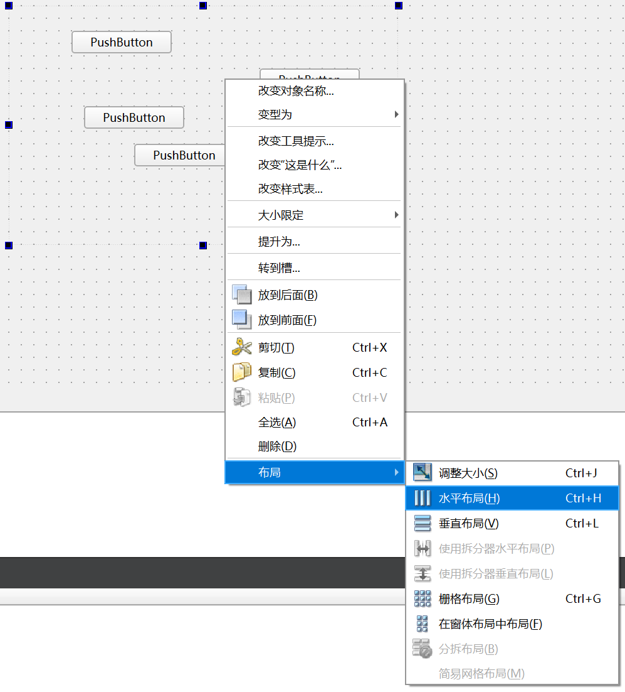

或是：

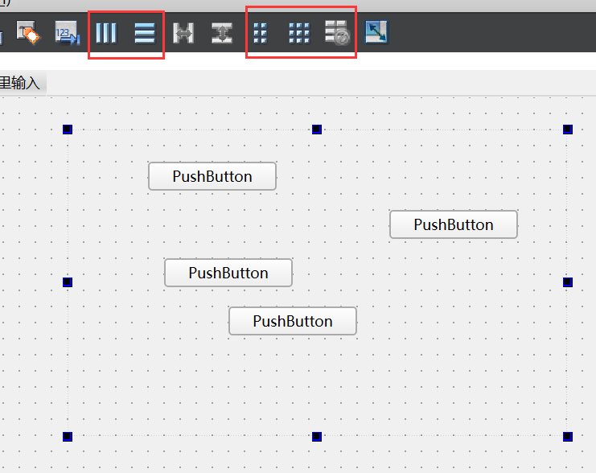

- :no_entry_sign:**注意**：父窗口没有布局，那么可能这个窗口里面的子布局可能无法显示

### 2. 弹簧控件

> 可设置控件保持居中

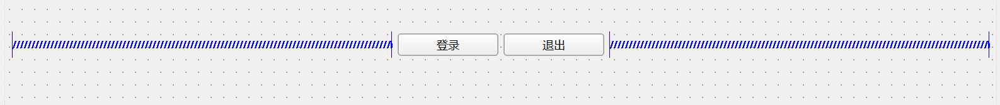

**弹簧属性**

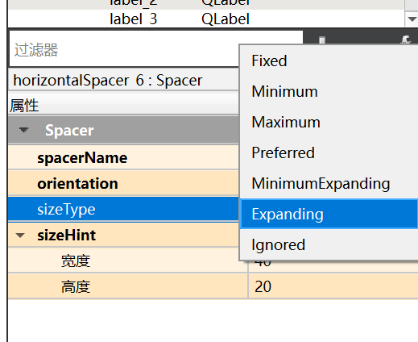

- `Expanding` 默认，膨胀的
- `Fixed` 固定长度的

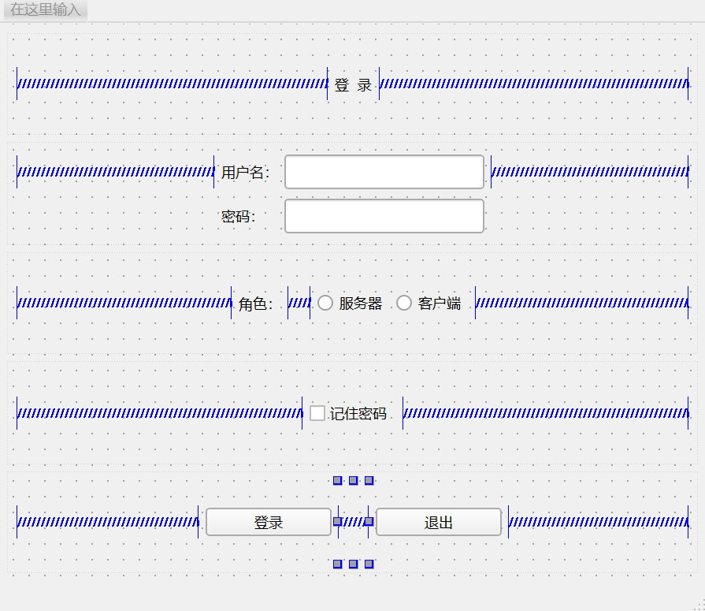

### 3. 窗口布局的边距和间隙

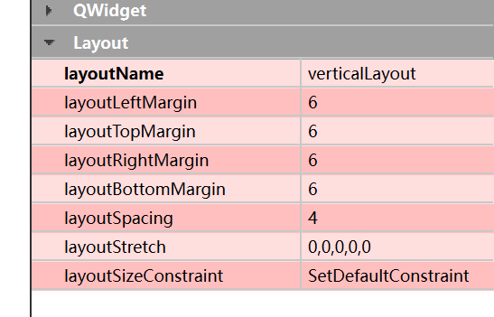

- `layoutLeftMargin` 左边距
- `layoutTopMargin` 上边距
- `layoutRightMargin` 右边距
- `layoutBottomMargin` 下边距
- `layoutSpacing` 控件间的间隙

## 九、Qt 多线程-线程池的使用

> 处理复杂逻辑、避免窗口卡顿。需要使用多线程，其中一个线程处理窗口事件，其他线程进行逻辑运算，多个线程各司其职，提高用户体验和程序执行效率

在Qt中使用多线程，注意事项：

- 默认的线程在Qt中称为**窗口线程**，也叫**主线程**，负责窗口事件处理或者窗口控件数据的更新
- **子线程**负责后台的业务逻辑处理，**子线程**中不能对窗口对象做任何操作，这些事情需要交给窗口线程处理
- **主线程**和**子线程**之间如果需要进行数据的传递，需要使用Qt中的信号和槽机制

### 1. QThread

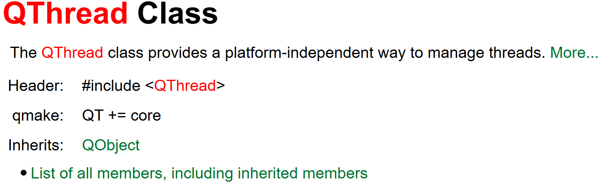

#### 1.1 QThread 常用公共成员函数

~~~C++
// QThread 类常用 API
// 构造函数
QThread::QThread(QOBject *parent = nullptr)
// 判断线程中的任务是否执行完毕 - 是返回true，否返回false
bool QThread::isFinished() const;// 常函数，只能修改mutable的成员变量
// 判断子线程是否在执行任务 - 是返回true，否返回false
bool QThread::isRunning() const;
~~~

##### （1）Qt线程优先级

- Qt中的线程可以设置优先级
- 查看线程的优先级

~~~c++
// 得到当前线程的优先级
Priority QThread::priority() const;
~~~

- 设置线程的优先级

~~~c++
// 设置线程优先级
void QThread::setPriority(Priority priority);
~~~

- 线程优先级：`Priority` 是枚举类型

~~~c++
QThread::IdlePriority			--> 最低优先级
QThread::LowestPriority
QThread::LowPriority
QThread::NormalPriority
QThread::HightPriority
QThread::HightestPriority
QThread::TimeCriticalPriority
QThread::InheritPriority		--> 最高优先级，默认为最高优先级
~~~

##### （2）退出线程

~~~C++
// 退出线程，停止底层的事件循环
// 退出线程函数
void QThread::exit(int returnCode = 0)
~~~

调用exit函数后，可能线程只进行到一半，一般要在 `exit()` 函数后面调用 `wait()` 函数等待线程任务完毕后，再退出线程

~~~C++
bool QThread::wait(unsigned long time = ULONG_MAX);
~~~

#### 1.2 信号槽函数

 ##### (1)QThread 信号函数

**任务完成信号函数：**

~~~c++
// 线程中执行任务完毕了，发出该信号
signals: void QThread::finished();
~~~

**任务开始信号函数：**

~~~c++
// 开始工作之前发出这个信号
signals: void QThread::started();
~~~

##### (2)QThread 槽函数

**退出线程：**

~~~C++
// 和exit()效果一样，搭配wait()函数使用
slots: void QThread::quit();
~~~

**立即终止线程：**（不管有没有完成）

~~~C++
slots: void QThread::terminate();
~~~

**启用（子）线程**：

~~~C++
slots: void QThread::start(Priority priority = InheritPriority);// 默认以最高优先级启动线程
~~~

#### 1.3 静态函数

 ~~~c++
 // 返回一个指向管理当前执行线程的QThread类型的指针
 static: QThread* QThread::currentThread();
 // 返回可以在系统上运行的理想线程数 == 当前电脑CPU的核心数
 static: int QThread::idealThreadCount();
 // 线程休眠函数
 static: void QThread::msleep(unsigned long msecs);	//单位：毫秒
 static: void QThread::sleep(unsigned long secs);	//单位：秒
 static: void QThread::usleep(unsigned long usecs);	//单位：微秒
 ~~~

#### 1.4 任务处理函数

- `run()` 是QThread中定义的虚函数，如果要让创建的**子线程**执行某个任务，需要写一个子类继承QThread，在子类中重写`run()`函数。==这就是利用C++的多态实现根据不同的线程对象来执行不同的任务处理函数==
- `run()`还是一个受包含的成员函数，不能再类的外部被调用。因此不能通过 `run()` 方法来让线程执行任务，而是需要通过调用**槽函数** `start()` 启动**子线程**，当**子线程**被启动，`run()` 函数也就被内部调用了。

~~~c++
// 子线程要处理什么任务，需要写到run()中
protected: virtual void QThread::run(); 
~~~

### 2. 使用方式

#### 2.1 操作步骤

1. 创建一个线程类的子类，让其继承Qt中的线程类QThread，如：

~~~c++
class MyThread:public QThread
{
	...
}
~~~

2. 重写父类 `run()` 方法，在该函数内部编写子线程要处理的具体的业务逻辑

~~~c++
class MyThread:public QThread
{
	...
protected:
    void run()
    {
        ...
    }
}
~~~

3. 在主线程中创建子线程对象，使用new关键字

~~~c++
MyThread* subThread = new MyThread;
~~~

4. 启动子线程，调用 `start()` 方法

~~~c++
subThread->start();
~~~

- :no_entry_sign:不能在类外使用 `run()` 方法启动子线程，在外边调用 `start()` 相当于上 `run()` 开始运行

子线程被创造出来后，父子线程之间的通信可以通过信号和槽的方式，注意事项：

- :no_entry_sign: 在Qt中在子线程中不要操作程序中的窗口类型对象，不允许.
- 只有**主线程**才能操作程序中的窗口对象，默认的线程就是主线程，自己创造的线程就是子线程

## 英文单词

> slot [slɒt]T
>
> > [N-COUNT]A slot is a narrow opening in a machine or container, for example, a hole that you put coins in to make a machine work.
> >
> > [N-COUNT]A slot in a schedule or programme is a place in it where an activity can take place.时段
> >
> > [V-T/V-I]If you slot something into something else, or if it slots into it, you put it into a space where it fits.
> >
> > >  He was slotting a CD into a CD player.
>
> emit [iˈmɪt]
>
> > [V-T] If something emits heat, light, gas, or a smell, it produces it and sends it out by means of a physical or chemical process.
> >
> > [V-T]To emit a sound or noise means to produce it
>
> Thread [θred]
>
> > `线程`
>
> API
>
> > application programmers interface 应用程序接口
>
> interface
>
> > [N-COUNT] The interface between two subjects or systems is the area in which they affect each other or have links witch each other. 交叉区域
> >
> > [N-COUNT] The user interface of a particular piece of  computer software is its presentation on the screen and how easy it is to operate. 界面[计算机]
> >
> > ...the development of better user interfaces.	...更好的用户界面的开发
> >
> > [V-RECIP] If one thing interfaces with another, or if two things interface, they have connections with each other. If you interface one thing with another, you connect the two things. 相互联系；连接[正式]
> >
> > ...the way we interface witch the environment.	...我们与环境相互联系的方式。
> >
> > He had interfaced all this machinery with a master computer
> >
> > 他已将这整台机器与一台主控计算机连接起来。
>
> priority [praɪˈɔːrəti]
>
> > [N-COUNT] If something is a priority, it is the most important thing you have to do or deal with, or must be done or dealt with before evetything else you have to do. 优先处理的事。
> >
> > [PHRASE] If you **give priority to** something or someone, you treat them as more important than anything or anyone else. 优先考虑
> >
> > [PHRASE] If something **takes priority** or **has priority** **over** other things, it is regarded as being more important than them and is dealt with first. 有优先性
> >
> > high priority N. 高优先级
> >
> > low priority N. 低优先级
>
> terminate [ˈtɜːrmɪneɪt]
>
> > [V-ERG] When you terminate something or when it terminates, it ends completely.
> >
> > His contract terminates at the end of the season. 他的合同在本赛季末终止
>
> time zone [ˈtaɪm zəʊn]
>
> > [N] 时区
>
> daylight saving time
>
> > [N-UNCOUNT] **Daylight saving time** is a period of time in the summer when the clocks are set one hour forward, so that people can have extra light in the evening. 夏令时间
>
> explicitly [ɪkˈsplɪsɪtli]
>
> > adv. 清晰明确地；直截了当地，坦率地
>
> rectangle
>
> > [N-COUNT] A rectangle is a four-sided shape whose corners are all ninety degree angles. Each side of a rectangle is the same as the one opposite to it.


## 杂项

- [QT中的数据类型](https://blog.csdn.net/qq_54395977/article/details/122574844)
- [每个程序员必须掌握的常用英语词汇](https://zhuanlan.zhihu.com/p/41638344)

## 参考资料

- [Qt 教程 | 爱编程的大丙 (subingwen.cn)](https://subingwen.cn/qt/)
