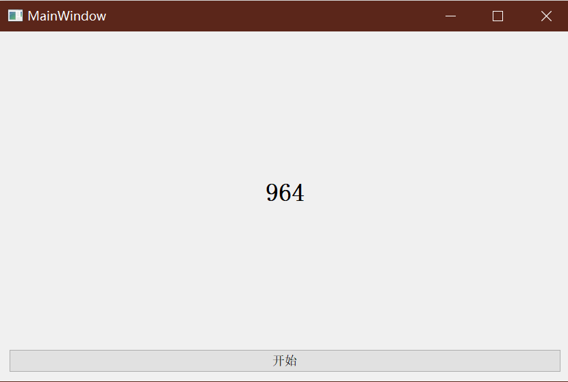

<<<<<<< HEAD
# Qt 多线程-线程池的使用

- [怎样强制停止一个QT线程-CSDN社区](https://bbs.csdn.net/topics/350041479)
- [(1条消息) QT的延时函数_雪山飞狐W的博客-CSDN博客_qt延时函数](https://blog.csdn.net/qq_41429220/article/details/96627952)

- [57.Qt-qRegisterMetaType - 诺谦 - 博客园 (cnblogs.com)](https://www.cnblogs.com/lifexy/p/14049698.html)
- [(1条消息) QT的延时函数_雪山飞狐W的博客-CSDN博客_qt延时函数](https://blog.csdn.net/qq_41429220/article/details/96627952)

> 处理复杂逻辑、避免窗口卡顿。需要使用多线程，其中一个线程处理窗口事件，其他线程进行逻辑运算，多个线程各司其职，提高用户体验和程序执行效率

在Qt中使用多线程，注意事项：

- 默认的线程在Qt中称为**窗口线程**，也叫**主线程**，负责窗口事件处理或者窗口控件数据的更新
- **子线程**负责后台的业务逻辑处理，:no_entry:==**子线程**中不能对窗口对象做任何操作==，这些事情需要交给窗口线程处理
- **主线程**和**子线程**之间如果需要进行数据的传递，需要使用Qt中的信号和槽机制

## 一. 线程类 QThread

### 1. 线程类 ` QThread` 介绍

#### 1.1 QThread 常用公共成员函数

~~~C++
// QThread 类常用 API
// 构造函数
QThread::QThread(QOBject *parent = nullptr)
// 判断线程中的任务是否执行完毕 - 是返回true，否返回false
bool QThread::isFinished() const;// 常函数，只能修改mutable的成员变量
// 判断子线程是否在执行任务 - 是返回true，否返回false
bool QThread::isRunning() const;
~~~

**Qt线程优先级**

- Qt中的线程可以设置优先级
- 查看线程的优先级

~~~c++
// 得到当前线程的优先级
Priority QThread::priority() const;
~~~

- 设置线程的优先级

~~~c++
// 设置线程优先级
void QThread::setPriority(Priority priority);
~~~

- 线程优先级：`Priority` 是枚举类型

~~~c++
QThread::IdlePriority			--> 最低优先级
QThread::LowestPriority
QThread::LowPriority
QThread::NormalPriority
QThread::HightPriority
QThread::HightestPriority
QThread::TimeCriticalPriority
QThread::InheritPriority		--> 最高优先级，默认为最高优先级
~~~

**退出线程**

~~~C++
// 退出线程，停止底层的事件循环
// 退出线程函数
void QThread::exit(int returnCode = 0)
~~~

调用exit函数后，可能线程只进行到一半，一般要在 `exit()` 函数后面调用 `wait()` 函数等待线程任务完毕后，再退出线程

~~~C++
bool QThread::wait(unsigned long time = ULONG_MAX);
~~~

#### 1.2 信号槽函数

 ##### (1)QThread 信号函数

**任务完成信号函数：**

~~~c++
// 线程中执行任务完毕了，发出该信号
signals: void QThread::finished();
~~~

**任务开始信号函数：**

~~~c++
// 开始工作之前发出这个信号
signals: void QThread::started();
~~~

##### (2)QThread 槽函数

**退出线程：**

~~~C++
// 和exit()效果一样，搭配wait()函数使用
slots: void QThread::quit();
~~~

**立即终止线程：**（不管有没有完成）

~~~C++
slots: void QThread::terminate();
~~~

**启用（子）线程**：

~~~C++
slots: void QThread::start(Priority priority = InheritPriority);// 默认以最高优先级启动线程
~~~

#### 1.3 静态函数

 ~~~c++
 // 返回一个指向管理当前执行线程的 QThread 类型的指针
 static: QThread* QThread::currentThread();
 // 返回可以在系统上运行的理想线程数 == 当前电脑CPU的核心数
 static: int QThread::idealThreadCount();
 // 线程休眠函数
 static: void QThread::msleep(unsigned long msecs);	//单位：毫秒
 static: void QThread::sleep(unsigned long secs);	//单位：秒
 static: void QThread::usleep(unsigned long usecs);	//单位：微秒
 ~~~

#### 1.4 任务处理函数

- `run()` 是QThread中定义的虚函数，如果要让创建的**子线程**执行某个任务，需要写一个子类继承 QThread，在子类中重写`run()`函数。==这就是利用**C++的多态**实现根据不同的线程对象来执行不同的任务处理函数==
- `run()`还是一个**受保护(`protected`)**的成员函数，不能在类的外部被调用。因此不能通过 `run()` 方法来让线程执行任务，而是需要通过调用**槽函数** `start()` 启动**子线程**，当**子线程**被启动，`run()` 函数也就被内部调用了。

~~~c++
// 子线程要处理什么任务，需要写到run()中
protected: virtual void QThread::run(); 
~~~

### 2. 线程类 `QThread` 的使用方法

#### 2. 1 使用方式 1

##### 2.1.1 操作步骤

1. 创建一个线程类的子类，让其继承Qt中的线程类QThread，如：

~~~c++
class MyThread:public QThread
{
	...
}
~~~

2. 重写父类 `run()` 方法，在该函数内部编写子线程要处理的具体的业务逻辑

~~~c++
class MyThread:public QThread
{
	...
protected:
    void run()
    {
        ...
    }
}
~~~

3. 在主线程中创建子线程对象，使用new关键字

~~~c++
MyThread* subThread = new MyThread;
~~~

4. 启动子线程，调用 `start()` 方法

~~~c++
subThread->start();
~~~

**注意事项：**

- :no_entry_sign:不能在类外使用 `run()` 方法启动子线程，在外边调用 `start()` 相当于 `run()` 开始运行

子线程被创造出来后，父子线程之间的通信可以通过信号和槽的方式；

- :no_entry_sign: 在Qt中在子线程中不要操作程序中的窗口类型对象，不允许.
- :no_entry_sign:只有**主线程**才能操作程序中的窗口对象，默认的线程就是主线程，自己创造的线程就是子线程

##### 2.1.2 示例代码

**数数例子：**点击按钮窗口开始数数，当一般只有一个线程（主线程时），数字不会实时更新，并且拖动窗口就会出现无响应的情况。

**思路：**使用一个子线程计数，子线程将数字发送给主线程，主线程操控窗口显示数据。

`threadCount.h`

~~~c++
#include <QThread>
/// 创建子线程类让其继承 QThread 类
class threadCount:public QThread
{
    Q_OBJECT// 要使用Qt信号和槽必须包括该宏
public:
    explicit threadCount(QObject* parent = nullptr);
protected:
    void run(void);
signals:
    /// 

    /// 发送数字信号的信号函数，用于线程之间的数据通信
    /// 

    void sendNumber(int num);
public slots:
};
~~~

`threadCount.cpp`

~~~c++
#include "threadcount.h"
#include <QDebug>
#include <limits.h> // 有 int 类型最大值的宏常量

threadCount::threadCount(QObject* parent):QThread(parent)
{
    
}

threadCount::run(void)
{
    qDebug() << "Subthread address: " << QThread::currentThread();
    for(int i = 0;i < INT_MAX;i++)
    {
        emit sendNumber(i);// 发出信号函数
        QThread::usleep(1);// 子线程休眠 1us
    }
    qDebug() << "The function run() ends, the subthread exits...";
}
~~~

`mainwindow.cpp`

~~~c++
#include "mainwindow.h"
#include "ui_mainwindow.h"
#include "threadCount.h"
#include <QDebug>

MainWindow::MainWindow(QWidget* parent)
    : QMainWindow(parent)
    , ui(new Ui::MainWindow)
{
    ui->setupUi(this);
    qDebug() << "Ideal number of threads: " << QThread::idealThreadCount();
    /// 输出当前线程地址
    qDebug() << "Main thread object address: " << QThread::currentThread();

    // 创建子线程
    threadCount* count = new threadCount;

    // 子线程发信给主线程
    connect(count,&threadCount::sendNumber,this,[=](int num){
        // 主线程控制控件 label 显示子线程信号函数返送的数据 num
        ui->label->setText(QString::number(num));
    });

    // 按下按钮启动子线程
    connect(ui->pushButton,&QPushButton::clicked,this,[=]{
        // 启动子线程
        count->start();
    });
}

MainWindow::~MainWindow()
{
    delete ui;
}
~~~

> 使用方式 1 的弊端是，当如果要在一个子线程中处理多个任务，所有的处理逻辑都需要写到 `run()` 函数中，这样该函数中的处理逻辑就会变得非常混乱，不太容易维护。

#### 2.2 使用方式 2

> Qt 官方推荐此方式

方式 2 ，将业务流程放在一个继承自 `QObject` 的类中，使用`QObject` 类提供的 `moveToThread()` 方法将任务对像移动到创建好的 `QThread` 子线程对象中。

##### 2.2.1 操作步骤

1. 创建一个任务类，`QObject` 派生类，类中添加一个公共成员函数，函数体就是我们要在子线程中执行的业务逻辑

~~~c++
class MyWork:QObject
{
public:
    ...
    // 函数名字可自定，参数可根据实际需求添加
    void working();
}
~~~

2. 在主线程中创建 `QThread` 对象，作为子线程对象

~~~c++
QThread* subThread = new subThread;
~~~

3. 在主线程中创建任务类对象，:no_entry:不要指定它的父对象

~~~c++
MyWork* work = new Mywork;
~~~

4. 使用`QObject` 类提供的 `moveToThread()` 方法将任务对象移动到创建好的子线程对象中。

~~~
work->moveToThread(subThread);
~~~

5. 调用 `start()` 方法启动子线程，但是移动到子线程中的对象并没有工作
6. 调用 `MyWork` 类对象的工作函数，让这个函数开始执行，这个时候就是在移动到的那个子线程中运行的。

##### 2.2.2 示例代码

`myWork.h`

~~~c++
#include <QObject>

class myWork : public QObject
{
    Q_OBJECT
public:
    explicit myWork(QObject *parent = nullptr);
    void working(void);

signals:
    /// 信号函数用来给主线程发信
    void sendNum(int num);
};
~~~

`myWork.cpp`

~~~c++
#include "mywork.h"
#include <limits.h>
#include <QThread>

myWork::myWork(QObject *parent)
    : QObject{parent}
{

}

void myWork::working(void)
{
    for(int i = 0;i < INT_MAX;i++)
    {
        emit sendNum(i);
        QThread::usleep(1);
    }
}
~~~

`mainwindow.cpp`

~~~c++
#include "mainwindow.h"
#include "ui_mainwindow.h"
#include "mywork.h"

MainWindow::MainWindow(QWidget *parent)
    : QMainWindow(parent)
    , ui(new Ui::MainWindow)
{
    ui->setupUi(this);
    myWork* work = new myWork;
    QThread* subThread = new QThread;

    work->moveToThread(subThread);// 将任务对象移动到创建好的子线程对象中
    subThread->start();//尽管子线程启动了，但是移动到子线程中的对象并没有工作

    // 任务函数通过信号函数发信给主线程
    connect(work,&myWork::sendNum,this,[=](int num){
        ui->label->setText(QString::number(num));
    });

    // 按下按钮在子线程中执行任务函数
    connect(ui->pushButton,&QPushButton::clicked,work,&myWork::working);
        
}
~~~

**注意：**

- 任务函数好像必须通过 **信号和槽** 方式进行调用，否则会程序运行会出错（虽然编译不会报错），如以下错误写法：

~~~c++
connect(ui->pushButton,&QPushButton::clicked,this,[=]{
	work->working();
});
~~~

> 执行 work->moveToThread (sub) 之后相当于把 work 的成员函数复制一份给子线程，如果想要在子线程中运行 work 的成员函数，必须要通过 connect 函数用信号和槽来调用；如果是直接用对象来调用（如：work->working （））则调用的是主线程的成员函数，不是子线程的；
>

- 没有指定 `work` 父对象，所以需要自己析构

## 二、信号与槽实现跨线程数据通信

### 1. 一般简单数据类型

​		例如上一节中的示例代码，在子线程中进行循环 +1 的计数操作，同时子线程将计数数据传给主线程，主线程获取子线程的数据，操作 `QLabel` 对象显示该数据。这就实现了 `int` 数据类型的跨线程通信。

**示例代码** —— `int*` 类型跨线程通信

> 按下按钮，子线程为 `int` 类型分配内存，将地址赋值给 `int*` 对象，通过信号和槽，将该指针给主线程，主线程通过该指针解引用来显示数据。

`mythread.h`

~~~c++
#include <QThread>

class myThread:public QThread
{
    Q_OBJECT
public:
    explicit myThread(QObject *parent = nullptr);
protected:
    void run(void);
signals:
    /// 

    /// 用于数据传输的信号函数
    /// 

    void sendNumber(int* num);
public slots:
};
~~~

`mythread.cpp`

~~~c++
#include "mythread.h"
#include <QDebug>

threadCount::threadCount(QObject* parent):QThread(parent){}

void threadCount::run()
{
    qDebug() << "Child thread address: " << QThread::currentThread();
    int* num = new int(12);
    qDebug() << "The address to which the child thread created the pointer: " << num;
    emit sendNumber(num);
    qDebug() << "The function run() ends, the child thread exits...";
}
~~~

`mainwindow.cpp`

~~~c++
#include "mainwindow.h"
#include "ui_mainwindow.h"
#include "mythread.h"
#include <QDebug>

MainWindow::MainWindow(QWidget *parent)
    : QMainWindow(parent)
    , ui(new Ui::MainWindow)
{
    ui->setupUi(this);
    // 创建子线程
    myThread* subThread = new myThread;

    // 子线程发信给主线程
    connect(subThread,&myThread::sendNumber,this,[=](int* num){
        qDebug() << "The address pointed to by the pointer passed to the main thread:" << num;
        ui->label->setText(QString::number(*num));
    });

    // 按下按钮启动子线程
    connect(ui->pushButton,&QPushButton::clicked,this,[=]{
        // 启动子线程
        subThread->start();
    });
}

MainWindow::~MainWindow()
{
    delete ui;
}

~~~

**输出：**

可见，`run()` 函数中创建的 `int*` 类型的值和主线程接收到的 `int*` 类型的值相同，**都指向同一块分配好的堆内存。**

### 2. 复杂数据类型

>在定义信号槽的时候，传递的参数类型如果是自定义类型，
>
>并且涉及跨线程时,最好先通过 `qRegisterMetaType()` 将自定义类型进行注册，否则会报错：
>
>QObject::connect: Cannot queue arguments of type 'XXXXXXX' 
>(Make sure 'ERROR_LEVEL' is registered using qRegisterMetaType().)
>
>**注意：**
>
>- 自定义类型需要**提供正确的构造函数(包括拷贝构造函数)和析构函数。**

**自定义类型的跨线程数据传输示例：**

`myClass.h`

~~~c++
#pragma once
#include <QMetaType>// 要注册某数据类型，先要包括该头文件
class myClass 
{
public:
	double m_var;
	int* p_var = NULL;
	myClass(void) {
		m_var = 21;
		p_var = new int(0);
		/// 

		/// 可在类的构造函数中，
		/// 使用qRegisterMetaType()注册该自定义类型
		/// 

		qRegisterMetaType<myClass>("myClass");
	}
	/// 

	/// 自定义类必须提供正确的构造函数和析构函数
	/// 才能正常通过信号与槽通信
	/// 拷贝构造 - 深拷贝
	/// 

	myClass(const myClass& theClass) {
		if (p_var != NULL)
		{
			delete p_var;
		}
		m_var = theClass.m_var;
		p_var = new int(*theClass.p_var);
	}
	void operator=(const myClass& theClass) {
		if (p_var != NULL)
		{
			delete p_var;
		}
		m_var = theClass.m_var;
		p_var = new int(*theClass.p_var);
	}
	~myClass() {
		if (p_var != NULL)
		{
			delete p_var;
			p_var = NULL;
		}
	}
};
~~~

`myThread.h`

~~~c++
#pragma once
#include <QThread>
#include "myClass.h"
class myThread :
    public QThread
{
    Q_OBJECT
public:
    explicit myThread(QObject* parent = nullptr) :QThread(parent) {

    }
protected:
    void run(void);
signals:
    void sendMessage(const myClass&);
};
~~~

`myThread.cpp`

~~~c++
#include "myThread.h"
#include <QDebug>

void myThread::run(void)
{
	myClass a;
	*a.p_var = 12;
	qDebug() << "int* p_var address: " << a.p_var;
	qDebug() << "double m_var address: " << (int)(&a.m_var);
	emit sendMessage(a);
}
~~~

`mainwindow.cpp`

~~~c++
#include "mainwindow.h"
#include "myThread.h"
#include <QLabel>
#include <QDebug>

MainWindow::MainWindow(QWidget *parent)
    : QMainWindow(parent)
{
    ui.setupUi(this);
    myThread* subThread = new myThread;
    subThread->start();
    connect(subThread, &myThread::sendMessage, this, [=](const myClass& th){
        qDebug() << "int* p_var address: " << th.p_var;
        qDebug() << "double m_var address: " << (int)(&th.m_var);
        ui.label1->setText(QString::number(*th.p_var));
        ui.label2->setText(QString::number(th.m_var));
        });
}
~~~

**输出：**

## 三、线程池的使用

> 对于大并发程序，每个线程大都执行一个时间很短的任务就结束了，这样频繁创建或销毁线程会大大降低系统效率。
>
> 使用线程池，使得线程可以复用，执行完一个任务后并不会被销毁，而是可以执行其他任务。

### 1. 线程池概述

线程池的组成主要分为 3 个部分，这三部分配合工作就可以得到一个完整的线程池：

1. 「任务队列」存储需要处理的任务，由工作的线程来处理这些任务
   - 通过线程池提供的 **API 函数，将一个待处理的任务添加到任务队列，或者从任务队列中删除**
   - 已处理的任务会被从任务队列中删除
   - 线程池的使用者，也就是调用线程池函数往任务队列中添加任务的线程就是**生产者线程**
2. 「工作的线程」（任务队列任务的消费者） ，N 个
   - 线程池中维护了一定数量的工作线程，他们的作用是是不停的读任务队列，从里边取出任务并处理
   - 工作的线程相当于任务队列的消费者角色
   - 如果任务队列为空，工作的线程将会被阻塞 (使用条件变量 / 信号量阻塞)
   - 如果阻塞之后有了新的任务，由生产者将阻塞解除，工作线程开始工作
3. 「管理者线程」（不处理任务队列中的任务），1 个
   - 它的任务是周期性的对任务队列中的任务数量以及处于忙状态的工作线程个数进行检测
     - 当任务过多的时候，可以适当的创建一些新的工作线程
     - 当任务过少的时候，可以适当的销毁一些工作的线程

### 2. QRunnable

​		Qt 中使用线程池需要先创建**任务**，添加到线程池中的每一个任务都是一个 `QRunnable` 类型。

​		通过创建子类继承 `QRunnable` 类型来创建**任务类**，重写父类中的 `run()` 方法，在这个函数中编写要在线程池中执行的任务。

​		新建该任务对象后，将其传递给线程池，任务就被添加到线程池中的任务队列中去了。

~~~c++
// 在子类中必须要重写的函数, 里边是任务的处理流程
[pure virtual] void QRunnable::run();

// 参数设置为 true: 这个任务对象在线程池中的线程中处理完毕, 这个任务对象就会自动销毁
// 参数设置为 false: 这个任务对象在线程池中的线程中处理完毕, 对象需要程序猿手动销毁
// 
void QRunnable::setAutoDelete(bool autoDelete);
// 获取当前任务对象的析构方式,返回true->自动析构, 返回false->手动析构
bool QRunnable::autoDelete() const;
~~~

**创建一个要添加到线程池中的任务类**

~~~c++
// 需要在这个任务中使用 Qt 的信号槽机制必须继承 QObject 类并包括 Q_OBJECT 宏
// 不使用 Qt 的信号槽机制,就不必继承 QObject 类和包括 Q_OBJECT 宏
class Mywork : public QObject, public QRunnable
{
    Q_OBJECT
public:
    explicit MyWork(QObject *parent = nullptr)
    {
        // 任务执行完毕,该对象自动销毁
        setAutoDelete(true);
    }
    ~MyWork();

    void run() override{}
}
~~~

- [C++中的 "override" - 简书 (jianshu.com)](https://www.jianshu.com/p/25283b30fff2)
- [C++ explicit 关键字 - 知乎 (zhihu.com)](https://zhuanlan.zhihu.com/p/52152355)

### 3. QThreadPool

- Qt 中的 QThreadPool 类管理了一组 QThreads，里边还维护了一个任务队列。
- QThreadPool 管理和回收各个 QThread 对象，以帮助减少使用线程的程序中的线程创建成本。
- **每个应用程序都有一个全局 QThreadPool 对象，可以通过调用 `globalInstance()` 来访问它**，也可以单独创建一个 QThreadPool 对象来使用。
- `QThreadPool` 的常用 API 

~~~c++
// 获取和设置线程中的最大线程个数
int maxThreadCount() const;
void setMaxThreadCount(int maxThreadCount);

// 给线程池添加任务, 任务是一个 QRunnable 类型的对象
// 如果线程池中没有空闲的线程了, 任务会放到任务队列中, 等待线程处理
void QThreadPool::start(QRunnable * runnable, int priority = 0);
// 尝试保留一个线程来运行输入的任务函数，
// 如果线程池中没有空闲的线程了，函数不执行任何操作并返回 false。
// 否则立即使用一个可用线程来运行该任务函数并返回 true
bool QThreadPool::tryStart(QRunnable * runnable);

// 线程池中被激活的线程的个数(正在工作的线程个数)
int QThreadPool::activeThreadCount() const;

// 尝试性的将某一个任务从线程池的任务队列中删除, 如果任务已经开始执行就无法删除了
bool QThreadPool::tryTake(QRunnable *runnable);
// 将线程池中的任务队列里边没有开始处理的所有任务删除, 如果已经开始处理了就无法通过该函数删除了
void QThreadPool::clear();

// 在每个Qt应用程序中都有一个全局的线程池对象, 通过这个函数直接访问这个对象
static QThreadPool * QThreadPool::globalInstance();
~~~

- 基本使用方法

`mywork.h`

~~~c++
class MyWork :public QRunnable
{
public:
    explicit MyWork();
    ~MyWork();
	
    /// 重写父类的 run() 函数
    void run() override;
}

~~~

`mywork.cpp`

~~~c++
MyWork::MyWork() : QRunnable()
{
    // 任务执行完毕,该对象自动销毁
    setAutoDelete(true);
}
void MyWork::run()
{
    // 业务处理代码
    ......
}
~~~

`mainwindow.cpp`

~~~c++
MainWindow::MainWindow(QWidget *parent) :
    QMainWindow(parent),
    ui(new Ui::MainWindow)
{
    ui->setupUi(this);

    // 线程池初始化，设置最大线程池数
    QThreadPool::globalInstance()->setMaxThreadCount(4);
    // 添加任务
    MyWork* task = new MyWork;
    QThreadPool::globalInstance()->start(task);    
}

~~~

## 四、Qt 多线程数据共享

> - 多线程共享全局数据时，为了避免多线程导致的共享数据错乱问题。需要使用锁，锁实现了对临界资源的互斥访问。
>
> - 锁的种类有互斥锁、自旋锁、读写锁、递归锁等。
> - Qt 提供了最基本的互斥体类 `QMutex` 来保证任何时刻，只有一个线程能够访问「临界资源」
> - Qt 提供的其他互斥体类有 `QRecursiveMutex`、`QMutexLocker`，还提供了读写锁类`QReadWriteLock` 等

### 1. 概念引入

**『临界资源』：**一次仅允许一个进程所使用的资源叫做**『临界资源』（ critical resource）**，比如打印机就是一个临界资源，只有当进程获取到打印机之后才能执行打印操作。

​		在多线程代码中，为了保证程序有正确的结果，**需要保证多线程的共享变量是临界资源**。

**『临界区』：**指的是一个访问共享资源的程序片段，当有线程进入『临界区』时，其他线程必须等待，这样就可以保证数据的安全。

### 2. 几种互斥锁概览

- 最基本的互斥锁类 `QMutex` ，通过其 `lock()` 和 `unlock()` 方法在线程中设置「临界区」，来保证任何时刻，只有一个线程能够访问「临界资源」
- `QMutexLocker` 类是简化锁定和解锁互斥锁的便利类。
  - 使用 `QMutexLocker` 类对程序片段进行上锁后，不需要 `unlock` 操作，**在函数结束后会自动解锁**。
  - 这对于复杂的函数十分便利，能够减少错误（只使用`QMutex` 可能会出现漏掉 `unlock()` 的错误）
-  `QRecursiveMutex` 与 `QMutex` 的不同之处是它**可以多次接受来自同一线程的 `lock()` 调用**。而`QMutex` 在这种情况下会死锁。 
  - `QRecursiveMutex` 的构建和操作成本要高得多，因此尽可能使用普通的 QMutex。
  - `QRecursiveMutex` 适用的场合是有时一个公共函数需要调用另一个公共函数，它们都需要锁定同一个互斥体类。
    -  简单的办法是使用 `QRecursiveMutex`
    - 另一种方案就是考虑将互斥锁保护的代码写在同一个函数中。
- `QReadWriteLock` 提供了一种[「读写锁」](D:\note_md\ComputerTheory\多线程.md\#4.-读写锁)。
  - 能够实现多个线程同时进行只读访问。
  - 一旦一个线程要写入资源，所有其他线程都必须被阻塞，直到写入完成，写锁解锁。
  - 适用于如果有很多并发读取和写入不频繁发生的场合。

### 3. 基本示例代码

> 参考 Qt 帮助手册

#### 3.1 QMutex

~~~c++
///  QMutex应声明为全局变量
QMutex mutex;
/// 线程1和线程2共享变量 number
int number = 6;

/// 在线程1中调用的任务函数 method1
 void method1()
 {
     /// 通过互斥体类的上锁与解锁在线程中实现「临界区」
     mutex.lock();
     number *= 5;
     number /= 4;
     mutex.unlock();
 }

/// 在线程2中调用的任务函数 method2
 void method2()
 {
     mutex.lock();
     number *= 3;
     number /= 2;
     mutex.unlock();
 }
~~~

#### 3.2 QMutexLocker

对于如下复杂的函数，使用 `QMutex` 上锁和解锁十分麻烦，同时容易忘记解锁。

~~~c++
 int complexFunction(int flag)
 {
     mutex.lock();

     int retVal = 0;

     switch (flag) {
     case 0:
     case 1:
         retVal = moreComplexFunction(flag);
         break;
     case 2:
         {
             int status = anotherFunction();
             if (status < 0) {
                 /// 程序结束前应注意互斥体对象必须要解锁
                 mutex.unlock();
                 return -2;
             }
             retVal = status + flag;
         }
         break;
     default:
         if (flag > 10) {
             mutex.unlock();
             return -1;
         }
         break;
     }

     mutex.unlock();
     return retVal;
 }
~~~

而使用 `QMutexLocker` 能大大简化代码，增加代码可读性。应注意，要使用 `QMutexLocker` 也必须创建一个全局的 `QMutex` 对象。

~~~c++
QMutex mutex;

int complexFunction(int flag)
 {
    /// 使用 QMutexLocker 上锁后，函数结束会自动解锁
     QMutexLocker locker(&mutex);

     int retVal = 0;

     switch (flag) {
     case 0:
     case 1:
         return moreComplexFunction(flag);
     case 2:
         {
             int status = anotherFunction();
             if (status < 0)
                 return -2;
             retVal = status + flag;
         }
         break;
     default:
         if (flag > 10)
             return -1;
         break;
     }

     return retVal;
 }
~~~

#### 3.3 QReadWriteLock

~~~c++
 QReadWriteLock lock;

 void ReaderThread::run()
 {
     ...
     lock.lockForRead();
     read_file();
     lock.unlock();
     ...
 }

 void WriterThread::run()
 {
     ...
     lock.lockForWrite();
     write_file();
     lock.unlock();
     ...
 }

~~~

=======
# Qt 多线程-线程池的使用

- [怎样强制停止一个QT线程-CSDN社区](https://bbs.csdn.net/topics/350041479)
- [(1条消息) QT的延时函数_雪山飞狐W的博客-CSDN博客_qt延时函数](https://blog.csdn.net/qq_41429220/article/details/96627952)

- [57.Qt-qRegisterMetaType - 诺谦 - 博客园 (cnblogs.com)](https://www.cnblogs.com/lifexy/p/14049698.html)
- [(1条消息) QT的延时函数_雪山飞狐W的博客-CSDN博客_qt延时函数](https://blog.csdn.net/qq_41429220/article/details/96627952)

> 处理复杂逻辑、避免窗口卡顿。需要使用多线程，其中一个线程处理窗口事件，其他线程进行逻辑运算，多个线程各司其职，提高用户体验和程序执行效率

在Qt中使用多线程，注意事项：

- 默认的线程在Qt中称为**窗口线程**，也叫**主线程**，负责窗口事件处理或者窗口控件数据的更新
- **子线程**负责后台的业务逻辑处理，:no_entry:==**子线程**中不能对窗口对象做任何操作==，这些事情需要交给窗口线程处理
- **主线程**和**子线程**之间如果需要进行数据的传递，需要使用Qt中的信号和槽机制

## 一. 线程类 QThread

### 1. 线程类 ` QThread` 介绍

#### 1.1 QThread 常用公共成员函数

~~~C++
// QThread 类常用 API
// 构造函数
QThread::QThread(QOBject *parent = nullptr)
// 判断线程中的任务是否执行完毕 - 是返回true，否返回false
bool QThread::isFinished() const;// 常函数，只能修改mutable的成员变量
// 判断子线程是否在执行任务 - 是返回true，否返回false
bool QThread::isRunning() const;
~~~

**Qt线程优先级**

- Qt中的线程可以设置优先级
- 查看线程的优先级

~~~c++
// 得到当前线程的优先级
Priority QThread::priority() const;
~~~

- 设置线程的优先级

~~~c++
// 设置线程优先级
void QThread::setPriority(Priority priority);
~~~

- 线程优先级：`Priority` 是枚举类型

~~~c++
QThread::IdlePriority			--> 最低优先级
QThread::LowestPriority
QThread::LowPriority
QThread::NormalPriority
QThread::HightPriority
QThread::HightestPriority
QThread::TimeCriticalPriority
QThread::InheritPriority		--> 最高优先级，默认为最高优先级
~~~

**退出线程**

~~~C++
// 退出线程，停止底层的事件循环
// 退出线程函数
void QThread::exit(int returnCode = 0)
~~~

调用exit函数后，可能线程只进行到一半，一般要在 `exit()` 函数后面调用 `wait()` 函数等待线程任务完毕后，再退出线程

~~~C++
bool QThread::wait(unsigned long time = ULONG_MAX);
~~~

#### 1.2 信号槽函数

 ##### (1)QThread 信号函数

**任务完成信号函数：**

~~~c++
// 线程中执行任务完毕了，发出该信号
signals: void QThread::finished();
~~~

**任务开始信号函数：**

~~~c++
// 开始工作之前发出这个信号
signals: void QThread::started();
~~~

##### (2)QThread 槽函数

**退出线程：**

~~~C++
// 和exit()效果一样，搭配wait()函数使用
slots: void QThread::quit();
~~~

**立即终止线程：**（不管有没有完成）

~~~C++
slots: void QThread::terminate();
~~~

**启用（子）线程**：

~~~C++
slots: void QThread::start(Priority priority = InheritPriority);// 默认以最高优先级启动线程
~~~

#### 1.3 静态函数

 ~~~c++
 // 返回一个指向管理当前执行线程的 QThread 类型的指针
 static: QThread* QThread::currentThread();
 // 返回可以在系统上运行的理想线程数 == 当前电脑CPU的核心数
 static: int QThread::idealThreadCount();
 // 线程休眠函数
 static: void QThread::msleep(unsigned long msecs);	//单位：毫秒
 static: void QThread::sleep(unsigned long secs);	//单位：秒
 static: void QThread::usleep(unsigned long usecs);	//单位：微秒
 ~~~

#### 1.4 任务处理函数

- `run()` 是QThread中定义的虚函数，如果要让创建的**子线程**执行某个任务，需要写一个子类继承 QThread，在子类中重写`run()`函数。==这就是利用**C++的多态**实现根据不同的线程对象来执行不同的任务处理函数==
- `run()`还是一个**受保护(`protected`)**的成员函数，不能在类的外部被调用。因此不能通过 `run()` 方法来让线程执行任务，而是需要通过调用**槽函数** `start()` 启动**子线程**，当**子线程**被启动，`run()` 函数也就被内部调用了。

~~~c++
// 子线程要处理什么任务，需要写到run()中
protected: virtual void QThread::run(); 
~~~

### 2. 线程类 `QThread` 的使用方法

#### 2. 1 使用方式 1

##### 2.1.1 操作步骤

1. 创建一个线程类的子类，让其继承Qt中的线程类QThread，如：

~~~c++
class MyThread:public QThread
{
	...
}
~~~

2. 重写父类 `run()` 方法，在该函数内部编写子线程要处理的具体的业务逻辑

~~~c++
class MyThread:public QThread
{
	...
protected:
    void run()
    {
        ...
    }
}
~~~

3. 在主线程中创建子线程对象，使用new关键字

~~~c++
MyThread* subThread = new MyThread;
~~~

4. 启动子线程，调用 `start()` 方法

~~~c++
subThread->start();
~~~

**注意事项：**

- :no_entry_sign:不能在类外使用 `run()` 方法启动子线程，在外边调用 `start()` 相当于 `run()` 开始运行

子线程被创造出来后，父子线程之间的通信可以通过信号和槽的方式；

- :no_entry_sign: 在Qt中在子线程中不要操作程序中的窗口类型对象，不允许.
- :no_entry_sign:只有**主线程**才能操作程序中的窗口对象，默认的线程就是主线程，自己创造的线程就是子线程

##### 2.1.2 示例代码

**数数例子：**点击按钮窗口开始数数，当一般只有一个线程（主线程时），数字不会实时更新，并且拖动窗口就会出现无响应的情况。

**思路：**使用一个子线程计数，子线程将数字发送给主线程，主线程操控窗口显示数据。

`threadCount.h`

~~~c++
#include <QThread>
/// 创建子线程类让其继承 QThread 类
class threadCount:public QThread
{
    Q_OBJECT// 要使用Qt信号和槽必须包括该宏
public:
    explicit threadCount(QObject* parent = nullptr);
protected:
    void run(void);
signals:
    /// 

    /// 发送数字信号的信号函数，用于线程之间的数据通信
    /// 

    void sendNumber(int num);
public slots:
};
~~~

`threadCount.cpp`

~~~c++
#include "threadcount.h"
#include <QDebug>
#include <limits.h> // 有 int 类型最大值的宏常量

threadCount::threadCount(QObject* parent):QThread(parent)
{
    
}

threadCount::run(void)
{
    qDebug() << "Subthread address: " << QThread::currentThread();
    for(int i = 0;i < INT_MAX;i++)
    {
        emit sendNumber(i);// 发出信号函数
        QThread::usleep(1);// 子线程休眠 1us
    }
    qDebug() << "The function run() ends, the subthread exits...";
}
~~~

`mainwindow.cpp`

~~~c++
#include "mainwindow.h"
#include "ui_mainwindow.h"
#include "threadCount.h"
#include <QDebug>

MainWindow::MainWindow(QWidget* parent)
    : QMainWindow(parent)
    , ui(new Ui::MainWindow)
{
    ui->setupUi(this);
    qDebug() << "Ideal number of threads: " << QThread::idealThreadCount();
    /// 输出当前线程地址
    qDebug() << "Main thread object address: " << QThread::currentThread();

    // 创建子线程
    threadCount* count = new threadCount;

    // 子线程发信给主线程
    connect(count,&threadCount::sendNumber,this,[=](int num){
        // 主线程控制控件 label 显示子线程信号函数返送的数据 num
        ui->label->setText(QString::number(num));
    });

    // 按下按钮启动子线程
    connect(ui->pushButton,&QPushButton::clicked,this,[=]{
        // 启动子线程
        count->start();
    });
}

MainWindow::~MainWindow()
{
    delete ui;
}
~~~

> 使用方式 1 的弊端是，当如果要在一个子线程中处理多个任务，所有的处理逻辑都需要写到 `run()` 函数中，这样该函数中的处理逻辑就会变得非常混乱，不太容易维护。

#### 2.2 使用方式 2

> Qt 官方推荐此方式

方式 2 ，将业务流程放在一个继承自 `QObject` 的类中，使用`QObject` 类提供的 `moveToThread()` 方法将任务对像移动到创建好的 `QThread` 子线程对象中。

##### 2.2.1 操作步骤

1. 创建一个任务类，`QObject` 派生类，类中添加一个公共成员函数，函数体就是我们要在子线程中执行的业务逻辑

~~~c++
class MyWork:QObject
{
public:
    ...
    // 函数名字可自定，参数可根据实际需求添加
    void working();
}
~~~

2. 在主线程中创建 `QThread` 对象，作为子线程对象

~~~c++
QThread* subThread = new subThread;
~~~

3. 在主线程中创建任务类对象，:no_entry:不要指定它的父对象

~~~c++
MyWork* work = new Mywork;
~~~

4. 使用`QObject` 类提供的 `moveToThread()` 方法将任务对象移动到创建好的子线程对象中。

~~~
work->moveToThread(subThread);
~~~

5. 调用 `start()` 方法启动子线程，但是移动到子线程中的对象并没有工作
6. 调用 `MyWork` 类对象的工作函数，让这个函数开始执行，这个时候就是在移动到的那个子线程中运行的。

##### 2.2.2 示例代码

`myWork.h`

~~~c++
#include <QObject>

class myWork : public QObject
{
    Q_OBJECT
public:
    explicit myWork(QObject *parent = nullptr);
    void working(void);

signals:
    /// 信号函数用来给主线程发信
    void sendNum(int num);
};
~~~

`myWork.cpp`

~~~c++
#include "mywork.h"
#include <limits.h>
#include <QThread>

myWork::myWork(QObject *parent)
    : QObject{parent}
{

}

void myWork::working(void)
{
    for(int i = 0;i < INT_MAX;i++)
    {
        emit sendNum(i);
        QThread::usleep(1);
    }
}
~~~

`mainwindow.cpp`

~~~c++
#include "mainwindow.h"
#include "ui_mainwindow.h"
#include "mywork.h"

MainWindow::MainWindow(QWidget *parent)
    : QMainWindow(parent)
    , ui(new Ui::MainWindow)
{
    ui->setupUi(this);
    myWork* work = new myWork;
    QThread* subThread = new QThread;

    work->moveToThread(subThread);// 将任务对象移动到创建好的子线程对象中
    subThread->start();//尽管子线程启动了，但是移动到子线程中的对象并没有工作

    // 任务函数通过信号函数发信给主线程
    connect(work,&myWork::sendNum,this,[=](int num){
        ui->label->setText(QString::number(num));
    });

    // 按下按钮在子线程中执行任务函数
    connect(ui->pushButton,&QPushButton::clicked,work,&myWork::working);
        
}
~~~

**注意：**

- 任务函数好像必须通过 **信号和槽** 方式进行调用，否则会程序运行会出错（虽然编译不会报错），如以下错误写法：

~~~c++
connect(ui->pushButton,&QPushButton::clicked,this,[=]{
	work->working();
});
~~~

> 执行 work->moveToThread (sub) 之后相当于把 work 的成员函数复制一份给子线程，如果想要在子线程中运行 work 的成员函数，必须要通过 connect 函数用信号和槽来调用；如果是直接用对象来调用（如：work->working （））则调用的是主线程的成员函数，不是子线程的；
>

- 没有指定 `work` 父对象，所以需要自己析构

## 二、信号与槽实现跨线程数据通信

### 1. 一般简单数据类型

​		例如上一节中的示例代码，在子线程中进行循环 +1 的计数操作，同时子线程将计数数据传给主线程，主线程获取子线程的数据，操作 `QLabel` 对象显示该数据。这就实现了 `int` 数据类型的跨线程通信。

**示例代码** —— `int*` 类型跨线程通信

> 按下按钮，子线程为 `int` 类型分配内存，将地址赋值给 `int*` 对象，通过信号和槽，将该指针给主线程，主线程通过该指针解引用来显示数据。

`mythread.h`

~~~c++
#include <QThread>

class myThread:public QThread
{
    Q_OBJECT
public:
    explicit myThread(QObject *parent = nullptr);
protected:
    void run(void);
signals:
    /// 

    /// 用于数据传输的信号函数
    /// 

    void sendNumber(int* num);
public slots:
};
~~~

`mythread.cpp`

~~~c++
#include "mythread.h"
#include <QDebug>

threadCount::threadCount(QObject* parent):QThread(parent){}

void threadCount::run()
{
    qDebug() << "Child thread address: " << QThread::currentThread();
    int* num = new int(12);
    qDebug() << "The address to which the child thread created the pointer: " << num;
    emit sendNumber(num);
    qDebug() << "The function run() ends, the child thread exits...";
}
~~~

`mainwindow.cpp`

~~~c++
#include "mainwindow.h"
#include "ui_mainwindow.h"
#include "mythread.h"
#include <QDebug>

MainWindow::MainWindow(QWidget *parent)
    : QMainWindow(parent)
    , ui(new Ui::MainWindow)
{
    ui->setupUi(this);
    // 创建子线程
    myThread* subThread = new myThread;

    // 子线程发信给主线程
    connect(subThread,&myThread::sendNumber,this,[=](int* num){
        qDebug() << "The address pointed to by the pointer passed to the main thread:" << num;
        ui->label->setText(QString::number(*num));
    });

    // 按下按钮启动子线程
    connect(ui->pushButton,&QPushButton::clicked,this,[=]{
        // 启动子线程
        subThread->start();
    });
}

MainWindow::~MainWindow()
{
    delete ui;
}

~~~

**输出：**

可见，`run()` 函数中创建的 `int*` 类型的值和主线程接收到的 `int*` 类型的值相同，**都指向同一块分配好的堆内存。**

### 2. 复杂数据类型

>在定义信号槽的时候，传递的参数类型如果是自定义类型，
>
>并且涉及跨线程时,最好先通过 `qRegisterMetaType()` 将自定义类型进行注册，否则会报错：
>
>QObject::connect: Cannot queue arguments of type 'XXXXXXX' 
>(Make sure 'ERROR_LEVEL' is registered using qRegisterMetaType().)
>
>**注意：**
>
>- 自定义类型需要**提供正确的构造函数(包括拷贝构造函数)和析构函数。**

**自定义类型的跨线程数据传输示例：**

`myClass.h`

~~~c++
#pragma once
#include <QMetaType>// 要注册某数据类型，先要包括该头文件
class myClass 
{
public:
	double m_var;
	int* p_var = NULL;
	myClass(void) {
		m_var = 21;
		p_var = new int(0);
		/// 

		/// 可在类的构造函数中，
		/// 使用qRegisterMetaType()注册该自定义类型
		/// 

		qRegisterMetaType<myClass>("myClass");
	}
	/// 

	/// 自定义类必须提供正确的构造函数和析构函数
	/// 才能正常通过信号与槽通信
	/// 拷贝构造 - 深拷贝
	/// 

	myClass(const myClass& theClass) {
		if (p_var != NULL)
		{
			delete p_var;
		}
		m_var = theClass.m_var;
		p_var = new int(*theClass.p_var);
	}
	void operator=(const myClass& theClass) {
		if (p_var != NULL)
		{
			delete p_var;
		}
		m_var = theClass.m_var;
		p_var = new int(*theClass.p_var);
	}
	~myClass() {
		if (p_var != NULL)
		{
			delete p_var;
			p_var = NULL;
		}
	}
};
~~~

`myThread.h`

~~~c++
#pragma once
#include <QThread>
#include "myClass.h"
class myThread :
    public QThread
{
    Q_OBJECT
public:
    explicit myThread(QObject* parent = nullptr) :QThread(parent) {

    }
protected:
    void run(void);
signals:
    void sendMessage(const myClass&);
};
~~~

`myThread.cpp`

~~~c++
#include "myThread.h"
#include <QDebug>

void myThread::run(void)
{
	myClass a;
	*a.p_var = 12;
	qDebug() << "int* p_var address: " << a.p_var;
	qDebug() << "double m_var address: " << (int)(&a.m_var);
	emit sendMessage(a);
}
~~~

`mainwindow.cpp`

~~~c++
#include "mainwindow.h"
#include "myThread.h"
#include <QLabel>
#include <QDebug>

MainWindow::MainWindow(QWidget *parent)
    : QMainWindow(parent)
{
    ui.setupUi(this);
    myThread* subThread = new myThread;
    subThread->start();
    connect(subThread, &myThread::sendMessage, this, [=](const myClass& th){
        qDebug() << "int* p_var address: " << th.p_var;
        qDebug() << "double m_var address: " << (int)(&th.m_var);
        ui.label1->setText(QString::number(*th.p_var));
        ui.label2->setText(QString::number(th.m_var));
        });
}
~~~

**输出：**

## 三、线程池的使用

> 对于大并发程序，每个线程大都执行一个时间很短的任务就结束了，这样频繁创建或销毁线程会大大降低系统效率。
>
> 使用线程池，使得线程可以复用，执行完一个任务后并不会被销毁，而是可以执行其他任务。

### 1. 线程池概述

线程池的组成主要分为 3 个部分，这三部分配合工作就可以得到一个完整的线程池：

1. 「任务队列」存储需要处理的任务，由工作的线程来处理这些任务
   - 通过线程池提供的 **API 函数，将一个待处理的任务添加到任务队列，或者从任务队列中删除**
   - 已处理的任务会被从任务队列中删除
   - 线程池的使用者，也就是调用线程池函数往任务队列中添加任务的线程就是**生产者线程**
2. 「工作的线程」（任务队列任务的消费者） ，N 个
   - 线程池中维护了一定数量的工作线程，他们的作用是是不停的读任务队列，从里边取出任务并处理
   - 工作的线程相当于任务队列的消费者角色
   - 如果任务队列为空，工作的线程将会被阻塞 (使用条件变量 / 信号量阻塞)
   - 如果阻塞之后有了新的任务，由生产者将阻塞解除，工作线程开始工作
3. 「管理者线程」（不处理任务队列中的任务），1 个
   - 它的任务是周期性的对任务队列中的任务数量以及处于忙状态的工作线程个数进行检测
     - 当任务过多的时候，可以适当的创建一些新的工作线程
     - 当任务过少的时候，可以适当的销毁一些工作的线程

### 2. QRunnable

​		Qt 中使用线程池需要先创建**任务**，添加到线程池中的每一个任务都是一个 `QRunnable` 类型。

​		通过创建子类继承 `QRunnable` 类型来创建**任务类**，重写父类中的 `run()` 方法，在这个函数中编写要在线程池中执行的任务。

​		新建该任务对象后，将其传递给线程池，任务就被添加到线程池中的任务队列中去了。

~~~c++
// 在子类中必须要重写的函数, 里边是任务的处理流程
[pure virtual] void QRunnable::run();

// 参数设置为 true: 这个任务对象在线程池中的线程中处理完毕, 这个任务对象就会自动销毁
// 参数设置为 false: 这个任务对象在线程池中的线程中处理完毕, 对象需要程序猿手动销毁
// 
void QRunnable::setAutoDelete(bool autoDelete);
// 获取当前任务对象的析构方式,返回true->自动析构, 返回false->手动析构
bool QRunnable::autoDelete() const;
~~~

**创建一个要添加到线程池中的任务类**

~~~c++
// 需要在这个任务中使用 Qt 的信号槽机制必须继承 QObject 类并包括 Q_OBJECT 宏
// 不使用 Qt 的信号槽机制,就不必继承 QObject 类和包括 Q_OBJECT 宏
class Mywork : public QObject, public QRunnable
{
    Q_OBJECT
public:
    explicit MyWork(QObject *parent = nullptr)
    {
        // 任务执行完毕,该对象自动销毁
        setAutoDelete(true);
    }
    ~MyWork();

    void run() override{}
}
~~~

- [C++中的 "override" - 简书 (jianshu.com)](https://www.jianshu.com/p/25283b30fff2)
- [C++ explicit 关键字 - 知乎 (zhihu.com)](https://zhuanlan.zhihu.com/p/52152355)

### 3. QThreadPool

- Qt 中的 QThreadPool 类管理了一组 QThreads，里边还维护了一个任务队列。
- QThreadPool 管理和回收各个 QThread 对象，以帮助减少使用线程的程序中的线程创建成本。
- **每个应用程序都有一个全局 QThreadPool 对象，可以通过调用 `globalInstance()` 来访问它**，也可以单独创建一个 QThreadPool 对象来使用。
- `QThreadPool` 的常用 API 

~~~c++
// 获取和设置线程中的最大线程个数
int maxThreadCount() const;
void setMaxThreadCount(int maxThreadCount);

// 给线程池添加任务, 任务是一个 QRunnable 类型的对象
// 如果线程池中没有空闲的线程了, 任务会放到任务队列中, 等待线程处理
void QThreadPool::start(QRunnable * runnable, int priority = 0);
// 尝试保留一个线程来运行输入的任务函数，
// 如果线程池中没有空闲的线程了，函数不执行任何操作并返回 false。
// 否则立即使用一个可用线程来运行该任务函数并返回 true
bool QThreadPool::tryStart(QRunnable * runnable);

// 线程池中被激活的线程的个数(正在工作的线程个数)
int QThreadPool::activeThreadCount() const;

// 尝试性的将某一个任务从线程池的任务队列中删除, 如果任务已经开始执行就无法删除了
bool QThreadPool::tryTake(QRunnable *runnable);
// 将线程池中的任务队列里边没有开始处理的所有任务删除, 如果已经开始处理了就无法通过该函数删除了
void QThreadPool::clear();

// 在每个Qt应用程序中都有一个全局的线程池对象, 通过这个函数直接访问这个对象
static QThreadPool * QThreadPool::globalInstance();
~~~

- 基本使用方法

`mywork.h`

~~~c++
class MyWork :public QRunnable
{
public:
    explicit MyWork();
    ~MyWork();
	
    /// 重写父类的 run() 函数
    void run() override;
}

~~~

`mywork.cpp`

~~~c++
MyWork::MyWork() : QRunnable()
{
    // 任务执行完毕,该对象自动销毁
    setAutoDelete(true);
}
void MyWork::run()
{
    // 业务处理代码
    ......
}
~~~

`mainwindow.cpp`

~~~c++
MainWindow::MainWindow(QWidget *parent) :
    QMainWindow(parent),
    ui(new Ui::MainWindow)
{
    ui->setupUi(this);

    // 线程池初始化，设置最大线程池数
    QThreadPool::globalInstance()->setMaxThreadCount(4);
    // 添加任务
    MyWork* task = new MyWork;
    QThreadPool::globalInstance()->start(task);    
}

~~~

## 四、Qt 多线程数据共享

> - 多线程共享全局数据时，为了避免多线程导致的共享数据错乱问题。需要使用锁，锁实现了对临界资源的互斥访问。
>
> - 锁的种类有互斥锁、自旋锁、读写锁、递归锁等。
> - Qt 提供了最基本的互斥体类 `QMutex` 来保证任何时刻，只有一个线程能够访问「临界资源」
> - Qt 提供的其他互斥体类有 `QRecursiveMutex`、`QMutexLocker`，还提供了读写锁类`QReadWriteLock` 等

### 1. 概念引入

**『临界资源』：**一次仅允许一个进程所使用的资源叫做**『临界资源』（ critical resource）**，比如打印机就是一个临界资源，只有当进程获取到打印机之后才能执行打印操作。

​		在多线程代码中，为了保证程序有正确的结果，**需要保证多线程的共享变量是临界资源**。

**『临界区』：**指的是一个访问共享资源的程序片段，当有线程进入『临界区』时，其他线程必须等待，这样就可以保证数据的安全。

### 2. 几种互斥锁概览

- 最基本的互斥锁类 `QMutex` ，通过其 `lock()` 和 `unlock()` 方法在线程中设置「临界区」，来保证任何时刻，只有一个线程能够访问「临界资源」
- `QMutexLocker` 类是简化锁定和解锁互斥锁的便利类。
  - 使用 `QMutexLocker` 类对程序片段进行上锁后，不需要 `unlock` 操作，**在函数结束后会自动解锁**。
  - 这对于复杂的函数十分便利，能够减少错误（只使用`QMutex` 可能会出现漏掉 `unlock()` 的错误）
-  `QRecursiveMutex` 与 `QMutex` 的不同之处是它**可以多次接受来自同一线程的 `lock()` 调用**。而`QMutex` 在这种情况下会死锁。 
  - `QRecursiveMutex` 的构建和操作成本要高得多，因此尽可能使用普通的 QMutex。
  - `QRecursiveMutex` 适用的场合是有时一个公共函数需要调用另一个公共函数，它们都需要锁定同一个互斥体类。
    -  简单的办法是使用 `QRecursiveMutex`
    - 另一种方案就是考虑将互斥锁保护的代码写在同一个函数中。
- `QReadWriteLock` 提供了一种[「读写锁」](D:\note_md\ComputerTheory\多线程.md\#4.-读写锁)。
  - 能够实现多个线程同时进行只读访问。
  - 一旦一个线程要写入资源，所有其他线程都必须被阻塞，直到写入完成，写锁解锁。
  - 适用于如果有很多并发读取和写入不频繁发生的场合。

### 3. 基本示例代码

> 参考 Qt 帮助手册

#### 3.1 QMutex

~~~c++
///  QMutex应声明为全局变量
QMutex mutex;
/// 线程1和线程2共享变量 number
int number = 6;

/// 在线程1中调用的任务函数 method1
 void method1()
 {
     /// 通过互斥体类的上锁与解锁在线程中实现「临界区」
     mutex.lock();
     number *= 5;
     number /= 4;
     mutex.unlock();
 }

/// 在线程2中调用的任务函数 method2
 void method2()
 {
     mutex.lock();
     number *= 3;
     number /= 2;
     mutex.unlock();
 }
~~~

#### 3.2 QMutexLocker

对于如下复杂的函数，使用 `QMutex` 上锁和解锁十分麻烦，同时容易忘记解锁。

~~~c++
 int complexFunction(int flag)
 {
     mutex.lock();

     int retVal = 0;

     switch (flag) {
     case 0:
     case 1:
         retVal = moreComplexFunction(flag);
         break;
     case 2:
         {
             int status = anotherFunction();
             if (status < 0) {
                 /// 程序结束前应注意互斥体对象必须要解锁
                 mutex.unlock();
                 return -2;
             }
             retVal = status + flag;
         }
         break;
     default:
         if (flag > 10) {
             mutex.unlock();
             return -1;
         }
         break;
     }

     mutex.unlock();
     return retVal;
 }
~~~

而使用 `QMutexLocker` 能大大简化代码，增加代码可读性。应注意，要使用 `QMutexLocker` 也必须创建一个全局的 `QMutex` 对象。

~~~c++
QMutex mutex;

int complexFunction(int flag)
 {
    /// 使用 QMutexLocker 上锁后，函数结束会自动解锁
     QMutexLocker locker(&mutex);

     int retVal = 0;

     switch (flag) {
     case 0:
     case 1:
         return moreComplexFunction(flag);
     case 2:
         {
             int status = anotherFunction();
             if (status < 0)
                 return -2;
             retVal = status + flag;
         }
         break;
     default:
         if (flag > 10)
             return -1;
         break;
     }

     return retVal;
 }
~~~

#### 3.3 QReadWriteLock

~~~c++
 QReadWriteLock lock;

 void ReaderThread::run()
 {
     ...
     lock.lockForRead();
     read_file();
     lock.unlock();
     ...
 }

 void WriterThread::run()
 {
     ...
     lock.lockForWrite();
     write_file();
     lock.unlock();
     ...
 }

~~~

>>>>>>> 90ec3a4511a0cdf137e7775c31d0a4e371431fa6
