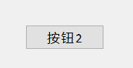

# Qt 常用控件类

## 一、Qt 按钮类型控件

### 1.1  按键基类 QAbstractButton

#### 1.1.1 按钮文本和图标

**文本访问**

- 设置文本：`public: void setText(const QString &text);`
- 得到按钮上的文本：`public: QString text() const;`

**按钮图标访问**

- 得到按钮设置的图标：`public: QIcon icon() const;`
- 给按钮设置图标：`public: void setIcon(const QIcon &icon);`
- 得到按钮图标大小：`public: QSize iconSize() const`
- 设置按钮图标的大小：`slots: void setIconSize(const QSize &size);`

#### 1.1.2 按钮的属性（Properties）

> `checkable: bool` 默认为false
>
> `checked: bool` 默认为false

按钮的三种状态：`Normal`, `Hover`, `Pressed`

- `Normal` : 普通状态，没有和鼠标接触



- `Hover` : 悬停状态，鼠标在按钮上面，但并未按下


- `Pressed` : 按压状态，鼠标在按钮上面处于按下状态


**默认状态下，点击按钮，按钮是会回弹的**。鼠标点击一次按钮，按钮的**外观上**变化为

`Normal`——`Hover`——`Pressed`——`released`

**将按钮设置为checkable后，按钮将不会回弹**，此时按钮的`checked: bool`则记录了按钮是`pressed`状态还是`released`状态。在设置 `check` 属性前必须进行 `checkable` 属性设置。

`checkable=true;checked=false` ——clicked——`checkable=true;checked=true`

`checkable=true;checked=true` ——clicked——`checkable=true;checked=false`

```c++
// 判断按钮是否设置了checkable属性, 如果设置了点击按钮, 按钮一直处于选中状态
// 默认这个属性是关闭的, not checkable
bool QAbstractButton::isCheckable() const;
// 设置按钮的checkable属性
// 参数为true: 点击按钮, 按钮被选中, 松开鼠标, 按钮不弹起
// 参数为false: 点击按钮, 按钮被选中, 松开鼠标, 按钮弹起
void QAbstractButton::setCheckable(bool);

// 判断按钮是不是被按下的
bool QAbstractButton::isChecked() const;
// 设置按钮 按下的或释放的: true-按下, false-被释放
// 设置该属性前, 必须先进行 checkable属性的设置
slots: void QAbstractButton::setChecked(bool);
```

#### 1.1.3 信号函数

- 按钮**被点击**的信号函数，一旦被点击（点击是按下+释放的动作过程）即发送信号

~~~c++
/*
当按钮被激活时（即，当鼠标在按钮内时按下然后释放），
当键入快捷键时，或当click()或animateClick()被调用时，这个信号被发出。
如果调用setDown()、setChecked()或toggle()，则不会触发此信号
*/
signals: void clicked(bool checked = false);
~~~

- 按钮被鼠标**按下**的信号函数，一旦被按下，即发送信号

~~~c++
// 在按下按钮的时候发射这个信号
signals: void pressed();
~~~

- 按钮被鼠标**释放**，鼠标按键在按钮上按下后，按键释放瞬间将发出该信号

~~~c++
// 在释放这个按钮的时候发射这个信号
signals: void released();
~~~

- 按钮状态切换时，就发出信号

~~~c++
// 按钮改变其状态时，就会发出此信号。checked在按钮为按下时为true，在按钮释放(回弹状态)时为false。
signals: void toggled(bool checked);
~~~

 #### 1.1.4 槽函数

```c++
// 执行一个点击按钮的动画，并在毫秒后释放(默认是100毫秒)。
slots: void QAbstractButton::animateClick(int msec = 100);
// 执行一次按钮点击,没有动画, 相当于使用鼠标点击了按钮
slots: void QAbstractButton::click();

// 参考 1.2 中的函数介绍
slots: void QAbstractButton::setChecked(bool);
// 设置按钮上图标大小
slots: void setIconSize(const QSize &size);
// 切换可检查按钮的状态。 checked <==> unchecked。非checkabled按钮无法使用该信号函数
slots: void QAbstractButton::toggle();
```

### 1.2 【测试/练习】两个按钮实现双向计数

>一个 `QLabel` 对象，两个 `QPushButton` 对象，从 `0` 开始双向计数，期间计数不会清零，即每次计数都是从上一次计数结束的数字开始的。计数间隔为0.5s，分别实现以下几种情形：
>
>- 按住按钮1，+1计数，松开按钮 1就停止计数；按住按钮2，-1计数，松开按钮 2就停止计数；
>- 点击按钮1，按钮1被按住，按钮2如果被按住则回弹，+1计数，再次点击按钮 1就停止计数；点击按钮2，按钮2被按住，按钮1如果被按住则回弹，-1计数，再次点击按钮 2就停止计数；

**第一种情形：**按住按钮1，+1计数，松开按钮 1就停止计数；按住按钮2，-1计数，松开按钮 2就停止计数；

~~~c++
#include "dialog.h"
#include "ui_dialog.h"
#include <QTimer>
Dialog::Dialog(QWidget *parent) :
    QDialog(parent),
    ui(new Ui::Dialog)
{
    ui->setupUi(this);

    // 声明用来计数的计时器
    QTimer* t = new QTimer(this);

    int i=0;// 用来判断是哪个按钮触发计时器的标志位
    int coun=0;
    int* pi=&i;// 创建标志位的指针，使得复制捕获能够修改变量i的值。

    /****按键按下则启动计时器，并改变标志位****/
    /* Lambda = 号值传递方式捕获，用 & 会出错，尚不清楚原因 */
    connect(ui->Button1,&QPushButton::pressed,this,[=]()mutable{
        *pi=0;// 表示是按钮1被按下
        t->start(500);// 以时间间隔500ms启动计时器
    });

    connect(ui->Button2,&QPushButton::pressed,this,[=]()mutable{
        *pi=1;// 表示是按钮2被按下
        t->start(500);// 以时间间隔500ms启动计时器
    });


    /****按键松开则要停止计时器****/
    connect(ui->Button1,&QPushButton::released,this,[=]{
        t->stop();// 计时器停止计时
    });
    connect(ui->Button2,&QPushButton::released,this,[=]{
        t->stop();// 计时器停止计时
    });

    // 计时器发出计时间隔信号，使textlabel双向计数
    connect(t,&QTimer::timeout,this,[=]()mutable{
        if(*pi==1)// 用标志位来判断是哪个按键启动的计时器
        {
            ui->label->setText(QString::number( --coun ));// 按钮2 -1计数
        }
        else
        {
            ui->label->setText(QString::number( ++coun ));// 按钮1 -1计数
        }
    });

}

Dialog::~Dialog()
{
    delete ui;
}

~~~

**第二种情形：**点击按钮1，按钮1被按住，按钮2如果被按住则回弹，+1计数，再次点击按钮 1就停止计数；点击按钮2，按钮2被按住，按钮1如果被按住则回弹，-1计数，再次点击按钮 2就停止计数；

~~~c++
#include "dialog.h"
#include "ui_dialog.h"
#include <QTimer>
Dialog::Dialog(QWidget *parent) :
    QDialog(parent),
    ui(new Ui::Dialog)
{
    ui->setupUi(this);

    // 声明用来计数的计时器
    QTimer* t = new QTimer(this);

    int i=0;// 用来判断是哪个按钮触发计时器的标志位
    int coun=0;
    int* pi=&i;

    ui->Button1->setCheckable(true);
    ui->Button2->setCheckable(true);
    ui->Button2->setChecked(true);

    // 按键按下则启动计时器，并改变标志位
    /* Lambda = 号值传递方式捕获，用 & 会出错，尚不清楚原因 */
    connect(ui->Button1,&QPushButton::clicked,this,[=]()mutable{
        if(ui->Button1->isChecked())
        {
            *pi=0;// 表示是按钮1被按住
            ui->Button2->setChecked(false);// 按钮1按下后，按钮2应回弹
            t->start(500);
        }
        else
        {
            t->stop();
        }
    });

    connect(ui->Button2,&QPushButton::clicked,this,[=]()mutable{
        if(ui->Button2->isChecked())
        {
            *pi=1;// 表示是按钮1被按住
            ui->Button1->setChecked(false);// 按钮2按下后，按钮1应回弹
            t->start(500);
        }
        else
        {
            t->stop();
        }
    });

    // 计时器计时，使textlabel双向计数
    connect(t,&QTimer::timeout,this,[=]()mutable{
        if(*pi==1)
        {
            ui->label->setText(QString::number( --coun ));// 按钮2 -1计数
        }
        else
        {
            ui->label->setText(QString::number( ++coun ));// 按钮1 -1计数
        }
    });

}

Dialog::~Dialog()
{
    delete ui;
}

~~~

### 1.3 QPushButton

#### 1.3.1 常用API

**构造函数**

~~~c++
/*
parameter: 
	- icon: 按键上显示的图标
	- text: 按键上显示的标题
	- parent: 按键的父对象
*/
QPushButton::QPushButton(const QIcon &icon, const QString &text, QWidget *parent = nullptr);
QPushButton::QPushButton(const QString &text, QWidget *parent = nullptr);
QPushButton::QPushButton(QWidget *parent = nullptr);
~~~

**按键属性**

| 属性                        | 访问函数                                             |
| --------------------------- | ---------------------------------------------------- |
| `autoDefault: bool`         | `bool autoDefault() const;void setAutoDefault(bool)` |
| `default: bool `默认为false | `bool isDefault() const;void setDefault(bool)`       |
| `flat: bool` 默认为false    | `bool isFlat() const;void setFlat(bool)`             |

> Default and autodefault buttons decide what happens when the user presses `enter` in a dialog.

- `autoDefault: bool` 当按钮的有一个 `QDialog` 的父对象时，默认为 `true` ，否则默认为 `false`
- 当 `default=true` ，用户按 `enter` 键时，会被自动按下，除非此时焦点(蓝色的边框)在自动默认按键上(`autoDefault=true`)，将按下autoDefault的按键。
- 
- 蓝色边框（焦点）通过方向键移动，无法移动到 `autoDefault=false` 的按钮上
- `flat: bool` 属性将改变按键的外观
- 

## 二、QTextEdit 

### 2.1 Properties

| 成员属性                     | 描述                               | 访问方法                                                |
| ---------------------------- | ---------------------------------- | ------------------------------------------------------- |
| `readOnly: bool` 默认为false | whether the line edit is read only | `bool isReadOnly() const`<br />`void setReadOnly(bool)` |

### 2.2 API

#### 构造函数

~~~c++
/// parent 指向父对象
/// 显示的文本 text , 文本被解释为 HTML
QTextEdit::QTextEdit(const QString &text, QWidget *parent = nullptr);
QTextEdit::QTextEdit(QWidget *parent = nullptr)
~~~

#### 添加文本

~~~c++
/// 将带有文本的新段落附加到文本编辑的末尾。
[slot] void QTextEdit::append(const QString &text);
/// 在当前光标处插入将被解释为 HTML 格式的文本
[slot] void QTextEdit::insertHtml(const QString &text);
/// 在当前光标处插入 纯文本
[slot] void QTextEdit::insertPlainText(const QString &text);
~~~

#### 信号函数

~~~c++
/// 每当文档的内容发生变化时，就会发出这个信号； 例如，插入或删除文本时，或应用格式时。
[signal] void QTextEdit::textChanged()
~~~

#### 移动光标

~~~c++
/// QTextCursor::MoveOperation QTextCursor 定义的枚举类型
// QTextCursor::End 	光标移动至末尾操作
// QTextCursor::Start	光标移动至文档开头操作
// ...
/// QTextCursor::MoveMode QTextCursor 定义的枚举类型
// QTextCursor::MoveAnchor 移动默认（锚点随动）
// QTextCursor::KeepAnchor 移动并选中（锚点不动）
void QTextEdit::moveCursor(QTextCursor::MoveOperation operation, QTextCursor::MoveMode mode = QTextCursor::MoveAnchor)
~~~

#### 访问文本

~~~c++
QString QTextEdit::toPlainText() const
~~~


`displayText() const` 与 `text()` 

- `displayText() const` 获取的是 `[Properties] const QString dispalyText` 显示的文本，对于一些场合，显示的文本并不是真正的文本，如密码显示为 `*******` 
-  `text()` 获取的是 `[Properties] const QString text ` 即编辑的文本。

[qDebug重定向到写入文件以及显示在界面控件上-3YL的博客 (labisart.com)](http://labisart.com/blog/index.php/Home/Index/article/aid/184)

[(1条消息) QT TextEdit控件_双子座断点的博客-CSDN博客_qt textedit](https://blog.csdn.net/qq_37529913/article/details/109217353)

## 英语单词

> toggle
>
> check
>
> > 
