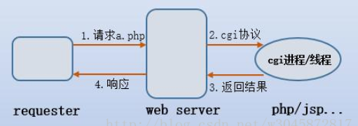
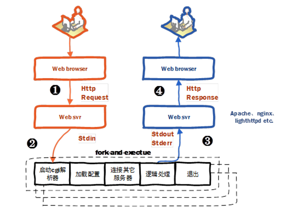
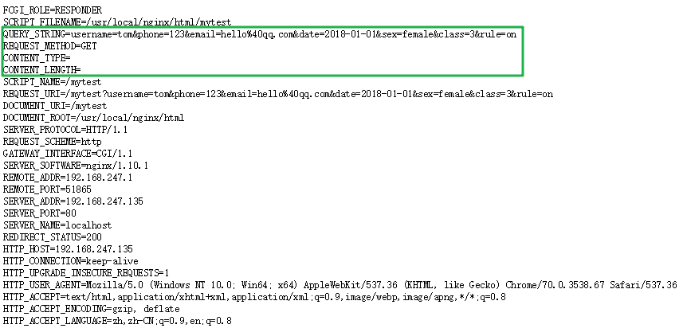

[TOC]

## 1. Nginx作为web服务器处理请求

1. 静态请求 

   > 客户端访问服务器的静态网页, 不涉及任何数据的处理, 如下面的URL:

   ```http
   http://localhsot/login.html
   ```

2. 动态请求

   > 客户端会将数据提交给服务器

   ```http
   # 使用get方式提交数据得到的url
   http://localhost/login?user=zhang3&passwd=123456&age=12&sex=man
   	- http: 协议
   	- localhost: 域名
   	- /login: 服务器端要处理的指令
   	- ? : 连接符, 后边的内容是客户端给服务器提交的数据
   	- & : 分隔符
   动态的url如何找服务器端处理的指令?
   - 去掉协议
   - 去掉域名/IP
   - 去掉端口
   - 去掉?和它后边的内容
   # 如果看到的是请求行, 如何找处理指令?
   POST /upload/UploadAction HTTP/1.1
   GET /?username=tom&phone=123&email=hello%40qq.com&date=2018-01-01&sex=male&class=3&rule=on HTTP/1.1
   1. 找请求行的第二部分
   	- 如果是post, 处理指令就是请求行的第二部分
   	- 如果是get, 处理指令就是请求行的第二部分, ? 以前的内容
   ```

## 2. http协议复习

1. 请求消息(Request)  - 客户端(浏览器)发送给服务器的数据格式

   > 四部分: 请求行, 请求头, 空行, 请求数据 
   > - 请求行: 说明请求类型, 要访问的资源, 以及使用的http版本
   > - 请求头: 说明服务器要使用的附加信息
   > - 空行: 空行是必须要有的, 即使没有请求数据
   > - 请求数据: 也叫主体, 可以添加任意的其他数据

   - Get方式提交数据

     > 第一行: 请求行
     >
     > 第2-9行:   请求头(键值对)
     >
     > 第10行: 空行
     >
     > get方式提交数据, 没有第四部分, 提交的数据在请求行的第二部分, 提交的数据会全部显示在地址栏中

     ```http
     GET /?username=tom&phone=123&email=hello%40qq.com&date=2018-01-01&sex=male&class=3&rule=on HTTP/1.1
     Host: 192.168.26.52:6789
     Connection: keep-alive
     Cache-Control: max-age=0
     Upgrade-Insecure-Requests: 1
     User-Agent: Mozilla/5.0 (Windows NT 10.0; Win64; x64) AppleWebKit/537.36 (KHTML, like Gecko) Chrome/70.0.3538.67 Safari/537.36
     Accept: text/html,application/xhtml+xml,application/xml;q=0.9,image/webp,image/apng,*/*;q=0.8
     Accept-Encoding: gzip, deflate
     Accept-Language: zh,zh-CN;q=0.9,en;q=0.8
     
     ```

   - Post方式提交数据

     > 第一行: 请求行
     >
     > 第2 -12行: 请求头 (键值对)
     >
     > 第13行: 空行
     >
     > 第14行: 提交的数据

     ```http
     POST / HTTP/1.1
     Host: 192.168.26.52:6789
     Connection: keep-alive
     Content-Length: 84
     Cache-Control: max-age=0
     Upgrade-Insecure-Requests: 1
     Origin: null
     Content-Type: application/x-www-form-urlencoded
     User-Agent: Mozilla/5.0 (Windows NT 10.0; Win64; x64) AppleWebKit/537.36 (KHTML, like Gecko) Chrome/70.0.3538.67 Safari/537.36
     Accept: text/html,application/xhtml+xml,application/xml;q=0.9,image/webp,image/apng,*/*;q=0.8
     Accept-Encoding: gzip, deflate
     Accept-Language: zh,zh-CN;q=0.9,en;q=0.8
     
     username=tom&phone=123&email=hello%40qq.com&date=2018-01-01&sex=male&class=3&rule=on
     ```

2. 响应消息(Response) -> 服务器给客户端发送的数据

   > - 四部分: 状态行, 消息报头, 空行, 响应正文
   >   - 状态行: 包括http协议版本号, 状态码, 状态信息
   >   - 消息报头: 说明客户端要使用的一些附加信息
   >   - 空行: 空行是必须要有的
   >   - 响应正文: 服务器返回给客户端的文本信息
   >
   > 第一行:状态行
   >
   > 第2 -11行: 响应头(消息报头)
   >
   > 第12行: 空行
   >
   > 第13-18行: 服务器给客户端回复的数据

   ```http
   HTTP/1.1 200 Ok
   Server: micro_httpd
   Date: Fri, 18 Jul 2014 14:34:26 GMT
   /* 告诉浏览器发送的数据是什么类型 */
   Content-Type: text/plain; charset=iso-8859-1 (必选项)
   /* 发送的数据的长度 */
   Content-Length: 32  
   Location:url
   Content-Language: zh-CN
   Last-Modified: Fri, 18 Jul 2014 08:36:36 GMT
   Connection: close
   
   #include <stdio.h>
   int main(void)
   {
       printf("hello world!\n");
       return 0;
   }
   ```

3. http状态码

   > 状态代码有三位数字组成，第一个数字定义了响应的类别，共分五种类别:
   >
   > - 1xx：指示信息--表示请求已接收，继续处理
   > - 2xx：成功--表示请求已被成功接收、理解、接受
   > - 3xx：重定向--要完成请求必须进行更进一步的操作
   > - 4xx：客户端错误--请求有语法错误或请求无法实现
   > - 5xx：服务器端错误--服务器未能实现合法的请求

## 3. fastCGI

### 3.1 CGI

> **通用网关接口**（**C**ommon **G**ateway **I**nterface/**CGI**）**描述了客户端和服务器程序之间传输数据的一种标准**，可以让一个客户端，从网页浏览器向执行在网络服务器上的程序请求数据。CGI 独立于任何语言的，CGI 程序可以用任何[脚本语言](http://zh.wikipedia.org/wiki/%E8%84%9A%E6%9C%AC%E8%AF%AD%E8%A8%80)或者是完全独立[编程语言](http://zh.wikipedia.org/wiki/%E7%BC%96%E7%A8%8B%E8%AF%AD%E8%A8%80)实现，只要这个语言可以在这个系统上运行。



 

> http://localhost/login?user=zhang3&passwd=123456&age=12&sex=man
>
> 1. 用户通过浏览器访问服务器, 发送了一个请求, 请求的url如上
> 2. 服务器接收数据, 对接收的数据进行解析
> 3. nginx对于一些登录数据不知道如何处理, nginx将数据发送给了cgi程序
>    - 服务器端会创建一个cgi进程
> 4. CGI进程执行
>    - 加载配置, 如果有需求加载配置文件获取数据
>    - 连接其他服务器: 比如数据库
>    - 逻辑处理: 
>    - 得到结果, 将结果发送给服务器
>    - 退出
> 5. 服务器将cgi处理结果发送给客户端
>
> 在服务器端CGI进程会被频繁的创建销毁
>
> - 服务器开销大, 效率低

### 3.2 fastCGI

> 快速通用网关接口（Fast Common Gateway Interface／FastCGI）是[通用网关接口](http://zh.wikipedia.org/wiki/%E9%80%9A%E7%94%A8%E7%BD%91%E5%85%B3%E6%8E%A5%E5%8F%A3)（CGI）的改进，描述了客户端和服务器程序之间传输数据的一种标准。==FastCGI致力于减少Web服务器**与**[**CGI**](http://zh.wikipedia.org/wiki/CGI)[**程式**](http://zh.wikipedia.org/wiki/%E7%A8%8B%E5%BC%8F)**之间互动的开销，从而使**[**服务器**](http://zh.wikipedia.org/wiki/%E4%BC%BA%E6%9C%8D%E5%99%A8)**可以同时处理更多的Web**请求==。与为每个请求创建一个新的进程不同，FastCGI使用持续的进程来处理一连串的请求。这些进程由FastCGI进程管理器管理，而不是web服务器。 

**fastCGI与CGI的区别:**

> CGI 就是所谓的短生存期应用程序，FastCGI 就是所谓的长生存期应用程序。FastCGI像是一个常驻(long-live)型的CGI，它可以一直执行着，不会每次都要花费时间去fork一次

 

>http://localhost/login?user=zhang3&passwd=123456&age=12&sex=man
>
>1. 用户通过浏览器访问服务器, 发送了一个请求, 请求的url如上
>2. 服务器接收数据, 对接收的数据进行解析
>3. nginx对于一些登录数据不知道如何处理, nginx将数据发送给了fastcgi程序
>   - 通过本地套接字
>   - 网络通信的方式
>4. fastCGI程序如何启动
>   - 不是有web服务器直接启动
>   - 通过一个fastCGI进程管理器启动
>5. fastcgi启动
>   - 加载配置 - 可选
>   - 连接服务器 - 数据库
>   - 循环
>     - 服务器有请求 -> 处理
>       - 将处理结果发送给服务器
>         - 本地套接字
>         - 网络通信
>     - 没有请求 -> 阻塞
>6. 服务器将fastCGI的处理结果发送给客户端

### 3.3 fastCGI和spawn-fcgi安装

1. 安装fastCGI

   ```shell
   ./configure
   make
   - fcgio.cpp:50:14: error: 'EOF' was not declared in this scope
   - 没有包含对应的头文件:
   	- stdio.h - c
   	- cstdio -> c++
   sudo make install
   ```

2. 安装spawn-fcgi
   - 下载地址: <http://redmine.lighttpd.net/projects/spawn-fcgi/wiki> 

   - 安装

     ```shell
     ./configure
     make
     sudo make install
     ```

### 3.4 nginx && fastcgi

> nginx 不能像apache那样直接执行外部可执行程序，但nginx可以作为代理服务器，将请求转发给后端服务器，这也是nginx的主要作用之一。其中nginx就支持FastCGI代理，接收客户端的请求，然后将请求转发给后端fastcgi进程。下面介绍如何使用C/C++编写cgi/fastcgi，并部署到nginx中。 
>
> 通过前面的介绍知道，fastcgi进程由FastCGI进程管理器管理，而不是nginx。这样就需要一个FastCGI管理，管理我们编写fastcgi程序。我们使用spawn-fcgi作为FastCGI进程管理器。 
>
> spawn-fcgi是一个通用的FastCGI进程管理器，简单小巧，原先是属于lighttpd的一部分，后来由于使用比较广泛，所以就迁移出来作为独立项目了。spawn-fcgi使用pre-fork 模型，==功能主要是打开监听端口，绑定地址，然后fork-and-exec创建我们编写的fastcgi应用程序进程，退出完成工作==。fastcgi应用程序初始化，然后进入死循环侦听socket的连接请求。


> http://localhost/login?user=zhang3&passwd=123456&age=12&sex=man
>
> 1. 客户端访问, 发送请求
> 2. nginx web服务器, 无法处理用户提交的数据
> 3. spawn-fcgi - 通信过程中的服务器角色
>    - 被动接收数据
>    - 在spawn-fcgi启动的时候给其绑定IP和端口
> 4. fastCGI程序 
>    - 程序猿写的 -> login.c -> 可执行程序( login )
>    - 使用 spawn-fcgi 进程管理器启动 login 程序, 得到一进程

1. nginx的数据转发 - 需要修改nginx的配置文件 nginx.conf

   ```nginx
   通过请求的url http://localhost/login?user=zhang3&passwd=123456&age=12&sex=man 转换为一个指令:
   	- 去掉协议
   	- 去掉域名/IP + 端口
   	- 如果尾部有文件名 去掉
   	- 去掉 ? + 后边的字符串
   	- 剩下的就是服务器要处理的指令: /login
   location /login
   {
       # 转发这个数据, fastCGI进程
       fastcgi_pass 地址信息:端口;
       # fastcgi.conf 和nginx.conf在同一级目录: /usr/local/nginx/conf
       # 这个文件中定义了一些http通信的时候用到环境变量, nginx赋值的
       include fastcgi.conf;
   }
   地址信息: 
   	- localhost
   	- 127.0.0.1
   	- 192.168.1.100
   端口: 找一个空闲的没有被占用的端口即可
   ```

2. spawn-fcgi如何启动

   ```shell
   # 前提条件: 程序猿的fastCGI程序已经编写完毕 -> 可执行文件 login
   spawn-fcgi -a IP地址 -p 端口 -f fastcgi可执行程序
    - IP地址: 应该和nginx的 fastcgi_pass 配置项对应
    	- nginx: localhost   ->   IP: 127.0.0.1
   	- nginx: 127.0.0.1	 ->   IP: 127.0.0.1
   	- nginx: 192.168.1.100   ->    IP: 192.168.1.100
   - 端口:
   	应该和nginx的 fastcgi_pass 中的端口一致
   ```

3. fastCGI程序怎么写

   ```c
   // http://localhost/login?user=zhang3&passwd=123456&age=12&sex=man
   // 要包含的头文件
   #include "fcgi_config.h" // 可选
   #include "fcgi_stdio.h" // 必须的, 编译的时候找不到这个头文件, find->path , gcc -I
   // 编写代码的流程
   int main()
   {
       // FCGI_Accept()是一个阻塞函数, nginx给fastcgi程序发送数据的时候解除阻塞
       while (FCGI_Accept() >= 0) 
       {
           // 1. 接收数据
           // 1.1 get方式提交数据 - 数据在请求行的第二部分
           // user=zhang3&passwd=123456&age=12&sex=man
           char *text = getenv("QUERY_STRING"); 
           // 1.2 post方式提交数据
           char *contentLength = getenv("CONTENT_LENGTH");
           // 根据长度大小判断是否需要循环
           // 2. 按照业务流程进行处理
           // 3. 将处理结果发送给nginx
           // 数据回发的时候, 需要告诉nginx处理结果的格式 - 假设是html格式
           printf("Content-type: text/html\r\n");
           printf("<html>处理结果</html>");
       }
   }
   ```

   

   

##复习

Nginx

1. 是什么?

   - 开源的框架
     - 库: 一套API
     - 框架: (可以)有一套API, 有一套事件处理机制

2. 能干什么?

   - web服务器
     - http协议
   - 反向代理
     - 实现web服务器的负载均衡
   - 邮件服务器
     - pop3

3. 怎么干事儿?

   - web服务器

     ```nginx
     # 部署静态网页
     1. 制作出来, 并且部署到对应的资源目录中
     2. 根据客户端的请求, 在服务器端添加对应的 location处理指令 - nginx.conf
     3. 重新加载nginx.conf配置文件
     客户端请求的url: http://xxxx.com/hello/login.html
     	- 去掉协议: http
     	- 去掉域名/IP:
     	- 去掉端口
     	- 去掉尾部的文件名
     ```

   - 反向代理服务器

     ```nginx
     1. 找到反向代理服务器 的配置文件: nginx.conf
     2. 找模块 http -> server
     server{
         listen: 80; # 客户端访问反向代理服务器的时候使用的端口
         server_name: localhost; # 域名, 客户端访问反向代理服务器时候, 使用的地址
         # 配置如何转发, 根据客户端的请求的url找到对应的转发指令
         location /
         {
          	# 设置转发地址
             proxy_pass http://test.com;
         }    
          location /login
         {
          	# 设置转发地址
             proxy_pass http://test.com;
         } 
     }
     # 设置代理
     upstream test.com
     {
         # web服务器的地址信息
         server 192.168.1.100:80;
         server 192.168.1.101:80;
     }
     
     # 192.168.1.100 web服务器
     http->server
     server{
             location /
         {
          	# 设置转发地址
             root xxx;
         }    
          location /login
         {
          	# 设置转发地址
             xxxx;
         } 
     }
     # 192.168.1.101 web服务器
     http->server
     server{
             location /
         {
          	# 设置转发地址
             root xxx;
         }    
          location /login
         {
          	# 设置转发地址
             xxxx;
         } 
     }
     ```


## 其他知识点

1. fastCGI环境变量 - fastcgi.conf

    | 环境变量           | 说明                                           |
    | ------------------ | ---------------------------------------------- |
    | SCRIPT_FILENAME    | 脚本文件请求的路径                             |
    | **QUERY_STRING**   | 请求的参数;如?app=123                          |
    | **REQUEST_METHOD** | 请求的动作(GET,POST)                           |
    | **CONTENT_TYPE**   | 请求头中的Content-Type字段                     |
    | **CONTENT_LENGTH** | 请求头中的Content-length字段                   |
    | SCRIPT_NAME        | 脚本名称                                       |
    | REQUEST_URI        | 请求的地址不带参数                             |
    | DOCUMENT_URI       | 与$uri相同                                     |
    | DOCUMENT_ROOT      | 网站的根目录。在server配置中root指令中指定的值 |
    | SERVER_PROTOCOL    | 请求使用的协议，通常是HTTP/1.0或HTTP/1.1       |
    | GATEWAY_INTERFACE  | cgi 版本                                       |
    | SERVER_SOFTWARE    | nginx 版本号，可修改、隐藏                     |
    | REMOTE_ADDR        | 客户端IP                                       |
    | REMOTE_PORT        | 客户端端口                                     |
    | SERVER_ADDR        | 服务器IP地址                                   |
    | SERVER_PORT        | 服务器端口                                     |
    | SERVER_NAME        | 服务器名，域名在server配置中指定的server_name  |

2. 客户端使用Post提交数据常用方式

    > - Http协议规定 POST 提交的数据必须放在消息主体（entity-body）中，但协议并没有规定数据必须使用什么编码方式。
    >
    > - 开发者完全可以自己决定消息主体的格式
    >
    > - 数据发送出去，还要服务端解析成功才有意义, 服务端通常是根据请求头（headers）中的 
    >
    >   Content-Type 字段来获知请求中的消息主体是用何种方式编码，再对主体进行解析。

    常用的四种方式

    - **application/x-www-form-urlencoded**

      ```http
      # 请求行
      POST http://www.example.com HTTP/1.1
      # 请求头
      Content-Type: application/x-www-form-urlencoded;charset=utf-8
      # 空行
      # 请求数据(向服务器提交的数据)
      title=test&user=kevin&passwd=32222
      ```

    - **application/json**

      ```http
      POST / HTTP/1.1
      Content-Type: application/json;charset=utf-8
      {"title":"test","sub":[1,2,3]}
      ```

    - **text/xml**

      ```http
      POST / HTTP/1.1
      Content-Type: text/xml
      <?xml version="1.0" encoding="utf8"?>
      <methodcall>
          <methodname color="red">examples.getStateName</methodname>
          <params>
          	<value><i4>41</i4></value>
          </params>
      </methodcall>
      
      <font color="red">nihao, shijie</font>
      ```

    - multipart/form-data

      ```http
      POST / HTTP/1.1
      Content-Type: multipart/form-data
      # 发送的数据
      ------WebKitFormBoundaryPpL3BfPQ4cHShsBz \r\n
      Content-Disposition: form-data; name="file"; filename="qw.png"
      Content-Type: image/png\r\n; md5="xxxxxxxxxx"
      \r\n
      .............文件内容................
      .............文件内容................
      ------WebKitFormBoundaryPpL3BfPQ4cHShsBz--
      Content-Disposition: form-data; name="file"; filename="qw.png"
      Content-Type: image/png\r\n; md5="xxxxxxxxxx"
      \r\n
      .............文件内容................
      .............文件内容................
      ------WebKitFormBoundaryPpL3BfPQ4cHShsBz--
      ```

3. strtol 函数使用

    ```c
    // 将数字类型的字符串 -> 整形数
    long int strtol(const char *nptr, char **endptr, int base);
    	- 参数nptr: 要转换的字符串 - 数字类型的字符串: "123", "0x12", "0776"
    	- 参数endptr: 测试时候使用, 一般指定为NULL
    	- 参数base: 进制的指定
    		- 10 , nptr = "123456", 如果是"0x12"就会出错
            - 8  , nptr = "0345"
            - 16,  nptr = "0x1ff"
    
    char* p = "123abc";
    char* pt = NULL;
    strtol(p, &pt, 10);
     - 打印pt的值: "abc"
    ```

         

http://tool.oschina.net/