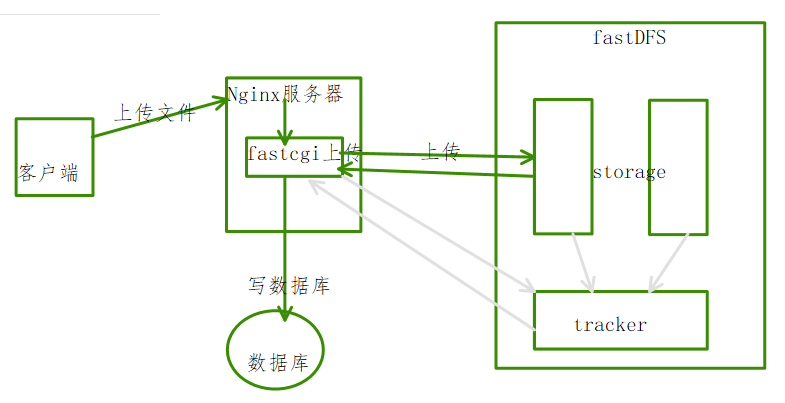
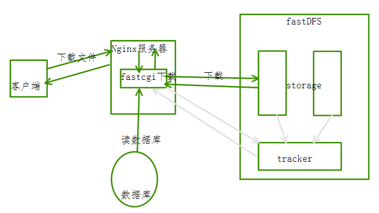

## 1. 文件上传下载流程

1. 文件上传流程

   


2. 文件下载流程

   

3. 优化

   > 优化思路:
   >
   > - - 直接让客户端连接fastDFS的存储节点, 实现文件下载
   >
   >   - 举例, 访问一个url直接下载:
   >
   >     <http://192.168.247.147/group1/M00/00/00/wKj3k1tMBKuARhwBAAvea_OGt2M471.jpg> 
   >

   

   > 1. 客户端发送请求使用的协议: http
   >
   > 2. - fastDFS能不能解析http协议
   >
   >    - nginx能解析http协议
   >
   >    - - 在nginx中安装fastDFS的插件
   >
   > 3. 客户端怎么知道文件就存储在对应的那个存储节点上?
   >
   > 4. - 上传的时候将fileID和存储节点IP地址都进行存储

## 2. Nginx和fastDFS的整合

1. 在存储节点上安装Nginx, 将软件安装包拷贝到fastDFS存储节点对应的主机上

   ```shell
   # 1. 找fastDFS的存储节点
   # 2. 在存储节点对应的主机上安装Nginx, 安装的时候需要一并将插件装上
   #	- (余庆提供插件的代码   +   nginx的源代码 ) * 交叉编译 = Nginx  
   ```

2. 在存储节点对应的主机上安装Nginx, 作为web服务器

   ```shell
   - fastdfs-nginx-module_v1.16.tar.gz 解压缩
   # 1. 进入nginx的源码安装目录
   # 2. 检测环境, 生成makefile
   ./configure --add-module=fastdfs插件的源码目录/src
   make
   sudo make install
   ```

   make过程中的错误:

   ```shell
   # 1. fatal error: fdfs_define.h: No such file or directory
   # 2. fatal error: common_define.h: No such file or directory
   
   default:    build
   
   clean:
       rm -rf Makefile objs
   
   build:
       $(MAKE) -f objs/Makefile
   
   install:
       $(MAKE) -f objs/Makefile install
   
   modules:
       $(MAKE) -f objs/Makefile modules
   
   upgrade:
       /usr/local/nginx/sbin/nginx -t
   
       kill -USR2 `cat /usr/local/nginx/logs/nginx.pid`
       sleep 1
       test -f /usr/local/nginx/logs/nginx.pid.oldbin
   
       kill -QUIT `cat /usr/local/nginx/logs/nginx.pid.oldbin`
   # 解决方案 - 修改objs/Makefile
   ALL_INCS = -I src/core \
       -I src/event \
       -I src/event/modules \
       -I src/os/unix \
       -I /usr/local/include/fastdfs \
       -I /usr/local/include/fastcommon/ \
       -I objs \
       -I src/http \                                                                                                      
       -I src/http/modules\
       -I /usr/include/fastdfs/
   ```

3. 安装成功, 启动Nginx, 发现没有 worker进程

   ```shell
   robin@OS:/usr/local/nginx/sbin$ ps aux|grep nginx
   root      65111  0.0  0.0  39200   696 ?Ss   10:32   0:00 nginx: master process ./nginx
   robin     65114  0.0  0.0  16272   928 pts/9  S+   10:32   0:00 grep --color=auto nginx
   ```

   找nginx的logs日志

   ```shell
   # ERROR - file: shared_func.c, line: 968, file /etc/fdfs/mod_fastdfs.conf not exist
   # 从哪儿找 -> fastDFS插件目录中找
   robin@OS:~/package/nginx/fastdfs-nginx-module/src$ tree
   .
   ├── common.c
   ├── common.h
   ├── config
   ├── mod_fastdfs.conf   -> cp /etc/fdfs
   └── ngx_http_fastdfs_module.c
   
   0 directories, 5 files
   ```


   需要修改mod_fdfs.conf文件, 参数当前存储节点的storage.conf进行修改

   ```shell
   # 存储log日志的目录
   base_path=/home/robin/fastdfs/storage
   # 连接tracker地址信息
   tracker_server=192.168.247.135:22122
   # 存储节点绑定的端口
   storage_server_port=23000
   # 当前存储节点所属的组
   group_name=group1
   # 客户端下载文件的时候, 这个下载的url中是不是包含组的名字
   // 上传的fileID: group1/M00/00/00/wKj3h1vJRPeAA9KEAAAIZMjR0rI076.cpp
   // 完整的url: http://192.168.1.100/group1/M00/00/00/wKj3h1vJRPeAA9KEAAAIZMjR0rI076.cpp
   url_have_group_name = true
   # 存储节点上存储路径的个数
   store_path_count=1
   # 存储路径的详细信息
   store_path0=/home/robin/fastdfs/storage
   ```

4. 重写启动Nginx, 还是没有worker进程, 查看log日志

   ```shell
   # ERROR - file: ini_file_reader.c, line: 631, include file "http.conf" not exists, line: "#include http.conf"
   从 /etc/fdfs 下找的时候不存在
   	- 从fastDFS源码安装目录找/conf
   	- sudo cp http.conf /etc/fdfs
   # ERROR - file: shared_func.c, line: 968, file /etc/fdfs/mime.types not exist
   	- 从nginx的源码安装包中找/conf
   	- sudo cp mime.types /etc/fdfs
   ```

5. 通过浏览器请求服务器下载文件: 404 Not Found

   ```http
   http://192.168.1.100/group1/M00/00/00/wKj3h1vJRPeAA9KEAAAIZMjR0rI076.jpg
   # 错误信息
   open() "/usr/local/nginx/zyFile2/group1/M00/00/00/wKj3h1vJSOqAM6RHAAvqH_kipG8229.jpg" failed (2: No such file or directory), client: 192.168.247.1, server: localhost, request: "GET /group1/M00/00/00/wKj3h1vJSOqAM6RHAAvqH_kipG8229.jpg HTTP/1.1", host: "192.168.247.135"
   服务器在查找资源时候, 找的位置不对, 需要给服务器指定一个正确的位置, 如何指定?
   	- 资源在哪? 在存储节点的存储目录中 store_path0
   	- 如何告诉服务器资源在这? 在服务器端添加location处理
   locatioin /group1/M00/00/00/wKj3h1vJSOqAM6RHAAvqH_kipG8229.jpg
   location /group1/M00/00/00/
   location /group1/M00/
   location /group1/M00/
   {
   	# 告诉服务器资源的位置
   	root /home/robin/fastdfs/storage/data;
   	ngx_fastdfs_module;
   }
   	
   ```


## 3. 数据库表

### 3.1 数据库操作

1. 创建一个名称为cloud_disk的数据库 

   ```mysql
   CREATE DATABASE cloud_disk;
   ```

2. 删除数据库cloud_disk 

   ```mysql
   drop database cloud_disk;
   ```

3. 使用数据库 cloud_disk 

   ```mysql
   use cloud_disk;
   ```

### 3.2 数据库建表

1. 用户信息表  --  user

   | 字段       | 解释                     |
   | ---------- | ------------------------ |
   | id         | 用户序号，自动递增，主键 |
   | name       | 用户名字                 |
   | nickname   | 用户昵称                 |
   | phone      | 手机号码                 |
   | email      | 邮箱                     |
   | password   | 密码                     |
   | createtime | 时间                     |

   ```mysql
   CREATE TABLE user (
       id BIGINT NOT NULL PRIMARY KEY AUTO_INCREMENT,
       name VARCHAR (128) NOT NULL,
       nickname VARCHAR (128) NOT NULL,
       password VARCHAR (128) NOT NULL,
       phone VARCHAR (15) NOT NULL,
       createtime VARCHAR (128),
       email VARCHAR (100),
       CONSTRAINT uq_nickname UNIQUE (nickname),
       CONSTRAINT uq_name UNIQUE (NAME)
   );
   ```

2. 文件信息表  - user_file_list

   | 字段     | 解释                                                         |
   | -------- | :----------------------------------------------------------- |
   | md5      | 文件md5, 识别文件的唯一表示(身份证号)                        |
   | file_id  | 文件id-/group1/M00/00/00/xxx.png                             |
   | url      | 文件url 192.168.1.2:80/group1/M00/00/00/xxx.png - 下载的时候使用 |
   | size     | 文件大小, 以字节为单位                                       |
   | type     | 文件类型： png, zip, mp4……                                   |
   | fileName | 文件名                                                       |
   | count    | 文件引用计数， 默认为1    每增加一个用户拥有此文件，此计数器+1 |

   ```mysql
   CREATE TABLE user_file_list (
       user VARCHAR (128) NOT NULL,
       md5 VARCHAR (200) NOT NULL,
       createtime VARCHAR (128),
       filename VARCHAR (128),
       shared_status INT,
       pv INT
   );
   ```

3. 用户文件列表  -  user_file_list 

   | 字段          | 解释                               |
   | ------------- | ---------------------------------- |
   | user          | 文件所属用户                       |
   | md5           | 文件md5                            |
   | createtime    | 文件创建时间                       |
   | filename      | 文件名字                           |
   | shared_status | 共享状态, 0为没有共享， 1为共享    |
   | pv            | 文件下载量，默认值为0，下载一次加1 |

   ```mysql
   CREATE TABLE user_file_list (
       user VARCHAR (128) NOT NULL,
       md5 VARCHAR (200) NOT NULL,
       createtime VARCHAR (128),
       filename VARCHAR (128),
       shared_status INT,
       pv INT
   );
   ```

4. 用户文件数量表  -  user_file_count 

   | 字段  | 解释           |
   | ----- | -------------- |
   | user  | 文件所属用户   |
   | count | 拥有文件的数量 |

   ```mysql
   CREATE TABLE user_file_count (
       user VARCHAR (128) NOT NULL PRIMARY KEY,
       count INT
   );
   ```

5. 共享文件列表  -  share_file_list 

   | 字段       | 解释                               |
   | ---------- | ---------------------------------- |
   | user       | 文件所属用户                       |
   | md5        | 文件md5                            |
   | createtime | 文件共享时间                       |
   | filename   | 文件名字                           |
   | pv         | 文件下载量，默认值为1，下载一次加1 |

   ```mysql
   CREATE TABLE share_file_list (
       user VARCHAR (128) NOT NULL,
       md5 VARCHAR (200) NOT NULL,
       createtime VARCHAR (128),
       filename VARCHAR (128),
       pv INT
   );
   ```


## 复习

1. fastCGI

   1. 是什么?

      - 运行在服务器端的代码, 帮助服务器处理客户端提交的动态请求

   2. 干什么

      - 帮助服务器处理客户端提交的动态请求

   3. 怎么用?

      - nginx如何转发数据

        ```nginx
        # 分析出客户端请求对应的指令 -- /test
        location /test
        {
            # 转发出去
            fastcgi_pass 地址:端口;
            include fastcgi.conf;
        }
        ```

      - fastcgi如何接收数据

        ```shell
        # 启动, 通过spawn-fcgi启动
        spawn-fcgi -a IP -p port -f ./fcgi
        # 编写fastCGI程序的时候
         - 接收数据: 调用读终端的函数就是接收数据
         - 发送数据: 调用写终端的函数就是发送数据
        ```

      - fastcgi如何处理数据

        ```c
        // 编写登录的fastCgI程序
        int main()
        {
            while(FCGI_Accept() >= 0)
            {
                // 1. 接收登录信息 -> 环境变量中
                // post -> 读数据块的长度 CONTENT-LENGTH
                // get -> 从请求行的第二部分读 QUEERY_STRING
                // 2. 处理数据
                // 3. 回发结果 -> 格式假设是json
                printf("Content-type: application/json");
                printf("{\"status\":\"OK\"}")
            }
        }
        ```


