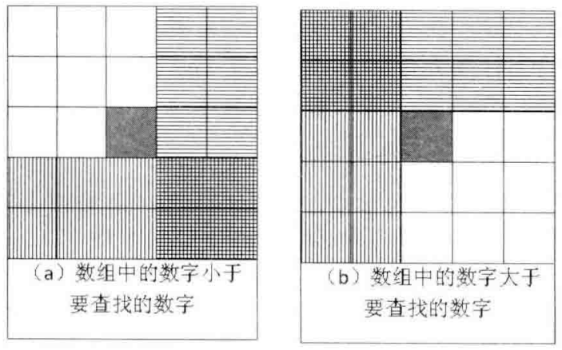
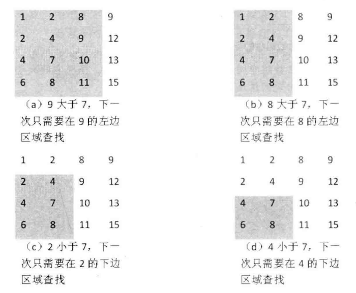
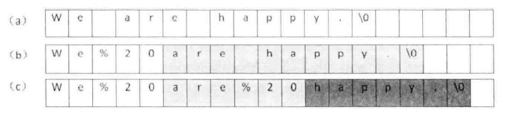
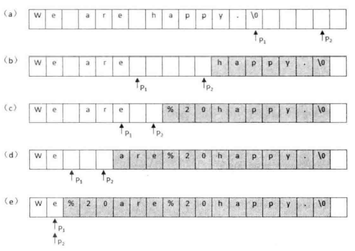
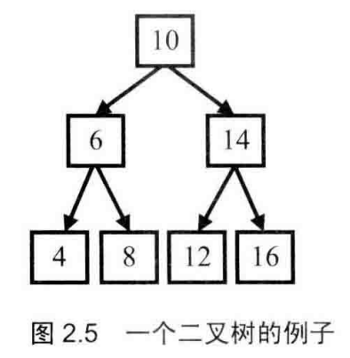

<<<<<<< HEAD
# 剑指OFFER

[TOC]

## 第一章 面试流程

## 第二章 基础知识

### 2.2 编程语言

#### 2.2.1 C++

##### ==**题01：赋值运算符函数**==

题目：如下为类型CMyString的声明，请为该类型添加赋值运算符函数

```c++
class CMyString
{
public:
    CMyString(char* pData = nullptr);
    CMyString(const CMyString& str);
    ~CMyString(void);
private:
    char* m_pData;
};
```

* **是否把返回值的类型声明为该类型的引用**，并在函数结束前返回实例自身的引用（*this）。只有返回1个引用，才可以允许连续赋值。否则，如果函数的返回值是void，则应用该赋值运算符将不能进行。
* **是否把传入的参数的类型声明为常量引用**。如果传入的参数不是引用而是实例，那么从形参到实参会调用一次复制构造函数。把参数声明为引用可以避免这样的无谓消耗，能提高代码的效率。同时，我们在赋值运算符函数内不会改变传入的实例的状态,因此应该为传入的引用参数加上 const 关键字。
* **是否释放实例自身已有的内存**。如果我们忘记在分配新内存之前释放自身已有的空间，则程序将出现内存泄漏。
* **判断传入的参数和当前的实例 (\*this) 是不是同一个实例**。如果是同一个，则不进行赋值操作，直接返回。如果事先不判断就进行赋值，那么在释放实例自身内存的时候就会导致严重的问题：：当\*this和传入的参数是同一个实例时，一旦释放了自身的内存，传入的参数的内存也同时被释放了，因此再也找不到需要赋值的内容了。

题目1示例代码：

```c++
#include <cstring>
#include <cstdio>
#include <iostream>
using namespace std;
class CMyString
{
public:
    CMyString(char* pData = nullptr);
    CMyString(const CMyString& str);
    ~CMyString(void);

    CMyString& operator = (const CMyString& str);

    void Print();
    
private:
    char* m_pData;
};

CMyString::CMyString(char *pData)
{
    if(pData == nullptr)
    {
        m_pData = new char[1];
        m_pData[0] = '\0';
    }
    else
    {
        int length = strlen(pData);
        m_pData = new char[length + 1];
        strcpy(m_pData, pData);
    }
}

CMyString::CMyString(const CMyString &str)
{
    int length = strlen(str.m_pData);
    m_pData = new char[length + 1];
    strcpy(m_pData, str.m_pData);
}

CMyString::~CMyString()
{
    delete[] m_pData;
}

CMyString& CMyString::operator = (const CMyString& str)
{
    if(this == &str)
        return *this;

    delete []m_pData;
    m_pData = nullptr;

    m_pData = new char[strlen(str.m_pData) + 1];
    strcpy(m_pData, str.m_pData);

    return *this;
}

// ====================测试代码====================
void CMyString::Print()
{
    printf("%s", m_pData);
}

void Test1()
{
    printf("Test1 begins:\n");

    char* text = "Hello world";

    CMyString str1(text);
    CMyString str2;
    str2 = str1;

    printf("The expected result is: %s.\n", text);

    printf("The actual result is: ");
    str2.Print();
    printf(".\n");
}

// 赋值给自己
void Test2()
{
    printf("Test2 begins:\n");

    char* text = "Hello world";

    CMyString str1(text);
    str1 = str1;

    printf("The expected result is: %s.\n", text);

    printf("The actual result is: ");
    str1.Print();
    printf(".\n");
}

// 连续赋值
void Test3()
{
    printf("Test3 begins:\n");

    char* text = "Hello world";

    CMyString str1(text);
    CMyString str2, str3;
    str3 = str2 = str1;

    printf("The expected result is: %s.\n", text);

    printf("The actual result is: ");
    str2.Print();
    printf(".\n");

    printf("The expected result is: %s.\n", text);

    printf("The actual result is: ");
    str3.Print();
    printf(".\n");
}

int main(int argc, char* argv[])
{
    Test1();
    Test2();
    Test3();
    system("pause");
    return 0;
}
```

- [ ] 如何理解 **==~CMyString(void)==** 

题目1经典解法：

```c++
CMyString& CMyString::operator = (const CMyString& str)
{
    if(this == &str)
        return *this;

    delete []m_pData;
    m_pData = nullptr;

    m_pData = new char[strlen(str.m_pData) + 1];
    strcpy(m_pData, str.m_pData);

    return *this;
}
```

题目1考虑异常安全性解法：

```c++
CMyString& CMyString::operator = (const CMyString& str)
{
    if(this != &str)
    {
        CMyString strTemp(str);
        
        char *pTemp = strTemp.m_pData;
        strTemp.m_pData = m_pData;
        m_pData = pTemp;
	}
    return *this;
}
```

#### 2.2.2 C#

##### ==**题02：实现Singleton模式**==

### 2.3 数据结构

#### 2.3.1 数组

数组可实现简单的哈希表：把数组的下标设为哈希表的键值（key），而把数组中的每一个数字设为哈希表的值（value），这样每一个下标及数组中该下标对应的数字就组成了一个“键值—键”的配对。例：==试题50“第一个只出现一次的字符”==。

动态数组（vector）。每次扩容有额外操作，对时间有负面影响。

```c++
int getsize(int data[])
{
    return sizeof(data);
}
int main()
{
    int data1[] = {1, 2, 3, 4, 5};
    int size1 = sizeof(data1);
    int *data2 = data1;
    int size2 = sizeof(data2);
    int size3 = GetSize(data1);
    
    cout << size1 << size2 << size3 << endl;
}
```

代码输出为 “20，4，4”。data1 为一个数组，sizeof(data1) 是求数组的大小。data2为指针。在c++中，**当数组作为函数的参数进行传递时，数组就会自动退化为同类型的指针**。因此，尽管函数 GetSize 的参数 data 被声明为数组，但它会退化为指针，size3的结果仍然是4。

##### ==**题03：数组中重复数字**==

找出数组中的重复数字。

题目：在一个长度为n的数组里的所有数字都在 0～n-1 的范围内。数组中某些数字是重复的，但不知道有几个数字重复了，也不知道每个数字重复了几次。请找出数组中任意一个重复的数字。例如，如果输入长度为 7 的数组{2,3,1,0,2,5,3}，那么对应的输出是重复的数字2或者3。

* 解决这个问题的一个简单的方法是先把输入的数组排序。从排序的数组中找出重复的数字是一件很容易的事情，只需要从头到尾扫描排序后的数组就可以了。排序一个长度为n的数组需要 O(nlogn) 的时间。
* 还可以利用哈希表来解决这个问题。从头到尾按顺序扫描数组的每个数字，每扫描到一个数字的时候，都可以用 O(1) 的时间来判断哈希表里是否已经包含了该数字。如果哈希表里还没有这个数字，就把它加入哈希表。如果哈希表里已经存在该数字，就找到一个重复的数字。这个算法的时间复杂度是 O(n) ，但它提高时间效率是以一个大小为 O(n) 的哈希表为代价的。我们再看看有没有空间复杂度是 O(1) 的算法。

​	题3a示例代码：

```c++
#include <cstdio>

// 参数:
//        numbers:     一个整数数组
//        length:      数组的长度
//        duplication: (输出) 数组中的一个重复的数字
// 返回值:             
//        true  - 输入有效，并且数组中存在重复的数字
//        false - 输入无效，或者数组中没有重复的数字
bool duplicate(int numbers[], int length, int* duplication)
{
    if(numbers == nullptr || length <= 0)
    {
        return false;
    }
    for(int i = 0; i < length; ++i)
    {
        if(numbers[i] < 0 || numbers[i] > length - 1)
            {
                return false;
            }
    }

    for(int i = 0; i < length; ++i)
    {
        while(numbers[i] != i)
        {
            if(numbers[i] == numbers[numbers[i]])
            {
                *duplication = numbers[i];
                return true;
            }

            // 交换numbers[i]和numbers[numbers[i]]
            int temp = numbers[i];
            numbers[i] = numbers[temp];
            numbers[temp] = temp;
        }
    }

    return false;
}

// ====================测试代码====================
bool contains(int array[], int length, int number)
{
    for(int i = 0; i < length; ++i)
    {
        if(array[i] == number)
            return true;
    }

    return false;
}

void test(char* testName, int numbers[], int lengthNumbers, int expected[], int expectedExpected, bool validArgument)
{
    printf("%s begins: ", testName);

    int duplication;
    bool validInput = duplicate(numbers, lengthNumbers, &duplication);

    if(validArgument == validInput)
    {
        if(validArgument)
        {
            if(contains(expected, expectedExpected, duplication))
                printf("Passed.\n");
            else
            printf("FAILED.\n");
        }
        else
            printf("Passed.\n");
    }
    else
        printf("FAILED.\n");
}

// 重复的数字是数组中最小的数字
void test1()
{
    int numbers[] = { 2, 1, 3, 1, 4 };
    int duplications[] = { 1 };
    test("Test1", numbers, sizeof(numbers) / sizeof(int), duplications, sizeof(duplications) / sizeof(int), true);
}

// 重复的数字是数组中最大的数字
void test2()
{
    int numbers[] = { 2, 4, 3, 1, 4 };
    int duplications[] = { 4 };
    test("Test2", numbers, sizeof(numbers) / sizeof(int), duplications, sizeof(duplications) / sizeof(int), true);
}

// 数组中存在多个重复的数字
void test3()
{
    int numbers[] = { 2, 4, 2, 1, 4 };
    int duplications[] = { 2, 4 };
    test("Test3", numbers, sizeof(numbers) / sizeof(int), duplications, sizeof(duplications) / sizeof(int), true);
}

// 没有重复的数字
void test4()
{
    int numbers[] = { 2, 1, 3, 0, 4 };
    int duplications[] = { -1 }; // not in use in the test function
    test("Test4", numbers, sizeof(numbers) / sizeof(int), duplications, sizeof(duplications) / sizeof(int), false);
}

// 没有重复的数字
void test5()
{
    int numbers[] = { 2, 1, 3, 5, 4 };
    int duplications[] = { -1 }; // not in use in the test function
    test("Test5", numbers, sizeof(numbers) / sizeof(int), duplications, sizeof(duplications) / sizeof(int), false);
}

// 无效的输入
void test6()
{
    int* numbers = nullptr;
    int duplications[] = { -1 }; // not in use in the test function
    test("Test6", numbers, 0, duplications, sizeof(duplications) / sizeof(int), false);
}

void main()
{
    test1();
    test2();
    test3();
    test4();
    test5();
    test6();
}
```

题目：不修改数组找出重复的数字

找出重复数字

在一个长度为n+1的数组里的所有数字都在1~n的范围内，所以数组中至少有一个数字是重复的。请找出数组中任意一个重复的数字，但不能修改输入的数组。例如，如果输入长度为8的数组{2,3,5,4,3,2,6,7}，那么对应的输出是重复的数字2或者3。

* 避免使用 O(n) 辅助空间。

  接下来我们尝试避免使用 O(n) 的辅助空间。为什么数组中会有重复的数字？假如没有重复的数字，那么在从 1～n 的范围里只有 n 个数字。由于数组里包含超过 n 个数字，所以一定包含了重复的数字。看起来在某范围里数字的个数对解决这个问题很重要。

* 利用二分法

​	题3b示例代码：

```c++
int getDuplication(const int* numbers, int length)
{
    if(numbers == nullptr || length <= 0)
        return -1;

    int start = 1;
    int end = length - 1;
    while(end >= start)
    {
        int middle = ((end - start) >> 1) + start;
        int count = countRange(numbers, length, start, middle);
        if(end == start)
        {
            if(count > 1)
                return start;
            else
                break;
        }

        if(count > (middle - start + 1))
            end = middle;
        else
            start = middle + 1;
    }
    return -1;
}

int countRange(const int* numbers, int length, int start, int end)
{
    if(numbers == nullptr)
        return 0;

    int count = 0;
    for(int i = 0; i < length; i++)
        if(numbers[i] >= start && numbers[i] <= end)
            ++count;
    return count;
}
```

##### ==**题04：二维数组中的查找**==

题目：在一个二维数组中，每一行都按照从左到石递增的顺序排序，每一列都按照从上到下递增的顺序排序。请完成一个函数，输入这样的个二维数组和一个整数，判断数组中是否含有该整数。





以右上角为基准，进行比较

题 4 示例代码：

```c++
bool Find(int* matrix, int rows, int columns, int number)
{
    bool found = false;

    if(matrix != nullptr && rows > 0 && columns > 0)
    {
        int row = 0;
        int column = columns - 1;
        while(row < rows && column >=0)
        {
            if(matrix[row * columns + column] == number)
            {
                found = true;
                break;
            }
            else if(matrix[row * columns + column] > number)
                -- column;
            else
                ++ row;
        }
    }

    return found;
}
```

同样可以以左下角为基准，但是不能以左上角或右下角为基准，无法缩小检查范围。

#### 2.3.2 字符串

##### ==**题05：替换空格**==

题目：请实现一个函数，把字符串中每个空格替换成“%20”。例如输入“We are happy.”，则输出“We%20are%20happy.”。

看到这个题目，我们首先应该想到的是原来一个空格字符，替换之后变成"%'、'2'和'0'这 3 个字符，因此字符串会变长。如果是在原来的字符串上进行替换，就有可能覆盖修改在该字符串后面的内存。如果是创建新的字符串并在新的字符串上进行替换，那么我们可以自己分配足够多的内存。由于有两种不同的解决方案，我们应该向面试官问清楚，让他明确告诉我们他的需求。假设面试官让我们在原来的字符串上进行替换，并且保证输入的字符串后面有足够多的空余内存。

* 时间复杂度为 O(n^2^)的解法

  

* 时间复杂度为 O(n)的解法

  

```c++
void ReplaceBlank(char str[], int length)
{
    if(str == nullptr && length <= 0)
        return;

    /*originalLength 为字符串str的实际长度*/
    int originalLength = 0;
    int numberOfBlank = 0;
    int i = 0;
    while(str[i] != '\0')
    {
        ++ originalLength;

        if(str[i] == ' ')
            ++ numberOfBlank;

        ++ i;
    }

    /*newLength 为把空格替换成'%20'之后的长度*/
    int newLength = originalLength + numberOfBlank * 2;
    if(newLength > length)
        return;

    int indexOfOriginal = originalLength;
    int indexOfNew = newLength;
    while(indexOfOriginal >= 0 && indexOfNew > indexOfOriginal)
    {
        if(str[indexOfOriginal] == ' ')
        {
            str[indexOfNew --] = '0';
            str[indexOfNew --] = '2';
            str[indexOfNew --] = '%';
        }
        else
        {
            str[indexOfNew --] = str[indexOfOriginal];
        }

        -- indexOfOriginal;
    }
}
```

#### 2.3.3 链表

如果单向链表的节点定义如下：

```c++
struct ListNode
{
    int m_nValue;
    ListNode *m_pNext;
}
```

那么往该链表的末尾添加一个节点的C++代码如下：

```c++
void AddToTail(ListNode **pHead, int value)
{
    ListNode *pNew = new ListNode();
    pNew->m_nValue = value;
    pNew->m_Next = nullptr;
    
    if(*pHead == nullptr)
    {
        *pHead = pNew;
    }
    else
    {
        ListNode *pNode = *pHead;
        while(pNode->m_pNext != nullptr)
        {
            pNode = pNode->m_pNext;
		}
        pNode->m_pNext = pNew;
	}
}
```

##### ==**题06：从尾到头打印链表**==

题目：输入一个链表的头节点，从尾到头反过来打印出每个结点的值。链表节点定义如下：

```c++
struct ListNode
{
    int m_nKey;
    ListNode *m_pNext;
};
```

从尾到头输出为栈操作

使用循环实现：

```c++
void PrintListReversingly_Iteratively(ListNode* pHead)
{
    std::stack<ListNode*> nodes;

    ListNode* pNode = pHead;
    while(pNode != nullptr)
    {
        nodes.push(pNode);
        pNode = pNode->m_pNext;
    }

    while(!nodes.empty())
    {
        pNode = nodes.top();
        printf("%d\t", pNode->m_nValue);
        nodes.pop();
    }
}
```

使用递归实现：

```c++
void PrintListReversingly_Recursively(ListNode* pHead)
{
    if(pHead != nullptr)
    {
        if (pHead->m_pNext != nullptr)
        {
            PrintListReversingly_Recursively(pHead->m_pNext);
        }
 
        printf("%d\t", pHead->m_nValue);
    }
}
```

#### 2.3.4

树是一种在实际编程中经常遇到的数据结构。它的逻辑很简单：除根节点之外每个节点只有一个父节点，根节点没有父节点；除叶节点之外所有节点都有一个或多个子节点，叶节点没有子节点。父节点和子节点之间用指针链接。

在二叉树中最重要的操作莫过于遍历，即按照某一顺序访问树中的所有节点。通常树有如下几种遍历方式。

* 前序遍历：先访问根节点，再访问左子节点，最后访问右子节点。图2.5中的二叉树的前序遍历的顺序是10、6、4、8、14、12、16。
* 中序遍历：先访问左子节点，再访问根节点，最后访问右子节点。图 2.5 中的二叉树的中序遍历的顺序是 4、6、8、10、12、14、16。
* 后序遍历：先访问左子节点，再访问右子节点，最后访问根节点。图2.5中的二叉树的后序遍历的顺序是4、8、6、12、16、14、10。



##### ==**题07：重建二叉树**==

题目：输入某二叉树的前序遍历和中序遍历的结果，请重建该二叉树。假设输入的前序遍历和中序遍历的结果中都不含重复的数字。例如，输入前序遍历序列{1,2,4,7,3,5,6,8}和中序遍历序列{4,7,2,1,5,3,8,6}，则重建如图 2.6 所示的二叉树并输出它的头节点。二叉树节点的定义如下：

```c++
struct BinaryTreeNode
{
    int m_nValue;
    BinaryTreeNode* m_pLeft;
    
}
```

=======
# 剑指OFFER

[TOC]

## 第一章 面试流程

## 第二章 基础知识

### 2.2 编程语言

#### 2.2.1 C++

##### ==**题01：赋值运算符函数**==

题目：如下为类型CMyString的声明，请为该类型添加赋值运算符函数

```c++
class CMyString
{
public:
    CMyString(char* pData = nullptr);
    CMyString(const CMyString& str);
    ~CMyString(void);
private:
    char* m_pData;
};
```

* **是否把返回值的类型声明为该类型的引用**，并在函数结束前返回实例自身的引用（*this）。只有返回1个引用，才可以允许连续赋值。否则，如果函数的返回值是void，则应用该赋值运算符将不能进行。
* **是否把传入的参数的类型声明为常量引用**。如果传入的参数不是引用而是实例，那么从形参到实参会调用一次复制构造函数。把参数声明为引用可以避免这样的无谓消耗，能提高代码的效率。同时，我们在赋值运算符函数内不会改变传入的实例的状态,因此应该为传入的引用参数加上 const 关键字。
* **是否释放实例自身已有的内存**。如果我们忘记在分配新内存之前释放自身已有的空间，则程序将出现内存泄漏。
* **判断传入的参数和当前的实例 (\*this) 是不是同一个实例**。如果是同一个，则不进行赋值操作，直接返回。如果事先不判断就进行赋值，那么在释放实例自身内存的时候就会导致严重的问题：：当\*this和传入的参数是同一个实例时，一旦释放了自身的内存，传入的参数的内存也同时被释放了，因此再也找不到需要赋值的内容了。

题目1示例代码：

```c++
#include <cstring>
#include <cstdio>
#include <iostream>
using namespace std;
class CMyString
{
public:
    CMyString(char* pData = nullptr);
    CMyString(const CMyString& str);
    ~CMyString(void);

    CMyString& operator = (const CMyString& str);

    void Print();
    
private:
    char* m_pData;
};

CMyString::CMyString(char *pData)
{
    if(pData == nullptr)
    {
        m_pData = new char[1];
        m_pData[0] = '\0';
    }
    else
    {
        int length = strlen(pData);
        m_pData = new char[length + 1];
        strcpy(m_pData, pData);
    }
}

CMyString::CMyString(const CMyString &str)
{
    int length = strlen(str.m_pData);
    m_pData = new char[length + 1];
    strcpy(m_pData, str.m_pData);
}

CMyString::~CMyString()
{
    delete[] m_pData;
}

CMyString& CMyString::operator = (const CMyString& str)
{
    if(this == &str)
        return *this;

    delete []m_pData;
    m_pData = nullptr;

    m_pData = new char[strlen(str.m_pData) + 1];
    strcpy(m_pData, str.m_pData);

    return *this;
}

// ====================测试代码====================
void CMyString::Print()
{
    printf("%s", m_pData);
}

void Test1()
{
    printf("Test1 begins:\n");

    char* text = "Hello world";

    CMyString str1(text);
    CMyString str2;
    str2 = str1;

    printf("The expected result is: %s.\n", text);

    printf("The actual result is: ");
    str2.Print();
    printf(".\n");
}

// 赋值给自己
void Test2()
{
    printf("Test2 begins:\n");

    char* text = "Hello world";

    CMyString str1(text);
    str1 = str1;

    printf("The expected result is: %s.\n", text);

    printf("The actual result is: ");
    str1.Print();
    printf(".\n");
}

// 连续赋值
void Test3()
{
    printf("Test3 begins:\n");

    char* text = "Hello world";

    CMyString str1(text);
    CMyString str2, str3;
    str3 = str2 = str1;

    printf("The expected result is: %s.\n", text);

    printf("The actual result is: ");
    str2.Print();
    printf(".\n");

    printf("The expected result is: %s.\n", text);

    printf("The actual result is: ");
    str3.Print();
    printf(".\n");
}

int main(int argc, char* argv[])
{
    Test1();
    Test2();
    Test3();
    system("pause");
    return 0;
}
```

- [ ] 如何理解 **==~CMyString(void)==** 

题目1经典解法：

```c++
CMyString& CMyString::operator = (const CMyString& str)
{
    if(this == &str)
        return *this;

    delete []m_pData;
    m_pData = nullptr;

    m_pData = new char[strlen(str.m_pData) + 1];
    strcpy(m_pData, str.m_pData);

    return *this;
}
```

题目1考虑异常安全性解法：

```c++
CMyString& CMyString::operator = (const CMyString& str)
{
    if(this != &str)
    {
        CMyString strTemp(str);
        
        char *pTemp = strTemp.m_pData;
        strTemp.m_pData = m_pData;
        m_pData = pTemp;
	}
    return *this;
}
```

#### 2.2.2 C#

##### ==**题02：实现Singleton模式**==

### 2.3 数据结构

#### 2.3.1 数组

数组可实现简单的哈希表：把数组的下标设为哈希表的键值（key），而把数组中的每一个数字设为哈希表的值（value），这样每一个下标及数组中该下标对应的数字就组成了一个“键值—键”的配对。例：==试题50“第一个只出现一次的字符”==。

动态数组（vector）。每次扩容有额外操作，对时间有负面影响。

```c++
int getsize(int data[])
{
    return sizeof(data);
}
int main()
{
    int data1[] = {1, 2, 3, 4, 5};
    int size1 = sizeof(data1);
    int *data2 = data1;
    int size2 = sizeof(data2);
    int size3 = GetSize(data1);
    
    cout << size1 << size2 << size3 << endl;
}
```

代码输出为 “20，4，4”。data1 为一个数组，sizeof(data1) 是求数组的大小。data2为指针。在c++中，**当数组作为函数的参数进行传递时，数组就会自动退化为同类型的指针**。因此，尽管函数 GetSize 的参数 data 被声明为数组，但它会退化为指针，size3的结果仍然是4。

##### ==**题03：数组中重复数字**==

找出数组中的重复数字。

题目：在一个长度为n的数组里的所有数字都在 0～n-1 的范围内。数组中某些数字是重复的，但不知道有几个数字重复了，也不知道每个数字重复了几次。请找出数组中任意一个重复的数字。例如，如果输入长度为 7 的数组{2,3,1,0,2,5,3}，那么对应的输出是重复的数字2或者3。

* 解决这个问题的一个简单的方法是先把输入的数组排序。从排序的数组中找出重复的数字是一件很容易的事情，只需要从头到尾扫描排序后的数组就可以了。排序一个长度为n的数组需要 O(nlogn) 的时间。
* 还可以利用哈希表来解决这个问题。从头到尾按顺序扫描数组的每个数字，每扫描到一个数字的时候，都可以用 O(1) 的时间来判断哈希表里是否已经包含了该数字。如果哈希表里还没有这个数字，就把它加入哈希表。如果哈希表里已经存在该数字，就找到一个重复的数字。这个算法的时间复杂度是 O(n) ，但它提高时间效率是以一个大小为 O(n) 的哈希表为代价的。我们再看看有没有空间复杂度是 O(1) 的算法。

​	题3a示例代码：

```c++
#include <cstdio>

// 参数:
//        numbers:     一个整数数组
//        length:      数组的长度
//        duplication: (输出) 数组中的一个重复的数字
// 返回值:             
//        true  - 输入有效，并且数组中存在重复的数字
//        false - 输入无效，或者数组中没有重复的数字
bool duplicate(int numbers[], int length, int* duplication)
{
    if(numbers == nullptr || length <= 0)
    {
        return false;
    }
    for(int i = 0; i < length; ++i)
    {
        if(numbers[i] < 0 || numbers[i] > length - 1)
            {
                return false;
            }
    }

    for(int i = 0; i < length; ++i)
    {
        while(numbers[i] != i)
        {
            if(numbers[i] == numbers[numbers[i]])
            {
                *duplication = numbers[i];
                return true;
            }

            // 交换numbers[i]和numbers[numbers[i]]
            int temp = numbers[i];
            numbers[i] = numbers[temp];
            numbers[temp] = temp;
        }
    }

    return false;
}

// ====================测试代码====================
bool contains(int array[], int length, int number)
{
    for(int i = 0; i < length; ++i)
    {
        if(array[i] == number)
            return true;
    }

    return false;
}

void test(char* testName, int numbers[], int lengthNumbers, int expected[], int expectedExpected, bool validArgument)
{
    printf("%s begins: ", testName);

    int duplication;
    bool validInput = duplicate(numbers, lengthNumbers, &duplication);

    if(validArgument == validInput)
    {
        if(validArgument)
        {
            if(contains(expected, expectedExpected, duplication))
                printf("Passed.\n");
            else
            printf("FAILED.\n");
        }
        else
            printf("Passed.\n");
    }
    else
        printf("FAILED.\n");
}

// 重复的数字是数组中最小的数字
void test1()
{
    int numbers[] = { 2, 1, 3, 1, 4 };
    int duplications[] = { 1 };
    test("Test1", numbers, sizeof(numbers) / sizeof(int), duplications, sizeof(duplications) / sizeof(int), true);
}

// 重复的数字是数组中最大的数字
void test2()
{
    int numbers[] = { 2, 4, 3, 1, 4 };
    int duplications[] = { 4 };
    test("Test2", numbers, sizeof(numbers) / sizeof(int), duplications, sizeof(duplications) / sizeof(int), true);
}

// 数组中存在多个重复的数字
void test3()
{
    int numbers[] = { 2, 4, 2, 1, 4 };
    int duplications[] = { 2, 4 };
    test("Test3", numbers, sizeof(numbers) / sizeof(int), duplications, sizeof(duplications) / sizeof(int), true);
}

// 没有重复的数字
void test4()
{
    int numbers[] = { 2, 1, 3, 0, 4 };
    int duplications[] = { -1 }; // not in use in the test function
    test("Test4", numbers, sizeof(numbers) / sizeof(int), duplications, sizeof(duplications) / sizeof(int), false);
}

// 没有重复的数字
void test5()
{
    int numbers[] = { 2, 1, 3, 5, 4 };
    int duplications[] = { -1 }; // not in use in the test function
    test("Test5", numbers, sizeof(numbers) / sizeof(int), duplications, sizeof(duplications) / sizeof(int), false);
}

// 无效的输入
void test6()
{
    int* numbers = nullptr;
    int duplications[] = { -1 }; // not in use in the test function
    test("Test6", numbers, 0, duplications, sizeof(duplications) / sizeof(int), false);
}

void main()
{
    test1();
    test2();
    test3();
    test4();
    test5();
    test6();
}
```

题目：不修改数组找出重复的数字

找出重复数字

在一个长度为n+1的数组里的所有数字都在1~n的范围内，所以数组中至少有一个数字是重复的。请找出数组中任意一个重复的数字，但不能修改输入的数组。例如，如果输入长度为8的数组{2,3,5,4,3,2,6,7}，那么对应的输出是重复的数字2或者3。

* 避免使用 O(n) 辅助空间。

  接下来我们尝试避免使用 O(n) 的辅助空间。为什么数组中会有重复的数字？假如没有重复的数字，那么在从 1～n 的范围里只有 n 个数字。由于数组里包含超过 n 个数字，所以一定包含了重复的数字。看起来在某范围里数字的个数对解决这个问题很重要。

* 利用二分法

​	题3b示例代码：

```c++
int getDuplication(const int* numbers, int length)
{
    if(numbers == nullptr || length <= 0)
        return -1;

    int start = 1;
    int end = length - 1;
    while(end >= start)
    {
        int middle = ((end - start) >> 1) + start;
        int count = countRange(numbers, length, start, middle);
        if(end == start)
        {
            if(count > 1)
                return start;
            else
                break;
        }

        if(count > (middle - start + 1))
            end = middle;
        else
            start = middle + 1;
    }
    return -1;
}

int countRange(const int* numbers, int length, int start, int end)
{
    if(numbers == nullptr)
        return 0;

    int count = 0;
    for(int i = 0; i < length; i++)
        if(numbers[i] >= start && numbers[i] <= end)
            ++count;
    return count;
}
```

##### ==**题04：二维数组中的查找**==

题目：在一个二维数组中，每一行都按照从左到石递增的顺序排序，每一列都按照从上到下递增的顺序排序。请完成一个函数，输入这样的个二维数组和一个整数，判断数组中是否含有该整数。


以右上角为基准，进行比较

题 4 示例代码：

```c++
bool Find(int* matrix, int rows, int columns, int number)
{
    bool found = false;

    if(matrix != nullptr && rows > 0 && columns > 0)
    {
        int row = 0;
        int column = columns - 1;
        while(row < rows && column >=0)
        {
            if(matrix[row * columns + column] == number)
            {
                found = true;
                break;
            }
            else if(matrix[row * columns + column] > number)
                -- column;
            else
                ++ row;
        }
    }

    return found;
}
```

同样可以以左下角为基准，但是不能以左上角或右下角为基准，无法缩小检查范围。

#### 2.3.2 字符串

##### ==**题05：替换空格**==

题目：请实现一个函数，把字符串中每个空格替换成“%20”。例如输入“We are happy.”，则输出“We%20are%20happy.”。

看到这个题目，我们首先应该想到的是原来一个空格字符，替换之后变成"%'、'2'和'0'这 3 个字符，因此字符串会变长。如果是在原来的字符串上进行替换，就有可能覆盖修改在该字符串后面的内存。如果是创建新的字符串并在新的字符串上进行替换，那么我们可以自己分配足够多的内存。由于有两种不同的解决方案，我们应该向面试官问清楚，让他明确告诉我们他的需求。假设面试官让我们在原来的字符串上进行替换，并且保证输入的字符串后面有足够多的空余内存。

* 时间复杂度为 O(n^2^)的解法

  

* 时间复杂度为 O(n)的解法

  

```c++
void ReplaceBlank(char str[], int length)
{
    if(str == nullptr && length <= 0)
        return;

    /*originalLength 为字符串str的实际长度*/
    int originalLength = 0;
    int numberOfBlank = 0;
    int i = 0;
    while(str[i] != '\0')
    {
        ++ originalLength;

        if(str[i] == ' ')
            ++ numberOfBlank;

        ++ i;
    }

    /*newLength 为把空格替换成'%20'之后的长度*/
    int newLength = originalLength + numberOfBlank * 2;
    if(newLength > length)
        return;

    int indexOfOriginal = originalLength;
    int indexOfNew = newLength;
    while(indexOfOriginal >= 0 && indexOfNew > indexOfOriginal)
    {
        if(str[indexOfOriginal] == ' ')
        {
            str[indexOfNew --] = '0';
            str[indexOfNew --] = '2';
            str[indexOfNew --] = '%';
        }
        else
        {
            str[indexOfNew --] = str[indexOfOriginal];
        }

        -- indexOfOriginal;
    }
}
```

#### 2.3.3 链表

如果单向链表的节点定义如下：

```c++
struct ListNode
{
    int m_nValue;
    ListNode *m_pNext;
}
```

那么往该链表的末尾添加一个节点的C++代码如下：

```c++
void AddToTail(ListNode **pHead, int value)
{
    ListNode *pNew = new ListNode();
    pNew->m_nValue = value;
    pNew->m_Next = nullptr;
    
    if(*pHead == nullptr)
    {
        *pHead = pNew;
    }
    else
    {
        ListNode *pNode = *pHead;
        while(pNode->m_pNext != nullptr)
        {
            pNode = pNode->m_pNext;
		}
        pNode->m_pNext = pNew;
	}
}
```

##### ==**题06：从尾到头打印链表**==

题目：输入一个链表的头节点，从尾到头反过来打印出每个结点的值。链表节点定义如下：

```c++
struct ListNode
{
    int m_nKey;
    ListNode *m_pNext;
};
```

从尾到头输出为栈操作

使用循环实现：

```c++
void PrintListReversingly_Iteratively(ListNode* pHead)
{
    std::stack<ListNode*> nodes;

    ListNode* pNode = pHead;
    while(pNode != nullptr)
    {
        nodes.push(pNode);
        pNode = pNode->m_pNext;
    }

    while(!nodes.empty())
    {
        pNode = nodes.top();
        printf("%d\t", pNode->m_nValue);
        nodes.pop();
    }
}
```

使用递归实现：

```c++
void PrintListReversingly_Recursively(ListNode* pHead)
{
    if(pHead != nullptr)
    {
        if (pHead->m_pNext != nullptr)
        {
            PrintListReversingly_Recursively(pHead->m_pNext);
        }
 
        printf("%d\t", pHead->m_nValue);
    }
}
```

#### 2.3.4

树是一种在实际编程中经常遇到的数据结构。它的逻辑很简单：除根节点之外每个节点只有一个父节点，根节点没有父节点；除叶节点之外所有节点都有一个或多个子节点，叶节点没有子节点。父节点和子节点之间用指针链接。

在二叉树中最重要的操作莫过于遍历，即按照某一顺序访问树中的所有节点。通常树有如下几种遍历方式。

* 前序遍历：先访问根节点，再访问左子节点，最后访问右子节点。图2.5中的二叉树的前序遍历的顺序是10、6、4、8、14、12、16。
* 中序遍历：先访问左子节点，再访问根节点，最后访问右子节点。图 2.5 中的二叉树的中序遍历的顺序是 4、6、8、10、12、14、16。
* 后序遍历：先访问左子节点，再访问右子节点，最后访问根节点。图2.5中的二叉树的后序遍历的顺序是4、8、6、12、16、14、10。


##### ==**题07：重建二叉树**==

题目：输入某二叉树的前序遍历和中序遍历的结果，请重建该二叉树。假设输入的前序遍历和中序遍历的结果中都不含重复的数字。例如，输入前序遍历序列{1,2,4,7,3,5,6,8}和中序遍历序列{4,7,2,1,5,3,8,6}，则重建如图 2.6 所示的二叉树并输出它的头节点。二叉树节点的定义如下：

```c++
struct BinaryTreeNode
{
    int m_nValue;
    BinaryTreeNode* m_pLeft;
    
}
```

>>>>>>> 90ec3a4511a0cdf137e7775c31d0a4e371431fa6
