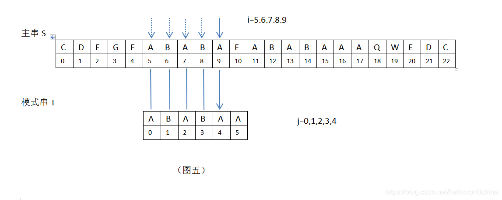
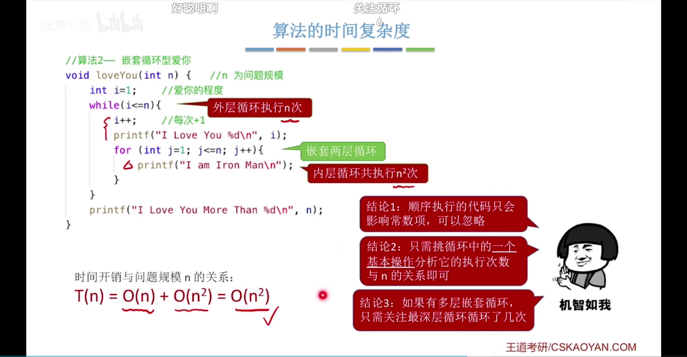

# 数据结构

## 第零章 STL函数与算法

### 0.1 判断函数

`isalnum()`	判断字符变量是否为字母或数字

`isalpha()`	判断字符变量是否为英文字母

`isdigit()`	判断字符变量是否为十进制数字字符

`islower()`    判断字符变量是否为小写字母

`isupper()`    判断字符变量是否为大写字母

### 0.2 类型转换

`to_string`	将数字常量转换为字符串

`stoi(a, 0, c)`	将字符串转换为整型数(将c进制数转换为10进制数)

`toupper()`	将小写转化为大写

### 0.3 字符串

`s.substr(pos, n)`	截取 s 中从 pos 开始（包括 0）的 n 个字符的子串，并返回

 `s.substr (pos)`	截取 s 中从从 pos 开始（包括 0）到末尾的所有字符的子串，并返回

`s.append(str2)`	添加另一个完整的字符串

`s.append (str2, 11, 7)`	添加另一个字符串的某一段

`s.append (5, '.')`	添加几个相同的字符

`str.erase(remove(str.begin(), str.end(), 'a'), str.end());`    移除指定字符

`str.compare(a, b, str2, c, d)`	比较str1指定字串与str2指定字串是否相等，`a`, `b`, `c`, `d`均可省略

### 0.4 位运算

| 符号 |   规则   |
| :--: | :------: |
|  &   |  按位与  |
|  \|  |  按位或  |
|  ^   | 按位异或 |
|  ~   |   取反   |
|  <<  |   左移   |
|  >>  |   右移   |

1. 按位与

   运算规则：$0\&0=0;\quad0\&1=0;\quad1\&0=0;\quad1\&1=1$

2. 按位或

   运算规则：$0|0=0; \quad0|1=1; \quad1|0=1; \quad1|1=1$

3. 按位异或

   运算规则：$0 \wedge{} 0=0; \quad 0 \wedge{} 1=1 ;\quad 1\wedge{} 0=1;  \quad1\wedge{}1=0$

   应用：给出 n 个整数，n 为奇数，其中有且仅有一个数出现了奇数次，其余的数都出现了偶数次。用线性时间复杂度、常数空间复杂度找出出现了奇数次的那个数。

4. 按位取反

5. 按位左移

   相当于该数 x2

6. 按位右移

   相当于该数 / 2

### 0.5 vector()

==最大值==：

`int max = *max_element(v.begin(),v.end());`

==最小值==：

`int min = *min_element(v.begin(),v.end());`

==第k小元素==：

`nth_element()`

`nth_element(a,a+k,a+n)`

函数只是把下标为k的元素放在了正确位置，对其它元素并没有排序，当然k左边元素都⼩于等于它，右边元素都⼤于等于它，所以可以利⽤这个函数快速定位某个元素

==满足指定条件的元素数目==：

`count_if(vec.begin(), vec.end(), cmp)`

==去除容器中相邻元素的重复元素== :  

`ModuleArr.erase(unique(ModuleArr.begin(), ModuleArr.end()), ModuleArr.end());`

### 0.6 二进制相关

`__builtin_popcount()`  计算二进制数中1的个数

### 0.7 普通运算相关

`accumulate(vec.begin() , vec.end() , 42);`	累加运算

### 0.8 二分查找

`lower_bound(begin,end,num)`	从数组的 begin 位置到 end-1 位置二分查找第一个大于或等于 num 的数字，找到返回该数字的地址，不存在则返回 end。通过返回的地址减去起始地址 begin, 得到找到数字在数组中的下标。

`upper_bound(begin,end,num)`	从数组的 begin 位置到 end-1 位置二分查找第一个大于 num 的数字，找到返回该数字的地址，不存在则返回 end。通过返回的地址减去起始地址 begin, 得到找到数字在数组中的下标。

### 0.9 随机数

`srand((unsigned)time(NULL))` 初始化，选取种子文件

`rand()` 调用随机数

### 0.10 构造函数

#### 单冒号初始化

```c++
class A
{
public:
	A();
	~A();
	int a;
	const int b;
}
// 使用:初始化a为1，b为2	
A::A():a(1),b(2)
{
}
```

### 0.11 优先队列/大顶堆小顶堆

priority_queue<>

* 大顶堆：`priority_queue<int> pq;`

* 小顶堆：`priority_queue<int, vector<int>, greater<int>> pq;`

make_heap()

* 大顶堆：`make_heap(iter_first，iter_last)`
* 小顶堆：`make_heap(iter_first，iter_last, greater)`
* 插入元素(新元素已置于容器末尾)：`push_heap(iter_first，iter_last, cmp)`
* 弹出元素(将堆顶元素移至所给范围最后)：`pop_heap(iter_first，iter_last)`

### 0.12 数学

`gcd(a, b)` 求最大公约数

`ceil()` 返回大于等于指定表达式的最小整数

`max({1, 2, 3})` 返回多个数的最大值

### 0.13 Lambda表达式

`[caoture] (params) opt -> ret {body;};`

>  capture 是捕获列表；params 是参数表；opt 是函数选项；ret 是返回值类型；body 是函数体
>
>  1. ==[capture]==：捕捉列表。捕捉列表总是出现在 Lambda 函数的开始处。实际上，[] 是 Lambda 引出符。编译器根据该引出符判断接下来的代码是否是 Lambda 函数。捕捉列表能够捕捉上下文中的变量以供 Lambda 函数使用；
>
>       * [] 不捕获任何变量
>
>       * [&] 捕获外部作用域中所有变量，并作为引用在函数体中使用（按引用捕获）
>
>       * [=] 捕获外部作用域中所有变量，并作为副本在函数体中使用（按值捕获）
>
>       * [=,&foo] 按值捕获外部作用域中所有变量，并按引用获取 foo 变量
>
>       * [bar] 按值捕获 bar 变量，同时不捕获其他变量
>
>       * [this] 捕获当前类中的 this 指针，让 lambda 表达式拥有和当前类成员同样的访问权限，如果已经使用了 & 或者 =，就默认添加此选项，捕获 this 的目的是可以在 lambda 中使用当前类的成员函数和成员变量
>
>  2. ==(params)==：参数列表。与普通函数的参数列表一致。如果不需要参数传递，则可以连同括号 “()” 一起省略；
>  3. ==opt== :  mutable 修饰符。默认情况下，Lambda 函数总是一个 const 函数，mutable 可以取消其常量性。在使用该修饰符时，参数列表不可省略（即使参数为空）;
>  4. ==-> ret==：返回类型。用追踪返回类型形式声明函数的返回类型。我们可以在不需要返回值的时候也可以连同符号”->” 一起省略。此外，在返回类型明确的情况下，也可以省略该部分，让编译器对返回类型进行推导；
>  5. =={body;}==：函数体。内容与普通函数一样，不过除了可以使用参数之外，还可以使用所有捕获的变量。

### 0.14 KMP算法

KMP算法由D.E.Knuth，J.H.Morris和V.R.Pratt三位大牛于1977年联合发表提出的，因此人们称它为克努特—莫里斯—普拉特操作（简称KMP算法），KMP算法可以在O(n+m)的时间复杂度以内完成字符串的匹配操作，其核心思想在于：当一趟匹配过程中出现字符不匹配时，不需要回溯主串的指针，而是利用已经得到的“部分匹配”，将模式串尽可能多地向右“滑动”一段距离，然后继续比较。

以下选取主串s = “CDFGFABABAFABABAAAQWEDC”，模式串t = “ABABAA”，为研究对象，进行讲解KMP.

**概念解释：**

* “前缀”和“后缀”：“前缀”指除了最后一个字符以外，一个字符串的全部头部组合；“后缀”指除了第一个字符以外，一个字符串的全部尾部组合。例如“ABCD”的前缀为[A, AB, ABC]，后缀为[BCD, CD, D].

* 最大公共前后缀：基于前缀，和后缀概念，在一个字符串中，最长的相同的前缀和后缀称为最长公共前后缀，有的称之为最长首尾串。

* Next[]数组：Next数组主要用来存放最大公共前后缀的长度值，此值定义为K值，即Next[]数组存储一组k值

* 举例说明：
  字符串"A"的前缀和后缀都为空，共有元素的长度为0；
  字符串"AB"的前缀为[A]，后缀为[B]，无共有元素，长度为0；
  字符串"ABA"的前缀为[A, AB]，后缀为[BA, A]，共有元素"A",长度1；
  字符串"ABAB"的前缀为[A, AB, ABA]，后缀为[BAB, AB, B]，共有元素"AB",长度为2；
  字符串"ABABA"的前缀为[A, AB, ABA, ABAB]，后缀为[BABA, ABA, BA, A]，共有元素为"ABA"，长度为3；
  字符串"ABABAA"的前缀为[A, AB, ABA, ABAB, ABABA]，后缀为[BABAA, ABAA, BAA, AA, A]，共有元素为"A"，长度为1；
  综合以上，由字符串"A"、“AB”、“ABA”、“ABAB”、“ABABA”、“ABABAA"六个字符串组成的Next[]数组的值为：“001231”
  即Next[]={0,0,1,2,3,1} 。同理由字符串 "A"、“AB”、“ABC”、“ABCD”、“ABCDA”、“ABCDAB”、"ABCDABD"七个字符串组成的Next[]数组的值为：“0000120”
  即Next[]={0,0,0,0,1,2,0} 。

* 主串S和模式串T进行匹配时的起始位置：均为0；
  举例说明：
  

* 模式串下一匹配位：定义为k，即下一次匹配时，主串i不变，模式串的新j值为j=k,即S[i]与T[k]进行比较。

* K如何取值：k=next[j-1]，为何用next[j-1]标识，之所以这样是为了更好的理解，j-1的含义是当j=5，i=10，T[5]!=S[10]时，需要取模式串”ABABAA”的next[]数组的第j-1=4位的数组值，此时Next[]={0,0,1,2,3,1}"，在此next[]数组中，next[4]=3，即k=3。
  注:还可以用另一个方法计算k，模式串j前面（不包括j），即从位置0开始，到4(j-1=4)结束的字符串”ABABA”的最长公共前后缀为"ABA"，它的长度值为3，即k=3，如下图：

  

* 模式串T向右滑动的最大距离：定义为m，m=j-k（当j>0时，j为模式串的序号）

* 字符串模式匹配时存在的两种情况：
  1. 当模式串j=0时，即T[0]与主串S[i](https://blog.csdn.net/helloworldchina/article/details/i=0,1...)且T[0]!=S[i]时，主串S位置加1，T向右滑动1位，此时j=0，T[0]将与主串S[i](https://blog.csdn.net/helloworldchina/article/details/i=1,2...)继续比较。
  2. 当模式串j>0时，即T[j]与主串S[i](https://blog.csdn.net/helloworldchina/article/details/i=1,2...)且T[j]!=S[i]时，此时会用到KMP算法。

**举例演示：**

1. 初始时，i=0，j=0；S[0]=”C”，T[0]=”A”，S[i]!=T[j]，匹配失败，此时需要主串S位置加1，模式串T向右移动1位。
   

2. 当i=1,2,3,4时，均匹配失败；此时需要主串S位置加1，模式串T向右移动1位。
   
   

3. 当i=5,6,7,8,9，j=0,1,2,3,4时，匹配成功，此时主串S位置加1，模式串T位置加1位。

   

4. 当i=10，j=5时，匹配失败，S[10]=“F”， T[5]=“A”，S[10]!=T[5]，见下：

   

5. 在上图，i=10，j=5，接下来继续匹配时，需要主串中S[i]位置不变（i=10），模式串位置变为T[k]，现在需要求k值。根据公式k=next[j-1]，需要取模式串”ABABAA”的next[]数组的第j-1=5-1=4位的数组值，此时Next[]={0,0,1,2,3,1}"，在此next[]数组中，next[4]=3，即k=3（j前面字符串”ABABA”的最长公共前后缀为"ABA"，它的长度值为3，即k=3)；此时，根据KMP算法，i=10不变，模式串T向右滑动m=j-k=5-3=2位，模式串新的j值为j=k=3，见下：

   

6. 在上图，i=10，j=3，S[i]=S[10]=”F” ，T[j]=T[3]=”B”，S[10]!=T[3]，接下来继续匹配时，需要主串中S[i]位置不变（i=10），模式串位置变为T[k]，现在需要求k值。根据公式k=next[j-1]，需要取模式串”ABABAA”的next[]数组的第j-1=3-1=2位的数组值，此时Next[]={0,0,1,2,3,1}"，在此next[]数组中，next[2]=1，即k=1（j前面字符串”ABA”的最长公共前后缀为"A"，它的长度值为1，即k=1)；此时，根据KMP算法，i=10不变，模式串T向右滑动m=j-k=3-1=2位，模式串新的j值为j=k=1，见下：

   

7. 在上图，i=10，j=1，S[i]=S[10]=”F” ，T[j]=T[1]=”B”，S[10]!=T[1]，接下来继续匹配时，需要主串中S[i]位置不变（i=10），模式串位置变为T[k]，现在需要求k值。根据公式k=next[j-1]，需要取模式串”ABABAA”的next[]数组的第j-1=1-1=0位的数组值，此时Next[]={0,0,1,2,3,1}"，在此next[]数组中，next[0]=0，即k=0（j前面字符串”A”，无最长公共前后缀，它的长度值为0，即k=0)；此时，根据KMP算法，i=10不变，模式串T向右滑动m=j-k=1-0=1位，模式串新的j值为j=k=0，见下：

   

8. 在上图，i=10，j=0，S[i]=S[10]=”F” ，T[j]=T[0]=”A”，S[10]!=T[0]，这属于上面提到的字符串匹配时遇到的第一种情况，主串S位置加1，T向右滑动1位，继续比较；这样，i=11，j=0，见下：
   

接下来，当i=12,13,14,15,16，j=1,2,3,4,5，匹配成功，模式串T在主串中的位置为11。

#### 算法实现

主串：`sequence`

模式串：`word`

1. next数组：

   ```c++
   vector<int> kmpNext(Sring word)
   {
   	vector<int> next(word.size(), 0);
       for (int i = 1, k = 0; i < word.size(); i++)
       {
           while (k > 0 && word[k] != word[i])
           {
               k = next[k - 1];
           }
           if (word[i] == word[k])
           {
               k++;
           }
           next[i] = k;
       }
       return next;
   }
   ```

2. kmp算法：

   ```c++
   int KMP(string sequence, string word, vector<int> next)
   {
   	for (int i = 0, k = 0; i < sequence.size(); i++) 
       {
           while (k > 0 && word[k] != sequence[i]) 
           {
               k = next[k - 1]; //下一个匹配位为next数组的第k-1位
           }
           if (word[k] == sequence[i]) 
           {
               k++; //主串通过i进行加1，模式串通过k加1
           }
           if (k == word.size())
           {
               return i - k + 1; 
           }
       }
       return -1;
   }
   ```


### 0.15 进制转换

1. 任意进制转10进制

   `stoi(num, 0, c)` 将字符串转换为整型数(将c进制数num转换为10进制数)

2. 10进制数转2进制

   `bitset<n>(i).to_string()` 将10进制数i转化为n位2进制数

3. 10进制数转任意进制

   `itoa(int i, char* string, int n)` 将10进制数i 转换为n进制字符串

## 第一章 C++回顾

### 1.2 函数与参数

#### 1.2.4 常量引用参数

``` c++
#include <iostream>
#include <string>
using namespace std;
template <class Ta, class Tb, class Tc>
Tb abc(const Ta &a, const Tb &b, const Tc &c)
{
    return a + b + c * b + (a + b + c) / (a + b) + 4;
}

void test01()
{
    int a = 10;
    double b = 3.14;
    char c = 'c';
    cout << abc(a, b, c) << endl;
    cout << a << b << c << endl;
}

int main()
{
    test01();
    system("pause");
    return 0;
}
```

#### 1.2.6 递归函数

```c++
// 步骤思路：
// 1. temp  保存临时变量 
// 2. change 改变链表 
// 3. next   迭代当前指向 
class Solution 
{
    public ListNode reverseList(ListNode head) 
    {
        ListNode pev = null;
        ListNode cur = head;
        while(cur!=null){
            //1. temp  保存临时变量 
            ListNode next = cur.next;
            //2. change 改变链表
            cur.next = pev;
            //3. next   迭代当前指向
            pev = cur;
            cur = next;
        }
        return pev;
    }
}
```

```c++
class Solution 
{
    public ListNode reverseList(ListNode head) 
    {
        //1. 递归头  终止递归条件
        if(head == null || head.next == null) return head;
        //2. 递归体  自顶向下深入
        ListNode tail = reverseList(head.next);
        //3. 回溯    自底向上跳出
        head.next.next = head;
        head.next = null;
        return tail;
    }
}
```

* ==递归求和==

``` c++
#include <iostream>
#include <string>
using namespace std;

int frac (int n)
{
    if(n<=1)
    {
        return 1;
    }
    else
    {
        return n * frac(n - 1);
    }
}

template <class T>
T sum(T a[],int n)
{
    if (n > 0)
    {
        return a[n - 1] + sum(a, n - 1);
    }
    else
    {
        return 0;
    }
}

int main()
{
    int arr[10] = {1,2,3,4,5,6,7,8,9,10};
    char abb[] = "asdfghjklm";
    cout << sum(abb, 10) << endl;
    cout << sum(arr, 10) << endl;
    cout << frac(10) << endl;
    system("pause");
    return 0;
}
```

* ==递归排列==

```c++
#include <iostream>
#include <string>
using namespace std;

template <class T>
void perm(T list[], int k, int m)
{
    
    if (k == m)
    {
        for (int i = 0; i <= m; i++)
        {
            cout << list[i];
        }
        cout << endl;
    }
    else
    {
        for (int i = k; i <= m; i++)
        {
            swap(list[k], list[i]);
            perm(list, k + 1, m);
            swap(list[k], list[i]);
        }
    }
}

int main()
{
    char arr[] = "abcd";
    perm(arr, 0, 3);
    system("pause");
    return 0;
}
```

### 1.4 类

### 1.5 测试与调试

## 第二章 程序性能分析

### 2.1引言

* ==空间复杂性==
  * 运行完一个程序所需要的内存大小
  * 如果程序将要运行在一个多用户计算机系统中，可能需要指明分配给该程序的内存大小。
  * 对任何一个计算机系统，想提前知道是否有足够可用的内存来运行该程序。
* ==时间复杂性==
  *  时间上限
  * 实时响应

### 2.2 空间复杂性

#### 2.2.1 空间复杂性组成

* 指令空间
  * 把程序编译成机器代码的编译
  * 编译时实际采用的编译器选项
  * 目标计算机

* 数据空间
  * 储存常量
  * 储存符合变量
* 环境栈空间
  * 返回地址
  * 函数被调用时所有局部变量的值以及传值形式参数的值（仅对于递归函数而言）
  * 所有引用参数及常量引用参数的定义

任意程序P所需空间 ==S(p) = c + S~p~==    <sub>c：固定部分，S<sub>p</sub>：可变部分</sub>

例2-2 [顺序搜索]

``` c++
template <class T>
int sequen(T a[], const T &x, int n)
{
    int i;
    for (i = 0; i < n && a[i] != x; i++);
    if (i == n)
    {
        return -1;
    }
    return i;
}
```

我们希望采用==实例特征== n 来估算该函数的空间复杂性。假定 T 为 int 类型，则数组 a 中的每个元素需要2个字节，实参 x 需要 2 个字节，传值形式参数 n 需要 2 个字节，局部变量 i 需要 2 个字节，每个整型常量 0 和 -1 也分别需要 2 个字节。因此，所需要的总的数据空间为12字节。因为该空间独立于 n ，故S(n) = 0 。空间复杂度为==S(n) = O(1)== ( 常数，与问题规模无关)(原地工作) 。

例2-3 [声明数组]

``` c++
void test(int n)
{
    int flag[n];
    int i;
    //..........
}
```

假设一个int变量占用4B… 则所需内存空间为 = 4 + 4n + 8

==S(n) = O(n)==

``` c++
void test(int n)
{
    int flag[n];
    int i;
    //..........
}
```

==S(n) = O(n^2^) + O(n) + O(1) = O(n^2^)==

例2-4 [递归算法]

``` c++
void love (int n)
{
    int a, b, c;
	if (n > 1)
    {
        love (n - 1);
	}
	cout << n << endl;
}

int main()
{
    love(5);
}
```


==S(n) = O(n)==  空间复杂度 = 递归调用深度

若递归调用一维数组，则==S(n) = O(n^2^)== 


### 2.3 时间复杂性

#### 2.3.1 时间复杂性组成

* 编译时间
* 运行时间

#### 2.3.2 操作计数

复杂度比较：

==$O(1)<O\left(\log _{} n\right)<O(n)<O\left(n \log _{} n\right)<O\left(n^{2}\right)<O\left(n^{3}\right)<O\left(2^{n}\right)<O(n !)<O\left(n^{n}\right)$==

顺序执行代码可以忽略，可以只考虑循环，



例 [指数递增]

```c++
void test(int n)
{
    int i = 1;
    while (i <= n)
    {	
        i = i * 2;
        cout << i << endl;
	}
    cout << n << endl;
}
```

**x = log~2~n + 1**

**T(n) = O(x) = O(log~2~n)**

例 [搜索数字]

```c++
void test(int flag[],int n)
{
    for (int i = 0; i < n; i++)
    {
        if (flag[i] == n)
        {
            cout << n << endl;
        	break;
        }
    }
}
//flag[] 中乱序存放了 1~n 这些数
```

* 最好情况：n为首个元素 ——最好时间复杂度T(n) = O(1)
* ==最坏情况==：n为最后元素 ——最坏时间复杂度T(n) = O(n)
* ==平均情况==：n在任意位置概率均为1/n ——平均时间复杂度T(n) = O(n)


## 第三章 渐近标记法

### 3.2 渐近记法

#### 3.2.1 大O记法

==$\lim _{n \rightarrow \infty} \frac{q(n)}{p(n)}=0$==

==$O(1)<O\left(\log _{} n\right)<O(n)<O\left(n \log _{} n\right)<O\left(n^{2}\right)<O\left(n^{3}\right)<O\left(2^{n}\right)<O(n !)<O\left(n^{n}\right)$==

渐近记法表示：==$f(n)=O(g(n))$== 		“=” means “is”

渐近复杂度O

#### 3.2.2 Ω记法和Θ记法

不常用，略

## 第四章 性能测试

### 4.1 引言

运行空间无法明确的考量：

* 指令空间和静态分配空间的数据空间是由编译器在编译时确定的，它们的大小可以用操作系统指令来得到。
* 递归栈空间和动态分配的变量空间可以用前面的分析方法明确地估计。

Page 82

### 4.2 选择实例的大小

### 4.3 设计测试数据

### 4.4 实验设计

### 4.5 高速缓存

#### 4.5.1 简单计算机模型


#### 4.5.2 缓存未命中对运行时间的影响

#### 4.5.3 矩阵乘法


## 第五章 线性表——数组描述

### 5.1 数据对象和数据结构

数据对象

数据结构

### 5.2 线性表数据结构

线性表是具有==相同==数据类型的 n ( n >= 0) 个数据元素的==有限序列==, 其中 n 为表长, 当 n = 0 时线性表是一个空表。若用 L 命名线性表，则其一般表示为：==$L=\left(a_{1}, a_{2}, \ldots, a_{i}, a_{i+1}, \ldots, a_{n}\right)$==

$ai$ 位序，$a1$ 表头，$a2$ 表尾；   直接前驱，直接后驱

顺序表———用顺序存储的方式实现线性表顺序存储。把逻辑上相邻的元素存储在物理位置上也相邻的存储单元中，元素之间的关系由存储单元的邻接关系来体现。

```c++
#include <iostream>
using namespace std;
#define maxsize 10
class sqlist
{
public:
    int data[maxsize]; //静态分配，用静态数组存放数据元素，储存空间静态，无法更改
    int length;
};

void initlist(sqlist &l)
{
    for (int i = 0; i < maxsize; i++)
    {
        l.data[i] = i;
    }
    l.length = 0;
}

int main()
{
    sqlist l;
    initlist(l);
    for (int i = 0; i < maxsize; i++)
    {
        cout << "date[" << i << "]" << "=" << l.data[i] << endl;
    }
    system("pause");
    return 0;
}

```

静态分配，用静态数组存放数据元素，储存空间静态，无法更改

```c++
#include<iostream>
#include<math.h>
using namespace std;

#define MAXSIZE 3
#define Node ElemType
#define ERROR 0
typedef int DataType;

//创建一个节点类
class Node
{
public:
	DataType data;
};

//创建一个顺序表类
class SqList               
{
public:
	SqList();     //初始化顺序表
	~SqList();    //销毁顺序表
	void CreateSqList(int n);       //定义创建一个顺序表
	void TraverseSqList();          //遍历顺序表
	ElemType GetElemByIndex(int i); //根据下标查找顺序表中的元素
	bool isEmpty();                 //判断顺序表是否为空
	bool isFull();                  //判断顺序表是否满
	int GetLength();                //获取顺序表的长度
	int GetElemByElem(DataType data);    //查看顺序表中是否含有查找的值
	void InsertSqList(int n, DataType data);     //向顺序表中插入新数据
	void InsertSqListAtHead(DataType data);      //在头部插入新数据
	void InsertSqListAtEnd(DataType data);       //向顺序表的最后插入数据
	void DeleteElem(int i);              //删除指定位置的值
	void DeleteElemAtElem(DataType data);//按值删除元素
	void DeleteAll();                    //删除所有元素
	void DeleteAtHead();                 //在头部删除元素
private:
	Node * elem;                    //顺序表的基地址
	int length;                     //顺序表的长度
};

//初始化顺序表
SqList::SqList()                  
{
	elem = new ElemType[MAXSIZE];   //开辟空间
	if (!elem)                      //当溢出时报异常
    {
		exit(OVERFLOW);
	}
	length = 0;                     //定义顺序表的长度
}

//销毁顺序表
SqList::~SqList()                  
{
	delete[] elem;   //删除基地址的指针
}

//创建顺序表
void SqList::CreateSqList(int n)
{
	if (n < 0) 
    {                                //当输入的数值有误时报异常
		cout << "输入的节点个数有误!" << endl;
		exit(EXIT_FAILURE);
	}
	else 
    {
		int i;
		for (i = 0; i < n;i++) 
        {                //循环向数组中插入数据
			cout << "请输入第" << i + 1 << "个节点元素: ";
			cin>>elem[i].data;
		}
		length = n;                             //更改顺序表的长度
	}
}

//遍历顺序表
void SqList::TraverseSqList()
{
	for (int i = 0; i < length;i++) {           //循环打印顺序表的每个节点数据
		cout << "第" << i + 1 << "个元素的值是" << elem[i].data << endl;
	}
}

//通过下标获取元素
ElemType SqList::GetElemByIndex(int i)
{
	if (i < 1 || i > length) 
    {       //下标输入有误时报异常
		cout << "查询的下标不存在" << endl;
	}
	else {
		return elem[i - 1];          //返回下标指定的节点
	}
}

//判断顺序表是否为空
bool SqList::isEmpty()
{
	if (length == 0)    //如果顺序表的长度为0，则表为空
		return true;
	return false;       //长度不为0，表不为空
}

//判断顺序表是否满
bool SqList::isFull()
{
	if (length == MAXSIZE)   //当长度为定义的最大长度，则顺序表满
    {
        return true;
    }
	return false;            //否则不满
}

//获取顺序表的长度
int SqList::GetLength()
{
	return length;     //返回顺序表的长度
}

//判断是否存在寻找的值,如果存在将返回下标
int SqList::GetElemByElem(DataType data)
{
	int i;
	for (i = 0; i < length;i++) 
    {    //从头遍历顺序表
		if (elem && elem[i].data == data) 
        {  //若找到与之匹配的数据，则返回当前节点的下标
			return i + 1;
		}
		if (i == length - 1) 
        {       //否则返回-1
			return -1;
		}
			
	}
}

//插入一个数据
void SqList::InsertSqList(int i, DataType data)
{
	if (i<1 || i > length+1) 
    {      //下标输入有误时报异常
		cout << "输入的下标不合法" << endl;
	}
	else if (length > MAXSIZE) 
    {   //当顺序表满时无法插入新的数据
		cout << "已经达到最大长度" << endl;
	}
	else
	{
		for (int j = length - 1; j >= i - 1; j--) 
        {   //遍历到要插入的位置
			elem[j + 1] = elem[j];     //从j位置后的全体数据向后移一位
		}
		elem[i - 1].data = data;       //插入数据
		length++;                      //更改顺序表长度
	}
}

//在头部插入一个新数据
void SqList::InsertSqListAtHead(DataType data)
{
	
	for (int i = length - 1; i >= 0; i--)  //将全体元素向后移一位
	{
		elem[i + 1] = elem[i];
	}
	elem[0].data = data;         //在第一个位置插入元素
	length++;                    //更改长度
}

//在顺序表的最后插入数据
void SqList::InsertSqListAtEnd(DataType data)
{
	if (length > MAXSIZE) 
    {   //当顺序表满时无法插入新的数据
		cout << "已经达到最大长度" << endl;
	}
	else
	{
		elem[length].data = data;      //插入数据
		length++;                      //更改顺序表长度
	}
}

//根据下标删除一个节点
void SqList::DeleteElem(int i)
{
	int j;
	if (i<1 || i>length)           //输入的位置不合法报异常
	{
        cout << "输入的下标不合法" << endl;
    }
	else                           
	{
		for (j = i; j <= length - 1;j++) 
        { //循环到要删除节点的位置
			elem[j - 1] = elem[j];         //该位置后的元素全体向前移一个位置
		}
		length--;                          //更改顺序表长度
	}
}

//按值删除元素
void SqList::DeleteElemAtElem(DataType data)
{
	int i = 0;
	while (elem[i].data != data && i < length)   //按值查到要删除数据的位置
	{
		i++;
	}
	for (int index = i; index <= length - 1; index++) //将该位置后的节点全体向前移一位
	{
		elem[index] = elem[index + 1];
	}
	length--;                              //更改顺序表长度
}

//删除所有元素
void SqList::DeleteAll()
{
	for (int i = length;i > 0;i--)    //从最后一个元素开始删除，长度减一
	{
		elem[i] = elem[i - 1];        //元素向前移位
		length--;                     //长度减一
	}
}

//在头部删除元素
void SqList::DeleteAtHead()
{
	for (int i = 1; i <= length - 1; i++) 
    {
		elem[i - 1] = elem[i];
	}
	length--;
}

//测试函数
int main()
{
	SqList l;
	int i;
	cout << "1.创建一个顺序表   2.遍历顺序表   3.通过下标获取元素\n4.查找要查询的元素的下标   5.通过下标插入元素   6.通过下标删除一个元素\n7.获取顺序表的长度   8.删除所有元素   9.判断顺序表是否为空\n10.判断顺序表是否满   11.根据数据删除节点   12.在头部插入数据\n13.在头部删除数据   14.在顺序表最后插入数据   0.退出" << endl;
	do
	{
		cout << "请选择一个操作: " ;
		cin >> i;
		switch (i)
		{
		case 1:
			int n;
			cout << "请输入顺序表的元素个数: ";
			cin >> n;
			l.CreateSqList(n);
			break;
		case 2:
			l.TraverseSqList();
			break;
		case 3:
			int i;
			cout << "请输入将要获取元素的下标: ";
			cin >> i;
			ElemType getElemByIndex = l.GetElemByIndex(i);
			cout << getElemByIndex.data << endl;
			break;
		case 4:
			DataType data;
			cout << "请输入将要查找元素的值: ";
			cin >> data;
			cout<<"该元素的下标为:"<<l.GetElemByElem(data)<<endl;
			break;
		case 5:
			int index;
			DataType insertData;
			cout << "请输入要插入的数据的位置: ";
			cin >> index;
			cout << "请输入要插入的数据: ";
			cin >> insertData;
			l.InsertSqList(index, insertData);
			break;
		case 6:
			int deleteIndex;
			cout << "请输入要删除的数据的下标: ";
			cin >> deleteIndex;
			l.DeleteElem(deleteIndex);
			break;
		case 7:
			cout<<l.GetLength()<<endl;
			break;
		case 8:
			l.DeleteAll();
			break;
		case 9:
			if (l.isEmpty() == 1) 
            {
				cout << "顺序表为空" << endl;
			}
			else
			{
				cout << "顺序表不为空" << endl;
			}
			break;
		case 10:
			if (l.isFull() == 1) 
            {
				cout << "顺序表满" << endl;
			}
			else
			{
				cout << "顺序表不满" << endl;
			}
			break;
		case 11:
			DataType data1;
			cout << "请输入要删除的数据: ";
			cin >> data1;
			l.DeleteElemAtElem(data1);
			break;
		case 12:
			DataType data2;
			cout << "请输入要在头部插入的数据: ";
			cin >> data2;
			l.InsertSqListAtHead(data2);
			break;
		case 13:
			l.DeleteAtHead();
			break;
		case 14:
			DataType data3;
			cout << "请输入要在末尾插入的数据: ";
			cin >> data3;
			l.InsertSqListAtEnd(data3);
			break;
		default:
			break;
		}
	} while(i != 0);
	system("pause");
    return 0;
}
```

#### 5.2.1 抽象数据类型 linearList


#### 5.2.2 抽象类 linearList

```c++
template<class T>
class linearList
{
public:
	virtual ~linearList() {};
	virtual bool empty() const = 0;
	// 返回true 当且仅当线性表为空
	virtual int size() const = 0;
	// 返回线性表元素个数
	virtual T& get(int theIndex) const = 0;
	// 返回索引为theindex的元素
	virtual int indexOf(const T& theElement) const = 0;
	// 返回元素theelemen第一次出现时的索引
	virtual void erase(int theIndex) = 0;
	// 删除索引为theindex的元素
	virtual void insert(int theIndex, const T& theElement) = 0;
	// 把theelement插入线性表中索引为theindex的位置上
	virtual void output(std::ostream& out) const = 0;
	// 把线性表插入输入流out
};
```

### 5.3 数组描述

#### 5.3.1 描述

==$\operatorname{location}(i)=i$==

#### 5.3.2 变长一维数组

```c++
template <typename T>
void changeLength1D(T*& a, int oldLength, int newLength)
{
	if (newLength < 0)
    {
        throw illegalParameterValue("new length must be >= 0");
	}

	T* temp = new T[newLength];	//新数组
	int number = std::min(oldLength, newLength);	//需要复制的元素个数
	std::copy(a, a + number, temp);
	delete[] a;	//释放老数组的内存空间
	a = temp;
}
```

#### 5.3.3 类arrayList

1. arrayList 的类定义

```c++
template<class T>
class arrayList : public linearList<T> 
{
   public:
      //构造函数，复制函数，析构函数
      arrayListNoSTL(int initialCapacity = 10);
      arrayListNoSTL(const arrayListNoSTL<T>&);
      ~arrayListNoSTL() {delete [] element;}

      //ADT 方法
      bool empty() const {return listSize == 0;}
      int size() const {return listSize;}
      T& get(int theIndex) const;
      int indexOf(const T& theElement) const;
      void erase(int theIndex);
      void insert(int theIndex, const T& theElement);
      void output(ostream& out) const;

      //其他方法
      int capacity() const {return arrayLength;}

   protected:
      void checkIndex(int theIndex) const;
            //若索引theIndex无效，则抛出异常
      T* element;            //存储线性表元素的一维数组
      int arrayLength;       //一维数组的容量
      int listSize;          //线性表的元素个数
};
```

2. arrayList 的构造函数和拷贝构造函数

```c++
template<class T>
arrayList<T>::arrayList(int initialCapacity)
{//构造函数
   if (initialCapacity < 1)
   {
       ostringstream s;
       s << "Initial capacity = " << initialCapacity << " Must be > 0";
       throw illegalParameterValue(s.str());
   }
   arrayLength = initialCapacity;
   element = new T[arrayLength];
   listSize = 0;
}
template<class T>
arrayList<T>::arrayList(const arrayListNoSTL<T>& theList)
{//拷贝构造函数
   arrayLength = theList.arrayLength;
   listSize = theList.listSize;
   element = new T[arrayLength];

   // copy the list elements
   for (int i = 0; i < listSize; i++)
       element[i] = theList.element[i];
}
```

3. checkIndex 、get和 indexOf

```c++
template<class T>
void arrayList<T>::checkIndex(int theIndex) const
{// Verify that theIndex is between 0 and listSize - 1.
   if (theIndex < 0 || theIndex >= listSize)
   {
       ostringstream s;
       s << "index = " << theIndex << " size = " << listSize;
       throw illegalIndex(s.str());
   }
}

template<class T>
T& arrayList<T>::get(int theIndex) const
{// Return element whose index is theIndex.
 // Throw illegalIndex exception if no such element.
	checkIndex(theIndex);
   	return element[theIndex];
}

template<class T>
int arrayList<T>::indexOf(const T& theElement) const
{// Return index of first occurrence of theElement.
 // Return -1 if theElement not in list.

   	// search for theElement
   	for (int i = 0; i < listSize; i++)
        if (element[i] == theElement) return i;

   	// theElement not found
   	return -1;
}
```

4. 删除一个元素

```c++
template<class T>
void arrayListNoSTL<T>::erase(int theIndex)
{// Delete the element whose index is theIndex.
 // Throw illegalIndex exception if no such element.
   	checkIndex(theIndex);

    // valid index, shift elements with higher index
  	for (int i = theIndex + 1; i < listSize; i++)
    element[i-1] = element[i];

	element[--listSize].~T();  // destructor for T
}
```

5. 插入一个元素

```c++
template<class T>
void arrayList<T>::insert(int theIndex, const T& theElement)
{//在索引 theIndex 处插入元素 theElement
   if (theIndex < 0 || theIndex > listSize)
   {//无效索引
      ostringstream s;
      s << "index = " << theIndex << " size = " << listSize;
      throw illegalIndex(s.str());
   }

   //有效索引，确定数组是否已满
   if (listSize == arrayLength)
      {//数组空间已满，数组长度倍增
         changeLength1D(element, arrayLength, 2 * arrayLength);
         arrayLength *= 2;
      }

   //把元素右移一个位置
   for (int i = listSize-1; i >= theIndex; i--)
      element[i + 1] = element[i];

   element[theIndex] = theElement;

   listSize++;
}
```

==**定理5-1：**如果我们总是按一个乘法因子来增加数组长度，那么实施一系列线性表的操作所需要的时间与不用改变数组长度时相比，至多增加一个常数因子。==

6. 输出函数 output 和重载 <<

```c++
template<class T>
void arrayList<T>::output(ostream& out) const
{// Put the list into the stream out.
	for (int i = 0; i < listSize; i++)
    	out << element[i] << "  ";
}

// overload <<
template <class T>
ostream& operator<<(ostream& out, const arrayListNoSTL<T>& x)
	{x.output(out); return out;}
```

#### 5.3.4 C++迭代器

数组迭代器

```c++
int main()
{
    int x[3] = {0, 1, 2};
    //用指针y遍历数组x
    for (int *y = x; y != x + 3; y++)
    {
        cout << *y << " ";
    }
    cout << endl;
    return 0;
}
```

#### 5.3.5 arrayList 的一个迭代器

```c++

```

### 5.4 vector 的描述

线性表的 vector 实现

```c++
template<class T>
class vectorList : public linearList<T> 
{
   public:
      //构造、拷贝与析构
      vectorList(int initialCapacity = 10);
      vectorList(const vectorList<T>&);
      ~vectorList() {delete element;}

      //ADT 方法
      bool empty() const {return element->empty();}
      int size() const {return (int) element->size();}
      T& get(int theIndex) const;
      int indexOf(const T& theElement) const;
      void erase(int theIndex);
      void insert(int theIndex, const T& theElement);
      void output(ostream& out) const;

      //增加的方法
      int capacity() const {return (int) element->capacity();}
      
      //线性表的起始和结束位置的迭代器
      typedef typename vector<T>::iterator iterator;
      iterator begin() {return element->begin();}
      iterator end() {return element->end();}

   protected:  //增加的成员
      void checkIndex(int theIndex) const;
      vector<T>* element;     //存储线性表元素的向量
};
```

构造函数

```c++
template<class T>
vectorList<T>::vectorList(int initialCapacity)
{//析构函数
   if (initialCapacity < 1)
   {ostringstream s;
    s << "Initial capacity = " << initialCapacity << " Must be > 0";
    throw illegalParameterValue(s.str());
   }

   element = new vector<T>;
            //创建容量为0的空向量
   element->reserve(initialCapacity);
            //vector容量从0增加到initialCapacity
}
```

删除和插入

```c++
template<class T>
void vectorList<T>::erase(int theIndex)
{// Delete the element whose index is theIndex.
 // Throw illegalIndex exception if no such element.
   checkIndex(theIndex);
   element->erase(begin() + theIndex);
}

template<class T>
void vectorList<T>::insert(int theIndex, const T& theElement)
{// Insert theElement so that its index is theIndex.
   if (theIndex < 0 || theIndex > size())
   {// invalid index
      ostringstream s;
      s << "index = " << theIndex << " size = " << size();
      throw illegalIndex(s.str());
   }

   element->insert(element->begin() + theIndex, theElement);
           // may throw an uncaught exception if insufficient
           // memory to resize vector
}
```

### 5.5 在一个数组中实现的多重表


## 第六章 线性表——链式描述

### 6.1 单向链表

#### 6.1.1 描述

* 线性表的链式描述


* 删除2号节点


#### 6.1.2 结构 chainNode

链表节点的结构定义：

```c++
template <class T>
struct chainNode 
{
   //数据成员
   T element;
   chainNode<T> *next;

   //方法
   chainNode() {}
   chainNode(const T& element)
      {this->element = element;}
   chainNode(const T& element, chainNode<T>* next)
      {this->element = element;
       this->next = next;}
};
```

#### 6.1.3 类 chain

1. 链表chain的方法header、empty和size

   链表节点的结构定义：

```c++
template<class T>
class chain : public linearList<T>
{
public:
    //构造函数，拷贝构造，析构函数
    chain(int initialCapacity = 10);
    chain(const chain<T>&);
    ~chain();

    //ADT方法
    bool empty() const {return listSize == 0;}
    int size() const {return listSize;}
    T& get(int theIndex) const;
    int indexOf(const T& theElement) const;
    void erase(int theIndex);
    void insert(int theIndex, const T& theElement);
    void output(ostream& out) const;

    protected:
    void checkIndex(int theIndex) const;
    //索引无效则抛出异常
    chainNode<T>* firstNode;  //指向链表第一个节点的指针
    int listSize;             //xi
}
```

2. 构造函数与拷贝构造函数

   链表的构造函数与拷贝构造函数：

```c++
template<class T>
chain<T>::chain(int initialCapacity)
{// Constructor.
   if (initialCapacity < 1)
   {
       ostringstream s;
       s << "Initial capacity = " << initialCapacity << " Must be > 0";
       throw illegalParameterValue(s.str());
   }
   firstNode = NULL;
   listSize = 0;
}

template<class T>
chain<T>::chain(const chain<T>& theList)
{//拷贝构造函数
   listSize = theList.listSize;

   if (listSize == 0)
   {//链表theList为空
      firstNode = NULL;
      return;
   }

   //链表theList为非空
   chainNode<T>* sourceNode = theList.firstNode;
                    // node in theList to copy from
   firstNode = new chainNode<T>(sourceNode->element);
                    // copy first element of theList
   sourceNode = sourceNode->next;
   chainNode<T>* targetNode = firstNode;
                    // current last node in *this
   while (sourceNode != NULL)
   {// copy remaining elements
      targetNode->next = new chainNode<T>(sourceNode->element);
      targetNode = targetNode->next;
      sourceNode = sourceNode->next;
   }
   targetNode->next = NULL; // end the chain
}
```

3. 析构函数

   链表的析构函数：

```c++
template<class T>
chain<T>::~chain()
{//链表的析构函数，删除链表的所有节点
   while (firstNode != NULL)
   {//删除首节点
      chainNode<T>* nextNode = firstNode->next;
      delete firstNode;
      firstNode = nextNode;
   }
}
```

4. 方法 get

   方法 get 的返回值是索引为 theIndex 的元素

```c++
template<class T>
T& chain<T>::get(int theIndex) const
{//返回索引为 theIndex 的元素
 // Throw illegalIndex exception if no such element.
   checkIndex(theIndex);

   //移向所需节点
   chainNode<T>* currentNode = firstNode;
   for (int i = 0; i < theIndex; i++)
      currentNode = currentNode->next;

   return currentNode->element;
}
```

5. 方法 indexOf

   返回元素 theElement首次出现时的索引

```c++
template<class T>
int chain<T>::indexOf(const T& theElement) const
{//返回元素theElement首次出现时的索引
 //若该元素不存在，则返回 -1

   //搜索链表寻找元素 theElement
   chainNode<T>* currentNode = firstNode;
   int index = 0;  //当前节点索引
   while (currentNode != NULL && currentNode->element != theElement)
   {
      //移向下一个节点
      currentNode = currentNode->next;
      index++;
   }

   //确定是否找到所需的元素
   if (currentNode == NULL)
      return -1;
   else
      return index;
}
```

6. 方法 erase

   删除索引为 theElement 的元素

```c++
template<class T>
void chain<T>::erase(int theIndex)
{// Delete the element whose index is theIndex.
 // Throw illegalIndex exception if no such element.
   checkIndex(theIndex);

   //索引有效，需找到删除的元素节点
   chainNode<T>* deleteNode;
   if (theIndex == 0)
   {//删除链表的首节点
      deleteNode = firstNode;
      firstNode = firstNode->next;
   }
   else 
   {  //用指针p指向要删除节点的前驱节点
      chainNode<T>* p = firstNode;
      for (int i = 0; i < theIndex - 1; i++)
         p = p->next;
   
      deleteNode = p->next;删除deleteNode指向的节点
   }
   listSize--;
   delete deleteNode;
}
```

7. 方法 insert

   插入元素theElement并使其索引为 theIndex

```c++
template<class T>
void chain<T>::insert(int theIndex, const T& theElement)
{//在索引为theIndex的位置上插入元素theElement
   if (theIndex < 0 || theIndex > listSize)
   {//无效索引
      ostringstream s;
      s << "index = " << theIndex << " size = " << listSize;
      throw illegalIndex(s.str());
   }

   if (theIndex == 0)
      //在链表头插入
      firstNode = new chainNode<T>(theElement, firstNode);
   else
   {  //寻找新元素的前驱
      chainNode<T>* p = firstNode;
      for (int i = 0; i < theIndex - 1; i++)
         p = p->next;
   
      // insert after p
      p->next = new chainNode<T>(theElement, p->next);
   }
   listSize++;
}
```

8. 输出链表

   方法 output

```c++
template<class T>
void chain<T>::output(ostream& out) const
{//把链表放至输出流
   for (chainNode<T> *currentNode = firstNode; currentNode != NULL; currentNode = currentNode->next)
      out << currentNode->element << "  ";
}
//重载<<
template <class T>
ostream& operator<<(ostream& out, const chain<T>& x)
   {x.output(out); return out;}
```

9. 链表的成员类 iterator

   迭代器类 chain\<T>::iterator

#### 6.1.4 性能测试

1. 内存比较
2. 运行时间比较
3. 指针有什么好处

### 6.2 循环链表和头节点

### 6.5 应用

#### 6.5.1 箱子排序

## 第七章 数组和矩阵

### 概述

### 7.1 数组

#### 7.1.3 行主映射和列主映射


#### 7.1.4 用数组的数组来描述


#### 7.1.5 行主描述和列主描述

## 第八章 栈

### 概述

栈和队列是应用最多的数据结构

### 8.1 定义

栈是一种特殊的线性表，其插入和删除操作都在表的同一端进行。这一端称为栈顶（top），另一端称为栈底（bottom）。

递归函数使用递归工作栈。

### 8.2 抽象数据类型

## 第十一章 二叉树和其他树

### 11.4 二叉树的描述

#### 11.4.2 二叉树的链表表述

 ```c++
 Definition for a binary tree node.
     struct TreeNode 
     {
         int val;
         TreeNode *left;
         TreeNode *right;
         TreeNode(int x) : val(x), left(NULL), right(NULL) {}
     };
  *
 ```

* 先序遍历：根左右（NLR）
* 中序遍历：左根右（LNR）
* 后序遍历：左右根（LRN）
