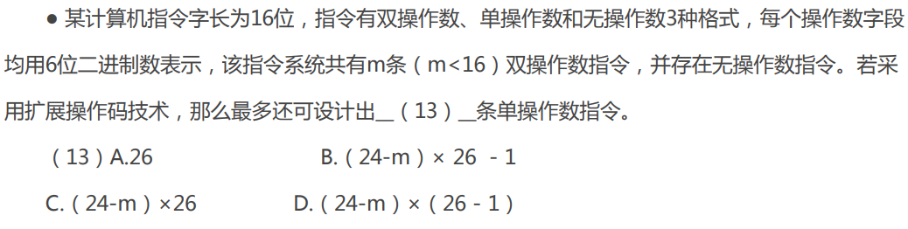
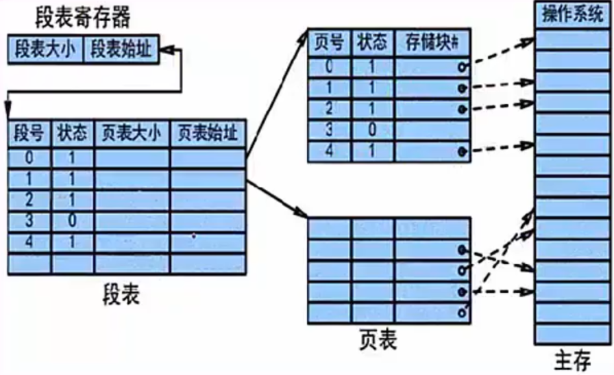
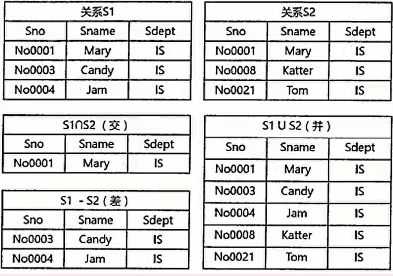
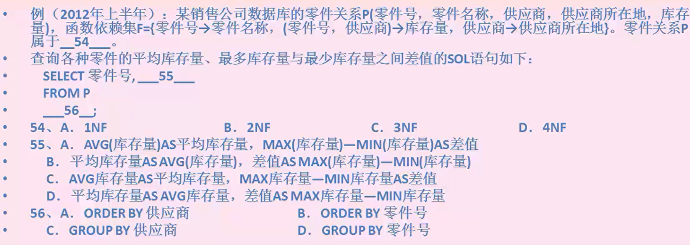
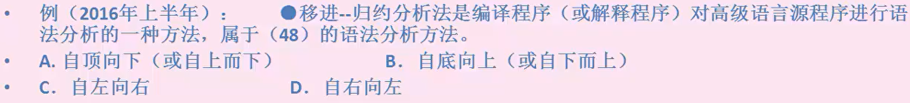
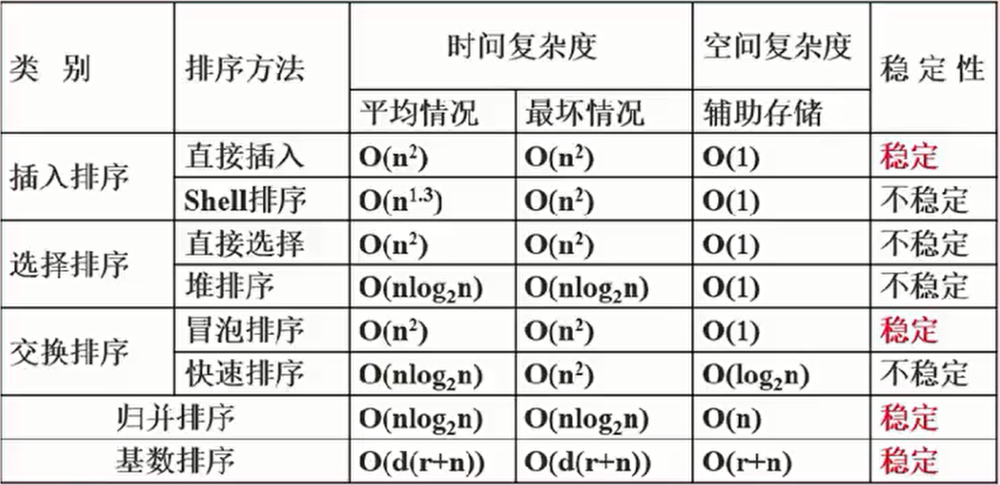
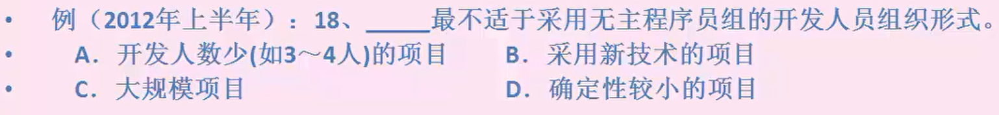

# 基础知识

## 课时02 考试大纲与考点分析

### 考纲分析

1. 掌握计算机內的数据表示，算数和逻辑运算
2. 掌握相关的应用数学及离散数学的基础知识
3. 掌握计算机体系结构以及各主要部件的性能和基本工作原理
4. 掌握操作系统、程序设计语言的基础知识，了解编译程序的基本知识
5. 熟练掌握常用数据结构和常用算法
6. 熟悉数据库、网络和多媒体的基础知识
7. 掌握C程序设计语言，以及C++、Java中的一种程序设计语言
8. 熟悉软件工程、软件过程改进和软件开发项目管理的基础知识
9. 掌握软件设计的方法和技术
10. 了解信息化、常用信息技术标准、安全性，以及有关法律、法规的基础知识
11. 正确阅读和理解计算机领域的英文资料。

### 上午考题

|      章节名      | 分数 |                           考点分布                           |
| :--------------: | :--: | :----------------------------------------------------------: |
| 计算机组成与结构 |  9   | 数据表示、校验码、计算机硬件、指令流水线、体系结构、==存储系统==、总线、安全性和可靠性 |
|     操作系统     |  6   |   ==进程管理==、==存储管理==、文件管理、设备管理、作业管理   |
|      数据库      |  6   | 数据库设计、ER模型、关系模式、关系代数、规范化、并发控制、封锁协议、数据仓库、数据挖掘、反规范化、==SQL语言== |
|    计算机网络    |  7   | OSI/RM七层模型、TCP/IP模型、局域网、广域网技术标准和协议、IP地址、子网划分和路由聚合、网络安全、==多媒体技术基础== |
| 程序设计语言基础 |  6   | 基本组成、传值和传址、编译程序基本原理、==文法定义==、==正规式==、有限自动机 |
| 知识产权与标准化 |  2   |      保护期限、产权人、侵权判定、==商标等==、标准化分类      |
|     数据结构     |  5   |     线性结构、数组、矩阵、广义表、==树与二叉树==、==图==     |
|  算法分析与设计  |  5   | 时间复杂度、查找算法、排序算法、算法设计方法、==数据挖据算法==、==智能优化算法== |
|     软件工程     |  8   | CMM、CMMI、统一过程、软件过程模型、敏捷开发、开发方法、软件工具和开发环境、==项目管理== |
|  系统开发与运行  |  8   | 系统分析与设计原则、==内聚耦合==、需求分析、==数据流图==、==WebApp设计==、测试基础知识、系统运行与维护 |
|   面向对象技术   |  11  | 基础概念、==程序设计== ( JAVA/C++ )、UML事务关系图、==设计模式== |

### 下午考题

| 题号 | 试题类型 |    学科知识点    |                           考察内容                           |
| :--: | :------: | :--------------: | :----------------------------------------------------------: |
|  1   |  必答题  |   数据流图DFD    | 补充数据流图外部实体<br/>补充数据流图数据存储<br/>补充数据流（名称、起点、终点）<br/>数据流图的改错（较少考察，包括数据流错误、删除多余数据流）<br/>数据流图相关概念简答 |
|  2   |  必答题  |    数据库设计    | 补充ER图：<br/>E-R图转换为关系模式<br/>主键和外键、新增联系判断 |
|  3   |  必答题  |     UML建模      | 用例图（联系类型，参与者）<br/>类图和对象图（多重度，联系类型）<br/>顺序图（补充对象名和消息名）<br/>活动图（补充活动名，分岔线用途）<br/>状态图（补充状态，状态转换条件）<br/>通信图（补充对象名，消息名） |
|  4   |  必答题  |    C算法设计     | 各种经典算法设计和数据结构，如链表、栈、二叉树操作算法、KMP算法等<br/>算法类型（动态规划法、分治法、回溯法、递归法、贪心法<br/>时间、空间复杂度<br/>给定输入求输出 |
|  5   |  选答题  | C++语言程序设计  |         C++语法（只考简单语法，不考算法）+ 设计模式          |
|  6   |  选答题  | Java语言程序设计 |         Java语法（只考简单语法，不考算法）+ 设计模式         |

## 课时03 学习规划

## 课时04 计算机组成与结构（硬件组成，进制转换，校验码）

| 计算机系统知识 | 计算机体系结构 | 安全性与可靠性 |
| :------------: | :------------: | :------------: |
| 计算机硬件组成 |    指令系统    | 系统可靠性分析 |
|  中央处理单元  |    存储系统    |   计算机安全   |
|    数据表示    |  输入输出技术  | 加密和认证技术 |
|     校验码     |    总线结构    |                |

### 计算机硬件组成

1. 计算机硬件基本系统

   $\begin{cases}运算器\\控制器 \\存储器 \begin{cases}内部存储器(内存，容量小，速度快)\\外部存储器(硬盘，光盘，容量大，速度慢，长期保存数据)\end{cases}\\\left.\begin{matrix}输入设备\\输出设备\end{matrix}\right\}外部设备 \\ \end{cases}$

   主机：CPU + 主存储器

   ==存储器：==

   $\begin{cases}按访问方式\begin{cases}按地址访问的存储器\\按内容访问的存储器\to相联存储器\end{cases}\\按寻址方式\begin{cases}随机存储器(Random Access Memory，RAM)。这种存储器可对任何存储单元存入或读取数据，访问任何一个存储单元所需的时间是相同的\\顺序存储器(Sequentially Addressed Memory，SAM)。访问数据所需要的时间与数据所在的存储位置相关，磁带是典型的顺序存储器\\直接存储器(Direct Addressed Memory，DAM)。介于随机存取和顺序存取之间的一种寻址方式。\end{cases}\\ 磁盘是一种直接存取存储器，它对磁道的寻址是随机的，而在一个磁道内则是顺序寻址\end{cases}$

2. 中央处理单元CPU

   中央处理单元

   * 组成：由运算器、控制器、寄存器组和内部总线组成。

   * 功能：实现程序控制、操作控制、时间控制、数据处理功能。

   ==运算器==

   * 组成：
     |      运算器       |                    功能                    |
     |:-----------------:|:------------------------------------------:|
     |  算术逻辑单元ALU  |         实现对数据的算术和逻辑运算         |
     |   累加寄存器AC    |         运算结果或源操作数的存放区         |
     | 数据缓冲寄存器DR  |        ==暂时存放内存的指令或数据==        |
     | 状态条件寄存器PSW | 保存指令运行结果的条件码内容，如溢出标志等 |

   * 功能：
     执行所有的算术运算，如加减乘除等；执行所有的逻辑运算并进行逻辑测试，如与、或、非、比较等。

   ==控制器==

   * 组成：

     |    控制器    |                             功能                             |
     | :----------: | :----------------------------------------------------------: |
     |  指令寄存器  |                       暂存CPU执行指令                        |
     | 程序计数器PC | 存放指令执行地址为实现程序指令顺序执行，值自动加1，==程序员可访问，用于跟踪指令== |
     | 地址寄存器AR |                 保存当前CPU所访问的内存地址                  |
     | 指令译码器ID |                        分析指令操作码                        |

   * 功能：

     控制整个CPU的工作，最为重要，包括程序控制、时序控制等。

   * ==MOV 指令== 

     * 取指阶段：

       程序计数器 PC 装入第一条指令的地址 101，PC 的内容被放到指令地址总线上，对指令进行译码并启动读命令。从 101 号地址读出 MOV 指令，通过指令总线 IBus 装入指令寄存器 IR，程序计数器 PC 内容加 1，变成 102，为下一条指令做好准备。指令寄存器 IR 中的操作码被译码，CPU 识别出是 MOV 指令，至此取指阶段完成。

     * 执行阶段：

       操作控制器 OC 送出控制信号到通用寄存器，选择 R1（10）为源寄存器，RO（00）为目标寄存器。OC 送出控制信号到 ALU，指定 ALU 做传送操作，打开 ALU 输出三态门，将 ALU 输出（10）送的数据总线 DBus 上，任何时刻 DBus 上只能有一个数据。将 DBus 上的数据打入数据缓冲寄存器 DR，将 DR 中的数据打入目标寄存器 RO，RO 的内容由 00 变为 10 至此 MOV 指令执行完毕。

   * ==LAD 指令==

     * 取指阶段：

       LAD 指令的取指阶段和 MOV 指令完全相同。

     * 执行阶段：

       OC 发出控制命令，打开 IR 输出三态门，将指令中的直接地址码 6 放到数据总线 DBus 上，装入地址寄存器 AR，将数存 6 号单元中的数 100 读出到 DBus 上，装入缓冲寄存器 DR。将 DR 中的数 100 装入通用寄存器 R1，原来 R1 中的值 10 被覆盖，至此 LAD 指令执行完毕。

   * ==ADD 指令==

     *  取指阶段：

       ADD 指令的取指阶段和其他指令相同。

     * 执行阶段：

       操作控制器 OC 送出控制信号到通用寄存器，选择 R1（100）为源寄存器，R2（20）为目标寄存器。ALU 做 R1 和 R2 的加法运算，打开 ALU 输出三态门，将运算结果 120 放到数据总线 DBus 上，然后打入缓冲寄存器 DR。ALU 产生的进位信号保存在状态字寄存器 PSW 中，将 DR 中数值 120 装入 R2 中，R2 原来的数 20 被覆盖。到此 ADD 指令执行结束。

   * ==STO 指令==

     * 取指阶段：

       STO 指令的取指阶段和其他指令相同。

     * 执行阶段：

        操作控制器 OC 送出控制信号到通用寄存器，选择 R3（30）作为数据存储器的地址。打开通用寄存器输出三态门，将地址 30 放到 DBus 上并装入地址寄存器 AR，并进行地址译码。操作控制器 OC 送出控制信号到通用寄存器，选择 R2（120）作为数存的写入数据放到 DBus 上。将数值 120 写入数存 30 单元，原先的数据 40 被冲掉。至此 STO 指令执行结束。

   * ==JMP 指令==

     * 取指阶段：

       JMP 指令的取指周期和其他指令相同。

     * 执行阶段：

       OC 发出控制命令，打开 IR 输出三态门，将 IR 中的地址码 101 发送到 DBus 上，将 DBus 上的地址码 101 打入到程序计数器 PC 中，PC 中原先的地址 106 被更换。于是下一条指令不是从 106 单元取出，而是转移到 101 单元取出。至此 JMP 指令执行周期结束。


> 答案：C
>
> 本题考查计算机基本工作原理。CPU中的程序计数器PC用于保存要执行的指令的地址，R访问内存时，需先将内存地址送入存储器地址寄存器MAR中，向内存写入数据时，待写入的数据要先放入数据寄存器MDR。程序中的指令一般放在内存中，要执行时，首先要访问内存取得指令并保存在指令寄存器R中。计算机中指令的执行过程一般分为取指令、分析指令并获取操作数、运算和传送结果等阶段，每条指令被执行时都要经过这几个阶段。若CPU要执行的指令为：MOV RO,#100（即将数值100传送到寄存器R0中），则CPU首先要完成的操作是将要执行的指令的地址送入程序计数器PC,访问内存以获取指令。

### 数据进制转换

* **进制的表示**：二进制、十六进制，一般在题目中会给出中文说明，如果没给出，注意二进制符号为0b,一般表示为0b0011,十六进制符号为 ==0x== 或 ==H== , 可表示为0x18F或18FH。
* **R进制整数转十进制**：位权展开法，用R进制数的每一位乘以R的n次方，n是变量，从R进制数的整数最低位开始，依次为0,1,2,3累加。
  * 例如有6进制数5043，此时R=6,用6进制数的每一位乘以6的n次方，n是变量，从6进制数的整数最低位开始(5043从低位到高位排列：3,4,0,5)，n依次为0,1,2,3,那么最终$5043=3\times60+4\times61+0\times62+5\times63=1107$。
* **十进制转R进制**：十进制整数除以R倒取余数)，用十进制整数除以R,记录每次所得余数，若商不为0，则继续除以，直至商为0，而后将所有余数从下至上记录，排列成从左至右顺序，即为转换后的进制数；
  * 例：有十进制数200，转换为6进制，此时R=6,  将200/6，得商为33，余数为2;因为商不等于0，因此再将商33/6，得商为5，余数为3；再将5/6，得商为0,余数为5；此时商为0，将所有余数从下到上记录，得532。
* **m进制转n进制**：先将m进制转化为十进制数，再将十进制数转化为n进制数，中间需要通过十进制中转，但下面两种进制间可以直接转化：
  * **二进制转八进制**：每三位二进制数转换为一位八进制数，二进制数位个数不是三的倍数，则在前面补0（原则是数值不变），如二进制数01101有五位，前面补一个0就有六位，为001101，每三位转换为一位八进制数，001=1,101=1+4=5,也即01101=15。
  * **==二进制转十六进制==**：每四位二进制数转换为一位十六进制数，二进制数位个数不是四的倍数，则在前面补0，如二进制数101101有六位，前面补两个0就有八位，为00101101，每四位转换为一位十六进制数，0010=2，1101=13=D，也即101101=2D。

### 数的表示

* 机器数各种数值在计算机中表示的形式，其特点是使用二进制计数制，数的符号用0和1表示，小数点则隐含，不占位置。
* 机器数有无符号数和带符号数之分。无符号数表示正数，没有符号位。带符号数最高位为符号位，正数符号位为0，负数符号位为1。
* 定点表示法分为纯小数和纯整数两种，其中小数点不占存储位，而是按照以下约定：
  * 纯小数：约定小数点的位置在机器数的最高数值位之前。
  * 纯整数：约定小数点的位置在机器数的最低数值位之后。
  * 真值：机器数对应的实际数值。

### 数的编码方式

* 带符号数有下列编码方式：
  * 原码：一个数的正常二进制表示，最高位表示符号，数值0的源码有两种形式：+0(00000000)和-0(10000000)
  * 反码：正数的反码即原码；负数的反码是在原码的基础上，**除符号位外**，其他各位按位取反。数值0的反码也有两种形式：+0(00000000)，-0（11111111)
  * 补码：正数的补码即原码；负数的补码是在原码的基础上，除符号位外，其他各位按位取反，而后末位+1，若有进位则产生进位。因此数值0的补码只有一种形式+0=-0=00000000    ==补码可以简化计算机运算部件的设计==
  * 移码：用作浮点运算的阶码，无论正数负数，都是将该原码的补码的首位(符号位)取反得到移码

### 浮点数表示

* 浮点数：表示方法为 `N = F * 2^E` 其中 E 称为阶码，F 称为尾数；类似于十进制的科学计数法，如85.125=0.85125\*10\^2,二进制如101.011=0.101011*2\^3。
* 工业标准IEEE754浮点数格式中==阶码采用移码，尾码采用补码==
* 在浮点数的表示中，阶码纯整数，尾数为纯小数
* 数值范围由阶码确定，数值精度由尾数表示
* 尾数的表示采用==规格化方法==，也即带符号尾数的补码必须为1.0xxxx（负数）或者0.1xxxx（正数）
* 运算方法：
  * 对阶（使两个数的阶码相同，小阶向大阶看齐，较小阶码增加几位，==尾数就右移==几位）
  * 尾数计算（相加，若是减运算，则加负数）
  * 结果规格化（即尾数表示规格化，带符号尾数转换为1.0xxxx或0.1xxxx）

### 算数运算和逻辑运算

数与数之间的算术运算包括加、减、乘、除等基本算术运算，对于二进制数，还应该掌握基本逻辑运算，包括：

* 逻辑与 & ：0和1相与，只要有一个为0结果就为0，两个都为1才为1
* 逻辑或 | ：0和1相或，只要有一个为1结果就为1，两个都为0才为0
* 异或：同0非1，即参加运算的二进制数同为0或者同为1结果为0，一个为0另一个为1结果为1
  * ==两个同符号的数相加或异符号的数相减，所得结果的符号位 SF 和进位标志 CF 进行异或运算为 l 时，表示运算的结果产生溢出。==

* 逻辑非 ! ：0的非是1,1的非是0
* 逻辑左移<<：二进制数整体左移位，高位若溢出则舍去，低位补0
* 逻辑右移>>：二进制数整体右移位，低位溢出则舍去，高位补0

### 校验码

码距：就单个编码A:00而言，其码距为1，因为其只需要改变一位就变成另一个编码。在两个编码中，从A码到B码转换所需要改变的位数称为码距，如A:00要转换为B:11,码距为2。一般来说，码距越大，越利于纠错和检错。

* 奇偶校验码
  * 在编码中增加1位校验位来使编码中1的个数为奇数（奇校验）或者偶数（偶校验），从而使码距变为2。例如：
    * 奇校验：编码中，含有奇数个1，发送给接收方，接收方收到后，会计算收到的编码有多少个1，如果是奇数个，则无误，是偶数个，则有误
    * 偶校验：同理，只是编码中有偶数个1
  * 由上述，奇偶校验只能检1位错，并且无法纠错

* 循环冗余校验码CRC

  * CRC只能检错，不能纠错，其原理是找出一个能整除多项式的编码，因此首先要将原始报文除以多项式，将所得的余数作为校验位加在原始报文之后，作为发送数据发给接收方，其编码格式为：

    

  * 由此可知，CRC由两部分组成，左边为信息码（原始数据），右边为校验码校验码是由信息码产生的，校验码位数越长，校验能力越强。求CRC编码时，采用的是==模2运算==（按位运算，不发生借位和进位）

  * 例：原始报文为“11001010101”，其生成多项式为：“$x^4+x^3+x+1$”。对其进行CRC编码后的结果为？

    * 解答：首先根据多项式得出除数11011，在原始多项式后面加上多项式最高指数个数个0，即4个0，和除数进行模2除法，一直上1，最终得出四位的余数为0011，最终编码为110010101010011，然后发送出去。

    * 接收方将收到的数据110010101010011与多项式的11011进行模2运算，若余数为0，说明校验正确，数据传输正确。

      

* ==海明校验码==

  * 海明码本质也是利用奇偶性来检错和纠错的检验方法，构成方法是在数据位之间的确定位置上插入k个校验位，通过扩大码距实现检错和纠错

  * 利用多组数位的奇偶性来检错和纠错

  * 设数据位是n位，校验位是k位，则n和k必须满足以下关系：==2^k^-1>=n+k==

  * 例：求信息1011的海明码

    * 校验位的位数和具体的数据位的位数之间的关系：所有位都编号，从最低位编号，从1开始递增，校验位处于2的n(n=012..)次方中，即处于第1,2,4,8,16,32,…位上，其余位才能填充真正的数据位，若信息数据为1011，则可知，第1,2,4位为校验位，第3,5,6,7位为数据位，用来从低位开始存放1011

    * 每一位校验码的计算公式：需要确定每一位校验码到底校验哪些信息位，将信息位（即编号）拆分成二进制表示，如7=4+2+1，由第4位校验位（r2）和第2位校验位(r1)和第1位校验位（r0）共同校验，同理，第6位数据位6=4+2，第5位数据位5=4+1，第3位数据位3=2+1，前面知道，这些2的n次方都是校验位，可知，第4位校验位校验第765三位数据位，因此，第4位校验位2等于这三位数据位的值异或，第2位和第1位校验位计算原理同上，计算出三个校验位后，可知最终要发送的海明校验码为1010101
  
      |  7   |  6   |  5   |  4   |  3   |  2   |  1   |  位数  |
      | :--: | :--: | :--: | :--: | :--: | :--: | :--: | :----: |
      |  I4  |  I3  |  I2  |      |  I1  |      |      | 信息位 |
      |      |      |      |  r2  |      |  r1  |  r0  | 校验位 |
  
      |  7   |  6   |  5   |  4   |  3   |  2   |  1   |  位数  |
      | :--: | :--: | :--: | :--: | :--: | :--: | :--: | :----: |
      |  1   |  0   |  1   |      |  1   |      |      | 信息位 |
      |      |      |      |  0   |      |  0   |  1   | 校验位 |

## 课时05 计算机组成与结构（体系结构，指令流水线，存储系统）

### 计算机体系结构分类

Flynn分类法：

|       体系结构类型       |                         结构                         |                关键特性                |                     代表                     |
| :----------------------: | :--------------------------------------------------: | :------------------------------------: | :------------------------------------------: |
| 单指令流单数据流（SISD） | 控制部分：一个<br/>处理器：一个<br/>主存储模块：一个 |                                        |                 单处理器系统                 |
| 单指令流多数据流（SIMD） | 控制部分：一个<br/>处理器：多个<br/>主存储模块：多个 |   各处理器以异步的形式执行同一条指令   | 并行处理机<br/>阵列处理机<br/>超级向量处理机 |
| 多指令流单数据流（MISD） | 控制部分：多个<br/>处理器：一个<br/>主存储模块：多个 |             不可能，不实际             |     目前没有，有文献称流水线计算机为此类     |
| 多指令流多数据流（MIMD） | 控制部分：多个<br/>处理器：多个<br/>主存储模块：多个 | 能够实现作业、任务、指令等各级全面并行 |          多处理机系统<br/>多计算机           |

主流多核计算机属于==MIMD==

### 计算机指令

* 组成：一条指令由操作码和操作数两部分组成，操作码决定要完成的操作，操作数指参加运算的数据及其所在的单元地址

* 在计算机中，操作要求和操作数地址都由==二进制数码==表示，分别称作操作码和地址码，整条指令以二进制编码的形式存放在存储器中

* 过程：==取指令一一分析指令一一执行指令==三个步骤，首先将程序计数器PC中的指令地址取出，送入地址总线，CPU依据指令地址去内存中取出指令内容存入指令寄存器；而后由指令译码器进行分析，分析指令操作码；最后执行指令，取出指令执行所需的源操作数

* 指令寻址方式

  * 顺序寻址方式：当执行一段程序时，是一条指令接着一条指令地顺序执行
  * 跳跃寻址方式：指下一条指令的地址码不是由程序计数器给出，而是由本条指令直接给出。程序跳跃后，按新的指令地址开始顺序执行。因此，==程序计数器的内容也必须相应改变，以便及时跟踪新的指令地址==

* 指令操作数的寻址方式

  * 采用不同的寻址方式可以==扩大寻址空间==，并==提高编程灵活性==
  * ==立即寻址方式==：指令的地址码字段指出的不是地址，而是操作数本身（==这是获取操作数最快的方式==）==操作数就位于代码区，存在于指令中==
  * ==直接寻址方式==：在指令的地址字段中直接指出操作数在主存中的地址
  * 间接寻址方式：指令地址码字段所指向的存储单元中存储的是操作数的地址
  * 寄存器寻址方式：指令中的地址码是寄存器的编号

* ==指令系统== （重点）

  * CISC是复杂指令系统，兼容性强，指令繁多、长度可变，由微程序实现；
  * RISC是精简指令系统，指令少，使用频率接近，主要依靠硬件实现（通用寄存器、==硬布线逻辑控制==）

  | 指令系统类型 |                             指令                             |  寻址方式  |                         实现方式                         |            其他            |
  | :----------: | :----------------------------------------------------------: | :--------: | :------------------------------------------------------: | :------------------------: |
  | CISC（复杂） |              数量多，使用频率差别大，可变长格式              |  支持多种  |                  微程序控制技术（微码）                  |         研制周期长         |
  | RISC（精简） | 数量少，使用频率接近，定长格式，大部分为单周期指令，操作寄存器，只有`Load/Store`操作内存 | 支持方式少 | 增加了==通用寄存器==；硬布线逻辑控制为主；适合采用流水线 | 优化编译，有效支持高级语言 |

* ==指令流水线==

  * 指令流水线原理：将指令分成不同段，每段由不同的部分去处理，因此可以产生叠加的效果，所有的部件去处理指令的不同段，如下图所示：

    

  * ==流水线周期==：指令分成不同执行段，其中执行时间最长的段为流水线周期

  * ==流水线执行时间==：==1条指令总执行时间   +（总指令条数-1）X   流水线周期==

  * ==流水线吞吐率==：总指令条数/流水线执行时间

  * ==流水线加速比==：不使用流水线总执行时间/使用流水线总执行时间

  * 超标量流水线技术：常规流水线是度为1的，即每个流水线阶段只执行一个部分，当度大于1时，就是超标量技术，当度为3时，相当于3条流水线并行执行，即取指、分析、执行每个阶段都同时处理3条指令，因此，当题目提到度的概念时，计算时需要将：==指令条数=指令条数/度==。然后再套流水线执行时间的公式。

* ==系统响应时间与作业吞吐量==

  * 响应时间越短，作业吞吐量越大




> 答案：B
>
> 16 位的指令，操作数为两个的时候 (每个占 6 位)，那么操作码的长度为 4 位。
> 已知条件为双操作数指令为 m 条，还剩下 2 的 4 次方 - m 条双操作数指令没有用，可以用来向单操作数指令扩展。
> 因此最多单操作数指令为 $(2^4-m)\times 2^{6}$，
> 如果不考虑有无操作数指令的话，那么就不用留下一个码点从单操作数指令扩展，上面就是最后的答案。但是题 中要求存在无操作数指令，所以还要再减去一个码点，最后答案就了 B

### 存储系统

* 计算机的存储系统的层次结构

  

  * 计算机采用分级存储体系的主要目的是为了解决存储容量、成本和速度之间的矛盾问题
  * 两级存储：Cache - 主存、主存 - 辅存（虚拟存储体系）

* 局部性原理

  * 局部性原理：总的来说，在CPU运行时，所访问的数据会趋向于一个较小的局部空间地址内，包括下面两个方面：
  * 时间局部性原理：如果一个数据项正在被访问，那么在近期它很可能会被再次访问即在==相邻的时间里会访问同一个数据项==。（循环）
  * 空间局部性原理：在最近的将来会用到的数据的地址和现在正在访问的数据地址很可能是相近的，即==相邻的空间地址会被连续访问==。

* 高速缓存Cache

  * 高速缓存Cache用来存储当前最活跃的程序和数据，直接与CPU交互，位于CPU和主存之间，容量小，速度为内存的5-10倍，由半导体材料构成。其内容是主存内存的副本拷贝，对于程序员来说是透明的

  * Cache由控制部分和存储器组成，存储器存储数据，控制部分判断CPU要访问的数据是否在Cache中，在则命中，不在则依据一定的算法从主存中替换

  * 地址映射：在CPU工作时，==送出的是主存单元的地址==，而应从Cache存储器中读/写信息。这就需要将主存地址转换为Cache存储器地址，这种地址的转换称为地址映像，==由硬件自动完成映射==，分为下列三种方法：

    * 直接映像：将Cache存储器等分成块，主存也等分成块并编号。主存中的块与Cache中的块的对应关系是固定的，也即二者块号相同才能命中。地址变换简单但不灵活，容易造成资源浪费。

      

    * 全相联映像：同样都等分成块并编号。主存中任意一块都与Cache中任意一块对应。因此可以随意调入Cache任意位置，但地址变换复杂，速度较慢。因为主存可以随意调入Cache任意块，只有当Cache满了才会发生块冲突，是最不容易发生块冲突的映像方式

      

    * 组相连映像：前面两种方式的结合，将Cache存储器先分块再分组，主存也同样先分块再分组，组间采用直接映像，即主存中组号与Cache中组号相同的组才能命中，但是组内全相联映像，也即组号相同的两个组内的所有块可以任意调换。

  * Cache命中率：当CPU所访间的数据在Cache中时，称为命中，直接从Cache中读取数据，否则没有命中，需要从主存中读取所需的数据。

    

    > 答案：A

$$
(100\times 2\% + 10 \times 98\%) + (100 \times 5\% + 10 \times 95\%) \times 20\% = 14.7
$$

### 主存编址

0

K $\to$ 1024，k $\to$ 1000，Byte $\to$ 字节，bit  $\to$ 位
$$
\begin{aligned}
  BFFFFH- 80000H + 1 &= 40000H\\
  40000H \times 1B &= 40000HB\\
  & = 2^{18}B\\
  & = 2^8 kB\\
  16K \times 8bit &= 8kB\\
  &= 2^3 kB\\
  \end{aligned}
$$

### 总线结构

从广义上讲，任何连接两个以上电子元器件的导线都可以称为总线，==总线可以减少信息传输线的数量==。通常分为以下三类：

* 内部总线：内部芯片级别的总线，芯片与处理器之间通信的总线
* 系统总线：是板级总线，用于计算机内各部分之间的连接，具体分为数据总线（并行数据传输位数）、地址总线（系统可管理的内存空间的大小）、控制总线（传送控制命令）。代表的有SA总线、EISA总线、==PCI总线（不能将多个处理机互联成多处理机系统）==
  * ==数据总线==是 CPU 与内存或其他器件之间的数据传送的通道，它的宽度就是总共有多少根数据线来传数据，1 根线能传 1 位，这个数对应字长，也就是同一时间可以处理的二进制位数，我们通常所说的多少位处理器中的多少位，就是指的数据总线宽度
  * CPU 通过==地址总线==来指定存储单元，地址总线的宽度就是能寻址到的地址的位数，最小寻址单位是字节，比如 32 位寻址，那寻址空间就是 2^32B=4GB 这么大的内存空间，我们通常所说的多少位操作系统中的多少位，就是指的是地址总线宽度
  * ==控制总线==在上文中没有提及，他的作用是反映数据的状态和传输方式，是地址总线的扩展和补充，CPU 通过控制总线对外部器件进行控制，控制总线的宽度决定了 CPU 对外部器件的控制能力
* 外部总线：设备一级的总线，微机和外部设备的总线。代表的有S232（串行总线）、SCS1（并行总线）、USB（通用串行总线，即插即用，支持热插拔）


串行：长距离低速

并行：近距离高速

单总线结构：在一个总线上适应不同类型的设备，设计复杂导致性能降低

半双工总线：同一时刻只能在一个方向上传输信息

### 系统可靠性分析

* 平均无故障时间MTTF=1/失效率
* 平均故障修复时间MTTR=1/修复率
* 平均故障间隔时间MTBF=MTTF+MTTR
* 系统可用性=MTTF/(MTTF+MTTR)*100%
* 无论什么系统，都是由多个设备组成的，协同工作，而这多个设备的组合方式可以是串联、并联，也可以是混合模式，假设每个设备的可靠性为R1,R2Rn,则不同的系统的可靠性R的计算公式如下：
* 串联系统，一个设备不可靠，整个系统崩溃    $R = R_1\times R_2 \times...\times R_n$
* 并联系统，所有设备都不可靠，整个系统才崩溃    $R = 1 - (1 - R_1)\times(1-R_2)\times...\times(1-R_n)$
* 混合系统，划分串联并联

## 课时06 计算机组成与结构（网络安全，信息安全技术）

### 网络安全概述

* 网络安全五大基本要素

  * ==保密性==：确保信息不暴露给未授权的实体，包括最小授权原则（只赋给使用者恰好够用的权限，防止其看到其他保密的数据)、防暴露（将物理数据库文件名和扩展名都修改为一串乱码，防止他人轻易找到复制)、信息加密、物理保密。
  * ==完整性==：保证数据传输过程中是正确无误的，接收和发送的数据相同，包括安全协议、校验码密码校验、数字签名、公证等手段。
  * ==可用性==：保证合法的用户能以合法的手段来访问数据，包括综合保障(IP过滤、业务流控制、路由选择控制、审计跟踪)。
  * ==可控性==：控制授权范围内的信息流向及行为方式，整个网络处于可控状态下。
  * ==不可抵赖性==：信息数据参与者不能否认自己发送的数据，参与者身份真实有效。

* 安全威胁分类

  |      威胁名称       |                             描述                             |
  | :-----------------: | :----------------------------------------------------------: |
  | ==重放攻击（ARP）== |  所截获的某次合法的通信数据拷贝，出于非法的目的而被重新发送  |
  | ==拒绝服务（DOS）== |           对信息或淇它资源的合法访问被无条件地阻止           |
  |        窃听         | 用各种可能的合法或非法的手段窃取系统中的信息资源和敏感信息。例如对通信线路中传输的信号进行搭线监听，或者利用通信设备在工作过程中产生的电磁泄露截取有用信息等 |
  |     业务流分析      | 通过对系统进行长期监听，利用统计分析方法对诸如通信频度、通信的信息流向、通信总量的变化等参数进行研究，从而发现有价值的信息和规律 |
  |      信息泄露       |              信息被泄雷或透露给某个非授权的实体              |
  |  破坏信息的完整性   |         数据被非授权地进行增删、修改或破坏而受到损失         |
  |     非授权访问      | 某一资源被某个非授权的人、或以非授权的方式使用（重放攻击就是其中一种） |
  |        假冒         | 通过欺骗通信系统（或用户）达到非法用户冒充成为合法用户，或者特权小的用户目充成为特权大的用户的目的。黑客大多是采用假目进行攻击。 |
  |    ==旁路控制==     | 攻击者利用系统的安全缺陷或安全性上的脆弱之处获得非授权的权利或特权。例如，攻击者通过各种攻击手段发现原本应保密，但是却又暴露出来的一些系统“特性”。利用这些“特性”，攻击者可以绕过防线守卫者侵入系统的内部。 |
  |    ==授权侵犯==     | 被授权以某一目的使用某一系统或资源的某个人，却将此权限用于其它非授权的目的，也称作“内部攻击”。 |
  |   ==特洛伊木马==    | 软件中含有一个察觉不出的或者无害的程序段，当它被执行时，会破坏用户的安全。 |
  |       陷阱门        | 在某个系统或煤个部件中设置了“机关”，使得当提供特定的输入数据时允许违反安全策略 |
  |        抵赖         | 这是一种来自用户的攻击，比如：否认自己曾经发布过的某条消息、伪造份对方来信等 |

### 加密技术

* 基本概念

  * 明文：实际传输的真正数据。
  * 密文：经过加密之后的数据。
  * 加密：将明文转换为密文的过程。
  * 解密：将密文转换为明文的过程。
  * 加密算法：一般是公开的，包括两大规则，代换（转换成完全不同的其他数据）和置换（打乱明文顺序，进行重新置换）。
  * 密钥：加密和解密过程中使用的密码等，是隐藏的。

* ==对称加密技术==

  * 对数据的加密和解密的密钥（密码）是相同的，也称为共享密钥加密技术，属于不公开密钥加密算法。其缺点是加密安全性不高（因为只有一个密钥），且密钥分发困难（因为密钥还需要传输给接收方，也要考虑保密性等问题）。但是其加密速度快，非常适合于大数据的加密。

  *  ==常见对称密钥加密算法==（重要，记住）

    * DES：替换+移位、56位密钥、64位数据块、速度快、密钥易产生

    * ==3DES（三重DES）：两个56位的密钥K1、K2==

      ​	加密：K1加密 -> K2解密 -> K1加密
      ​	解密：K1解密 -> K2加密 -> K1解密

    * AES:高级加密标准Rijndael加密法，是美国联邦政府采用的一种区块加密标准。这个标准用来替代原先的DES。对其要求是至少与3DES一样安全

    * RC-5：==RSA==数据安全公司的很多产品都使用了RC-5

      * RSA是一种会话密钥算法
    
    * IDEA算法：128位密钥、64位数据块、比DES的加密性好、对计算机功能要求相对低，PGP

* ==非对称加密技术==

  * 又称为公开密钥加密技术，各个用户分别有一对密钥，称为公钥和私钥，其中公钥是公开的，所有用户都知道，私钥是保密的，==只有自己知道（接收方不知道）==，使用公钥加密，只能对应的私钥能解密，使用私钥加密，同样也只有对应的公钥能解密；非对称加密就是运用了公钥和私钥的原理，其对数据的加密和解密的密钥是不同的，是公开密钥加密算法
  * 原理：发送方甲方和接收方乙方都各自有公钥和私钥，且甲方的公钥加密只能由甲方的私钥解密，乙方同。双方的公钥是可以共享的，但是私钥只能自己保密，此时，甲方要传输数据给乙方，明显应该使用乙方的公钥来加密，这样，只有使用乙方的私钥才能解密，而乙方的私钥只有乙方才有，保证了数据的保密性，也不用分发解密的密钥。其缺点是加密速度慢（密钥多，计算量大，不适合加密大数据）
  * ==常见非对称加密算法==
    * RSA：512位（或1024位）密钥、计算量极大，难破解00000
    * Elgamal：其基础是Diffie-Hellman密钥交换算法
    * ECC：椭圆曲线算法
    * 其他非对称算法：背包算法，Rabin，D-H
  * 相比较可知，对称加密算法密钥一般只有56位，因此加密过程简单，适合加密大数据，也因此加密安全性不高；而非对称加密算法密钥有1024位，安全性高，相应的解密计算量庞大，难以破解，却不适合加密大数据，一般用来加密对称算法的密钥，这样，就将两个技术组合使用了这也就是数字信封的原理

* 信息摘要（完整性）

  * 所谓信息摘要，就是一段数据的特征信息，当数据发生了改变，信息摘要也会发生改变，发送方会将数据和信息摘要一起传给接收方，接收方会根据接收到的数据重新生成一个信息摘要，若此摘要和接收到的摘要相同，则说明数据正确。信息摘要是由哈希函数生成的
  * 信息摘要的特点：不算数据多长，都会产生固定长度的信息摘要；任何不同的输入数据，都会产生不同的信息摘要；单向性，即只能由数据生成信息摘要，不能由信息摘要还原数据
  * 信息摘要算法：MD5（产生128位的输出）、SHA（安全散列算法，产生160位的输出，安全性更高）
  * 由上述特点，可知使用信息摘要可以保证传输数据的完整性，只需要双方比对生成的信息摘要是否相同即可判断数据有没有被篡改，但是这样会出现一个问题，就是当发送方发送的数据和信息摘要都被篡改了，那么接收方拿到错误的数据生成的信息摘要也和篡改的信息摘要相同，接收方就无能为力了，这个问题，在后面的数字签名技术会解决

* 数字签名（不可抵赖性）

  * 上述技术只保证了数据传输过程的保密性和完整性，但却无法保证发送者是否非法，即在传输过程中，数据被第三方截获，即使他不能解密获取真实数据，但是他可以伪造一段数据，也用加密算法加密后再发送给接收方，那么接收方无法判断发送方是否合法，其只会用发送方告诉他的方法来解密。此时就要用到数字签名技术来验证发送方是否合法
  * 数字签名属于非对称加密体制，主要功能有：不可否认、报文鉴别、报文的完整性。
  * 原理：若发送方需要发送数据，应该使用发送方的私钥进行数字签名，而其公钥是共享的，任何接收方都可以拿来解密，因此，接收方使用了发送方的公钥解密，就必然知道此数据是由发送方的私钥加密的，而发送的私钥只属于发送方，唯一标识了数据是由谁发送的，这就是数字签名的过程原理

  

* 数字证书
  * 数字证书又称为数字标识，由用户申请，==证书签证机关CA==对其核实签发的，对用户的公钥的认证。上述的技术都是在原发送方是正确的的情况下所做的加密和认证技术，然而当发送方本身就是伪造的，即发送的公钥本身就是假的，那么后续的加密、数字签名都没有意义了，因此对发送方的公钥进行验证是十分重要的。
  * 现在的数字证书版本大多为X.509
  * 数字证书的原理：每一个发送方都要先向CA申请数字证书，数字证书是经过CA数字签名了的，也即==CA使用私钥加密==，当发送方要发送数据时，接收方首先下载CA的公钥，去验证数字证书的真伪，如果是真的，就能保证发送方是真的，因为CA是官方权威的机构，其合法性毋庸置疑
  * 数字证书的格式：序列号、版本号、签名算法、发行者D、发行者、主体D、有效期、公钥
  * 最安全的过程要验证两步：
    1. 在网银系统中，使用网银时，要先下载该银行的数字证书，之后，本地客户机会用CA的公钥对数字证书进行解密，解密成功说明是CA颁发的，是该银行系统而非黑客冒充
    2. 确认了通信对方无误后，就可以采用上述的一系列加密和认证技术来对通信数据进行加密，确保数据不会在发送过程中被截获篡改
* PKA公钥基础设施
  * PKI公钥基础设施是提供公钥加密和数字签名服务的系统或平台，目的是为了管理密钥和证书。一个机构通过采用PK框架管理密钥和证书可以建立一个安全的网络环境
  * PKI主要包括四个部分：X.509格式的证书：CA操作协议；CA管理协议；CA政策制定
  * PKI的基础技术包括：加密、数字签名、数据完整性机制、数字信封、双重数字签名等
  * 一个PK应用系统至少应具有以下部分：（了解）
    * 公钥密码证书管理
    * 黑名单的发布和管理
    * 密钥的备份和恢复
    * 自动更新密钥
    * 自动管理历史密钥
    * 支持交叉认证


> 答案：B，C，D


> 答案：D，A，C

## 课时07 操作系统（进程管理，同步互斥，PV操作，死锁）

|  进程管理  |   存储管理   |     文件管理     |     设备管理     |
| :--------: | :----------: | :--------------: | :--------------: |
| 进程的状态 | ~~分区存储~~ |   ==索引文件==   |     I/O软件      |
| ==前趋图== | ==页式存储== |   ==树形目录==   | ==输入输出技术== |
| ==PV操作== |   段式存储   | ==空闲存储管理== |   SPOOLING技术   |
|  进程调度  |  段页式存储  |                  |                  |
|    死锁    |              |                  |                  |

### 操作系统概述（了解）

* 操作系统的作用：通过资源管理提高计算机系统的效率：改善==人机界面==向用户提供友好的工作环境
* 操作系统的特征：并发性、共享性、虚拟性、不确定性
* 操作系统的功能：进程管理、存储管理、文件管理、设备管理、~~作业管理~~
* 操作系统的分类：批处理操作系统、分时操作系统（轮流使用CPU工作片）、实时操作系统（快速响应）、网络操作系统、分布式操作系统（物理分散的计算机互联系统）、微机操作系统（Windows）、嵌入式操作系统
* 计算机启动的基本流程为：B1OS->主引导记录->操作系统

### 进程的组成和状态

* 进程的组成：==进程控制块PCB（唯一标志）==、程序（描述进程要做什么）、数据（存放进程执行时所需数据）

* 进程基础的状态是下左图中的三态图，这是==系统自动控制==时只有三种状态，而下右图中的五态，是多了两种状态：静止就绪和静止阻塞，需要==人为的操作==才会进入对应状态，活跃就绪即就绪，活跃阻塞即等待（==三态图一定要记住==）

  

* 可知，当人为干预后，进程将被挂起，进入静止状态，此时，需要人为微活，才能恢复到活跃状态，之后的本质还是三态图

### 前趋图

* 前趋图：用来表示哪些任务可以并行，哪些任务之间有顺序关系，具体如下图：

  

* 可知，ABC可以并行执行，但是必须ABC都执行完后，才能执行D。这就确定了两点：任务间的并行、任务间的先后顺序

### 进程资源图

* 进程资源图：用来表示进程和资源之间的分配和请求关系，如下图所示：

  

  P代表进程，R代表资源，R方框中有几个圆球就表示有几个这种资源，在图中，R1指向P1,表示R1有个资源已经分配给了P1，P1指向R2，表示P1还需要请求一个R2资源才能执行

* ==阻塞节点==：某进程所请求的资源已经全部分配完毕，无法获取所需资源，该进程被阻塞了无法继续。如上图中P2

* ==非阻塞节点==：某进程所请求的资源还有剩余，可以分配给该进程继续运行。如上图中P1、P3

* 当一个进程资源图中所有进程都是阻塞节点时，即陷入死锁状态


> 答案：C，B
>
> ==进程资源图化简的方法==是：先看系统还剩下多少资源没分配，再看有哪些进程是不阻塞的，接着把不阻塞的进程的所有边都去掉，形成一个孤立的点，再把系统分配给这个进程的资源回收回来，这样，系统剩余的空闲资源便多了起来，接着又去看看剩下的进程有哪些是不阻塞的，然后又把它们逐个变成孤立的点。最后，所有的资源和进程都变成孤立的点。图中P3是不阻塞的，故P3为化简图的开始，把P3孤立，再回收分配给他的资源，可以看到P1也变为不阻塞节点了，故P3、P1、P2是可以的。

### 同步与互斥

* **互斥**：某资源（即临界资源）在同一时间内只能由一个任务单独使用，使用时需要加锁，使用完后解锁才能被其他任务使用；如打印机
* **同步**：多个任务可以并发执行，只不过有速度上的差异，在一定情况下停下等待，不存在资源是否单独或共享的问题；如自行车和汽车
* 临界资源：各进程间需要以互斥方式对其进行访问的资源
* 临界区：指进程中对临界资源实施操作的那段程序。==本质是一段程序代码==
* 互斥信号量：对临界资源采用互斥访问，使用互斥信号量后其他进程无法访问，初值为1
* 同步信号量：对共享资源的访问控制，初值一般是共享资源的数量

### 信号量操作（PV操作）

* P操作：申请资源，S=S-1，若S>=0，则执行P操作的进程继续执行；若S<0，则置该进程为阻塞状态（因为无可用资源），并将其插入阻塞队列
* V操作：释放资源，S=S+1，若S>0，则执行V操作的进程继续执行；若S<=0，则从阻塞状态唤醒一个进程，并将其插入就绪队列（此时因为缺少资源被P操作阻塞的进程可以继续执行），然后执行V操作的进程继续


* 经典问题：生产者和消费者的问题

* 三个信号量：互斥信号量S0（仓库独立使用权），同步信号量S1（仓库空闲个数），

* 同步信号量S2（仓库商品个数）。

  |    生产者流程    |  消费者流程  |
  | :--------------: | :----------: |
  |  生产一个商品S   |    P(S0)     |
  |      P(S0)       |    P(S2)     |
  |      P(S1)       | 取出一个商品 |
  | 将商品放入仓库中 |    V(S1)     |
  |      V(S2)       |    V(S0)     |
  |      V(S0)       |              |


> 答案：C，B，B


> 答案：C，B，D


非抢占式优先级调度算法：不抢CPU

> 答案：D，B，C


> 答案：D，A
>
> 根据题目的描述，可以画出如图  所示的系统运行时空图。
>
> 如何画出这个图呢其详细过程为：
>
> 首先 P1 进程使用 R2 资源 30ms，所以 P1 的前 30ms 注明为 R2。与此同时 P2 使用 R1 资源 20ms，P3 同时申请使用 CPU 40ms。当 P3 申请使用 CPU 时，没有其它进程申请使用 CPU，所以 P3 顺利得到了 CPU 的使用权。但我们可以看到，当系统时间到 20ms 时，P3 失去了 CPU 资源，这是为什么呢因为此时 P2 已经使用完 R1，它开始申请使用 CPU 了，P2 的优先级比 P3 高，所以系统从 P3 手中收回 CPU 的使用权，把 CPU 分配给 P2 使用。当系统时间到 30ms 时，系统又从 P2 手中收回了 CPU 的使用权，把 CPU 分配给了 P1 使用，因为系统中 P1 的优先级比 P2 高。依次类推，便完成了系统时空图。
> 从图 6-39 中可以看出，三个进程运行完毕需要 100ms，CPU 工作了 90ms，所以 CPU 的利用率为 90%，R2 工作了 70ms，所以 R2 的利用率为 70%。
>
> 正确答案：90% 70% 
> 解析：由于使用处理机和输入输出设备时采取可剥夺式多任务并行工作方式，所以在分析每个进程都需要多长时间完成时，可以采用优先级高的进程先分析的方法。高优先级的进程有优先获取资源的权利，因而最高优先级的进程 P1 发出申请设备的请求会立即得到响应，各设备占用时间为：
>
> 
>
> 在 P1 占用设备的基础上，P2 可以在剩下的进程中优先得到资源：
>
> 
>
> 在 P1、P2 占用设备的基础上，P3 可以在剩下的空闲时间中占用资源；
>
> 
>
> 从图可以看出 P2 在使用 R1 设备 20ms 后，要使用 CPU30ms，但当其运行 10ms 后， P1 要使用 CPU，由于系统采用可剥夺方式调度，P1 优先级高，所以将 P2 暂停，让 P1 先运行。同理，P3 开始就使用 CPU，但在运行 20ms 后，要让给高优先级的进程 P2 和 P1。P1 从投入运行到完成需要 80ms，而 P2、P3 由于等待资源，运行时间都延长为 100ms。 CPU 在 90ms～100ms 共 10ms 时间内没有利用，所以利用率为 90/100=90%，同样计算得 R2 的利用率为 70/100=70%，R1 的利用率为 60%


### 死锁

* 当一个进程在等待永远不可能发生的事件时，就会产生死锁，若系统中有多个进程处于死锁状态，就会造成系统死锁
* ==死锁产生的四个必要条件==：
  * 资源互斥
  * 每个进程占有资源并等待其他资源
  * 系统不能剥夺进程资源
  * 进程资源图是一个环路
* 死锁产生后，解决措施是==打破四大条件==，有下列方法：
  * 死锁预防：采用某种策略限制并发进程对于资源的请求，破坏死锁产生的四个条件之一，使系统任何时刻都不满足死锁的条件。
  * 死锁避免：一般采用==银行家算法==来避免，银行家算法，就是提前计算出一条不会死锁的资源分配方法，才分配资源，否则不分配资源，相当于借贷，考虑对方还得起才借钱，提前考虑好以后，就可以避免死锁
  * 死锁检测：允许死锁产生，但系统定时运行一个检测死锁的程序，若检测到系统中发生死锁，则设法加以解除
  * 死锁解除：即死锁发生后的解除方法，如强制剥夺资源，撤销进程等
* 死锁计算问题：
  * 系统内有 $n$ 个进程，每个进程都需要 $R$ 个资源，那么其发生死锁的最大资源数为 $ n\times(R-1)$ 。其不发生死锁的最小资源数为 $n\times(R-1)+1$ 


> 答案：B


> 答案：D，B

### 线程

* 传统的进程有两个属性：可拥有资源的独立单位；可独立调度和分配的基本单位。
* 引入线程后，==线程是独立调度的最小单位==，==进程是拥有资源的最小单位==，线程可以共享进程的公共数据、全局变量、代码、文件等资源，但不能共享线程独有的资源，如线程的栈指针等标识数据。

## 课时08 操作系统（存储，文件，设备，磁盘管理）

### 页式存储管理

* 将进程空间分为一个个页，假设每个页大小为4K，同样的将系统的物理空间也分为一个个4K大小的物理块（页帧号），这样，每次将需要运行的逻缉页装入物理块中，运行完再装入其他需要运行的页，就可以分批次运行完进程，而无需将整块逻辑空间全部装入物理内存中

  

* 优点：利用率高、碎片小（只在最后一个页中有）、分配及管理简单
* 缺点：增加了系统开销，可能产生抖动现象


> $4K = 2^{16}$
>
> 页内偏移不变
>
> 1为页号，后面为页内偏移
>
> 答案：B
>
> 解析：页面大小为4K,则页内偏移地址为12位，才能表示4K大小空间；由此，可知逻辑地址1D16H的低12位D16H为偏移地址，高4位1为逻辑页号，在页表中对应物理块号3，因此物理地址为3D16H。

### 页面置换算法

* 有时候，进程空间分为100个页面，而系统内存只有10个物理块，无法全部满足分配，就需要将马上要执行的页面先分配进去，而后根据算法进行淘汰，使100个页面能够按执行顺序调入物理块中执行完
* 缺页表示需要执行的页不在内存物理块中，需要从外部调入内存，会增加执行时间，因此，缺页数越多，系统效率越低
* 最优算法：==OPT==，理论上的算法，==无法实现==，是在进程执行完后进行的最佳效率计算，用来让其他算法比较差距。原理是选择未来最长时间内不被访问的页面置换，这样可以保证未来执行的都是马上要访问的
* 先进先出算法：FIFO，先调入内存的页先被置换淘汰，会产生==抖动现象==，即分配的页数越多，缺页率可能越多（即效率越低）
* 最近最少使用：LRU，在最近的过去，进程执行过程中，过去最少使用的页面被置换淘汰，根据局部性原理，==这种方式效率高==，且不会产生抖动现象


> 答案 ：D


> 答案：B，C
>
> [参考解析](https://blog.csdn.net/asdfjklingok/article/details/119088805)

### 快表

* 是一块小容量的相联存储器，由快速存储器组成，按内容访问，速度快，并且可以从硬件上保证按内容并行查找，一般用来存放当前访问最频繁的少数活动页面的页号
* 快表是将页表存于Cache中；慢表是将页表存于内存上
* 因此慢表需要访问两次内存才能取出页，而快表是访问一次Cache和一次内存，因此更快

### 段式存储管理

* 将进程空间分为一个个段，每段也有段号和段内地址，与页式存储不同的是，每段物理大小
  不同，分段是==根据逻辑整体分段的==

* 地址表示：（段号，段内偏移）：其中段内偏移不能超过该段号对应的段长，否则越界错误，而比地址对应的真正内存地址应该是：段号对应的基地址+段内偏移。


* 优点：程序逻辑完整，修改互不影响
* 缺点：内存利用率低，内存碎片浪费大


> 答案：B

### 段页式存储管理

* 对进程空间先分段，后分页，具体原理图和优缺点如下：

  * 优点：空间浪费小、存储共享容易、能动态连接
  * 缺点：由于管理软件的增加，复杂性和开销也增加，执行速度下降

  

### 文件结构  

* 计算机系统中采用的==索引文件结构==如下图所示：

  * 系统中有13个索引节点，0-9为直接索引，即每个索引节点存放的是内容，假设每个物理盘大小为4KB，共可存4KB\*10=40KB数据
  * 10号索引节点为一级接索引节点，大小为4KB，存放的并非直接数据，而是链接到直接物理盘块的地址，假设每个地址占4B，则共有1024个地址，对应1024个物理盘，可存1024\*4KB=4098KB数据
  * 二级索引节点类似，直接盘存放一级地址，一级地址再存放物理盘快地址，而后链接到存放数据的物理盘块，
    容量又扩大了一个数量级，为1024\*1024\*4KB数据

  

* 磁盘

  * ==非格式化容量== = $面数\times (磁道数/面)\times内圆周长\times最大位密度$
  * ==格式化容量== = $面数\times (磁道数/面)\times(扇区数/道)\times(字节数/扇区)$


$$
\begin{aligned}
5 &\to \quad5 \times 1KB = 5KB\\
6,7&\to \quad \frac{1KB}{4} \times 1KB \times 2\\
8&\to \quad \frac{1KB}{4} \times\frac{1KB}{4} \times 1KB\\
\end{aligned}
$$
> 计算机磁盘编号默认从0开始
>
> 直接：0-4，5个
>
> 一级间接：5+256+256 - 1 = 516
>
> 二级间接：517-
>
> 

### 树形文件目录

* 相对路径：是从当前路径开始的路径

* 绝对路径：是从根目录开始的路径

* 至文件名=绝对路径+文件名。要注意，绝对路径和相对路径是不加最后的文件名的，只是单纯的路径序列

* 树形结构主要是区分相对路径和绝对路径，如下图所示：

  


> 答案：D，B

### 空闲存储空间管理

* 空闲区表法：将所有空闲空间整合成一张表，即空闲文件目录。
* 空闲链表法：将所有空闲空间链接成一个链表，根据需要分配。
* 成组链接法：既分组，每组内又链接成链表，是上述两种方法的综合。
* ==位示图法==：对每个物理空间用一位标识，为1则使用，为0则空闲，形成一张位示图。


$$
\begin{aligned}
16386b/32b &= 512 ... 2\\
&\text{513个字，第512个}\\
1000GB/4MB&= 250 \times 1024位\\
frac{250 \times 1024}{32}& = 250\times 32\\
\end{aligned}
$$

> 答案：C，D
>
> 

### 设备管理

* 设备的分类方式：

  * 按数据组织分类：块设备，字符设备
  * 按资源分配角度分类：独占设备，共享设备，虚拟设备
  * 按数据传输速率分类：低速设备，中速设备，高速设备

* I/O 软件层次结构：

  

  * 越往上越与硬件无关，越往下越与硬件相关

### 输入输出技术

* ==程序控制（查询）方式==：CPU主动查询外设是否完成数据传输，效率极低
* ==程序中断方式==：外设完成数据传输后，向CPU发送中断，等待CPU处理数据，效率相对较高。适用于键盘等实时性较高的场景
  * **中断响应**时间指的是从发出中断请求到开始进入中断处理程序；**中断处理**时间指的是从中断处理开始到中断处理结束。**中断向量**提供中断服务程序的入口地址。多级中断嵌套，使用堆栈来保护断点和现场
* ==DMA方式（直接主存存取）==：CPU只需完成必要的初始化等操作，数据传输的整个过程都由DMA控制器来完成，在==主存和外设之间==建立直接的数据通路，效率很高。适用于硬盘等高速设备（==CPU优先响应==）
* 在一个总线周期结束后，CPU会响应DMA请求开始读取数据；CPU响应程序中断方式请求是在一条指令执行结束时；区分指令执行结束和总线周期结束
* 在==UNIX操作系统中==，把输入输出设备看作是==特殊文件==

### 虚设备和SPOOLING技术

* 一台实际的物理设备，例如打印机，在同一时间只能由一个进程使用，其他进程只能等待，且不知道什么时候打印机空闲，此时，极大的浪费了外设的工作效率

* 引入SPOOLING技术，就是在外设上建立两个数据缓冲区，分别称为输入井和输出井，这样，无论多少进程，都可以共用这一台打印机，只需要将打印命令发出，数据就会排队存储在缓冲区中，打印机会自动按顺序打印，实现了物理外设的共享，使得每个进程都感觉在使用一个打印机，这就是==物理设备的虚拟化==。如下图所示：

  


> 答案：D
>
> 
>
> ==程序查询方式（程序控制方式）> 程序中断方式 > DMA工作方式 > 通道方式 > I/O处理机==

### 磁盘结构

* 磁盘有正反两个盘面，每个盘面有多个同心圆，每个同心圆是一个==磁道==，每个同心圆又被划分为多个扇区，数据就被存放在一个个扇区中。
* 读取数据时，磁头首先要寻找到对应的磁道，然后等待磁盘进行周期旋转，旋转到指定的扇区，才能取到对应的数据，因此，会产生==寻道时间==和==等待时间==，就是磁头移动到磁道所需的时间和等待读写的扇区转到磁头的下方所用的时间。其中==寻道时间耗时最长==，寻道时间的调度算法如下：
  * 先来先服务FCFS：根据进程请求访问磁盘的先后顺序进行调度
  * 最短寻道时间优先SSTF：请求访问的磁道与当前磁道最近的进程优先调度，使得每次的寻道时间最短。会产生“饥饿”现象，即远处进程可能永远无法访问
  * ==扫描算法SCAN==：又称“==电梯算法==”，磁头在磁盘上双向移动，其会选择离磁头当前所在磁道最近的请求访问的磁道，并且与磁头移动方向一致，磁头永远都是从里向外或者从外向里一直移动完才掉头，与电梯类似
  * 单向扫描调度算法CSCAN：与SCAN不同的是，其只做单向移动，即只能从里向外或者从外向里


> 答案：C
>
> 


> 答案：C，B
>
> 第一空分析：系统读记录的时间为 33/11＝3ms，对第一种情况：系统读出并处理记录 R0 之后，将转到记录 R2 的开始处，所以为了读出记录 R1，磁盘必须再转一圈，需要 33ms（30ms 到 R1 起始位置，3ms 读完 R1，刚好转一圈）的时间。这样，处理 11 个记录的总时间应为 366ms，因为处理前 10 个记录（即 R0，R1，R2，…，R9）的时间为 10×（33+3）ms =360 ms，读记录 R10 及处理记录 R10 时间为 6ms，所以处理 11 个记录的总时间 = 360ms+ 6ms=366ms。
>
> 第二空分析：对于第二种情况，若对信息进行分布优化的结果如下所示：
>
> 
>
> 从中可以看出，当读出记录 R0 并处理结束后，磁头刚好转至 R1 记录的开始处，立即就可以读出 R1 并处理，因此处理 11 个记录的总时间为：11×（3ms（读记录）+3ms（处理记录）)＝11×6ms=66ms

### 微内核操作系统

微内核，顾名思义，就是尽可能的将内核做的很小，只将最为核心必要的东西放入内核中，其他能独立的东西都放入用户进程中，这样，系统就被分为了用户态和内核态，如下图所示：==（表要记住）==


### 嵌入式操作系统

* 嵌入式操作系统特点：==微型化==、代码质量高、专业化、实时性强、==可裁剪可配置==
* 实时嵌入式操作系统的内核服务：异常和中断、计时器、I/O管理
* 常见的嵌入式RTOS(实时操作系统)：VxWorks、RT-Linux、QNX、pSOS
* 嵌入式系统初始化过程按照自底向上、从硬件到软件的次序依次为：
  * 片级初始化->板级初始化->系统初始化
* 芯片级是微处理器的初始化，板卡级是其他硬件设备初始化，系统级初始化就是软件及操作系统初始化

### 总结

==重点为进程管理，尤其是同步互斥==

## 课时09 数据库（体系结构，关系代数，规范化）

### 数据库技术基础

|    数据库设计     |  函数依赖  | 分布式数据库 |
| :---------------: | :--------: | :----------: |
| 三级模式-两级映射 | 规范化基础 |  数据库安全  |
|      E-R模型      |  键与约束  |   数据仓库   |
|     关系模型      |    范式    | 反规范化技术 |
|  关系代数的运算   |  模式分解  |    大数据    |
|                   |  并发控制  |   SQL语言    |

### 基本概念

* 数据库DBS：是一个采用了数据库技术，有组织地，动态地存储大量相关数据，方便多用户访问的计算机系统
  * 数据库（统一管理、长期存储在计算机内的，有组织的相关数据的的集合）
  * 硬件（构成计算机系统包括存储数据所需的外部设备）
  * 软件（操作系统、==数据库管理系统==及应用程序）
  * 人员（系统分析和数据库设计人员、应用程序员、最终用户、==数据库管理员DBA==）
* 数据库管理系统DBMS的功能
  * 实现对共享数据有效地组织、管理和存取
  * 包括数据库定义、数据库操作、数据库运行管理、数据库的存储管理、数据库的建立和维护）

### 三级模式-两级映像

* ==内模式==：管理如何存储物理的==数据==，对数据的存储方式、优化、存放等。

* 模式：又称为==概念模式==，就是我们通常使用的==基本表==这个级别，根据应用、需求将物理数据划分成一张张表
* ==外模式==：对应数据库中的==视图==这个级别，将表进行一定的处理后再提供给用户使用，例如，将用户表中的用户名和密码组成视图提供给登录模块使用，而用户表中的其他列则不对该模块开放，增加了安全性。
* ==外模式一模式映像==：是表和视图之间的映射，存在于概念级和外部级之间，若表中数据发生了修改，只需要修改此映射，而无需修改应用程序。
* ==模式一内模式映像==：是表和数据的物理存储之间的映射，存在于概念级和内部级之间，若修改了数据存储方式，只需要修改此映射，而不需要去修改应用程序。


> 答案：C，A

### 数据库设计

* 需求分析：即分析数据存储的要求，==产出物==有数据流图、数据字典、需求说明书。

* 概念结构设计：就是设计==E-R图==，也即实体-属性图，与物理实现无关，就是说明有哪些实体，实体有哪些属性。

* 逻辑结构设计：将E-R图，转换成关系模式，也即转换成实际的表和表中的列属性，这里要考虑很多规范化的东西。

* 物理设计：根据生成的表等概念，生成物理数据库。

  


> 答案：A，C

### ER模型

* 数据模型的三要素：数据结构、数据操作、数据的约束条件

* 在ER模型中，使用椭圆表示属性（一般没有）、==长方形表示实体==、==菱形表示联系==，联系的两端要填写联系类型，示例如下图：

  

* 联系类型：

  * 一对一1：1
  * 一对多1：N
  * 多对多M：N

* 属性分类：

  * 简单属性和复合属性（属性是否可以分割）
  * 单值属性和多值属性（属性有多个取值）
  * NUL属性（无意义）
  * 派生属性（可由其他属性生成）

### 关系模型

* 关系模型也即数据库中常见的表，包括实体的属性，标识出实体的主键和外键

  

### 模型转换

* E-R图转换为关系模型：每个实体都对应一个关系模式；联系分为三种：
  * 1：1联系中，联系可以放到任意的两端实体中，作为一个属性（要保证1：1的两端关联）
  * 1：N的联系中，联系可以单独作为一个关系模式，也可以在N端中加入1端实体的主键
  * M：N的联系中，联系必须作为一个单独的关系模式，其主键是M和N端的联合主键


### 关系代数运算

* 关系模式在代数运算时可以理解为数据库中的表，两个概念通用。

  * 并：结果是两张表中所有记录数合并，相同记录只显示一次。
  * 交：结果是两张表中相同的记录。
  * 差：S1-S2,结果是S1表中有而S2表中没有的那些记录。

  

* 笛卡尔积：==$\times$== S1$\times$S2,产生的结果包括S1和S2的所有属性列，并且S1中每条记录依次和S2中所有
  记录组合成一条记录，最终属性列为S1+S2属性列，记录数为S1$\times$S2记录数

* 投影：==$\pi$== 实际是按条件选择某关系模式中的==某列，列也可以用数字表示==。==$\pi_{1,2}(S1)$==

* 选择：==$\sigma$== 实际是按条件选择某关系模式中的==某条记录== ==$\sigma_{sno = no0003}(S1)$==

* 除法：==$\div$== [关系代数中的除法运算](https://blog.csdn.net/t_1007/article/details/53036082)

  

* 自然连接：符号：==$\bowtie$==自然连接的结果显示全部的属性列，但是相同属性列只显示一次，显示两个关系模式中属性相同且值相同的记录

  


> 答案：D，不用考虑单引号

### 函数依赖

* 给定一个X，能唯一确定一个Y，就称X确定Y，或者说Y依赖于X，例如$Y=X\times X$函数。函数依赖又可扩展以下两种规则：
  * 部分函数依赖：A可确定C，（A，B）也可确定C，（A，B）中的一部分（即A）可以确定C,称为部分函数依赖。
  * 传递函数依赖：当A和B不等价时，A可确定B，B可确定C，则A可确定C，是传递函数依赖；若A和B等价，则不存在传递，直接就可确定C。

### 键与约束

* 超键：能唯一标识此表的属性的组合。
* 候选键：超键中去掉冗余的属性，剩余的属性就是候选键。
* 主键：任选一个候选键，即可作为主键。
* 外键：其他表中的主键。
* 主属性：候选键内的属性为主属性，其他属性为非主属性。
* 实体完整性约束：即主键约束，主键值不能为空，也不能重复。
* 参照完整性约束：即外键约束，外键必须
* 是其他表中已经存在的主键的值，或者为空。
* 用户自定义完整性约束：自定义表达式约束，如设定年龄属性的值必须在0到150之间。

### ==范式==

* 第一范式1NF：所有属性都不可以再分割为两个或多个分量。

* 第二范式2NF：当且仅当R是1NF,且每一个非主属性完全依赖主键（不存在部分依懒）时，R就是2NF。比较典型的例子就是候选键是单属性，==单属性是不可能存在部分函数依赖的==。

* 第三范式3NF：当且仅当R是2NF,且R中没有非主属性传递依赖于候选键时，R就是3NF（此时，也不会存在部分依赖）。一般解决方法是拆分传递依赖的非主属性为一个新的关系模式。本质就是主键要直接决定所有非主属性，不能通过非主属性间接决定。

* BC范式BCNF：R属于BCNF当且仅当其F中每个依赖的决定因素必定包含R的某个候选码

  * 设有关系模式$R(S,T,J)$ ，依赖集为$F=\{SJ->T,T->J\}$
  * 画图可以求出其候选集为$(S,T)$，$(S,J)$


> 答案：C，A
>
> 
>
> 


> 答案：A，D
>
> 解析：由该关系模式，可求出其候选键为EM,而又存在E->N，即候选键中一部分决定其他属性，存在部分函数依赖，只是1NF；因为存在部分函数依赖，由此可知第二问ABC都错了，只有D正确。

### 模式分解

* 范式之间的转换一般都是通过拆分属性，即模式分解，将具有部分函数依赖和传递依赖的属性分离出来，来达到一步步优化，一般分为以下两种：

  * 保持函数依赖分解

    * 对于关系模式，有依赖集F,若对R进行分解，分解出来的多个关系模式，保持原来的依赖集不变，则为保持函数依獭的分解。另外，注意要消除掉冗余依赖（如传递依赖）。
    * 实例：设原关系模式R(A,B,C)，依赖集F(A->B,B->C,A->C)，将其分解为两个关系模式R1(A,B)和R2(B,C)，此时R1中保持依赖A->B，R2保持依赖B->C，说明分解后的R1和R2是保持函数依赖的分解，因为A->C这个函数依懒实际是一个冗余依懒，可以由前两个依赖传递得到，因此不需要管。

  * 无损分解

    * 无损分解：分解后的关系模式能够还原出原关系模式，就是无损分解，不能还原就是有损。可以通过表格法求解，如下：


    * 当分解为两个关系模式，除了表格法以外，还可以通过以下定理判断是否无损分解：
    
      * 定理：如果R的分解为==$p={R1,R2}$==，F为R所满足的函数依赖集class A { public: A(); ~A(); int a; const int b; } //使用:初始化a�?，b�?	 A::A():a(1),b(2) { }```合，分解p具有无损连接性的充分必要条件是==$R1∩R2->R1-R2)$==或者==$R1∩R2->(R2-R1)$==


> 答案：D

### 数据完整性

1) ==实体完整性==：规定表的每一行在表中是唯一的实体
2) ==域完整性==：是指表中的列必须满足某种特定的数据类型约束，其中约束又包括取值范围、精度等规定
3) ==参照完整性==：是指两个表的主关键字和外关键字的数据应一致，保证了表之间的数据的一致性，防止了数据丢失或无意义的数据在数据库中扩散
4) ==用户定义的完整性==：不同的关系数据库系统根据其应用环境的不同，往往还需要一些特殊的约束条件。用户定义的完整性即是针对某个特定关系数据库的约束条件，它反映某一具体应用必须满足的语义要求

## 课时10 数据库（事物并发，故障备份，数据仓库，SQL语言）

### 事务提交

* 事务提交commit，事务回滚rollback
* 事务：由一系列操作组成，这些操作，要么全做，要么全不做，拥有四种特性，详解如下：
  * （操作）原子性：要么全做，要么全不做
  * （数据）一致性：事务发生后数据是一致的，例如银行转账，不会存在A账户转出，但是B账户没收到的情况
  * （执行）隔离性：任一事务的更新操作直到其成功提交的整个过程对其他事务都是不可见的，不同事务之间是隔离的，互不干涉
  * （改变）持续性：事务操作的结果是持续性的


> 答案：C

### 并发控制

* 事务是并发控制的前提条件，并发控制就是控制不同的事务并发执行，提高系统效率，但是并发控制中存在下面三个问题：
  * 丢失更新：事务1对数据A进行了修改并写回，事务2也对A进行了修改并写回，此时事务2写回的数据会覆盖事务1写回的数据，就丢失了事务1对A的更新。即对数据A的更新会被覆盖
  * 不可重复读：事务2读A,而后事务1对数据A进行了修改并写回，此时若事务2再读A,发现数据不对。即一个事务重复读A两次，会发现数据A有误
  * 读脏数据：事务1对数据A进行了修改后，事务2读数据A,而后事务1回滚，数据A恢复了原来的值，那么事务2对数据A做的事是无效的，读到了脏数据

### 三级封锁协议

* 三级封锁协议，定义如下：
  * 一级封锁协议：事务在修改数据R之前必须先对其加X锁，直到事务结束才释放。可解决丢失更新问题
  * 二级封锁协议：一级封锁协议的基础上加上事务T在读数据R之前必须先对其加S锁，读完后即可释放S锁。可解决丢失更新、读脏数据问题
  * 三级封锁协议：一级封锁协议加上事务T在读取数据R之前先对其加S锁，直到事务结束才释放。可解决丢失更新、读脏数据、数据重复读问题
* X锁是排它锁。若事务T对数据对象A加上X锁，则只允许T读取和修改A，其他事务都不能再对A加任何类型的锁，直到T释放A上的锁
* S锁是共享锁。若事务T对数据对象A加上S锁，则只允许T读取A，但不能修改A，其他事务只能再对A加S锁（也即能读不能修改），直到T释放A上的S锁。


> 答案：D，C
>
> 解析：共享锁，顾名思义，就是可以共享，因此T2、T3还可以对D1再加共享锁；排它锁，很明显，就是不能再由其他事务进行任何操作，既不能再共享也不能再排它

### 数据库故障

* 数据库系统产生的故障

  |   故障类型   |                  故障原因                  |
  | :----------: | :----------------------------------------: |
  | 事务内部故障 |  本身逻辑（可预期）、运算溢出（不可预期）  |
  |   系统故障   | 系统停止运行任何事件，如操作系统故障、停电 |
  |   介质故障   |       物理介质损坏，几率小破坏性最大       |
  |  计算机病毒  | 人为的故障和破坏，在计算机程序中插入的破坏 |

### 数据库备份

* 静态转储：
  * 即冷备份，指在转储期间不允许对数据库进行任何存取、修改操作
  * 优点是非常快速的备份方法、容易归档（直接物理复制操作）
  * 缺点是只能提供到某一时间点上的恢复，不能做其他工作，不能按表或按用户恢复
* 动态转储：
  * 即热备份，在转储期间允许对数据库进行存取、修改操作，因此，转储和用户事务可并发执行
  * 优点是可在表空间或数据库文件级备份，数据库扔可使用，可达到秒级恢复
  * 缺点是不能出错，否则后果严重，若热备份不成功，所得结果几乎全部无效
* ==完全备份==：备份所有数据
* 差量备份：仅备份上一次完全备份之后变化的数据
* 增量备份：备份上一次备份之后变化的数据
* 目志文件：在事务处理过程中，DBMS把事务开始、事务结束以及对数据库的插入、删除和修改的每一次操作写入日志文件。一旦发生故障，DBMS的恢复子系统利用日志文件撤销事务对数据库的改变，回退到事务的初始状态


> 答案：C，B

### 分布式数据库

* 局部数据库位于不同的物理位置，使用一个全局DBMS将所有局部数据库联网管理，这就是分布式数据库。其体系结构如下图所示：

  

* 分片模式

  * 水平分片：将表中水平的记录分别存放在不同的地方
  * 垂直分片：将表中的垂直的列值分别存放在不同的地方。

* 分布透明

  * 分片透明性：用户或应用程序不需要知道逻辑上访问的表具体是如何分块存储的
  * 位置透明性：应用程序不关心数据存储物理位置的改变
  * 逻辑透明性：用户或应用程序无需知道局部使用的是哪种数据模型
  * 复制透明性：用户或应用程序不关心复制的数据从何而来

### 数据仓库

* 数据仓库是一种特殊的数据库，也是按数据库形式存储数据的，但是目的不同：数据库经过长时间的运行，里面的数据会保存的越来越多，就会影响系统运行效率，对于某些程序而言，很久之前的数据并非必要的，因此，可以删除掉以减少数据，增加效率，考虑到删除这些数据比较可惜，因此，一般都将这些数据从数据库中提取出来保存到另外一个数据库中，称为数据仓库。

* 由此，可知，数据仓库的目的不是为了应用，是==面向主题的==，用来做数据分析，==集成不同表==，而且是==相对稳定==的，一般不会做修改，同时会在特定的时间点，做大量的插入，==反映历史的变化==。

* 依据上述，可以提炼出数据仓库的形成过程，如下图所示：

  

### 数据挖掘

* 由上图可知，形成数据仓库后，有两个作用，一个是用来做==数据的查询、分析、生成报表==。另一个是使用数据挖掘工具对这些历史数据进行挖掘，==查找数据间的关系，发现剩余价值==。
* 数据挖掘的分析方法
  * ==关联分析==：关联分析主要用于发现不同事件之间的关联性，即一个事件发生的同时，另一个事件也经常发生。
  * ==序列分析==：序列分析主要用于发现一定时间间隔内接连发生的事件，这些事件构成一个序列，发现的序列应该具有普遍意义。
  * ==分类分析==：分类分析通过分析具有类别的样本特点，得到决定样本属于各种类别的规则或方法。分类分析时首先为每个记录赋予一个标记（一组具有不同特征的类别），即按标记分类记录，然后检查这些标定的记录，描述出这些记录的特征。
  * ==聚类分析==：聚类分析是根据“物以类聚”的原理，将本身没有类别的样本聚集成不同的组，并且对每个这样的组进行描述的过程。

### 商业智能

* ==BI==系统主要包括数据预处理、建立数据仓库、数据分析和数据展现四个主要阶段
* 数据预处理是整合企业原始数据的第一步，它包括数据的抽取(Extraction)、转换(Transformation)和加载(Load)三个过程(ETL过程)
* 建立数据仓库则是处理海量数据的基础
* 数据分析是体现系统智能的==关键==，一般采用联机分析处理(==OLAP==)和数据挖掘两大技术。联机分析处理不仅进行数据汇总/聚集，同时还提供切片、切块、下钻、上卷和旋转等数据分析功能，用户可以方便地对海量数据进行多维分析。数据挖掘的目标则是挖掘数据背后隐藏的知识，通过关联分析、聚类和分类等方法建立分析模型，预测企业未来发展趋势和将要面临的问题
* 在海量数据和分析手段增多的情况下，数据展现则主要保障系统分析结果的可视化


> 答案：C，C

### 反规范化技术

* 规范化操作可以防止插入异常、更新、删除异常和==数据冗余==，一般是通过模式分解，将表拆分，来达到这个目的。
* 但是表拆分后，解决了上述异常，却不利于查询，每次查询时，可能都要关联很多表，严重降低了查询效率，因此，有时候需要使用==反规范化技术来提高查询效率==，技术手段如下：
  * 增加派生性冗余列
  * 增加冗余列
  * 重新组表
  * 分割表
* 主要就是增加冗余，提高查询效率，是规范化操作的逆操作

### 大数据

* 大量化，多样化，价值密度低，快速化

* 比较：

  |   比较维度   |       传统数据       |             大数据             |
  | :----------: | :------------------: | :----------------------------: |
  |    数据量    |       GB或TB级       |            PB及以上            |
  | 数据分析要求 | 现有数据的分析与检测 | 深度分析（关联分析，回归分析） |
  |   硬件平台   |      高端服务器      |            集群平台            |

* 要处理大数据，一般使用集成平台，称为大数据处理系统，其特征为：
  * 高度可扩展性、高性能、高度容错、支持异构环境、较短的分析延迟、易用且开放的接口较低成本、向下兼容性

### SQL语言

* SQL语言中的语法关键字，不区分大小写：

  * 创建表`create table`
    * 指定主键`primary key()`
  * 指定外键`foreign key()`
  * 修改表`alter table`
  * 删除表`drop table`
  * 索引`index`，视图`view`
  * ==数据库查询==`select..from...where`
  * ==分组查询==`group by`，分组时要注意select后的列名要适应分组，`having`为分组查询附加条件
  * ==更名运算==`as`
  * 字符串匹配`like`，`%`匹配多个字符串，`_`匹配任意一个字符串
    * `select * from t1 where sname like 'a_' `
  * 数据库插入`insert into…values()`
  * 数据库删除`delete from...where`
  * 数据库修改`update...set..where`
  * ==排序==`order by`，默认为升序，降序要加关键字`DESC`
  * 授权grant..on..to，允许其将权限再赋给另一用户with grant option
  * 收回权限revoke..on..from
  * with check option表示要检查where后的谓词条件
  * DISTINCT:过滤重复的选项，只保留一条记录
  * UNION：出现在两个SQL语句之间，将两个SQL语句的查询结果取或运算，即值存在于第一句或第二句都会被选出

  

  * `DISTINCT`：过滤重复的选项，只保留一条记录。
  * `UNION`：出现在两个SQL语句之间，将两个SQL语句的查询结果取或运算，即值存在于第一句或第二句都会被选出。
  * `INTERSECT`：对两个SQL语句的查询结果做与运算，即值同时存在于两个语句才被
    选出。
  * `MIN、AVG、MAX`：分组查询时的聚合函数



> 答案：A，A，D
>
> 解析：依题意，基于函数依赖集F,零件P关系中的零件号，、供应商)可决定零件P关系的所有属性，，因此零件P关系的主键为廖件身，供脸商)。文因为“零件亭，供应商今墨件名称”，而零件号→零件名称分“供应商→供应商所在地”，由此可知零件名称和供应商所在地都部分依赖于码，所以关系模式P∈1NF。查询各种零件的平均库存量、最多库存量与最少库存量之间差值时，首先需要在结果列中的第一空缺处填入“AVG(库存量)AS平均库存量，MAX库存量)一MIN库存量)AS差值”。其次必须用分组语句按零件号分组，因第二空缺处应填入“GROUP BY零件号”


> 答案：C，A，D，B
>
> 解析：自然连接后的属性列取两个表所有属性列，但相同属性列只显示一次，因此共列：SELECT后是要查询显示的列，与投影m下标相同，将ABCDEFG七列从1开始编号，取第1,3,6,7列；FROM后面是要查询的表格，是R和S两张表，以逗号分开；NHERE后面是条件，自然连接取的是属性相同且值相同的记录，因此有R的B,C列与S的B,C列相等，表达式中的条件是第3列小于第6列，也加上。

## 课时11 计算机网络（7层模型，硬件，协议）

### 网络和多媒体

|     网络概述     |  网络互联硬件  |  网络的协议  |  网络的应用  |   网络安全   |    多媒体    |
| :--------------: | :------------: | :----------: | :----------: | :----------: | :----------: |
| 计算机网络的概念 |   网络的设备   |  局域网协议  |    IP地址    | 网络安全协议 |     声音     |
| 计算机网络的分类 | 网络的传输介质 |  广域网协议  | 其他重要应用 |  防火墙技术  |  图形和图像  |
|  网络的拓扑结构  |    组件网络    | TCP/IP协议族 |              |  计算机病毒  | 相关计算问题 |
|  OSI/RM参考模型  |                |              |              |              |              |

### 计算机网络的概念

* 计算机网络是计算机技术与通信技术相结合的产物，它实现了远程通信、远程信息处理和资源共享。

* 计算机网络的功能：==数据通信==、==资源共享==、==负载均衡==、高可靠性。

* 计算机网络的分类


* 网络的拓扑结构

  * 总线型（利用率低，干扰大，价格低）
  * 星型（交换机形成的局域网，中央单元负荷极大）
  * 环形（流动方向固定，效率低，扩充难）
  * 树形（总线型的扩充，分级结构）
  * 分布式（任意节点连接，管理难成本高）


### OSI/RM参考模型

* OS/RM（ISO/OSI）==七层模型==（从下到上）：

  * 物理层：二进制数据传输，物理链路和物理特性相关。
  * 数据链路层：将数据封装成帧进行传送，准确传送至局域网内的物理主机上。
  * 网络层：数据分组传输和路由选择，能准确的将数据传送至互联网的网络主机上
  * 传输层：端到端的连接，传送数据至主机端口上
  * 会话层：管理主机之间的会话，提供会话管理服务（建立、维护和结束会话）。
  * 表示层：提供解释所交换信息含义的服务，包括数据之间的格式转换、压缩、加密等操作，对数
    据进行处理。
  * 应用层：实现具体的应用功能。直接进程间的通信


### 网络互联硬件

* ==物理层==：中继器（==扩大信号==）、集线器Hub（多路中继器）
* ==数据链路层==：网桥（分析帧地址）、交换机（多口网桥，MAC地址表）
* ==网络层==：路由器（连接多个逻辑上分开的网络，路由选择）
* ==应用层==：网关（连接不同类型且协议差别较大的网络，协议转换）
* 传输介质：
  * 有线介质：双绞线（最大长度100m,每端需要一个RJ45插件）、同轴电缆、==光纤==（单模光纤比多模光纤好）
  * 无线介质：微波、红外线和激光、卫星通信
* 组建网络：服务器、客户端、网络设备、通信介质、网络软件


> 答案：B

### 网络的协议

* 局域网的协议：（基本不考）
  * ==IEEE802.3==标准以太网(CSMA/CD),速度为10Mbps,传输介质为同轴电缆（802.11采用CSMA/CA）
  * IEEE802.3u为快速以太网，速度为100Mbps,传输介质为双绞线
  * IEEE802.3z为千兆以太网，速度为1000Mbps,传输介质为光纤或双绞线
  * 1EEE802.4令牌总线网。IEEE802.5令牌环网
  * 无线局域网CSMA/CA（载波侦听多路访问方法）
* 广域网的协议：
  * 点对点协议PPP（拨号上网）
  * 数字用户线xDSL（ADSL上传网速和下载网速不对等，下载网速一般很快）
  * 数字专线DDN（市内或长途的数据电路）
  * 帧中继（以帧为传输单位）

### TCP/IP协议族

* 特性：

  * 逻辑编址（网卡-物理地址，Internet-逻辑地址）
  * 路由选择（定义路由器如何选择网络路径）
  * 域名解析（域名解析为P地址）
  * 错误检测和流量控制（可靠性、防止拥塞）

* TCPP分层模型：（==比7层协议更重要==）

  * 应用层：具体应用功能
  * 传输层：提供应用程序间端到端的通信
  * 网际层：又称P层，处理机器间的通信，数据以分组为单位
  * 网络接口层：又称为数据链路层，负责接收IP数据报，并把数据报通过选定的网络发送出去
  * 硬件层（物理层）


### TCP/IP协议族

* 网际层协议：
  * IP：最重要核心的协议，无连接、==不可靠==。
  * ICMP：因特网控制信息协议，==用来检测网络通信是否顺畅==。
  * ARP和RARP：==地址解析协议==，ARP是将P地址转换为物理地址，RARP是将物理地址转换为IP地址。（==ARP报文封装在以太帧中传送==）
* 传输层协议：
  * UDP协议：==不可靠连接==，因为数据传输只管发送，不用对方确认，因此可能会有丢包现象。一般用于视频、音频数据传输。
  * TCP协议：可靠连接，因为有验证机制，每发送一个数据包，都要求对方回复确认；初始建立连接，有==三次握手机制==，即A发送连接信息给B（SEQ=X），B收到后回复确认帧（SEQ=Y，ACK=X+1），A收到确认帧后再发送确认（SEQ=X+1，ACK=Y+1），才能建立连接（上述SEQ表示本机发送的数据包序号，A和B之间的SEQ分别计数，而ACK为确认帧，ACK=X+1表示已经收到了A机发送的第X个数据包，期望下一个收到第X+1个数据包）。
* TCP协议：
  * ==停止等待协议==：TCP保证可靠传输的协议，“停止等待”就是指发送完一个分组就停止发送，等待对方的确认，只有对方确认过，才发送下一个分组，
  * ==连续ARQ协议==：TCP保证可靠传输的协议，它是指发送方维护着一个窗口，这个窗口中不止一个分组，有好几个分组，窗口的大小是由接收方返回的win值决定的，所以窗口的大小是动态变化的，只要在窗口中的分组都可以被发送，这就使得TCP一次不是只发送一个分组了，从而大大提高了信道的利用率.并且它==采用累积确认的方式==，对于按序到达的最后一个分组发送确认.
  * ==滑动窗口协议==：TCP流量控制协议，可变的窗口是不断向前走的，该协议允许发送方在停止并等待确认前发送多个数据分组。由于发送方不必每发一个分组就停下来等待确认，因此该协议可以加速数据的传输，还可以控制流量的问题

* TLS协议：
  * 安全传输层协议（TLS）用于在两个通信应用程序之间提供保密性和数据完整性。

* 应用层协议
  * 基于==TCP==的FTP、HTTP等都是==可靠传输==。基于==UDP==的DHCP、DNS等都是==不可靠==传输
  * FTP：==可靠==，的文件传输协议
    * ==端口号20：用于传输数据==
    * ==端口号21：用于连接==
  * HTTP：==可靠==，==超文本传输协议==，用于上网。使用SSL加密后的安全网页协议为HTTPS
  * SMTP和POP3：==可靠==，邮件传输协议，邮件报文采用ASCII格式表示
  * ==Telnet==：==可靠==，远程连接协议
  * TFTP：==不可靠==的小文件传输协议
  * SNMP：简单网络管理协议，必须以管理员的身份登录才能完成配置
  * DHCP：动态分配IP地址协议，客户机/服务器模型，租约默认为8天，当租约过半时，客户机需要向DHCP服务器申请续租，当租约超过87.5%时，如果仍然没有和当初提供IP地址的DHCP服务器联系上，则开始联系其他DHCP服务器
  * DNS：域名解析协议，将域名解析为P地址
    * DNS服务器：维持域名和IP地址对应的表格，层次结构为：本地域名服务器、权威域名服务器、顶级域名服务器、根域名服务器（==最高级，只有一台==）
    * 输入网址（即域名）后，首先会查询本地DNS缓存，无果后再查询本地DNS服务器又分为递归查询和迭代查询两种方式
      * 递归查询：主机提出一个查询请求，本地服务器会自动一层一层的查询下去，直到找到满足查询请求的P地址，再返回给主机。即问一次，就得最终结果
      * 迭代查询：服务器收到一次查询请求，就回答一次，但是回答的不一定是最终地址，也可能是其他层次服务器的地址，然后等待客户端再去提交查询请求。即间一次答一次，而后再去问其他服务器，直至问到结果
    * 主机向本地域名服务器额查询采用递归查询；本域名服务器向根域名服务器的查询通常采用迭代查询。（==依据是域名服务器是否空闲==）


> 答案：C
>
> 解析：DNS是域名解析系统，.将域名解析为P地址，题中使用P地址能访问，说明网站正常，但是使用域名无法访问，说明域名转化为P地址错误，可能的原因是DNS服务器异常或与计算机断开连接，但计算机与DNS服务器在不在同一子网是无关的，它们之间可以通过因特网连接，可以不在同一子网。


> 答案：C 
> VoIP为语音服务

### 路由选择策略

* ==静态路由选择==（不能根据网络流量和拓扑结构的变化来调整自身的路由表，也就不能找出最佳路由）
  *  ==固定式==路由选择：每个网络节点存储一张表格，表格中每一项记录着对应某个目的节点的下一节点或链路，当一个分组到达某节点时，该节点只要根据分组上的地址信息，便可从固定的路由表中查出对应的目的节点及所应选择的下一节点
  * ==洪泛式==路由选择：又叫扩散法，一个分组由源站发送到与其相邻的所有节点，最先到达目的节点的一个或若干个分组肯定经过了最短的路径，其主要应用在诸如军事网络等==强壮性要求很高==的场合
  * ==随机==路由选择：一个分组只在与其相邻的节点中随机的选择一条转发
* ==动态路由选择==（节点的路由选择要依靠网络当前的状态信息来决定。这种策略能较好地适应网络流量、拓扑结构的变化，有利于改善网络的性能。但由于==算法复杂==，会==增加网络的负担==）
  * ==分布式==路由选择。基本算法有距离向量算法（各节点周期性地向所有相邻节点发送路由刷新报文）和链路状态算法（各节点独立计算最短通路、能够快速适应网络变化、交换的路由信息少，复杂难以实现）
  * ==集中式==路由选择。由网络控制中心（Network Control Center，NCC）负责全网状态信息的收集、路由计算及最佳路由的实现。最简单的方法是将最新路由定期发送到网络中各节点上去
  * ==混合式==动态路由选择。将分布路由选择与集中路由选择、以及其它路由选择方法混合使用

## 课时12 计算机网络（IP地址，网络安全，多媒体）

### IP地址

* 分类地址格式：IP地址分四段，每段八位， 共32位二进制数组成

* 在逻辑上，这32位IP地址分为网络号和主机号，依据网络号位数不同，可以将IP地址分为以下几类：


* 其中，A类地址网络号占8位，主机号则为$32-8=24$位，能分配的主机个数为$2^{24}-2$个（==注意：主机号为全0和全1的不能分配，是特殊地址==）
* 同理，B类地址网络号为16位，C类地址网络号为24位，同样可推算出主机号位数和主机数
* 上图中==红色的位数表示该位固定为该值，是每类IP地址的标识==
* 子网划分：

  * 按上述划分的ABC三类，一般是最常用的，但是却并不实用，因为主机数之间相差的太大了，不利于分配，因此，我们一般采用子网划分的方法来划分网络，即自定义网络号位数，就能自定义主机号位数，就能根据主机个数来划分出最适合的方案，不会造成资源的浪费。
  * 因此就有子网的概念，一般的P地址按标准划分为ABC类后，可以进行再一步的划分，将主机号拿出几位作为子网号，就可以划分出多个子网，此时P地址组成为==网络号+子网号+主机号==。
  * 网络号和子网号都为1，主机号都为0，这样的地址为子网掩码。
  * **要注意的是：==子网号可以为全0和全1，主机号不能为全0或全1，因此，主机数需要-2，而子网数不用==。**
  * 还可以聚合网络为超网，就是划分子网的逆过程，将网络号取出几位作为主机号，此时，这个网络内的主机数量就变多了，成为一个更大的网络。

* 无分类编址

  * 除了上述的分类编址外，还有无分类编址，即不按照ABC类规则，自动规定网络号，无分类编址格式为：1P地址/网络号，示例：128.168.0.11/20表示的1P地址为128.168.0.11，其网络号占20位，因此主机号占32-20=12位，也可以划分子网

  * 特殊含义IP地址：（了解）


> 答案：C，A
>
> 解析：可知网络号从23变为27，说明拿出了4位作为子网号，可以划分出2\^4=16个子网此时，主机号是32-27=5位，共$2^5-2=30$个主机地址（主机地址不能为全0和全1）
>
> 答案：C，D
>
>  解析：共20位网络号，C类子网有24位网络号，因此可以从主机中取4位出来划分C类子网，共2\^4=16个C类子网，不属于该公司网络子网，也即看前20位网络号是否相同，将选项一一转化为二进制即可。

### IPv6

* 主要是为了解决Pv4地址数不够用的情况而提出的设计方案，IPv6具有以下特性：
  * IPv6地址长度为128位，地址空间增大了296倍
  * 灵活的1P报文头部格式，使用一系列固定格式的扩展头部取代了IPv4中可变长度的选项字段。Pv6中选项部分的出现方式也有所变化，使路由器可以简单撸过选项而不做任何处理，加快了报文处理速度
  * IPv6简化了报文头部格式，加快报文转发，提高了吞吐量
  * 提高安全性，身份认证和隐私权是Pv6的关键特性
  * 支持更多的服务类型
  * 允许协议继续演变，增加新的功能，使之适应未来技术的发展


> 答案：C，D
>
> 解析：IPv4和IPv6的过渡期间，主要采用三种基本技术。
>
> (1)==双协议栈==：主机同时运行IPv4和IPv6两套协议栈，同时支持两套协议；
>
> (2)==隧道技术==：这种机制用来在IPv4网络之上连接Pv6的站点，站点可以是一台主机，也可以是多个主机。
>
> (3)==翻译技术==：利用转换网关来在IPv4和IPv6网络之间转换P报头的地址，同时根据协议不同对分组做相应的语义翻译，从而使纯IPv4和纯Pv6站点之间能够透明通信。
>
> 第1小题由于两个Pv6的结点通信需要在IPv4的网络上通信，使用隧道技术；第2小题由于两个结点一个是纯Ipv6,另一个是IPv4,由于IPv4和IPv6是两种不同地址长度和报头格式的协议，因此它们之间的通信需要使用翻译技术进行地址转换。

### 其他重要应用

* 层次化网络模型从下至上分为三层：
  * 接入层：功能单一，向本地网段提供用户接入
  * ==汇聚层==：功能多样，可以有多层，包括网络访问策略、数据包的处理、过滤、寻址等中间操作
  * 核心层：功能单一，==只负责高速的数据交换==
  * ==网络地址翻译NAT==：公司内有很多电脑，在公司局域网内可以互联通信，但是要访间外部因特网时，只提供固定的==少量P地址能够访问因特网，==将公司所有电脑这个大的地址集合映射到能够访问因特网的少量P地址集合的过程就称为NAT
  * 很明显，使用了NAT后，一个公司只有少量固定IP地址可以上网，大大减少了IP地址的使用量
  * 默认网关：一台主机可以有多个网关。默认网关的意思是一台主机如果找不到可用的网关，就把数据包发给默认指定的网关，由这个网关来处理数据包。==现在主机使用的网关，一般指的是默认网关==
  * 默认网关的P地址必须与本机P地址在同一个网段内，即同网络号
* ==冲突域和广播域==：路由器可以阻断广播域和冲突域，交换机只能阻断冲突域，因此一个路由器下可以划分多个广播域和多个冲突域；一个交换机下整体是一个广播域，但可以划分多个冲突域；而物理层设备集线器下整体作为一个冲突域和一个广播域。
* 虚拟局域网VLAN：是一组逻辑上的设备和用户，这些设备和用户并不受物理位置的限制，可以根据功能、部门及应用等因素将它们组织起来，相互之间的通信就好像它们在同一个网段中一样。VLAN工作在OSI参考模型的第2层和第3层，一个VLAN就是一个广播域，VLAN之间的通信是通过第3层的路由器来完成的。与传统的局域网技术相比较，VLAN技术更加灵活，它具有以下优点：网络设备的移动、添加和修改的管理开销减少；可以控制广播活动；可提高网络的安全性。
* 虚拟专用网VPN：是在公用网络上建立专用网络的技术。其之所以称为虚拟网，主要是因为整个VPN网络的任意两个节点之间的连接并没有传统专网所需的端到端的物理链路，而是架构在公用网络服务商所提供的网络平台，如Internet、ATM（异步传输模式）Frame Relay（帧中继）等之上的逻辑网络，用户数据在逻辑链路中传输。


> 答案：C
>
> 解析：路由器可以阻断广播域和冲突域，交换机只能阻断冲突域，一个路由器下可以划分多个广播域和多个冲突域，一个交换机下可以划分多个冲突域。因此，该图中，路由器下的集线器和交换机分别作为一个广播域，共两个广播域，交换机下有四个冲突域，集线器整体是一个冲突域，共2个广播域和5个冲突域。


> 答案：B
>
> 解析：核心层只负责高速的数据交换，因此是将分组数据从一个区域高速的转发到另一个区域
>
> 答案：B
>
> 解析：考查DHCP服务器的配置。DHCP协议是一个局域网的网络协议，指的是由服务器控制一段IP地址范围，客户机登录服务器时就可以动获得服务器分配的IP地址和子网掩码。DHCP客户端能从DHCP服务器获得DHCP服务器的IP地址、DNS服务器的IP地址、默认网关的IP地址等。但是，不能获得Web服务器的IP地址和邮件服务器地址（这些属于外部应用）

### 网络安全

* ==物理层主要使用物理手段==，隔离、屏蔽物理设备等，其它层都是靠协议来保证传输的安全，具体如下图所示：

  

* SSL协议用于网银交易

* 三方面的服务：用户和服务器的合法性验证、加密数据以隐藏被传输的数据、保护数据的完整性。

* 实现过程：接通阶段一一密码交换阶段（客户端和服务器之间交换双方认可的密码)一一会谈密码阶段（客户端和服务器之间产生彼此交谈的会谈密码)一一检验阶段一一客户认证阶段一一结束阶段。


> 解析：HTTPS即安全的超文本传输协议，处于应用层，应该采用应用层协议，SET为传输层协议。SHA-l是加密算法。SSL被设计为加强Web安全传输（HTTP/HTTPS/）的协议（还有SMTP/NNTP等），SSH被设计为加强Telnet/FTP安全的传输协议。

### 防火墙

* 防火墙是在内部网络和外部因特网之间增加的一道安全防护措施，它认为内部网络是安全的，外部网络是不安全的。分为网络级防火墙和应用级防火墙，两级之间的安全手段如下所示：
  * ==网络级防火墙层次低==，但是效率高，因为其使用包过滤和状态监测手段，一般只检验网络包外在（起始地址、状态）属性是否异常，若异常，则过滤掉，不与内网通信，因此对应用和用户是透明的。但是这样的问题是，如果遇到伪装的危险数据包就没办法过滤
  * ==应用级防火墙==，层次高，效率低，因为应用级防火墙会将网络包拆开，具体检查里面的数据是否有问题，会消耗大量时间，造成效率低下，但是安全强度高。包括==双宿主主机==、==屏蔽主机网关==、==被屏蔽子网==等方法
  * 被屏蔽子网方法，是在内网和外网之间增加了一个屏蔽子网，相当于多了一层网络，称为==DMZ（非军事区）==，这样，内网和外网通信必须多经过一道防火墙，屏蔽子网中一般存放的是邮件服务器、WEB服务器这些==内外网数据交互的服务器==可以屏蔽掉一些来自内部的攻击，但是完全来自系统内部服务器的攻击还是无法屏蔽掉


> 答案：B
>
> 解析：DMZ是“隔离区”，也称“非军事化区”。它是为了解决安装防火墙后外部网络不能访问内部网络服务器的问题，而设立的一个非安全系统与安全系统之间的缓冲区，这个缓冲区位于企业内部网络和外部网络之间的小网络区域内，在这个小网络区域内可以放置一些必须公开的服务器设施，如企业Web服务器、FTP服务器和论坛等


> 答案：B
>
> 解析：包过滤属于网络级防火墙，只能以包为单位整体检查，因此安全性能低，而工作效率高，由防火墙自动完成，对应用和用户是透明的；代理服务属于应用级防火墙，将每个包都拆开来检查内部数据，因此安全性能高，但这样工作效率就低，无法提高网络整体性能

### 计算机病毒和木马

* 病毒：编制或者在计算机程序中插入的破坏计算机功能或者破坏数据，影响计算机使用并且能够自我复制的一组计算机指令或者程序代码。病毒具有：传染性、隐蔽性、潜伏性、破坏性、针对性、衍生性、寄生性、未知性
* 木马：是一种后门程序，场被黑客用作控制远程计算机的工具，隐藏在被控制电脑上的一个小程序监控电脑一切操作并盗取信息
* 病毒和木马种类：
  * 系统引导型病毒
  * 文件外壳型病毒
  * 目录型病毒
  * 蠕虫病毒（感染EXE文件）：熊猫烧香，罗密欧与朱丽叶，恶鹰，尼姆达，==冲击波（利用RPC漏洞）==，红色代码，爱虫病毒
  * 木马：QQ消息尾巴木马，特洛伊木马，冰河
  * 宏病毒（感染word、excel等文件中的宏变量）：美丽沙，台湾1号
  * ==CIH病毒==：史上唯一破坏硬件的病毒
  * 红色代码：蠕虫病毒+木马
  * ==多型病毒==：每次感染都会改变自己


> 答案：C


> 答案：C
>
> 解析：拒绝服务攻击会使服务器拒绝合法用户对合法资源的合法服务请求；攻击者进行拒绝服务攻击，一般都是短时间内大量访问该服务器，使服务器负荷满，不再接收其他请求，但与泄露密码无关。

### 多媒体基本概念

* 媒体可分为下面五类：

  * 感觉媒体：直接作用于人的感觉器官，使人产生直接感觉的媒体。如：视觉、听觉、触觉等。

  * ==表示媒体==：指传输感觉媒体的中介媒体，即用于数据交换的编码。如：文字、图形、动画、音频和视频等。
  * ==表现媒体==：进行信息输入和信息输出的媒体。如：键盘、鼠标和麦克风；显示器、打印机和音响等。
  * 存储媒体：存储表示媒体的物理介质。如磁盘、光盘和内存等。
  * 传输媒体：传输表示媒体的物理介质。如电缆、光纤、双绞线等。多媒体基本概念


> 答案：B，D

### 声音

* 以声音的带宽来衡量声音的大小，单位是Hz。声音是一种模拟信号，要对其进行处理，就必须将其转化为数字信号。转换过程有三个步骤：采样、量化、编码。
* 人耳能听到的音频信号的频率范围是20Hz–20KHz。声音的==采样频率一般为最高频率的两倍==，才能保证不失真。
* 未经压缩的数字音频数据的传输率计算公式如下：
  * $数据传输率(bps)=采样频率(Hz)×量化位数(bit)×声道数$
* 声音波形经过数字化后所需占用的存储空间计算公式如下：
  * $声音信号数据量(Byte)=数据传输率(bps)×持续时间(s)/8$
* 数字音乐合成方法
  * 数字调频合成法FM：使高频振荡波的频率按调制信号规律变化的一种调制方式。采用不同调制波频率和调制指数，就可以方便的合成具有不同频谱分布的波形，再现某些乐器的音色。可以采用这种方法得到具宥独特效果的"电子模拟声“，创造出丰富多彩的声音，是真实乐器所不具备的音色。
  * 波表合成法Wavetable：将各种真实乐器所能发出的所有声音（包括各个音域、声调）录制下来，存贮为一个波表文件。播放时，根据MIDI文件纪录的乐曲信息向波表发出指令，从“表格"中逐一找出对应的声音信息，经过合成、加工后回放出来。合成的音质更好。
* 声音特性
  * 音量：即响度，表示声音的强弱程度，主要取决于声波振幅的大小。
  * 音高：表示各种声音的高低，主要取决于声波的振动频率，振动频率越高则音越高。
  * 音调：表示声音的调子的高低，由声音本身的频率决定。
  * 音色：又称为音品，由声音波形的谐波频谱和包络决定。
  * 声音文件格式：wav、snd、.au、.aif、voc、.mp3、.ra、.mid等。


> 答案：A

### 图形和图像

* 颜色三要素
  * 亮度：彩色明暗深浅程度
  * 色调（红、绿）：颜色的类别
  * 饱和度：某一颜色的深浅程度
* 彩色空间
  * 即设备显示图片所使用的色彩空间，普通的电脑显示器是RGB色彩空间，除了红、绿、蓝三原色外，其他颜色都是通过这三原色叠加形成的
  * 电视中使用YUV色彩空间，主要是为了兼容黑白电视，使用的是亮度原理，即调不同的亮度，显示不同的颜色
  * CMY(CMYK),印刷书籍时采用的色彩空间，这个采用的是和RGB相反的减法原理，浅蓝、粉红、黄三原色的印刷颜料实际上是吸收除了本身色彩之外的其他颜色的，因此，印刷出来才是这些颜色；HSV(HSB),艺术家彩色空间，是从艺术的角度划分的
* 图像的属性：分辨率（每英寸像素点数dpi）、像素深度（存储每个像素所使用的二进制位数）。图像文件格式：bmp、gif、jpg、png、tif、wmf等
* 图像深度是图像文件中记录一个像素点所需要的位数。显示深度表示显示缓存中记录屏幕上二个点的位数(bit)，也即显示器可以显示的颜色数。
* 水平分辨率：显示器在横向上具有的像素点数目。
* 垂直分辨率：显示器在纵向上具有的像素点数目。
* 矢量图的基本组成单位是图元，位图的基本组成单位是像素，视频和动画的基本组成单元是帧。


> 答案：C，B

### 多媒体计算


*  上述计算中，图像中要理解色数的概念。要理解音频容量计算的原理，就是每个采样通道的采样次数*每次采样的位数*总的采用通道数
* 视频就是一帧帧图像的组合，因此本质是求图像容量，当然要加上音频容量。注意单位B和b的区别和换算，注意K（大写，1024，存储时才用）和k（小写，1000）的区别，注意结果单位
* 注意单位B和b的区别和换算，注意K（大写，1024，存储时才用）和k（小写，1000）的区别，注意结果单位。


> 答案：D
>
> 解析：DPI是每英寸像素点数，因此扫描后像素点数为3\*150\*4\*150=270000个，24位彩色图像的含义是每个像素点占24bit=3Byte,因此数据量为270000\*3=810000Byte


> 答案：C

## 课时13 程序设计语言基础

|    程序设计语言概述    | 语言处理程序基础 |
| :--------------------: | :--------------: |
| 程序设计语言的基本概念 | 编译程序基本原理 |
| 程序设计语言的基本成本 |     文法分析     |
|                        |      正规式      |
|                        |    有限自动机    |

### 程序设计语言概述

* 程序设计语言是为了书写计算机程序而人为设计的符号语言，用于对计算过程进行描述、组织和推导
* 低级语言：机器语言（计算机硬件只能识别0和1的指令序列）、汇编语言
* 高级语言：功能强大，抽象级别更高，与人们使用的自然语言比较接近
* 各程序设计语言特点：
  1. Fortran 语言（科学计算，执行效率高）
  2. Pascal 语言（为教学而开发的，表达能力强，Delphi）
  3. C 语言（指针操作能力强，高效）
  4. Lisp 语言（函数式程序语言，符号处理，人工智能）
  5. C++ 语言（面向对象，高效）
  6. Java 语言（面向对象，中间代码，跨平台）
  7. C# 语言（面向对象，中间代码，.Net）
  8. Prolog 语言（==逻辑推理==，简洁性，表达能力，数据库和==专家系统==）

* ==解释和编译==：都是将高级语言翻译成计算机硬件认可的机器语言加以执行。不同之处在于编译程序生成独立的可执行文件，直接运行，运行时无法控制源程序，效率高。而==解释程序不生成可执行文件==，可以逐条解释执行，用宇调试模式，可以控制源程序，因为还需要控制程序，因此执行速度慢，效率低
* 程序设计语言组成：语法（一组规则）、语义（语法成分的含义）、语用（构成语言的各个记号和使用者的关系）


> 答案：C
>
> 解析：在编译方式下，先将源程序翻译为等价的目标程序，源程序的翻译和目标程序的运行是完全独立的两个阶段；而解释方式下，对源程序的翻译和运行是结合在一起进行的，并不生成目标代码。编译过程基本上可以划分为词法分析、语法分析、语义分析、，中间代码生成、.代码优化和目标代码生成等几个阶段，其中，中间代码生成和代码优化不是必须的。在词法、语法、语义分析方面，编译方式和解释方式没有区别

### 程序设计语言的基本成分

* 数据成分：指一种程序设计语言的数据和数据类型。数据分为常量（程序运行时不可改变）、变量(程序运行时可以改变）、全局量（==存储空间在静态数据区分配==）、局部量（存储空间在堆栈区分配）。数据类型有整型、字符型、双精度、单精度浮点型、布尔型等。

* 运算成分：指明允许使用的运算符号及运算规则。包括算术运算、逻辑运算、关系运算、位运算等。

* 控制成分：指明语言允许表述的控制结构。包括顺序结构、选择结构、循环结构（初始化+循环体+循环条件）

* 传输成分：指明语言允许的数据传输方式。如赋值处理、数据的输入输出等


* 函数：C程序由一个或多个函数组成，每个函数都一个名字，其中有且仅有一个名字为main的函数作为程序运行时的起点。函数是程序模块的主要成分，是一段具有独立功能的程序。函数使用涉及三个概念：函数定义、函数声明（先声明后使用）、函数调用


* 传值调用：将实参的值传递给形参，形参的改变不会导致调用点所传的实参的值改变。实参可以是合法的变量、常量和表达式
* 传址调用：即引用调用，将实参的地址传递给形参，即相当于实参存储单元的地址引用，因此其值改变的同时就改变了实参的值。实参不能为常量，只能是合法的变量和表达式
* 因此，在编程时，要改变参数值，就传址，不改变，就传值


> 答案：D
> 解析：函数调用时基本的参数传递方式有传值与传地址两种。传值调用是将实参的值传给被调用函数的形参，因此实参可以是常量、变量、表达式或函数调用；传地址调用（或引用调用）的实质是将实参的地址传给被调用函数的形参，因此实参必须具有地址。

### 编译程序基本原理

* 编译程序的功能是把某高级语言书写的源程序翻译成与之等价的目标程序（汇编语言或机器语言）。编译程序工作过程分为6个阶段，如下图所示：


  *  ==词法分析==：是编译过程的第一个阶段。这个阶段的任务是从左到右一个字符一个字符地读入源程序，即对构成源程序的字符流进行扫描然后根据构词规则识别单词（也称单词符号或符号）
  * ==语法分析==：是编译过程的一个逻辑阶段。语法分析的任务是在词法分析的基础上将单词序列组合成各类语法短语，如“程序”，“语句”，“表达式”等等.语法分析程序判断源程序在结构上是否正确
  * ==语义分析==：是编译过程的一个逻辑阶段.语义分析的任务是对结构上正确的源程序进行上下文有关性质的审查，进行类型审查。如类型匹配、除法除数不为0等。又分为静态语义错误（在编译阶段能够查找出来）和动态语义错误（只能在运行时发现）
  * ==语句分析==：用于描述程序中的运算步骤、控制结构及数据传输
  * ==中间代码和目标代码生成==：==中间代码是根据语义分析==产生的，需要经过优化链接，最终生成可执行的目标代码。引入中间代码的目的是进行与机器无关的代码优化处理。常用的中间代码有==后缀式==（逆波兰式）、三元式（三地址码）、四元式和树等形式。需要考虑三个问题（一是如何生成较短的目标代码；二是如何充分利用计算机中的寄存器，减少目标代码访问存储单元的次数；三是如何充分利用计算机指令系统的特点，以提高目标代码的质量）。


> 答案：D
>
> 解析：引入中间代码一方面也是方便移植，因此其不依赖于具体的机器，可以用语去分析树或图表示，D选项自相矛盾，栈和队列是截然相反的线性数据结构，适用于截然相反的数据序列，不可能通用

* 主要掌握上述三种表达式即可，其实就是树的三种遍历，一般正常的表达式是中序遍历，即中缀表达式，根据其构造出树，再按题目要求求出前缀或后缀式

* 简单求法：后缀表达式是从左到右开始，先把表达式加上括号，再依次把运算符加到本层次的括号后面 


> 答案：B
>
> 解析：后缀式的求法很简单，从左到右将每一个运算的表达式加上括号，即为$((a)+((b-c)\times d))$，再将运算符号移到对应层次括号后面即$(a((bc)-d)\times+$,将所有括号去掉，就是$abc-d\times+$。 

### 文法定义

* 一个形式文法是一个有序四元组$G=(V,I,S,P)$，其中：

  * V：非终结符。不是语言组成部分，不是最终结果，可理解为占位符
  * T：终结符。是语言的组成部分，是最终结果，不能推导出其他元素。$V⌒T=\phi$
  * S：起始符。是语言的开始符号
  * P：产生式。用终结符替代非终结符的规则。形如$\alpha \to\beta$

* 闭包，概念如下，一般考察闭包可以为0个的情况带入运算：


> 答案：C
>
> 解析：将AB带入公式转换得$S\to(S1|1)0|(S0|0)1$，$S\to S10|10|S01|01$
>
> 从S出发推导的公式0和1必然相等且同时出现

### 文法类型


* 语义：上下文有关文法
* 语法：上下文无关文法


> 答案：B

### 正规式

* 对于字母表Σ，其上的正规式及其表示的正规集可以递归定义如下。E

  * ε是一个正规式，它表示集合$L(e)={ε}$
  * 若a是Σ上的字符，则a是一个正规式，它所表示的正规集为${a}$
  * 若正规式r和s分别表示正规集L(r)和L(s),则
    * s是正规式，表示集合$L(r)UL(s)$
    * $r·s$是正规式，表示集合$L(r)L(s)$
    * $\dot{r}$是正规式，表示集合$\dot{(L(r))}$
    * (r)是正规式，表示集合$L(r)$

  


> 答案：D
>
> 解析：首先确定能否用正规式表示，在该语言表达式里，次方是一个>=1的数，因此要求a和b出现的次数相等且至少出现一次，A中*表示的是任意次方，无法保证a和b出现次数相等，B中保证出现次数相等，但是可以任意取值，都不符合，因此不能用正规式表示；
>
> 然后确定能否用有限自动机识别，在该表达式中是不确定的，也就是说它并没有终态，不知道何时应该结束，因此不能用有限自动机识别。

### 有限自动机


* 主要有五个符号集，由上图示例，可知用状态来表示十分清晰，由S输入一个0，可得出B,依次类推，一般考试，给出一个状态图，问能否构造出001这样的字符串，解决方法就是从起始S到终点f之间是否有一条路，权值为001。本质就是有向图从起点到终点的遍历
* 确定的有限自动机和不确定的有限自动机：输入一个字符，看是否能得出唯一的后继，若能，则是确定的，否则若得出多个后继，则是不确定的 


> 答案：C
>
> 解析：有限自动机识别的是从初态到终态的字符串，也即从A到C的字符串，选项中考察以什么字符串结尾，因此只需要查看终态的输入即可，C只能输入1，因此最后一个字符必然是1，在此基础上，反推到B,只能输入0，因此倒数第二个必然为0，可知以01结尾的0、1串。

### 语法分析方法

* ==自上而下语法分析==：最左推导，从左至右。给定文法G和源程序串。从G的开始符号S出发，通过反复使用产生式对句型中的非终结符进行替换（推导），逐步推导出
* 递归下降思想：原理是利用函数之间的递归调用模拟语法树自上而下的构造过程，是一种自上而下
  的语法分析方法
* 自下而上语法分析：最右推导，从右至左。从给定的输入串r开始，不断寻找子串与文法G中某个产生式P的候选式进行匹配，并用P的左部代替（归约）之，逐步归约到开始符号S
* 移进—–规约思想：设置一个栈，将输入符号逐个移进栈中，栈顶形成某产生式的右部时，就用左部去代替，称为==归约==。很明显，这个思想是通过右部来推导出左部，因此是自下而上语法分析的核心思想



> 答案：B
>
> 解析：移进规约思想：设置一个栈，将输入符号逐个移进栈中，栈顶形成某产生式的右部时，就用左部去代替，称为归约。很明显，这个思想是通过右部来推导出左部，因此是自下而上语法分析的核心思想。自上而下的语法分析是从左边开始推导出右边

 ## 课时14标准化与知识产权基础知识

| 知识产权基础知识 | 标准化基础知识 |
| :--------------: | :------------: |
|     保护期限     |   标准的编号   |
| 知识产权人的确定 |   标准的分类   |
|     侵权判定     |                |
|   其他法律细则   |                |

### 保护期限


### 知识产权人的确定

* 单位和个人的著作权归属情况如下


* 单位和委托的区别在于，当合同中未规定著作叔的归属时，著作权默认归于单位，而委托创作中，著作权默认归属于创作方个人，具体如下


### 侵权判定

* 中国公民、法人或者其他组织的作品，不论是否发表，都享有著作权。

* 开发软件所用的思想、处理过程、操作方法或者数学概念不受保护。

* 著作权法不适用于下列情形：

  * 法律、法规、国家机关的决议、决定、命令和其他具有立法、行政、司法性质的文件，及其官方正式译文
  * 时事新闻
  * 历法、通用数表、通用表格和公式


> 答案：D解析：兼职于Y科技公司，实际上也属于职务相关，并且还是因为完成Y公司的工作才发明的，是利用公司资源完成的创作，属于职务作品，著作权归Y公司。
>
> 解析：由于知识产权具有严格的地域性，即各国主管机关依照本国法律授予的知识产权，只能在其本国领域内受法律保护；并且该项专利技术未在中国和其他国家申请专利，即该项专利技术只能在美国领域内受法律保护。因此依照该专利生产的产品返销到美国境内，中国企业M需要向美国公司L支付专利的许可使用费用；而该产品在除美国之外的其他国家和地区（例如中国）销售，M公司无需向L企业支付这项美国专利的许可使用费（因为L企业未在中国及其他国家申请该专利，不受中国及其他国家专利法的保护）


> 答案：C
>
> 解析：兼职于Y科技公司，实际上也属于职务相关，并且还是因为完成Y公司的工作才发明的，是利用公司资源完成的创作，属于职务作品，著作权归Y公司


> 答案：D
> 
> 解析：法律法规、时事新闻、通用公式表格等不受著作权法保护，D才是法律法规，C是一本书


### 其他法律细则

* 商业秘密
  * 构成条件：未公开、能为权利人带来利益、保密性
  * 商业秘密无固定的保密时间，一般由企业自行规定。且不能延长
* 专利权
  * 期限：发明专利权保护期限为自申请日起20年；实用新型专利权和外观设计专利权保护期限为自申请日起10年
  * 专利权谁先申请就归谁，若同一天申请，则双方协商或者以抽签方式决定
  * ==为完成公司工作设计的程序属于公司所有==
* 商标权
  * 必须使用注册商标的商品范围包括：国家规定并由国家工商行政管理局公布的人用药品和烟草制品、国家规定并由国家工商行政管理局公布的其他商品
  * 商标权认定方式与专利权类似，也是谁先申请就归谁，如果同一天申请，则谁先使用该商标就归谁，若都未使用或同时使用，则由双方协商或者以抽签方式决定（比专利权多一个使用判断）
  * “近似商标”是指文字、数字、图形、三维标志或颜色组合等商标的构成要素的发音、视觉、含义或排列顺序及整体结构上虽有一定区别，但又使人难以区分，容易产生混淆的商标。会产生商标侵权，故不能同时注册。由双方协商决定，协商未果后采用抽签方式决定

* 引用资料
  * 只能引用发表的作品，不能引用未发表的作品；只能限于介绍、评论作品；只要不构成自己作品的主要部分，可适当引用资料；不必征得原作者的同意，不需要向他支付报酬


> 答案： C

### 标准的分类

* 国际标准：ISO、IEC等国际标准化组织
* 国家标准：GB一中国、ANSI美国、BS一英国、JIS一日本
* 区域标准：又称为地区标准，如PASC一太平洋她区标准会议、CEN一欧洲标准委员会、ASAC一亚洲标准咨询委员会、ARSO一非洲地区标准化组织
* 行业标准：GJB一中国军用标准、MIT-S美国军用标准、IEEE一美国电气电子工程师协会
* 地方标准：国家的地方一级行政机构制订的标准
* 企业标准
* 项目规范

### 标准的编号

* 国际：标准代号+专业类号+顺序号+年代号。
* 我国标准代号及编号：强制性国家标准代号为GB,推荐性国家标准代号为GB/T,指导性国家标准代号为GB/Z,国家实物标准代号GSB。
* 行业标准代号一般由汉语拼音大写字母组成，如汽车QC等。
* 地方标准代号由大写汉语拼音D加上省级行政区划代码的前两位组成。
* 企业标准代号由“Q/”加上企业代号组成。

## 课时17 数据结构（图，哈夫曼树，哈希表）

### 哈夫曼树

==[哈夫曼树（赫夫曼树、最优树）](http://c.biancheng.net/view/3398.html)==

当用 n 个结点（都做叶子结点且都有各自的权值）试图构建一棵树时，如果构建的这棵树的带权路径长度最小，称这棵树为“最优二叉树”，有时也叫“赫夫曼树”或者“哈夫曼树”。

#### 名词解释

* 路径：在一棵树中，一个结点到另一个结点之间的通路，称为路径。图 1 中，从根结点到结点 a 之间的通路就是一条路径。

* 路径长度：在一条路径中，每经过一个结点，路径长度都要加 1 。例如在一棵树中，规定根结点所在层数为1层，那么从根结点到第 i 层结点的路径长度为 i - 1 。图 1 中从根结点到结点 c 的路径长度为 3。

* 结点的权：给每一个结点赋予一个新的数值，被称为这个结点的权。例如，图 1 中结点 a 的权为 7，结点 b 的权为 5。

* 结点的带权路径长度：指的是从根结点到该结点之间的路径长度与该结点的权的乘积。例如，图 1 中结点 b 的带权路径长度为 $2 \times 5 = 10$ 。

* 树的带权路径长度为树中所有叶子结点的带权路径长度之和。通常记作 “WPL” 。例如图 1 中所示的这颗树的带权路径长度为：
  $$
  WPL = 7 \times 1 + 5 \times 2 + 2 \times 3 + 4 \times 3
  $$


#### 构建过程

对于给定的有各自权值的 n 个结点，构建哈夫曼树有一个行之有效的办法：

1. 在 n 个权值中选出两个最小的权值，对应的两个结点组成一个新的二叉树，且新二叉树的根结点的权值为左右孩子权值的和；
2. 在原有的 n 个权值中删除那两个最小的权值，同时将新的权值加入到 n–2 个权值的行列中，以此类推；
3. 重复 1 和 2 ，直到所以的结点构建成了一棵二叉树为止，这棵树就是哈夫曼树。

例：图 2 中，（A）给定了四个结点a，b，c，d，权值分别为7，5，2，4；第一步如（B）所示，找出现有权值中最小的两个，2 和 4 ，相应的结点 c 和 d 构建一个新的二叉树，树根的权值为 2 + 4 = 6，同时将原有权值中的 2 和 4 删掉，将新的权值 6 加入；进入（C），重复之前的步骤。直到（D）中，所有的结点构建成了一个全新的二叉树，这就是哈夫曼树。


### 哈希表

==[线性探测法](https://www.cnblogs.com/longerQiu/p/11703441.html)==

### 图

* 图也是一种非线性结构，图中任意两个节点间都可能有直接关系。相关定义如下：
  * 无向图：图的结点之间连接线是没有箭头的，不分方向。（==邻接矩阵是一个对称矩阵==）
  * 有向图：图的结点之间连接线是箭头，区分A到B,和B到A是两线。
  * 完全图：无向完全图中，节点两两之间都有连线，n个结点的线数为(n-1)+(n-2)+…+1=n\*(n-1)/2;有向完全图中，节点两两之间都有互通的两个箭头，n个节点的莲线数为n\*(n-1).
  * ==度、出度和入度==：顶点的度是关联与该顶点的边的数目。在有向图中，顶点的度为出度和入度之和。出度是以该顶点为起点的有向边的数目。入度是以该顶点为终点的有向边的数目。
  * 路径：存在一条通路，可以从一个顶点到达另一个顶点，有向的路径也是有方向的。
  * 连通图和连通分量：针对无向图。若从顶点v到顶点u之间是有路径的，则说明v和u之间是连通的，若无向图中任意两个顶点之间都是连通的，则称为连通图。无向图G的极大连通子图称为其连通分量。
  * 强连通图和强连通分量：针对有向图任意两个顶点间都互相存在路径，即存在v到u，也存在u到v的路径，则称为强连通图。有向图中的极大连通子图称为其强连通分量。
  * 网：边带权值的图称为网。

### 图的存储

* 邻接矩阵：假设一个图中有n个节点，则使用n阶矩阵来存储这个图中各节点的关系，规则是若节点到节点j有连线，则矩阵Ri，j=1,否则为0。因此，如果是一个无向图，肯定是沿对角线对称的，只需要存储上三角或者下三角就可以了，而有向图则不一定对称。示例如下图所示：

  

* 邻接链表：用到了两个数据结构，先用一个一维数组将图中所有顶点存储起来，而后，对此一维数组的每个顶点元素，使用链表挂上和其有连线关系的结点的编号和权值，示例如下图所示：

  


> 答案：C
>
> 解析：图的基本存储结构有邻接矩阵表示法和邻接链表表示法。图中的顶点数决定了邻接矩阵的阶和邻接表中的单链表数目，无论是对有向图还是无向图，边数的多少决定了单链表中的结点数，而不影响邻接矩阵的规模，因此完全图适合采用邻接矩阵存储。

### 图的遍历

* 图的遍历是指从图的任意节点出发，沿着某条搜索路径对图中所有节点进行访问且只访问一次，分为以下两种方式：

  * 深度优先遍历：从任一顶点出发，遍历到底，直至返回，再选取任一其他节点出发，重复这个过程直至遍历完整个图
  * 广度优先遍历：先访问完一个顶点的所有邻接顶点，而后再依次访问其邻接顶点的所有邻接顶点，类似于层次遍历

  

### 图的最小生成树

* 假设有n个节点，那么这个图的最小生成树有n-1条边（不会形成环路，是树非图），这n-1条边会将所有顶点都连接成一个树，并且这些迈的权值之和最小，因此称为最小生成树

  * 普里姆算法：从任意顶点出发，找出与其邻接的边权值最小的，此时此边的另外一个顶点自动加入树集合中，而后再从这这个树集合的所有顶点中找出与其邻接的边权值最小的，同样此边的另外一个顶点加入树集合中，依次递归，直至图中所有顶点都加入树集合中，此时此树就是该图的最小生成树
  * 克鲁斯卡尔算法（推荐）：这个算法是从边出发的，因为本质是选取权值最小的-I条边，因此，就将边按权值大小排序，依次选取权值最小的边，直至囊括所有节点，要注意，每次选边后要检查不能形成环路

  


> 答案：B，A
>
> 解析：很明显，这两个算法都是先考虑局部最优，是贪心法算法；两个算法得到的最小生成树的权重大小相同，但生成树不一定一样，由描述可知，==Kruscal与边数相关==，边越多越不利于选取，因此，当网稠密时，使用==Prim算法更好（与顶点相关）==，两个算法不存在绝对的哪个效率更高。

### 图的拓扑序列

* AOV网（以顶点表示活动的网）：在有向图中，以顶点表示活动，用有向边表示活动之间的优先关系。

* AOV网用来表示大的工程项目执行计划，因此不能出现有向环，若存在，则意味着某项活动必须以自身任务的完成为先决条件，因此，若要检测一个工程是否可行，首先应检查对应的AOV网是否存在回路。检测的方法是对有向图构造其顶点的拓扑有序序列。

* 构造方法：将有向图的有向边作为活动开始的顺序，若图中一个节点入度为0，则应该最先执行此活动，而后删除掉此节点和其关联的有向边，再去找图中其他没有入度的结点，执行活动，依次进行，示例如下：

  


> 答案：C

## 课时18 算法分析（复杂度分析，查找，排序）

### 算法基础知识

* 算法是对特定问题求解步骤的一种描述，它是指令的有限序列，其中每一条指令表示一个或多个操作。算法的五个重要特性如下：
  1. 有穷性。一个算法必须总是（对任何合法的输入值）在执行有穷步之后结束，且每一步都可在有穷时间内完成
  2. 确定性。算法中的每一条指令必须有确切的含义，理解时不会产生二义性。并且在任何条件下，算法只有唯一的一条执行路径，即对于相同的输入只能得出相同的输出
  3. 可行性。一个算法是可行的，即算法中描述的操作都可以通过已经实现的基本运算执行有限次来实现
  4. 输入。一个算法有零个或多个输入，这些输入取自于某个特定的对象的集合
  5. 输出。一个算法有一个或多个输出，这些输出是同输入有着某些特定关系的量

### 排序

* 排序的分类：
  * 稳定与不稳定排序：依据是两个相同的值在一个待排序序列中的顺序和排序后的顺序应该是相对不变的，即开始时21在21前，那排序结束后，若该21还在21前，则为稳定排序，不改变相同值的相对顺序。
  * 内排序和外排序：依据排序是在内存中进行的还是在外部进行的。
* 排序的算法有很多，大致可以分类如下：
  * 插入类排序：直接插入排序、希尔排序。
  * 交换类排序：冒泡排序、快速排序。
  * 选择类排序：简单选择排序、堆排序。
  * 归并排序。
  * 基数排序。

### 直接插入排序

* 直接插入排序是一种简单的排序方法，具体做法是：在插入第 i 个记录时，R1、R2、·、Ri-1己经排好序，这时将R的关键字k依次与关键字ki-1、ki-2等进行比较，从而找到应该插入的位置并将Ri插入，插入位置及其后的记录依次向后移动。

* 要注意的是，前提条件是前i-1个元素是有序的，第 i 个元素依次从第i-1个元素往前比较，直到找到一个比第 i 个元素值小的元素，而后插入，插入位置及其后的元素依次向后移动，本质是插入排序。

  

### 希尔排序

* 希尔排序的基本思想是：先将整个待排记录序列分割成若干子序列，然后分别进行直接插入排序，待整个序列中的记录基本有序时，再对全体记录进行一次直接插入排序。具体做法是：先取一个小于n的整数d1作为第一个增量，把文件的全部记录分成d,个组，即将所有距离为d1倍数序号的记录放在同一个组中，在各组内进行直接插入排序：然后取第二个增量d2(d2<d1)，重复上述分组和排序工作，依此类推，直到所取的增量$d=1(di<d_{i-1}<<d2<d)$，即所有记录放在同一组进行直接插入排序为止。

* 希尔排序是对直接插入排序算法的改进，适合于大数据的排序，采用分组的方法，可以提高效率。

  

### 简单选择排序

* n个记录进行简单选择排序的基本方法是：通过n-i(1≤i≤n)在次关键字之间的比较，从$n-i+1$个记录中选出关键字最小的记录，并和第 i 个记录进行交换，当 i 等于 n 时所有记录有序排列。

  

### 堆排序


* 由图可知，取走堆顶元素后，将堆中最后一个元素移入堆顶，而后，按照初始建堆中的方法与其孩子结点比较大小，依次向下判断交换成为一个新的堆，再取走堆顶元素，重复此过程
* 堆排序适用于在多个元素中找出前几名的方案设计，因为堆排序是选择排序，而且选择出前几名的效率很高

### 冒泡排序

* n个记录进行冒泡排序的方法是：首先将第一个记录的关键字和第二个记录的关键字进行比较，若为逆序，则交换这两个记录的值，然后比较第二个记录和第三个记录的关键字，依此类推，直到第n-1个记录和第n个记录的关键字比较过为止。上述过程称为第一趟冒泡排序，其结果是关键字最大的记录被交换到第n个记录的位置上。然后进行第二趟冒泡排序，对前n-1个记录进行同样的操作，其结果是关键字次大的记录被交换到第n-1个记录的位置上。最多进行n-1趟，所有记录有序排列。若在某趟冒泡排序过程没有进行相邻位置的元素交换处理，则可结束排序过程
* 本质是从最后两个元素开始进行比较，将较小的元素交换到前面去，依次进行比较交换。较小的气泡浮到水面上

### 快速排序

* 快速排序的基本思想是：通过一趟排序将待排的记录划分为独立的两个部分，其中一部分记录的关键字均不大于另一部分记录的关键字，然后再分别对这两部分记录继续进行快速排序，以达到整个序列有序
* 用一维数组存储记录，一趟快速排序的具体做法是：附设两个指针i和j,它们的初值分别指向第一个记录和最后一个记录。设枢轴记录（通常是第一个记录）的关键字为pivotkey，则首先从j所指位置起向前搜索，找到第一个关键字小于pivotkey的记录与枢轴记录互相交换，然后从i所指位置起向后搜索，找到第一个关键字大于pivotkey的记录与枢轴记录互相交换，重复这两步直到 i 等于 j 时为止
* 
* 一次快速排序：设定一个基准为57，设定两个指针high=1，low=n，从Iow指向的第n个元素开始，与基准值进行比较，若小于基准值，则与基准进行交换Iow—，此时，转而从high指向的第1个元素开始和基准值进行比较，若大于基准值，则和基准值进行交换，此时，又转而从low—指向的值和基准进行比较。最终以57为界，左边都是小于57的元素，右边都是大于57的元素，完成一次快速排序，接着对两块再分别进行递归即可

### 归并排序

* 所谓“归并”，是将两个或两个以上的有序文件合并成为一个新的有序文件。归并排序是把一个有n个记录的无序文件看成是由n个长度为1的有序子文件组成的文件，然后进行两两归并，得到个长度为2或1的有序文件，再两两归并，如此重复，直到最后形成包含”个记录的有序文件为止。这种反复将两个有序文件归并成一个有序文件的排序方法称为两路归并排序

* 一般归并排序都是用来合并多个线性表的，对单列数据，二路归并排序可以对元素进行两两合并，示例如下：

  

### 基数排序

* 基数排序是一种借助多关键字排序思想对单逻辑关键字进行排序的方法。基数排序不是基于关键字比较的排序方法，它适合于元素很多而关键字较少的序列。基数的选择和关键字的分解是根据关键字的类型来决定的，例如关键字是十进制数，则按个位、十位来分解

  

* 由上图可知，基数排序是基于多个关键字来进行多轮排序的，本质也是将问题细分，如上图例子，分别按个位、千位、首位的天环作为关健学进行了兰轮排岸，最叁

### 排序算法总结



* 前面已经介绍过，稳定性就是相等的两个元素的相对位置在排序前后保持不变。空间复杂度中，大部分排序都是比较交换，无需多余空间，快速排序则是需要存储每次的基准值，归并排序需要一个新表，基数排序需要新表，还需要存储关键字的空间
* 时间复杂度中，与堆、树、二分有关的算法都是n\*Iogn,直接的算法都是n\*n,分析算法原理都可以轻易得出上述结论

 

> 
>
> 
>
> 


> 答案：A，A
>
> 解析：注意题目条件，是基本有序的整数，当序列有存时，对于插入排序是最优情况，直接插入，无需循环，时间复杂度为O(),只需要一个辅助存储每次待插入的数据；而对于快速排序来说，最优的情况是左右两边平衡或者混乱无序的情况，而有序的情况是最坏的情况（因为有序的时候，每次要达到头指针和尾指针指向同样的位置都需要全部比较一次），快速排序最坏情况下时间复杂度为O(2)，所需空间为0()。这个题目就要注意前提条件，而不能只取平均值）

## 课时19 算法分析（常用算法，数据挖掘，智能优化）

### 分治法

* 递归：指子程序（函数）直接调用自己或通过一系列调用语句间接调用自己，是一种描述问题和解决问题的常用方法。
* 递归两个基本要素：边界条件（确定递归何时终止，即递归出口）；递归模式（大问题如何分解成小问题，即递归体）
* 分治法：对于一个规模为的问题，若该问题可以容易地解决则直接解决；否则将其分解为k个规模较小的子问题，这些子问题互相独立且与原问题形式相同，递归地解决这些子问题，然后将各子问题的解合并得到原问题的解。
* 步骤：分解（将原问题分解成一系列子问题）一一求解（递归地求解各子问题，若子问题足够小，则直接求解)一一合并（将子问题的解合并成原问题的解）
* 凡是涉及到分组解决的都是分治法（二分查找、归并排序等）

### 回溯法

* 回溯法：有“通用的解题法”之称，可以系统地搜索一个问题的所有解或任一解。在包含问题的所有解的解空间树中，按照深度优先的策略，从根节点触发搜索解空间树。搜索至任一结点时，总是先判断该结点是否肯定不包含问题的解，如果不包含，则跳过对以该结点为根的子树的搜索，逐层向其祖先结点回溯；否则，进入该子树，继续按深度优先的策略进行搜索。
* 可以理解为先进行深度优先搜索，一直向下探测，当此路不通时，返回上一层探索另外的分支，重复此步骤，这就是回溯，意为先一直探测，当不成功时再返回上一层。
* 一般用于解决迷宫类的问题。

### 动态规划

* 动态规划法：在求解问题中，对于每一步决策，列出各种可能的局部解，再依据某种判定条件，舍弃哪些肯定不能得到最优解的局部解，在每一步都经过筛选，以每一步都是最优解来保证全局是最优解
* 本质也是将复杂的问题划分成一个个子问题，与分治法不同的是每个子问题间不是相互独立的，并且不全都相同。
* 常用于求解具有某种最优性质的问题。
* 此算法会将大量精力放在前期构造表格上面，其会对每一步，列出各种可能的答案，这些答案会存储起来，最终要得出某个结果时，是通过查询这张表来得到的。动态规划法不但每一步最优，全局也最优。

### 贪心法

* 贪心法：总是做出在当前来说是最好的选择，而并不从整体上加以考虑，它所做的每步选择只是当前步骤的局部最优选择，但从整体来说不一定是最优的选择。
* 由于它不比为了寻找最优解而穷尽所有可能解，因此其耗费时间少，一般可以快速得到满意的解，但得不到最优解。
* 局部贪心，只针对当前的步骤取最优，而非整体考虑。
* 判断此类算法，就看算法是否是每一步都取最优，并且整体题意没有透露出最终结果是最优的。

### 经典算法举例


> 答案：C，A
>
> 解析：由于每次选择下一个要访问的城市时都是基于与当前最近的城市来进行，是一种贪心的选择策略，因此该算法采用的是贪心算法设计策略。而货车从中央仓库出发，第1个要到达的目的地是在n个目的地中选择一个，第2个要到达的目的地是在n-1个目的地中选择一个，…，第个要到达的目的地是在1个目的地中选择一个，所以该算法的时间复杂度为n+(n-1)+..+1=n*(n-1)/2=(n2)。

### 分支限界法

* 分支限界法：与回溯法类似，同样是在问题的解空间树上搜索问题解的算法
* 搜索原理：在分支限界法中，每一个活结点只有一次机会成为扩展结点。活结点一旦成为扩展结点，就一次性产生其所有儿子结点。在这些儿子结点中，导致不可行解或导致非最优解的儿子结点被舍弃，其余儿子结点被加入活结点表中。此后，从活结点表中取下一结点成为当前扩展结点，并重复上述结点扩展过程。这个过程一直持续到找到所需的解或活结点表为空时为止。
* 与回溯法的区别：
  * 求解目标是找出满足约束条件的一个解，或是在满足约束条件的解中找出使某一目标函数值达到极大或极小的解，即在某种意义下的最优解。
  * 以广度优先或以最小耗费（最大收益）优先的方式搜索解空间树。
* 从活节点表中选择下一个扩展节点的类型：
  * 队列式(FIFO)分支限界法：按照队列先进先出(FIFO)原则选取下一个节点为扩展节点。
  * 优先队列式分支限界法：按照优先队列中规定的优先级选取优先级最高的节点成为当前扩展节点。

### 概率算法

* 概率算法：在算法执行某些步骤时，可以==随机地选择下一步该如何进行==，同时允许结果以较小的概率出现错误，并以此为代价，获得算法运行时间的大幅度减少（降低算法复杂度）。
* 基本特征是对所求解问题的同一实例用同一概率算法求解两次，可能得到完全不同的效果。
* 如果一个问题没有有效的确定性算法可以在一个合理的时间内给出解，但是该问题能接受小概率错误，那么采用概率算法就可以快速找到这个问题的解。
* 四类概率算法：数值概率算法（数值问题的求解）、蒙特卡洛算法（求问题的精确解）、拉斯维加斯算法（不会得到不正确的解）、舍伍德算法（总能求得问题的一个正确解）。
* 概率算法的特征：
  1. 概率算法的输入包括两部分，一部分是原问题的输入，另一部分是一个供算法进行随机选择的随机数序列。
  2. 概率算法在运行过程中，包括一处或多处随机选择，根据随机值来决定算法的运行路径。
  3. 概率算法的结果不能保证一定是正确的，但能限制其出错概率。
  4. 概率算法在不同的运行过程中，对于相同的输入实例可以有不同的结果，因此，对于相同的输入实例，概率算法的执行时间可能不同。

### 近似算法

* 近似算法：解决难解问题的一种有效策略，其基本思想是放弃求最优解，而用近似最优解代替最优解，以换取算法设计上的简化和时间复杂度的降低。
* 虽然它可能找不到一个最优解，但它总会给待求解的问题提供一个解。为了具有实用性，近似算法必须能够给出算法所产生的解与最优解之间的差别或者比例的一个界限，它保证任意一个实例的近似最优解与最优解之间的相差成都。显然，这个差别越小，近似算法越具有实用性。
* 衡量近似算法性能两个标准：
  1. 算法的==时间复杂度==。近似算法的时间复杂度必须是多项式阶的，这是近似算法的基本目标。
  2. 解的==近似程度==。近似最优解的近似程度也是设计近似算法的重要目标。近似程度与近似算法本身、问题规模，乃至不同的输入实例有关。

### 数据挖掘算法

* 概述：分析爆炸式增长的各类数据的技术，以发现隐含在这些数据中的有价值的信息和知识。数据挖掘利用及其学习方法对多种数据进行分析和挖掘。其核心是==算法==，主要功能包括==分类、回归、关联规则和聚类==等
* ==分类：是一种有监督的学习过程==，根据历史数据预测未来数据的模型
* 分类的数据对象属性：==一般属性、分类属性或目标属性==
* 分类设计的数据：==训练数据集、测试数据集、未知数据==
* 数据分类的两个步骤：==学习模型==（基于训练数据集采用分类算法建立学习模型）==应用模型==（应用测试数据集的数据到学习模型中，根据输出来评估模型的好坏以及将未知数据输入到学习模型中，预测数据的类型）
* 分类算法：决策树归纳（自顶向下的递归树算法）、朴素贝叶斯算法、后向传播BP、支持向量机SVM

* 频繁模式和关联规则挖掘：挖掘海量数据中的频繁模式和关联规则可以有效地指导企业发现交叉销售机会、进行决策分析和商务管理等。（沃尔玛-啤酒尿布故事）
* 首先要求出数据集中的频繁模式，然后由频繁模式产生关联规则。
* 关联规则挖掘算法：类Apriori算法、基于频繁模式增长的方法如FP-growthh，使用垂直数据格式的算法，如ECLAT。
* ==聚类：是一种无监督学习过程==。根据数据的特征，将相似的数据对象归为一类，不相似的数据对象归到不同的类中。物以类聚，人以群分。
* 典型算法：基于划分的方法、基于层次的方法、基于密度的方法、基于网格的方法基于统计模型的方法。
* 数据挖掘的应用：信用分析、定向促销顾客的分类与聚类等。

### 智能优化算法

* 概述：优化技术是一种以==数学==为基础，用于求解各种工程问题优化解的应用技术。
* ==人工神经网络ANN==：一个以有向图为拓扑结构的动态系统，通过对连续或断续的输入作状态响应而进行信息处理。从信息处理角度对人脑神经元网络进行抽象，建立某种简单模型，按不同的连接方式组成不同的网络。
* 深度学习的概念源于人工神经网络的研究，是机器学习研究中的一个新的领域。
* ==遗传算法==：源于模拟达尔文的“优胜劣汰、适者生存”的进化论和孟德尔摩根的遗传变异理论，在迭代过程中保持已有的结构，同时寻找更好的结构。其本意是在人工适应系统中设计一种基于自然的演化机制。
* ==模拟退火算法SA==：求解全局优化算法。基本思想来源于物理退火过程，包括三个阶段：加温阶段、等温阶段、冷却阶段。
* 将固体加温至充分高，再让其徐徐冷却，加温时，固体内部粒子随温升变为无序状，内能增大，而徐徐冷却时粒子渐趋有序，在每个温度都达到平衡态，最后在常温时达到基态，内能减为最小。

* ==禁忌搜索算法TS==：模拟人类智力过程的一种全局搜索算法，是对局部邻域搜索的一种扩展。
* 从一个初始可行解出发，选择一系列的特定搜索方向（移动）作为试探，选择实现让特定的自标函数值变化最多的移动。为了避免陷入局部最优解，T$搜索中采用了一种灵活的“记忆”技术，对已经进行的优化过程进行记录和选择，指导下一步的搜索方向，这就是Tabu表的建立
* ==蚁群算法==：是一种用来寻找==优化路径==的概率型算法。
* 单个蚂蚁的行为比较简单，但是蚁群整体却可以体现一些智能的行为。例如蚁群可以在不同的环境下，寻找最短到达食物源的路径。这是因为蚁群内的蚂蚁可以通过某种信息机制实现信息的传递。后又经进一步研究发现，蚂蚊会在其经过的路径上释放一种可以称之为“信息素”的物质，蚁群内的蚂蚁对“信息素”具有感知能方，它们会沿着“信息素”浓度较高路径行走，而每只路过的蚂蚁都会在路上留下“信息素,这就形成和类似正发馈的机制，这样经过一段时简后，整不蚊群就会沿着最短露径到送食物源了。
* 用蚂蚁的行走路径表示待优化问题的可行解，整个蚂蚁群体的所有路径构成待优化问题的解空间。路径较短的蚂蚁释放的信息素量较多，随着时间的推进，较短的路径上累积的信息素浓度逐渐增高，选择该路径的蚂蚁个数也愈来愈多。最终，整个蚂蚁会在正反馈的作用下集中到最佳的路径上，此时对应的便是待优化问题的最优解。
* 粒子群优化算法PSO:又称为鸟群觅食算法，在鸟群觅食飞行时，在飞行过程中经常会突然改变方向、散开、聚集，其行为不可预测，但其整体总保持一致性，个体与个体之间也保持着最适宜的距离。通过对类似生物群体行为的研究，发现生物群体中存在这一种信息共享机制，为群体的进化提供了一种优势，这就为基本粒子群算法形成了基础。
* 设想这样一个场景：一群鸟在随机搜索食物。在这个区域里只有一块食物。所有的鸟都不知道食物在那里。，但是他们知道当前的位置离食物还有多远。那么找到食物的最优策略是什么呢。最简单看效的就是搜寻目前离食物最近的鸟的周围区域。
* PS0从这种模型中得到启示并用于解决优化问题。PS0中，每个优化问题的解都是搜索我们称之为“粒子”。所有的粒子都有一个由被优化的函数决定的适轰凰的s只品，我轻还暮子个速度檀话餐霸的才冑蕊的警的追随当前的最优粒子在解空间中搜索。
* PS0初始化为一群随机粒子（随机解）。然后通过迭代找到最优解。在每一次迭代中，粒子通过跟踪两个“极值"来更新自己。第一个就是粒子本身所找到的最优解，这个解叫做个体极值pBest。另一个极值是整个种群目前找到的最优解，这个极值是全局极值gBest。另外也可以不用整个种群而只是用其中一部分作为粒子的邻居，那么在所有邻居中的极值就是局部极值。

## 课时20 软件工程（过程模型，开发方法）

|    软件工程基础知识    |
| :--------------------: |
|      软件工程概述      |
|      软件过程模型      |
|      软件开发方法      |
| 软件工具与软件开发环境 |
|      软件项目管理      |
|      软件风险管理      |
|        软件度量        |

### 软件工程概述

* 软件工程基本原理：佣分阶段的生命周期计划严格管理、坚持进行阶段评审、实现严格的产品控制、采用现代程序设计技术、结果应能清楚的审查、开发小组的人员应少而精、承认不断改进软件工程实践的必要性
* 软件工程的基本要素：==方法==、工具、过程
* 软件生存周期：可行性分析与项目开发计划、需求分析、概要设计（选择系统解决方案，规划子系统）、详细设计（设计子系统内部具体实现）、编码、测试、维护

### 软件过程

* ==能力成熟度模型CMM==：对软件组织化阶段的描述，随着软件组织定义、实施、测量、控制和改进其软件过程，软件组织的能力经过这些阶段逐步提高。

  1. 初始级(Initial)

     软件过程的特点是杂乱无章，有时甚至很混乱，几乎没有明确定义的步骤，项目的成功完全依赖个人的努力和英雄式核心人物的作用

  2. 可重复级(Repeatable)

     建立了基本的项目管理过程和实践来跟踪项目费用、进度和功能特性，有必要的过程准则来重复以前在同类项目中的成功

  3. 已定义级(Defined)

     管理和工程两方面的软件过程已经文档化、标准化，并综合成整个软件开发组织的标准软件过程。所有项目都采用根据实际情况修改后得到的标准软件过程来开发和维护软件

  4. 已管理级(Managed)

     制定了软件过程和产品质量的详细度量标准。软件过程的产品质量都被开发组织的成员所理解和控制

  5. 优化级(Optimized)
     加强了定量分析，通过来自过程质量反馈和来自新观念、新技术的反馈使过程能不断持续地改进

  * ==定义级，管理级与优化级均已标准化，文档化，并与建立完善的培训制度和专家评审制度==
  * ==管理级与优化级对软件过程和产品都有定量的理解与控制==

* ==能力成熟度模型CMMI==：将己有的几个CMM模型结合在一起，使之构造成为“集成模型”。支持多个工程学科和领域的、系统的、一致的过程改进框架，能适应现代工程的特点和需要，能提高过程的质量和工作效率

* CMMI两种表示方法：
  * 阶段式模型：类似于CMM,它关注组织的成熟度，五个成熟度模型如下：
    * 初始的：过程不可预测且缺乏控制
    * 己管理的：过程为项目服务
    * 已定义的：过程为组织服务
    * 定量管理的：过程已度量和控制
    * 优化的：集中于过程改进
  * 连续式模型：关注每个过程域的能力，一个组织对不同的过程域可以达到不同的 过程域能力等级

### 统一过程UP

* 统一过程模型：是一种开发过程，特性如下：
  * 三大特点：用例和风险驱动、以架构为中心、迭代并且增量
  * ==具有演进的特性==
  * 开发的四个阶段：
    * ==起始==（项目的初始活动，如确认需求和风险评估等）
    * ==精化==（需求分析和架构设计等）
    * ==构建==（系统的构建，产生实现模型等）
    * ==移交==（软件提交方面的工作，产生软件增量，进行B测试，交付系统等）
  * UP的每一次迭代都是一次完整的软件开发过程，包括整个软件开发生命周期，有五个核心工作流（需求、分析、设计、实现、测试）


> 答案：B
>
> 解析：注意区分CMM和CMMI,两个不同概念。CMM是能力成熟度模型，共分五级。其中五级是最高级，即优化级，达到该级的软件公司过程可自发地不断改进，防止同类问题二次出现；四级称为已管理级，达到该级的软件公司已实现过程的定量化；三级为己定义级，即过程实现标准化；二覆裹皇级功麓和廣餐尊势盘余达到该级的软件公司过程已制度化，有纪律，可重复；一级为初始级，过程无序，进度、预算、功能和质量等方面不可预测。

### 软件过程模型

* 软件过程模型：即软件开发模型，是软件开发全部过程、活动和任务的结构框架

#### 瀑布模型（SDLC）

* 结构化方法中的模型，是结构化的开发，开发流程如同瀑布一般，一步一步的走下去，直到最后完成项目开发，==只适用于需求明确或者二次开发（需求稳定）==，当需求不明确时，最终开发的项目会错误，有很大的缺陷。

  

#### V模型：

* 是瀑布模型的一个变体。特点是增加了很多轮测试，并且这些测试贯穿于软件开发的各个阶段，不像其他模型都是软件开发完再测试，很大程度上保证了项目的准确性。V模型开发和测试级别对应如图：

  

#### 演化模型

* 原型：即快速原型开发，与瀑布模型相反，原型针对的就是需求不明确的情况，首先快速构造一个功能模型，演示给用户看，并按用户要求及时修改，中间再通过不断的演示与用户沟通，最终设计出项目，就不会出现与用户要求不符合的情况，采用的是迭代的思想

  

#### 螺旋模型

* 是多种模型的混合，针对需求不明确的项目，与原型类似，但是==增加了风险分析==，这也是其最大的特点

* 四步：

  * 制定计划
  * 风险分析
  * 实施工程
  * 用户评估

  

#### 增量模型

* 增量模型：首先开发核心模块功能，而后与用户确认，之后再开发次核心模块的功能，即每次开发一部分功能，并与用户需求确认，最终完成项目开发，优先级最高的服务最先交付

* 特点：但由于并不是从系统整体角度规划各个模块，因此不利于模块划分。难点在于如何将客户需求划分为多个增量。与原型不用的是==增量模型的每一次增量版本都可作为独立可操作的作品==，而原型的构造一般是为了演示

  

 #### 其他模型

* ==喷泉模型==：是一种以用户需求为动力，以对象作为驱动的模型，适合于==面向对象==的开发方法。使开发过程具有迭代性和无间隙性
* 基于构件的开发模型==CBSD==：利用预先包装的==构件==来构造应用系统。构件可以是组织内部开发的构件，也可以是商品化成品软件构件
  * 特点是增强了复用性，在系统开发过程中，会构建一个构件库，供其他系统复用，因此可以提高可靠性，节省时间和成本
* 形式化方法模型：建立在严格==数学==基础上的一种软件开发方法，主要活动是生成计算机软件==形式化的数学规格说明== 


### 软件开发方法

* 结构化方法：流程固定，针对需求明确的项目，自顶向下，逐层分解，面向数据流。将数据流映射为软件系统的模块结构，数据流类型包括变换流型和事务流型，不同类型的数据流有不同的映射方法。以瀑布模型为代表，一旦开发完成，将难以修改，不利于复用及后续版本的开发，现在被面向对象法给代替了
* 结构化方法的设计：体系结构设计是宏观架构设计；数据设计是数据流的设计；接口设计关注模块间的连接设计；过程设计是模块内的具体实现过程的数据结构和算法的设计
* Jackson方法：面向数据结构的开发方法，适合于小规模的项目
* 原型方法：适合于需求不明确的开发，==以原型模型为代表，可有效地捕获系统要求==
* 面向对象方法：强调复用性，构建全面合理的模型，供不同项目使用，方便修改，节省开发时间和效率，增强复用性，以构件组装模型为代表

### 敏捷开发

* 钍对中少型项具，主要是为了给程序员减负，、去掉一些不必要的会议和文档。指代一组模型，（极限编程、自适应开发、水晶方法…），这些模型都真有相同的原则和价值观，具体如下图（要求对该图眼熟，并掌握重要概念）

  

* 开发宣言：个体和交互胜过过程和工具、可以工作的软件胜过面面俱到的文档、客户合作胜过合同谈判、响应变化胜过遵循计划

* ==结对编程==：一个程序员开发，另一个程序在一旁观察审查代码，能够有效的提高代码质量，在开发同时对代码进行初步审查，共同对代码负责

* ==自适应开发==：强调开发方法的==适应性==(Adaptive)。不象其他方法那样有很多具体的实践做法，它更侧重为软件的重要性提供最根本的基础，并从更高的组织和管理层次来阐述开发方法为什么要具备适应性

* ==水晶方法==：每一个不同的项目都需要一套不同的策略、约定和方法论

* ==特性驱动开发==：是一套针对中小型软件开发项目的开发模式。是一个模型驱动的快速迭代开发过程，它强调的是简化、实用、易于被开发团队接受，适用于需求经常变动的项目

* ==极限编程XP==：核心是沟通、简明、反馈和勇气。因为知道计划永远赶不上变化，XP无需开发人员在软件开始初期做出很多的文档。XP提倡测试先行，为了将以后出现bug的几率降到最低

  * 包含了策划、设计、编程和测试四个活动

  * 持续集成实践在编程和测试活动中进行

  * 12个最佳实践

    **1. 现场客户 (On-site Customer)**

    要求至少有一名实际的客户代表在整个项目开发周期在现场负责确定需求、回答团队问题以及编写功能验收测试。

    **2. 代码规范 (Code Standards)**

    强调通过指定严格的代码规范来进行沟通，尽可能减少不必要的文档。

    **3. 每周 40 小时工作制 (40-hour Week)**

    要求项目团队人员每周工作时间不能超过 40 小时，加班不得连续超过两周，否则反而会影响生产率。

    **4. 计划博弈 (Planning Game)**

    要求结合项目进展和技术情况，确定下一阶段要开发与发布的系统范围。

    **5. 系统隐喻 (System Metaphor)**

    通过隐喻来描述系统如何运作、新的功能以何种方式加入到系统。它通常包含了一些可以参照和比较的类和设计模式。XP 不需要事先进行详细的架构设计。

    **6. 简单设计 (Simple Design)**

    认为代码的设计应该尽可能的简单，只要满足当前功能的要求，不多也不少。

    **7. 测试驱动 (Test-driven)**

    强调” 测试先行”。在编码开始之前，首先将测试写好，而后再进行编码，直至所有的测试都得以通过。

    **8. 代码重构 (Refactoring)**

    强调代码重构在其中的作用，认为开发人员应该经常进行重构，通常有两个关键点应该进行重构：对于一个功能实现和实现后。

    **9. ==成对编程== (Pair Programming)**

    认为在项目中采用成对编程比独自编程更加有效。成对编程是由两个开发人员在同一台电脑上共同编写解决同一问题的代码，通常一个人负责写编码，而另一个负责保证代码的正确性与可读性。

    **10. ==集体代码所有制==（Collective Ownership）**

    认为开发小组的每个成员都有更改代码的权利，所有的人对于全部代码负责。

    **11. 持续集成 (Continuous Integration)**

    提倡在一天中集成系统多次，而且随着需求的改变，要不断的进行回归测试。因为，这样可以使得团队保持一个较高的开发速度，同时避免了一次系统集成的恶梦。

    **12. 小型发布 (Small Release)**

    强调在非常短的周期内以递增的方式发布新版本，从而可以很容易地估计每个迭代周期的进度，便于控制工作量和风险；同时，也可以及时处理用户的反馈。

* ==并列争球法SCRUM==：是一种迭代的增量化过程，把每段时间（30天）一次的迭代称为一个“冲刺”，并按需求的优先级别来实现产品，多个自组织和自治的小组并行地递增实现产品


> 答案：C
>
> 解析：可以使用排除法，结构化开发方法是面向数据流，自顶向下、逐层分解的，因此ABD都对，但==目前已经逐渐被面向对象开发方法替代==，因为面向对象开发方法更适合大型复杂项目。


> 答案：C

### 软件工具

* 软件开发工具：对于于软件开发过程的各种活动。包括需求分析工具、设计工具、编码与排错工具、测试工具。
* 软件维护工具：辅助软件维护过程中活动的软件，辅助维护人员对软件代码及其文档进行各种维护活动。包括版本控制工具、文档分析工具、开发信息库工具、逆向工程工具、再工程工具。
* 软件管理和软件支持工具：辅助管理人员和软件支持人员的管理活动和支持活动，以确保软件高质量的完成。包括项目管理工具、配置管理工具、软件评价工具。

### 软件开发环境

* 软件开发环境：指支持软件产品开发的软件系统，由软件工具集和环境集成机制构成。工具集用于支持软件开发的相关过程、活动和任务；环境集成机制为工具集成和软件开发、维护和管理提供统一的支持。
* 开发支持环境（环境信息库，过程控制和消息服务，用户界面规范）


## 课时21 软件工程（项目管理，软件度量）

### 软件项目管理

* 有效的项目管理集中在==4P==上：人员、产品、过程、项目。
* 软件项目估算方法：成本估算方法
* 自顶向下估算：又称类比估算法，确定一个总金额，再向下分摊到每一个功能点。
* 自底向上估算：从底层功能点开始估算成本，向上累加。
* 差别估算法：与以前项目比 较，找出不同点重新估算，相同点则直接估算。
* 专家估算：聘请专家以其经验对项目整体费用进行估算。
* COCOMO模型：常见的软件规模估算方法。常用的代码行分析方法作为其中一种度量估计单位，以代码行数估算出每个程序员工作量，累加得软件成本。
* 模型按其详细程度可以分为三级：
  * 基本COCOMO模型，中间COCOMO模型，详细COCOMO模型。
  * ==基本COCOMO模型==是是一个==静态单变量模型==，它用一个以已估算出来的原代码行数(LOC)为自变量的经验函数计算软件开发工作量。
  * 中级COCOMO模型在基本COCOMO模型的基础上，再用涉及产品、硬件、人员、项目等方面的影响因素调整工作量的估算。
  * 详细COCOMO模型包括中间COCOMO模型的所有特性，但更进一步考虑了软件工程中每一步骤（如分析、设计）的影响。
* COCOMOⅡ模型：COCOMO的升级，也是以软件规模作为成本的主要因素，考虑多个成本驱动因子。该方法包括三个阶段性模型，即应用组装模型（软件工程前期阶段使用）早期设计阶段模型（需求已经稳定并且基本的软件体系结构已经建立时使用）和体系结构阶段模型（软件的构造过程中使用）
* ==Putnam估算模型==：一种==动态多变量模型==，假设在软件开发的整个生存周期中工作量有特定的分布
* ==IBM模型==也为==静态单变量模型==


> 答案：B

### 进度管理

* 基本原则：划分、相互依赖、时间分配、工作量确认、确定责任、明确输出结果、确定里程碑

* ==Gantt图==：又称为横道图，横轴表示时间，纵轴表示活动，以时间顺序表示活动，能反应活动间的并行关系，但无法反应活动之间的依赖关系，因此也难以清晰的确定关键任务和关键路径

* ==PERT图==：类似于前趋图，是有向图，反应活动之间的依濑关系，有向边上标注活动运行的时间，但无法反应活动之间的并行关系

  * 是一个有向图，图中箭头表示任务，它可以标上完成该任务的时间，图中的节点表示流入节点的任务的结束，并开始流出结点任务，这里把结点称为事件。只有当流入该结点的所有任务都结束
    时，结点所表示的事件才出现
  * 特点：不仅给出了每个任务的开始时间、结束时间完成该任务所需的时间，还给出了任务之间的关系

  

* ==鱼骨图==：鱼骨图（又名因果图、石川图），指的是一种发现问题 “根本原因” 的分析方法。

* 

* 关键路径重要概念：

  * 最早开始时间ES：取所有前驱活动最早完成时间EF的==最大值==
  * 最早完成时间EF：最早开始时间ES+活动本身时间DU
  * 关键路径（==项目总工期==）：项目中耗时最长的一条线路
  * 最晚完成LF：取后续活动最晚开始时间的最小值
  * 最晚开始时间LS：最晚完成LF-活动本身时间DU
  * 松弛时间：某活动的最晚开始时间-最早开始时间（或最晚完成时间-最早完成时间），也即该活动最多可以晚开始多少天


> 答案：C，B
>
> 法一：
>
> 
>
> 法二：
>
> ==$SDFHFI(48)- max(DFG(28),CFG(20))= 20$==

### 软件项目的组织

* 组织结构模式：项目型（项目经理绝对领导）、职能型（部门领导为主）、矩阵型（二者结合，既有项目经理色有部门领导，但权利分割不同）
* 程序设计小组的组织方式：
  * ==主程序员制小组==：主程序员全权负责，后援工程师必要时能替代主程序员，适合大规模项目
  * 民主制小组：也即无主程序员小组，成员之间地位平等，任何决策都是全员参与投票，适合于项目规模小，开发人员少，采用新技术和确定性较小的项目
  * 层次式小组：两个层次，一名组长领导若干个高级程序员，每个高级程序员领导若干个程序员



> 答案：C
>
> 解析：程序设计小组的组织形式分为主程序员组（合作开发）、无主程序员组、层次式程序员组等。其中，无主程序员组中的成员之间相互平等，工作目标和决策都由全体成员民主讨论，根据需要可以轮流坐庄。该组织形式的优点是民主气氛比较足，依赖个人的成分少，有利于发挥每个人的积极性：其缺点是组职责不明确，不利于问题追究及问责，且不利于与外界的联系。对于项目规模较小、开发人员少、采用新技术和确定性较小的项目比较合适，而对于大规模项目不适宜采用无主程序员组的开发人员组织形式。

### 软件质量管理

* ISO/IEC9126软件质量模型：质量特性与子特性

  


### 软件质量特性

* 功能性(functionality)。与一组功能及其指定的性质的存在有关的一组属性，功能是指满足规定或隐含需求的那些功能。
  * 适应性(suitability)。与对规定任务能否提供一组功能以及这组功能是否适合有关的软件属性。
  * 准确性(accurateness)。与能够得到正确或相符的结果或效果有关的软件属性。
  * 互用性(interoperability)。与其他指定系统进行交互操作的能力相关的软件属性。
  * 依从性(compliance)。使软件服从有关的标准、约定、法规及类似规定的软件属性
  * 安全性(security)。与避免对程序及数据的非授权故意或意外访问的能力有关的软件属性。
* 可靠性(reliability)。与在规定的一段时间内和规定的条件下软件维持在其性能水平有关的能力。
  * 成熟性(maturity)。与由软件故障引起失效的频度有关的软件属性。
  * 容错性(fault tolerance)。与在软件错误或违反指定接口的情况下维持指定的性能水平的能力有关的软件属性。
  * 易恢复性(recoverability)。与在故障发生后，重新建立其性能水平并恢复直接受影响数据的能力，以及为达到此目的所需的时间和努力有关的软件属性。
* 易使用性(usability)。与为使用所需的努力和由一组规定或隐含的用户对这样使用所做的个别评价有关的一组属性。
  * 易理解性(understandability)。与用户为理解逻辑概念及其应用所付出的劳动有关的软件属性。
  * 易学性(learnability)。与用户为学习其应用（例如操作控制、输入、输出）所付出的努力相关的软件属性。
  * 易操作性(operability)。与用户为进行操作和操作控制所付出的努力有关的软件属性。
* 效率(efficiency)。在规定条件下，与软件的==性能水平==与==所用资源量==之间的关系有关的软件属性。
  * 时间特性(time behavior)。与响应和处理时间以及软件执行其功能时的吞吐量有关的软件属性。
  * 资源特性(resource behavior)。与软件执行其功能时，所使用的资源量以及使用资源的持续时间有关的软件属性。
* ==可维护性==(maintainability)。与进行规定的修改所需要的努力有关的一组属性。
  * ==易分析性==(analyzability)。与为诊断缺陷或失效原因，或为判定待修改的部分所需努力有关的软件属性。
  * ==易改变性==(changeability)。与进行修改、排错或适应环境变换所需努力有关的软件属性。
  * ==稳定性==(stability)。与修改造成未预料效果的风险有关的软件属性。
  * ==易测试性==(testability)。为确认经修改软件所需努力有关的软件属性。
* 可移植性(portability)。与软件可从某一环境转移到另一环境的能力有关的一组属性。
  * 适应性(adaptability)。与软件转移到不同环境时的处理或手段有关的软件属性。
  * 易安装性(installability)。与在指定环境下安装软件所需努力有关的软件属性。
  * 一致性(conformance)。使软件服从与可移植性有关的标准或约定的软件属性。
  * 易替换性(replaceability)。与一软件在该软件环境中用来替代指定的其他软件的可能和努力有关的软件属性。


> 答案：A

### 分别测试法


> 答案：C
>
> 解析：本题考查错误的估算方法。在软件开发的过程中，利用测试的统计数据，估算软件的可靠性，以控制软件的质量是至关重要的。在软件测试实践中，常用的估算软件中故障总数ET的方法有：)植入故障法若设NS是在测试前人为地在程序中植入的故障数（称“播种故障”），s是经过一段时间测试后发现的播种故障的数目，0是在测试中又发现的程序原有故障数。假设测试用例发现植入故障和原有故障的能力相同，则程序中原有故障总数的估算值为：[\*]在此方法中要求对播种故障和原有故障同等对待，因此可以由对这些植入的己知故障一无所知的测试专业小组进行测试。这种播种故障的抽样方法显然需要消耗许多时间在发现和修改播种故障上，从而影响工程的进度。而且要想使植入的故障有利于精确地推测原有的故障数，如何选择和植入这些播种故障也是一件很困难的事情。b)Hyman分别测试法这是对植入故障法的一种补充，由两个测试人员同时互相独立地测试同一程序的两个副本。用t表示测试时间（月），记t=0时，程序中原有故障总数是B0;t=t1时，测试人员甲发现的故障总数是B1,测试人员乙发现的故障总数是B2。其中两人发现的相同故障数目是bc;不同故障数目是b。在测试大程序时前几个月所发现的错误在总的错误中具有代表性，两个测试人员测试的结果应当比较接近，b不是很大。这时有：[*]如果b比较显著，应当每隔一段时间由两个测试人员分别再测试。分析测试结果，并估算B0。如果b减小，或几次估算值的结果相差不多，则可用B0作为程序中原有错误总数的估算值。本题采用分别测试法的计算公式可以得到B0=25×30/15=50。

### McCall质量模型

* 三个方面，11个质量模型

* 给出了三个框架模型：质量特性，评价标准，度量标准

  

### 软件质量保证

* 3个要点：
  * ==软件必须满足用户需求==，与用户需求不一致的软件无质量可言
  * 软件应遵循规定的一系列开发标准，不遵循这些准则的软件，其质量难以得到保证
  * 软件还应满足某些隐含的需求（如可理解性、可维护性，未明确写在用户需求中）
* 7个任务：
  * ==应用技术方法==（把软件质量设计到产品中而非事后保证）
  * 正式的技术评审
  * 测试软件
  * 标准的实施（遵循标准）
  * 控制变更
  * 度量（收集软件度量）
  * 记录保存和报告

### 软件容错技术

* 通常将质量理解为用户满意程度，为了使用户满意，有两个必要条件：==设计==的规格说明书符合用户标准，称为设计质量。程序按照设计规格说明书所规定的情况正确执行，称为程序质量。
* 设计质量评审、程序质量评审。
* 软件容错技术：
  * 容错就是软件遇到错误的处理能力，实现容错的手段主要是冗余，包括下面四种冗余技术：
    * 结构冗余：分为静态（通过表决和比较，少数服从多数）、动态（多重模块待机备份，故障时切换备份机)、混合冗余（二者综合）三种。
    * 信息冗余：为检错和纠错在数据中加上一段额外的信息，例如校验码原理。
    * 时间冗余：遇到错误时重复执行，例如回滚，重复执行还有错，则转入错误处理逻辑。
    * 冗余附加技术：冗余附加技术是指为实现结构、信息和时间冗余技术所需的资源和技术，包括程序、指令、数据、存放和调动它们的空间和通道等。


> 答案：A
>
> 解析：冗余附加技术是指为实现结构、信息和时间冗余技术所需的资源和技术，包括程序、指令、数据、存放和调动它们的空间和通道等。在==屏蔽硬件错误的容错技术中==，冗余附加技术包括：关键程序和数据的冗余及调用；检测、表决、切换、重构和复算的实现。在==屏蔽软件错误的容错技术中==，冗余附加技术包括：冗余备份程序的存储及调用；实现错误检测和错误恢复的==程序==；实现容错软件所需的固化程序

### 软件配置管理

* 基线：软件开发过程中特定的点，是项目生存期各开发阶段末尾的特定点，又称为里程碑，反应阶段性成果。

* 软件配置项：是软件工程中产生的信息项，是配置管理的基本单位。

* 软件开发过程中的所有==文档、代码、工具==都可作为配置项，主要包括六种类型：

  * 环境类（系统开发环境）
  * 定义类（需求分析与系统定义阶段）
  * 设计类（设计阶段）
  * 编码类（编码及单元测试阶段）
  * 测试类（系统测试完成后的工作）
  * 维护类（维护阶段）。即产品组成部分的工作成果+项目管理和机构支撑过程域产生的文档

* ==版本控制==：即软件配置项的版本控制，配置项有三个状态：草稿、正式、修改（CVS是一种版本控制软件）

  

* 版本命名规则
  * 处于草稿状态的配置项的版本号格式为：0.Z,其中YZ数字范围为01一99。随着草稿的不断完善，YZ的取值应递增。YZ的初值和增幅由开发者自己把握。
  * 处于正式发布状态的配置项的版本号格式为：X.Y。其中X为主版本号，取值范围为1~9：Y为次版本号，取值范围为-9。配置项第一次正式发布时，版本号为1.0。
  * 如果配置项的版本升级幅度比较小，一般只增大Y值，X值保持不变。只有当配置项版本升级幅度比较大时，才允许增大值。
  * 处于正在修改状态的配置项的版本号格式为：X.YZ。在修改配置项时，一般只增大Z值，X.Y值保特不变。

* 变更控制：软件开发过程中的每一次修改都要纳入变更，以防止版本混乱，需要用到基线和配置数据库的概念。配置数据库分为下面三种：
  * 开发库。专供开发人员使用，其中的信息可能做频繁修改，对其控制相当宽松≤
  * 受控库。在生存期某一阶段工作结束时发布的阶段产品，这些是与软件开发工作相关的计算机可读信息和人工可读信息。软件配置管理正是对受控库中的各个软件项进行管理，受控库也称为软件配置库。
  * 产品库。在开发的软件产品完成系统测试后，作为最终产品存入产品库，等待交付用户或现场安装。

### 风险管理

* 软件风险两个特性：不确定性（可能发生也可能不发生）、损失（发生会产生恶性后果）。
* ==项目==风险威胁到项目计划，如果项目风险发生，有可能拖延项目的进度和增加项目的成本。指预算、进度、人员、资源、利益相关者、需求等方面的潜在问题以及它们对软件项目的影响。项目复杂度、规模及结构不确定性也属于项目风险因素。
* 技术风险威胁到要开发软件的质量和交付时间，如果技术风险发生，开发工作就变得很困难或者不可能，指设计、实现、接口、验证和维护等方面的潜在问题。此外，规格说明的歧义性、技术的不确定性、==技术陈旧==以及“前沿”技术也是技术风险因素。
* 商业风险威胁到要开发软件的生存能力，包括下面五种：
  * ==市场==风险。开发了一个没有人真正需要的优良产品或系统。
  * 策略风险。开发的产品不再符合公司的整体商业策略。
  * 销售风险。开发了一个销售部门不知道如何去销售的产品。
  * ==管理==风险。由于重点的转移或人员的变动而失去了高级管理层的支持
  * 预算风险。没有得到预算或人员的保证。 
* 风险管理过程如下：
  * ==风险识别==：识别出项目中已知和可预测的风险，确定风险的来源、产生的条件、描述风险的特征以及哪些项目可以产生风险，形成一个风险列表。
  * 风险预测：又称为风险估计，从两个方面预测风险，即风险可能发生的概率和风险发生产生的后果，因此有==$风险曝光度=风险发生的可能性\times风险发生会带来的损失$==。
  * 风险评估：定义风险参照水准，将识别出来的风险评估分类。
  * 风险控制：辅助项目组建立处理风险的策略，包括==风险避免==、风险监控、RMMM计划（风险缓解、监控和管理计划）。


> 答案：B


> 答案：A

### 软件度量

* 软件的两种属性：外部属性指面向管理者和用户的属性，可直接测量，一般为性能指标。内部属性指软件产品本身的的属性，如可靠性等，只能间接测量
* ==McCabe度量法==：又称为环路复杂度，假设有向图中有向边数为m,节点数为n,则此有向图的环路复杂度为m-n+2
  * 注意m和代表的含义不能混淆，可以用一个最简单的环路来做特殊值记忆此公式，另外，针对一个程序流程图，每一个分支边（连线）就是一条有向边，每一条语句（语句框）就是一个顶点


> 答案： C
>
> 解析：环路复杂度公式为$边数-顶点数+2$，注意边必须有始有终，即最上面下来的起点不算，8-6+2

## 课时22 结构化开发方法（系统设计，WebApp设计，需求工程）

|  系统分析与设计  |
| :--------------: |
|     需求分析     |
|     需求工程     |
| 结构化分析与设计 |
|   测试基础知识   |
|  系统运行与维护  |
|   软件架构介绍   |

### 系统分析概述

* 系统分析是一种问题求解技术，它将一个系统分解成各个组成部分，目的是研究各个部分如何工作、交互，以实现其系统目标
* 目的和任务：系统分析的主要任务是对现行系统进一步详细调查，将调查中所得到的文档资料集中，对组织内部整体管理状况和信息处理过程进行分析，为系统开发提供所需的资料，并提交==系统方案说明书==。
* 系统分析的主要步骤：
  * 认识、理解当前的现实环境，获得当前系统的“物理模型”。
  * 从当前系统的“物理模型”抽象出当前系统的“逻辑模型”。
  * 对当前系统的“逻辑模型”进行分析和优化，建立目标系统的“逻辑模型”。
  * 对目标系统的逻辑模型具体化（物理化），建立目标系统的物理模型。
* 系统开发的目的是将现有系统的物理模型转换为目标系统的物理模型。

### 系统设计

* 系统设计基本原理：
  * 抽象（重点说明本质方面，忽略非本质方面）；
  * 模块化（可组合、分解和更换的单元）；
  * 信息隐蔽（将每个程序的成分隐蔽或封装在一个单一的设计模块中）；
  * 模块独立（每个模块完成一个相对独立的特定子功能，且与其他模块之间的联系简单）。
* 模块的设计要求独立性高，就必须==高内聚，低耦合==，内聚是指一个模块内部功能之间的相关性，耦合是指多个模块之间的联系。

### 内聚

==（非常重要，每年都考）==

* 内聚程度从低到高如下表所示

  | 内聚分类 |                             定义                             |         记忆关键字         |
  | :------: | :----------------------------------------------------------: | :------------------------: |
  | 偶然内聚 |            一个模块内的各处理元素之间没有任何联系            |         无直接关系         |
  | 逻辑内聚 | 模块内执行若干个逻辑上相似的功能，通过参数决定该模块完成哪一个功能 |     逻辑相似、参数决定     |
  | 时间内聚 |          把需要同时执行的动作组合在一起形成的模块。          |          同时执行          |
  | 过程内聚 |      一个模块完成多个任务，这些任务必须按指定的过程执行      |       指定的过程顺序       |
  | 通信内聚 | 模块内的所有处理元素都在同一个数据结构上操作，或者各处理使用相同的输入数据或者产生相同的输出数据。 | 相同数据结构、相同输入输出 |
  | 顺序内聚 | 一个模块中的各个处理元素都密切相关于同一功能且必须顺序执行，前一个功能元素的输出就是下一个功能元素的输入 |    顺序执行、输入为输出    |
  | 功能内聚 |  最强的内聚，模块内的所有元素共同作用完成一个功能，缺一不可  |     共同作用，缺一不可     |

### 耦合

* 耦合程度从低到高如下表所示

  |  耦合分类  |                             定义                             |           记忆关键字           |
  | :--------: | :----------------------------------------------------------: | :----------------------------: |
  | 无直接耦合 | 两个模块之间没有直接的关系，它们分别从属于不同模块的控制与调用，不传递任何信息 |           无直接关系           |
  |  数据耦合  | 两个模块之间有调用关系，传递的是简单的数据值，相当于高级语言中的值传递 |       传递数据==值==调用       |
  |  标记耦合  |                 两个模块之间传递的是数据结构                 |        ==传递数据结构==        |
  |  控制耦合  | 一个模块调用另一个模块时，传递的是控制变量，被调用模块通过该控制变量的值有选择的执行模块内的某一功能 | ==控制变量==、选择执行某一功能 |
  |  外部耦合  | 模块间通过软件之外的环境联合（如 I/0 将模块耦合到特定的设备、格式、通信协议上）时 |          软件外部环境          |
  |  公共耦合  |        通过一个公共数据环境相互作用的那些模块间的耦合        |        ==公共数据结构==        |
  |  内容耦合  | 当一个模块直接使用另一个模块的内部数据，或通过非正常入口转入另一个模块内部时 |        ==模块内部关联==        |


> 答案：D


> 答案：A

### 系统设计

* 在系统分析阶段，我们己经搞清楚了软件“做什么”的问题，并把这些需求通过规格说明书描述了出来，这也是目标系统的逻辑模型。进入设计阶段，要把软件“做什么”的逻辑模型转换成“怎么做”的物理模型。
* 系统设计的主要目的是为系统制定蓝图，在各种技术和实施方法中权衡利弊，精心设计，合理地使用各种资源，得出新系统的详细设计方案。
* 步骤：概要设计和详细设计。
  * 概要设计基本任务：==设计软件系统总体结构==、==数据结构及数据库设计==、编写概要设计文档、评审。
  * 详细设计的基本任务：模块内==详细算法设计==、模块内数据结构设计、数据库的物理设计、其他设计（代码、输入/输出格式、用户界面）、编写详细设计说明书、评审

### 系统总体结构设计

* 系统结构设计原则：分解协调原则、自顶向下原则、信息隐蔽和抽象原则、一致性原则、明确性原则、模块间高内聚低耦合、模块的扇入系数和扇出系数合理、模块规模适当。
* 子系统划分的原则：子系统要具有==相对独立性==、子系统之间数据的依赖性尽量小、子系统划分的结果应使数据冗余较小、子系统的设置应考虑今后管理发展的需要、子系统的划分应便于系统分阶段实现、子系统的划分应考虑到各类资源的充分利用。


> 答案：D
>
> 解析：越单一越好

### WebApp分析与设计

* WebApp是基于web的系统和应用。大多数WebApp==采用敏捷开发过程模型进行开发==。
* WebApp的特性：

  * 网络密集性（服务于不同客户全体的需求）
  * 并发性（大量用户同时访问）
  * 无法预知的负载量（用户数量）
  * 性能（响应时间过长导致用户流失）
  * 可用性（最好7\*24\*365可用）
  * 数据驱动（和用户的数据交互）
* WebApp五种需求模型：

  1. 内容模型：给出由WebApp提供的全部系列内容，包括文字、图形、图像、音频和视频。包含结构元素，为WebApp的内容需求提供了一个重要的视图。这些结构元素包含内容对象和所有分析类，在用户与WebApp交互时生成并操作用户可见的实体。

     * 内容的开发可能发生在WebApp实现之前、构建之中、或者投入运行以后（全过程）

     * 内容对象：产品的文本描述、新闻文章、照片、视频等。

     * 数据树：由多项内容对象和数据项组成的任何内容都可以生成数据树，是内容设计的基础，定义一种层级关系，并提供一种审核内容的方法，以便在开始设计前发现遗漏和不一致内容。

  2. 交互模型：描述了用户与WebApp采用了哪种交互方式。由一种或多种元素构成，包括用例、顺序图、状态图、用户界面原型等。

     * 用例是交互分析的主要工其，方便客户理解系统的功能。
     * 顺序图是交互分析中描述用户与系统进行交互的方式。用户按照已定顺序使用系统，完成相应的功能，如==登录==流程。
     * 状态图是交互分析中对系统进行==动态的描述==。如状态的变化。
     * ==用户界面原型==展现用户界面布局、内容、主要导航链接、实施的交互机制及用户WebApp的整体美观度。

  3. 功能模型：许多WebApp提供大量的计算和操作功能，这些功能与内容直接相关（既能使用又能生成内容，如统计报表）。这些功能常常以用户的交互活动为主要目标。

     * 功能模型定义了将用于WebApp内容并描述其他处理功能的操作，这些处理功能不依赖于内容却是最终用户所必需的。

  4. 导航模型：为WebApp定义所有导航策略。考虑了每一类用户如何从一个WebApp元素（如内容对象）导航到另一个元素。

  5. 配置模型：描述WebApp所在的环境和基础设施。在必需考虑复杂配置体系结构的情况下，可以使用UML部署图。
* WebApp设计

  1. 架构设计：使用多层架构来构造，包括用户界面或展示层、基于一组业务规则来指导与客户端浏览器进行信息交互的控制器，以及可以包含WebApp的业务规则的内容或模型层，描述将以什么方式来管理用户交互、操作内部处理任务、实现导航及展示内容。
     * MVC(模型-视图-控制器)结构是WebApp基础结构模型之一，将WebApp功能及信息内容分离。
       * 模型：描述核心业务逻辑
       * 视图：表现用户界面
  2. 构件设计
     * WebApp构件：定义良好的聚合功能，为最终用户处理内或提供计算或处理数据；内容和功能的聚合包，提供最终用户所需要的功能。因此，WebApp构件设计通常包括==内容设计元素==和==功能设计元素==。
     * 构件级内容设计：关注内容对象，以及包装后展示给最终用户的方式，应该适合创建的WebApp特性。
     * 构件级功能设计：将WebApp作为一系列构件加以交付，这些构件与信息体系结构并行开发，以确保一致性。
  3. 内容设计：着重于内容对象的表现和导航的组织，通常采用==线性结构、网格结构、层次结构、网络结构==四种结构及其组合。
  4. 导航设计：定义导航路径，使用户可以访问WebApp的内容和功能。

### 软件需求

* 按需求内容分类：
  * 业务需求：由==客户提出==的宏观的一个功能需求。
  * 用户需求：设计员去调查需求中涉及到的每个用户的具体需求。
  * 系统需求：经过整合，形成最终的系统需求，包括功能、性能、设计约束三个方面的需求。
* 从客户角度分类：
  * ==基本需求==：需求明确规定的功能。
  * ==期望需求==：除了基本需求外，客户认为理所应当包含在内的其他功能。
  * ==兴奋需求==：客户未要求的其他功能需求，会浪费项目开发时间和成本。
* 软件需求分类：
  * ==功能==需求：软件必须完成的基本动作。
  * ==性能需求==（==属于非功能需求==）：说明软件或人与软件交互的静态或动态数值需求，如系统响应速度、处理速度等。
  * 设计约束：受其他标准硬件限制等方面的影响。
  * 属性：可用性、安全性、可维护性、可转移/转移性。
  * 外部接口需求：用户接口、硬件接口、软件接口、通信接口。

### 需求工程

* 需求工程六个阶段
  * 需求==获取==：获取需求，方法有收集资料、联合讨论会RP、用户访谈、书面调查、现场观摩、参加业务实践、阅读历史文档、抽样调查。
  * 需求分析与协商：分析不同人提出的所有需求之间的关系并判断。
  * 系统建模：建立系统的抽象模型。
  * 需求规约：也即需求定义，目的是为了编写需求规约（==即需求规格说明书==），在双方之间达成一个共识。
  * 需求验证：需求开发阶段的复查手段，需求验证通过后，要请用户签字确认，作为验收标准之一，此时，这个需求规格说明书就是需求基线。
  * 需求管理：对需求工程涉及的所有过程进行规划和控制。

### 需求管理

* 定义需求基线：通过了评审的需求说明书就是需求基线，下次如果需要变更需求，就需要按照流程来一步步进行。

* 处理需求变更：主要关心需求变更过程中的需求风险管理，带有风险的做法有：无足够用户参与、忽略了用户分类、用户需求的不断增加、模棱两可的需求、不必要的特性、过于精简的SRS、不准确的估算。

* 需求跟踪：双向跟踪，两个层次，正向跟踪表示用户原始需求是否都实现了，反向跟踪表示软件实现的是否都是用户要求的，不多不少。如下图所示：

  

## 课时23 结构化开发方法（结构化分析、测试、系统评价）

### 结构化分析

* ==结构化==的分析方法SA，自顶向下，逐步分解，是面向数据的，强调分析对象的数据流，需要建立：
  * 功能模型（==数据流图==）
  * 行为模型（==状态转换图==）
  * 数据模型（E-R图）
  * ==数据字典==（数据元素、数据结构、数据流、数据存储、加工逻辑、外部实体）

### 数据流图（==需求分析阶段==）

* 数据流图描述数据在系统中如何被传送或变换，以及如何对数据流进行变换的功能或子功能，用于对功能建模，数据流图相关概念如图：

  

* 数据流图是可以分层的，从顶层（即上下文无关数据流）到0层、1层等，顶层数据流图只含有一个加工处理表示整个管理信息系统，描述了系统的输入和输出，以及和外部实体的数据交互。数据流图示例如下：

  

* 数据流图基本设计原则：
  1. 数据守恒原则：对任何一个==加工==来说，其所有输出数据流中的数据公须能从该加工的输入数据流中直接获得，或者说是通过该加工能产生的数据
  2. 守恒加工原则：对同一个加工来说，输入与输出的名字==必须不相同==，即使它们的组成成分相同
  3. 对于每个加工，必须既有输入数据流，又有输出数据流
  4. 外部实体与外部实体之间不存在数据流
  5. 外部实体与数据存储之间不存在数据流
  6. 数据存储与数据存储之间不存在数据流
  7. 父图与子图的平衡原则：子图的输入输出数据流同父图相应加工的输入输出数据流必须一致，此即父图与子图的平衡。父图与子图之间的平衡原则==不存在于单张图==
  8. 数据流与加工有关，且==必须经过加工==

### 数据字典

* 数据字典是用来定义在数据流图中出现的符号或者名称的含义，在数据流图中，每个存储、加工、实体的含义都必须定义在数据字典中，并且父图和子图之间这些名称要相同。示例如下：

  


> 答案：D
>
> 解析：结构化开发方法的特点是自顶向下，面向数据流的，但是不可能限制数据流类型，可以有多种数据流类型，也可以用自相矛盾法排除，如BC都是说明多类型数据流，那么肯定可以有多类型数据流


> 答案：C
>
> 解析：加工的数据流有输入必然就要有输出，否则是黑洞，其他都是基本规则。

### 测试基础知识

* 系统测试是为了发现错误而执行程序的过程，成功的测试是发现了至今尚未发现的错误的测试。
* 测试原则：
  * 应尽早并不断的进行测试
  * 测试工作应该避免由元开发软件的人或小组承担
  * 在设计测试方案时，不仅要==确定输入数据==，而且要根据系统功能==确定预期的输出结果==
  * 既包含有效、合理的测试用例，==也包含不合理、失效的用例==
  * 检验程序是否做了该做的事，且是否做了不该做的事
  * 严格按照测试计划进行
  * 妥善保存测试计划和测试用例
  * 测试用例可以重复使用或追加测试

### 测试阶段

* 单元测试：对==单个模块==进行测试，由程序员自己测试模块内部的接口、信息、功能，测试依据==是软件详细说明书==。在单元测试中，驱动模块（上层）用来调用被测模块，自顶向下的单元测试中不需要另外编写驱动模块。桩模块（底层）用来模拟被测模块所调用的子模块
* 集成测试：将模块组合起来进行测试，分为一次性组装（简单，节约时间，发现错误少，只适合于小项目)和增量式组装（能够发现更多错误，==耗时长==，又可分为：自顶向下、自底向上、混合式）
* 确认测试：对已完成的软件进行功能上的测试，分为内部确认测试（无用户情况）Alpha测试（用户在开发环境下进行测试）、Beta测试（用户在实际使用时进行的测试）、验收测试（用户根据SRS对项目进行验收）包括==可靠性测试==
* 系统测试：==对软件进行性能测试==，主要测试三个方面，即负载测试（在极限情况下，系统各项性能指标）、强度测试（系统资源特别低的情况下）、容量测试（并发测试，系统可以处理的同时在线的最大用户数量）。其他还有可靠性等性能测试，系统测试采用的是==黑盒测试方法==
* 回归测试：软件修改错误或变更后，进行回归测试以验证之前正确的代码是否引入了错误

### 测试方法

* 动态测试：程序运行时测试，分为
  * 黑盒测试法：功能性测试，不了解软件代码结构，根据功能设计用例，测试软件功能
  * 白盒测试法：结构性测试，明确代码流程，根据代码逻辑设计用例，进行用例覆盖
  * 灰盒测试法：即既有黑盒，也有白盒
* 静态测试：程序静止时，即对代码进行人工审查，分为
  * 桌前检查：程序员检查自己编写的程序，在程序编译后，单元测试前
  * 代码审查：由若干个程序员和测试人员组成评审小组，通过召开程序评审会来进行审查
  * 代码走查：也是采用开会来对代码进行审查，但并非简单的检查代码，而是由测试人员提供测试用例，让程序员扮演计算机的角色，手动运行测试用例，检查代码逻辑

### 测试策略

* 自底向上：从最底层模块开始测试，需要编写驱动程序，而后开始逐一合并模块最终完成整个系统的测试。优点是较早的验证了底层模块
* 自顶向下：先测试整个系统，需要编写桩程序，而后逐步向下直至最后测试最底月模块。优点是较早的验证了系统的主要控制和判断点
* 三明治：既有自底向上也有自顶向下的测试方法，二者都包括。兼有二者的优点，缺点是测试工作量大


> 答案：C
>
> 解析：单元测试是模块内部测试，主要测试模块内部数据流控制流、局部数据结构、接口等单个模块相关，全局相关的在集成测试和系统测试进行。


> 答案：C，D
>
> 解析：在图的测试顺序中，既有自底向上也有自顶向下的测试方法，因此是三明治策略。该策略兼有二者的优点，既较早的验证了底层模块也验证了主要的控制和判断点，但因为都包括，所以工作量肯定更多。

### 测试用例设计

* 黑盒测试用例：将程序看做一个黑盒子，只知道输入输出，不知道内部代码，由此设计出测试用例，分为下面几类：
  * ==等价类划分==：把所有的数据按照某种特性进行归类，而后在每类的数据里选取一个即可。等价类测试用例的设计原则：设计一个新的测试用例，使其尽可能多地覆盖尚未被覆盖的有效等价类，重复这一步，直到所有的有效等价类都被覆盖为止；计一个新的测试用例，使其仅覆盖一个尚未被覆盖的无效等价类，重复这一步，直到所有的无效等价类都被覆盖为止。
  * ==边界值划分==：将每类的边界值作为测试用例，边界值一般为范围的两端值以及在此范围之外的与此范围间隔最小的两个值，如年龄范围为0-150，边界值为0，150，-1，151四个。
  * 错误推测：没有固定的方法，凭经验而言，来推测有可能产生问题的地方，作为测试用例进行测试。
  * 因果图：由一个结果来反推原因的方法，具体结果具体分析，没有固定方法。
* 白盒测试用例：知道程序的代码逻辑，按照程序的代码语句，来设计覆盖代码分支的测试用例，覆盖级别丛低至高分为下面六种：
  * 语句覆盖：逻辑代码中的所有语句都要被执行一遍，覆盖层级最低，因为执行了所有的语句，不代表执行了所有的条件判断
  * 判定覆盖：逻辑代码中的所有判断语句的条件的真假分支都要覆盖一次
  * 条件覆盖：对于代码中的一个条件，可能是组合的，如a>0&&b<0,判断覆盖只针对此组合条件的真假分支做两个测试用例，而条件覆盖是对每个独立的条件都要做真假分支的测试用例，共可有4个测试用例，层级更高，注意区别，条件覆盖，针对每个条件都要真假覆盖，判定覆盖，只针对一个条件判断语句
  * 判定/条件覆盖：使判定中每个条件的所有可能取值（真/假）至少出现一次，并且每个判定本身的判定结果（真/假）也至少出现一次，即两种覆盖的综合
  * 条件组合覆盖：每个判定条件中条件的各种可能值的组合都至少出现一次
  * 路径覆盖：逻辑代码中的所有可行路径都覆盖了，覆盖层级最高


> 答案：C
>
> 解析：等价类划分，就是一个测试用例可以代表一类条件，A是正确的情况，B是年份错误月份正确情况，D是年份正确月份错误情况，而C是年份和且份都错误的情况，覆盖了两个无效等价类，不适合，设计一个测试用例，应该只覆盖一个无效等价类


> 答案：A，D
>
> 解析：可根据问题将测试用例代入执行，①②会执行语句A和语句B,但只覆盖第个条件，因此是语句覆盖；①②覆盖了第一个条件的真假，执行了第一个条件的Y和N以及第二个条件的N,而③或者④又执行到了第二个条件的Y,因此流程中所有分支都走到了，是路径覆盖。

### 调试

* 测试是发现错误，调试是找出错误的代码和原因。
* 调试需要确定错误的准确位置：确定问题的原因并设法改正；改正后要进回归测试。
* 调试的方法有：蛮力法、回溯法（从出错的地方开始，向回找）、原因排除法（找出所有可能的原因，逐一进行排除，具体包括演绎法、归纳法、二分法）

### 系统转换（了解）

* 系统转换是指新系统开发完毕，投入运行：取代现有系统的过程，需要考虑多方面的问题，以实现写老系统的交接，有以下三种转换计划：
  * 直接转换：现有系统被新系统直接取代了，==风险很大==，适用于新系统不复杂，或者现有系统已经不能使角的情祝。优点是节省成本。
  * 并行转换：新系统和老系统并行工作一段时间，新系统==经过试运行==后再取代，若新系统在试运行过程中有问题，也不影响现有系统的运行，风险极小，在试运行过程中还可以比较新老系统的性能，==适用于大型系统==。缺点是耗费人力和时间资源，难以控制两个系统间的数据转换。
  * 分段转换：分期分批逐步转换，是直接和并行转换的集合，将大型系统分为多个子系统，依次试运行每个子系统，成熟一个子系统，就转换一个子系统。，同样适用于大型项目，只是更耗时，而且现有系统和新系统间混合使用，需要协调好接口等间题。
* 数据转换与迁移：将数据从旧数据库迁移到新数据库中。要在新系统中尽可能的保存旧系统中食理的数据结构，才能降低汪移的难度。，也有三种方法：系统切换前通过工具迁移、系统切换前采用宇工录入、系统切换后通过新系统生成。
* 转换的过程称为ETL，有三个步骤：抽取（旧数据库数据）一转换（三种转换方法）一装载（装入新数据库，并校验数据）。

### 系统维护

* 软件维护是软件生命周期中的最后一个阶段，不属于系统开发过程。是在软件己经交付使用之后为了改正错误或满足新的需求而修改软件的过程，即软件在交付使用后对软件所做的一切改动。
* 系统的可维护性可以定义为维护人员理解、改正、改动和改进这个软件的难易程度，其评价指标如下：
  * ==易测试性==：指为确认经修改软件所需努力有关的软件属性
  * ==易分析性==：指为诊断缺陷或失效原因，或为判定待修改的部分所需努力有关的软件属性
  * ==易改变性==：指与进行修改、排错或适应环境变换所需努力有关的软件属性
  * ==稳定性==：指与修改造成未预料效果的风险有关的软件属性
* 系统维护包括硬件维护、软件维护和数据维护，其中软件维护类型如下：
  * ==正确性维护==：发现了bug而进行的修改，又称改正性，为软件的运行增加监控设施属于此类
  * 适应性维护：由于外部环境发生了改变，被动进行的对软件的修改和升级
  * 完善性维护：基于用户主动对软件提出更多的需求，修改软件，增加更多的功能，使其比之前的软件功能、性能更高，更加完善
  * 预防性维护：对未来可能发生的ug进行预防性的修改


> 答案：D
>
> 解析：在软件开发的各个阶段都需考虑软件的可维护性，这是一个套路，一般涉及到软件质量、性能特性的，都需要在软件各个阶段考虑。


> 答案：C
>
> 解析：题目中已经明确说明是因为外部环境变化，因此是适应性维护。适应性维护是指为保持软件产品能在变化后或变化中的环境中可以继续使用而进行的维护活动

### 系统评价

* 系统评价分类
  * 立项评价：系统开发前的预评价，分析是否立项开发，做可行性评价
  * 中期评价：项目开发中期每个阶段的阶段评审。或者项目在开发中途遇到重大变故评价是否还要继续
  * 结项评价：系统投入正式运行后，了解系统是否达到预期的目的和要求而对系统进行的综合评价
* 系统评价指标
  1. 从信息系统的组成部分出发，信息系统是一个由人机共同组成的系统，所以可以按照运行效果和用户需求（人）、系统质量和技术条件（机）这两条线索构造指标
  2. 从信息系统的评价对象出发，对于开发方来说，他们所关心的是系统质量和技术水平：对于用户方而言，关心的是用户需求和运行质量：系统外部环境则主要通过社会效益指标来反映
  3. 从经济学角度出发，分别按系统成本、系统效益和财务指标3条线索建立指标


> 答案：A
>
> 解析：此题只需要关注最后的问题即可，重点在于从用户方来说，用户只关心自己的要的需求有没有都实现，软件运行质量如何，其不关注内部的实现，采用的技术

## 课时24 面向对象技术

|   面向对象基础   | UML  |    设计模式    |
| :--------------: | :--: | :------------: |
| 面向对象基本概念 | 事务 | 创建型设计模式 |
|   面向对象分析   | 关系 | 结构型设计模式 |
|   面向对象设计   |  图  | 行为型设计模式 |
|   面向对象测试   |      |                |

### 面向对象基本概念

* 对象：基本的运行实体，为类的实例，封装了数据和行为的整体，如学生、汽车等真实存在的实体。对象具有清晰的边界、良好定义的行为和可扩展性==（针对接口编程）==

  * ==边界对象==：边界对象对模拟外部环境和未来系统之间的交互进行建模。边界对象负责接收外部输入，处理内部内容的解释，并表达或传递相应的结果。

  * ==控制对象==：控制对象对行为进行封装，描述用例中事件流的控制行为。

  * ==实体对象==：实体对象对信息进行描述，它往往来自领域概念，和领域模型中的对象有良好的对应关系。

  * 

    控制对象，实体对象，边界对象

* 消息：对象之间进行通信的一种构造称为消息

* 类：是对象的抽象，定义了一组大体相似的对象结构，定义了数据和行为。包括实体类（用于对必须存储的信息和相关行为建模的类，是需要长久保存且一直存在的类）、边界类（系统内部与系统外部的业务主角之间进行交互建模的类）、控制类（用于对一个或几个用例所特有的控制行为进行建模，在用例执行过程中被动出现的特定行为的类）。在领域类模型中会涉及描述类自身情况的属性与操作，还会有描述类与类之间的关联，但不会有对象层次的内容

  * ==单身模式（Singleleton）==：描述了只有一个方法的类的集合
  * ==框架==：除了可以提供被应用程序调用的类以外，还基本实现了一个可执行的架构

* ==继承==：父类和子类之间共享数据和方法的机制。是类之间的一种关系 ==`is - a`==

  * 第一：private, public, protected 访问标号的访问范围
    * private：只能由 1. 该类中的函数、2. 其友元函数访问。不能被任何其他访问，该类的对象也不能访问
    * protected：可以被 1. 该类中的函数、2. 子类的函数、以及 3. 其友元函数访问。但不能被该类的对象访问
    * public：可以被 1. 该类中的函数、2. 子类的函数、3. 其友元函数访问，也可以由 4. 该类的对象访问
    * 注：友元函数包括 3 种：设为友元的普通的非成员函数；设为友元的其他类的成员函数；设为友元类中的所有成员函数

  * 第二：类的继承后方法属性变化
    * private 属性不能够被继承
    * 使用 private 继承，父类的 protected 和 public 属性在子类中变为 private
    * 使用 protected 继承，父类的 protected 和 public 属性在子类中变为 protected
    * 使用 public 继承，父类中的 protected 和 public 属性不发生改变 

  * C++支持多继承，即一个子类有多个父类

* 多态：不同的对象收到同一个消息时产生完全不同的反应。包括参数多态（不同类型参数多种结构类型）、包含多态（父子类型关系）、过载多态（类似于重载，个名字不同含义）、强制多态（强制类型转换）四种类型。多态由继承机制支持

* ==覆盖==：子类在原有父类接口的基础上，用适合于自己要求的实现去置换父类中的相应实现。即在子类中重定义一个与父类同名同参的方法

* 函数重载：与覆盖要区分开，函数重载与子类父类无关，且函数是同名不同参数

* ==封装==：一种信息隐蔽技术，其目的是使对象的使用者和生产者分离，也就是使其他开发人员无需了解所要使用的软件组件内部的工作机制，只需知道如何使用组件

* 静态类型是指一个对象的类型在编译时就确定

* 动态类型指对象类型在运行时才能确定

* 静态绑定（静态分配）是基于静态类型的，在程序执行前方法已经被绑定

* 动态绑定是基于动态类型的，运行时根据变量实际引用的对象类型决定调用哪个方法，动态绑定支持多态

### 面向对象分析设计

* 面向对象==分析==：是为了确定问题域，理解问题
* 包含五个活动
  * 认定对象（按自然存在的实体确定==对象==）==定义服务==
  * 组织对象（分析对象关系，抽象成类）
  * 对象间的相互作用（描述各对象在应用系统中的关系）
  * 确定对象的操作（操作，如创建增加删除等）
  * 定义对象的内部信息（属性）

* 面向对象设计：是设计分析模型和实现相应源代码，在目标代码环境中这种源代码可被执行。设计问题域的解决方案
* 面向对象程序设计：用面向对象程序==设计语言==实现设计方案。详见下午软件设计
* 面向对象测试：与普通测试步骤并无不同
* 可分为四个层次：算法层（测试类中定义的每个方法，类似单元测试）、类层（测试同一个类中所有方法与属性的相互作用，特有的模块测试）、模板层（测试一组协同工作的类之间的相互作用，类似集成测试）、系统层（类似系统测试）


> 答案：D，A
>
> 答案：C
>
> 答案：A，D
>
> ==类的对象共享属性和行为==

### 上层模块与下层模块

1. 上层模块应该不依赖于下层模块，它们都依赖于抽象
2. 依赖倒置原则声明了我们应该将高层模块和低层模块解偶，在高层类和低层类之间引入一个抽象层。
3. 他们都应该依赖于抽象。
4. 依赖倒置原则的基本思想就是对象应该依赖于抽象而不是实现。
5. 动物应该有不同层次的意识等级，这依赖于他们大脑的综合信息。
6. 抽象不应该依赖于细节
7. 细节可以依赖于抽象

### UML

* UML是统一建模语言，和程序设计语言并无关系。
* UML三个要素：==UML的基本构造块==、~~支配这些构造块如何放置在一起的规则和运用与整个语言的一些公共机制~~。
* UML的基本构造块包括：事物（对模型中最具有代表性的成分的抽象）、关系（把事务结合在一起)、图（聚集了相关的事物）。

### 事务

* UML中有四种事物：结构事物、行为事物、分组事物、注释事物。

* 结构事物：模型的静态部分，如类、接口、用例、构件等；如下图示例：

  

* 行为事务：模型的动态部分，如交互、活动、状态机；

  

* 分组事物：模型的==组织==部分，如包；

* 注释事物：模型的解释部分，依附于一个元素或一组元素之上对其进行约束或解释的简单符号。

  

### 关系

* 依赖：一个事物的语义依赖于另一个事物的语义的变化而变化

* 关联：是一种结构关系，描述了一组链，链是对象之间的连接。分为==组合（关联更强）==和聚合，都是部分和整体的关系，其中==组合事物之间关系更强==。两个类之间的关联，实际上是两个类所扮演角色的关联，因此，两个类之间可以有多个由不同角色标识的关联

  * ==组合==：组合模式 (Composite Pattern) 又叫作部分 - 整体模式，它是一种将对象组合成树状的层次结构的模式，用来表示 “部分 - 整体” 的关系，使用户对单个对象和组合对象具有一致的访问性
  * ==聚合==：指的是整体与部分的关系。通常在定义一个整体类后，再去分析这个整体类的组成结构。从而找出一些组成类，该整体类和组成类之间就形成了聚合关系。例如一个航母编队包括海空母舰、驱护舰艇、舰载飞机及核动力攻击潜艇等。需求描述中 “包含”、“组成”、“分为… 部分” 等词常意味着聚合关系

* 泛化：一般/特殊的关系，子类和父类之间的关系

* 实现：一个类元指定了另一个类元保证执行的契约

  

### 类图

* 类图：静态图，为系统的静态设计视图，展现一组对象、接口、协作和它们之间的关系。UML类图如下：

  

* ==多重度==（一个类的实例能够与另一个类的多少个实例相关联）
* 属性
* 操作
* 关系

### 对象图

* 对象图：静态图，展现某一时刻一组对象及它们之间的关系，为类图的某一快照。在没有类图的前提下，对象图就是静态设计视图。如下：

  

### 用例图

* 用例图：静态图，展现了一组用例、参与者以及它们之间的关系

* 用例图中的参与者是人、硬件或其他系统可以扮演的角色；用例是参与者完成的一系列操作

* 用例之间的关系：包含、扩展（==可做可不做==）、泛化

  

### 序列图

* 序列图：即顺序图，动态图是场景的图形化表示，描述了以时间顺序组织的对象之间的交互活动。

* 有==同步消息==（进行阻塞调用，调用者中止执行，等待控制权返回需要等待返回消息，用==实心三角箭头==表示)，==异步消息==（发出消息后继续执行，不引起调用者阻塞，也不等待返回消息，由==空心箭头==表示)、返回消息（由从右到左的虚线箭头表示）三种。如下：

  

### 通信图

* 通信图：动态图，即协作图，是顺序图的另一种表示方法，也是由对象和消息组成的图，只不过不强调时间顺序，只强调事件之间的通信，而且也没有固定的画法规则，和顺序图统称为交互图。如下：

  

### 状态图

* 状态图：动态图，展现了==一个==状态机，描述==单个==对象在多个用例中的行为，包括简单状态和组合状态（==包含多个状态，又称为超状态==）

* 转换可以通过事件触发器触发，事件触发后相应的监护条件会进行检查。状态图中转换和状态是两个独立的概念，如下：图中方框代表状态，箭头上的代表触发事件，实心圆点为起点和终点

* ==可以没有终点，但是不能没有起点==

  

### 活动图

* 活动图：动态图，是一种特殊的状态图，展现了在系统内从一个活动到另一个活动的流程

* 活动的分岔和汇合线是一条==水平粗线==，表示并行执行

* 并发分岔、并发汇合、监护表达式、分支、流等名词及含义

* 每个分岔的分支数代表了可同时运行的线程数。活动图中能够并行执行的是在一个分岔粗线下的分支上的活动

  

### 构件图（组件图）

* 构件图（组件图）：静态图，为系统静态实现视图，展现了一组构件之间的组织和依赖。如下：

  

### 部署图

* 部署图：静态图，为系统静态部署视图，部署图==物理模块的节点分布==。它与构件图相关，通常一个结点包含一个或多个构件。其依赖关系类似于包依赖，因此部署组件之间的依赖是单向的类似于包含关系。如下：

  

### 逻辑视图

* 从系统静态结构和动态行为角度显示系统内部如何实现系统的功能

### 实现视图

* 显示的是源代码以及实际执行代码的组织结构


> 答案：D
>
> 解析：UML是统一建模语言，和程序设计语言并无关系，在采用UML进行面向对象系统建模时，会用UML中构造型(stereotype)名称为interface来表示接口这一概念(并非具体类)，声明对象类所需要的服务，而服务具体如何执行，有实现它的具体类完成。


> 答案：C，D
>
> 解析：状态图是动态图，用于描述一个对象在多个用例中的行为状态，是针对单个对象的多个状态，不是多个对象之间的关系；在状态图中，方框代表的是状态，箭头上的是触发动作，实心圆点代表的是起点和终点，，状态图可以没有终点，但不能没有起点，園中ON状态包括这么多状态，因此是超状态。


> 答案：B，D

### 设计模式

* 每一个设计模式描述了一个在我们周围不断重复发生的问题，以及该问题的解决方案的核心。这样，你就能一次又一次地使用该方案而不必做重复劳动。设计模式的核心在于提供了相关问题的解决方案，使得人们可以更加简单方便的复用成功的设计和体系结构

* 设计模式的四个基本要素：模式名称、问题（应该在何时使用模式）、解决方案（设计的内容）、效果（模式应用的效果）

* 分为三类，==创建型模式==主要是处理创建对象，==结构型模式==主要是处理类和对象的组合，==行为型模式==主要是描述类或者对象的交互行为，具体如下（红色粗体记忆关键字表示常考必须记住的）：

  |          创建型设计模式          |                             定义                             |    记忆关键字    |
  | :------------------------------: | :----------------------------------------------------------: | :--------------: |
  | Abstract Factory（抽象工厂模式） | 提供一个接口，可以创建一系列相关或相互依赖的对象，而无需指定它们具体的类 |   ==抽象接口==   |
  |      Builder（构建器模式）       | 将一个复杂类的表示与其构造相分离，使得相同的构造过程能够得出不同的表示 | ==类和构造分离== |
  |  Factory Method（工厂方法模式）  | 定义一个创建对象的接口，但由子类决定需要子类决定实例化哪一个类。使得子类实例化过程推迟 |  子类决定实例化  |
  |      Prototype（原型模式）       | 用原型实例指定创建对象的类型，并且通过拷贝这个原型来创建新的对象 |  原型实例，拷贝  |
  |      Singleton（单例模式）       |     保证一个类只有一个实例，并提供一个访问它的全局访问点     |   ==唯一实例==   |
  
  |       记忆关键字       |    结构型设计模式     |                             定义                             |
  | :--------------------: | :-------------------: | :----------------------------------------------------------: |
  |   ==转换，兼容接口==   | Adapter（适配器模式） | 将一个类的接口转换成用户希望得到的另一种接口。它使原本不相容的接口得以协同工作 |
  |   ==抽象和实现分离==   |  Bridge（桥接模式）   |  将类的抽象部分和它的实现部分分离开来，使它们可以独立的变化  |
  | ==整体部分，树形结构== | Composite（组合模式） | 将对象组合成树型结构以表示“整体-部分”的层次结构，使得用户对单个对象和组合对象的使用具有一致性 |
  |      ==附加职责==      | Decorator（装饰模式） | 动态的给一个对象添加一些额外的职责。它提供了用子类扩展功能的一个灵活的替代，比派生一个子类更加灵活 |
  |    ==对外统一接口==    |  Façade（外观模式）   | 定义一个高层接口，为子系统中的一组接口提供一个一致的外观，从而简化了该子系统的使用 |
  |    ==细粒度，共享==    | Flyweight（享元模式） |             提供支持大量细粒度对象共享的有效方法             |
  |        代理控制        |   Proxy（代理模式）   |          为其他对象提供一种代理以控制这个对象的访问          |
  
  |            行为型设计模式             |                             定义                             |        记忆关键字        |
  | :-----------------------------------: | :----------------------------------------------------------: | :----------------------: |
  | Chain of Responsibility（职责链模式） | 通过给多个对象处理请求的机会，减少请求的发送者与接收者之间的耦合。将接收对象链接起来，在链中传递请求，直到有一个对象处理这个请求 | ==传递请求、职责、链接== |
  |          Command（命令模式）          | 将一个请求封装为一个对象，从而可用不同的请求对客户进行参数化，将请求排队或记录请求日志，支持可撤销的操作 |   ==参数化、日志记录==   |
  |       Interpreter（解释器模式）       | 给定一种语言，定义它的文法表示，并定义一个解释器，该解释器用来根据文法表示来解释语言中的句子 |        文法、解释        |
  |        Iterator（迭代器模式）         | 提供一种方法来顺序访问一个聚合对象中的各个元素而不需要暴露该对象的内部表示 |         顺序访问         |
  |        Mediator（中介者模式）         | 用一个中介对象来封装一系列的对象交互。它使各对象不需要显式地相互调用，从而达到低耦合，还可以独立的改变对象间的交互 |      ==不直接引用==      |
  |         Memento（备忘录模式）         | 在不破坏封装性的前提下，捕获一个对象的内部状态，并在该对象之外保存这个状态，从而可以在以后将该对象恢复到原先保存的状态 |        保存，恢复        |
  |        Observer（观察者模式）         | 定义对象间的一种一对多的依赖关系，当一个对象的状态发生改变时，所有依赖于它的对象都得到通知并自动更新 |    ==通知，自动更新==    |
  |           State（状态模式）           |          允许一个对象在其内部状态改变时改变它的行为          |      ==状态变成类==      |
  |         Strategy（策略模式）          | 定义一系列算法，把它们一个个封装起来，并且使它们之间可互相替换，从而让算法可以独立于使用它的用户而变化 |       ==算法替换==       |
  |    Template Method（模板方法模式）    | 定义一个操作中的算法骨架，而将一些步骤延迟到子类中，使得子类可以不改变一个算法的结构即可重新定义算法的某些特定步骤 |                          |
  |         Visitor（访问者模式）         | 表示一个作用于某对象结构中的各元素的操作，使得在不改变各元素的类的前提下定义作用于这些元素的新操作 |          新操作          |


> 答案：C，D
>
> 解析：该图虽然看起来复杂，其实是很有特点的，方框内编译子系统的类十分复杂，但提供了一个统一的接口Compiler供使用，隐藏了内部复杂的结构，因此是外观模式，适用于为个复杂子系统提供一个简单接口，图中也表示的十分清晰。


> 答案：B，C
>
> 解析：看图识别设计模式的题目，可以从图中的英文单词拼写得出答案，如上图中的Builder，中文就是生成器。该模式将一个复杂的类的表示和其构造相分离，也即创建对象的算法应该独立于对象的表示


> 答案：D，A，D
>
> 解析：考察纯定义，在文老师一本通中都有总结关键字记忆；额外职责是装饰器，子类决定实例化是工厂方法；一个后端数据模型被多个前端界面连接，那么后端数据模型不能被直接引用，需要通过中介引用

