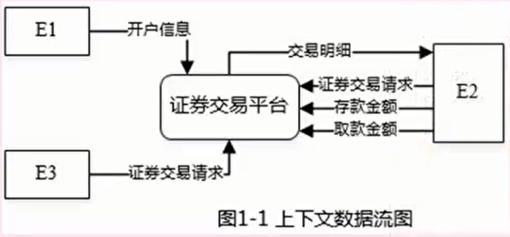
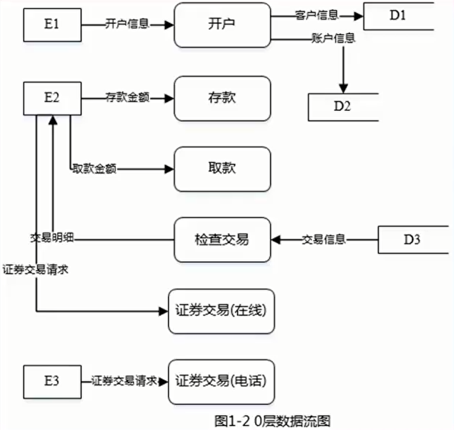

# 应用技术

## 数据流图

|     数据流图     |
| :--------------: |
| 数据流图基本概念 |
| 数据流图设计原则 |
|     解题技巧     |
|     真题讲解     |

### 数据流图

* 数据流图描述数据在系统中如何被传送或变换，以及如何对数据流进行变换的功能或子功能，用于对功能建模，数据流图相关概念如图：

* 数据流图是可以分层的，从顶层（即上下文无关数据流）到0层、1层等，顶层数据流图只含有一个加工处理表示整个管理信息系统，描述了系统的输入和输出，以及和外部实体的数据交互。数据流图示例如下：

  

  

  

### 数据字典

* 数据字典是用来定义在数据流图中出现的符号或者名称的含义，在数据流图中，每个存储、加工、实体的含义都必须定义在数据字典中，并且父图和子图之间这些名称要相同。示例如下：

  

  ### 数据流图设计原则

* 数据流图基本设计原则：
  * 数据守恒原则：对任何一个加工来说，其所有输出数据流中的数据必须能从该加工的输入数据流中直接获得，或者说是通过该加工能产生的数据。
  * 守恒加工原则：对同一个加工来说，输入与输出的名字必须不相同，即使它们的组成成分相同
  * 对于每个加工，==必须既有输入数据流，又有输出数据流==
  * 外部实体与外部实体之间不存在数据流w
  * 外部实体与数据存储之间不存在数据流
  * 数据存储与数据存储之间不存在数据流
  * ==父图与子图的平衡原则==：子图的输入输出数据流同父图相应加工的输入输出数据流必须一致，此即父图与子图的平衡。父图与子图之间的平衡原则不存在于单张图
  * 数据流与加工有关，且必须经过加工

### 数据平衡原则

* 父图与子图间平衡：顶层图中，描述了外部实体和系统之间的数据流关系，在0层图中，展开系统，变成了外部实体和系统内部更详细的数据流关系，但是，顶层和0层互为父图、子图关系，其输入、输出数据流个数和名称不应该发生变化，也即应该保持平衡，在解题中，可以关注父图、子图中的外部实体的输入、输出数据流个数、名称是否相同，就可以确认是否缺少数据流。
* 子图内平衡：对于子图内的每一个加工，要求既要有输入，也要有输出，才是数据平衡，根据这一原则，可以对每个输入进行判断，是否有相应的输出，反之亦然，就可以知道是否缺少某条数据流，从而进行对应的补充。
* 并且数据流只能和加工有关，即从加工流向加工、数据源流向加工或者加工流向数据源。
* 输入数据流和输出数据流名称不能相同，类型必须匹配。

### 解题技巧

* 数据流图的考试形式非常固定，第一小题补充外部实体，第二小题补充数据存储，第三小题补充缺失数据流，第四小题考察简单概念。都不算难，以题目描述和数据流图为主，答案都在题目描述里，更像是阅读理解题，技巧如下：
  1. ==补充外部实体==：外部实体就是与系统进行交互的其他实体，可以是大型系统、公司部门、相关人员等，外部实体会与系统进行交互，反应在数据流图中就是一个个事件流，依据事件的名称结合题目描述可以轻易得出答案。
  2. ==补充数据存储==：数据存储出现在0层数据流图中，反应系统内部数据的存储，可以直接根据数据流图中数据存储的输入数据流和输出数据流判断该数据存储的信息得出答案，但注意要使用题目说明的数据存储名词作为答案。
  3. ==补充缺失数据流==：可以分成两步进行，首先判断父图和子图是否数据平衡，依据父图和子图间的数据平衡原则核对父图中的每个输入、输出数据流是否都能在子图中找到，直接看外部实体的输入、输出数据流，可以轻易得出答案；而后判断子图内部是否数据平衡，依据子图内数据平衡原则，详细阅读题目描述，对每句话一一核对是否反映子图中，以及每个加工是否都有输入、输出等原则判断。一般父图中的缺失数据流在是由子图中多条数据流组成的，要注意分析。

### 真题讲解1

> 答案：
>
> 1. E1：客户服务助理，E2：客户，E3：经纪人
> 2. D1：客户记录，D2：账户记录，D3：交易记录 
> 3. 问题三
>    * 缺失数据流1
>      * 名称：修改账户余额，起点：存款，终点：D2。
>      * 理由：从试题说明“客户可以向其账户中存款，根据存款金额修改账户余额”可以看出，这个功能有操作“根据存款金额修改账户余额”。据此可以了解到从该功能应有数据流“存款”至D2,而0层图没有。
>    * 缺失数据流2：
>      * 名称：修改账户余额，起点：取款，终点：D2。
>      * 理由：从试题说明“客户可以从其账户中取款，根据取款金额修改账户余额”可以看出，这个功能有操作“根据取款金额修改账户余额”。据此可以了解到从该功能应有数据流“取款”至D2,而0层图没有。
>    * 缺失数据流3-4
>      * 名称：交易信息存入交易记录，起点：证券交易（分为在线与电话），终点：D3。
>      * 理由：从试题说明“客户和经纪人均可以进行证券交易，将交易信息存入交易记录中”可以看出，这个功能有操作“将交易信息存入交易记录中”。据此可以了解到从该功能应有数据流“证券交易”至D3,而0层图没有。
> 4. 问题4
>    * 图1增加外部实体“证券交易中心”，增加“证券交易平台”到“证券交易
>      中心”，数据流：交易信息
>    * 图2增加外部实体“证券交易中心”，增加“证券交易（在线）“到“证券交易中心”，数据流：交易信息
>    * 图2增加“证券交易（电话）“到“证券交易中心”，数据流：交易信息
>    * 问题4强调实际的证券交易通常是在证券交易中心完成，这个证券交易中心属于典型的外部实体，所以需要增加外部实体证券交易中心。由于该平台的证券交易功能需将交易信息传递给证券交易中心，因此将原来证券交易中的交易信息的数据流终点改为证券交易中心，数据流检测交易中的起点改为证券交易中心。

### 真题讲解2

> 答案：
>
> * 问题1：
>   * E1:巴士司机
>   * E2:机械师
>   * E3:会计
>   * E4:主管
>   * E5:库存管理系数
>   * 问题1补充外部实体，从题干说明1)没有明确说明由巴士到车库后由谁提供待维修问题，图1-1中的E1,考察说明中3)中最后一句说明“巴士司机可查看已维修机械问题”可以看出，从系统到巴士司机有输出数据流“已维修机械问题”，可知E1为巴士司机。从2)中“机械师根据维修记录文件中的待维修机械问题，完成对巴士的维修，登记维修情况”；再看说明4)中机械师提供维修工时，可以看出，从E2到系统有输入数据流“维修工时”、输出数据流“待维修机械问题”，可知E2为机械师，还将维修总结发送给主管，即系统到E4有输出数据流“维系总结”，可知E4为主管从说明5)将维修工时和所用部件成本详细信息给会计，从系统到3有输出数据流“维修工时和所用部件成本详细信息”，可知3为会计。说明3)中将所用部件清单发送给库存管理系统以对部件使用情况进行监控，及系统到E5有输出数据流“所用部件清单”，可知E5为库存管理系统。
>
> * 问题2：
>   * D1:巴士列表文件
>   * D2:维修记录文件
>   * D3:部件清单
>   * D4:人事档案
>   * 问题2补充数据存储，根据题目描述，1)对应处理“记录巴士D和维修问题”，将巴士D记录在巴士列表文件中，可知D1为巴士列表文件。说明2)对应处理“确定所需部件”，将维修所需部件在部件清单中进行标记，可知以D3为部件清单。说明1)中将待维修机械问题记录在维修记录文件中，可知D2为维修记录文件。说明4)对应处理“记录维修工时“，描述了将机械师提供的维修工时记录在人事档案中，可以判定D4是人事档案
> * 问题3：
>   * 图1-2中处理3只有输出数据流，没有输入数据流。D2和D3是黑洞，只有输入的数据流，没有输出的数据流。父图与子图不平衡，图1-2中没有图1-1中的数据流“维修情况”
> * 问题4：
>   * 针对【问题3】分析图1-2中存在的问题，题目要求以补充数据流的方式解决，进一步分析说明，说明3)对应处理“完成维修”，机械师根据维修记录文件中的待维修机械问题完成对巴士的维修，可知处理完成维修需要从维修记录文件读取待维修问题，补充一条从D2到处理3的数据流“待维修机械问题”。说明5)对应处理“计算维修总成本”，需要计算部件清单中实际所用部件，补充从部件清单到计算总成本的数据流“实际所用部件”。说明3)中机械师要登记维修情况，判定图1-2中缺少了2到处理3的数据流“维修情况”。到此为止所有缺失的数据流都补齐了，也解决了【问题3】中的平衡问题、处理只有输出数据流没有输入数据流的问题，D2和D3也既有输入数据流，又有输出数据流。
>   * 

## 数据库设计

|     数据库设计      |
| :-----------------: |
|   E-R图和关系模式   |
| E-R图转换为关系模式 |
|      解题技巧       |
|      真题讲解       |

### E-R图

* E-R图：即实体联系图，使用椭圆表示属性（一般没有）、长方形表示实体、菱形表示联系，联系两端要标注联系类型。

* 联系类型：一对一1：1、一对多1：N、多对多M:N。

* 实体和子实体（之间直接用直线连接，是从属关系，无联系类型）；

* 多个实体一个类型（一般是三个实体连接到一个类型上，本质也是两两对应的联系关系，根据题目说明，若有三个实体相关，则是此种情况）；

* 主键和外键（主键是本关系内唯一，外键是其他关系的主键，外键可以有多个）

  

### 关系模式

* 关系模式就是以名称和属性名表示一个联系，如下：
  * 客户（客户D、姓名、身份证号、电话、住址、账户余额）
  * 员工（工号、姓名、性别、岗位、身份证号、电话、住址）
  * 家电（家电条码、家电名称、价格、出厂日期、(1））
  * 家电厂商（厂商D、厂商名称、电话、法人代表信息、厂址、(2)）
  * 购买（订购单号、(3）、金额）
* 主键：不能为空，能唯一标识当前关系的属性
* 外键：其他关系模式的主键或者为空

### E-R图转化为关系模式

* E-R图中，有实体和联系两个概念，实体和实体之间的联系分为三种，即1：1,1：N,M:N这三种情况，转换为关系模式的方法也不同
* 首先，每个实体都要转换为一个关系模式，对于联系，一对一，联系作为一个属性随便加入哪个实体中；一对多，联系可以单独转换为一个关系模式，也可以作为一个属性加入到N端中(N端实体包含1端的主键)；多对多，联系必须单独转换为一个关系模式（且此关系模式应该包含两端实体的主键）
* 转换之后要注意：原来的两个实体之间的联系必须还存在，能够通过查询方式查到对方
* 在实际解题时，要注意，某个实体的属性，还应该包括其联系属性，具体问题具体分析

### 解题技巧

* 数据库设计的考法也非常固定，第一小题==补充E-R图==，第二小题补充关系模式，第三小题是简单的情景问答题。同样也都不难，结合题目描述和E-R图的一些特点可以轻易得出答案，技巧如下：
  1. 补充E-R图：这是重中之重，E-R图如果弄错了，后续题目都有影响，主要是根据题目描述确认哪些实体之间有联系，联系类型是哪一种，==而后进行连线==即可，并不难。
  2. 补充关系模式：实际考察的是将E-图转换为关系模式，补充缺失的属性，分成两步：首先需要审题，题目会给出每个关系模式的属性信息，先将题目中的==属性信息==和问题对应，将缺少的属性全部补充；而后再按照规则转换，即前面所说的规则，按联系的三种对应方式决定要添加哪些字段。
  3. 情景问答：一般都是给出一段新的描述，要求新增一种实体-联系类型和关系模式，本质也是==考察联系类型和E-R图转换为关系模式==。

###  真题讲解1

> 
>
> 
>
> 

### 真题讲解2

> 
>
> 

