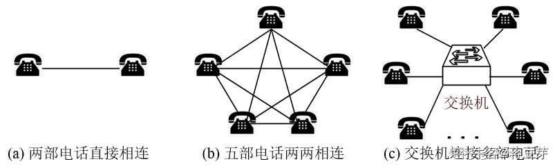
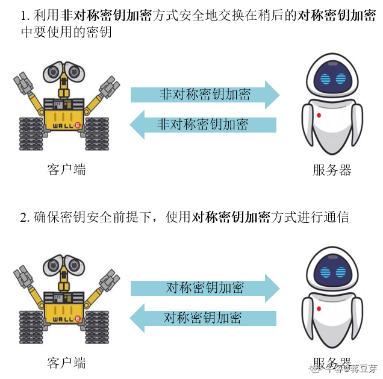
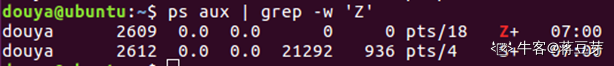
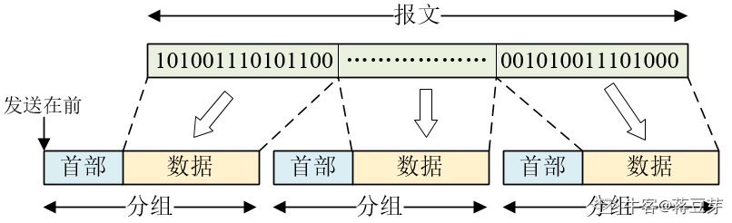

# C++面经

## 第一章 C语言

### 第一节

#### 章节内容

- 1.1 main函数
- 1.2 If else
- 1.3 Switch、break
- 1.4 For、while、do-while
- 1.5 枚举
- 1.6 结构体与共用体

#### 1.1 main函数

==`main`常有两个参数，一个是`int argc`, 一个是`char* argv[]`==

* 第一个参数，`int`型的`argc`，为整型，用来统计程序运行时发送给`main`函数的命令行参数的**个数**。

* 第二个参数，`char*`型的`argv[]`，为字符串数组，用来存放指向字符串的**指针元素**，每一个**指针元素**指向一个字符串参数。各成员含义如下: 

- `argv[0]`指向程序运行的全路径名
- `argv[1]`指向在DOS命令行中执行程序名后的第一个字符串
- `argv[2]`指向执行程序名后的第二个字符串
- `argv[argc-1]`指向执行程序名后的最后一个字符串
- `argv[argc]`为`NULL`

**Q**: 带参数的`main`函数可以通过使用命令行的方式来调用exe执行文件，并传入参数，这是linux操作系统下常见的调用程序的方式，我们通过命令行传入参数，**那么某些关键的参数不用固定死，这样程序灵活性大大增强**。下面我们通过一个例子来感受一下带参数的`main`函数如何使用。

一个典型的例子: 

```c
int main(int argc, char ** argv)
{  
    int i;  
    for (i = 0; i < argc; i++)  
        printf("Argument %d is %s\n", i, argv[i]);  
    return 0;  
}  
```

打开命令行窗口，切换目录到我们的执行文件的目录下，输入参数: 

```c
"ConsoleApplication5.exe" a b c d
    
结果:
	Argument 0 is ConsoleApplication5.exe
    Argument 1 is a
    Argument 2 is b
    Argument 3 is c
    Argument 4 is d
```

#### 1.2 If else

`if-else`分支语句是C语言程序中必不可少的组成，理解清楚细节很有必要。`If-else`注意**两个原则**: 

1. `if-else`最近匹配原则: `else`与其上面最近的一个if语句配对。
2. 如果没有大括号，`if-else`的作用域仅仅是紧跟的第一条语句。

#### 1.3 Switch、break

第三题:

```c
1.    int main(){  
2.        int i = 2;  
3.        int result = 0;  
4.        switch (i) {  
5.            case 1:  
6.                result = result + i;  
7.            case 2:  
8.                result = result + i * 2;  
9.            case 3:  
10.                result = result + i * 3;  
11.        }  
12.    }  
```

**A**: 就`switch`语句嘛，`i`判断为2，程序运行到7处然后就结束了。

**Q**: 你确定就结束了吗? 你发现少了什么东西? 

**A**: 少了什么? 

**Q**: **刚入门的同学总是会犯这样的错误，`case`后面不跟关键字break。**

**A**: 对哦，但是少了`break`又会有什么影响呢? 

**Q**: 在C语言中，`case`语句后面缺少`break`，那么程序就往下执行，直到遇见`break`才跳出`switch`结构，因此，程序的运行路径是1->2->3->4->7->8->9->10，所以最后的输出是`result=10`

**A**: 原来是这样啊，难怪难怪，害，看样子还是细节掌握不到位啊。

**Q**: 还有，在程序的编程中，希望大家养成良好的习惯，`switch`，`case`，`default`，`break`一个都不要少，而且尽量不要刻意缺失`break`，这是为了方便他人理解程序。

#### 1.4 For、while、do-while

**Q**: `for`，`while`，`do-while`。这三种形式在C语言中都有，但是根据使用情况来看，**程序员对其热爱程度从左到右依次减弱**，常使用的是`for`和`while`两种，主要容易出现的问题就是循环的控制，这个特别注意就行，每当编写循环结构就多问问自己，是不是要注意。

最后循环结构需要注意的就是内外循环问题，为了效率高，应该是大循环放小循环里面，如: 

```c
for (int i=0; i<4; i++)
{  
    for (int j=0; j<100; j++)
    {  
        ;  
    }  
}  
```

**Q**: 而`do-while`虽然使用频率不及`for`，`while`，但它也有特殊的妙用。

**A**: 哦? 有点意思。

**Q**: 我们都知道，`do{…}while(condition)`可以表示循环，但有时候我们可能在一些宏定义中也用到了`do{…}while`，如: 

```c
#define Student(x) do{\  
    statement one;\  
    statement two;\  
}while(O)  // 这里没有分号  
```

**A**: 怎么看着这么奇怪啊? 这里并没有循环的逻辑，`do…while(0)`有什么意义呢? 

**Q**: A别急，听我慢慢道来。我们再来看下这个宏: 

```c
#define Student(x) {\  
    statement one;\  
    statement two;\  
}  
```

这两个看似一样的宏，其实是不一样的。前一个宏是一个非复合语句，而后者却是一个复合语句。假如有这样的使用场景: 

```c
if (condition)  
    Student(x);  
else  
    ....;  
```

接着我们将宏展开会变成: 

```c
if (condition)  
    statement one;  
    statement two;  
else  
    ....;  
```

而我们刚才讲`if-else`结构时已经讲过了，这样的展开符合我们程序的逻辑吗? 

**A**: 不符合，所以`do…while(0)`是起到这个作用啊，即使宏展开后，`do…while(0)`仍然保留初始的语义，从而保证程序正确的逻辑。

```c
if (condition) 
{ 
    statement one;  
    statement two;
}
else  
    ....;  
```

**Q**: 没错，就是这样！`do…while(0)`一出手，一看就是老程序员了呀，哈哈！讲到循环结构，和递归结构有着一些相同点和不同点，不过我们以后讲算法设计时再着重展开讲。

#### 1.5 枚举

**Q**: 好了，我们继续讲一些语言细节，讲讲**枚举**。

==枚举类型==(enumeration)是C语言和C++中的一种**派生数据类型**，它是由用户定义的若干枚举常量的集合。

如果一个变量只有几种可能的值，可以定义为枚举(enumeration)类型。**所谓"枚举"是指将变量的值一一列举出来**，变量的值只能在列举出来的值的范围内。

创建枚举，需要使用关键字 `enum`。枚举类型的一般形式为: 

```c++
enum 枚举名
{ 
     标识符[=整型常数], 
     标识符[=整型常数], 
     ... 
     标识符[=整型常数]
} 枚举变量;
```

如果枚举没有初始化, 即省掉"=整型常数"时, 则从第一个标识符开始。

例如，下面的代码定义了一个颜色枚举，变量`c` 的类型为`color`。最后，`c` 被赋值为 "`blue`"。

```c
enum color { red, green, blue } c;
c = blue;
```

默认情况下，第一个名称的值为 0，第二个名称的值为 1，第三个名称的值为 2，以此类推。

**A**: 嗯? 这不很简单吗? 

**Q**: 那A，你看看下面的代码中，`red`是多少? 

```
enum color { red, green=5, blue };
```

**A**: emmm，既然`green=5`，那`red`就是4吧? 

**Q**: (得意一笑)看吧，你又不确定了，所以没那么简单哟。**red 的值依然为 0**。反正你记住，默认情况下，==enum的值是从0开始的==，而 **green** 的值为 5。那么 **blue** 紧接着的值为 6，因为默认情况下，每个名称都会比它前面一个名称大 1。

这些语言细节题，不论笔试还是面试都是经常考的，一定要牢牢记住。

#### 1.6 结构体与共用体

**Q**: 好，加油哦！那我们继续讲结构体和共用体。

C/C++ 数组允许定义可存储相同类型数据项的变量，但是**结构体**是 C++ 中另一种用户自定义的可用的数据类型，它允许存储不同类型的数据项。

下面是声明一个结构体类型 **Books**，变量为 **book**: 

```c
struct Books
{
   char  title[50];
   char  author[50];
   char  subject[100];
   int   book_id;
} book;
```

**==共用体==**是一种特殊的数据类型，允许在相同的内存位置存储不同的数据类型。可以定义一个带有多成员的共用体，但是**任何时候只能有一个成员带有值**。共用体提供了一种使用相同的内存位置的有效方式。

```c
union Data
{
   int i;
   float f;
   char  str[20];
} data;
```

**A**: 那两者有什么区别吗? 

**Q**: 结构体和共用体最大的区别就是，两者内存的使用方式不一样。

1. 结构体占用的内存是所有的成员各自占用的内存空间之和。
2. 共用体占用的内存则不同，等于占用内存空间最大的那个成员。

注意，这里我们先不考虑字节对齐的情况。

例如，我们给出一个实例: 

```c
struct Data1
{
   int i;
   float f;
   char  str[20];
} data1;

union Data2
{
   int i;
   float f;
   char  str[20];
} data2;

sizeof(data1);
sizeof(data2);
```

运行结果如下: 

```c
//4字节(int)+4字节(float)+20字节(char str[20])之和
28
//占用空间最大的成员为20字节(char str[20])
20
```

共用体是共用内存空间，**所以每个成员都是读写同一个内存空间，那么内存空间里面的内容不停的被覆盖，而同一时刻，都只能操作一个成员变量**。

如果不这样做会产生什么后果: 

```c
#include <stdio.h>
#include <string.h>

union Data
{
   int i;
   float f;
   char  str[20];
};

int main( )
{
   union Data data;        

   data.i = 10;
   data.f = 220.5;
   strcpy( data.str, "C Programming");

   printf( "data.i : %d\n", data.i);
   printf( "data.f : %f\n", data.f);
   printf( "data.str : %s\n", data.str);

   return 0;
}
```

比如这段代码，我们在同一时间三次操作不同的成员，来看看结果: 

```c
data.i : 1917853763
data.f : 4122360580327794860452759994368.000000
data.str : C Programming
```

在这里，我们可以看到共用体的 **i** 和 **f** 成员的值有损坏，因为最后赋给变量的值占用了内存位置，这也是 **str** 成员能够完好输出的原因。现在让我们再来看一个相同的实例，**这次我们在同一时间只使用一个变量**，这也演示了使用共用体的主要目的: 

```c
#include <stdio.h>
#include <string.h>

union Data{
   int i;
   float f;
   char  str[20];
};

int main( ){
   union Data data;        

   data.i = 10;
   printf( "data.i : %d\n", data.i);

   data.f = 220.5;
   printf( "data.f : %f\n", data.f);

   strcpy( data.str, "C Programming");
   printf( "data.str : %s\n", data.str);

   return 0;
}
```

当上面的代码被编译和执行时，它会产生下列结果: 

```c
data.i : 10
data.f : 220.500000
data.str : C Programming
```

在这里，**所有的成员都能完好输出，因为同一时间只用到一个成员**。

### 第二节

#### 常考面试题

1. `int main(int argc, char ** argv)`函数中，参数`argc`和`argv`分别代表什么意思? 

   第一个参数，`int`型的`argc`，为整型，用来统计程序运行时发送给`main`函数的命令行参数的**个数**。

   第二个参数，`char*`型的`argv[]`，为字符串数组，用来存放指向字符串的**指针元素**，每一个**指针元素**指向一个字符串参数。各成员含义如下: 

   - `argv[0]`指向程序运行的全路径名
   - `argv[1]`指向在DOS命令行中执行程序名后的第一个字符串
   - `argv[2]`指向执行程序名后的第二个字符串
   - `argv[argc-1]`指向执行程序名后的最后一个字符串
   - `argv[argc]`为`NULL`

2. 结构体和共用体的区别

   1. `struct`和`union`都是由多个不同的数据类型成员组成。 `struct`的所有成员都存在；但在任何同一时刻, `union`中只存放了一个被选中的成员。
   2. 在不考虑字节对齐的情况下，`struct`变量的总长度等于所有成员长度之和。`Union`变量的长度等于最长的成员的长度。
   3. `struct`的不同成员赋值是互不影响的；而对于`union`的不同成员赋值, 将会对其它成员重写, 原来成员的值就不存在了。

3. 使用共用体读写成员时需要注意什么? 

   共用体是共用内存空间，**所以每个成员都是读写同一个内存空间，那么内存空间里面的内容不停的被覆盖，而同一时刻，都只能操作一个成员变量**。否则会出现读错误。

4. `do…while(0)`的作用

   1. `do…while(0)`使复杂的宏在展开时，能够保留初始的语义，从而保证程序正确的逻辑。
   2. 避免使用`goto`控制程序流。由于`goto`不符合软件工程的结构化，而且有可能使得代码难懂，不倡导使用，这个时候我们可以使用do{...}while(0)来做同样的事情。

### 第三节

#### 章节内容

- 1.7 函数——原来你是这样的函数
- 1.8 全局变量与静态变量详解
- 1.9 数据类型详解
- 1.10 类型转换
- 1.11 谁先谁后——把人搞疯的优先级
- 1.12 震惊——位运算还可以这样用

#### 1.7 函数细节

当调用函数时，有三种向函数传递参数的方式: 

| 调用类型 |                             描述                             |
| :------: | :----------------------------------------------------------: |
| 传值调用 | 该方法把参数的实际值赋值给函数的形式参数。在这种情况下，修改函数内的形式参数对实际参数没有影响。 |
| 指针调用 | 该方法把参数的地址赋值给形式参数。在函数内，该地址用于访问调用中要用到的实际参数。这意味着，修改形式参数会影响实际参数。 |
| 引用调用 | 该方法把参数的引用赋值给形式参数。在函数内，该引用用于访问调用中要用到的实际参数。这意味着，修改形式参数会影响实际参数。 |

默认情况下，C++ 使用**传值调用**来传递参数。一般来说，这意味着函数内的代码不能改变用于调用函数的参数。关于引用传参的方式会在后面的C++章节讲述.

#### 1.8 全局变量与静态变量详解

**Q**: Q: 好了，这就是函数的细节，接下来我们讲解**全局变量与静态变量。**

**Q**: C语言变量作用域。作用域是程序的一个区域，一般来说有三个地方可以定义变量: 

- 在函数或一个代码块内部声明的变量，称为局部变量。
- 在函数参数的定义中声明的变量，称为形式参数。
- 在所有函数外部声明的变量，称为全局变量。

根据编程规范而言，一般情况下，尽量少用甚至不用全局变量。

1. **局部变量**

   在函数或一个代码块内部声明的变量，称为局部变量。它们只能被函数内部或者代码块内部的语句使用。

2. **全局变量**

   在所有函数外部定义的变量(通常是在程序的头部)，称为全局变量。全局变量的值在程序的整个生命周期内都是有效的。

**Q**: 关于**全局变量与静态变量**，我要特别提到一种情况。在程序中，**局部变量和全局变量的名称可以相同**，**但是在函数内**，**局部变量的值会覆盖全局变量的值**。下面是一个实例: 

```c
#include <stdio.h>

// 全局变量声明
int g = 20;

int main (){
  // 局部变量声明
  int g = 10;
  printf("g = %d\n", g);
  return 0;
}
```

运行结果是: 

```c
g = 10
```

**Q**: 关于**初始化**局部变量和全局变量，也需要注意。**当局部变量被定义时，系统不会对其初始化，必须自行对其初始化。定义全局变量时，系统会自动初始化为下列值**: 

| 数据类型 | 初始化默认值 |
| :------: | :----------: |
|   int    |      0       |
|   char   |     ‘\0’     |
|  float   |      0       |
|  double  |      0       |
| pointer  |     NULL     |

正确地初始化变量是一个良好的编程习惯，否则有时候程序可能会产生意想不到的结果。

我们再给出一道笔试面试最喜欢考的关于**全局变量和局部变量的**题。

```c
#include <stdio.h>  
#include <stdlib.h>  

int n = 10;  //全局变量  
void func1() 
{  
    int n = 20;  //局部变量  
    printf("func1 n: %d\n", n);  
}  
void func2(int n) 
{  
    printf("func2 n: %d\n", n);  
}  
void func3() 
{  
    printf("func3 n: %d\n", n);  
}  
int main() 
{  
    int n = 30;  //局部变量  
    func1();  
    func2(n);  
    func3();  
    //代码块由{}包围  
    {  
        int n = 40;  //局部变量  
        printf("block n: %d\n", n);  
    }  
    printf("main n: %d\n", n);  
    system("Pause");  
    return 0;  
}  
```

A，这道题不难，自己思考思考，再对照答案看自己有没有想对吧。

```c
func1 n: 20
func2 n: 30
func3 n: 10
block n: 40
main n: 30
```

#### 1.9 数据类型

原码与补码

**整型数据**的存储涉及到**原码、反码、补码**的概念。数值在计算机的存储里，最左边的一位代表**符号位**，0代表正数，1代表负数。

1. **原码**: 为二进制的数，如: 10 原码为0000 1010

2. **反码**: 正数的反码与原码相同: 如: 10 原码为0000 1010，反码为0000 1010

 负数为原码0变1，1变0，(符号位不变): 如: -10 原码为1000 1010，反码为1111 0101

3. **补码**: 正数的补码与原码相同: 如: 10 原码为0000 1010，补码为0000 1010

 负数的补码为反码加1: 如: -10 反码为1111 0101，补码为1111 0110

**A**: 有意思，我之前从来没注意过。

**Q**: 2. 存储**实型数据**时，分为**符号位**、**阶码**和**尾数**三部分，如图。


例如: 实数-1.2345e+02是负数，阶码是2，尾数是1.2345

**Q**: 3. 字符型的存储，每个**字符**在内存中占用**一个字节**，存储它的ASCII码。例如字符型常量‘A’的ASCII码为65，它在内存中以下列形式存放: 



**Q**: 4. 然后我们需要记住每个数据类型占用的字节数，太常考了，面试笔试题经常让分析结构体占内存大小。记住两点: 

1. ==各数据类型占用字节大小无论是win32位还是win64位下，都是一样的==

2. ==指针类型占用字节大小32位还是64位下是**不一样**的==

注: 这里要单独说一下long，比较特殊，只需要记住==long在linux 64位下是8字节==。如何分析结构体占内存大小，以后的章节我们会专门讲解。

#### 1.10 类型转换

**Q**: 我们说一下类型转换，这也是常考题，来测试我们基础是否扎实。在一个运算表达式中，往往存在**自动类型转换**的情况。例如: 设变量`a`的类型是`char`，变量`b`的类型是`int`，变量`d`的类型是`double`，求解**表达式`a+b-d`**。运算次序是: 先计算`a+b`，将`a`转换为`int`型后求和，结果是`int`型；再将`a+b`的和转换为`double`型，再与`d`相减，结果是`double` 型。

1. **自动类型转换**记住一个图就可以了。


```c
int sum = 7;  
double mean = sum / 5;
```

**A**: 简单！既然是`double`型，`mean`是1.4

**Q**: (嘴角一翘)但是结果却是1.0，因为`sum`是`int`型，`sum / 5`，小数点后面的数字会丢失，结果是1，再转为`double`，最后是1.0。出现了精度丢失的问题

**强制类型转换**，强制类型转换是把变量从一种类型转换为另一种数据类型。这时对`int`类型的`sum`强制转换为`double`类型。最后结果就是1.4了

```c
int sum = 17;
double mean = (double) sum/5；
```

**A**: (嘻嘻)好的，我明白了。Q，继续。

#### 1.11 优先级

==运算符优先级==，运算符优先级也爱考，无非就是因为运算符太多，很难搞清楚谁先运算谁后运算，在我们平时编程时，其实用不着秀操作，怎么清楚怎么来，所以搞不清楚没关系，加括号就对了！但是面试笔试**偶尔考**，所以我们还是有必要学习一下。



这里一定要提醒下，==位运算符`&、^、|`，是比逻辑运算符`&&、||`优先级高的==。比如: 

```c
printf("%d", 2 & (3 && 5)); // 0
printf("%d", 2 & 3 && 5);   // 1
```


#### 1.12 位运算

位运算是针对整型数据而言，即针对每一位进行操作。

位运算符作用于位，并逐位执行操作。&、 | 和 ^ 的真值表如下所示: 

|  p   |  q   | p & q | p \| q | p ^ q |
| :--: | :--: | :---: | :----: | :---: |
|  0   |  0   |   0   |   0    |   0   |
|  0   |  1   |   0   |   1    |   1   |
|  1   |  1   |   1   |   1    |   0   |
|  1   |  0   |   0   |   1    |   1   |

假设如果 A = 60，且 B = 13，现在以二进制格式表示，它们如下所示: 

```c++
A = 0011 1100

B = 0000 1101

-----------------

A&B = 0000 1100

A|B = 0011 1101

A^B = 0011 0001

~A = 1100 0011
```


下表显示了 C语言支持的位运算符。假设变量 A 的值为 60，变量 B 的值为 13，则: 

| 运算符 |                             描述                             |                             实例                             |
| :----: | :----------------------------------------------------------: | :----------------------------------------------------------: |
|   &    | 如果同时存在于两个操作数中，二进制 AND 运算符复制一位到结果中。 |              (A & B) 将得到 12，即为 0000 1100               |
|   \|   |  如果存在于任一操作数中，二进制 OR 运算符复制一位到结果中。  |              (A \| B) 将得到 61，即为 0011 1101              |
|   ^    | 如果存在于其中一个操作数中但不同时存在于两个操作数中，二进制异或运算符复制一位到结果中。 |              (A ^ B) 将得到 49，即为 0011 0001               |
|   ~    | 二进制补码运算符是一元运算符，具有"翻转"位效果，即0变成1，1变成0。 | (~A ) 将得到 -61，即为 1100 0011，一个有符号二进制数的补码形式。 |
|   <<   |  二进制左移运算符。左操作数的值向左移动右操作数指定的位数。  |              A << 2 将得到 240，即为 1111 0000               |
|   >>   |  二进制右移运算符。左操作数的值向右移动右操作数指定的位数。  |               A >> 2 将得到 15，即为 0000 1111               |

**Q**: **位运算最大的特点就是运算效率十分高**，对于嵌入式这样的领域，学好用好位运算往往给人耳目一新的感觉。比如用左移`<<`和右移`>>`操作来替代`*2`和`/2`；我们可以用或操作符`|`将数的高四位置1，如:

3 | 1111 0000 = 1111 0011；

我们可以用与操作符`&`将数的某一位置0，如:

3 & 1111 1101 = 0000 0001，

此时将3的第二位置0。

位运算总是给人意想不到的惊喜。

比如我们可以用位运算来代替`swap`函数交换两个变量的值。

```c
void my_swap(int a, int b) {  
    printf("a = %d, b = %d\n", a, b);  
    a = a^b;  
    b = a^b;  
    a = a^b;  
    printf("a = %d, b = %d\n", a, b);  
}  
```

运行结果如下: 

```c
a = 1, b = 2
a = 2, b = 1
Press any key to continue...
```

### 第四节

#### 常考面试题

1. 简述C++有几种传值方式，之间的区别是什么? 

   传参方式有这三种: **值传递、引用传递、指针传递**

   1. 值传递: 形参即使在函数体内值发生变化，也不会影响实参的值；
   2. 引用传递: 形参在函数体内值发生变化，会影响实参的值；
   3. 指针传递: 在指针指向没有发生改变的前提下，形参在函数体内值发生变化，会影响实参的值；

2. 为什么值传递不改变实参的值? 

   因为在函数传参的过程中，**函数会为形参申请新的内存空间，并将实参的值复制给形参**。形参的改变当然不会影响实参的值。

   要想影响实参的值，可以使用**指针传递**。在C++中，可以使用**引用传递**。

3. 全局变量和局部变量的区别

   1. 作用域不同: 全局变量的作用域为整个程序，而局部变量的作用域为当前函数或循环等
   2. 内存存储方式不同: 全局变量存储在全局数据区中，局部变量存储在栈区
   3. 生命期不同: 全局变量的生命期和主程序一样，随程序的销毁而销毁，局部变量在函数内部或循环内部，随函数的退出或循环退出就不存在了
   4. 使用方式不同: 全局变量在声明后程序的各个部分都可以用到，但是局部变量只能在局部使用。函数内部会优先使用局部变量再使用全局变量。

4. 全局变量和局部变量如何初始化? 

   **当局部变量被定义时，系统不会对其初始化，必须自行对其初始化。定义全局变量时，系统会自动初始化为下列值**: 

   | 数据类型 | 初始化默认值 |
   | :------: | :----------: |
   |   int    |      0       |
   |   char   |     '\0'     |
   |  float   |      0       |
   |  double  |      0       |
   | pointer  |     NULL     |

   正确地初始化变量是一个良好的编程习惯，否则有时候程序可能会产生意想不到的结果。

5. 请说说原码、反码、补码

   **整型数值**在计算机的存储里，最左边的一位代表**符号位**，0代表正数，1代表负数。

   1. **原码**: 为二进制的数，如: 10 原码为0000 1010

   2. **反码**: 正数的反码与原码相同: 如: 10 原码为0000 1010，反码为0000 1010

    负数为原码0变1，1变0，(符号位不变): 如: -10 原码为1000 1010，反码为1111 0101

   3. **补码**: 正数的补码与原码相同: 如: 10 原码为0000 1010，补码为0000 1010

    负数的补码为反码加1: 如: -10 反码为1111 0101，补码为1111 0110

6. ==32位机器下，sizeof (char *)的大小是多少? 64位机器下呢? ==

   ==4个字节。 8个字节。==

### 第五节

#### 章节内容

- 1.13 面试技巧讲解
- 1.14 数组指针与指针数组
- 1.15 指针与字符串
- 1.16 指针与函数
- 1.17 指针与结构体

#### 1.13 面试技巧

> **Q**: 请问你熟悉**数组和指针**吗? 
>
> **A**: **数组**是相同类型数据的**集合**。
>
> 引入数组就不需要在程序中定义大量的变量，大大减少了程序中变量的数量，使程序精炼，而且数组含义清楚，使用方便，明确地反映了数据间的联系。
>
> 许多好的算法都与数组有关，如洗牌算法、冒泡排序等。同时数组也是一种数据结构，它的特点就是可以常数时间复杂度O1. 地访问元素，但是插入与删除元素是O(n)的时间复杂度，所以当需要频繁插入删除元素时，尽量不用数组，或对数组进行一些改进优化，比如C++ vector容器就是在数组的基础上进行改进优化，提高了数组操作效率。
>
> **A**: **指针**也是一种变量，但它和普通的变量的区别是，普通的变量存放的是实际的数据，而指针变量包含的是内存中的一块**地址**，这块地址指向某个变量或者函数。
>
> **指针**是C/C++语言的核心的概念，大大提高了程序的灵活性，但是同时也隐藏着危机，如==内存泄露、非法内存访问、野指针==等。所以为了规避这些问题，在后来的==C++11引入了智能指针==帮助程序员(点到为止，不继续延伸)。
>
> **A**: (**面试技巧一**: 熟悉的知识可以多说点
>
> **Q**: 数组指针和指针数组的区别。
>
> **A**: )**指针数组是多个指针变量，以数组的形式存储在内存中。**而数组指针不太确定，但是我可以说一下自己的理解吗? 
>
> **Q**: 当然，你可以试着推测一下。
>
> **A**: 根据字面意思，数组指针可能也是一个指针变量，而它指向了一个一维数组。
>
> **A**: (**面试技巧二**: 会的知识自信答出来，不会的知识可以直接说不知道，不确定的知识点可以推测推测。
>
> 面试真的一定要自信，少用“可能”，“但是”，多用“就是”，“是的”。不会的知识说明超出我们的储备范围了，不是广就是深，如果不会也不用担心，因为有些题可能是面试官的附加题或灵光一闪想到的问题，两三个问题不会，并不会特别影响最后的面试结果，所以不要因为一两个问题不会就自乱阵脚了，还是要自信，不会的问题我们就说不会，用不着去猜或者强行解释，强词夺理会给面试官留下不好的印象。
>
> 而有些问题虽然我们不确定，但是通过一些逻辑可以推测出来，这时我们可以跟面试官说: 这个我不确定，但是我可不可以根据逻辑说一下自己的理解。这样的回答会留给面试官正面的印象，知识不知道很正常，而具备逻辑思考能力，这也是面试官看重的素质。)
>
> **Q**: (满意点头)是这样的。那请问下面1. 2. 3. 4哪些操作是合法的。
>
> ```c
> #include <stdio.h>  
> #include <stdlib.h>  
> using namespace std;  
> int main() {  
>     int (*p)[4];  
>     int a[3][4];  
>     p = a;  
>     *(p[2] + 1) = 2;     //1  
>     *(*(p + 2) + 1) = 2; //2  
>     (*(p + 2))[1] = 2;   //3  
>     p[2][1] = 2;         //4  
>     printf("*(p[2]+1) = %d\n", *(p[2] + 1));  
>     printf("*(*(p+2)+1) = %d\n", *(*(p + 2) + 1));  
>     printf("(*(p+2))[1] = %d\n", (*(p + 2))[1]);  
>     printf("p[2][1] = %d\n", p[2][1]);  
>     system("Pause");  
>     return 0;  
> }  
> ```
>
> **A**: (一脸懵懂)4肯定是对的，1. 2. 3这样的操作很少见，不清楚是否合法。
>
> **Q**: 请问下面四条语句有什么区别? 
>
> ```c
> char str[] = "I am jiangfoo.";  
> char *str1 = "I am in Foo University.";  
> char *str2[] = { "I am a master." };  
> string str3 = "Foo loves you!";  
> ```
>
> **A**: `str`是字符串数组，`str1`是指针变量，指向字符串常量，`str2`指针变量，指向字符串数组，`str3`是一个字符串变量，`str3`是C++的`string`类型数据。

#### 1.14 数组指针与指针数组

数组与指针

数组:

> 一组数据的**集合**称为**数组(Array)**，它所包含的每一个数据叫做**数组元素**
>
> ```c
> int a[4];
> ```
>
> 在内存中分配了4个`int`类型的内存空间，共 4×4=16 个字节，并为它们起了一个名字，叫`a`。`a`同时也是**数组的首地址**。
>
> 数组中的每个元素都有一个序号，**这个序号从0开始**，而不是从我们熟悉的1开始，称为**下标**(Index)。

指针:

> 数据在内存中的地址也称为**指针**，如果一个变量存储了一份数据的指针，我们就称它为**指针变量**。
>
> **指针变量的值就是某份数据的地址**，这样的一份数据可以是数组、字符串、函数，也可以是另外的一个普通变量或指针变量。
>
> ```c
> int a = 100;
> int *p_a = &a;
> ```
>
> 在定义指针变量 `p_a` 的同时对它进行初始化，并将变量 `a` 的地址赋予它，此时 **`p_a` 就指向了 `a`**。值得注意的是，`p_a` 需要的一个地址，`a` 前面必须要加取地址符`&`，否则是不对的。

数组指针和指针数组的区别:

* 数组指针

> **数组指针**，也称行指针。假设有定义`int (*p)[n]`；且`()`优先级高，可以说明`p`是一个指针，且指向一个整形的一维数组。这个一维数组的长度是`n`，也可以说是`p`的步长，也就是说执行`p+1`，`p`要跨过`n`个整形数据的长度。如要将二维数组赋给一指针，应这样赋值: 
>
> ```c
> int a[3][4];  
> int (*p)[4];  //该语句是定义一个数组指针, 指向含4个元素的一维数组
> p = a;        //将该二维数组的首地址赋给p, 也就是a[0]或&a[0][0]
> p++;          //该语句执行过后, 也就是p=p+1；p跨过行a[0][]指向了行a[1][]
>               //所以数组指针也称指向一维数组的指针, 亦称行指针。
> ```
>
> **Q**: 那么我们回到刚才的问题，访问数组中第i行j列的一个元素，有几种操作方式，`*(p[i]+j)`、`*(*(p+i)+j)`、`(*(p+i))[j]`、`p[i][j]`。其中，优先级: `()>[]>*`。**这几种操作方式都是合法的**。
>
> 

* 指针数组

> 指针数组不同于数组指针，假设有定义`int *p[n]`；且`[]`优先级高，可以理解为先与p结合成为一个数组，再由`int *`说明这是一个整型指针数组，它有`n`个指针类型的数组元素。
>
> 这里若执行`p+1`操作则是错误的，`p=a`这样的赋值也是错误的，这里`*p=a`赋值才是正确的，这里`*p`表示指针数组第一个元素的值，`a`的首地址的值。指针数组每个元素的值存储的是地址(即指针)。
>
> ```c
> int a[3][4];  
> int *p[3];  
> for (int i=0; i<3; i++)  
>     p[i] = a[i];  
> ```
>
> 这里`int *p[3]`表示一个一维数组内存放这3个指针变量，分别是`p[0]`、`p[1]`、`p[2]`，所以要分别赋值。

数组指针和指针数组的==区别==: 

> **数组指针**是一个指针变量，指向了一个一维数组；
>
> **指针数组**是一个数组，只不过数组的元素存储的是指针变量。

#### 1.15 指针与字符串

**Q**: 我们再延伸一下，指针也常用于字符串，我们先介绍一下字符串。

字符串有两种风格: 

- C 风格字符串
- C++ 引入的 string 类类型

1. **C风格字符串**

   C 风格的字符串起源于 C 语言，并在 C++ 中继续得到支持。字符串实际上是使用 **null** 字符 **\0** 终止的一维字符数组。因此，一个以 null 结尾的字符串，包含了组成字符串的字符。

   下面的声明和初始化创建了一个 **DOUYA!** 字符串。由于在数组的末尾存储了空字符，所以字符数组的大小比单词 **DOUYA!** 的字符数多一个。

   ```c
   char str[7] = {'D', 'O', 'U', 'Y', 'A', '!', '\0'};
   ```

   依据数组初始化规则，可以把上面的语句写成以下语句: 

   ```c
   char str[] = "DOUYA!";
   ```

   以下是 C/C++ 中定义的字符串的内存表示: 

   

   其实，不需要把 **null** 字符放在字符串常量的末尾。**C++ 编译器会在初始化数组时，自动把 \0 放在字符串的末尾。**

2. **C++ 引入的 string 类类型**

   C++ 标准库提供了 **string** 类类型，支持所有的字符串操作，另外还增加了其他更多的功能。现在让我们先来看看下面这个实例: 

   ```c++
   #include <iostream> 
   #include <string>  
   using namespace std;  
   int main () {   
       string str1 = "foo! ";   
       string str2 = "hello";   
       string str3;   
       int  len ;    
       // 复制 str1 到 str3   
       str3 = str1;   
       cout << "str3 : " << str3 << endl;    
       // 连接 str1 和 str2   
       str3 = str1 + str2;   
       cout << "str1 + str2 : " << str3 << endl;    
       // 连接后, str3 的总长度   
       len = str3.size();   
       cout << "str3.size() :  " << len << endl;    
       return 0; 
   }
   ```

   结果如下: 

   ```c++
   str3 : foo! 
   str1 + str2 : foo! hello
   str3.size() :  12
   ```

**Q**: 然后我们再来看看**指针和字符串**之间的联系，如下面四条语句: 

```c
char str[] = "I am jiangfoo.";  
char *str1 = "I am in Foo University.";  
char *str2[] = { "I am a master." };  
string str3 = "Foo loves you!";  
```

`str`是字符数组，存储于**栈区**中；

==`str1`是指针变量，指向字符串常量==，并且此时的字符串常量字面值("I am in Foo University.")会被放到**代码段**中，不能被修改；`str1`是局部变量，存储于**栈区**中；

`str2`指针变量，指向字符数组，存储于**栈区**中；

`str3`是一个字符串变量，`str3`是C++的string类型数据。

#### 1.16 指针与函数

**Q**: 指针还可以与函数联系在一起。**函数指针**就是**指向函数**的指针变量。每一个函数都有一个入口地址，该入口地址就是函数指针所指向的地址。如下: 

```c
int func(int a);  
int (*f)(int a);  
f = &func; 
```

**A**: 那函数指针有什么用呢? 

**Q**: 函数指针的**应用场景是回调**(**callback**)。我们调用别人提供的 API函数(Application Programming Interface,应用程序编程接口)，称为**Call**；如果别人的库里面调用我们的函数，就叫**Callback**。

我们举个例子: 

```c
//以库函数qsort排序函数为例, 它的原型如下: 
void qsort(void *base,//void*类型, 代表原始数组
           size_t nmemb, //第二个是size_t类型, 代表数据数量
           size_t size, //第三个是size_t类型, 代表单个数据占用空间大小
           int(*compar)(const void *,const void *)//第四个参数是函数指针
          );
//第四个参数告诉qsort, 应该使用哪个函数来比较元素, 即只要我们告诉qsort比较大小的规则, 它就可以帮我们对任意数据类型的数组进行排序。在库函数qsort调用我们自定义的比较函数, 这就是回调的应用。

//示例
int num[100];
int cmp_int(const void* _a , const void* _b){//参数格式固定
    int* a = (int*)_a;    //强制类型转换
    int* b = (int*)_b;
    return *a - *b;　　
}
qsort(num,100,sizeof(num[0]),cmp_int); //回调
```

==指针函数==本质是一个函数，函数返回类型是某一类型的指针。

定义如下: 

```c
int *f(x，y);
```

**A**: 哦，这个简单，我懂了。就是函数返回值返回一个指针变量。

#### 1.17 指针与结构体

**Q**: 接下来我们来讲讲**指针与结构体**之间的联系，我们以一个实例来展示一下结构体指针强制类型转换的**巧妙应用**。看如下代码: 

```c
#include <stdio.h>

typedef struct Register 
{//寄存器
    int register1;
    int register2;
    int register3;
    int register4;
}tregister;  

int main()
{
    int initArr[] = {1,0,1,1};
    tregister *p = (tregister *)initArr;

    printf("Register1 = %d\n", p->register1);  // 1
    printf("Register2 = %d\n", p->register2);  // 0
    printf("Register3 = %d\n", p->register3);  // 1
    printf("Register4 = %d\n", p->register4);  // 1

    return 0;
}
```

**Q**: 我们分析一下，你看这里定义了一个结构体tregister，然后定义了一个数组`initArr`，我们将指针`initArr`强制转换为`tregister`，就发现数组里的值被一一赋给了结构体里的成员。这就是典型的指针强转为结构体。是不是感觉还挺妙? 我们再看看在嵌入式代码里的应用。

```c
typedef struct 
{//寄存器
    volatile unsigned int DR;
    volatile unsigned int GDIR;
    volatile unsigned int PSR;
    volatile unsigned int ICR1;
    volatile unsigned int ICR2;
    volatile unsigned int IMR;
    volatile unsigned int ISR;
    volatile unsigned int EDGE_SEL;
}GPIO_Type;  

#define GPIO1  ((GPIO_Type *) GPIO_Base)
```

**Q**: 这是很典型的代码，相信A你也看到过，精髓就是这一句`#define GPIO1 ((GPIO_Type *) GPIO_Base)`，那么根据我们上一个例子，GPIO_Base是一个地址，可以是一个数组的首地址，对吧。那么将其强制转换为`GPIO_Type`，就可以实现数组里的值一一赋给结构体的成员变量了。而GPIO1就是结构体的首地址。


### 第六节

#### 常考面试题

1. 说说数组与指针

   1. ==**数组**是相同类型数据的**集合**==

      引入数组就不需要在程序中定义大量的变量，大大减少了程序中变量的数量，使程序精炼，而且数组含义清楚，使用方便，明确地反映了数据间的联系。

      许多好的算法都与数组有关，如洗牌算法、冒泡排序等。同时数组也是一种数据结构，它的特点就是可以常数时间复杂度O1. 地访问元素，但是插入与删除元素是O(n)的时间复杂度，所以当需要频繁插入删除元素时，尽量不用数组，或对数组进行一些改进优化，比如C++ vector容器就是在数组的基础上进行改进优化，提高了数组操作效率。

   2. **指针**也是一种变量，但它和普通的变量的区别是，普通的变量存放的是实际的数据，而指针变量包含的是内存中的一块**地址**，这块地址指向某个变量或者函数。

      **指针**是C/C++语言的核心的概念，大大提高了程序的灵活性，但是同时也隐藏着危机，如==内存泄露、非法内存访问、野指针==等。所以为了规避这些问题，在后来的C++11引入了==智能指针==帮助程序员。

2. 说说数组和指针的区别

   1. 概念: 
      1. 数组: 数组是用于储存多个相同类型数据的集合。 ==数组名是首元素的地址==。
      2. 指针: 指针相当于一个变量，但是它和普通变量不一样，==它存放的是其它变量在内存中的地址==。指针名指向了内存的首地址。
   2. 区别: 
      1. **赋值**: 同类型指针变量可以相互赋值；数组不行，只能一个一个元素的赋值或拷贝
      2. **存储方式**: 
         * 数组: 数组在内存中是连续存放的，开辟一块连续的内存空间。数组是根据数组的下进行访问的，数组的存储空间，不是在静态区就是在栈上。
         * 指针: 指针本身就是一个变量，作为局部变量时存储在栈上。

3. 求sizeof: 

   * 数组所占存储空间的内存大小: sizeof(数组名)/sizeof(数据类型)
   * ==在32位平台下，无论指针的类型是什么，sizeof(指针名)都是4，在64位平台下，无论指针的类型是什么，sizeof(指针名)都是8==

4. 初始化: 

   ```c
   //数组
   int a[5] = {0};
   char b[]={"Hello"};//按字符串初始化，大小为6.
   char c[]={'H','e','l','l','o','\0'};//按字符初始化
   int *arr = new int[n];//创建一维数组
   
   //指针
   //指向对象的指针
   int *p=new int(0) ;    
   delete p;
   //指向数组的指针
   int *p=new int[n];    
   delete[] p;
   //指向类的指针: 
   class *p=new class;  
   delete p;
   ```

5. 数组指针与指针数组的区别

   **数组指针**是一个指针变量，指向了一个一维数组， 如`int (*p)[4]`，`(*p)[4]`就成了一个二维数组，==p也称行指针==；**指针数组**是一个数组，只不过数组的元素存储的是指针变量, 如`int *p[4]`。

6. ==指针函数与函数指针的区别==

   1. **定义不同**
      * 指针函数本质是一个函数，其返回值为指针。
      * 函数指针本质是一个指针，其指向一个函数。
   2. **写法不同**

   ```c
   指针函数: int *fun(int x,int y);
   函数指针: int (*fun)(int x,int y);
   ```

   3. **用法不同**
      * ==指针函数返回一个指针==
      * ==函数指针使用过程中指向一个函数。通常用于函数回调的应用场景==

### 第七节

#### 章节内容

- 1.18 内存布局
- 1.19 野指针与内存泄露
- 1.20 野指针与内存申请
- 1.21 内存碎片

#### 1.18 内存布局

**Q**: C语言如何申请内存? 

**A**: 这个简单！C语言通过`malloc`和`calloc`函数、用`realloc`调整内存空间大小，而C++中用的`new`申请内存空间。

**Q**: 那我问问你，动态申请内存是在堆还是栈上? 局部变量申请内存空间又是在哪里申请呢? 它们各自的生命周期又是如何的呢? 

**Q**: 所以我们就很有必要讲讲内存布局模型了。理解好变量的**生存周期**和**内存分布**很有必要，这会帮助我们深刻理解变量的使用，比如变量的作用域到哪里，在什么时候销毁，要是本来内存就销毁了，而我们还去使用，是不是就会出现运行错误? 

**A**: 变量的生存周期我知道！**变量从定义开始分配存储单元，到运行结束存储单元被回收，整个过程称为变量的生存周期。**


如上图，**从低地址到高地址，==一个程序由代码段、数据段、BSS段、堆栈段组成==。**

1. **代码段: **存放程序**执行代码**的一块内存区域。只读，**不允许修改**，代码段的头部还会包含一些**只读的常量**，如**字符串常量字面值**(注意: **const变量**虽然属于常量，但是本质还是变量，不存储于代码段)。

2. **数据段data: **存放程序中**已初始化**的**全局变量**和**静态变量**的一块内存区域。

3. **BSS 段**: 存放程序中**未初始化**的**全局变量**和**静态变量**的一块内存区域。

4. 可执行程序在运行时又会多出两个区域: **堆区**和**栈区。**

   **堆区: **动态申请内存用。堆从低地址向高地址增长。

   **栈区: **存储**局部变量**、**函数参数值**。栈从高地址向低地址增长。是一块连续的空间。

5. 最后还有一个**文件映射区(共享区)**，位于堆和栈之间。

为了直观说明，我们通过一个例子: 


1. 首先，A `*` a: a是一个**局部变量**，类型为指针，故而操作系统在**栈区**开辟4或8字节的空间(0x000m)分配给**指针a**。
2. `new A`: 通过new动态的在**堆区**申请类A大小的空间(0x000n)。
3. `a = new A`: 将指针a的内存区域填入堆中类A申请到的地址。即`*`(0x000m)=0x000n。
4. a->i`: 先找到指针a的地址0x000m，通过`*` a的值0x000n和i在类A中偏移offset，得到`a->i`的地址(0x000n+offset)，进行`*`(0x000n+offset) = 10的赋值操作，即内存(0x000n+offset)存储的值是10。

**A**: 哦，原来是这样。明白了内存分布，我突然想通了很多问题了呀！难怪函数不能返回局部栈数组，因为函数运行完后局部数组就回收了。

**Q**: 没错，所以内存分布模型很重要，你要好好掌握。我们再来看看一个例子，你看看下面的代码，变量a的生存周期是多少? 

```c
#include <stdio.h>  
using namespace std;  
double cylinder(double r, double h) 
{  
    r = 1.1; h = 2.2;//改变形参值    
    static int a = 3;  
    return 1.0;  
}  
int main() 
{  
    double radius = 3.2;  
    double height = 4.2;  
    double volume = cylinder(radius, height);  
    return 0;  
}  
```

`static`变量是专门存储在数据段或`BSS`段里，会持续到程序结束为止，所以即使函数执行完了也不影响变量`a`。而局部变量是存储在栈中，而函数结束后，由操作系统回收栈，那么局部变量内存空间也就被释放了。而常量在代码段里也有专门存储的地方。

#### 1.19 野指针与内存泄露

**Q**: (敲脑袋)好好听讲！而指针和内存管理就关联很大。

C语言中在堆中申请内存用的`malloc`和`calloc`函数、用`realloc`调整内存空间大小，而`C++`中用的`new`申请内存空间，都是以指针变量操作的，如果不了解内存管理，就会出现各种问题，比如**野指针**、**内存泄露**。

这里我们就讲讲野指针、内存泄露的问题。

==野指针就是指针指向的位置是不可知的(随机的、不正确的、没有明确限制的)==

野指针不同于空指针，空指针是指一个指针的值为null，而野指针的值并不为null，野指针会指向一段实际的内存，只是它指向哪里我们并不知情，或者是它所指向的内存空间已经被释放，所以在实际使用的过程中，**我们并不能通过指针判空去识别一个指针是否为野指针。**避免野指针只能靠我们自己养成良好的编程习惯。

**A**: 哪些情况下会产生**野指针**，以及怎样避免呢? 

1. ==指针变量的值未被初始化==:  声明一个指针的时候，没有显示的对其进行初始化，那么该指针所指向的地址空间是乱指一气的。==如果指针声明在全局数据区，那么未初始化的指针缺省为空，如果指针声明在栈区，那么该指针会随意指向一个地址空间。==

```c
void func()
{
    int *ptr;    // 野指针
    if (ptr != nullptr) 
    { //这里的判空并不起作用
        ……do_somthing
    }
}
```

2. ==指针所指向的地址空间已经被free或delete==: 在堆上malloc或者new出来的地址空间，如果已经free或delete，那么此时堆上的内存已经被释放，但是指向该内存的指针如果没有人为的修改过，那么==指针还会继续指向这段堆上已经被释放的内存==，这时还通过该指针去访问堆上的内存，就会造成不可预知的结果，给程序带来隐患。

```c
void func()
{
    char *p = (char *)malloc(sizeof(char)* 100);  
    strcpy(p, "Foo");  
    free(p);//p所指向的内存被释放，但是p所指的地址仍然不变  
    ...  
    if (p != NULL)
    {//没有起到防错作用  
        strcpy(p, "hello, Foo!");//出错  
    }  
}
```

3. ==指针操作超越了作用域==: 

```c
void func(){
    int *ptr = nullptr;
    {
        int a = 10;
        ptr = &a;
    } // a的作用域到此结束

    int b = *ptr;    // ptr指向a，a已经被回收，ptr野指针
}
```

**A**: 如何避免野指针? 

**Q**: 有以下几种方法: 

1. ==初始化置NULL==
2. ==申请内存后判空==: malloc申请内存后需要判空，而在现行C++标准中，如C++11，使用new申请内存后不用判空，因为发生错误将抛出异常。
3. ==指针释放后置NULL==

```c++
int *p = NULL; //初始化置NULL
p = (int *)malloc(sizeof(int)*n); //申请n个int内存空间  
assert(p != NULL); //判空，防错设计
p = (int *) realloc(p, 25);//重新分配内存, p 所指向的内存块会被释放并分配一个新的内存地址
free(p);  
p = NULL; //释放后置空

int *p1 = NULL; //初始化置NULL
p1 = (int *)calloc(n, sizeof(int)); //申请n个int内存空间同时初始化为0 
assert(p1 != NULL); //判空，防错设计
free(p1);  
p1 = NULL; //释放后置空

int *p2 = NULL; //初始化置NULL
p2 = new int[n]; //申请n个int内存空间  
//assert(p2 != NULL); //在现行C++标准中，如C++11，使用new申请内存后不用判空，因为发生错误将抛出异常。
delete []p2;  
p2 = nullptr; //释放后置空  
```

4. 使用智能指针。智能指针我们后面章节会详细讲解。

**A**: 原来是这样，我明白了啊。

**Q**: 什么是**内存泄露**? 

简单地说就是==申请了一块内存空间，使用完毕后没有释放掉==。

1. ==new和malloc申请资源使用后，没有用delete和free释放==

```c
char *GetFoo()
{  
    char *ptr = (char *)malloc(sizeof(char)*100); 
    return ptr;  
}  
void Foo(void)
{  
    char *str = GetFoo();
    //free(str); //这里没有及时释放内存，造成内存泄露
    str = NULL;
}  
```

2. **==子类继承父类时，父类析构函数不是虚函数==**

```c++
class A
{
public:
    A(){}
    ~A(){} //这里父类析构函数不是虚函数。注意B类中有申请内存的操作，而这个时候父类无法调用B类的析构函数及时释放内存，造成内存泄露，正确语法是需要加上virtual关键字。
    //virtual ~A(){};
};
class B : public A
{
public:
    B(){ptr = new int[10];}
    ~B(){delete []ptr;}
private:
    char *ptr;
};
```

3. ==Windows句柄资源使用后没有释放==

**Q**: 有以下几种避免方法: 

1. 良好的编码习惯，使用了内存分配的函数，一旦使用完毕,要记得使用其相应的函数释放掉
2. 将分配的内存的指针以链表的形式自行管理，使用完毕之后从链表中删除，程序结束时可检查改链表
3. 使用智能指针
4. 一些常见的工具插件可以帮助检测内存泄露，如==ccmalloc、Dmalloc、Leaky、Valgrind==等等

#### 1.20 野指针与内存申请

**Q**: **申请动态内存**。我们来看看几种情况。先看看一个例子: 

```c
char *GetFoo(void){  
    char p[] = "get a cute Foo!";  
    return p;//此时编译器提出警告  
}  
void Foo(void){  
    char *str = GetFoo();//str的内容是乱码  
}  
```

我们在用函数返回值来传递动态内存的时候，一定要记住，不要错误地返回指向“**栈内存**”的指针，因为该内存在函数结束时自动消亡。我们刚才讲过了内存分布的相关知识，我们可以知道，数组`p`是一个局部变量，存储于栈中，当函数执行完后，数组`p`就被回收了，我们没有拿到想要的内存空间

```c
char *GetFoo(void)
{  
    char *p = "get a cute Foo!";  
    return p;  
}  
void Foo(void)
{  
    char *str = GetFoo();
}  
```

我们将语句2修改后，虽然运行不会出错，但是函数`GetFoo`的设计理念却错了，因为函数内的"`get a cute Foo!`" 是常量字符串，存放在代码段的常量区，**生命期内恒定不变，只读不可修改**。

**A**: 那我们试试传入指针呢? 

```c
void GetFoo(char *ptr)
{  
    ptr = (char *)malloc(sizeof(char)*100);  
}  
void Foo(void)
{  
    char *p = NULL;
    GetFoo(p);
}  
```

这个我知道！我们上节课讲**实参和形参**的时候说过了，`ptr`申请了新的内存空间，指向了**新的地址**，形参`ptr`不再指向实参`p`的地址，而是指向了新的地址！内存地址已经不一样了，虽然我们成功申请了内存空间，但是我们没有拿到该内存的地址，自然没有办法利用，甚至也没办法释放，出现内存泄漏问题。

需使用二级指针解决该问题

```c
void GetFoo(char **ptr)
{  
    *ptr = (char *)malloc(sizeof(char)*100);  
}  
void Foo(void)
{  
    char *p = NULL;
    GetFoo(&p);
    free(p);
    p = NULL;
}  
```

但是二级指针这个概念不太好理解，我们可以用**函数返回指针来传递动态内存**。

```c
char *GetFoo()
{  
    char *ptr = (char *)malloc(sizeof(char)*100); 
    return ptr;  
}  
void Foo(void)
{  
    char *str = GetFoo();
    free(str);
    str = NULL;
}  
```

#### 1.21 内存碎片

**Q**: 别急，A，涉及到内存管理，我们还有一个很重要的内容——**内存碎片**。

内存碎片通常分为**内部碎片**和**外部碎片**: 

1. **内部碎片**是由于采用固定大小的内存分区，当一个进程不能完全使用分给它的固定内存区域时就产生了内部碎片，通常内部碎片难以完全避免；

2. **外部碎片**是由于某些未分配的连续内存区域太小，以至于不能满足任意进程的内存分配请求，从而不能被进程利用的内存区域。再比如堆内存的频繁申请释放，也容易产生外部碎片。

我们举个例子说明: 

首先，使用最原始的标记分配方法，系统需要维护一个简单的内存信息表: 


当程序申请一个长度为3的内存空间后: 


当程序再申请一个长度为2，以及长度为4的内存空间后: 


此时，只剩1个可用空间。如果这时程序再来申请长度大于1的空间，就申请不了，也就是内存不够。

现在，释放掉ID=2的空间: 


我们发现，现在可用内存空间为3，但是，这3个空闲空间，并不是连续的。所以，如果程序现在申请长度为3的内存空间，同样会申请不了，会出现内存不够。业界把这种情况，称之为【内存碎片】。这里是**外部碎片**

**A**: 那应该怎么解决呢? 

**Q**: 有下面几种方法: 

1. **段页式管理: **

   现在普遍采用的段页式内存分配方式就是将进程的内存区域分为不同的段，然后将每一段由多个固定大小的页组成。通过页表机制，使段内的页可以不必连续处于同一内存区域，从而减少了**外部碎片**，然而同一页内仍然可能存在少量的**内部碎片**，只是一页的内存空间本就较小，从而使可能存在的内部碎片也较少。

   举个例子说明: 

   首先，把物理内存，按照某种尺寸，进行平均分割。比如我现在以2个内存单位，来分割内存，也就是每两个连续的内存空间，组成一个内存页: 

   

   接着，系统同样需要维护一个内存信息表: 

   

   现在，程序申请长度为3的内存空间，不过由于现在申请的最小单位为页面，而一个页面的长度为2，因此现在需要申请2个页面，也就是4个内存空间。你看，这就浪费了1个内存空间。这就是**内部碎片**

   

   接着，程序再申请长度为1，长度为2的空间: 

   

   释放掉ID=2，内存页ID为3的那条内存空间信息: 

   

   现在，就出现了之前的情况: 目前一共有4个内存空间，但是不连续。不过，因为现在是分页管理机制，因此，现在仍然可以继续申请长度为4的内存空间: 

   

   这种方案是不是爽得多? 没有碎片，能够尽量地全部用完空间。但仔细想想，这种优势背后，也是需要付出大量代价的。**因为我们需要建立一个表结构来维护这个页表机制**。

2. ==**内存池**==

   **内存池**也是一种**对象池**，我们在使用内存对象之前，先申请分配一定数量的内存块留作备用。当有新的内存需求时，就从内存池中分出一部分内存块，若内存块不够再继续申请新的内存。当不需要此内存时，重新将此内存放入预分配的内存块中，以待下次利用。这样合理的分配回收内存使得内存分配效率得到提升。

   C/C++里面的具体做法是，每次配置一大块内存，并维护对应的16个**空闲链表**，大小从8字节到128字节。如果有小额内存被释放，则回收到空闲链表中。

   1. 如果有相同大小的内存需求，则直接从空闲链表中查找对应大小的子链表。
2. 如果在自由链表中查找不到或者空间不够，则向内存池进行申请。
   3. 如果内存池也不够，有多少分配多少，不够的向系统堆申请空间。
4. 如果还是不够，抛出异常。

### 第八节

#### 常考面试题

1. 请说说内存分布模型

   

   如上图，**==从低地址到高地址，一个程序由代码段、数据段、BSS段、堆栈段组成==**

   1. **代码段: **存放程序**执行代码**的一块内存区域。只读，**不允许修改**，代码段的头部还会包含一些**只读的常量**，如**字符串常量字面值**(注意: **const变量**虽然属于常量，但是本质还是变量，不存储于代码段)。

   2. **数据段data: **存放程序中**已初始化**的**全局变量**和**静态变量**的一块内存区域。

   3. **BSS** 段: 存放程序中**未初始化**的**全局变量**和**静态变量**的一块内存区域。

   4. 可执行程序在运行时又会多出两个区域: **堆区**和**栈区。**

      **堆区: **动态申请内存用。堆从低地址向高地址增长。

      ==**栈区: **存储**局部变量**、**函数参数值**。栈从高地址向低地址增长。是一块连续的空间==。

   5. 最后还有一个**文件映射区(共享区)**，位于堆和栈之间。

2. 堆和栈的区别

   1. **堆栈空间分配不同**。栈由操作系统自动分配释放 ，存放**函数的参数值**，**局部变量**的值等，栈有着**很高的效率**；堆一般由程序员分配释放，==堆的**效率比栈要低的多**==。
   2. **堆栈缓存方式不同**。栈使用的是一级缓存， 它们通常都是被调用时处于存储空间中，调用完毕立即释放；堆则是存放在二级缓存中，速度要慢些。
   3. **空间大小: ** 栈的空间大小并不大，一般最多为2M，超过之后会报Overflow错误。堆的空间非常大，理论上可以接近3G。(针对32位程序来说，可以看到内存分布，1G用于内核空间，用户空间中栈、BSS、data又要占一部分，所以堆理论上可以接近3G，实际上在2G-3G之间)。
   4. **能否产生碎片: ** 栈的操作与数据结构中的栈用法是类似的。‘后进先出’的原则，以至于不可能有一个空的内存块从栈被弹出。因为在它弹出之前，在它上面的后进栈的数据已经被弹出。它是严格按照栈的规则来执行。但是堆是通过new/malloc随机申请的空间，频繁的调用它们，则会产生大量的内存碎片。这是不可避免地。

3. 野指针是什么

   ==**野指针就是指针指向的位置是不可知的(随机的、不正确的、没有明确限制的)**==

   野指针不同于空指针，**空指针是指一个指针的值为null**，而野指针的值并不为null，野指针会指向一段实际的内存，只是它指向哪里我们并不知情，或者是它所指向的内存空间已经被释放，所以在实际使用的过程中，**我们并不能通过指针判空去识别一个指针是否为野指针。**

   出现野指针的情况: 

   1. ==指针变量的值未被初始化==:  声明一个指针的时候，没有显示的对其进行初始化，那么该指针所指向的地址空间是乱指一气的。如果指针声明在全局数据区，那么未初始化的指针缺省为空，如果指针声明在栈区，那么该指针会随意指向一个地址空间。
   2. ==指针所指向的地址空间已经被==free或delete: 在堆上malloc或者new出来的地址空间，如果已经free或delete，那么此时堆上的内存已经被释放，但是指向该内存的指针如果没有人为的修改过，那么**指针还会继续指向这段堆上已经被释放的内存**，这时还通过该指针去访问堆上的内存，就会造成不可预知的结果，给程序带来隐患。
   3. ==指针操作超越了作用域==

4. 如何避免野指针

   1. 初始化置NULL
   2. 申请内存后判空: malloc申请内存后需要判空，而在现行C++标准中，如C++11，使用new申请内存后不用判空，因为发生错误将抛出异常
   3. 使用时不要超出指针作用域
   4. 指针释放后置NULL
   5. 使用智能指针

5. 请你说说内存泄露

   简单地说就是申请了一块内存空间，使用完毕后没有释放掉。

   1. ==new和malloc申请资源使用后，没有用delete和free释放==；
   2. 子类继承父类时，==父类析构函数不是虚函数==
   3. 比如文件句柄、socket、自定义资源类没有使用对应的资源释放函数
   4. `shared_ptr`共享指针成环，造成循环引用计数，资源得不到释放

   有以下几种避免方法: 

   1. 良好的编码习惯，使用了内存分配的函数，一旦使用完毕,要记得使用其相应的函数释放掉

   2. 将分配的内存的指针以链表的形式自行管理，使用完毕之后从链表中删除，程序结束时可检查改链表

   3. 使用智能指针

   4. 一些常见的工具插件可以帮助检测内存泄露，如ccmalloc、Dmalloc、Leaky、Valgrind等等

6. 堆内存申请需要注意什么? 

   1. 不要错误地返回指向“**栈内存**”的指针，因为该内存在函数结束时自动消亡
   2. 不要返回了常量区的内存空间。因为**常量字符串**，存放在代码段的常量区，生命期内恒定不变，**只读不可修改**。
   3. 通过传入一级指针不能解决，因为函数内部的指针将指向新的内存地址

   **解决办法**: 

   1. 使用二级指针
   2. 通过指针函数解决，返回新申请的内存空间的地址

7. 请你说说内存碎片

   内存碎片通常分为**内部碎片**和**外部碎片**: 

   1. **内部碎片**是由于采用固定大小的内存分区，当一个进程不能完全使用分给它的固定内存区域时就产生了内部碎片，通常内部碎片难以完全避免；
   2. **外部碎片**是由于某些未分配的连续内存区域太小，以至于不能满足任意进程的内存分配请求，从而不能被进程利用的内存区域。再比如堆内存的频繁申请释放，也容易产生外部碎片。

   ==解决方法: ==

   1. ==段页式管理==
   2. ==内存池==

8. 请你说说malloc内存管理原理

   当开辟的空间小于 128K 时，调用==brk()==函数；

   当开辟的空间大于 128K 时，调用==mmap()==。

   malloc采用的是内存池的管理方式，以减少内存碎片。先申请大块内存作为堆区，然后将堆区分为多个内存块。当用户申请内存时，直接从堆区分配一块合适的空闲快。采用隐式链表将所有空闲块连接，每一个空闲块记录了一个未分配的、连续的内存地址。

9. 什么是内存池

   **内存池**也是一种对象池，我们在使用内存对象之前，先申请分配一定数量的内存块留作备用。当有新的内存需求时，就从内存池中分出一部分内存块，若内存块不够再继续申请新的内存。当不需要此内存时，重新将此内存放入预分配的内存块中，以待下次利用。这样合理的分配回收内存使得内存分配效率得到提升。

10. ==说说new和malloc的区别，各自底层实现原理==

    1. new是操作符，而malloc是函数。
    2. new在调用的时候先分配内存，在调用构造函数，释放的时候调用析构函数；而malloc没有构造函数和析构函数。
    3. malloc需要给定申请内存的大小，返回的指针需要强转；new会调用构造函数，不用指定内存的大小，返回指针不用强转。
    4. new可以被重载；malloc不行
    5. new分配内存更直接和安全。
    6. new发生错误抛出异常，malloc返回null

11. 说说使用指针需要注意什么? 

    1. 定义指针时，先初始化为NULL。
    2. 用malloc或new申请内存之后，应该**立即检查**指针值是否为NULL。防止使用指针值为NULL的内存。在现行C++标准中，如C++11，使用new申请内存后不用判空，因为发生错误将抛出异常。
    3. 不要忘记为数组和动态内存**赋初值**。防止将未被初始化的内存作为右值使用。
    4. 避免数字或指针的下标**越界**，特别要当心发生“多1”或者“少1”操作
    5. 动态内存的申请与释放必须配对，防止**内存泄漏**
    6. 用free或delete释放了内存之后，立即将指针**设置为NULL**，防止“野指针”

12. 初始化为0的全局变量在bss还是data

    BSS段通常是指用来存放程序中未初始化的或者初始化为0的全局变量和静态变量的一块内存区域。特点是可读写的，在程序执行之前BSS段会自动清0。

## 第二章 C++

### 第一节

#### 章节内容

- 1.1 C++与C的区别——看看你的理解是否深刻
- 1.2 从代码到可执行文件的过程
- 1.3 extern "C"
- 1.4 宏——到底是什么
- 1.5 内联函数
- 1.6 条件编译
- 1.7 字节对齐详解

#### 1.1 C++与C的区别——看看你的理解是否深刻

C++是C的超集，C++保留了C语言原有的所有优点，与C语言兼容，并且增加了面对对象的机制。不仅如此，C++还包含容器、模板、智能指针、引用、lambda表达式等一系列复杂的技术

C语言与C++有什么区别? 

1. C语言是C++的子集，C++可以很好兼容C语言。但是C++又有很多**新特性**，如==引用、智能指针、auto变量==等
2. C++==是面向对象的编程语言==，C++引入了新的数据类型——**类**，由此引申出了三大特性(**划重点**)1. 封装。2. 继承。3. 多态。A，这里我们先简要介绍，详细的以后我们再展开学习。而C语言则是**面向过程**的编程语言
3. C语言有一些不安全的语言特性，如指针使用的潜在危险、强制转换的不确定性、内存泄露等。而C++对此增加了不少新特性来**改善安全性**，如const常量、引用、cast转换、智能指针、try—catch等等
4. C++==可复用性高==，C++引入了**模板**的概念，后面在此基础上，实现了方便开发的标准模板库**STL**(Standard Template Library)。STL的一个重要特点是数据结构和算法的分离，其体现了**泛型**化程序设计的思想。C++的STL库相对于C语言的函数库**更灵活、更通用**

#### 1.2 从代码到可执行文件的过程

C++程序从源码到执行文件，有四个过程，==预编译、编译、汇编、链接==

1. ==预编译==: 这个过程主要的处理操作如下: 
   1. 将所有的`#define`删除，并且展开所有的宏定义
   2. 处理所有的条件预编译指令，如`#if、#ifdef`
   3. 处理`#include`预编译指令，将被包含的文件插入到该预编译指令的位置。
   4. 过滤所有的注释，如//、/**/
   5. 添加行号和文件名标识。

这里我们插入一个小问题，**头文件“”与<>什么区别**? 

**A**: 这个简单.

1. 区别: 
   1. 尖括号`<>`的头文件是**系统文件**，双引号`""`的头文件是**自定义文件**。

   2. 编译器预处理阶段查找头文件的路径不一样。

2. 查找路径: 
   1. 使用尖括号<>的头文件的查找路径: 编译器设置的`头文件路径-->系统变量`。

   2. 使用双引号""的头文件的查找路径: `当前头文件目录-->编译器设置的头文件路径-->系统变量`。


**系统文件就使用尖括号<>，自定义文件就使用双引号""，提高编译效率**

**编译**: 这个过程主要的处理操作如下

1. 词法分析: 将源代码的字符序列分割成一系列的记号
2.  语法分析: 对记号进行语法分析，产生语法树
3. 语义分析: 判断表达式是否有意义。
4. 代码优化:
5. 目标代码生成: **生成汇编代码**
6. 目标代码优化

**Q**: 3. **汇编**: 这个过程主要是将汇编代码转变成机器可以执行的指令

**Q**: 4. **链接**: 将不同的源文件产生的目标文件进行链接，从而形成一个可以执行的程序

我们以`foo.cpp`和`main.cpp`为例，两者从预编译、编译、汇编、链接的整个过程和linux指令如下: 


最后我们就生成了可执行目标文件foo

**A**: ==动态链接与静态链接有什么区别?==

**静态链接**，是在链接的时候就已经把要调用的函数或者过程链接到了生成的可执行文件中，就算你在去把静态库删除也不会影响可执行程序的执行

生成的静态链接库，Windows下以.lib为后缀，Linux下以.a为后缀

而**动态链接**，是在链接的时候没有把调用的函数代码链接进去，而是在执行的过程中，再去找要链接的函数，生成的可执行文件中没有函数代码，只包含函数的重定位信息，所以当你删除动态库时，可执行程序就不能运行

生成的动态链接库，`Windows`下以`.dll`为后缀，`Linux`下以`.so`为后缀

#### 1.3 extern "C"

**Q**: 讲到编译，我们不得不提到一个知识点，A，你平时有见过以下代码吗? 

```c++
#ifdef __cplusplus //而这一部分就是告诉编译器，如果定义了__cplusplus(即如果是cpp文件，因为cpp文件默认定义了该宏),则采用C语言方式进行编译
extern "C"
{
    #include"moduleA.h"
    #endif
    … //其他代码

    #ifdef __cplusplus
}
#endif
```

**extern "C"**的主要作用就是为了能够正确**实现C++代码调用其他C语言代码**。加上extern "C"后，会指示编译器这部分代码按C语言的进行编译，而不是C++的

**A**: 两者编译有什么区别吗?

**Q**: 由于C++支持**函数重载**，因此编译器编译函数的过程中会将函数的**参数类型**也加到编译后的代码中，而不仅仅是**函数名**；而C语言并不支持函数重载，因此编译C语言代码的函数时不会带上函数的参数类型，一般只包括**函数名**。

两种不同的语言，有着不同的编译规则，比如一个函数`fun`，可能C语言编译的时候为`_fun`，而C++则是`__fun__`

**Q**: 这个功能十分有用处，因为在C++出现以前，很多代码都是C语言写的，而且很底层的库也是C语言写的，为了更好的支持原来的C代码和已经写好的C语言库，需要在C++中尽可能的支持C，而`extern "C"`就是其中的一个策略。

这个功能主要用在下面的情况: 

1. C++代码调用C语言代码

   ```c++
   //extern示例
   //在C++程序里边声明该函数，会指示编译器这部分代码按C语言的进行编译
   extern "C" int strcmp(const char *s1, const char *s2);
   ```

2. 在C++的头文件中使用

   ```c++
   //在C++程序里边声明该函数
   extern "C"
   {
       #include <string.h>//string.h里边包含了要调用的C函数的声明
   }
   ```

3. 在多个人协同开发时，可能有的人比较擅长C语言，而有的人擅长C++，这样的情况下也会有用到

**Q**: 我们举一个实例。编写的C++工程引用C函数，其中包含的三个文件的源代码如下: 

C头文件 `cExample.h`

```c++
#ifndef C_EXAMPLE_H
#define C_EXAMPLE_H

#ifdef __cplusplus
extern "C"
{
#endif
    int add( int x, int y );
#ifdef __cplusplus
}
#endif

#endif
```

C实现文件 `cExample.c`

```c++
#include "cExample.h"
int add(int x,int y)
{
    return x + y;
}
```

C++实现文件 cppFile.cpp

```c
#include "cExample.h"
#include <iostream>

using namespace std;
int main( int argc, char* argv[] )
{
    cout << add(2, 3); << endl;
    return 0;
}
```

这样就实现了C++工程引用C函数。

#### 1.4 宏

**Q**: 接下来我们来讲面试官的第三个问题。A，你说说什么是宏? 

**A**: 简单！#define命令是一个**宏命令**，它用来将一个标识符定义为一个字符串，该标识符被称为宏名，被定义的字符串称为替换文本。

该命令有两种格式: 一种是不带参数的宏定义，另一种是带参数的宏定义。

1. **不带参数的宏定义**的声明格式如下所示: 

   ```c
   #define  宏名  字符串
   
   例: #define  PI  3.1415
   ```

2. **带参数的宏定义**的声明格式如下所示: 

   ```c
   #define  宏名(参数列表)  宏
   
   例: #define  MAX(x,y)  ((x)>(y)?(x):(y))
   ```

**Q**: A不错嘛！基础还可以哦。由程序编译的四个过程，知道**==宏是在预编译阶段被展开的==。**在预编译阶段是不会进行**语法检查、语义分析的**，宏被暴力替换，正是因为如此，如果不注意细节，宏的使用很容易出现问题。

在使用**不带参数的宏命令**时，当替换文本所表示的字符串是一个表达式时，需要加上括号，否则引起误解和误用。比如下面的例子，A你说说最后result是多少啊? 

```c++
#include <stdio.h>  
#include <stdlib.h>  
#include <string>  
#define N 9+3  
using namespace std;  
int main() {  
    int result = N * N;  
    system("Pause");  
    return 0;  
}  
```

**A**: 按照代码的逻辑来看，N是12，result=N`*`N，结果是144嘛。

**Q**: 你说的很有道理，这段代码就是想表达**`result=N*N`**，然而当我们将宏展开时，表达式变成了**result=9+3`\*`9+3**，最后的结果却是39。而这并不是我们想表达的逻辑，我们希望的是**`result=(9+3)*(9+3)`**，所以我们的宏此时就应该加上括号，正确的宏命令应该是: 

```c
#define N (9+3)
```

在C++中为了安全性，我们就要少用宏。

不带参数的宏命令我们可以用**常量const**来替代，比如`const int PI = 3.1415`，可以起到同样的效果，而且还比宏安全，因为这条语句会在编译阶段进行语法检查。

而带参数的宏命令有点类似函数的功能，在C++中可以使用**内联函数或模板**(模板在后面章节会详细讲解)来替代，用**inline**关键字定义函数，即声明此函数为内联函数，内联函数与宏命令功能相似，是在调用函数的地方，用函数体直接替换。但是内联函数比宏命令安全，因为内联函数的替换发生在编译阶段，同样会进行语法检查、语义分析等，而宏命令发生在预编译阶段，属于暴力替换，并不安全。

#### 1.5 内联函数

**Q**: 因为这里提到了**内联函数**，我们还是讲一讲。

1. **概念**

   C++ **内联函数**是通常与类一起使用。如果一个函数是内联的，那么在编译时，**编译器会把该函数的代码副本放置在每个调用该函数的地方**。

   ==如果想把一个函数定义为内联函数，则需要在函数名前面放置关键字 **inline**==，下面是一个实例，使用内联函数来返回两个数中的最大值: 

   ```c++
   #include <iostream>
   
   using namespace std;
   
   inline int Max(int x, int y)
   {
      return (x > y)? x : y;
   }
   
   // 程序的主函数
   int main( )
   {
      cout << "Max (20,10): " << Max(20,10) << endl;
      cout << "Max (0,200): " << Max(0,200) << endl;
      cout << "Max (100,1010): " << Max(100,1010) << endl;
      return 0;
   }
   ```

   当上面的代码被编译和执行时，它会产生下列结果: 

   ```c++
   Max (20,10): 20
   Max (0,200): 200
   Max (100,1010): 1010
   ```

2. **为什么使用内联函数? **

   函数调用是有调用开销的，执行速度要慢很多，调用函数要先保存寄存器，返回时再恢复，复制实参等等。

   如果本身函数体很简单，那么函数调用的开销将远大于函数体执行的开销。为了减少这种开销，我们才使用内联函数。

3. **内联函数使用的条件**

   - 内联是以代码复制为代价，仅仅省去了函数调用的开销，从而提高函数的执行效率。如果执行函数体内代码的时间，相比于函数调用的开销较大，那么效率的收获会很少。另一方面，每一处内联函数的调用都要复制代码，将使程序的总代码量增大，消耗更多的内存空间。以下情况不宜使用内联: 

     1. 如果函数体内的**代码比较长**，使用内联将导致内存消耗代价较高。

     2. 如果函数体内出现**循环**，那么执行函数体内代码的时间要比函数调用的开销大。

   - 内联不是什么时候都能展开的，一个好的编译器将会根据函数的定义体，自动地取消不符合要求的内联

#### 1.6 条件编译

**Q**: A，还没完呢。刚才讲预编译时，提到了**条件编译**，我们再补充一下条件编译的知识点。一般情况下，源程序中所有行的语句都参加编译。但是有时候我们希望程序的一部分参与编译，其他部分不参与编译，这就需要用到条件编译。

条件编译格式为: 

```c++
#ifdef 标识符  
    程序段1  
#else  
    程序段2  
#endif  
```

当标识符已经被定义过(一般是用`#define`命令定义)，则对程序段1进行编译，否则对程序段2进行编译。其中`#else`部分也可以没有，即: 

```c++
#ifdef 标识符  
      程序段1  
#endif  
```

也可以使用表达式，当表达式为真，则对程序段1进行编译，否则对程序段2进行编译。

```c++
#ifdef 表达式  
    程序段1  
#else  
    程序段2  
#endif  
```

**Q**: **条件编译**还有个妙用，有时候，我们调试某些代码，**我们希望它在调试的时候被编译，而发布版中不编译**。就可以使用下面的形式: 

```c++
#include<iostream>  
using namespace std;  
#define _DEBUG_  
int main(){  
    int x = 10;  
    #ifdef _DEBUG_  
        cout << "1" << endl;  
    #else  
        cout << "2" << endl;  
    #endif  
    return 0;  
}  
```

==若是定义`#define _DEBUG_`，那么程序编译`#ifdef`部分，输出1；反之输出2。==

#### 1.7 字节对齐

**Q**: 好，今天我们再讲最后一个知识点，==那就是很重要的**字节对齐**的概念，重要到几乎每场面试官必问的问题，因此我们一定要搞懂==

1. **什么是==内存对齐==? **

   那么什么是字节对齐? 在C语言中，结构体是一种复合数据类型，其构成元素既可以是基本数据类型(如int、long、float等)的变量，也可以是一些复合数据类型(如数组、结构体、联合体等)的数据单元。在结构体中，**编译器为结构体的每个成员按其自然边界(alignment)分配空间。**各个成员按照它们被声明的顺序在内存中顺序存储，**第一个成员的地址和整个结构体的地址相同**。

   1. 各数据类型占用字节大小无论是win32位还是win64位下，都是一样的，所以我们不要被这个条件迷惑。
   2. 指针类型占用字节大小32位还是64位下是不一样的。注: 这里要单独说一下long，比较特殊，只需要记住long在linux 64位下是8字节。

   为了使CPU能够对变量进行快速的访问，**变量的起始地址应该具有某些特性**，即所谓的“对齐”，比如4字节的int型，其**起始地址**应该位于4字节的边界上，即**起始地址能够被4整除**，也即“对齐”跟数据在内存中的位置有关。如果一个变量的内存地址正好位于它长度的整数倍，他就被称做**自然对齐**。

   比如在32位cpu下，**假设一个整型变量的地址为0x00000004(为4的倍数)，那它就是自然对齐的，而如果其地址为0x00000002(非4的倍数)则是非对齐的**。现代计算机中内存空间都是按照byte划分的，从理论上讲似乎对任何类型的变量的访问可以从任何地址开始，但实际情况是在访问特定类型变量的时候经常在特定的内存地址访问，这就需要各种类型数据按照一定的规则在空间上排列，而不是顺序的一个接一个的排放，这就是对齐。

2. **为什么要字节对齐? **

   ==需要字节对齐的根本原因在于CPU访问数据的**效率问题**==。假设上面整型变量的地址不是自然对齐，比如为0x00000002，则CPU如果取它的值的话需要访问两次内存，第一次取从0x00000002-0x00000003的一个short，第二次取从0x00000004-0x00000005的一个short然后组合得到所要的数据，如果变量在0x00000003地址上的话则要访问三次内存，第一次为char，第二次为short，第三次为char，然后组合得到整型数据。

   而如果变量在自然对齐位置上，则只要一次就可以取出数据。一些系统对对齐要求非常严格，比如sparc系统，如果取未对齐的数据会发生错误，而在x86上就不会出现错误，只是效率下降。

   各个硬件平台对存储空间的处理上有很大的不同。一些平台对某些特定类型的数据只能从某些特定地址开始存取。比如有些平台每次读都是从偶地址开始，如果一个int型(假设为32位系统)如果存放在偶地址开始的地方，那么一个读周期就可以读出这32bit，而如果存放在奇地址开始的地方，就需要2个读周期，并对两次读出的结果的高低字节进行拼凑才能得到该32bit数据。显然在读取效率上下降很多。

```c
union example 
{  
    int a[5];  
    char b;  
    double c;  
};  
int result = sizeof(example);  
```

**A**: union中变量共用内存，而且以最长的为准，所以最长的是`int a[5](5*4=20Byte)`，那么最终`result=20`?

**Q**: 不，这是不对的。哎呀，A，忘了告诉你了，**这里需要满足一个原则**: ==占用的内存空间大小需要是结构体中占用最大内存空间的类型的整数倍==

如果以最长20字节为准，内部double占8字节，这段内存的地址0x00000014(十六进制，对应十进制20)并不是double的整数倍，只有当最小为0x00000018(十六进制，对应十进制24)时可以满足整除double(8Byte)同时又可以容纳`int a[5]`的大小，所以正确的结果应该是`result=24`

**Q**: 我们又看看struct的计算方法。A你来说说。

```c++
struct example 
{  
    int a[5];  
    char b;  
    double c;  
}test_struct;
int result = sizeof(test_struct);  
```

**A**: 这次我懂了。如下图，如果我们不考虑字节对齐，那么`char b`后面的内存地址是0x0015(十六进制，对应十进制21)，**也即`double c`的起始地址是0x0015，但0x0015(对应十进制21)不是`double c(8Byte)`的整数倍，所以需要字节对齐**。那么此时满足是double(8Byte)的整数倍的最小整数是0x0018(十六进制，对应十进制24)，说明此时`char b`对齐`int`扩充了三个字节，**这样`double c`的起始地址从0x0018(十六进制，对应十进制24)开始**，加上double c占8个字节。所以最后的结果是result=32

不考虑字节对齐时的内存分布: (为直观一点，采用的十进制)


考虑字节对齐时的内存分布: (为直观一点，采用的十进制)


**Q**: bingo！A，你已经学会了，**是否扩充字节，取决于变量的起始地址的特性**。但是还不够，我们来举一反三。看看下面的例子。

```c++
struct example 
{  
    char b;  
    double c;  
    int a;  
}test_struct;  
int result = sizeof(test_struct);  
```

**A**: 简单！首先`char b`要扩充7个字节，此时`double c`的内存起始地址是0x0008，满足是`double(8Byte)`的整数倍，然后加上`double` 8个字节后共16个字节，此时`int a`的内存起始地址是0x0010(十六进制，对应十进制16)，满足是`int(4Byte)`的整数倍，最后加上一个`int` 4个字节，共20个字节。

而字节对齐除了**内存起始地址要是数据类型的整数倍**以外，还要满足一个条件，那就是**占用的内存空间大小需要是结构体中占用最大内存空间的类型的整数倍**，所以20不是double(8Byte)的整数倍，我们还要扩充四个字节，最后的结果是result=24

自定义对齐，我们就可以这样做，如下: 

```c
#include <stdio.h>  
#include <stdlib.h>  
#include <iostream>  
#pragma pack4.   
using namespace std;  
struct example
{  
    char a;  
    double b;  
    int c;  
}test_struct;  
int main() 
{  
    int result = sizeof(test_struct);  
    cout << result << endl;  
    system("Pause");  
    return 0;  
}  
```

A: 你注意了没，我们多了一句#pragma pack4. ，输出结果为24

**A**: `#pragma pack4. `代表什么意思? 

**Q**: `#pragma pack(n)`表示，我们结构体成员所占用内存的**起始地址**需要是n的整数倍。这里n是4。所以就需要填充一定的字节数，规定: 

**对齐字节数 = `min(成员起始地址应是n的倍数时填充的字节数， 自然对齐时填充的字节数)`**。


首先为`char a`分配空间，其偏移量为0，满足我们自己设定的对齐方式(**4字节对齐**)，0可以整除4。`char a`大小为1个字节，这时其偏移量为1，即0x0001，若接着开始为`double b`分配空间，那么`double b`的起始地址就是0x0001，但0x0001不能整除4，所以需要补足3个字节，这样使起始地址满足为n=4的倍数(**而如果按自然对齐的原则，需补足7个字节，可以使起始地址满足为double的倍数，但规则是取小值，我们补足3个字节就可以了**)，`double b`占用8个字节，此时`int c`的起始地址为0x000C(十六进制，对应十进制12)。接着为`int c`分配空间，起始地址满足为4的倍数，`int c`占用4个字节。这时已经为所有成员变量分配了空间，共分配了16个字节，**同时满足占用的内存空间大小需要是结构体中占用最大内存空间的类型的整数倍。**

**Q**: 怎么样，A你明白了吗? 你看看下面的例子，结果是多少呢? 继续看例子: 

```c
#pragma pack4.   
using namespace std;  
struct example{  
    char a;  
    double b;  
    char c;  
}test_struct;  
```

**A**: 同样是16！`char a`是一个字节，然后需要补齐3个字节，这样内存起始地址为0x0004，为4的整数倍，然后`char c`的起始地址是0x000C(十六进制，对应十进制12)，满足是4的整数倍，一共13个字节，但是总体字节也需要是结构体中占用最大内存空间的类型的整数倍，所以再填充三个字节，最后就是16个字节了。

**Q**: 没错，继续看例子: 

```c
#pragma pack4.   
using namespace std;  
struct example{  
    int a;  
    char b;  
    short int c;  
    char d;  
}test_struct;  
```

我们来讲解下，我们首先为`int a`分配空间，四个字节，`char b`的起始地址为0x0004，满足是4的倍数，然后看到`char b`，`char b`后面是`short int c`，**如果按自然对齐，此时只需要填充一个字节，如果按4的倍数来对齐，需要填充三个字节，那么规定是取小值，所以正确的操作是填充一个字节**(**这里要特别注意**)。然后`short int c`占用两个字节，`char d`占用一个字节，最后加起来是9个字节。同时要满足占用的内存空间大小需要是结构体中占用最大内存空间的类型的整数倍。所以需要填充三个字节，最终就是12个字节了。

**Q**: 继续看例子: 

```c
#pragma pack(8)  
using namespace std;  
struct example
{  
    int a;  
    char b;  
    short int c;  
    int d;  
}test_struct;  
```

我们按照刚才的思路来，首先为 `int a` 分配空间，占四个字节(**如果按照自然对齐，那么不需要再填充字节，如果按照8字节对齐，那么还需要填充四个字节，按规则取小值，所以不填充**)，那么 `char b` 的起始地址就是0x0004，接着是 `char b` ，同理 `char b` 只填充一个字节，`short int c` 不需要填充字节，最后`int d`加起来就是12个字节了。同时满足占用的内存空间大小需要是结构体中占用最大内存空间的类型的整数倍。占用空间就是12字节。

**A**: 原来是这样啊，不难嘛。

**Q**: 我们总结一下，我们可以通过预编译命令#pragma pack(n)，n=1,2,4,8,16来指定我们的对齐系数，其中的n就是我们要指定的“对齐系数”。

规则一: 对齐字节数 = min(成员起始地址应是n的倍数时填充的字节数， 自然对齐时填充的字节数)。

规则二: 同时满足占用的内存空间大小需要是结构体中占用最大内存空间的类型的整数倍。(**当与规则一冲突时，优先考虑规则一**)

**A**: 好，没问题！那Q，如果我不想对齐呢? 应该怎么办? 

**Q**: 有办法，看下面的例子: 

```c
#include <stdio.h>  
#include <stdlib.h>  
#include <iostream>  
using namespace std;  
struct {  
    char b;  
    double c;  
    int a;  
}__attribute__((packed)) test_struct;  
int main() {  
    int result = sizeof(test_struct);  
    cout << result << endl;  
    return 0;  
}  
```

答案是13，说明这个时候取消了字节对齐。我们只要==定义结构体时加上__attribute__((packed))就可以了==。怎么样，你学会了吗? 

### 第二节

#### 常考面试题


1. 你怎么理解C语言和C++的区别? 

   1. C语言是C++的子集，C++可以很好兼容C语言。但是C++又有很多**新特性**，如引用、智能指针、auto变量等。
   2. C++是**面向对象**的编程语言，C++引入了新的数据类型——**类**，由此引申出了三大特性: 1. 封装。2. 继承。3. 多态。而C语言则是**面向过程**的编程语言。
   3. C语言有一些不安全的语言特性，如指针使用的潜在危险、强制转换的不确定性、内存泄露等。而C++对此增加了不少新特性来**改善安全性**，如const常量、引用、cast转换、智能指针、try—catch等等；
   4. C++**可复用性**高，C++引入了**模板**的概念，后面在此基础上，实现了方便开发的标准模板库**STL**(Standard Template Library)。STL的一个重要特点是数据结构和算法的分离，其体现了**泛型**化程序设计的思想。C++的STL库相对于C语言的函数库**更灵活、更通用**。

2. 简述下C++语言的特点

   1. C++在C语言基础上引入了**面向对象**的机制，同时也**兼容C语言**
   2. C++有三大特性1. 封装。2. 继承。3. 多态
   3. C++语言编写出的程序结构清晰、易于扩充，程序**可读性好**
   4. C++生成的代码**质量高**，运行**效率高**，仅比汇编语言慢10%～20%
   5. C++更加安全，增加了const常量、引用、四类cast转换(static_cast、dynamic_cast、const_cast、reinterpret_cast)、智能指针、try—catch等等
   6. C++**可复用性**高，C++引入了**模板**的概念，后面在此基础上，实现了方便开发的标准模板库STL(Standard Template Library)
   7. 同时，C++是**不断在发展**的语言。C++后续版本更是发展了不少新特性，如C++11中引入了`nullptr`、`auto`变量、`Lambda`匿名函数、右值引用、智能指针

3. 简述C++从代码到可执行二进制文件的过程

   C++和C语言类似，一个C++程序从源码到执行文件，有四个过程，**`预编译、编译、汇编、链接`**

   1. 预编译: 这个过程主要的处理操作如下: 
      1. 将所有的#define删除，并且展开所有的宏定义

      2. 处理所有的条件预编译指令，如`#if`、`#ifdef`

      3. 处理#include预编译指令，将被包含的文件插入到该预编译指令的位置。

      4. 过滤所有的注释，如`//`、`/**/`

      5. 添加行号和文件名标识

   2. 编译: 这个过程主要的处理操作如下: 
      1. 词法分析: 将源代码的字符序列分割成一系列的记号

      2. 语法分析: 对记号进行语法分析，产生语法树

      3. 语义分析: 判断表达式是否有意义

      4. 代码优化

      5. 目标代码生成: ==生成汇编代码==

      6. 目标代码优化

   3. 汇编: 这个过程主要是将汇编代码转变成机器可以执行的指令

   4. 链接: 将不同的源文件产生的目标文件进行链接，从而形成一个可以执行的程序

   我们以foo.cpp和main.cpp为例，两者从预编译、编译、汇编、链接的整个过程和linux指令如下: 

   

   最后我们就生成了可执行目标文件foo。

1. 说说include头文件的顺序以及双引号""和尖括号<>的区别

   1. **区别**: 

      1. 尖括号<>的头文件是**系统文件**，双引号""的头文件是**自定义文件**

      2. 编译器预处理阶段查找头文件的路径不一样

   2. **查找路径**: 

      1. 使用尖括号<>的头文件的查找路径: 编译器设置的头文件路径-->系统变量

      2. 使用双引号""的头文件的查找路径: 当前头文件目录-->编译器设置的头文件路径-->系统变量

5. 知道动态链接与静态链接吗? 两者有什么区别

   1. 链接分为**静态链接**和**动态链接**
      1. 静态链接，是在链接的时候就已经把要调用的函数或者过程链接到了生成的可执行文件中，就算你在去把静态库删除也不会影响可执行程序的执行；生成的静态链接库，Windows下以.lib为后缀，Linux下以.a为后缀
      1. 而动态链接，是在链接的时候没有把调用的函数代码链接进去，而是在执行的过程中，再去找要链接的函数，生成的可执行文件中没有函数代码，只包含函数的重定位信息，所以当你删除动态库时，可执行程序就不能运行。生成的动态链接库，Windows下以.dll为后缀，Linux下以.so为后缀。

   2. 区别
      1. 静态链接是将各个模块的obj和库链接成一个完整的可执行程序；而动态链接是程序在运行的时候寻找动态库的函数符号(重定位)
      1. 静态链接运行快、可独立运行；动态链接运行较慢(事实上，动态库被广泛使用，这个缺点可以忽略)、不可独立运行。
      1. 静态链接浪费空间，存在多个副本，同一个函数的多次调用会被多次链接进可执行程序，当库和模块修改时，main也需要重编译；动态链接节省空间，相同的函数只有一份，当库和模块修改时，main不需要重编译。

3. 导入C函数的关键字是什么，C++编译时和C有什么不同? 

   1. **关键字: **在C++中，导入C函数的关键字是**extern**，表达形式为**extern “C”**， extern "C"的主要作用就是为了能够正确实现C++代码调用其他C语言代码。加上extern "C"后，会指示编译器这部分代码按**C语言**的进行编译，而不是C++的。
   2. **编译区别: **由于C++支持函数重载，因此编译器编译函数的过程中会将函数的**参数类型**也加到编译后的代码中，而不仅仅是**函数名**；而C语言并不支持函数重载，因此编译C语言代码的函数时不会带上函数的参数类型，一般只包括**函数名**。

4. 请你说说什么是宏? 

   `#define`命令是一个宏命令，它用来将一个标识符定义为一个字符串，该标识符被称为宏名，被定义的字符串称为替换文本

   该命令有两种格式: 一种是不带参数的宏定义，另一种是带参数的宏定义

5. 为什么要少使用宏? C++有什么解决方案? 

   1. 由程序编译的四个过程，知道**宏是在预编译阶段被展开的。**在预编译阶段是不会进行**语法检查、语义分析的**，宏被暴力替换，正是因为如此，如果不注意细节，宏的使用很容易出现问题。比如在表达式中忘记加括号等问题

   2. 正因为如此，在C++中为了安全性，我们就要少用宏

      不带参数的宏命令我们可以用**常量const**来替代，比如`const int PI = 3.1415`，可以起到同样的效果，而且还比宏安全，因为这条语句会在编译阶段进行语法检查

      而带参数的宏命令有点类似函数的功能，在C++中可以使用**内联函数或模板**来替代，内联函数与宏命令功能相似，是在调用函数的地方，用函数体直接替换。但是内联函数比宏命令安全，因为内联函数的替换发生在编译阶段，同样会进行语法检查、语义分析等，而宏命令发生在预编译阶段，属于暴力替换，并不安全

9. 请你说说内联函数，为什么使用内联函数? 需要注意什么? 

   1. C++ **内联函数**是通常与类一起使用。如果一个函数是内联的，那么在编译时，编译器会把该函数的代码副本放置在每个调用该函数的地方

      如果想把一个函数定义为内联函数，则需要在函数名前面放置关键字 **inline**

   2. **为什么使用内联函数? **

      函数调用是有调用开销的，执行速度要慢很多，调用函数要先保存寄存器，返回时再恢复，复制实参等等

      如果本身函数体很简单，那么函数调用的开销将远大于函数体执行的开销。为了减少这种开销，我们才使用**内联函数**

   3. **内联函数使用的条件**

      - 以下情况不宜使用内联: 
     - 如果函数体内的代码比较长，使用内联将导致内存消耗代价较高
      
     - 如果函数体内出现循环，那么执行函数体内代码的时间要比函数调用的开销大
      
   - 内联不是什么时候都能展开的，一个好的编译器将会根据函数的定义体，自动地取消不符合要求的内联

7. 说说内联函数和宏函数的区别

   1. **宏定义不是函数**，但是使用起来像函数。预处理器用复制宏代码的方式代替函数的调用，省去了函数压栈退栈过程，提高了效率；**而内联函数本质上是一个函数**，内联函数一般用于函数体的代码比较简单的函数，不能包含复杂的控制语句，while、switch，并且内联函数本身不能直接调用自身。
   2. **宏函数**是在预编译的时候把所有的宏名用宏体来替换，简单的说就是字符串替换 ；**而内联函数**则是在编译的时候进行代码插入，编译器会在每处调用内联函数的地方直接把内联函数的内容展开，这样可以省去函数的调用的开销，提高效率
   3. **宏定义**是没有类型检查的，无论对还是错都是直接替换；**而内联函数**在编译的时候会进行类型的检查，内联函数满足函数的性质，比如有返回值、参数列表等

8. 什么是字节对齐? 为什么要字节对齐? 

   1. 为了使CPU能够对变量进行快速的访问，变量的起始地址应该具有某些特性，即所谓的“对齐”，比如4字节的int型，其**起始地址**应该位于4字节的边界上，即**起始地址能够被4整除**，也即“对齐”跟数据在内存中的位置有关。如果一个变量的内存地址正好位于它长度的整数倍，他就被称做**自然对齐**。

   2. **为什么要字节对齐? **
      1. 需要字节对齐的根本原因在于CPU访问数据的**效率问题**。
      2. 一些系统对对齐要求非常严格，比如sparc系统，如果取未对齐的数据会发生错误，而在x86上就不会出现错误，只是效率下降。
      3. 各个硬件平台对存储空间的处理上有很大的不同。一些平台对某些特定类型的数据只能从某些特定地址开始存取。比如有些平台每次读都是从偶地址开始
   
9. 说说内联函数和函数的区别，内联函数的作用。

   1. 内联函数比普通函数多了关键字**inline**
   2. 内联函数避免了函数调用的**开销**；普通函数有调用的开销
   3. 普通函数在被调用的时候，需要**寻址(函数入口地址)**；内联函数不需要寻址。
   4. 内联函数有一定的限制，内联函数体要求**代码简单**，不能包含复杂的结构控制语句；普通函数没有这个要求。

   **内联函数的作用**: 内联函数在调用时，==是将调用表达式用内联函数体来替换==。避免函数调用的开销。

### 第三节

#### 章节内容

- 1.8 Const
- 1.9 Static作用

const是什么样的机制呢，为什么可以做到不变? 还有，const有哪些应用场景呢? 

**Q**: 说const之前，我们要先说说常量，什么是**常量**呢? 

**常量**是一种标识符，它的值在运行期间恒定不变。C语言和C++中都可以用#define来定义常量(称宏常量)。除此之外，C++语言还可以用const来定义常量(称const常量)

#### 1.8 Const

**在 C++ 中用来修饰内置类型变量，自定义对象，成员函数，返回值，函数参数。**

C++ const 允许指定一个语义约束，编译器会强制实施这个约束，允许程序员告诉编译器某值是保持不变的。**如果在编程中确实有某个值保持不变，就应该明确使用const**，这样可以获得编译器的帮助。

在C++中为了安全性，我们就要少用甚至不要再用宏了，==不带参数的宏命令我们可以用常量const来替代==，比如`const double PI = 3.1415`，可以起到同样的效果，而且还比宏安全，因为这条语句会在编译阶段进行语法检查。而宏常量在预编译阶段被替换，不会进行语法检查。

**A**: C语言里也有const，**为什么C语言里的常量用的是宏而不是const**? 

**Q**: 这是因C语言里的const和C++里的const，两者作用机制是不一样的。这也是个比较重要的知识点

**Q**: 在C语言中，const修饰的变量依然被当做**变量**，那么其在内存中依然有存储它的空间。并且可以通过指针间接的改变该内存空间的值。如下面例子所示: 

```c
#include <stdio.h>  
int main()
{  
    const int i = 10;  
    int *p = (int *)(&i);  
    *p = 20;  
    printf("i=%d   *p=%d   \n", i, *p);  
    return 0;  
}  
```

结果如下: 

```c
i=20   *p=20
```

这里可以清楚地看到，`i`的值被改变了

**A**: 啊? 那这样就违背了我们定义const的初衷了

**Q**: 没错，所以这就是为什么在C语言中表示常量，使用的是宏常量而非const。**宏是直接替换。**

**A**: (好奇)那C++的const机制又是怎样的呢? 

**Q**: 在C++中，C++把const看做常量，编译器会使用常数**直接替换**掉上面例子中对`i`的引用，最后的结果是`i = 10，*p = 20`。

```c++
#include<iostream>
using namespace std; 
int main()
{  
    const int i = 10;  
    int *p = (int *)(&i);  
    *p = 20;  
    cout << "i=%d" << i << "*p=%d" << *p;  //这里编译器会直接将i替换为10
    return 0;  
} 
```

这里需要说明的是，其实变量`i`的内存空间里的数值依然已经被改变了，为20。

所以千万不要轻易对 const 变量设法赋值，这会产生意想不到的行为。

**A**: 明白了！所以**C++中的const机制类似C语言中的宏，都是替换，不过==C++的const是在编译阶段替换，C语言的宏是在预编译阶段替换==**。

**Q**: const还有其他的用法，**const可以修饰指针**。

**Q**: 在定义指针的时候我们可以用**const**来修饰

根据const出现的位置和出现的次数分为三种

1. 指向常量的指针
2. 常指针
3. 指向常量的常指针

#### 1. 指向常量的指针**

指针指向一个**常量对象**，目的是防止使用该指针来修改指向的值。

如: 

```c
const int *a;    //a指针所指向的内存里的值不变，即(*a)不变，但a可以变
int const *a;    //同const int *a;
```

给出实例: 

```c
int a = 10;
int b = 20;
const int *p = &a;
//该声明的意思是p指向一个const int(这里为10)，因此不能使用p来修改这个值，
//换句话来说，*p的值为const，不能被修改。
*p = 20; //错误，编译报错
p = &b; //正确，const只能防止修改p指向的值，但不能防止修改p的值，也就是说，可以将一个新地址赋给p
```

**2. 常指针**

将指针**本身声明为常量**，这样可以防止改变指针指向的位置。

如: 

```c
int *const a;    //a指针所指向的内存地址不变，即a不变，但(*a)可以变
```

给出实例: 

```c
int a = 10;
int b = 20;
int *const p = &a;
//意思是p只能指向a，p不能变，但允许p来修改a的值。
*p = 20; //正确，a的值可以被修改
p = &b; //错误，编译报错，p不能被修改
```

**3. 指向常量的常指针**

一个常量指针指向一个**常量对象**。

如: 

```c
const int *const a;   //都不变，即(*a)不变，a也不变
```

**Q**: **const可以修饰参数传递**。

对于 const 修饰函数参数可以分为三种情况。

A: 值传递的 const 修饰传递，**一般这种情况不需要 const 修饰**，因为函数会自动产生临时变量复制实参值，**实参反正不会变**。但是我们也可以加const，这是一种良好的风格。

```c++
#include<iostream> 
using namespace std;
void foo(const int a)
{
    cout << a;
    // ++a;  是错误的，a 不能被改变
}

int main(void) 
{
    foo(8);
    system("pause");
    return 0;
}
```

B: ==当 const 参数为指针时，可以防止指针被意外篡改==

```c++
#include<iostream> 
using namespace std; 
void foo(int *const a)
{ // 防止指针a被意外篡改
    cout<<*a<<" ";
    *a = 9;
}

int main(void)
{
    int a = 8;
    foo(&a);
    cout<<a; // a 为 9
    system("pause");
    return 0;
}
```

C: 自定义类型的参数传递，需要临时对象复制参数，对于**临时对象的构造，需要调用构造函数，比较浪费时间**，因此我们采取 const 外加引用传递的方法

并且对于一般的 int、double 等内置类型，我们不采用引用的传递方式

```c++
#include<iostream>
using namespace std;
class Test
{
public:
    Test(){}
    Test(int _m):_cm(_m){}
    int get_cm()const
    {
       return _cm;
    }

private:
    int _cm;
};

void foo(const Test& _tt)
{ // 传递const引用，避免临时对象构造，提升效率
    cout<<_tt.get_cm();
}

int main(void)
{
    Test t(8);
    foo(t);
    system("pause"); 
    return 0;
}
```

结果输出 **8**。

**Q**: A我之前给你讲过函数的实参与形参。**值传递时，实参会被复制一份为形参，形参在函数体内不论如何改变都不会影响实参的值，那么自然没必要加const了。只有当我们传递引用或指针时才需要考虑是否加const**。但是我们也可以加const，这是一种良好的风格。

**Q**: **Const 修饰返回值**分三种情况。

A: const 修饰内置类型的返回值，修饰与不修饰返回值作用一样。

B: const 修饰自定义类型的作为返回值，此时返回的值不能作为左值使用，既不能被赋值，也不能被修改。

C: const 修饰返回的指针或者引用，是否返回一个指向 const 的指针，取决于我们想让用户干什么。

**同样的，当返回值时，没必要加const，因为函数会为返回值复制一个副本。只有当我们返回引用或指针时才需要考虑是否加const**。

**Q**: **const 修饰类成员函数**，其目的是防止成员函数修改被调用对象的值，如果我们不想修改一个调用对象的值，所有的成员函数都应当声明为 const 成员函数。

**注意: **const 关键字不能与 static 关键字同时使用，因为 static 关键字修饰静态成员函数，静态成员函数不含有 this 指针，即不能实例化，const 成员函数必须具体到某一实例。this指针我们将在类那里详解。

下面的 get_cm()const; 函数用到了 const 成员函数: 

```c++
#include<iostream>
using namespace std;
class Test{
public:
    Test(){}
    Test(int _m):_cm(_m){}
    int get_cm()const{
       return _cm;
    }

private:
    int _cm;
};

void foo(const Test& _tt){
    cout<<_tt.get_cm();
}

int main(void){
    Test t(8);
    foo(t);
    system("pause");
    return 0;
}
```

如果 get_cm() 去掉 const 修饰，则 foo传递的 const _tt 即使没有改变对象的值，编译器也认为函数会改变对象的值，所以我们尽量按照要求将所有的不需要改变对象内容的函数都作为 const 成员函数。

从上面的讲述我们可以看出，C语言的const表示“**只读**”的语义，而C++的const既表示“只读”的语义，又承担了“**常量**”的属性。这样有时候就会造成一些歧义。如: 

```c
#include <iostream>  
#include <array>  
using namespace std;  
void test_1(const int x) 
{  
    //错误，x是只读的变量  
    array <int, x> myarr{ 1,2,3,4,5 };  
    cout << myarr[1] << endl;  
}  
void test_2() 
{  
    const int x = 5;  
    array <int, x> myarr{ 1,2,3,4,5 };  
    cout << myarr[1] << endl;  
}  
int main() 
{  
    test_15. ;  
    test_2();  
}  
```

**Q**: 这个程序通过编译就会发现，`test_1()`和`test_2()`函数中都包含一个 `const int x`，但`test_1()`函数中的`x`无法完成初始化array容器的任务，而`test_2()`函数中的`x`却可以。

这是因为，`test_1()`函数中的`“const int x”`只是想强调`x`是一个只读的变量，**其本质仍为变量**，无法用来初始化array容器；而`test_2()`函数中的`“const int x”`，表明`x`是一个只读变量的同时，`x`还是一个值为5的**常量**，所以可以用来初始化array容器

**Q**: C++11标准中，为了解决const关键字的双重语义问题，C++11保留了const表示“只读”的语义，而将“常量”的语义划分给了新添加的**`constexpr`**关键字

因此C++11标准中，建议将const和`constexpr`的功能区分开，**即凡是表达“只读”语义的场景都使用const，表达“常量”语义的场景都使用`constexpr`**。在上面的实例程序中，`test_2()`函数中使用`const int x`是不规范的，应使用`constexpr`关键字

#### 1.9 Static作用

1. ==定义静态函数或全局变量==: 当我们同时编译多个文件时，在函数返回类型或全局变量前加上static关键字，函数或全局变量即被定义为静态函数或静态全局变量。静态函数或静态全局变量只能在本源文件中使用。这就是static的**隐藏属性**

```c++
// #include "myStatic.h"
static void func(); // 那么此时func函数被限定在myStatic.c文件才能使用
// extern void func(); // 若是要扩展出去，需要使用extern关键字
```

2. static 的第二个作用是==保持变量内容的持久==: 在变量前面加上static关键字。初始化的静态变量会在**数据段**分配内存，未初始化的静态变量会在**BSS段**分配内存。直到程序结束，静态变量始终会维持前值。只不过全局静态变量和局部静态变量的作用域不一样

```c
void func(void){ 
    static int a = 10;// 这里要注意，a是静态变量，函数func调用完成后，a并不会销毁，而是保持直到程序结束运行。
    int b = 10; // b是局部变量，函数调用完成后销毁。
}
```

3. **static **的第三个作用是==默认初始化为 0==: **全局变量**也具备这一属性，因为全局变量也存储在静态数据区。在静态数据区，内存中所有的字节默认值都是 **0x00**，某些时候这一特点可以减少程序员的工作量。比如初始化一个稀疏矩阵，我们可以一个一个地把所有元素都置 **0**，然后把不是 **0** 的几个元素赋值。如果定义成静态的，就省去了一开始置 **0** 的操作。再比如要把一个字符数组当字符串来用，但又觉得每次在字符数组末尾加 **\0** 太麻烦。如果把字符串定义成静态的，就省去了这个麻烦，因为那里本来就是 **\0** 

**最后对 static 的三条基本作用做总结。首先 static 的最主要功能是隐藏，其次因为 static 变量存放在静态存储区，所以它具备持久性和默认值0**

**Q**: 不错嘛，A，我就是要时常考考你，不要把知识给忘了

**Q**: 而在C++中，static又有了新的功能了。static将与C++的**类**美好邂逅。

**Q**: 1. **类中的静态成员变量**: 我们有时候需要为某个类的所有对象分配一个单一的存储空间。我们当然可以使用全局变量，但这样不安全。全局数据可以被任何人修改，也容易和其他变量名冲突。

这时在C++中，我们就可以使用静态数据成员，它既可以被当成全局变量那样去存储，但又被隐藏在类的内部。==类中的static静态数据成员拥有一块单独的存储区==，而**不管创建了多少个该类的对象。所有这些对象的静态数据成员都共享这一块静态存储空间**，这就为所有对象提供了相互通信的方法。

**Q**: C++静态数据成员被类的所有对象所共享，包括该类的派生类的对象。而静态数据成员在内存中只占一份空间。如果改变了它的值，则对应的所有对象中该数据成员的值都发生了改变。我们举个例子来说明一下。

```c++
#include <iostream>  
using namespace std;  
class Parent
{  
public:  
    static int value;  
};  
int Parent::value = 10;  
class Child:public Parent
{  
};  
int main()
{  
    Parent parent1;  
    parent1.value += 1;  
    cout << parent1.value << endl;  
    Parent parent2;  
    parent2.value += 1;  
    cout << parent2.value << endl;  
    Child child1;  
    child1.value += 1;  
    cout << child1.value << endl;  
    Parent::value += 1;  
    cout << child1.value << endl;  
    return 0;  
} 
```

结果如下: 

```c++
11
12
13
14
```

我们可以明显的看出来，**派生类对象与基类对象共享基类的静态数据成员。静态数据成员一个地方被修改，其他所有对象的该静态数据成员都同样发生改变。**

**Q**: 2. **类中的静态成员函数**: 与静态成员变量类似，类里面同样可以定义静态成员函数。只需要在函数前加上关键字static即可。如: `static int volume()`和静态成员变量一样，==静态成员函数也是类的一部分，而不是对象的一部分==

如果要在类外调用公用的静态成员函数，要用类名和域运算名“: : ”，如`Box::volume();` 实际上也允许通过对象名调用静态成员函数，如: `a.volume();`但这并不意味着此函数属于对象`a`的，而只是用`a`的类型而已。

**A**: 既然有了静态数据成员，还要静态成员函数干嘛? 

**Q**: 因为与静态成员变量不同，静态成员函数的作用不是为了对象之间的沟通，而是为了能处理静态成员变量。

**A**: 此话怎讲? 

**Q**: 当调用一个对象的非静态成员函数时，系统会把**该对象的起始地址赋给成员函数的this指针**。而静态成员函数不属于任何一个对象，因此**C++规定静态成员函数没有this指针**。既然它没有指向某一对象，也就无法对一个对象中的非静态成员进行访问。

==静态成员函数可以直接引用本类中的静态成员变量==。**在C++中，静态成员函数主要用来访问静态成员变量，而不访问非静态成员变量**。养成良好习惯，这样编程思路更清晰、逻辑更清楚。

我们通过一个实例来感受一下。

```c++
#include <iostream>  
using namespace std;  
class Sprout{//声明A类  
public:  
    Sprout(int a, int m):age(a),money(m){}  
    void total();  
    static double average();  
private:  
    int age;  
    int money;  
    static int count;//声明两个静态成员变量，所有对象共享  
    static int sum;  
};  
int Sprout::count = 0;//定义静态成员变量  
int Sprout::sum = 0;  
void Sprout::total(){//定义非静态成员函数  
    sum += money;//非静态成员函数中可以使用静态成员变量、非静态成员变量  
    count++;  
}  
double Sprout::average(){//定义静态成员函数  
    return sum*1.0/count;//静态成员函数中可以引用静态成员变量，不用加类名  
}  
int main(){  
    Sprout sprout1(45, 99);  
    sprout1.total();//调用类的非静态成员函数  
    Sprout sprout2(36, 109);  
    sprout2.total();  
    Sprout sprout3(38, 79);  
    sprout3.total();  
    cout << Sprout::average() << endl;//调用类的静态成员函数，输出结果95.67  
    return 0;  
}
```

### 第四节

#### 常考面试题

1. 说说const和define的区别

   const用于定义常量；而define用于定义宏，而宏也可以用于定义常量。都用于常量定义时，它们的区别有: 

   1. const生效于==编译的阶段==；define生效于==预处理阶段==
   2. const定义的常量，在C语言中是存储在内存中、需要额外的内存空间的；define定义的常量，运行时是直接的操作数，并不会存放在内存中
   3. const定义的常量是带类型的；define定义的常量不带类型。因此define定义的常量不利于类型检查

2. 说说const的作用

   1. **==const修饰普通类型的变量==**，告诉编译器某值是保持不变的

   2. **==const 修饰指针变量==**，根据const出现的位置和出现的次数分为三种

      1. ==指向常量的指针==: 指针指向一个**常量对象**，目的是防止使用该指针来修改指向的值
      2. ==常指针==: 将指针**本身声明为常量**，这样可以防止改变指针指向的位置
      3. ==指向常量的常指针==: 一个常量指针指向一个**常量对象**

   3. **==const修饰参数传递==**，可以分为三种情况

      1. 值传递的 const 修饰传递，一般这种情况不需要 const 修饰
      2. 当 const 参数为指针时，可以防止指针被意外篡改
      3. 自定义类型的参数传递，需要临时对象复制参数，对于临时对象的构造，需要调用构造函数，比较浪费时间，因此我们采取 const 外加引用传递的方法

   4. **const修饰函数返回值**，分三种情况

      1. const 修饰内置类型的返回值，修饰与不修饰返回值作用一样
      2. const 修饰自定义类型的作为返回值，此时返回的值不能作为左值使用，既不能被赋值，也不能被修改
      3. const 修饰返回的指针或者引用，是否返回一个指向 const 的指针，取决于我们想让用户干什么

   5. **const修饰成员函数**

      const 修饰类成员函数，其目的是防止成员函数修改被调用对象的值，如果我们不想修改一个调用对象的值，所有的成员函数都应当声明为 const 成员函数

3. const修饰函数的三个位置

   ```c++
   //修饰返回值
   const int func(void);
   //修饰参数，说明不希望参数在函数体内被修改
   int func(const int i);
   //修饰成员函数，其目的是防止成员函数修改被调用对象的值
   int func(void) const;
   ```

4. 说说`const int *a`, `int const *a`, `const int a`, `int *const a`, `const int *const a`分别是什么，有什么特点

   ```c++
   1. const int a;          //指的是a是一个常量，不允许修改。
   2. const int *a;         //a指针所指向的内存里的值不变，即(*a)不变
   3. int const *a;         //同const int *a;
   4. int *const a;         //a指针所指向的内存地址不变，即a不变
   5. const int *const a;   //都不变，即(*a)不变，a也不变
   ```

5. 说说静态局部变量，全局变量，局部变量的特点，以及使用场景

   1. **首先从作用域考虑**: C++里作用域可分为6种: 全局，局部，类，语句，命名空间和文件作用域

      全局变量: 全局作用域，可以通过extern作用于其他非定义的源文件

      静态全局变量 : 全局作用域+文件作用域，所以无法在其他文件中使用

      局部变量: 局部作用域，比如函数的参数，函数内的局部变量等等

      静态局部变量 : 局部作用域，只被初始化一次，直到程序结束

   2. **从所在空间考虑**: 除了局部变量在栈上外，其他都在静态存储区。因为静态变量都在静态存储区，所以下次调用函数的时候还是能取到原来的值

   3. **生命周期**: 局部变量在栈上，出了作用域就回收内存；而全局变量、静态全局变量、静态局部变量都在静态存储区，直到程序结束才会回收内存

   4. **使用场景**: 从它们各自特点就可以看出各自的应用场景，不再赘述

6. 说说静态变量什么时候初始化? 

   对于C语言的全局和静态变量，初始化发生在任何代码执行之前，属于编译期初始化

   而C++标准规定: 全局或静态对象当且仅当对象首次用到时才进行构造

7. 说说 static 关键字的作用

   1. **定义静态函数或全局变量**: 当我们同时编译多个文件时，在函数返回类型或全局变量前加上static关键字，函数或全局变量即被定义为静态函数或静态全局变量。静态函数或静态全局变量只能在本源文件中使用。这就是static的**隐藏属性**

   2. **static 的第二个作用是保持变量内容的持久**: 在变量前面加上static关键字。初始化的静态变量会在数据段分配内存，未初始化的静态变量会在BSS段分配内存。直到程序结束，静态变量始终会维持前值。只不过全局静态变量和局部静态变量的作用域不一样

   3. **static 的第三个作用是默认初始化为 0**: 全局变量也具备这一属性，因为全局变量也存储在静态数据区。在静态数据区，内存中所有的字节默认值都是 **0x00** 

      **最后对 static 的三条基本作用做一句话总结。首先 static 的最主要功能是隐藏，其次因为 static 变量存放在静态存储区，所以它具备持久性和默认值0**

   4. 在c++中，**static关键字可以用于定义类中的静态成员变量**: 使用静态数据成员，它既可以被当成全局变量那样去存储，但又被隐藏在类的内部。类中的static静态数据成员拥有一块单独的存储区，而不管创建了多少个该类的对象。所有这些对象的静态数据成员都**共享**这一块静态存储空间

   5. 在c++中，**static关键字可以用于定义类中的静态成员函数**: 与静态成员变量类似，类里面同样可以定义静态成员函数。只需要在函数前加上关键字static即可。如==静态成员函数也是类的一部分，而不是对象的一部分==。所有这些对象的静态数据成员都**共享**这一块静态存储空间

8. ==为什么静态成员函数不能访问非静态成员==

   静态成员函数不属于任何一个对象，因此**C++规定静态成员函数没有this指针**。既然它没有指向某一对象，也就无法对一个对象中的非静态成员进行访问

9. 静态成员函数与普通成员函数的区别

   - 静态成员函数没有 this 指针，只能访问静态成员(包括静态成员变量和静态成员函数)
   - 普通成员函数有 this 指针，可以访问类中的任意成员；而静态成员函数没有 this 指针

### 第五节

#### 章节内容

- 1.10 volatile和mutable
- 1.11 volatile在嵌入式里的应用
- 1.12 原子操作
- 1.13 指针与引用的区别
- 1.14 右值引用

#### 1.10 volatile和mutable

**Q**: ==volatile和mutable是什么==

**mutable**是为了突破const的限制而设置的。被mutable修饰的变量，将永远处于可变的状态，即使在一个const函数中，甚至结构体变量或者类对象为const，其mutable成员也可以被修改。mutable在类中只能够修饰非静态数据成员。

一个定义为**volatile**的变量是说这变量可能会被意想不到地改变，这样，编译器每次会从**内存**里重新读取这个变量的值，而不是从**寄存器**里读取。特别是多线程编程中，变量的值在内存中可能已经被修改，而编译器优化优先从寄存器里读值，读取的并不是最新值。这就是volatile的作用了。

1.11 volatile在嵌入式的应用

Q: 不要着急，我们重点介绍下**volatile**在嵌入式的应用。

Volatile主要有三个应用场景: 

1. 外围设备的特殊功能寄存器。

2. 在中断服务函数中修改全局变量。

3. 在多线程中修改全局变量。

**Q**: 1. **外围设备的特殊功能寄存器**。在嵌入式偏硬件方面的程序，我们经常要控制一些外围硬件设备，就拿I/O端口来说，我们会去操作映射到对应IO端口的寄存器。假设某一个寄存器的地址为`0x1234`，在C语言中，我们可以定义一个指针`pRegister`指向这个地址: 

```c
unsigned int *pRegister = (unsigned int *)0x1234;
```

在实际运用中(例如uart、ADC等等)，我们经常会去判断一个寄存器中的值(或者寄存器中某一位)为‘0’还是‘1’。例如下面程序: 

```c
unsigned int *pRegister = (unsigned int *)0x1234;  

//wait  
while(*pRegister == 0)
{
    //不改变*pRegister的值
}  

//Code...  
```

我们的代码目的是不断的判断`*pRegister`的值是否为‘0’。如果`*pRegister`的值(**值由硬件改变**)在中途变为‘1’，则跳出死循环。

因为上面的循环中，`*pRegister`的值并没有发生改变，因为我们的编译器会对上述代码进行优化，如下: 

```c
unsigned int *pRegister = (unsigned int *)0x1234;  

//wait  
if (*pRegister == 0)
{
    while1. 
    {
        //不改变*pRegister的值
    }  
}

//Code... 
```

经过优化后，在上面的循环中，`*pRegister`的值不会发生改变，所以循环中就不再判断`*pRegister`的值了，运行效率提升。但是`pRegister`指向的特殊功能寄存器，其值是由硬件改变的，而软件却不再判断`*pRegister`的值了，那么就进入死循环了，即使`*pRegister`的值发生了改变，软件也察觉不到了。我们来查看下编译结果(反汇编): 

```asm
30:     b     30  
```

可以看到，编译器好心办坏事，经过优化，缺少了`cmp`指令，软件不再判断`*pRegister`的值。这样自然将出现bug

那么改进就是加上**volatile关键字**。

```c
volatile unsigned int *pRegister = (unsigned int *)0x1234;
```

再次查看编译结果: 

```asm
28:   ldr   r3, [r2, #564]  
2c:   cmp   r3, #0  
30:   bne   28  
```

可以看到，加上volatile关键字后，编译器不再优化，有了`cmp`指令，软件持续判断`*pRegister`的值，当`*pRegister`的值发生了改变，软件自然就能及时作出反应。

**A**: 原来是这样。

**Q**: (嘿嘿)2. 在**中断服务函数中修改全局变量**也是容易出问题的。我们来看一个例子: 

```c
static int flag = 1;  

void main(void)
{  

   while (flag == 1)
   {  
       //code ...  
   }  
   //code ...  
}  

void do_interrupt(void)
{  //中断服务程序
   //code...  
   flag = 0;  
}  
```

上面的代码简单，只要flag的值为‘1’，就会一直运行循环里面的程序。刚才我们已经讲了，因为flag值在循环里没有改变，编译器就将对其优化。如下: 

```c
static int flag = 1;  

void main(void)
{  

   if (flag == 1)
   {  
       while 1. 
       {  
           //code ...   
       }  
   }  
   //code ...   
}  

void do_interrupt(void)
{  
   //code...  
   flag = 0;  
}  
```

我们来查看下编译结果(反汇编): 

```asm
10:  eafffffe    b   10  
```

同样少了cmp指令，而当发生中断时，flag值发生改变，但main函数中却察觉不到flag的改变，就陷入了死循环，明白了吧，改进同理，加上volatile关键字。

```c
volatile static int flag = 1;  
```

**Q**: 3. 我们再来看看在**多线程中修改全局变量**。如下: 

```c
int  cnt;  

void task1(void)
{  
    cnt = 0;  
    while (cnt == 0) 
    {  
        sleep1. ;  
    }  
}  

void task2(void)
{  
    cnt++;  
    sleep(10);  
}  
```

#### 1.12 原子操作

**Q**: 好了，volatile关键字的应用场景我们就讲清楚了。诶，A，说到多线程，这里可以使用volatile关键字，其实还有一种解决方法，那就是==原子操作==

**原子操作**(atomic operation)指的是由多步操作组成的一个操作。如果该操作不能原子地执行，则要么执行完所有步骤，要么一步也不执行，不可能只执行所有步骤的一个子集。

**A**: 感觉这很类似**互斥锁**啊。

**Q**: 没错，有点类似，但是原子操作比锁效率更高，这是因为原子操作更加接近底层，它的实现原理是基于**总线加锁**和**缓存加锁**的方式。因为作为延伸的知识点，它的实现原理我们就不再详细讲解了，A你有兴趣的话可以自己去学习一下。

我们着重看看原子操作的应用，我们以一个例子来说明: 

```c++
#include <atomic>   
#include <iostream>  
#include <time.h>  
#include <thread>  
#include <vector>  
using namespace std;  

// 全局的结果数据   
long total = 0;  

void func() 
{  
    for (int i = 0; i < 100000; ++i) 
    {  
        // 对全局数据进行无锁访问   
        ++total;  
    }  
}  

int main() 
{  
    // 计时开始  
    clock_t start = clock();  
    // 创建100个线程  
    vector<thread *> vec(100);  
    for (int i = 0; i < 100; ++i) 
    {  
        vec[i] = new thread(func);  
    }  

    for (int i = 0; i < 100; ++i) 
    {  
        vec[i]->join();  
    }  
    // 计时结束  
    clock_t finish = clock();  
    // 输出结果  
    cout << "result:" << total << endl;  
    cout << "duration:" << finish - start << "ms" << endl;  

    for (int i = 0; i < 100; ++i) 
    {  
        delete vec[i];  
    }  
    return 0;  
}  
```

我们打算创建一百个线程来并发执行func函数，最后`total应为100*func() = 10,000,000`。我们看看执行结果。

```c
result:6653227
duration:123ms   
```

可以看到，最后的结果是错误的。就是因为多个线程激烈竞争导致的错误结果。我们来试试用**互斥锁**实现同步: 

```c++
// 对共享资源进行保护的互斥对象  
mutex m;  
// 全局的结果数据   
long total = 0;  

void func() {  
    for (int i = 0; i < 100000; ++i) {  
        // 访问之前，锁定互斥对象  
        m.lock();  
        ++total;  
        // 访问完成后，释放互斥对象   
        m.unlock();  
    }  
} 
```

结果如下: 

```c
result:10000000
duration:2978ms 
```

互斥对象的使用，保证了同一时刻只有唯一的一个线程对这个共享进行访问，从执行的结果来看，互斥对象保证了结果的正确性，但是也有非常大的性能损失，从刚才的123ms变成了现在的2978ms，用了原来时间的25倍多的时间。这个损失很大。

那我们再来看看**原子操作**: 

```c++
// 引入原子数据类型的头文件  
#include <atomic>   
// 用原子数据类型作为共享资源的数据类型  
atomic_long total(0);  
```

结果如下: 

```c++
result:10000000
duration:630ms 
```

怎么样，有意思吧。保证结果正确的情况下，效率大大提升。所以除了volatile关键字外，原子操作也可以作为多线程编程的解决方案。

#### 1.13 引用与指针的区别

**指针与引用的区别**(除非特别说明，后面提到的引用均为**左值引用**)

1. ==指针是实体，占用内存空间；引用是别名，与变量共享内存空间==
2. 指针不用初始化或初始化为NULL；引用定义时必须初始化
3. 指针中途可以修改指向；引用不可以
4. 指针可以为NULL；引用不能为空
5. sizeof(指针)计算的是指针本身的大小；而sizeof(引用)计算的是它引用的对象的大小
6. 如果返回的是动态分配的内存或对象，必须使用指针，使用引用会产生内存泄漏
7. 指针使用时需要解引用；引用使用时不需要解引用`*`
8. 有二级指针；没有二级引用

**Q**: 说完区别，为什么C++要引入引用这个概念? 

指针虽然比引用更加灵活，但同时它也比引用更加危险。使用指针时我们必须判断指针是否为空，在指针所指向的地址被释放了以后，最好将指针也置为空。一旦出现内存被释放了以后，指针却还指向该内存，就会出现“**野指针**”的问题，容易出现内存非法访问错误。甚至指针在中途被意外修改了指向，这就违背了我们编程的逻辑，使得程序变得不安全。

而使用引用就可以规避这些问题，引用绑定唯一变量，中途不用再担心被意外修改指向，变量被销毁，引用也跟着销毁。大大提高了安全性。

因此在C++中，除非我们有意使用指针，其他的情况下我们都尽量使用引用。这样我们的程序会变得更加健壮。

#### 1.14 右值引用

**Q**: 讲解右值引用之前，我们先要搞清楚什么是**左值**，什么是**右值**。

**左值**指的是既能够出现在等号左边也能出现在等号右边的变量(或表达式)，如: 

```c++
int a;  
int b;  

a = 3;  
b = 4;  
a = b;  
b = a;  

// 以下写法不合法。  
3 = a;  
a+b = 4;  
```

**右值**指的则是只能出现在等号右边的变量(或表达式)。如运算操作(加减乘除，函数调用返回值等)所产生的中间结果

**Q**: 左值引用我们已经很清楚了，对左值的引用，就是给左值取别名。基本语法如下: 

```c++
Type &引用名 = 左值表达式;  
```

例如: 

```c++
int main(){  
    int a = 0;  
    int &b = a;  
    b = 11;  
    return 0;  
}  
```

对右值的引用，就是给右值取别名。其基本语法如下: 

```c++
Type &&引用名 = 右值表达式;  
```

例如将函数返回值定义右值引用: 

```c++
int main(){  
    Test &&a = TestFunc();//TestFunc为函数  
    return 0;  
}  
```

左值引用我们知道**可以用于函数传参，减少不必要的对象拷贝，提升效率**；或者**用于替代指针的使用**。

C++11引入右值引用主要是为了实现**移动语义**和**完美转发**。

**Q**: 关于**移动语义**。我们来看一个例子。A，你能实现一个String类吗? 

**A**: 这有什么难的? 看着啊: 

```c++
#include <iostream>  
#include <cstring>  
#include <vector>  
using namespace std;  

class MyString
{  
public:  
    static size_t Ctor; //统计调用构造函数的次数  
    static size_t CCtor; //统计调用拷贝构造函数的次数  
public:  
    //构造函数  
    MyString(const char* str = nullptr) 
    {  
        ++Ctor;  
        if (str != nullptr) 
        {  
            m_data = new char[strlen(str) + 1];  
            strcpy(m_data, str);  
        }  
        else 
        {  
            m_data = new char[1];  
            *m_data = '\0';  
        }  
    }  

    // 拷贝构造函数  
    MyString(const MyString& other) 
    {  
        ++CCtor;  
        m_data = new char[strlen(other.m_data) + 1];  
        strcpy(m_data, other.m_data);  
    }  

    // 拷贝赋值函数 =号重载  
    MyString& operator=(const MyString& other) 
    {  
        if (this == &other) // 避免自我赋值!!  
           return *this;  

        delete[] m_data;  // 先释放原来的空间
        m_data = new char[strlen(other.m_data) + 1];  
        strcpy(m_data, other.m_data);  
        return *this;  
    }  

    ~MyString() 
    {  
        delete[] m_data;  
        m_data = NULL;  
    }  
private:  
    char* m_data;  
};  
```

**Q**: 没错，的确是这样的。那我们来测试一下。如下给出测试用例: 

```c++
size_t MyString::Ctor = 0;
size_t MyString::CCtor = 0;

int main()
{
    vector<MyString> vecStr;  
    vecStr.reserve(1000); //先分配好1000个空间  
    for (int i = 0; i < 1000; i++) 
    {  
        vecStr.push_back(MyString("hello"));  
    }  
    cout << "构造次数: " << MyString::Ctor << endl;  
    cout << "拷贝构造次数: " << MyString::CCtor << endl;  
}
```

测试结果如下: 

```c++
构造次数: 1000
拷贝构造次数: 1000
```

首先代码构造对象“hello”，然后再拷贝到vecStr里，对象最后被析构。这个过程重复了1000次！

**A**: 这也太低效了吧！“hello”就是个临时对象，需要拷贝1000次。

**Q**: 没错，A，你想想，要是我们能够减少这个拷贝的次数，效率不就提升了吗? 所以这个时候**右值引用**就派上用场了。

**右值引用**可以引用并修改右值，但是通常情况下，修改一个临时值是没有意义的。然而在对临时值进行拷贝时，我们可以通过右值引用来将临时值内部的资源移为己用，从而**避免了资源的拷贝**: 

那么我们为类增加移动构造函数: 

```c++
size_t MyString::MCtor = 0;  //统计调用移动构造函数的次数  
// 移动构造函数  
MyString(MyString&& str)  
    :m_data(str.m_data) 
{  
    ++MCtor;  
    str.m_data = nullptr; //不再指向之前的资源了  
}  
```

测试结果如下: 

```c++
构造次数: 1000
拷贝构造次数: 0
移动构造次数: 1000    
```

可以看到我们成功减少了临时对象拷贝的次数。

**A**: Q，这是什么原理呢? 

**Q**: 可以看到，**移动构造函数**与**拷贝构造函数**的区别是，拷贝构造的参数是const MyString& str，是常量**左值引用**，而移动构造的参数是MyString&& str，是**右值引用**，而`MyString("hello")`是个临时对象，是个右值，优先进入移动构造函数而不是拷贝构造函数。

而移动构造函数与拷贝构造不同，它并不是重新分配一块新的空间同时将要拷贝的对象复制过来，而是"拿"了过来，将自己的指针指向别人的资源，然后将别人的指针修改为nullptr，这一步很重要，如果不将别人的指针修改为空，那么临时对象析构的时候就会释放掉这个资源，那么就没有“拿”过来。下面这张图可以解释copy和move的区别: 


所以通过右值引用就可以大大提升程序的效率。

**A**: 原来是这样，有意思。总不能每次遇到这种情况，就自己再实现下移动构造函数吧。

**Q**: 别急，STL早就为我们准备好了，我们可以使用move函数。

==C++11提供一个函数std::move()来将一个左值强制转化为右值:== 

```c++
vector<string> vecStr;  
vecStr.reserve(1000); //先分配好1000个空间  
for (int i = 0; i < 1000; i++) {  
    string tmp("hello");  
    vecStr.push_back(move(tmp));  
}  
```

move方法来将左值转换为右值，从而调用移动构造函数而不是拷贝构造函数。

当然，要是这个自定义类里面没有移动构造函数，那就得自己实现了。

**Q**: 不仅如此，我们使用vector一般都会用push_back()，由上面可知容易发生无谓的拷贝，解决办法是为自己的类增加移动拷贝和移动赋值函数，但还有更简单的办法！就是使用emplace_back()替换push_back()，而使用emplace()替换insert()。emplace_back()和emplace()就是利用了移动语义的特性。A，你学会了吗? 

**A**: 难怪我总是看见有人用emplace_back()和emplace()函数，原来有这样的效用啊，学会了学会了，下次我也这样用，一看就是老程序员了啊！哈哈！

**Q**: 别急，刚才我们讲了右值引用的移动语义，接下来还有右值引用的**完美转发**问题。所谓完美转发，就是通过一个函数将参数继续转交给另一个函数进行处理，原参数可能是右值，可能是左值，如果还能继续保持参数的原有特征，那么它就是完美的。我们看个例子: 

```c++
#include <iostream>  
using namespace std;  

void func(int& i) {  
    cout << "func(int&):" << i << endl;  
}  
void func(int&& i) {  
    cout << "func(int&&):" << i << endl;  
}  
void myforward(int&& i) {  
    cout << "myforward(int&&):" << i << endl;  
    func(i);  
}  
int main() {  
    int val = 0;  
    func(val); //val被视为左值，func(int&):0  
    func1. ; //1被视为右值，func(int&&):1  
    func(move(val)); //强制将val由左值改为右值，func(int&&):0  
    //右值经过forward函数转交给func函数，却成为了一个左值，原因是该右值有了名字i，所以是func(int&):2  
    myforward2. ;  
    return 0;  
}  
```

结果如下: 

```c++
func(int&):0
func(int&&):1
func(int&&):0
myforward(int&&):2
func(int&):2
```

上面的例子就是不完美转发，而c++中提供了一个std::forward()模板函数解决这个问题。将上面的myforward()函数简单改写一下: 

```c++
void myforward(int&& i){  
    cout << "myforward(int&&):" << i << endl;  
    func(std::forward<int>(i));  
}  

myforward2. ;  
```

结果如下: 

```c++
func(int&&):2
```

A，你看见了吗? 我们实现了正常转发，是通过右值引用做到的。上面我们只是给出了简单的例子讲解右值引用在完美转发的应用。

但是上面的例子依然不是完美转发，需要借助universal references通用引用类型和std::forward()模板函数共同实现完美转发。

### 第六节

#### 常考面试题

1. 说说volatile和mutable

   ==**mutable**是为了突破const的限制而设置的==。被mutable修饰的变量，将永远处于可变的状态，即使在一个const函数中，甚至结构体变量或者类对象为const，其mutable成员也可以被修改。==mutable在类中只能够修饰非静态数据成员==。

   一个定义为**volatile**的变量是说这变量可能会被意想不到地改变，这样，==编译器每次会从内存里重新读取这个变量的值，而不是从寄存器里读取==。特别是多线程编程中，变量的值在内存中可能已经被修改，而编译器优化优先从寄存器里读值，读取的并不是最新值。这就是volatile的作用了。

2.  说说volatile的应用

   Volatile主要有三个应用场景: 

   1. ==外围设备的特殊功能寄存==
   1. ==在中断服务函数中修改全局变量==
   
   3. ==在多线程中修改全局变量==
   
3.  在多线程中修改全局变量存在什么问题? 怎么解决?  

   在多线程中修改全局变量，编译器会优化代码，导致优先从寄存器里读值，读取的并不是最新值，而内存里的值可能已经改变。

   可以使用volatile关键字修饰变量。

4.  说说原子操作

   **原子操作**(atomic operation)指的是由多步操作组成的一个操作。如果该操作不能原子地执行，则要么执行完所有步骤，要么一步也不执行，不可能只执行所有步骤的一个子集。

   原子操作类似互斥锁，但是原子操作比锁效率更高，这是因为原子操作更加接近底层，它的==实现原理是基于**总线加锁**和**缓存加锁**的方式==。

5.  互斥锁有什么缺点? 可以用什么替代? 

   互斥锁主要缺点是效率会低一些。可以使用原子锁替代。

   **原子操作**(atomic operation)指的是由多步操作组成的一个操作。如果该操作不能原子地执行，则要么执行完所有步骤，要么一步也不执行，不可能只执行所有步骤的一个子集。

   原子操作类似互斥锁，但是原子操作比锁效率更高，这是因为原子操作更加接近底层，它的实现原理是基于**总线加锁**和**缓存加锁**的方式。

6.  说说引用和指针的区别 

   1. 指针是实体，占用内存空间；引用是别名，与变量共享内存空间。
   2. 指针不用初始化或初始化为NULL；引用定义时必须初始化。
   3. 指针中途可以修改指向；引用不可以。
   4. 指针可以为NULL；引用不能为空。
   5. sizeof(指针)计算的是指针本身的大小；而sizeof(引用)计算的是它引用的对象的大小。
   6. 如果返回的是动态分配的内存或对象，必须使用指针，使用引用会产生内存泄漏。
   7. 指针使用时需要解引用；引用使用时不需要解引用`*`。
   8. 有二级指针；没有二级引用。
   
7.  说说左值和右值

   C++ 中有两种类型的表达式: 

   - **左值(lvalue): **指向内存位置的表达式被称为左值(lvalue)表达式。左值可以出现在赋值号的左边或右边。
   - **右值(rvalue): **术语右值(rvalue)指的是存储在内存中某些地址的数值。右值是不能对其进行赋值的表达式，也就是说，右值可以出现在赋值号的右边，但不能出现在赋值号的左边。

   变量是左值，因此可以出现在赋值号的左边。数值型的字面值是右值，因此不能被赋值，不能出现在赋值号的左边。

8.  说说右值引用的作用 

   C++11引入右值引用主要是为了实现**移动语义**和**完美转发**。

   移动语义为了避免临时对象的拷贝，为类增加移动构造函数。

   完美转发，就是通过一个函数将参数继续转交给另一个函数进行处理，原参数可能是右值，可能是左值，如果还能继续保持参数的原有特征，那么它就是完美的。

9.  说说移动语义的原理 

   

   移动语义为了避免临时对象的拷贝，为类增加移动构造函数。移动构造函数与拷贝构造不同，它并不是重新分配一块新的空间同时将要拷贝的对象复制过来，而是"拿"了过来，将自己的指针指向别人的资源，然后将别人的指针修改为nullptr

10.  多线程编程修改全局变量需要注意什么 

    多线程编程中，变量的值在内存中可能已经被修改，而编译器优化优先从寄存器里读值，读取的并不是最新值。

    解决办法: 

    1. 全局变量加关键字volatile
    2. 使用原子操作，效率比锁高
    3. 使用互斥锁

### 第七节

#### 章节内容

- 1.15 面向对象的编程思想
- 1.16 类
- 1.17 类的成员
- 1.18 友元函数
- 1.19 初始化列表
- 1.20 this指针

#### 1.15 面向对象的编程思想

**A**: 这个简单！C++最重要的特性就是在C语言基础上引入了面向对象的机制，所以两者最大的区别就是C++是**面向对象**的编程语言，C语言是**面向过程**的编程语言。

而为了实现面向对象的编程机制，C++引入了新的数据类型——**类**，由此引申出了三大特性1. 封装。2. 继承。3. 多态。

**Q**: (蔑视)**两者的区别**就在于: **面向过程**的编程思想，就是关注问题解决的过程，按顺序一步一步执行解决问题。而**面向对象**的编程思想，是把构成问题的各个事务分解成各个**对象**，即问题建模。**建立对象的目的不是为了完成一个步骤，而是为了描述一个事务在解决问题中经过的步骤和行为**。

#### 1.16 类

**Q**: 因此，我们就引入**类**了。C++为了更好的实现面向对象的编程思想，于是引入了新的数据类型——**类**。今天我们就来揭开类的神秘面纱。

**A**: (捂嘴)然后看看它长得漂不漂亮? 

**Q**: (敲脑袋)能不能认真听讲? 

**Q**: 下面就是**类**类型的声明形式: 

```c++
class 类名
{//class，声明类的关键字  
    private:  
           私有的数据和成员函数；  
    public:  
           公有的数据和成员函数；  
    protected:
           受保护的数据和成员函数； 
};//分号结束  
```

**A**: 有什么区别? 

**Q**: 类中成员访问属性有三种: 

1. **私有成员**(变量和函数)只限于类成员访问，由`private`限定；

2. **公有成员**(变量和函数)允许类成员和类外的任何访问，由`public`限定；

3. **受保护成员**(变量和函数)允许类成员和派生类成员访问，不允许类外的任何访问。所以`protected`对外封闭，对派生类开放。

A你看，C++这样做都是有道理的，实现了很好的封装，这就是C++的第一个重要特性: **封装性**。所以我们写代码的时候经常要注意哪些成员对外开放? 哪些成员对外关闭? 

**A**: 当存在派生类时，访问属性又是如何呢? 

**Q**: A问得好，笔试面试经常考这个问题。

类可以**继承**(继承允许我们依据另一个类来定义一个类，后面章节会详细讲解)，那么此时**成员访问属性会发生变化**: 

1. public: 公有继承时，对基类的公有成员和保护成员的访问属性不变，派生类的新增成员可以访问基类的公有成员和保护成员，但是访问不了基类的私有成员。派生类的**对象**只能访问基类的公有成员(包括继承的公有成员)，访问不了保护成员和私有成员。

2. protected: **保护继承中，基类的公有成员和保护成员被派生类继承后变成保护成员**，派生类的新增成员可以访问基类的公有成员和保护成员，但是访问不了基类的私有成员。派生类的**对象**不能访问基类的公有成员，保护成员和私有成员。

3. private: **私有继承时，基类的公有成员和保护成员都被派生类继承下来之后变成私有成员**，派生类的新增成员可以访问基类的公有成员和保护成员，但是访问不了基类的私有成员。派生类的**对象**不能访问基类的公有成员，保护成员和私有成员。

**总结:** 不管是哪种继承方式，**派生类中新增成员可以访问基类的公有成员和保护成员，无法访问私有成员。**但是只有**公有继承**中，派生类的**对象**能访问**基类的公有成员**。使用友元(friend)可以访问保护成员和私有成员。

以表格直观说明: 


**Q**: 为了更好地说明这个问题，我们来举个例子，这个例子笔试面试常考: 

比如下面这个例题，Student1有几个受保护的成员? 

```c++
class Student
{  
public:  
    void display();  
protected:  
    int num;  
    string name;  
    char sex;  
};  

class Student1:protected Student
{  
public:  
    void display1();  
private:  
    int age;  
    string addr;  
}; 
```

**A**: 简单！**保护继承中，基类的公有成员和保护成员被派生类继承后变成保护成员。**所以Student1有4个受保护的成员.

#### 1.17 类的成员

**Q**: 类的成员有不少，我们说说几个重要的东西。先说说**构造函数和析构函数**。

1. 类的**构造函数**是类的一种特殊的成员函数，它会在每次**创建**类的新对象时执行。

   **构造函数的名称与类的名称是完全相同的，并且不会返回任何类型，也不会返回 void。构造函数可用于为某些成员变量设置初始值**。

   给出实例: 

   ```c++
   #include <iostream>
   using namespace std;
   
   class Sprout{
   public:
      void setLength( double len );
      double getLength( void );
      Sprout(void);  // 这是无参数构造函数
      Sprout(double len);  // 这是带参数构造函数
   private:
      double length;
   };
   
   // 成员函数定义，包括构造函数
   Sprout::Sprout(void){
       cout << "Object is being created" << endl;
   }
   
   Sprout::Sprout( double len){
       cout << "Object is being created, length = " << len << endl;
       length = len;
   }
   
   void Sprout::setLength( double len ){
       length = len;
   }
   
   double Sprout::getLength( void ){
       return length;
   }
   // 程序的主函数
   int main(){
      Sprout foo1;  //调用无参数构造函数
      Sprout foo2(10.0);  //调用带参数构造函数
      // 获取默认设置的长度
      cout << "Length of line : " << foo2.getLength() <<endl;
      // 再次设置长度
      foo2.setLength(6.0); 
      cout << "Length of line : " << foo2.getLength() <<endl;
      return 0;
   }
   ```

   运行结果如下: 

   ```c++
   Object is being created
   Object is being created, length = 10
   Length of line : 10
   Length of line : 6
   ```

2. 类的**析构函数**是类的一种特殊的成员函数，它会在每次**删除**所创建的对象时执行。

   析构函数的名称与类的名称是完全相同的，只是在前面加了个波浪号(~)作为前缀，它不会返回任何值，也不能带有任何参数。析构函数有助于在**跳出程序**(比如关闭文件、释放内存等)**前释放资源**。

   比如: 

   ```c++
   #include <iostream>
   using namespace std;
   
   class Sprout
   {
   public:
       Sprout(void);  // 这是无参数构造函数
       ~Sprout(void); // 这是析构函数
   private:
       double *length;
   };
   
   // 成员函数定义，包括构造函数
   Sprout::Sprout(void)
   {
       length = new Sprout();
   }
   
   // 如果析构函数这里不及时释放资源，就会造成内存泄露
   Sprout::~Sprout(void)
   {
       delete[] length;
       length = nullptr;
   }
   ```

   如果析构函数这里不及时释放资源，就会造成**内存泄露**。

3. **拷贝构造函数**

   **拷贝构造函数**是一种特殊的构造函数，它在创建对象时，是使用同一类中之前创建的对象来初始化新创建的对象。拷贝构造函数通常用于: 

   - 通过使用另一个同类型的对象来初始化新创建的对象。
   - 复制对象把它作为参数传递给函数。
   - 复制对象，并从函数返回这个对象。

   如果在类中没有定义拷贝构造函数，编译器会自行定义一个。**如果类带有指针变量，并有动态内存分配，则它必须有一个拷贝构造函数**。原因是涉及到**深拷贝浅拷贝**的问题，我们一会儿讲。拷贝构造函数的最常见形式如下: 

   ```c++
   classname (const classname &obj) 
   {
      // 构造函数的主体
   }
   ```
   
   在这里，**obj** 是一个对象引用，该对象是用于初始化另一个对象的。
   
   我们举个实例: 
   
   ```c++
   #include <iostream>
   using namespace std;
   
   class Sprout
   {
      public:
         Sprout( int len );             // 简单的构造函数
         Sprout( const Sprout &obj);    // 拷贝构造函数
         ~Sprout();                     // 析构函数
      private:
         int *ptr;
   };
   
   // 成员函数定义，包括构造函数
   Sprout::Sprout(int len)
   {
       cout << "调用构造函数" << endl;
       // 为指针分配内存
       ptr = new int;
       *ptr = len;
   }
   
   // 因为存在指针变量成员，这里完成了深拷贝的操作
   Sprout::Sprout(const Sprout &obj)
   {
       cout << "调用拷贝构造函数并为指针 ptr 分配内存" << endl;
       ptr = new int;
       *ptr = *obj.ptr; // 拷贝值
   }
   
   Sprout::~Sprout(void)
   {
       cout << "释放内存" << endl;
       delete ptr;
   }
   
   // 程序的主函数
   int main()
   {
      Sprout foo1(10);
      Sprout foo2 = foo1; // 这里也调用了拷贝构造函数
      return 0;
   }
   ```

   比如这个例子就很清楚地演示了**深拷贝**。

   ==**深拷贝与浅拷贝**==

   **浅拷贝**只复制指向某个对象的指针，而不复制对象本身，新旧对象还是**共享同一块内存**。

   但**深拷贝**会另外创造一个一模一样的对象，新对象跟原对象**不共享内存**，修改新对象不会改到原对象。

   
   
   比如，变量A和B共享内存时，这是浅拷贝。
   
   变量A和B各自独享内存时，这是深拷贝。即为**新变量创建新的内存空间**。
   
   ```c++
   Sprout::Sprout(const Sprout &obj){
       cout << "调用拷贝构造函数并为指针 ptr 分配内存" << endl;
       ptr = new int;
       *ptr = *obj.ptr; // 拷贝值
   }
   ```
   
   比如上面的例子中，**调用拷贝构造函数**时，为指针申请了新的内存空间，这就是**深拷贝**；如果不申请新的内存空间，那么就只会单纯复制指针，指向同一快内存资源，这就是**浅拷贝**。**浅拷贝存在的问题是，一块内存，两次析构释放，自然就会出现问题**。
   
   所以我们刚才才说，**如果自定义类里面有指针成员变量，一定要自定义拷贝构造函数，完成深拷贝的操作**。

#### 1.18 友元函数

**Q**: 类的**友元函数**是定义在**类外部**，但有权访问类的所有私有(private)成员和保护(protected)成员。尽管友元函数的原型有在类的定义中出现过，但是**友元函数并不是成员函数**。

友元可以是一个函数，该函数被称为**友元函数**；

如果要声明函数为一个类的友元，需要在类定义中该函数原型前使用关键字 **friend**，如下所示: 

```c++
class Box
{
   double width;
public:
   double length;
   friend void printWidth( Box box );
   void setWidth( double wid );
};
```

看下面一个实例: 

```c++
#include <iostream>
using namespace std;

class Box
{
   double width;
public:
   friend void printWidth(Box box);
   void setWidth(double wid);
};

// 成员函数定义
void Box::setWidth(double wid)
{
    width = wid;
}

// 请注意: printWidth() 不是任何类的成员函数
void printWidth( Box box )
{
   /* 因为 printWidth() 是 Box 的友元，它可以直接访问该类的任何成员 */
   cout << "Width of box : " << box.width <<endl;
}

// 程序的主函数
int main()
{
   Box box;

   // 使用成员函数设置宽度
   box.setWidth(10.0);

   // 使用友元函数输出宽度
   printWidth( box );

   return 0;
}
```

当上面的代码被编译和执行时，它会产生下列结果: 

```c++
Width of box : 10
```

**可以直接调用友元函数，不需要通过对象或指针**。

#### 1.19 初始化列表

除了构造函数以外，我们还可以用**初始化列表**来初始化我们的成员变量。

==构造函数初始化列表以一个**冒号**开始，接着是以逗号分隔的数据成员列表，每个数据成员后面跟一个放在括号中的初始化式==。例如: 

```c++
class Sprout 
{
public:
    int a;
    float b;
    Sprout(): a(0),b(8.8){} //构造函数初始化列表

    Sprout(){ //构造函数内部赋值
        a=0;
        b=8.8;
    }
};
```

上面的例子中两个构造函数的结果是一样的。上面的构造函数(使用初始化列表的构造函数)**显式**的初始化类的成员；而没使用初始化列表的构造函数是对类的成员赋值，并没有进行显式的初始化。

**A**: (起劲)那**构造函数和初始化列表**有什么区别呢? 

**Q**: 你这个问题问得好。

初始化和赋值对内置类型(int、float、char)的成员没有什么大的区别，像上面的任一个构造函数都可以。对非内置类型成员变量，**为了避免两次构造**，推荐使用类构造函数初始化列表。但有的时候必须用带有初始化列表的构造函数: 

1. 成员类型是**没有默认构造函数的类**。若没有提供显示初始化式，则编译器隐式使用成员类型的默认构造函数，若类没有默认构造函数，则编译器尝试使用默认构造函数将会失败。

   为了说明，我们举个例子: 

   ```c++
   class Sprout1
   {
   public:
       Sprout1(int a):i(a){}
   private:
       int i;
   };
   class Sprout2
   {
   public:
       Sprout1 test1;
   
       Sprout2(Sprout1 &t1)
       {
           test1 = t1;
       }
   };
   ```

   以上代码无法通过编译，因为Sprout2的构造函数中`test1 = t1`这一行实际上分成两步执行: 

   先调用Sprout1的**默认构造函数**来初始化test1，然后才赋值t1。但由于Sprout1没有默认的构造函数，所以无法调用默认构造函数来初始化test1，故而编译错误。

   正确的代码如下，使用初始化列表代替赋值操作。

   ```c++
   class Sprout2
   { //使用初始化列表
   public:
       Sprout1 test1;
   
       Sprout2(Sprout1 &t1):test1(t1){}
   };
   ```

2. **const 成员**或**引用类型**的成员。因为 const 对象或引用类型只能初始化，不能对他们赋值。

   对于普通数据成员而言，其值的设定可以放在 初始化阶段或者普通计算阶段完成。对于 const类型和&引用类型数据成员，其初始化必须在初始化阶段完成。若通过普通计算阶段来初始化该值，**编译器会报错: 该变量未初始化**。

   ```c++
   class Sprout
   {
   private:
       const int ci;
       Value m2;
       Value m1;
       Value m3;
   public:
       Sprout():m11. ,m22. ,m33. ,ci(120)
       {
           cout << "Sprout:test" << endl;
       }
   };
   ```

**A**: 那**构造函数和初始化列表**效率如何呢? 

首先把数据成员按类型分类并分情况说明:

1. **内置数据类型，复合类型(指针，引用)**- 在成员初始化列表和构造函数体内进行，在性能和结果上都是一样的

2. **用户定义类型(类类型)**- 结果上相同，但是**性能**上存在很大的差别。因为类类型的数据成员对象在进入函数体前已经构造完成，也就是说在成员初始化列表处进行构造对象的工作，调用构造函数，在进入函数体之后，进行的是对已经构造好的类对象的赋值，又调用个拷贝赋值操作符才能完成(如果并未提供，则使用编译器提供的默认按成员赋值行为)

   为了说明，我们举个例子

   ```c++
   class Sprout1
   {
   public:
       Sprout1()
       { // 无参构造函数
           cout << "Construct Sprout1" << endl;
       }
       Sprout1(const Sprout1& t1){ // 拷贝构造函数
           cout << "Copy constructor for Sprout1" << endl;
           this->a = t1.a;
       }
       Sprout1& operator = (const Sprout1& t1)
       { // 赋值运算符
           cout << "assignment for Sprout1" << endl;
           this->a = t1.a;
           return *this;
       }
   private:
       int a;
   };
   class Sprout2
   { //不使用初始化列表
   public:
       Sprout1 test1;
       Sprout2(Sprout1 &t1)
       {
           test1 = t1;
       }
   };
   
   class Sprout2
   { //使用初始化列表
   public:
       Sprout1 test1;
       Sprout2(Sprout1 &t1):test1(t1){}
   };
   
   //测试代码
   Sprout1 t1;
   Sprout2 t2(t1);
   ```
   
   我们对于类Sprout2分别使用初始化列表和不使用初始化列表，测试结果分别为: 
   
   ```c
   //不使用初始化列表
   Construct Sprout1
   Construct Sprout1
   assignment for Sprout1
   
   //使用初始化列表   
   Construct Sprout1
   Copy constructor for Sprout1
   ```
   
   可以看到初始化列表，直接调用拷贝构造函数初始化test1，省去了调用默认构造函数的过程。这样**性能自然更高效**。

**Q**: 最后我们再补充一下**初始化列表的成员初始化顺序**问题。

C++ 初始化类成员时，是按照声明的顺序初始化的，而不是按照出现在初始化列表中的顺序。

```c++
class Sprout 
{
    Sprout(int x, int y);
    int m_x;
    int m_y;
};

Sprout::Sprout(int x, int y) : m_y(y), m_x(x)
{
};
```

你可能以为上面的代码将会首先做 `m_y=y`，然后做 `m_x=x`，最后它们有相同的值。但是编译器先初始化 m_x，然后是 m_y,，因为它们是按这样的顺序声明的。结果是 m_x 将有一个不可预测的值。

有两种方法避免它，一个是总是按照你希望它们被初始化的顺序声明成员，第二个是，如果你决定使用初始化列表，总是按照它们声明的顺序罗列这些成员。这将有助于消除混淆。

#### 1.20 this指针

在每一个**成员函数**中都包含一个特殊的指针，这个指针的名字是固定的，称为**this指针**。它是指向本类对象的指针，它的值是当前被调用的成员函数所在的对象的**起始地址**。

我们举个例子: 

```c++
class Cylinder{//圆柱类  
public:  
    float volume(){return PI*radius*radius*hight;};//求体积  
    static float PI;  
private:  
    float radius;//半径  
    float hight;//高  
};  
float Cylinder::PI = 3.1415926;  
Cylinder obj;  
obj.volume(); 
```

当调用成员函数obj.volume();时，编译系统就把对象obj的**起始地址**赋给**this指针**，在成员函数引用数据成员时，就按照**this的指向**找到对象obj的**数据成员**。volume()计算`PI*radius*radius*hight`;的值，实际上是执行: 

```c++
PI*(this->radius)*(this->radius)*(this->hight); 
```

`*this`则表示被调用成员函数所在的对象，如果出现`*this`，就是对象`obj`。然后你看，`this`指针是**指向当前对象**的，但**静态成员变量和函数**不从属于某个对象，那当然没有this指针了，也不能访问非静态成员变量和函数。所以这里的`PI`并没有通过this指针访问。

同样的，==友元函数没有 **this** 指针，因为友元不是类的成员。只有成员函数才有 **this** 指针==

对于一个类的实例来说，你可以看到它的成员函数、成员变量，但是实例本身呢? 

**this是一个指针，它时时刻刻指向你这个实例本身**。

this指针也有一些注意点: 

1. 只能在成员函数中使用，在全局函数、静态成员函数中都不能使用this。

2. this指针是在成员函数的开始前构造，并在成员函数的结束后清除。

3. this指针会因编译器不同而有不同的存储位置，可能是栈、寄存器或全局变量。

4. this是类的指针。

### 第八节

#### 常考面试题

1.  说说面对对象和面对过程的区别? 

   **两者的区别**就在于: **面向过程**的编程思想，就是关注问题解决的过程，按顺序一步一步执行解决问题。而**面向对象**的编程思想，是把构成问题的各个事务分解成各个**对象**，即问题建模。**建立对象的目的不是为了完成一个步骤，而是为了描述一个事务在解决问题中经过的步骤和行为**。

2.  说说类的访问权限有几种

   类中成员访问属性有三种: 

   1. **私有成员**(变量和函数)只限于类成员访问，由`private`限定；

   2. **公有成员**(变量和函数)允许类成员和类外的任何访问，由`public`限定；

   3. **受保护成员**(变量和函数)允许类成员和派生类成员访问，不允许类外的任何访问。所以`protected`对外封闭，对派生类开放。

3.  对象是值传递还是引用传递 

   1. **引用传递对象**

      通常，使用**对象**作为参数的函数时，应按**引用**而不是按值来传递对象，这样可以有效的提高效率。

   2. **原因**

      因为按值传递的时候，将会涉及到调用**拷贝构造函数生成临时的拷贝**，然后又调用析构函数，这在大型的对象上要比**传递引用**花费的时间多的多。当我们不修改对象的时候，应当将参数声明为const引用。

   3. **实例**

      ```c++
      void goodGay(Building &building){//引用传递
          函数体
      }
      
      void goodGay(Building building){//值传递
          函数体
      }
      ```

4.  ==拷贝构造函数的参数类型为什么必须是引用== 

   如果拷贝构造函数中的参数不是一个引用，即形如CClass(const CClass c_class)，那么就相当于采用了传值的方式(pass-by-value)，而传值的方式会调用该类的拷贝构造函数，从而造成**无穷递归**地调用**拷贝构造函数**。因此拷贝构造函数的参数必须是一个引用。否则无法完成拷贝，而且栈也会满。

5.  判断构造次数和析构次数 

   如下面的例子，判断构造次数和析构次数

   ```c++
   #include <iostream>
   using namespace std;
   class Myclass
   {
   public:
       Myclass(int n){number = n;} //构造函数
       Myclass(Myclass &other) {number = other.number;}//拷贝构造函数
       ~Myclass() {}//析构函数
   private:
       int number;
   };
   
   Myclass fun(Myclass p)
   {
       Myclass temp(p);
       return temp;
   }
   
   int main()
   {
       Myclass obj1(10),obj2(0);
       Myclass obj3(obj1);
       obj2 = fun(obj3);
       return 0;
   }
   ```

   解析: 

   1. Myclass obj1(10),obj2(0); 这条语句调用了两次构造函数

   2. Myclass obj3(obj1); 这条语句直接调用了一次拷贝构造函数

   3. obj2 = fun(obj3); 这条语句调用了三次拷贝构造函数，第一次是参数按值传递，使用拷贝构造函数创建了一个临时对象。第二次是函数内部使用拷贝构造函数初始化局部对象temp，第三次是按值返回需要用拷贝构造函数创建临时对象。

   所以一共六次构造，六次析构。

6.  说说友元函数

   1. 定义

      类的**友元函数**是定义在**类外部**，但有权访问类的所有私有(private)成员和保护(protected)成员。尽管友元函数的原型有在类的定义中出现过，但是**友元函数并不是成员函数**。

      友元可以是一个函数，该函数被称为**友元函数**；

   2. 声明方式

      如果要声明函数为一个类的友元，需要在类定义中该函数原型前使用关键字 **friend**

   3. 调用方式

      **可以直接调用友元函数，不需要通过对象或指针**。

   4. 缺陷

      友元函数有权访问类的所有私有(private)成员和保护(protected)成员。破坏了类的**封装性**，并不建议使用友元

7.  说说初始化列表的使用场景 

   1. 成员类型是**没有默认构造函数的类**。若没有提供显示初始化式，则编译器隐式使用成员类型的默认构造函数，若类没有默认构造函数，则编译器尝试使用默认构造函数将会失败。
   2. **const 成员**或**引用类型**的成员。因为 const 对象或引用类型只能初始化，不能对他们赋值。

8.  构造函数和初始化列表谁效率高?  

   初始化列表效率高。因为比构造函数构造对象时，少一次对象拷贝。

9.  下面这个例题，Student1有几个受保护的成员?  

   ```c++
   class Student
   {  
   public:  
       void display();  
   protected:  
       int num;  
       string name;  
       char sex;  
   };  
   
   class Student1:protected Student
   {  
   public:  
       void display1();  
   private:  
       int age;  
       string addr;  
   }; 
   ```

   **保护继承中，基类的公有成员和保护成员被派生类继承后变成保护成员。**所以Student1有4个受保护的成员.

10.  深拷贝与浅拷贝的区别 

    

    **浅拷贝**只复制指向某个对象的指针，而不复制对象本身，新旧对象还是**共享同一块内存**。

    但**深拷贝**会另外创造一个一模一样的对象，新对象跟原对象**不共享内存**，修改新对象不会改到原对象。

11.  实现一个string类 

     ```c++
     #include <iostream>  
     #include <cstring>  
     #include <vector>  
     using namespace std;  
     
     class MyString{  
     
     public:  
         //构造函数  
         MyString(const char* str = nullptr) 
         {  
             if (str != nullptr) 
             {  
                 m_data = new char[strlen(str) + 1];  
                 strcpy(m_data, str);  
             }  
             else 
             {  
                 m_data = new char[1];  
                 *m_data = '\0';  
             }  
         } 
     
         // 拷贝构造函数  
         MyString(const MyString& other) 
         {    
             m_data = new char[strlen(other.m_data) + 1];  
             strcpy(m_data, other.m_data);  
         }  
     
         // 拷贝赋值函数 =号重载  
         MyString& operator=(const MyString& other) 
         {  
             if (this == &other) // 避免自我赋值!!  
                return *this;  
     
             delete[] m_data;  
             m_data = new char[strlen(other.m_data) + 1];  
             strcpy(m_data, other.m_data);  
             return *this;  
         }  
     
         ~MyString() 
         {  
             delete[] m_data;  
             m_data = NULL;  
         }  
     private:  
         char* m_data;  
     };  
     ```

12.  说说this指针 

    在每一个**成员函数**中都包含一个特殊的指针，这个指针的名字是固定的，称为**this指针**。它是指向本类对象的指针，它的值是当前被调用的成员函数所在的对象的**起始地址**。

    对于一个类的实例来说，你可以看到它的成员函数、成员变量，但是实例本身呢? 

    **this是一个指针，它时时刻刻指向你这个实例本身**。

13.  说说 C++中 struct 和 class 的区别

    1. struct 一般用于描述一个数据结构集合，而 class 是对一个对象数据的封装；

    2. struct 中默认的访问控制权限是 public 的，而 class 中默认的访问控制权限是 private 的，例如: 

       ```c++
       struct A{
           int iNum;    // 默认访问控制权限是 public
       }
       class B{
           int iNum;    // 默认访问控制权限是 private
       }
       ```

    3. 在继承关系中，struct 默认是公有继承，而 class 是私有继承；

    4. class 关键字可以用于定义模板参数，就像 typename，而 struct 不能用于定义模板参数，例如: 

       ```C++
       template<typename T, typename Y>    // 可以把typename 换成 class 
       int Func(const T& t, const Y& y) { 
           //TODO 
       }
       ```

14.  说说C++结构体和C结构体的区别

    1. C的结构体内不允许有函数存在，C++允许有内部成员函数，且允许该函数是虚函数。

    2. C的结构体对内部成员变量的访问权限只能是public，而C++允许public,protected,private三种。

    3. C语言的结构体是不可以继承的，C++的结构体是可以从其他的结构体或者类继承过来的。

    4. C 中使用结构体需要加上 struct 关键字，或者对结构体使用 typedef 取别名，而 C++ 中可以省略 struct 关键字直接使用。

15.  nullptr调用成员函数可以吗? 为什么? 

    能。

    原因: 因为在**编译时对象**就绑定了**函数地址**，和指针空不空没关系。

    **答案解析**

    ```c++
    //给出实例
    class animal{
    public:
        void sleep(){ cout << "animal sleep" << endl; }
        void breathe(){ cout << "animal breathe haha" << endl; }
    };
    class fish :public animal{
    public:
        void breathe(){ cout << "fish bubble" << endl; }
    };
    int main(){
        animal *pAn=nullptr;
        pAn->breathe();   // 输出: animal breathe haha
        fish *pFish = nullptr;
        pFish->breathe(); // 输出: fish bubble
        return 0;
    }  
    ```

    原因: 因为在**编译时对象**就绑定了**函数地址**，和指针空不空没关系。`pAn->breathe();`编译的时候，函数的地址就和指针pAn绑定了；调用`breath(*this)`, this就等于pAn。由于函数中没有需要解引用this的地方，所以函数运行不会出错，但是若用到this，因为`this=nullptr`，运行出错。

### 第九节

#### 章节内容

- 1.21 继承
- 1.22 多态
- 1.23 虚函数与重写
- 1.24 虚构造函数与虚析构函数
- 1.25 函数重载
- 1.26 操作符重载

#### 1.21 继承

面向对象程序设计中最重要的一个概念是**继承**。继承允许我们依据另一个类来定义一个类，这使得创建和维护一个应用程序变得更容易。这样做，也达到了**重用**代码功能和提高执行效率的效果。

当创建一个类时，不需要重新编写新的数据成员和成员函数，只需指定新建的类继承了一个已有的类的成员即可。这个已有的类称为**基类**，新建的类称为**派生类**。

我们给个例子: 

```c++
// 基类
class Animal 
{
    // eat() 函数
    // sleep() 函数
};

//派生类
class Dog : public Animal 
{
    // bark() 函数
};
```

**A**: 懂了懂了。这就是C++的第二大特性——**继承**。

再总结一下**继承类型**和**访问属性**。

当一个类派生自基类，该基类可以被继承为 **public、protected** 或 **private** 几种类型。

我们几乎不使用 **protected** 或 **private** 继承，通常使用 **public** 继承。当使用不同类型的继承时，遵循以下几个规则: 

- **公有继承(public): **当一个类派生自**公有**基类时，基类的**公有**成员也是派生类的**公有**成员，基类的**保护**成员也是派生类的**保护**成员，基类的**私有**成员不能直接被派生类访问，但是可以通过调用基类的**公有**和**保护**成员来访问。
- **保护继承(protected): ** 当一个类派生自**保护**基类时，基类的**公有**和**保护**成员将成为派生类的**保护**成员。
- **私有继承(private): **当一个类派生自**私有**基类时，基类的**公有**和**保护**成员将成为派生类的**私有**成员。

**总结:** 不管是哪种继承方式，**派生类中新增成员可以访问基类的公有成员和保护成员，无法访问私有成员。**但是只有**公有继承**中，派生类的**对象**能访问**基类的公有成员**。使用友元(friend)可以访问保护成员和私有成员。

**Q**: A你总结得很好，我们紧接着就讲讲**多重继承**。

我们直接看个例子: 

```c++
// 基类 Foofather
class Foofather 
{
   public:
      void setWidth(int w)
      {
         width = w;
      }
   protected:
      int width;
};

// 基类 Foomother
class Foomother 
{
   public:
      int getCost(int area)
      {
         return area * 70;
      }
};

// 派生类
class Foo: public Foofather, public Foomother
{ // 多重继承
   public:
      int getArea()
      { 
         return width; 
      }
};
```

**A**: 确实，这个就很直观了。

**Q**: 但是多重继承会出现一种非常特别的情况，那就是==**菱形继承**==


类 A 派生出类 B 和类 C，类 D 继承自类 B 和类 C。

这个时候类 A 中的成员变量和成员函数继承到类 D 中变成了两份，一份来自 A-->B-->D 这条路径，另一份来自 A-->C-->D 这条路径。

在一个派生类中保留间接基类的**多份同名成员**，虽然可以在不同的成员变量中分别存放不同的数据，但大多数情况下这是多余的: **因为保留多份成员变量不仅占用较多的存储空间，还容易产生命名冲突**。

假如类 A 有一个成员变量 a，那么在类 D 中直接访问 a 就会产生歧义，编译器不知道它究竟来自 A -->B-->D 这条路径，还是来自 A-->C-->D 这条路径。比如你爸和你妈都有一份财产让A你来继承，但是你一想，不对啊，你爸的工资卡不是在你妈妈那里吗? 你不就很困惑了吗? 下面是菱形继承的具体实现: 

```c++
//间接基类A
class A
{
protected:
    int m_a;
};

//直接基类B
class B: public A
{
protected:
    int m_b;
};

//直接基类C
class C: public A
{
protected:
    int m_c;
};

//派生类D
class D: public B, public C
{
public:
    void seta(int a){ m_a = a; }  //命名冲突: error: reference to ‘m_a’ is ambiguous
    void setb(int b){ m_b = b; }  //正确
    void setc(int c){ m_c = c; }  //正确
    void setd(int d){ m_d = d; }  //正确
private:
    int m_d;
};

int main()
{
    D d;
    return 0;
}
```

为了解决多继承时的命名冲突和冗余数据问题，C++提出了**==虚继承==**，使得在派生类中只保留一份间接基类的成员。再回到你继承你爸妈财产的问题，现在你明白了，你爸的财产是“虚”的，你最终其实继承的是你妈妈的那一份。

在继承方式前面加上 **virtual** 关键字就是虚继承，请看下面的例子: 

```c++
//间接基类A
class A{
protected:
    int m_a;
};

//直接基类B
class B: virtual public A{  //虚继承
protected:
    int m_b;
};

//直接基类C
class C: virtual public A{  //虚继承
protected:
    int m_c;
};

//派生类D
class D: public B, public C{
public:
    void seta(int a){ m_a = a; }  //正确
    void setb(int b){ m_b = b; }  //正确
    void setc(int c){ m_c = c; }  //正确
    void setd(int d){ m_d = d; }  //正确
private:
    int m_d;
};

int main(){
    D d;
    return 0;
}
```

这段代码使用虚继承重新实现了上图所示的菱形继承，这样在**派生类 D 中就只保留了一份成员变量 m_a，直接访问就不会再有歧义了**。如下图。


使用多继承经常会出现二义性问题，必须十分小心。上面的例子是简单的，如果继承的层次再多一些，关系更复杂一些，程序员就很容易陷人迷魂阵，程序的编写、调试和维护工作都会变得更加困难，因此**我们==不提倡在程序中使用多继承==**，只有在比较简单和不易出现二义性的情况或实在必要时才使用多继承，**能用单一继承解决的问题就不要使用多继承**。

也正是由于这个原因，C++ 之后的很多面向对象的编程语言，例如 Java、C#、PHP等，都不支持多继承。


#### 1.22 多态

**Q**: 接下来我们就要讲相当重要的概念了，C++第三大特性——**多态**。

我们从一个例子引入: 

```c++
#include <iostream>  
using namespace std;  
class Parent 
{  
public:  
    Parent() {}  
    void func() { cout << "Parent" << endl; }  
};  

class Child :public Parent 
{  
public:  
    Child() {}  
    void func() { cout << "Child" << endl; }  
};  

int main() 
{  
    Parent *Pparent;  
    Parent parent;  
    Pparent = &parent;  
    Pparent->func();  
    Child child;  
    Pparent = &child;  
    Pparent->func();  
    system("Pause");  
    return 0;  
}  
```

Child类继承了我们的Parent类，两个类里面有个同名函数func()，输出不同的内容。

而在我们的main函数中，我们定义了一个Parent指针，前后分别指向了Parent和Child对象，从这段代码的逻辑来看，A你觉得作者是想输出什么内容? 

**A**: 按照代码逻辑来看，`*Pparent`指针先指向一个Parent对象，调用func函数想输出"Parent"，后指向一个Child对象，调用func函数想输出" Child"。

**Q**: 那我们来看看最后的结果，很遗憾，程序并没有按照我们想要的逻辑来实现。

```c++
Parent
Parent
```

正是因为如此，人们就希望达到这样的目的: 指针指向基类则调用基类的方法，指针指向派生类则调用派生类的方法。这样程序变得十分灵活，增强了代码的可复用性。

所以C++为实现这个目的，引入了多态的机制，多态的实现机制是**虚函数**。

**虚函数的作用是允许在派生类中重新定义与基类同名的函数，并且可以通过基类指针或引用来访问基类和派生类的同名函数**。

方法是在基类中为同名函数添加关键字**virtual**，如下: 

```c++
#include <iostream>  
using namespace std;  
class Parent {  
public:  
    Parent() {}  
    virtual void func() { cout << "Parent" << endl; }  
};  

class Child :public Parent {  
public:  
    Child() {}  
    void func() { cout << "Child" << endl; }  
};  

int main() {  
    Parent *Pparent;  
    Parent parent;  
    Pparent = &parent;  
    Pparent->func();  
    Child child;  
    Pparent = &child;  
    Pparent->func();  
    system("Pause");  
    return 0;  
}  
```

结果如下: 

```c++
Parent
Child
```

==有了虚函数，基类指针指向基类对象时就使用基类的成员(包括成员函数和成员变量)，指向派生类对象时就使用派生类的成员。==

换句话说，基类指针可以按照基类的方式来做事，也可以按照派生类的方式来做事，它有**多种形态**，或者说有多种表现方式，我们将这种现象称为**多态(Polymorphism)**。

**A**: 只需要添加一个**virtual**关键字就解决了这个问题，也太神奇了吧? 这到底是什么样的实现机制呢? 

**Q**: C++实现虚函数的原理是**虚函数表+虚表指针**。

当一个类里存在虚函数时，编译器会为类创建一个虚函数表，**虚函数表**是一个**数组**，数组的元素存放的是类中**虚函数的地址**。

同时为每个类的对象添加一个隐藏成员，该隐藏成员保存了**指向该虚函数表的指针**。该隐藏成员占据该对象的内存布局的最前端。


**所以虚函数表只有一份，而有多少个对象，就对应多少个虚函数表指针**。

我们以下面的例子来直观说明下: 

```c++
#include <iostream>  
using namespace std;  
class Base 
{  
public:  
    Base() {}  
public:  
    virtual void Bf() { cout << "Base::Bf()" << endl; }  
     virtual void Bg() { cout << "Base::Bg()" << endl; }  
    virtual void Bh() { cout << "Base::Bh()" << endl; }  
};  

class Son:public Base 
{  
public:  
    Son() {}  
    void func() { cout << "Foo" << endl; }  
};  

int main() 
{  
    Base b;  
    return 0;  
}  
```

虚函数在表里的布局如图: 


当我们创建一个b对象时，此时对象的内存分布如图，在b内存分布的地址最前端，编译器为b分配了一个隐藏成员，该隐藏成员就是**虚函数表指针**，存储是的虚函数表的**地址**。

虚函数表是一个数组，数组的元素存放的是**类中虚函数的地址**。当对象调用虚函数时，就会先通过虚函数表指针找到虚函数表，访问虚函数表对应的元素，也就找到相应虚函数的地址了。

A，你明白了吧。

**A**: 那如果存在继承关系时，虚函数表和虚函数表指针具体是怎样工作的呢? 

**Q**: 首先我们定义一个父类: 

```c++
class Base {  
public:  
    virtual void Bf() { cout << "Base::Bf()" << endl; }  
    virtual void Bg() { cout << "Base::Bg()" << endl; }  
    virtual void Bh() { cout << "Base::Bh()" << endl; }  
};  
Base b;
```

父类对象其在内存中布局示意如下: 虚函数表的尾部为虚函数表的结束结点。


再定义一个子类，此时并不重写父类的虚函数: 

```c++
class Derived :public Base 
{  
public:  
     virtual void Df() { cout << "Derived::Df()" << endl; }  
    virtual void Dg() { cout << "Derived::Dg()" << endl; }  
     virtual void Dh() { cout << "Derived::Dh()" << endl; }  
};  
Derived d;
```


此时可以得知: 

1. 虚函数按照声明顺序放在表中
2. 父类的虚函数，排在子类虚函数之前

**Q**: 当我们对父类同名函数进行重写时，**重写**就是在存在继承关系的父子类中，子类对父类的**同名虚函数**进行**重定义**的过程

```c++
class Derived :public Base 
{  
public:  
    void Bf() { cout << "Derived::Bf()" << endl; }  
    virtual void Dg() { cout << "Derived::Dg()" << endl; }  
    virtual void Dh() { cout << "Derived::Dh()" << endl; }  
};  
Derived d;
```


此时可以得知: 1. 子类中的同名虚函数的地址，替换掉原来父类该虚函数的位置；**所以当父类指针指向该子类对象时，调用方法就会调用子类重写的方法**；2. 没有被重写的虚函数依旧。

**这就是虚函数的实现机制**。

A，你明白了吗? 

**A**: 原来是这样啊，Q，你讲得很清楚呢！

**Q**: A，现在你明白了动态多态的实现机制了吧。我们再来看看前面例举的例子: 

```c++
#include <iostream>  
using namespace std;  
class Parent {  
public:  
    Parent() {}  
    virtual void func() { cout << "Parent" << endl; }  
};  

class Child :public Parent {  
public:  
    Child() {}  
    void func() { cout << "Child" << endl; }  
};  

int main() {  
    Parent *Pparent;  
    Parent parent;  
    Pparent = &parent;  
    Pparent->func();  
    Child child;  
    Pparent = &child;  
    Pparent->func();  
    system("Pause");  
    return 0;  
}  
```

编译器为Parent类创建了一个**虚函数表**，存储了func函数的地址，对象parent的**虚函数表指针**指向该**虚函数表**。

当Pparent指向对象parent时，调用的是Parent类中的func函数，而当Pparent指向对象child时，此时因为func函数是虚函数，Child类中func函数的地址将**覆盖**掉虚函数表里对应的地址，此时调用func函数就是调用的Child类中的func函数了。

Pparent就拥有了多种形态，这就是多态！而这也说明了什么? A。

**A**: 也说明了虚函数机制是**动态的机制**！发生于程序运行的时候。当Pparent重新指向对象parent时，虚函数表里的func函数地址又将变为Parent类中的func函数地址。

**Q**: 上面程序用的是指针指向不同对象，可以用**引用**吗? 

**A**: 引用也是可以的。我们给出实例: 

```c++
#include <iostream>  
using namespace std;  
class Parent 
{  
public:  
    Parent() {}  
    virtual void func() { cout << "Parent" << endl; }  
};  

class Child :public Parent 
{  
public:  
    Child() {}  
    void func() { cout << "Child" << endl; }  
};  

int main() 
{   
    Parent parent;  
    Child child;
    Parent &rp = parent; 
    Parent &rc = child; 
    rp.func(); 
    rc.func(); 
    system("Pause");  
    return 0;  
}  
```

运行结果如下: 

```c++
Parent
Child
```

**A**: 那怎么很少看到有用引用的? 

**Q**: 由于引用类似于常量，只能在定义的同时初始化，并且以后也要**从一而终**，不能再引用其他数据，所以本例中必须要定义两个引用变量，一个用来引用基类对象，一个用来引用派生类对象。

从运行结果可以看出，当基类的引用指代基类对象时，调用的是基类的成员，而指代派生类对象时，调用的是派生类的成员。

不过引用不像指针灵活，指针可以随时改变指向，而引用只能指代固定的对象，在多态性方面缺乏表现力，所以以后我们再谈及多态时一般是说**指针**。本例的主要目的是让你知道，除了指针，**引用也可以实现多态**。

**A**: 好的，明白了！引用果然很专一啊，嘿嘿

**Q**: 别急，我们再补充讲一下**纯虚函数**，定义为`virtual void func() = 0;`此时该函数为纯虚函数，如下: 

```c++
class Abstract 
{  
public:  
    Abstract() {}  
    virtual void func() = 0; 
};  
class Child :public Abstract 
{  
public:  
    Child() {}  
    void func() { cout << "Child" << endl; }  
}; 
```

包含纯虚函数的类称为**抽象类**(Abstract Class)。之所以说它抽象，是因为它**无法实例化**，也就是无法创建对象。原因很明显，纯虚函数没有函数体，不是完整的函数，无法调用，也无法为其分配内存空间。

抽象类通常是作为**基类**，让派生类去实现**纯虚函数**。派生类必须实现纯虚函数才能被实例化。

Abstract类将用作一个抽象类，定义纯虚函数是为了**实现一个接口，起到一个规范的作用**，规范继承这个类的程序员必须实现这个函数。此时Child类继承Abstract类并定义了func函数。

#### 1.24 虚构造函数与虚析构函数

**Q**: 这里我们要讲一个常问的面试题——构造函数可以定义为虚函数吗? 析构函数必须是虚函数吗? 

==C++默认析构函数不是虚函数，因为申明虚函数会创建虚函数表，占用一定内存，当不存在继承的关系时，析构函数不需要申明为虚函数。==

==若存在继承关系时，析构函数必须申明为虚函数，这样父类指针指向子类对象，释放基类指针时才会调用子类的析构函数释放资源，否则**内存泄漏**。==

```c++
class A{
public:
    A(){}
    ~A(){} //这里父类析构函数不是虚函数。注意B类中有申请内存的操作，而这个时候父类无法调用B类的析构函数及时释放内存，造成内存泄露，正确语法是需要加上virtual关键字。
    //virtual ~A(){};
};
class B:public A{
public:
    B(){ptr = new int[10];}
    ~B(){delete []ptr;}
private:
    char *ptr;
};
```

**构造函数不能为虚函数**，当申明一个函数为虚函数时，会创建虚函数表，那么这个函数的调用方式是**通过虚函数表来调用**。若构造函数为虚函数，说明调用方式是通过虚函数表调用，需要借助虚表指针，但是**没构造对象，哪里来的虚表指针? 但是没有虚表指针，怎么访问虚函数表从而调用构造函数呢**? 

#### 1.25 函数重载

**Q**: 除了多态，还有一种代码复用的形式，那就是**函数重载**。

函数**重载**主要是在类成员中，可以有一组具有相同函数名，不同参数列表(类型、个数)的函数，这组函数被称为**重载函数**。例子如下: 

```c++
#include <iostream> 

using namespace std;

void display(char str) { cout << str << endl; };  
void display(int i) { cout << i << endl; };  
int  display(double j) { cout << j << endl; };  
double  display(short k) { cout << k << endl; };  

int main()
{  
    display('s');
    display(1) ;
    display(2.3);
    display((short)2);
    return 0;  
}  
```

**A**: 那函数重载是什么原理呢? 

那A，你来总结一下重写和重载的区别吧！

**A**: 

1. **重载**(overload)

   函数名相同，参数列表不同(参数类型、参数顺序),不能用返回值区分。

   特点: 

   1. 作用域相同；

   2. 函数名相同；

   3. 参数列表必须不同，但返回值无要求；

   特殊情况: 若某一重载版本的函数前面有virtual关键字修饰，则表示它是虚函数，但它也是**重载的一个版本**。

   作用效果: 编译器根据函数不同的参数列表，将函数与函数调用进行**早绑定**，重载与多态无关，与面向对象无关，它只是一种语言特性。

2. **重写**(override)

   派生类重定义基类的虚函数，既会覆盖基类的虚函数(多态)。

   特点: 

   1. 作用域不同；

   2. 函数名、参数列表、返回值相同；

   3. 基类函数是virtual；

   特殊情况: 若派生类重写函数是一个重载版本，那么基类的其他同名重载函数将在子类中隐藏。

   作用效果: 父类指针和引用指向子类的实例时，通过父类指针或引用可以调用子类的函数，这就是C++的多态。

#### 1.26 运算符重载

**A**: 哪些符号可以重载，哪些符号不可以重载呢? 

**Q**: 如下: 

**下面是可重载的运算符列表**: 

| 双目算术运算符 | + (加)，-(减)，*(乘)，/(除)，% (取模)                        |
| -------------- | ------------------------------------------------------------ |
| 关系运算符     | ==(等于)，!= (不等于)，< (小于)，> (大于)，<=(小于等于)，>=(大于等于) |
| 逻辑运算符     | \|\|(逻辑或)，&&(逻辑与)，!(逻辑非)                          |
| 单目运算符     | + (正)，-(负)，*(指针)，&(取地址)                            |
| 自增自减运算符 | ++(自增)，--(自减)                                           |
| 位运算符       | \| (按位或)，& (按位与)，~(按位取反)，^(按位异或),，<< (左移)，>>(右移) |
| 赋值运算符     | =, +=, -=, *=, /= , % = , &=, \|=, ^=, <<=, >>=              |
| 空间申请与释放 | new, delete, new[ ] , delete[]                               |
| 其他运算符     | **()**(函数调用)，**->**(成员访问)，**,**(逗号)，**[]**(下标) |

**下面是==不可重载的运算符列表==**: 

- `.`: 成员访问运算符
- **`.\*`**, `->\*`: 成员指针访问运算符
- `::`: 域运算符
- `sizeof`: 长度运算符
- `?:`: 条件运算符
- `#`:  预处理符号

**A**: 为什么有部分操作符不能重载呢? 操作符重载还有哪些要注意的问题吗? 

**Q**: 因为这部分操作符如果重载，会造成语法、语义的混淆，因此不能被重载。

操作符被重载的基本前提: 

1. 只能为自定义类型重载操作符；

2. 不能对操作符的语法(优先级、结合性、操作数个数、语法结构)、语义进行颠覆；

3. 不能引入新的自定义操作符。

### 第十节

#### 常考面试题

1.  ==析构函数必须为虚函数吗? 构造函数可以为虚函数吗? == 

   C++默认析构函数不是虚函数，因为申明虚函数会创建虚函数表，占用一定内存，当不存在继承的关系时，析构函数不需要申明为虚函数。

   若存在继承关系时，析构函数必须申明为虚函数，这样父类指针指向子类对象，释放基类指针时才会调用子类的析构函数释放资源，否则**内存泄漏**。

   **构造函数不能为虚函数**，当申明一个函数为虚函数时，会创建虚函数表，那么这个函数的调用方式是**通过虚函数表来调用**。若构造函数为虚函数，说明调用方式是通过虚函数表调用，需要借助虚表指针，但是**没构造对象，哪里来的虚表指针? 但是没有虚表指针，怎么访问虚函数表从而调用构造函数呢**? 这就成了一个先有鸡还是先有蛋的问题。

2.  当类存在继承的情况下，我们需要注意什么?  

   若存在继承关系时，析构函数必须申明为虚函数，这样父类指针指向子类对象，释放基类指针时才会调用子类的析构函数释放资源，否则**内存泄漏**。

3.  说说继承类型和访问属性

   当一个类派生自基类，该基类可以被继承为 **public、protected** 或 **private** 几种类型。

   我们几乎不使用 **protected** 或 **private** 继承，通常使用 **public** 继承。当使用不同类型的继承时，遵循以下几个规则: 

   - **公有继承(public): **当一个类派生自**公有**基类时，基类的**公有**成员也是派生类的**公有**成员，基类的**保护**成员也是派生类的**保护**成员，基类的**私有**成员不能直接被派生类访问，但是可以通过调用基类的**公有**和**保护**成员来访问。
   - **保护继承(protected): ** 当一个类派生自**保护**基类时，基类的**公有**和**保护**成员将成为派生类的**保护**成员。
   - **私有继承(private): **当一个类派生自**私有**基类时，基类的**公有**和**保护**成员将成为派生类的**私有**成员。

   **总结:** ==不管是哪种继承方式，派生类中新增成员可以访问基类的公有成员和保护成员，无法访问私有成员==。但是只有**公有继承**中，派生类的**对象**能访问**基类的公有成员**。使用友元(friend)可以访问保护成员和私有成员。

   

4.  构造与析构的顺序 

   ==构造顺序: 基类构造函数>>对象成员构造函数>>子类构造函数==

   ==析构顺序: 子类析构函数>>对象成员析构函数>>基类析构函数==

   从里向外构造，从外向里析构

   **答案解析**

   我们给一个例子: 

   ```c++
   #include <iostream>
   using namespace std;
   class A
   {
   public:
        A(){cout<<"A::constructor"<<endl;};
        ~A(){cout<<"A::deconstructor"<<endl;};
   };
   class B
   {
   public:
        B(){cout<<"B::constructor"<<endl;};
        ~B(){cout<<"B::deconstructor"<<endl;};
   };
   class C : public A
   {
   public:
        C(){cout<<"C::constructor"<<endl;};
        ~C(){cout<<"C::deconstructor"<<endl;};
   private:
   //    static B b;
        B b;
   };
   class D : public C
   {
   public:
        D(){cout<<"D::constructor"<<endl;};
        ~D(){cout<<"D::deconstructor"<<endl;};
   };
   
   int main(void)
   {
       C* pd = new D();
       delete pd;
       return 0;
   }
   ```

   运行结果如下: 

   ```c++
   A::constructor
   B::constructor
   C::constructor
   D::constructor
   C::deconstructor
   B::deconstructor
   A::deconstructor
   ```

5.  请说说你对多态的理解 

   利用虚函数，基类指针指向基类对象时就使用基类的成员(包括成员函数和成员变量)，指向派生类对象时就使用派生类的成员。

   换句话说，基类指针可以按照基类的方式来做事，也可以按照派生类的方式来做事，它有**多种形态**，或者说有多种表现方式，我们将这种现象称为**多态(Polymorphism)**。

6.  重载和重写的区别 

   1. **重载**(overload)

      函数名相同，参数列表不同(参数类型、参数顺序),不能用返回值区分。

      特点: 

      1. ==作用域相同；==

      2. ==函数名相同；==

      3. ==参数列表必须不同，但返回值无要求；==

      特殊情况: 若某一重载版本的函数前面有virtual关键字修饰，则表示它是虚函数，但它也是**重载的一个版本**。

      作用效果: 编译器根据函数不同的参数列表，将函数与函数调用进行**早绑定**，重载与多态无关，与面向对象无关，它只是一种语言特性。

   2. **重写**(override)

      派生类重定义基类的虚函数，既会覆盖基类的虚函数(多态)。

      特点: 

      1. ==作用域不同；==

      2. ==函数名、参数列表、返回值相同；==

      3. ==基类函数是virtual；==

      特殊情况: 若派生类重写函数是一个重载版本，那么基类的其他同名重载函数将在子类中隐藏。

      作用效果: 父类指针和引用指向子类的实例时，通过父类指针或引用可以调用子类的函数，这就是C++的多态。

7.  请你说说虚函数的工作机制 

   C++实现虚函数的原理是**==虚函数表+虚表指针==**。

   当一个类里存在虚函数时，编译器会为类创建一个虚函数表，**虚函数表**是一个**数组**，数组的元素存放的是类中**虚函数的地址**。

   同时为每个类的对象添加一个隐藏成员，该隐藏成员保存了指向该虚函数表的指针。该隐藏成员占据该对象的内存布局的最前端。

   **==所以虚函数表只有一份，而有多少个对象，就对应多少个虚函数表指针==**。

8.  虚函数表在什么时候创建? 每个对象都有一份虚函数表吗?  

   当一个类里存在虚函数时，编译器会为类创建一个虚函数表，发生在编译期。

   **虚函数表只有一份，而有多少个对象，就对应多少个虚函数表指针**。

9.  函数重载是怎么实现的?  

   在编译后，==函数签名已经都不一样了，自然也就不冲突了==。这就是为什么C++可以实现重名函数，但==实际上编译后的函数签名是不一样的==。

   签名命名的方式是: **==_z+函数名字符个数+函数参数列表==**。

   比如四个函数: 

   ```c++
   void display(char str) { cout << str << endl; };  
   void display(int i) { cout << i << endl; };  
   int  display(double j) { cout << j << endl; };  
   double  display(short k) { cout << k << endl; };  
   ```

   反编译后，对应的函数签名如下: 

   ```
   00000000004009df g     F .text    0000000000000045              main
   0000000000400926 g     F .text    000000000000002d              _Z7displayc
   0000000000400953 g     F .text    000000000000002a              _Z7displayi
   000000000040097d g     F .text    0000000000000034              _Z7displayd
   00000000004009b1 g     F .text    000000000000002e              _Z7displays
   ```

   其中， 前缀 _z 是GCC的规定，7 是函数名display的字符个数，参数类型转换规则: int-->i，long-->l，char-->c，short-->s

   可以看出来，函数重载与返回值类型没有关系。

10.  纯虚函数了解吗? 什么情况下使用? 

     ==包含纯虚函数的类称为**抽象类**(Abstract Class)。之所以说它抽象，是因为它**无法实例化**，也就是无法创建对象。==

     ==原因很明显，纯虚函数没有函数体，不是完整的函数，无法调用，也无法为其分配内存空间。==

     抽象类通常是作为**基类**，让派生类去实现**纯虚函数**。派生类必须实现纯虚函数才能被实例化。

11.  请说说操作符重载

    我们可以重定义或重载大部分 C++ 内置的**运算符**。这样，就能使用自定义类型的运算符。

    重载的运算符是带有特殊名称的函数，函数名是由关键字 `operator`和其后要重载的运算符符号构成的。在理解时可将operator和运算符(如operator=)视为一个函数名。与其他函数一样，重载运算符有一个返回类型和一个参数列表。

12.  为什么要使用操作符重载? 

    对于C++提供的所有操作符，通常只支持对于**基本数据类型**(如int、float)和**标准库**中提供的类(如string)的操作，而对于用户自己定义的类，如果想要通过该操作符实现一些基本操作(比如比较大小，判断是否相等)，就需要用户自己来定义关于这个操作符的具体实现了。

13.  哪些操作符不能重载? 

    **下面是不可重载的运算符列表**: 

    - **.**: 成员访问运算符
    - **.\***, **->\***: 成员指针访问运算符
    - **::**: 域运算符
    - **sizeof**: 长度运算符
    - **?:**: 条件运算符
    - **#**:  预处理符号

    因为这部分操作符如果重载，会造成语法、语义的混淆，因此不能被重载。

    操作符被重载的基本前提: 

    1. 只能为自定义类型重载操作符；

    2. 不能对操作符的语法(优先级、结合性、操作数个数、语法结构)、语义进行颠覆；

    3. 不能引入新的自定义操作符。

14.  请说说多重继承的二义性

    

    当类存在**菱形继承**时，如: 

    类 A 派生出类 B 和类 C，类 D 继承自类 B 和类 C。

    这个时候类 A 中的成员变量和成员函数继承到类 D 中变成了两份，一份来自 A-->B-->D 这条路径，另一份来自 A-->C-->D 这条路径。

    假如类 A 有一个成员变量 a，那么在类 D 中直接访问 a 就会产生歧义，编译器不知道它究竟来自 A -->B-->D 这条路径，还是来自 A-->C-->D 这条路径。

    **解决方法**: **虚继承**。使得在派生类中只保留一份间接基类的成员。

15.  可以通过引用实现多态吗?  

    可以。

    引用也是可以的。我们给出实例: 

    ```c++
    #include <iostream>  
    using namespace std;  
    class Parent 
    {  
    public:  
        Parent() {}  
        virtual void func() { cout << "Parent" << endl; }  
    };  
    
    class Child :public Parent 
    {  
    public:  
        Child() {}  
        void func() { cout << "Child" << endl; }  
    };  
    
    int main() 
    {   
        Parent parent;  
        Child child;
        Parent &rp = parent; 
        Parent &rc = child; 
        rp.func(); 
        rc.func(); 
        system("Pause");  
        return 0;  
    }  
    ```

    运行结果如下: 

    ```c++
    Parent
    Child
    ```

    由于引用类似于常量，只能在定义的同时初始化，并且以后也要**从一而终**，不能再引用其他数据，所以本例中必须要定义两个引用变量，一个用来引用基类对象，一个用来引用派生类对象。

    从运行结果可以看出，当基类的引用指代基类对象时，调用的是基类的成员，而指代派生类对象时，调用的是派生类的成员。

    不过引用不像指针灵活，指针可以随时改变指向，而引用只能指代固定的对象，在多态性方面缺乏表现力，所以以后我们再谈及多态时一般是说**指针**。本例的主要目的是让你知道，除了指针，**引用也可以实现多态**。

2.  ==编译期间如何实现多态? 执行期间如何实现多态? == 

   ==重载==

   ==虚函数==

### 第十一节

#### 章节内容

- 1.27 迭代器与指针
- 1.28 模板

#### 1.27 迭代器和指针

**A**: 迭代器和指针有什么区别? 

**Q**: 这个A你应该很清楚的，你再来回顾一下吧。

**A**: 好，没问题！指针我们之前已经学过了，所以从迭代器说起。

**迭代器是一个变量**，从属于STL六大成分之一，这里我们简单介绍下STL，STL 是“Standard Template Library”的缩写，中文译为“标准模板库”。STL 是 C++ 标准库的一部分，不用单独安装。C++ 对模板(Template)支持得很好，STL 就是借助模板把常用的**数据结构及其算法**都实现了一遍，并且做到了**数据结构和算法的分离**。例如，vector 的底层为顺序表(数组)，list 的底层为双向链表，deque 的底层为循环队列，set 的底层为红黑树，hash_set 的底层为哈希表。

通常认为，STL 是由==容器、算法、迭代器、函数对象、适配器、内存分配器==这 6 部分构成，其中后面 4 部分是为前 2 部分服务的，它们各自的含义如表所示。

| STL的组成  | 含义                                                         |
| ---------- | ------------------------------------------------------------ |
| 容器       | 一些封装**数据结构**的模板类，例如 vector 向量容器、list 列表容器等。 |
| 算法       | STL 提供了非常多(大约 100 个)的数据结构算法，它们都被设计成一个个的模板函数，这些算法在 std 命名空间中定义，其中大部分算法都包含在头文件 <algorithm> 中，少部分位于头文件 <numeric> 中。</numeric></algorithm> |
| 迭代器     | 在 C++ STL 中，对容器中数据的读和写，是通过迭代器完成的，迭代器就是容器和算法之间的桥梁。 |
| 函数对象   | 如果一个类将 () 运算符重载为成员函数，这个类就称为函数对象类，这个类的对象就是函数对象(又称仿函数)。 |
| 适配器     | 可以使一个类的接口(模板的参数)适配成用户指定的形式，从而让原本不能在一起工作的两个类工作在一起。值得一提的是，容器、迭代器和函数都有适配器。 |
| 内存分配器 | 为容器类模板提供自定义的内存申请和释放功能，由于往往只有高级用户才有改变内存分配策略的需求，因此内存分配器对于一般用户来说，并不常用。 |

**A**: 好了，我们继续讲**迭代器**。迭代器相当于容器和操纵容器的算法之间的中介。迭代器可以指向容器中的某个元素，通过迭代器就可以读写它指向的元素。从这一点上看，迭代器和指针类似。迭代器按照定义方式分成以下四种: 

1.  **正向迭代器**: 容器类名`::iterator` 迭代器名;

2.  **常量正向迭代器**: 容器类名`::const_iterator` 迭代器名;

3.  **反向迭代器**: 容器类名`::reverse_iterator` 迭代器名;

4.  **常量反向迭代器**: 容器类名`::const_reverse_iterator` 迭代器名;

**Q**: 嗯，说得很好，那A，迭代器是怎么用的呢? 

**A**: 通过迭代器可以读取它指向的元素，`*迭代器名`就表示迭代器指向的元素。

通过非常量迭代器还能修改其指向的元素。迭代器都可以进行++操作。

反向迭代器和正向迭代器的区别在于: 

1. 对正向迭代器进行++操作时，迭代器会指向容器中的后一个元素；

2. 而对反向迭代器进行++操作时，迭代器会指向容器中的前一个元素。

我们举个例子说明: 

```c++
#include <iostream>  
#include <vector>  
using namespace std;  
int main()
{  
    vector<int> v;  //v是存放int类型变量的可变长数组，开始时没有元素  
    for (int n = 0; n<5; ++n)  
        v.push_back(n);  //push_back成员函数在vector容器尾部添加一个元素  
    vector<int>::iterator i;  //定义正向迭代器  
    for (i = v.begin(); i != v.end(); ++i) 
    { 
    //用迭代器遍历容器，begin 成员函数返回指向容器中第一个元素的迭代器。++i 使得 i 指向容器中的下一个元素。end 成员函数返回的不是指向最后一个元素的迭代器，而是指向最后一个元素后面的位置的迭代器，因此循环的终止条件是i != v.end()  
        cout << *i << " ";  //*i 就是迭代器i指向的元素  
        *i *= 2;  //每个元素变为原来的2倍  
    }  
    cout << endl;  
    //用反向迭代器遍历容器  
    for (vector<int>::reverse_iterator j = v.rbegin(); j != v.rend(); ++j)  
        cout << *j << " ";  
    return 0;  
}  
```

运行结果如下: 

```c++
0 1 2 3 4
8 6 4 2 0
```

而这里要特别注意，用迭代器遍历容器，begin 成员函数返回指向容器中第一个元素的迭代器。++i 使得 i 指向容器中的下一个元素。

end 成员函数返回的不是指向最后一个元素的迭代器，而是指向最后一个元素后面的位置的迭代器，因此循环的终止条件是`i != v.end()`

**A**: 我们可以用**auto**关键字来定义，如: 

```c++
for (auto i = v.begin(); i != v.end(); ++i)//定义正向迭代器  
    *i *= 2;    
for (auto j = v.rbegin(); j != v.rend(); ++j)//定义反向迭代器  
    cout << *j << " ";    
```

它能在变量声明时根据初始化表达式自动推断该变量的类型。适用于**类型冗长复杂**，**模板类型**等。建议可以多多使用。

**Q**: (会心一笑)不错啊，A，门儿清啊。那我问问你，下面代码有什么问题? 

```c++
vector＜int> vec;  
vec.push_back(l);  
vec.push_back2. ;  
vec.push_back3. ;  
vec.push_back4. ;  
vec.push_back5. ;  
for(vector<int>::iterator iter=vec.begin(); iter!=vec.end(); ++iter)
{  
    if(*iter == 3)  
        vec.erase(iter);  
}  
```

**A**: 当 `vec.erase(iter)`语句执行后， iter 就变成了一个**野指针**，对一个野指针进行`++iter` 操作是肯定会出错的。

**Q**: iter 为什么就变成了一个野指针呢? 

**A**: 这是因为vector的数据结构依然是采用的**数组**。数组在删除元素时，后面的元素都会往前移动，自然原有的迭代器就失效了啊。


**当移动完成后，4. 5元素将获得新的迭代器。而erase将返回下一个元素的迭代器。**

**Q**: 你说得对，那我这样改进总可以了吧: 

```c++
for(vector<int>::iterator iter=vec.begin(); iter!=vec.end(); ++iter)
{  
    if(*iter == 3)  
        iter = vec.erase(iter);  
}  
```

**A**: 这样是解决了野指针的问题，但是无法删除两个连续的3。因为当iter获得下一个3的迭代器后，又经过了++iter操作，跳过了3。正确的解决方法应该如下: 

```c++
vector<int>::iterator iter=vec.begin();  
for(; iter!=vec.end();)
{  
    if(*iter == 3)  
        iter = vec.erase(iter);  
    else  
        ++iter;  
}  
```

**Q**: bingo！A你现在成长的很快啊。那我问你，vector的迭代器删除和map，set的迭代器删除、list的迭代器删除又有什么区别呢? 

**A**: 刚才我们讲了vector的迭代器删除的问题。而map，set则不一样，==map，set的数据结构采用的**红黑树**，删除当前元素时，不会影响到下一个元素的迭代器，所以在调用erase之前，记录下一个元素的迭代器即可==。

而对于list来说，它的数据结构是**链表**，使用了不连续分配的内存，并且它的erase方法也会返回下一个有效的迭代器，因此两种方式都可采用。

**Q**: 嗯嗯，不错，A，我认为你讲得很清楚了。我们回到我们原本的问题: **迭代器和指针有什么区别**? 

**A**: 迭代器不是指针，是**类模板**，表现的像指针。它只是模拟了指针的一些功能，通过重载了指针的一些操作符，如`-->`、`*`、`++`、`--`等。

迭代器封装了指针，是一个“可遍历STL容器内全部或部分元素”的对象，本质是封装了原生指针，是指针概念的一种提升，相当于**智能指针**。而迭代器的访问方式就是把不同集合类的访问逻辑抽象出来，使得不用暴露集合内部的结构而达到循环遍历集合的效果。这就是迭代器产生的原因。

**A**: 前置 ++i 与后置 i++ 的区别**。

1. ==**赋值顺序不同**: ++ i 是先加后赋值；i ++ 是先赋值后加；++i和i++都是分两步完成的。==

2. ==**效率不同**: 后置++执行速度比前置的慢。==

3. ==**i++ 不能作为左值，而++i 可以**:== 

4. ==两者都不是原子操作==。

这里我们要说一句，C语言是汇编层面的实现，后置++的汇编代码比前置++多了一行，那么执行就会多花一点时间。但是随着编译器的不断发展，这样的区别已经微乎其微了。

**A**: 但是**迭代器**前置 ++i 与后置 i++ 的效率就有区别了。

我们来看看两者的实现: 通过**操作符重载**实现。

```c++
CTest CTest::operator++()
{  //前置++  
    *this += 1;  
    return *this;  
}  
CTest CTest::operator++(int)
{  //后置++  
    CTest tmp(*this);  //记录修改前的对象  
    ++(*this);  
    return tmp;  //返回修改前的对象  
}  
```

后置++要多生成一个**局部对象 tmp**，这个对象有可能包含很多的成员，因此执行速度比前置的慢。在次数很多的循环中，++i和i++可能就会造成运行时间上可观的差别了。因此，特别提到，==对循环控制变量i，要养成写++i、不写i++的习惯==。

另外，我们之前讲过原子操作，从++i和i++的实现就可以看出，两者均不是原子操作，这一点要特别注意。

#### 1.28 模板

**Q**: 刚才我们提到了模板，A你来讲讲吧。

**A**: 没问题！有时两个或多个类的功能是相同的，但仅仅因为数据类型不同，就要分别定义多个类，如下: 

```c++
//交换 int 变量的值
void Swap(int *a, int *b)
{
    int temp = *a;
    *a = *b;
    *b = temp;
}

//交换 float 变量的值
void Swap(float *a, float *b)
{
    float temp = *a;
    *a = *b;
    *b = temp;
}

//交换 char 变量的值
void Swap(char *a, char *b)
{
    char temp = *a;
    *a = *b;
    *b = temp;
}

//交换 bool 变量的值
void Swap(bool *a, bool *b)
{
    char temp = *a;
    *a = *b;
    *b = temp;
}
```

这些函数虽然在调用时方便了一些，但从本质上说还是定义了四个功能相同、函数体相同的函数，只是数据的类型不同而已，这看起来有点浪费代码，能不能把它们压缩成一个函数呢? 

能！可以借助**函数模板**。

```c++
template<typename T> void Swap(T *a, T *b)
{
    T temp = *a;
    *a = *b;
    *b = temp;
}

//交换 int 变量的值
int n1 = 100, n2 = 200;
Swap(&n1, &n2);

//交换 float 变量的值
float f1 = 12.5, f2 = 56.93;
Swap(&f1, &f2);
```

`template<typename T>`其中，template是声明类模板时必须写的关键字，意思是“**模板**”。

关键字typename后的类型参数名可以是任意的合法标识符，本例中T就是一个类型参数名。

在建立类对象时，如果将实际类型指定为int型，编译系统就会用int取代T；如果指定double，编译系统就会用double取代T。

`template<typename T>`被称为**模板头**。

函数模板也可以提前声明，不过声明时**需要带上模板头**，并且模板头和函数定义(声明)是一个不可分割的整体，它们可以换行，但中间不能有分号。

**函数模板与模板函数: **

**函数模板**的重点是模板。表示的是一个**模板**，专门用来生产函数。

**模板函数**是函数模板的一个实例化。

**A**: 不仅有函数模板，模板与类结合就是**类模板**。

我们给出实例: 

```c++
template<class T> //声明一个模板，虚拟类型名为T  
class Operation{//操作整数的类  
public:  
    Operation (T a, T b) : x(a), y(b){}  
    T add() 
    {  
        return x+y;  
    }  
    T subtract()
    {  
        return x-y;  
    }  
private:  
    T x, y;  
};  
```

声明一个类模板的对象时，要用实际类型名去去掉虚拟的类型，这样才能使它变成一个实际的对象，如: `Operation <int> obj(1, 2);`

因此给出模板的定义，模板是对一批仅数据成员类型不同的类的抽象。只有为这一批类所组成的整个类家族创造一个类模板，即给出一套程序代码，就可以用来生成多种具体的类，从而大大提高编程的效率。

而类模板同样可以继承。如: 

```c++
template<class T>  
class Child: public Operation<T>
{//操作整数的类  
public:  

}; 
```

**类模版** (class template)说明的是该类是一个模版，它代表的是整个类家族的参数化描述。

**模板类**是类模板具体的一个实例化。

**A**: 还有变长参数模板。==C++11的**可变参数模板**，对参数进行了高度泛化，可以表示任意数目、任意类型的参数，其语法为: typename后面加**省略号**==

```c++
template <typename ... T>
```

我们给出实例: 

```c++
#include <iostream>  
using namespace std;
template <typename ... T>
void func(T ... args)
{
    cout << "num is " << sizeof ... (args) << endl;
}

int main()
{
    func();//没有参数
    func1. ;//一个int参数
    func(1, 1.2, 'A');//一个int，一个double，一个char
    return 0;
}
```

运行结果如下: 

```c++
num is 0
num is 1
num is 3
```

==其中T叫做模板参数包，args叫做函数参数包。==

省略号的作用如下: 

1. 声明一个包含0到任意个模板参数的参数包

2. 在模板定义的右边，可以将参数包展开成一个个独立的参数

**Q**: 那参数怎么展开呢? 

**A**: C++11可以使用**递归函数**的方式展开参数包，获得可变参数的每个值。例如: 

```c++
#include <iostream>  
using namespace std;  
//递归终止函数，特化的模板函数  
void print() 
{  
    cout << "empty" << endl;  
}  
//展开函数  
template <class T, class... Args>  
void print(T head, Args... args) 
{  
    cout << "parameter " << head << endl;  
    print(args...);  
}  

int main()
{  
    print(1, 2, 1.2, 'B');  
    return 0;  
}  
```

运行结果如下: 

```c++
parameter 1
parameter 2
parameter 1.2
parameter B
empty
```

递归函数展开参数包是一种标准做法，也比较好理解，但也有一个缺点,就是必须要一个重载的递归终止函数，即必须要有一个同名的终止函数来终止递归。

上面我们讲的是可变模板参数函数的参数展开方式，如果是可变模板参数类的展开，就要借助模板偏特化和递归的方式了，但是这里我们就点到为止了

#### 1.29.1 智能指针

**Q**: ==类模板和指针的一个结合应用吧，那就是智能指针==

**A**: C语言中在堆中申请内存用的malloc和calloc函数、用realloc调整内存空间大小，而C++中用的new申请内存空间，都是以指针变量操作的。

当我们使用完了堆内存后，就要及时释放内存，否则就会产生内存泄露，C语言通过free，C++通过delete。并且最后将指针置空，如不及时置空，指针依然指向了该内存，那么可能出现非法访问的错误。

**Q**: 没错，使用普通指针，容易造成堆内存泄露(忘记释放)，二次释放，程序发生异常时内存泄露等问题等。

正是因为指针存在这样的问题，C++便引入了**智能指针**来更好的管理堆内存。**智能指针**是利用了一种叫做**RAII**(资源获取即初始化)的技术对普通的指针进行封装，这使得智能指针实质是一个对象，行为表现的却像一个指针。

==因为智能指针就是一个**类**，当超出了类的作用域时，类会自动调用**析构函数**，自动释放资源。这样程序员就不用再担心内存泄露的问题了。==

使用RAII思想设计简单智能指针类，代码如下: 

```c++
#include<iostream>
using namespace std;

//智能指针的简单实现
template<class T>
class SmartPtr
{
public:
    SmartPtr(T*ptr = nullptr):_ptr(ptr){}

    ~SmartPtr()
    {
        if (_ptr)
        {
            delete _ptr;
            _ptr = nullptr;
        }
    }
    T& operator*()
    { 
        return *_ptr; 
    }
    T* operator->()
    { //返回指向空间的内容
        return _ptr; 
    }
private:
    T* _ptr;
};

//使用方式
void MergeSort(int *a, int n)
{
    int *tmp = (int*)malloc(sizeof(int)*n);
    SmartPtr<int> sp(tmp);//把tmp指针委托给sp对象
    //……
}
//主要就是体现了智能指针可以构造时初始化，析构时释放资源
```

智能指针就是一个**类**，当超出了类的作用域时，类会自动调用**析构函数**，自动释放资源。

**A**: 原来是这样，那C++有提供现成的智能指针吗? 

**Q**: 当然有！==C++里面有四个指针: **auto_ptr、unique_ptr、shared_ptr、weak_ptr**==，后面三个是C++11支持的，第一个被C++11弃用。我们一个一个来介绍。

1. **auto_ptr** 智能指针在c++ 11 标准中已经被抛弃，被抛弃的原因就是因为该bug。前面也提到过，**一个对象只能被一个智能指针所引用**，这样就会导致一个赋值问题。看如下代码: 

```c++
auto_ptr<string> p1 (new string ("I am jiang foo."));   
auto_ptr<string> p2;   
p2 = p1; //auto_ptr不会报错.  
```

**auto**指针存在的问题是，两个智能指针同时指向一块内存，就会两次释放同一块资源，存在潜在的内存崩溃问题！因此**auto**指针被C++11弃用。应该用**unique**指针替代**auto**指针。

2. unique_ptr: **unique指针**规定**一个智能指针独占一块内存资源**。当两个智能指针同时指向一块内存，编译报错。

```c++
unique_ptr<string> p3 (new string ("i am jiang foo"));   
unique_ptr<string> p4；                
p4 = p3;//此时会报错！！  
```

编译器认为p4=p3非法，避免了p3不再指向有效数据的问题。尝试复制p3时会编译期出错，而auto_ptr能通过编译期从而在运行期埋下出错的隐患。因此，**unique_ptr比auto_ptr更安全**。

**Q**: 实现原理: 我们只需要将==**拷贝构造函数和赋值拷贝构造函数**申明为private或delete==

不允许拷贝构造函数和赋值操作符，但是支持移动构造函数，通过std:move把一个对象指针变成右值之后可以移动给另一个unique_ptr，具体做法如下: 

```c++
unique_ptr<int> pInt(new int5. );  
// 转移所有权  
unique_ptr<int> pInt2 = std::move(pInt);  
```

3. shared_ptr: ==**shared_ptr**实现共享式拥有概念==

多个智能指针可以指向相同对象，该对象和其相关资源会在“最后一个引用被销毁”时候释放。

从名字share就可以看出了资源可以被多个指针共享，它使用计数机制来表明资源被几个指针共享。可以通过成员函数use_count()来查看资源的所有者个数。除了可以通过new来构造，还可以通过传入auto_ptr, unique_ptr,weak_ptr来构造。

当我们调用release()时，当前指针会释放资源所有权，计数减一。当计数等于0时，资源会被释放。我们来看看用例。

```c++
#include <iostream>  
#include <memory>  
using namespace std;  
/* 
成员函数:  
use_count 返回引用计数的个数 
unique 返回是否是独占所有权( use_count 为 1) 
swap 交换两个 shared_ptr 对象(即交换所拥有的对象) 
reset 放弃内部对象的所有权或拥有对象的变更, 会引起原有对象的引用计数的减少 
get 返回内部对象(指针)
*/  
int main()
{  
    string *s1 = new string("s1");  

    shared_ptr<string> ps1(s1);  
    shared_ptr<string> ps2;  
    ps2 = ps1;  

    cout << ps1.use_count() << endl;//2  
    cout << ps2.use_count() << endl;//2  
    cout << ps1.unique() << endl;//0  
    cout << ps2.unique() << endl;//0  

    string *s3 = new string("s3");  
    shared_ptr<string> ps3(s3);  

    cout << (ps1.get()) << endl;//返回内部对象(指针)  
    cout << ps3.get() << endl;  
    swap(ps1, ps3); //交换所拥有的对象  
    cout << (ps1.get())<<endl;  
    cout << ps3.get() << endl;  

    cout << ps1.use_count() << endl;//1  
    cout << ps2.use_count() << endl;//2  
    ps2 = ps1;  
    cout << ps1.use_count() << endl;//2  
    cout << ps2.use_count() << endl;//2  
    ps1.reset();    //放弃ps1的拥有权，引用计数的减少  
    cout << ps1.use_count() << endl;//0  
    cout << ps2.use_count() << endl;//1  
}  
```

运行结果如下: 

```c++
2
2
0
0
0x175ee70
0x175fed0
0x175fed0
0x175ee70
1
2
2
2
0
1
```

**A**: 共享指针的实现原理**经常容易考，所以要学会**。

实现原理: **有一个引用计数的指针类型变量m_count，专门用于引用计数，使用拷贝构造函数和赋值拷贝构造函数时，引用计数加1，当引用计数为0时，释放资源**。我们先来定义类: 

```c++
template <typename T>  
class mysharedPtr 
{  
public:  
    mysharedPtr(T* p = NULL);  
    ~mysharedPtr();  
    mysharedPtr(const mysharedPtr<T>& other);  
    mysharedPtr<T>& operator=(const mysharedPtr<T>& other);  
private:  
    T* m_ptr;  
    unsigned int* m_count;  
};  
```

我们采用类模板，增强我们的代码的通用性。包含基本的构造函数、析构函数、赋值构造函数、拷贝构造函数。成员变量有指针`m_ptr`和应用计数指针`m_count`，接下来分别定义方法: 

```c++
template <typename T>  
mysharedPtr<T>::mysharedPtr(T* p) {  
    m_ptr = p;  
    m_count = new unsigned int(0);  
    ++(*m_count);  
    cout << "Constructor is succeed!" << endl;  
}  
```

构造函数里面，为`m_count`申请空间，并加1，说明有一个智能指针对象指向我们的内存资源。

```c++
template <typename T>  
mysharedPtr<T>::~mysharedPtr() {  
    --(*m_count);  
    if ((*m_count) == 0) {  
        delete[] m_ptr;  
        m_ptr = NULL;  
        delete[] m_count;  
        m_count = NULL;  
        cout << "Destructor is succeed!" << endl;  
    }  
}  
```

析构函数里面，`*m_count`减1，结果为0时，说明没有智能指针对象指向我们的内存资源了，那我们就要释放我们的内部资源了。

```c++
template <typename T>  
mysharedPtr<T>::mysharedPtr(const mysharedPtr<T>& other) {  
    m_ptr = other.m_ptr;  
    m_count = other.m_count;  
    ++(*m_count);  
    cout << "Copy constructor is succeed!" << endl;  
}  
```

拷贝构造函数里面，那么对象指向同一块内存资源，并且计数`*m_count`加1。

```c++
template <typename T>  
mysharedPtr<T>& mysharedPtr<T>::operator=(const mysharedPtr<T>& other) {  
    // 《C++ primer》: “这个赋值操作符在减少左操作数的使用计数之前使other的使用计数加1，  
    // 从而防止自身赋值”而导致的提早释放内存  
    ++(*other.m_count);  
    --(*m_count);  
    // 将左操作数对象的使用计数减1，若该对象的使用计数减至0，则删除该对象  
    if ((*m_count) == 0) {  
        delete[] m_ptr;  
        m_ptr = NULL;  
        delete[] m_count;  
        m_count = NULL;  
        cout << "Left side object is deleted!" << endl;  
    }  
    m_ptr = other.m_ptr;  
    m_count = other.m_count;  
    cout << "Assignment operator overloaded is succeed!" << endl;  
    return *this;  
}  
```

赋值构造函数里面，我们先防止自赋值的情况发生，需要先释放左操作对象资源，再将对象指向同一块内存资源。

好了，我们将上面代码合并，再给出测试程序，如下: 

```c++
#include <iostream>  
#include <stdlib.h>  
using namespace std;  

template <typename T>  
class mysharedPtr {  
public:  
    mysharedPtr(T* p = NULL);  
    ~mysharedPtr();  
    mysharedPtr(const mysharedPtr<T>& other);  
    mysharedPtr<T>& operator=(const mysharedPtr<T>& other);  
private:  
    T* m_ptr;  
    unsigned int* m_count;  
};  

template <typename T>  
mysharedPtr<T>::mysharedPtr(T* p) {  
    m_ptr = p;  
    m_count = new unsigned int(0);  
    ++(*m_count);  
    cout << "Constructor is succeed!" << endl;  
}  

template <typename T>  
mysharedPtr<T>::~mysharedPtr() {  
    --(*m_count);  
    if ((*m_count) == 0) {  
        delete[] m_ptr;  
        m_ptr = NULL;  
        delete[] m_count;  
        m_count = NULL;  
        cout << "Destructor is succeed!" << endl;  
    }  
}  

template <typename T>  
mysharedPtr<T>::mysharedPtr(const mysharedPtr<T>& other) {  
    m_ptr = other.m_ptr;  
    m_count = other.m_count;  
    ++(*m_count);  
    cout << "Copy constructor is succeed!" << endl;  
}  

template <typename T>  
mysharedPtr<T>& mysharedPtr<T>::operator=(const mysharedPtr<T>& other) {  
    // 《C++ primer》: “这个赋值操作符在减少左操作数的使用计数之前使other的使用计数加1，  
    // 从而防止自身赋值”而导致的提早释放内存  
    ++(*other.m_count);  
    --(*m_count);  
    // 将左操作数对象的使用计数减1，若该对象的使用计数减至0，则删除该对象  
    if ((*m_count) == 0) {  
        delete[] m_ptr;  
        m_ptr = NULL;  
        delete[] m_count;  
        m_count = NULL;  
        cout << "Left side object is deleted!" << endl;  
    }  
    m_ptr = other.m_ptr;  
    m_count = other.m_count;  
    cout << "Assignment operator overloaded is succeed!" << endl;  
    return *this;  
}  

int main() {  
    // Test Constructor and Assignment Operator Overloaded  
    mysharedPtr<int> p1(new int(0));  
    p1 = p1;  
    // Test Copy Constructor  
    mysharedPtr<int> p2(p1);  
    // Test Assignment Operator Overloaded  
    mysharedPtr<int> p3(new int1. );  
    p3 = p1;  
    system("Pause");  
    return 0;  
} 
```

运行结果如下: 

```c++
Constructor is succeed!
Assignment operator overloaded is succeed!
Copy constructor is succeed!
Constructor is succeed!
Left side object is deleted!
Assignment operator overloaded is succeed!
Destructor is succeed!
```

### 第十二节

#### 常考面试题

1.  迭代器和指针有什么区别? 有了指针干嘛还要迭代器?  

   ==迭代器不是指针，是**类模板**，表现的像指针==。它只是模拟了指针的一些功能，通过重载了指针的一些操作符，如`-->`、`*`、`++`、`--`等。

   迭代器封装了指针，是一个“可遍历STL容器内全部或部分元素”的对象，本质是封装了原生指针，是指针概念的一种提升，相当于**智能指针**。而迭代器的访问方式就是把不同集合类的访问逻辑抽象出来，使得不用暴露集合内部的结构而达到循环遍历集合的效果。**这就是迭代器产生的原因**。

2.  前置 ++i 与后置 i++ 的区别 

   1. **赋值顺序不同**: ++ i 是先加后赋值；i ++ 是先赋值后加；++i和i++都是分两步完成的。
   2. **效率不同**: 后置++执行速度比前置的慢。
   3. ==**i++ 不能作为左值，而++i 可以**==
   4. ==两者都不是原子操作。==

   C语言是汇编层面的实现，后置++的汇编代码比前置++多了一行，那么执行就会多花一点时间。但是随着编译器的不断发展，这样的区别已经微乎其微了。

   但是==**迭代器**前置 ++i 与后置 i++ 的效率就有区别了==。后置++要多生成一个**局部对象 tmp**，这个对象有可能包含很多的成员，因此执行速度比前置的慢。在次数很多的循环中，++i和i++可能就会造成运行时间上可观的差别了。

3.  请你说说STL

   STL 是“Standard Template Library”的缩写，中文译为“标准模板库”。STL 是 C++ 标准库的一部分，不用单独安装。C++ 对模板(Template)支持得很好，STL 就是借助模板把常用的**数据结构及其算法**都实现了一遍，并且做到了**数据结构和算法的分离**。例如，vector 的底层为顺序表(数组)，list 的底层为双向链表，deque 的底层为循环队列，set 的底层为红黑树，hash_set 的底层为哈希表。

   通常认为，STL 是由**容器**、**算法**、**迭代器**、**函数对象**、**适配器**、**内存分配器**这 6 部分构成，其中后面 4 部分是为前 2 部分服务的

   | STL的组成  | 含义                                                         |
   | ---------- | ------------------------------------------------------------ |
   | 容器       | 一些封装**数据结构**的模板类，例如 vector 向量容器、list 列表容器等。 |
   | 算法       | STL 提供了非常多(大约 100 个)的数据结构算法，它们都被设计成一个个的模板函数，这些算法在 std 命名空间中定义，其中大部分算法都包含在头文件 <algorithm> 中，少部分位于头文件 <numeric> 中。</numeric></algorithm> |
   | 迭代器     | 在 C++ STL 中，对容器中数据的读和写，是通过迭代器完成的，迭代器就是容器和算法之间的桥梁。 |
   | 函数对象   | 如果一个类将 () 运算符重载为成员函数，这个类就称为函数对象类，这个类的对象就是函数对象(又称仿函数)。 |
   | 适配器     | 可以使一个类的接口(模板的参数)适配成用户指定的形式，从而让原本不能在一起工作的两个类工作在一起。值得一提的是，容器、迭代器和函数都有适配器。 |
   | 内存分配器 | 为容器类模板提供自定义的内存申请和释放功能，由于往往只有高级用户才有改变内存分配策略的需求，因此内存分配器对于一般用户来说，并不常用。 |

4.  vector如何正确删除重复元素 

   主要是要防止删除元素时，迭代器失效的问题，在使用erase时要返回下一个元素的迭代器。

   ```c++
   vector<int>::iterator iter=vec.begin();  
   for(; iter!=vec.end();){  
       if(*iter == 3)  
           iter = vec.erase(iter);  
       else  
           ++iter;  
   }  
   ```

5.  迭代器删除的问题 

   vector主要是要防止删除元素时，迭代器失效的问题，在使用erase时要返回下一个元素的迭代器。

   而map，set则不一样，map，set的数据结构采用的**红黑树**，删除当前元素时，不会影响到下一个元素的迭代器，所以在调用erase之前，记录下一个元素的迭代器即可。

   而对于list来说，它的数据结构是**链表**，使用了不连续分配的内存，并且它的erase方法也会返回下一个有效的迭代器，因此两种方式都可采用。

6.  请你说说函数模板与模板函数

   **函数模板**的重点是模板。表示的是一个**模板**，专门用来生产函数。

   **模板函数**是函数模板的一个实例化。

7.  请你说说智能指针，智能指针为什么不用手动释放内存了?  

   使用普通指针，容易造成堆内存泄露(忘记释放)，二次释放，程序发生异常时内存泄露等问题等。

   正是因为指针存在这样的问题，C++便引入了**智能指针**来更好的管理堆内存。==**智能指针**是利用了一种叫做**RAII**(资源获取即初始化)的技术对普通的指针进行封装，这使得智能指针实质是一个对象，行为表现的却像一个指针==

   **因为**智能指针就是一个**类**，当超出了类的作用域时，类会自动调用**析构函数**，自动释放资源。这样程序员就不用再担心内存泄露的问题了。

   C++里面有四个指针: **auto_ptr、unique_ptr、shared_ptr、weak_ptr**，后面三个是C++11支持的，第一个被C++11弃用。

8.  auto_ptr有什么样的问题 

   看如下代码: 

   ```c++
   auto_ptr<string> p1 (new string ("I am jiang foo."));   
   auto_ptr<string> p2;   
   p2 = p1; //auto_ptr不会报错.  
   ```

   ==**auto**指针存在的问题是，两个智能指针同时指向一块内存，就会两次释放同一块资源，存在潜在的内存崩溃问题==！因此**auto**指针被C++11弃用。应该用**unique**指针替代**auto**指针。

9.  unique_ptr指针实现原理 

   **unique指针**规定**一个智能指针独占一块内存资源**。当两个智能指针同时指向一块内存，编译报错。

   我们==只需要将拷贝构造函数和赋值拷贝构造函数申明为private或delete。不允许拷贝构造函数和赋值操作符==

10.  shared_ptr实现原理，来手撕一下 

    实现原理: ==有一个引用计数的指针类型变量，专门用于引用计数==，使用拷贝构造函数和赋值拷贝构造函数时，引用计数加1，当引用计数为0时，释放资源。

    ```c++
    #include <iostream>  
    #include <stdlib.h>  
    using namespace std;  
    
    template <typename T>  
    class mysharedPtr {  
    public:  
        mysharedPtr(T* p = NULL);  
        ~mysharedPtr();  
        mysharedPtr(const mysharedPtr<T>& other);  
        mysharedPtr<T>& operator=(const mysharedPtr<T>& other);  
    private:  
        T* m_ptr;  
        unsigned int* m_count;  
    };  
    
    template <typename T>  
    mysharedPtr<T>::mysharedPtr(T* p) {  
        m_ptr = p;  
        m_count = new unsigned int(0);  
        ++(*m_count);  
        cout << "Constructor is succeed!" << endl;  
    }  
    
    template <typename T>  
    mysharedPtr<T>::~mysharedPtr() {  
        --(*m_count);  
        if ((*m_count) == 0) {  
            delete[] m_ptr;  
            m_ptr = NULL;  
            delete[] m_count;  
            m_count = NULL;  
            cout << "Destructor is succeed!" << endl;  
        }  
    }  
    
    template <typename T>  
    mysharedPtr<T>::mysharedPtr(const mysharedPtr<T>& other) {  
        m_ptr = other.m_ptr;  
        m_count = other.m_count;  
        ++(*m_count);  
        cout << "Copy constructor is succeed!" << endl;  
    }  
    
    template <typename T>  
    mysharedPtr<T>& mysharedPtr<T>::operator=(const mysharedPtr<T>& other) {  
        // 《C++ primer》: “这个赋值操作符在减少左操作数的使用计数之前使other的使用计数加1，  
        // 从而防止自身赋值”而导致的提早释放内存  
        ++(*other.m_count);  
        --(*m_count);  
        // 将左操作数对象的使用计数减1，若该对象的使用计数减至0，则删除该对象  
        if ((*m_count) == 0) {  
            delete[] m_ptr;  
            m_ptr = NULL;  
            delete[] m_count;  
            m_count = NULL;  
            cout << "Left side object is deleted!" << endl;  
        }  
        m_ptr = other.m_ptr;  
        m_count = other.m_count;  
        cout << "Assignment operator overloaded is succeed!" << endl;  
        return *this;  
    }  
    ```

### 第十三节

#### 章节内容

- 1.29 C++智能指针
- 1.30 四种cast转换
- 1.31 Lambda
- 1.32 function和bind

#### 1.29.2 智能指针

**Q**: A，我们上一章讲了共享指针，很方便地实现了多个对象指向同一个资源。但是共享指针也存在==**内存泄露**的问题==。

我们来看看下面的代码。

```c++
#include <iostream>    
#include <memory>    
using namespace std;    

class B;  
class A
{  
public:  
    shared_ptr<B> psb;  
    ~A(){ cout << "A delete\n"; }  
};  

class B
{  
public:  
    shared_ptr<A> psa;  
    ~B(){ cout << "B delete\n"; }  
};  

int main(){    
    shared_ptr<B> pb(new B());  
    shared_ptr<A> pa(new A());  
    pb->psa = pa;  
    pa->psb = pb;  
    cout << pb.use_count() << endl;  
    cout << pa.use_count() << endl;  
    return 0;  
}  
```

运行代码如下: 

```c++
2
2
```

可以看到主函数中，pa，pb之间相互引用，两个资源的引用计数为2，当跳出函数时，智能指针pa、pb析构时两个资源引用计数会减一，但是两者引用计数还是为1，导致资源并没有释放。这就是共享指针的循环引用计数问题。

**A**: 这样啊，所以`weak_ptr`指针登场了对吧！

**Q**: 没错。`weak_ptr`是**弱引用**，==`weak_ptr`的**构造和析构不会引起引用计数的增加或减少**==。我们可以将其中一个改为`weak_ptr`指针就可以了。比如我们将`class B`里`shared_ptr`换成`weak_ptr`，如下: 

```c++
class B
{  
public:  
    weak_ptr<A> psa;  
    ~B(){ cout << "B delete\n"; }  
};  
```

代码运行如下: 

```c++
2
1
A delete
B delete
```

**A**: 四种智能指针`auto_ptr` (C++11被弃用)、`unique_ptr`、`shared_ptr`、`weak_ptr`，最常用的就是**`unique_ptr`**和**`shared_ptr`**

#### 1.30 类型转换

**A**: 在一个运算表达式中，往往存在**自动类型转换**的情况。例如: 设变量`a`的类型是`char`，变量`b`的类型是`int`，变量`d`的类型是`double`，求解**表达式`a+b-d`**。运算次序是: 先计算`a+b`，将`a`转换为`int`型后求和，结果是`int`型；再将`a+b`的和转换为`double`型，再与`d`相减，结果是`double`型。

1. **自动类型转换**记住一个图就可以了。


2. **强制转换**

在下面代码中，

```c
int sum = 7;  
double mean = sum / 5;
```

结果却是1.0，因为`sum`是`int`型，`sum / 5`，小数点后面的数字会丢失，结果是1，再转为`double`，最后是1.0。出现了精度丢失的问题。

**强制类型转换**是把变量从一种类型转换为另一种数据类型。这时对`int`类型的`sum`强制转换为`double`类型。最后结果就是1.4了。

```c
int sum = 17;
double mean = (double) sum/5；
```

C++中，存在很多的类型转换，类间的上下转换，const与非const转换，空与非空转换。

因此C++为了将强制类型转换变得更加明确、控制强制转换的过程，主要将强制转换细化为四种**cast转换**方式: **const_cast**、**static_cast**、**dynamic_cast**、**reinterpret_cast**。我们一一讲解。

**Q**: 四种cast转换格式均为

```c++
xxxx_cast<类型说明符> (变量或表达式)
```

1. ==**const_cast**==

   const_cast用于强制去掉不能被修改的常数特性，但需要特别注意的是const_cast不是用于去除变量的常量性，而是去除指向常数对象的**指针**或**引用**的常量性，其去除常量性的对象**==必须为指针或引用。==**

   **常量指针被转化成非常量指针，并且仍然指向原来的对象；常量引用被转换成非常量引用，并且仍然指向原来的对象。**这句话什么意思呢? 我们举个例子说明。

   ```c++
   #include <stdio.h>  
   #include <stdlib.h>  
   #include <string>  
   #include <iostream>  
   using namespace std;  
   int main() 
   {  
       const double a = 7;  
       const double* p = &a;  
       double* q = const_cast<double*>(p);  
       *q = 20; //通过q写值是未定义的行为  
       cout << "a=" << a << endl;  
       cout << "*p=" << *p << endl;  
       cout << "*q=" << *q << endl;  
       system("Pause");      
       return 0;  
   }  
   ```

   运行结果如下: 

   ```c++
   a=7
   *p=20
   *q=20
   ```

   可以很清楚的看到，const变量`*`p被转换为非const变量`*`q，改变`*`q的值，const变量的值均**发生了改变**。**常量指针被转化成非常量指针，并且仍然指向原来的对象**，就是这个意思。

   这样的操作语法没有问题，但是逻辑上却是有问题的，之前在C语言中我们讲过，明明是const常量，值却在中途发生了改变。所以我们要避免这样的操作，const_cast尽量少用。

2. **static_cast**

   static_cast用于将一种数据类型强制转换为另一种数据类型。什么都可以转，**最常用。**如下: 

   ```c++
   int a = 7;  
   int b = 3;  
   double result = static_cast<double>(a) / static_cast<double>(b); 
   ```

   但是在进行下行转换(把基类的指针或引用转换为派生类表示)时，由于没有动态类型检查，是不安全的。

   向上转换: 指子类向基类转换。

   向下转换: 指基类向子类转换。

   这两种转换，因为**子类包含父类**，==子类转父类是可以任意转的。但是当父类转换成子类时可能出现非法内存访问的问题==。

   

3. **dynamic_cast**

   正因为static_cast从基类向子类转换时不安全，所以又引入了**dynamic_cast**。dynamic_cast只能用于含有**虚函数**的类转换，用于类向上和向下转换。

   dynamic_cast通过判断**变量运行时类型**和**要转换的类型**是否相同来判断是否能够进行向下转换。dynamic_cast可以做类之间上下转换，转换的时候会进行**类型检查**，类型相等成功转换，类型不等转换失败。

   运用**RTTI**技术，RTTI是“Runtime Type Information”的缩写，意思是运行时类型信息，它提供了运行时确定对象类型的方法。在c++层面主要体现在dynamic_cast和typeid，vs中虚函数表的-1位置存放了指向**type_info**的指针，对于存在虚函数的类型，dynamic_cast和typeid都会去查询type_info

   ```c++
   #include <stdio.h>  
   #include <stdlib.h>  
   #include <string>  
   #include <iostream>  
   using namespace std;  
   class Base
   {  
   public:  
       Base() {};  
       virtual ~Base() {};  
   };  
   class Inherit :public Base
   {
   public:
       Inherit() {};
       ~Inherit() {};
       void show();
   };
   void Inherit::show()
   {
       std::cout << "Inherit funtion" << std::endl;  
   }
   int main() 
   {  
       Base* pbase = new Inherit();  
       Inherit* pInherit = dynamic_cast<Inherit*>(pbase);  
       pInherit->show();//这样动态转换，我们就可以调用派生类的函数了  
       system("Pause");  
       return 0;  
   }
   ```

   运行结果如下: 

   ```c++
   Inherit funtion
   ```

4. **reinterpret_cast**

   而最后reinterpret_cast，在C++语言中，reinterpret_cast主要有三种强制转换用途: 

   1. 改变指针或引用的类型

   2. 将指针或引用转换为一个足够长度的整形

   3. 将整型转换为指针或引用类型。如下: 

   ```c++
   int p1 = 1;  
   int* p2 = reinterpret_cast<int*>(p1);  
   int* p2 = (int*)p1;  
   int p3 = reinterpret_cast<int>(p2);  
   ```

#### 1.31 lambda

**A**: 对了！面试官还问了一个问题，就是**lambda**，Q，lambda我还真不太清楚，你给我讲讲吧。

**Q**: 可以，没问题！在我们编程的过程中，我们常定义一些只会调用一次的函数，这样我们就还得老老实实写函数名、写参数，其实还挺麻烦的.

但是C++ 11 引入Lambda 表达式用于定义并创建匿名的函数对象，就可以简化我们的编程工作了。

Lambda 的语法形式如下: 

```c++
[函数对象参数] (操作符重载函数参数) mutable 或 exception 声明 -> 返回值类型 {函数体}  
```

1. **[函数对象参数]**

   函数对象参数标识一个 Lambda 表达式的开始，这部分不能省略。方括号 [] 内的参数集合叫做一个**闭包**，允许Lambda 函数可以引用在它之外声明的变量，这个机制允许这些变量被按值或按引用**捕获**。

   函数对象参数有以下形式: 

   | 函数对象参数 | 形式        | 含义                                                         |
   | ------------ | ----------- | ------------------------------------------------------------ |
   | 空           | []          | 没有任何函数对象参数                                         |
   | =            | [=]         | 表示按值捕获外部参数                                         |
   | &            | [&]         | 表示按引用捕获外部参数                                       |
   | this         | -           | 函数体内可以使用 Lambda 所在类中的成员变量                   |
   | a            | [a]         | 将参数a按值进行捕获。**按值进行捕获时，函数体内不能修改传递进来的 a 的拷贝，因为默认情况下函数是 const 的，要修改传递进来的拷贝，可以添加 mutable 修饰符** |
   | &a           | [&a]        | 表示将 a 按引用进行捕获                                      |
   | a，&b        | [a, &b]     | 表示将 a 按值捕获，b 按引用进行捕获                          |
   | =，&a，&b    | [=, &a, &b] | 表示除 a 和 b 按引用进行捕获外，其他参数都按值进行捕获       |
   | &，a，b      | [&, a, b]   | 表示除 a 和 b 按值进行捕获外，其他参数都按引用进行捕获       |

2. **(操作符重载函数参数)**

   标识重载的 () 操作符的参数，没有参数时，这部分可以省略。参数可以通过按值(如: (a, b))和按引用 (如: (&a, &b)) 两种方式进行传递。

3. **mutable 或 exception 声明**

   这部分可以省略。按值传递函数对象参数时，加上 mutable 修饰符后，可以修改传递进来的拷贝(注意是能修改拷贝，而不是值本身)。exception 声明用于指定函数抛出的异常，如抛出整数类型的异常，可以使用 throw(int)。

4. **返回值类型**

   标识函数返回值的类型。

5. **{函数体}**

   标识函数的实现，这部分不能省略，但函数体可以为空。

好了我们给出实例: 

```c++
[] (int x, int y) { return x + y; } // 隐式返回类型  
[] (int& x) { ++x; } //没有return语句，Lambda函数的返回类型是void
[] () { ++global_x; } //没有参数，仅访问某个全局变量  
[] { ++global_x; } //与上一个相同，省略了(操作符重载函数参数)  
[] (int x, int y)->int{ int z = x+y; return z; }//可以指定返回类型  
aotu cmp = [](int x, int y){ return x > y; } //匿名函数也可以有名称 
```

**A**: 看起来挺像函数的。

**Q**: 是的，C++11中，我们可以在STL中方便的使用lambda匿名函数，大大减轻我们的工作量，在排序中也很常用，指定排序的规则。如下: 

```c++
#include <bits/stdc++.h>  
using namespace std;  

int main(){  
    vector<int> alist;  
    int total = 0;  
    for (int i=0; i<5; ++i)   
        alist.push_back(i);  
    //指定倒序排序  
    auto cmp = [](int a, int b){return a>b;};  
    sort(alist.begin(),alist.end(),cmp);  
    for (int i=0; i<alist.size(); ++i)  
        cout << alist[i] << endl;  
} 
```

结果如下: 

```c++
4
3
2
1
0
```

**A**: Q，lambda实现原理是什么? 

**Q**: **原理**: 编译器会把一个lambda表达式生成一个匿名类的匿名对象，并在类中**重载**函数调用运算符`()`。

我们举个简单的例子: 

```c++
auto print = []{cout << "Foo" << endl; };
```

那么编译器生成一个匿名类的匿名对象，形式可能如下: 

```c++
//用给定的lambda表达式生成相应的类
class print_class{
public:
    void operator()(void) const{
        cout << "Foo" << endl;
    }
};
//用构造的类创建对象，print此时就是一个函数对象
auto print = print_class();
```

可以看到匿名类里重载了函数调用运算符`()`。还生成了一个函数对象，那么我们就直接可以使用这个函数对象了。

**A**: 参数捕获**是怎么回事? 

**Q**: lambda有个特殊的功能，Lambda 函数可以**引用在它之外声明的变量**。这些变量的集合叫做一个闭包。闭包被定义在 Lambda 表达式声明中的方括号 [] 内。这个机制允许这些变量被按值或按引用捕获。

我们来看看例子: 

```c++
#include <bits/stdc++.h>  
using namespace std;  

int main(){  
    vector<int> alist;  
    int total = 0;  
    for (int i=0; i<5; ++i)   
        alist.push_back(i);  

    auto sumup = [&total](int x){total += x;};  

    for_each(begin(alist), end(alist), sumup);  
    cout << "total is: " << total << endl;  
}  
```

结果如下: 

```c++
total is: 10
```

如上面的例子，我们成功捕获了**外部变量**total，最后结果为10。

**A**: 默认情况下，**按值捕获**的变量是**不可以被修改**的。

比如上面的total变量，如果按值捕获就不能修改了。

```c++
auto sumup = [total](int x){total += x;};  // 报错
// error: cannot assign to a variable captured by copy in a non-mutable lambda
```

==非要修改的话，可以在参数列表后加关键字mutable==

如下: 

```c++
auto sumup = [total](int x)mutable{total += x;}; // total is: 0
```

**A**: 原来是这样，我明白了呀！

**Q**: A，我再问你，sizeof(lambda表达式)等于多少啊? 

**A**: 我想想哈，既然编译器为lambda创建匿名类，那当然是sizeof(匿名类)的大小了呀。sizeof(类)=sizeof(所有成员变量)

将`auto sumup = [&total](int x){total += x;};`生成匿名类如下: 

```c++
//用给定的lambda表达式生成相应的类
class sumup_class{
public:
    sumup_class(int &total):total(total){};
    void operator()(int x) const{
        total += x;
    }
private:
    int &total;
};
//用构造的类创建对象，sumup此时就是一个函数对象
auto sumup = sumup_class();
```

所以`sizeof(sumup)`就是`sizeof(&total)`了呀，`sizeof(&total)=8`

**Q**: 既然讲到这里了，我们就再补充一下`std::function`和`std::bind`内容。它们都是C++11新增的特性。**我们只简要介绍一下。**

1. **std::function**

   std::function是一个函数包装器模板。该函数包装器模板能包装任何类型的可调用元素(callable element)，例如普通函数和函数对象。

   一个std::function类型对象实例可以包装下列这几种可调用元素类型: 函数、函数指针、类成员函数指针或任意类型的函数对象(例如定义了`operator()`操作并拥有函数闭包)。

   std::function对象可被拷贝和转移，并且可以使用指定的调用特征来直接调用目标元素。当std::function对象未包裹任何实际的可调用元素，调用该std::function对象将抛出std::bad_function_call异常。

   直接上例子就容易理解了

   ```c++
   #include <iostream>  
   #include <functional>  
   using namespace std;  
   template <class T>  
   T g_Minus(T i, T j)
   {  
       return i - j;  
   }  
   int main()
   {  
       function<int(int, int)> f = g_Minus<int>;  
       cout << f(1, 2) << endl;  
       return 0;  
   }  
   ```

   这就是**包装**。

2. **std::bind**

   ==std::bind== 主要用于绑定生成目标函数，一般用于生成的回调函数。给出用例: 

   ```c++
   #include <iostream>  
   #include <functional>  
   using namespace std;  
   class Func
   {  
   public:  
       static void func6(int numa, int numb, int numc)
       {  
           cout << numa << " " << numb << " " << numc << endl;  
       }  
       void func2(int numa, int numb, int numc,string namc)
       {  
           cout << numa << " " << numb << " " << numc<<" " << namc << endl;  
       }  
   };  
   void callFunc(function<void(int a,int b)> call)
   {  
       call(1,2);  
   }  
   void func1(int numa, int numb, int numc)
   {  
       std::cout << numa << " " << numb << " " << numc << endl;  
   }  
   int main()
   {  
       callFunc(bind(func1, placeholders::_1, placeholders::_2, 3));  
       callFunc(bind(func1, placeholders::_2, placeholders::_1, 3));  
       callFunc(bind(func1, placeholders::_2, 3, placeholders::_1));  
       callFunc(bind(Func::func6, placeholders::_1, placeholders::_2, 3));  
   }  
   ```
   
   结果如下: 
   
   ```c++
   1 2 3
   2 1 3
   2 3 1
   1 2 3
   ```
   
   placeholders为占位符的意思，用于函数绑定的时候，缺省函数的占位符。placeholders为占位符的意思，用于函数绑定的时候，缺省函数的占位符。
   
   **关于`std::function`和`std::bind`，笔试面试中极少考到，我们只简要介绍到这里。**

### 第十四节

### 常考面试题

1.  `shared_ptr`会不会出现内存泄露? 怎么解决?  

   会出现内存泄露问题。

   共享指针的循环引用计数问题: 当两个类中相互定义`shared_ptr`成员变量，同时对象相互赋值时，就会产生循环引用计数问题，最后引用计数无法清零，资源得不到释放。

   可以使用`weak_ptr`，`weak_ptr`是**弱引用**，`weak_ptr`的**构造和析构不会引起引用计数的增加或减少**。我们可以将其中一个改为`weak_ptr`指针就可以了。比如我们将class B里`shared_ptr`换成`weak_ptr`。

2.  ==说说智能指针== 

   **因为**智能指针就是一个**类**，当超出了类的作用域时，类会自动调用**析构函数**，自动释放资源。这样程序员就不用再担心内存泄露的问题了。

   C++里面有四个指针: **auto_ptr、unique_ptr、shared_ptr、weak_ptr**，后面三个是C++11支持的，第一个被C++11弃用。

   1. **auto**指针存在的问题是，两个智能指针同时指向一块内存，就会两次释放同一块资源，存在潜在的内存崩溃问题！因此**auto**指针被C++11弃用。应该用**unique**指针替代**auto**指针。

   2. **unique指针**规定**一个智能指针独占一块内存资源**。当两个智能指针同时指向一块内存，编译报错。

      我们只需要将拷贝构造函数和赋值拷贝构造函数申明为private或delete。不允许拷贝构造函数和赋值操作符

   3. **`shared_ptr`**实现共享式拥有概念。多个智能指针可以指向相同对象，该对象和其相关资源会在“最后一个引用被销毁”时候释放。

   4. `shared_ptr`存在共享指针的循环引用计数问题。`weak_ptr`是**弱引用**，`weak_ptr`的**构造和析构不会引起引用计数的增加或减少**。我们可以将其中一个改为`weak_ptr`指针就可以了。比如我们将class B里`shared_ptr`换成`weak_ptr`

3.  父子类相互转换可能存在什么问题?  

   向上转换: 指子类向基类转换。

   向下转换: 指基类向子类转换。

   这两种转换，因为**子类包含父类**，子类转父类是可以任意转的。==但是当父类转换成子类时可能出现非法内存访问的问题==。

4.  ==说一说cast类型转换== 

   C++为了将强制类型转换变得更加明确、控制强制转换的过程，主要将强制转换细化为四种**cast转换**方式: **`const_cast`**、**`static_cast`**、**`dynamic_cast`**、**`reinterpret_cast`**。

   1. `const_cast`用于强制去掉不能被修改的常数特性，但需要特别注意的是const_cast不是用于去除变量的常量性，而是去除指向常数对象的指针或引用的常量性，其去除常量性的对象**必须为指针或引用。**
   2. `static_cast`用于将一种数据类型强制转换为另一种数据类型。什么都可以转，**最常用。**
   3. `dynamic_cast`只能用于含有虚函数的类转换，用于类向上和向下转换。`dynamic_cast`通过判断变量运行时类型和要转换的类型是否相同来判断是否能够进行向下转换。
   4. `reinterpret_cast`主要有三种强制转换用途: 改变指针或引用的类型、将指针或引用转换为一个足够长度的整形、将整型转换为指针或引用类型。

5.  说一说lambda

   在我们编程的过程中，我们常定义一些只会调用一次的函数，这样我们就还得老老实实写函数名、写参数，其实还挺麻烦的.

   但是C++ 11 引入Lambda 表达式用于定义并创建匿名的函数对象，就可以简化我们的编程工作了。

   Lambda 的语法形式如下: 

   ```c++
   [函数对象参数] (操作符重载函数参数) mutable 或 exception 声明 -> 返回值类型 {函数体}  
   ```

6.  lambda什么原理

   **原理**: 编译器会把一个lambda表达式生成一个匿名类的匿名对象，并在类中**重载**函数调用运算符`()`。

   我们举个简单的例子: 

   ```c++
   auto print = []{cout << "Foo" << endl; };
   ```

   那么编译器生成一个匿名类的匿名对象，形式可能如下: 

   ```c++
   //用给定的lambda表达式生成相应的类
   class print_class{
   public:
       void operator()(void) const{
           cout << "Foo" << endl;
       }
   };
   //用构造的类创建对象，print此时就是一个函数对象
   auto print = print_class();
   ```

   可以看到匿名类里重载了函数调用运算符`()`。还生成了一个函数对象，那么我们就直接可以使用这个函数对象了。

7.  lambda值捕获可以修改吗

   默认情况下，**按值捕获**的变量是**不可以被修改**的。非要修改的话，可以在参数列表后加关键字mutable。

8.  sizeof(lambda表达式)等于多少

   既然编译器为lambda创建匿名类，那当然是sizeof(匿名类)的大小了呀。sizeof(类)=sizeof(所有成员变量)

## 第三章 操作系统

### 第一节

#### 本章讲解点

- 1.1 操作系统的来历
- 1.2 操作系统的功能
- 1.3 操作系统的硬件知识

#### 1.1 操作系统的来历

**Q**: 计算的**操作系统**(Operating System)对于计算机可以说是十分重要的，从使用者角度来说，操作系统可以对计算机系统的各项资源板块开展**调度工作**，其中包括**软硬件设备**、**数据信息**等。很好实现了**软件的运行**，以及对计算机**硬件资源的管理**。总而言之，操作系统不仅是为了计算机更好的管理资源和提升资源利用率，同时也是为了**更好的人机交互**

#### 1.2 操作系统的功能

**Q**: ==操作系统主要包括以下几个方面的功能==

1. **CPU管理**: 其工作主要是进程调度，在单用户单任务的情况下，处理器仅为一个用户的一个任务所独占，进程管理的工作十分简单。但在多道程序或多用户的情况下，组织多个作业或任务时，就要解决处理器的调度、分配和回收等问题。(关于进程的概念，我们将在本章的1.7节详细介绍，读者也可以先行学习1.7节)

2. **存储管理**，分为几种功能: 存储分配、存储共享、存储保护、存储扩张。

3. **设备管理**，分为以下功能: 设备分配、设备传输控制、设备独立性。

4. **文件管理**: 文件存储空间的管理、目录管理、文件操作管理、文件保护。

5. **作业管理**，是负责处理用户提交的任何要求。

#### 1.3 操作系统的硬件知识

**Q**: 我们先讲讲计算机硬件，涉及很多概念，必须先讲清楚。

操作系统与运行该操作系统的计算机**硬件**联系密切，**操作系统的任何操作最终都会反映到硬件上**


**CPU**、**存储器**以及**I/O设备**都由一条系统**总线**连接起来并通过总线与其他设备通信。

**Q**: **CPU**是计算机的“大脑”，它从内存中取出指令并执行。在每个CPU基本周期中，首先从内存中**取出指令**，**解码**以确定其类型和操作数，接着执行，然后再取指令、解码并执行。重复这一个过程，直到程序被执行完成。

==CPU执行代码是一个类似**流水线**的过程==. CPU执行一条指令时，也分为几个步骤，CPU并不会等一条指令完全执行完才执行下一条指令，而是像流水一样。没想到CPU也要接受资本的压榨。

**Q**: 没错。经典==MIPS**五级流水线**==将执行的声明周期分为五个部分: 

1. **==取指==**: 指令取指(Instruction Fetch)是指将指令从存储器中读取出来的过程。

2. **==译码==**: 指令译码(Instruction Decode)是指将存储器中取出的指令进行翻译的过程。

3. **==执行==**: 指令执行(Execute)是指对指令进行真正运算的过程。譬如，如果指令是一条加法运算指令，则对操作数进行加法操作；如果是减法运算指令，则进行减法操作。

4. **==访存==**: 访存(Memory Access)是指存储器访问指令将数据从存储器中读出，或者写入存储器的过程。

5. **==写回==**: 写回(Write-Back)是指将指令执行的结果写回通用寄存器组的过程。

   那么整个指令执行流水线如图: 


**A**: 但是这样也会有一个问题，遇到分支跳转指令时，这个流水线可能就懵了。

**Q**: 是的，上述流水线架构对于**顺序执行**的命令，效果提高显著。

* 但是遇到**跳转命令**时效率便会急剧下降，对于分支跳转指令，我们在执行完该指令之前是不知道是否发生跳转的，也就是说，我们在分支指令执行完之前，我们无法确定分支指令的下一条指令的地址，所以也就没法把分支指令的下一条命令放入流水线中，只能等待分支指令执行完毕才能开始下一条命令的取指步骤，所以流水线中就会出现气泡(Bubble)，这会大大降低流水线的吞吐能力。
* 为了解决上述问题，**==分支预测器==**应运而生。当指令执行到分支跳转指令时，CPU不再是空等待分支跳转指令执行完毕给出下一条命令的地址，而是根据模型预测分支是否发生跳转以及跳转到哪里，**==CPU将预测到的指令直接放入流水线==**，去执行指令的取指、译码等工作。
* 当分支跳转指令完成执行阶段后，给出是否跳转的结果，CPU即可判断分支跳转预测是否正确，如果指令执行后的跳转结果与分支预测器预测结果相一致，则流水线继续往下执行，如果发现分支预测结果出现错误，则需要清空流水线，将前面不该进入流水线的指令清空，然后将正确的指令放入流水线重新执行。
* CPU有一套可执行的**专门指令集**。同时CPU内部有一些用来保存关键变量和临时数据的**寄存器**。除了用来保存变量和临时结果的通用寄存器之外，大多计算机还有**专用寄存器**。
  * 其中之一是==**程序计数器**PC== (Program Counter)，它保存了将要取出的下一条指令的**内存地址**。在指令取出之后，程序计数器就被更新以便指向后继的指令。
  * 另一个专用寄存器是==**堆栈指针**，它指向内存中**当前栈的顶端**==。栈保存了有关的输入参数、局部变量以及那些没有保存在寄存器中的临时变量。
  * 然后就是**程序状态字**(Program Status Word，PSW)寄存器。这个寄存器包含了条件码位(由比较指令设置)、CPU优先级、模式(用户态或内核态)，以及各种其他控制位。在系统调用和I/O中，PSW的作用很重要。

* 操作系统必须知晓所有的寄存器。在时间多路复用CPU中，操作系统经常会终止正在运行的某个程序启动另一个程序。每次停止一个运行着的程序时，操作系统必须保存所有的**寄存器值**，这样在稍后该程序被再次运行时，可以把这些寄存器重新装入。

**Q**: 一个面试常见的问题: **==内核态与用户态的区别==。**

* 多数CPU都有两种模式，即**内核态与用户态**
* 通常，在PSW中有一个二进制位控制这两种模式。当在内核态行时，CPU可以执行指令集中的每一条指令，并且使用硬件的每一种功能。
* 相反的，用户程序在用户态下运行，仅允许执行整个指令集的一个子集和访问所有功能的一个子集。相对应的，内核态与用户态也是操作系统的两种运行级别。内核态拥有最高权限，可以访问所有系统指令；用户态则只能访问一部分指令。

**A**: **为什么要区分内核态与用户态**? 

**Q**: 在CPU的所有指令中，有一些指令是非常危险的，如果错用，将导致整个系统崩溃。比如: 清内存、设置时钟等。所以区分内核态与用户态主要是出于安全的考虑

**A**: 那怎么切换这两种状态呢? 

**Q**: 共有三种方式: ==a、**系统调用**。b、**异常**。c、**设备中断**==

* 其中，系统调用是主动的，另外两种是被动的。
* 为了从操作系统中获得服务，用户程序可以使用**系统调用**(system call)的方式，从用户态切换到内核态。

**Q**: **什么是系统调用**

Linux内核中设置了一组用于实现各种系统功能的子程序，称为**系统调用**。用户可以通过系统调用命令在自己的应用程序中调用它们。从某种角度来看，系统调用和普通的函数调用非常相似。

* 区别仅仅在于，==系统调用由操作系统核心提供==，运行于核心态；
* ==而普通的函数调用由函数库或用户自己提供==，运行于用户态。

**系统调用**的机制其核心还是使用了操作系统为用户特别开放的一个**中断**来实现，该中断是程序人员自己开发出的一种正常的异常，这个异常具体就是调用int $0x80的汇编指令，这条汇编指令将产生向量为0x80的编程异常。

产生中断(软中断)后，调用中断处理程序，调用System_call函数，就完成操作系统内核态的调用了。如图: 


下图演示了一个简单的例子，用户调用`open()` 函数实现系统调用: 


**Q**: 对了，怎么切换这两种状态。这也是一个常见的面试题。我们顺便讲**异常**。当CPU在执行运行在用户态的程序时，发生了某些事件不可知的异常，就会切换当前运行进程到处理此异常的内核相关的程序中，也就到了**内核态**，比如**缺页异常(硬中断)**。中断后面会讲。

**Q**: 我们继续讲**CPU**。为了处理多任务，操作系统引入了**线程**的概念(**==线程是一种轻量级进程，即一个运行中的程序==**。本章的1.16节我们会再详细讲解，读者也可以先行学习1.16节)。

多线程允许CPU保持两个不同的线程状态，然后在纳秒级的时间尺度来回切换。多线程不是真正的**并行**处理。单个CPU的情况下，进程也不是**并行**处理。在一个时刻只有一个进程在运行。


同一时刻单个CPU只能处理一个任务，但不停地在多个任务来回快速切换，这就是**并发**。

为了能同时处理多个任务，出现了**多核CPU**，即一个CPU芯片里面包含了多个处理器或内核，相当于一个CPU芯片包含了多个独立的小CPU，每个小CPU都能单独处理任务，所以一个多核CPU可以同时处理多个任务，这就是**并行**。

**Q**: 这里又不知不觉引出了一个面试常考题: **==并发与并行的区别==**。来，A，刚才我们已经讲了，你再来总结下吧。

**A**: 通俗来讲，它们虽然都说是"多个进程同时运行"，但是它们的"同时"不是一个概念. ==**并行**的"同时"是同一时刻可以多个任务在运行==(处于running)；==**并发**的"同时"是经过不同线程快速切换==，使得看上去多个任务同时都在运行的现象。

**Q**: 没错！**CPU**我们就大致了解了，接下来我们讲**存储器**。在任何一种计算机中，第二种主要部件就是**存储器**。计算机存储器系统采用一种分层次的结构。


1. 顶层的**==寄存器==**速度快，但容量小，且成本高。
   * 寄存器存取速度快，用于程序中存储变量。
2. 第二层是**==高速缓存==**，多由硬件控制。操作系统一直在使用缓存，例如多数操作系统在**缓存中保留频繁使用的文件**(的一部分)，以避免从磁盘中重复地调取这些文件。这样主要就是为了提升访问的速度，从而带来性能上的提升。
3. 再下一层就是我们的**==主存==**。主存通常称为随机访问存储器(Random Access Memory，**RAM**)，就是我们常说的**内存**。所有不能在高速缓存中得到满足的访问请求都会转往主存。
4. 下一个层次是**==磁盘==**(硬盘)。磁盘成本低、容量大，但访问速度慢，低速的原因是因为磁盘是一种机械装置。

**Q**: 我们说一下**磁盘**，如下图: 


一个磁盘中有一个或多个金属盘片，边缘有一个机械悬臂，类似唱片机的拾音臂，磁头(读/写头)可以读取一段环形区域，称为**磁道**。

每个磁盘有多条同心圆似的磁道，磁道被分割成多个部分。每部分的弧长加上到圆心的两个半径，恰好形成一个扇形，所以叫做**扇区**。扇区是磁盘中最小的物理存储单位。==通常情况下每个扇区的大小是512字节==。扇面多个同心圆扇区组成。

**正因为磁盘是机械结构，读取数据时，磁头需要在盘面移动，读取的时间就延长了。**

**注意，固态硬盘不是磁盘，因为固态硬盘不是机械结构，数据是存储在存储器(闪存)中。**

**Q**: 这里我们对存储类型做一个总结。也是面试常考的问题。

| 存储器类型 |                             简介                             |                             作用                             |
| :--------: | :----------------------------------------------------------: | :----------------------------------------------------------: |
|    ROM     |                 只读存储器(Read-Only Memory)                 | 是一种只能读出事先所存数据的固态半导体存储器。其特性是一旦储存资料就无法再将之改变或删除。 |
|    RAM     |    随机存取存储器(random access memory)又称作“随机存储器”    | 是与CPU直接交换数据的内部存储器，也叫主存(内存)。它可以随时读写，而且速度很快。 |
|    SRAM    |       静态随机存取存储器(Static Random-Access Memory)        | 随机存取存储器的一种。所谓的“静态”，是指这种存储器只要保持通电，里面储存的数据就可以恒常保持。然而，当电力供应停止时，SRAM储存的数据还是会消失。 |
|    DRAM    |                   动态随机存取存储器(DRAM)                   | DRAM里面所储存的数据就需要周期性地更新。要刷新充电一次，否则内部的数据即会消失。 |
|   EPROM    |         (Erasable Programmable ROM)，可擦除可编程ROM         | 芯片通过紫外线可重复擦除和写入,解决了PROM芯片只能写入一次的弊端。EPROM芯片在写入资料后,还要以不透光的贴纸或胶布把窗口封住,以免受到周围的紫外线照射而使资料受损。使用并不方便。 |
|   PSRAM    | 全称Pseudo static random access memory。指的是伪静态随机存储器。 | 内部的内存颗粒跟SDRAM的颗粒相似，但外部的接口跟SDRAM不同，不需要SDRAM那样复杂的控制器和刷新机制，PSRAM的接口跟SRAM的接口是一样的。PSRAM 内部自带刷新机制。 |
|   EEPROM   | (electrically erasable, programmable, read-only )是一种电可擦除可编程只读存储器 | 其内容在掉电的时候也不会丢失。在平常情况下，EEPROM与EPROM一样是只读的，需要写入时，在指定的引脚加 上一个高电压即可写入或擦除，而且其擦除的速度极快 |
|   Flash    |                              -                               | 它的主要特点是在不加电的情况下能长期保持存储的信息。就其本质而言，Flash Memory属于EEPROM(电擦除可编程只读存储器)类型。它既有ROM的特点，又有很高的存取速度，而且易于擦除和重写，功耗很小。 |
| NOR Flash  |                              -                               | NOR Flash的特点是芯片内执行(XIP, eXecute In Place)，这样应用程序可以直接在flash闪存内运行，不必再把代码读到系统RAM中。NOR Flash的传输效率很高，在1～4MB的小容量时具有很高的成本效益，但是很低的写入和擦除速度大大影响了它的性能。 |
| NAND Flash |                              -                               | NAND Flash结构能提供极高的单元密度，可以达到高存储密度，并且写入和擦除的速度也很快。应用NAND Flash的困难在于flash的管理需要特殊的系统接口。 |

### 第二节

#### 常考面试题

1. 操作系统的功能⭐⭐⭐

   操作系统主要包括以下几个方面的功能 : 

   1. **CPU管理**: 其工作主要是进程调度，在单用户单任务的情况下，处理器仅为一个用户的一个任务所独占，进程管理的工作十分简单。但在多道程序或多用户的情况下，组织多个作业或任务时，就要解决处理器的调度、分配和回收等问题。

   2. **存储管理**，分为几种功能: 存储分配、存储共享、存储保护、存储扩张。

   3. **设备管理**，分为以下功能: 设备分配、设备传输控制、设备独立性。

   4. **文件管理**: 文件存储空间的管理、目录管理、文件操作管理、文件保护。

   5. **作业管理**，是负责处理用户提交的任何要求。

2. ==请你说说CPU工作原理==⭐⭐⭐⭐⭐

   CPU的运行原理就是: **控制单元**在时序脉冲的作用下，将**程序计数器**里所指向的指令地址送到地址总线上去，然后CPU将这个地址里的指令读到**指令寄存器**进行译码。对于执行指令过程中所需要用到的数据，会将数据地址也送到地址总线，然后CPU把数据读到CPU的**内部存储单元**(就是内部寄存器)暂存起来，最后命令**运算单元**对数据进行处理加工。这个过程不断重复，直到程序结束。

3. 请你说说CPU流水线⭐⭐⭐⭐⭐

   CPU执行一条指令时，分为几个步骤，CPU并不会等一条指令完全执行完才执行下一条指令，而是像流水一样。

   

   经典MIPS**五级流水线**将执行的生命周期分为五个部分: 

   1. ==**取指**==
   2. ==**译码**==
   3. ==**执行**==
   4. ==**访存**==
   5. ==**写回**==

4. 内核态与用户态的区别⭐⭐⭐⭐⭐

   1. **内核态与用户态**: **内核态**(系统态)与**用户态**是操作系统的两种运行级别。内核态拥有最高权限，可以访问所有系统指令；用户态则只能访问一部分指令。
   2. **什么时候进入内核态**: 共有三种方式: ==a、**系统调用**。b、**异常**。c、**设备中断**==。其中，系统调用是主动的，另外两种是被动的。
   3. **为什么区分内核态与用户态**: 在CPU的所有指令中，有一些指令是非常危险的，如果错用，将导致整个系统崩溃。比如: 清内存、设置时钟等。所以区分内核态与用户态主要是出于安全的考虑。

5. 什么是系统调用⭐⭐⭐⭐⭐

   Linux内核中设置了一组用于实现各种系统功能的子程序，称为**系统调用**。用户可以通过系统调用命令在自己的应用程序中调用它们。从某种角度来看，系统调用和普通的函数调用非常相似。区别仅仅在于，系统调用由操作系统核心提供，运行于核心态；而普通的函数调用由函数库或用户自己提供，运行于用户态。

   系统调用的机制其核心还是使用了操作系统为用户特别开放的一个**中断**来实现，该中断是程序人员自己开发出的一种正常的异常，这个异常具体就是调用int $0x80的汇编指令，这条汇编指令将产生向量为0x80的编程异常。

   产生中断(软中断)后，调用中断处理程序，调用System_call函数，就完成操作系统内核态的调用了。

6. 请你说说并发和并行⭐⭐⭐⭐⭐

   1. **并发**: 对于单个CPU，在一个时刻只有一个进程在运行，但是线程的切换时间则减少到纳秒数量级，多个任务不停来回快速切换。
   2. ==**并行**: 对于多个CPU，多个进程同时运行==。
   3. **区别**。通俗来讲，它们虽然都说是"多个进程同时运行"，但是它们的"同时"不是一个概念。并行的"同时"是同一时刻可以多个任务在运行(处于running)，并发的"同时"是经过不同线程快速切换，使得看上去多个任务同时都在运行的现象。

7. 请你说说物理内存层次⭐⭐⭐⭐

   

   物理内存有四个层次，分别是寄存器、高速缓存、主存、磁盘。

   寄存器: 速度最快、量少、价格贵。

   高速缓存: 次之。

   主存: 再次之。

   磁盘: 速度最慢、量多、价格便宜。

   操作系统会对物理内存进行管理，有一个部分称为**内存管理器(memory manager)**，它的主要工作是有效的管理内存，记录哪些内存是正在使用的，在进程需要时分配内存以及在进程完成时回收内存。

8. 说说存储类型⭐⭐⭐⭐⭐

   **ROM** 只读存储器(Read-Only Memory) 是一种只能读出事先所存数据的固态半导体存储器。其特性是一旦储存资料就无法再将之改变或删除。

   **RAM** 随机存取存储器(random access memory)又称作“随机存储器” 是与CPU直接交换数据的内部存储器，也叫主存(内存)。它可以随时读写，而且速度很快。

   更多的存储类型如下表: 

   | 存储器类型 |                             简介                             |                             作用                             |
   | :--------: | :----------------------------------------------------------: | :----------------------------------------------------------: |
   |    ROM     |                 只读存储器(Read-Only Memory)                 | 是一种只能读出事先所存数据的固态半导体存储器。其特性是一旦储存资料就无法再将之改变或删除 |
   |    RAM     |    随机存取存储器(random access memory)又称作“随机存储器”    | 是与CPU直接交换数据的内部存储器，也叫主存(内存)。它可以随时读写，而且速度很快 |
   |    SRAM    |       静态随机存取存储器(Static Random-Access Memory)        | 随机存取存储器的一种。所谓的“静态”，是指这种存储器只要保持通电，里面储存的数据就可以恒常保持。然而，当电力供应停止时，SRAM储存的数据还是会消失 |
   |    DRAM    |                   动态随机存取存储器(DRAM)                   | DRAM里面所储存的数据需要周期性地更新。要刷新充电一次，否则内部的数据即会消失 |
   |   EPROM    |         (Erasable Programmable ROM)，可擦除可编程ROM         | 芯片通过紫外线可重复擦除和写入,解决了PROM芯片只能写入一次的弊端。EPROM芯片在写入资料后,还要以不透光的贴纸或胶布把窗口封住,以免受到周围的紫外线照射而使资料受损。使用并不方便 |
   |   PSRAM    | 全称Pseudo static random access memory。指的是伪静态随机存储器。 | 内部的内存颗粒跟SDRAM的颗粒相似，但外部接口跟SDRAM不同，不需要SDRAM那样复杂的控制器和刷新机制，PSRAM的接口跟SRAM的接口是一样的。PSRAM 内部自带刷新机制 |
   |   EEPROM   | (electrically erasable, programmable, read-only )是一种电可擦除可编程只读存储器 | 其内容在掉电的时候也不会丢失。在平常情况下，EEPROM与EPROM一样是只读的，需要写入时，在指定的引脚加 上一个高电压即可写入或擦除，而且其擦除的速度极快 |
   |   Flash    |                              -                               | 它的主要特点是在不加电的情况下能长期保持存储的信息。就其本质而言，Flash Memory属于EEPROM(电擦除可编程只读存储器)类型。它既有ROM的特点，又有很高的存取速度，而且易于擦除和重写，功耗很小 |
   | NOR Flash  |                              -                               | NOR Flash的特点是芯片内执行(XIP, eXecute In Place)，这样应用程序可以直接在flash闪存内运行，不必再把代码读到系统RAM中。NOR Flash的传输效率很高，在1～4MB的小容量时具有很高的成本效益，但是很低的写入和擦除速度大大影响它的性能 |
   | NAND Flash |                              -                               | NAND Flash结构能提供极高的单元密度，可以达到高存储密度，并且写入和擦除的速度也很快。应用NAND Flash的困难在于flash的管理需要特殊的系统接口 |

### 第三节

- 1.3 操作系统的硬件知识
- 1.4 linux下编译程序
- 1.5 Makefile
- 1.6 linux的常用指令

#### 1.3 操作系统的硬件知识

**Q**: 接下来讲**I/O设备**。3. CPU和存储器不是操作系统唯一需要管理的资源，IO设备也是其中之一。

如图，I/O设备一般包括两个部分: 设备控制器和设备本身。控制器是插在电路板上的一块芯片或一组芯片，这块电路板物理地控制设备。它从操作系统接收命令，例如，从设备读数据。


许多情况下，对设备的控制是非常复杂的，**控制器的任务是为操作系统提供一个简单的接口(不过还是很复杂，涉及复杂的硬盘存储映射)。**为了完成复杂的硬盘存储映射以及数据读取操作，在控制器中会安装一个小的嵌入式计算机(MCU)，该嵌入式计算机会帮助我们完成上面复杂的工作。

而不同的设备的控制器都是不同的，需要不同的软件进行控制。专门与控制器对话，发出命令并接受响应的软件，称为**设备驱动程序**。使用时，这些设备驱动程序会装入操作系统中，在**核心态**运行。

一个驱动程序就是一个函数和数据结构的集合，**它的目的是建立内核和实际硬件之间的连接，从而提供通过内核访问底层硬件的上层API接口**。内核用这个接口请求驱动程序控制设备的I/O操作。

**Q**: I/O设备用于数据的输入输出，**==实现输入和输出的方式有三种==**。

1. **第一种方式**，==用户程序发出一个系统调用==，设备驱动程序启动I/O并在一个**循环中不断检查**该设备，看该设备是否完成了工作。当I/O结束后，设备驱动程序把数据送到指定的地方(若有需要)，并返回。然后操作系统将控制返回给调用者。

   这种方式是忙等待，缺点是要占据CPU，CPU一直轮询设备知道对应的I/O操作完成。这样效率并不高。

2. **第二种方式**是==设备驱动程序启动设备并且让该设备在操作完成时发出一个**中断**==。

   这里我们简单介绍下中断，这也是一个常考面试题。中断是指当出现需要时，CPU暂时停止当前进程的执行，转而执行处理新情况的中断处理程序。当执行完该中断处理程序后，则重新从刚才停下的位置继续当前进程的运行。

   为了区分不同的中断，每个设备有自己的中断号。系统有0-255一共256个中断。系统有一张中断向量表，用于存放256个中断的中断服务程序入口地址。每个入口地址对应一段代码，即中断服务程序。


ARM有七种运行模式: 

|                        模式                        |                             意义                             |    模式    |   模式   |
| :------------------------------------------------: | :----------------------------------------------------------: | :--------: | :------: |
|            用户模式(**usr**，User Mode)            |                 ARM处理器正常的程序执行状态                  | 非特权模式 | 普通模式 |
| 快速中断模式(**FIQ**，Fast Interrupt Request Mode) |  用于高速数据传输或通道处理。当触发**快速中断**时进入此模式  |  特权模式  | 异常模式 |
|   外部中断模式(**IRQ**，Interrupt Request Mode)    |      用于通用的中断处理。当触发**外部中断**时进入此模式      |  特权模式  | 异常模式 |
|         管理模式(**svc**，Supervisor Mode)         | 操作系统使用的保护模式。在系统复位或执行**软件中断指令SWI**时进入 |  特权模式  | 异常模式 |
|       数据访问中止模式(**abt**，Abort Mode)        |  当数据或指令预取中止时进入该模式，可用于虚拟存储及存储保护  |  特权模式  | 异常模式 |
|           系统模式(**sys**，System Mode)           |                  运行具有特权的操作系统任务                  |  特权模式  | 普通模式 |
|    未定义指令中止模式(**und**，Undefined Mode)     | 当未定义的指令执行时进入该模式，可用于支持硬件协处理器的软件仿真 |  特权模式  | 异常模式 |

**中断模式**是ARM异常模式之一(**IRQ模式，FIQ模式**，FIQ的优先级高于IRQ)，是一种异步事件，如外部按键产生中断，内部定时器产生中断，通信数据口数据收发产生中断等。

**Q**: ARM系统 包括两类中断: 一类是**IRQ中断**，另一类是**FIQ中断**。IRQ是普通中断，FIQ是快速中断，在进行大批量的复制、数据传输等工作时，常使用FIQ中断。FIQ的优先级高于IRQ。

中断向量表如下: 

| 中断向量地址 | 异常中断类型      | 异常中断模式              | 优先级(6最低) |
| ------------ | ----------------- | ------------------------- | ------------- |
| 0x0          | 复位              | 特权模式(SVC)             | 1             |
| 0x4          | 未定义中断        | 未定义指令终止模式(Undef) | 6             |
| 0x8          | 软件中断(SWI)     | 特权模式(SVC)             | 6             |
| 0x0c         | 指令预取中止      | 中止模式                  | 5             |
| 0x10         | 数据访问中止      | 中止模式                  | 2             |
| 0x14         | 保留              | 未使用                    | 未使用        |
| 0x18         | 外部中断请求(IRQ) | 外部中断(IRQ)模式         | 4             |
| 0x1c         | 快速中断请求(FIQ) | 快速中断(FIQ)模式         | 3             |

**IRQ中断和FIQ中断都属于ARM的异常模式**。在ARM系统中，一旦有中断发生，不管是外部中断，还是内部中断，正在执行的程序都会停下来。接下来通常会按照如下步骤处理中断: 

1. 保存现场。保存当前的PC值到R14，寄存器R14常用作**链接寄存器**(LR，Link Register)，当进入子程序时，常用来保存PC(Program Counter，程序计数器) 的返回值。保存PC值后，接着保存当前的程序运行状态到SPSR(Storage Program Status Register，程序状态备份寄存器)。
2. 模式切换。根据发生的中断类型，进入IRQ模式或FIQ模式。
3. 获取中断源。以异常向量表保存在低地址处为例，若是IRQ中断，则PC指针跳动0x18处(`0x18: LDR PC, IRQ_ADDR`)；若是FIQ中断，则跳到0x1C处(`0x1c: LDR PC, FIQ_ADDR`)。IRQ和FIQ的异常向量地址处一般保存的是中断服务子程序的地址，所以接下来PC指针跳入中断服务子程序处理中断。
4. 中断处理。
5. 中断返回，恢复现场。当完成中断服务子程序后，将SPSR中保存的程序运行状态恢复到CPSR(Current Program Status Register，当前程序状态寄存器)中，R14中保存的被中断程序的地址恢复到PC中，继续执行被中断的程序。

整个过程如图: 


这就是一个嵌入式外部中断完整的执行流程了。

**Q**: 我们给出一个实例: 我们以S3C2410A嵌入式处理器为例，通过定时器1中断控制CPU板上的LED1和LED2实现轮流闪烁。我们给出伪码，

1. 对定时器1初始化，并设定定时器的中断时间为1s

   ```c
   void Timer1_init(void){
       rGPCON = rGPGCON & 0xfff0ffff | 0x00050000; //配置GPG口为输出口
       rGPGDAT = rGPGDAT | 0x300; // 初始化IO
   
       rTCFG0 = 255; // 预分频器的分频值，预分频器0 = 255
       rTCFG1 = 0    // 时钟分频器的分频值，选择2分频
   
       rTCNTB1 = 48828; //PCLK=50MHz下，1s的记数值rTCNTB1=50000000/4/256=48828
       rTCMPB1 = 0x00;
   
       rTCON |= (1 << 22) // 开启自动装载被减数
       rTCON |= (1 << 20) // 计数器开始
   }
   ```

2. 为了使CPU响应中断，在中断服务子程序执行之前，必须打开S3C2410A的CPSR位，以及相应的中断屏蔽寄存器位。打开相应的中断屏蔽寄存器位，是在Timer1INT_Init()函数中实现，具体代码如下，

   ```c
   void Timer1INT_Init(void){
       //定时器接口使能
       if((rINTPND & BIT_TIMER1)){
           rSRCPND |= BIT_TIMER1;
       }
       //写入定时器1中断服务子程序的入口地址
       pISR_TIMER1 = (int)Timer1_ISR;
       //开中断
       rINTMSK &= ~(BIT_TIMER1);
   }
   ```

3. 等待定时器中断，通过一个死循环如while(1)；实现等待过程。

4. 根据设置的定时时间，产生定时器中断。中断发生后，首先进行现场保护，然后转入中断的入口代码处执行。该部分代码通常使用汇编语言编写。在执行中断服务程序之前，要确保HandleIRQ地址处保存中断分发程序IsrIRQ的入口地址，代码如下:

   ```assembly
   ldr r0,=HandleIRQ
   ldr r1,=IsrIRQ
   str r1,[r0]
   ```

   接下来将执行IsrIRQ中断分发程序，具体代码如下

   ```assembly
   sub sp,sp,#4        ;为保存PC预留堆栈空间
   stmfd sp!,{r8-r9}
   ldr r9,=INTOFFSET
   ldr r9,[r9]         ;加载INTOFFSET寄存器值到r9
   ldr r8,=HandleEINT0 ;加载中断向量表的基地址到r8
   add r8,r8,r9,lsl#2  ;获得中断向量
   ldr r8,[r8]         ;加载中断服务程序的入口地址到r8
   str r8,[sp,#8]      ;保存sp，将其作为新的pc值
   ldmfd sp!,{r8-r9,pc};跳转到新的pc处执行，即跳转到中断服务子程序执行
   ```

5. 执行中断服务子程序，该子程序实现将LED1和LED2灯熄灭或点亮。从现象中看到LED1和LED2灯闪烁一次，就说明定时器发生了一次中断

   ```c
   int flag;
   void __irq Timer1_ISR(void){
       if (flag == 0){
           rGPGDAT = rGPGDAT & 0xeff | 0x200;
           flag = 1;
       }
       else{
           rGPGDAT = rGPGDAT & 0xdff | 0x100;
           flag=0;
       }
       rSRCPND|=BIT_TIMER1;
       rINTPND|=BIT_TIMER1;
   }
   ```

6. 从中断中返回，恢复现场，跳转到被中断的主程序继续执行，等待下一次中断的到来。

**A**: 那这个User模式和Supervisor模式有什么区别? 

**Q**: 小子还想考我? 哼！

**用户模式user**是用户程序的工作模式，它运行在操作系统的用户态，它没有权限去操作其它硬件资源，只能执行处理自己的数据，也不能切换到其它模式下，要想访问硬件资源或切换到其它模式只能通过**软中断**或产生**异常**。

**管理模式Supervisor**是CPU上电后默认模式，因此在该模式下主要用来做系统的初始化，软中断处理也在该模式下。当用户模式下的用户程序请求使用硬件资源时，通过软件中断进入该模式。相比与IRQ和FIQ通过硬件触发，Supervisor优先级最低，而且是通过**软件**触发。

**A**: (嘻嘻)嗯嗯，Q，我明白了。

**Q**: 好了，我们就把**中断**讲清楚了。中断是用户访问IO设备的**第二种方式**。第二种方式好处就在于，不需要一直轮询设备，在设备中断之前，操作系统可以处理其他事情，当中断来时再处理中断。

**Q**: **第三种方式**是，为I/O使用一种特殊的直接存储器访问(Direct Memory Access，**DMA**)芯片，它可以直接控制外围设备的数据流，而无需持续的CPU干预。这样效率就很高了，但对应成本就相对高些，因为DMA是由专门的硬件( DMA)控制。

DMA传送**主要用于需要高速大批量数据传送的系统中，以提高数据的吞吐量**。如**磁盘存取、图像处理、高速数据采集系统、同步通信中的收/发信号等**方面应用甚广。通常只有数据流量较大(kBps或者更高)的外设才需要支持DMA能力，这些应用方面典型的例子包括视频、音频和网络接口。

因为无需CPU干预，那么DMA要进行数据传输就必须有两个条件: 数据从哪传(源地址)，数据传到哪里去(目的地址)。通过软件设置，设置好源地址和目的地址。在一个重要的条件就是触发源是什么，就是说什么时候进行DMA数据传输呢? 这叫触发信号。也可以通过软件编程设置具体时间，具体条件来触发DMA数据传输。

我们展示一下stm32如何配置DMA: 

```c
DMA_InitTypeDef DMA_InitStructure;
u16 DMA1_MEM_LEN;//保存DMA每次数据传送的长度         
//DMA1的各通道配置
//这里的传输形式是固定的,这点要根据不同的情况来修改
//从存储器->外设模式/8位数据宽度/存储器增量模式
//DMA_CHx:DMA通道CHx
//cpar:外设地址
//cmar:存储器地址
//cndtr:数据传输量 
void MYDMA_Config(DMA_Channel_TypeDef* DMA_CHx,u32 cpar,u32 cmar,u16 cndtr){
     RCC_AHBPeriphClockCmd(RCC_AHBPeriph_DMA1, ENABLE);    //使能DMA传输
    DMA_DeInit(DMA_CHx);                          //将DMA的通道1寄存器重设为缺省值
    DMA1_MEM_LEN=cndtr;
    DMA_InitStructure.DMA_PeripheralBaseAddr = cpar;  //DMA外设基地址
    DMA_InitStructure.DMA_MemoryBaseAddr = cmar;    //DMA内存基地址
    DMA_InitStructure.DMA_DIR = DMA_DIR_PeripheralDST;  //数据传输方向，从内存读取发送到外设
    DMA_InitStructure.DMA_BufferSize = cndtr;     //DMA通道的DMA缓存的大小
    DMA_InitStructure.DMA_PeripheralInc = DMA_PeripheralInc_Disable;  //外设地址寄存器不变
    DMA_InitStructure.DMA_MemoryInc = DMA_MemoryInc_Enable;  //内存地址寄存器递增
    DMA_InitStructure.DMA_PeripheralDataSize = DMA_PeripheralDataSize_Byte;  //数据宽度为8位
    DMA_InitStructure.DMA_MemoryDataSize = DMA_MemoryDataSize_Byte; //数据宽度为8位
    DMA_InitStructure.DMA_Mode = DMA_Mode_Normal;  //工作在正常模式
    DMA_InitStructure.DMA_Priority = DMA_Priority_Mediu***通道 x拥有中优先级 
    DMA_InitStructure.DMA_M2***_M2M_Disable;  //DMA通道x没有设置为内存到内存传输
    DMA_Init(DMA_CHx, &DMA_InitStructure);  //根据DMA_InitStruct中指定的参数初始化DMA的通道USART1_Tx_DMA_Channel所标识的寄存器
} 
//开启一次DMA传输
void MYDMA_Enable(DMA_Channel_TypeDef*DMA_CHx){ 
    DMA_Cmd(DMA_CHx, DISABLE );         //关闭USART1 TX DMA1 所指示的通道      
     DMA_SetCurrDataCounter(DMA_CHx,DMA1_MEM_LEN);//DMA通道的DMA缓存的大小
     DMA_Cmd(DMA_CHx, ENABLE);           //使能USART1 TX DMA1 所指示的通道 
}      
```

**Q**: 好了，我们来讲讲**总线**4. 任何一个微处理器都要与一定数量的部件和外围设备连接，但如果将各部件和每一种外围设备都分别用一组线路与CPU直接连接，那么连线将会错综复杂，甚至难以实现。为了简化硬件电路设计、简化系统结构，常用一组线路，配置以适当的接口电路，与各部件和外围设备连接，这组共用的连接线路被称为总线。

**微机中总线一般有内部总线、系统总线和外部总线。计算机常用总线有**PCIe、PCI、USB、SATA和DMI。好了，总线就讲到这里，总线不会影响到我们后面知识点的理解。嵌入式常用总线我们会在以后的章节详细讲解。

**A**: 不错，小笔记本已经写得满满的了。

#### 1.4 linux下编译程序

**Q**: 不要急，A，我们后面的内容都会在Linux操作系统上演示，涉及到具体编程，所以还有必要讲讲Linux上的编程和常用指令。

**Q**: 我们平时习惯了Windows编程，运行一个程序，编译、连接、执行，IDE都帮我们打包好了，确实很方便，但是Linux下就需要我们手动来做了，虽然也有IDE，但是我们接下来并不打算使用IDE，我们就是要手动来学习这个过程，有助于我们理解操作系统。

这里简单介绍下所用的操作系统，我们用的是Ubuntu 16.04版本，Ubuntu是一个以桌面应用为主的Linux操作系统，其内核是Linux。 从前人们认为Linux难以安装、难以使用，在Ubuntu出现后这些都成为了历史。Ubuntu也拥有庞大的社区力量，用户可以方便地从社区获得帮助。Ubuntu常常作为linux爱好者来学习linux应用编程和linux驱动开发的平台。

**A**: Q，你可太贴心了，我之前从来没用过linux操作系统编译程序，啥也不会呀！

**Q**: 1. 我们首先进入Linux系统中的一个文件夹下，输入命令: touch douya.c 创建一个C文件: 


这里提到了touch命令，我们简单介绍一下。

Linux touch命令用于修改文件或者目录的时间属性，包括存取时间和更改时间。**若文件不存在，系统会建立一个新的文件。**

ls -l 可以显示档案的时间记录

实例: 

使用指令"touch"修改文件"douya.c"的时间属性为当前系统时间，输入如下命令: 

```c
$ touch douya.c  #修改文件的时间属性
```

首先，使用ls命令查看douya.c文件的属性，如下所示: 

```
$ ls -l douya.c
-rw-rw-r-- 1 douya douya 86 Dec 10 19:30 douya.c
```

可以看到原来的修改时间为: 

```c
Dec 10 19:30
```

然后我们执行touch命令后再来查看: 

```
$ touch douya.c  #修改文件的时间属性
$ ls -l douya.c
-rw-rw-r-- 1 douya douya 86 Dec 10 22:23 douya.c
```

可以看到，修改时间已经改变。

**使用指令"touch"时，如果指定的文件不存在，则将创建一个新的空白文件。**

2. 然后用**gedit**打开文件，手动输入我们的程序。

```c
#include <stdio.h>  
int main(){  
   printf("Hello, Douya!\n");  
   return 0;  
}  
```

3. 然后我们在终端输入: 

```c
$ gcc -Wall douya.c -o douya
```

这时候我们看到经过编译、链接后，我们得到了可执行文件。然后我们执行: ./douya

```c
$ ./douya  
Hello, Douya!  
```

可以看到我们已经成功执行了。

**Q**: 我们来简介一下我们刚才的编译、链接指令。

gcc是linux系统集成的编译器。


```c
$ gcc -Wall douya.c -o douya
```

上面的-o douya选项是告诉编译器可执行程序的名字，就是后面生成的douya文件，如果你忘记提这个，那么编译器会把程序放在一个名为: a.out的文件里。-Wall表示输出一些简单的错误以及一些可能存在问题的警告。

**A**: 当我们有多个文件时，怎么链接到一起最后形成一个执行文件呢? 

**Q**: 这个问题问的很好。我们给出实例，我们创建两个c文件，一个douya.c和max.c，douya.c里main函数调用max.c里的max比较大小函数: 

给出max.c内容: 

```c
#include <stdio.h>  
#include "max.h"  

int max(const int a, const int b){  
    return a > b ? a : b;  
}  
```

然后给出头文件max.h，我们extern出max函数: 

```c
#ifndef MAX_H  
#define MAX_H  

extern int max(const int a, const int b);  

#endif
```

最后我们给出douya.c内容: 

```c
#include <stdio.h>   
#include "max.h"   
int main(){    
    printf("Hello, Douya!\n");   
    int result = max(4, 6);  
    printf("the max value is %d: \n", result);  
    return 0;    
} 
```

1. 好了，这里我们给出了一个简单例子，主要是为了说明多文件的编译、链接、执行。

然后我们输入

```c
$ gcc -Wall douya.c max.c -o douya
```

该命令自动将两个文件编译、链接并生成执行文件，运行./douya

```c
$ ./douya  
Hello, Douya!  
the max value is 6:  
```

我们就实现了。

2. 当然我们也可以单文件先各自生成目标文件，最后链接成可执行文件。

如下: 

```c
$ gcc -c douya.c -o douya.o
```

这里的-c就表示只执行到汇编这一步而不链接，生成目标文件douya.o；max.c文件同理生成max.o，最后我们将两个目标文件链接起来生成可执行文件。A，关于程序编译的四个步骤，你可没忘吧? 

```c
$ gcc -c douya.c -o douya.o
$ gcc -c max.c -o max.o
$ gcc max.o douya.o -o douya
$ ./douya  
Hello, Douya!  
the max value is 6:  
```

**A**: (嘿嘿)没忘没忘！放心！我明白了！但是有一个问题，一个工程项目往往几十个源文件，难道还要一一编译再链接? 那也太麻烦了吧！


#### 1.5 Makefile**


**Q**: 是的，所以我们要引出一个重要内容——**Makefile**。Makefile 是一种常用于编译的脚本语言。它可以更好更方便的管理你的项目的代码编译，节约编译时间(没改动的文件不编译)。我们下面介绍它的**常用语法**。

1. 语法规则**:

```c
目标...: 依赖...  
    命令1  
    命令2  
    ...  
```

2. **目标**: 目标即要**生成的文件**。如果目标文件的更新时间晚于依赖文件的更新时间，则说明依赖文件没有改动，目标文件不需要重新编译。否则重新编译并更新目标。
3. **依赖**: 即目标文件由**哪些文件生成**。如果依赖条件中存在不存在的依赖条件，则会寻找其它规则是否可以产生依赖条件。

例如: 规则一是生成目标 **hello.out** 需要使用到依赖条件 **hello.o**，但是 hello.o 不存在。则 Makefile 会寻找到一个生成 hello.o 的规则二并执行。

4. **命令**: 即通过执行该命令，由依赖文件生成目标文件。

注意每条命令前必须有且仅有一个 tab 保持缩进，这是语法要求。

5. **ALL**: Makefile 文件默认只生成第一个目标文件即完成编译，但是我们可以通过 “ALL” 指定需要生成的目标文件。
6. 示例: 我们前面讲了两个文件链接的实例，直接使用Makefile的方式编译: 写一个 Makefile

```c
ALL:douya  

douya:max.o douya.o  
    gcc max.o douya.o -o douya  
max.o:max.c  
    gcc -c max.c -o max.o  
douya.o:douya.c  
    gcc -c douya.c -o douya.o  
```

编译并执行: 

```c
$ make  
gcc -c max.c -o max.o  
gcc -c douya.c -o douya.o  
gcc max.o douya.o -o douya     
$ ./douya  
Hello, Douya!  
the max value is 6:  
```

怎么样，是不是很方便? 

**A**: 是的啊，我明白了。还有吗? 

**Q**: 当然有。2. **两个函数**。

1. **wildcard**。wildcard 用来明确表示通配符。

示例: 

```c
SRC = $(wildcard ./*.c)  
```

表示匹配目录下所有的 .c 文件，并将其赋值给 SRC 变量。

2. **patsubst**。pat 是 pattern 的缩写，subst 是 substring 的缩写。Patsubst是模式字符串替换函数。

示例: 

```c
OBJ = $(patsubst %.c, %.o, $(SRC))  
```

这个函数有三个参数，意思是取出 SRC 中所有的值，然后将 “.c” 替换为 “.o”，最后赋值给 OBJ 变量。

**Q**: 这两个函数很有用，我们来举个例子。通过上面两个函数，加入我们目录下有很多个 “.c” 后缀的源文件，就不需要写很多条规则语句了，而是可以像下面这样写: 

```c
SRC = $(wildcard *.c)  
OBJ = $(patsubst %.c, %.o, $(SRC))  

ALL: douya  

douya: $(OBJ)  
    gcc $(OBJ) -o douya  

$(OBJ): $(SRC)  
    gcc -c $(SRC) -o $(OBJ)  
```

**这里需要先将所有的 “.c” 文件编译为 “.o” 文件**，这样后面更改某个 “.c” 文件时，其它的 “.c” 文件将不再编译，而只是编译有更改的 “.c” 文件，可以大大节约大项目中的编译速度。

**3. 变量。**Makefile 中也有一些已经定义好的常用变量，这里介绍其中常用的3个。

1. `$@`: 表示规则中的目标，例如douya.o

2. `$<`: 表示规则中的第一个依赖条件，例如 douya.c

3. `^`: 表示规则中的所有依赖条件，由于我们示例中都只有一个依赖条件，这种情况下 `^` 和 `$<` 区别不大。

4. 示例: 使用这些变量替换上面写的 Makefile，即是: 

```c
ALL: douya  

douya: douya.o max.o
    gcc -g $^ -o $@

%.o: %.c
    gcc -c $^ -o $@ 
```

**4. 其它常用功能**。

1. 代码清理 clean。我们可以编译一条属于自己的 clean 语句，来清理 make 命令所产生的所有文件。例如: 

```c
ALL: douya  

douya: douya.o max.o
    gcc -g $^ -o $@

%.o: %.c
    gcc -c $^ -o $@

clean:  
    -rm -rf *.o douya 
```

这样我们就可以使用 clean 命令来清理生成的文件了: 

```c
$ make clean
```

2. 伪目标 .PHONY。上面我们写了一个 clean 语句，使得我们执行 “make clean” 命令的时候，可以清理我们生成的文件。

但是假如还存在一个文件名就是 clean 文件，那么我们再执行 “make clean” 命令的时候就只是显示: make: `clean' is up to date.

解决方法就是我们使用伪目标，这样就可以避免出现上面的问题了，例如: 

```c
ALL: douya  

douya: douya.o max.o
    gcc -g $^ -o $@

%.o: %.c
    gcc -c $^ -o $@

clean:  
    -rm -rf *.o douya   

.PHONY: clean ALL
```

**A**: 是的，很有道理，Makefile很值得掌握！


#### 1.6 linux的常用指令**


**Q**: 好了，你看我们上面都简单涉及了一些指令，为了更好的方便我们后续内容的讲解，我们需要再介绍一下linux的常用指令，这也是面试官高频考点哦！A，你的小笔记赶紧准备好。

**Q**: 我们先列出常用的命令来，然后我们再一一介绍。

| 命令       | 功能                                                         |
| ---------- | ------------------------------------------------------------ |
| man        | 帮助命令                                                     |
| ls命令     | 查看当前文件与目录信息                                       |
| cd命令     | 用于切换当前目录                                             |
| pwd命令    | 用于显示工作目录。                                           |
| mkdir命令  | mkdir 命令用于创建文件夹。                                   |
| rm命令     | 删除文件或文件夹命令                                         |
| rmdir 命令 | 从一个目录中删除一个或多个子目录项                           |
| mv命令     | 移动文件或文件夹命令                                         |
| cp命令     | 复制命令                                                     |
| cat命令    | 查看文件内容；连接文件                                       |
| more命令   | more 会以一页一页的显示文件内容                              |
| less命令   | less 与 more 类似，但使用 less 可以随意浏览文件              |
| grep命令   | 该命令常用于分析一行的信息，若当中有我们所需要的信息，就将该行显示出来，该命令通常与管道命令一起使用，用于对一些命令的输出进行筛选加工。 |
| ps命令     | 查看进程情况                                                 |
| top命令    | 可以查看操作系统的信息，如进程、CPU占用率、内存信息等        |
| kill命令   | 向进程发送终止信号                                           |

0. **man命令**: 帮助命令。当我们某个指令不会使用时或不熟悉参数，可以使用**man命令+想要查找的命令**。就会显示出关于该命令的详细内容。man得到的内容比用 help 更多更详细，而且man没有内建与外部命令的区分，因为 man 工具是显示系统手册页中的内容，也就是一本电子版的字典，这些内容大多数都是对命令的解释信息，还有一些相关的描述。通过查看系统文档中的 man 也可以得到程序的更多相关信息和 Linux 的更多特性。所以这里建议用man替代help命令。

1. **ls命令**: 就是 list 的缩写，通过 ls 命令不仅可以查看 linux 文件夹包含的文件，而且可以查看文件权限(包括目录、文件夹、文件权限) 查看目录信息等等。

```c
//常用参数搭配:   
ls -a 列出目录所有文件，包含以.开始的隐藏文件  
ls -A 列出除.及..的其它文件  
ls -r 反序排列  
ls -t 以文件修改时间排序  
ls -S 以文件大小排序  
ls -h 以易读大小显示  
ls -l 除了文件名之外，还将文件的权限、所有者、文件大小等信息详细列出来  
```

实例: 

```c
//按易读方式按时间反序排序，并显示文件详细信息  
ls -lhrt  

//按大小反序显示文件详细信息  
ls -lrS  

//列出当前目录中所有以"t"开头的目录的详细内容  
ls -l t*  

//列出文件绝对路径(不包含隐藏文件)  
ls | sed "s:^:`pwd`/:"  
```

2. **cd** **命令**。切换目录: cd [目录名]

3. **pwd 命令**。pwd 命令用于查看当前工作目录路径。

实例: 

```c
//查看当前路径  
pwd  

//查看软链接的实际路径  
pwd -P  
```

4. **mkdir 命令**。mkdir 命令用于创建文件夹。

```c
//参数  
-m: 对新建目录设置存取权限，也可以用 chmod 命令设置;  
-p: 可以是一个路径名称。此时若路径中的某些目录尚不存在,加上此选项后，系统将自动建立好那些尚不在的目录，即一次可以建立多个目录。
```

实例: 

```c
//当前工作目录下创建名为douya的文件夹  
mkdir douya  

//在 tmp目录下创建路径为test/t1/douya的目录  
mkdir -p /tmp/test/t1/douya  
```

5. **rm 命令**。删除一个目录中的一个或多个文件或目录。

```c
//参数  
-i 删除前逐一询问确认。  
-f 即使原档案属性设为唯读，亦直接删除，无需逐一确认。  
-r 将目录及以下之档案亦逐一删除。  
```

实例: 

```c
//删除任何.log 文件，删除前逐一询问确认  
rm -i *.log  

//删除douya子目录及子目录中所有档案删除，并且不用一一确认  
rm -rf douya  

//删除以 -f 开头的文件  
rm -- -f*  
```

6. **rmdir 命令**。从一个目录中删除一个或多个子目录项，删除某目录时也必须具有对其父目录的写权限。注意: 不能删除非空目录。

```c
//参数  
-p 是当子目录被删除后使它也成为空目录的话，则顺便一并删除。
```

实例: 

```c
//当 parent 子目录被删除后使它也成为空目录的话，则顺便一并删除  
rmdir -p parent/child/child11  
```

7. **mv** **命令**。移动文件或修改文件名，根据第二参数类型(如目录，则移动文件；如为文件则重命令该文件)。当第二个参数为目录时，第一个参数可以是多个以空格分隔的文件或目录，然后移动第一个参数指定的多个文件到第二个参数指定的目录中。

实例: 

```c
//将文件 test.log 重命名为 test1.txt  
mv test.log test1.txt  

//将文件 log1.txt,log2.txt,log3.txt 移动到根的 test3 目录中  
mv llog1.txt log2.txt log3.txt /test3  
```

8. **cp** **命令**。将源文件复制至目标文件，或将多个源文件复制至目标目录。

```c
//参数  
-i 提示  
-r 复制目录及目录内所有项目  
-a 复制的文件与原文件时间一样  
```

实例: 

```c
//复制 a.txt 到 test 目录下，保持原文件时间，如果原文件存在提示是否覆盖。  
cp -ai a.txt test  
```

9. **cat 命令**。

```c
//第一个功能: 显示文件  
cat filename  

//第二个功能: 创建文件  
cat > filename  

//第三个功能: 合并文件  
//参数  
-b 对非空输出行号  
-n 输出所有行号  
//实例:   
//把 log2012.log 的文件内容加上行号后输入 log2013.log 这个文件里  
cat -n log2012.log log2013.log  
```

10. **more命令**。more 会以一页一页的显示，方便使用者逐页阅读，而最基本的指令就是按空白键(space)就往下一页显示，按 b 键就会往回(back)一页显示。

```c
//参数  
+n        从笫 n 行开始显示  
-n        定义屏幕大小为n行  
+/pattern 在每个档案显示前搜寻该字串(pattern)，然后从该字串前两行之后开始显示   
-c        从顶部清屏，然后显示  
-d        提示“Press space to continue，’q’ to quit(按空格键继续，按q键退出)”，禁用响铃功能  
-l        忽略Ctrl+l(换页)字符  
-p        通过清除窗口而不是滚屏来对文件进行换页，与-c选项相似  
-s        把连续的多个空行显示为一行  
-u        把文件内容中的下画线去掉  
//常用操作命令  
Enter    向下 n 行，需要定义。默认为 1 行  
Ctrl+F   向下滚动一屏  
空格键   向下滚动一屏  
Ctrl+B   返回上一屏  
=        输出当前行的行号  
:f       输出文件名和当前行的行号  
V        调用vi编辑器  
!命令    调用Shell，并执行命令  
q        退出more  
```

实例: 

```c
//显示文件中从第3行起的内容  
more +3 text.txt  

//在所列出文件目录详细信息，借助管道使每次显示 5 行  
ls -l | more -5  
```

11. **less命令**。less 与 more 类似，但使用 less 可以随意浏览文件，而 more 仅能向前移动，却不能向后移动，而且 less 在查看之前不会加载整个文件。

```c
//参数  
-i  忽略搜索时的大小写  
-N  显示每行的行号  
-o  <文件名> 将less 输出的内容在指定文件中保存起来  
-s  显示连续空行为一行  
/字符串: 向下搜索“字符串”的功能  
?字符串: 向上搜索“字符串”的功能  
n: 重复前一个搜索(与 / 或 ? 有关)  
N: 反向重复前一个搜索(与 / 或 ? 有关)  
-x <数字> 将“tab”键显示为规定的数字空格  

//常用操作  
b  向后翻一页  
d  向后翻半页  
h  显示帮助界面  
Q  退出less 命令  
u  向前滚动半页  
y  向前滚动一行  
空格键 滚动一行  
回车键 滚动一页  
[pagedown]:  向下翻动一页  
[pageup]:    向上翻动一页  
```

实例: 

```c
//ps 查看进程信息并通过 less 分页显示  
ps -aux | less -N  

//查看多个文件,可以使用 n 查看下一个，使用 p 查看前一个。  
less 1.log 2.log  
```

12. **grep** **命令**。强大的文本搜索命令，grep(Global Regular Expression Print) 全局正则表达式搜索。grep 的工作方式是这样的，它在一个或多个文件中搜索字符串模板。如果模板包括空格，则必须被引用，模板后的所有字符串被看作文件名。搜索的结果被送到标准输出，不影响原文件内容。

```c
//参数  
-A n --after-context显示匹配字符后n行  
-B n --before-context显示匹配字符前n行  
-C n --context 显示匹配字符前后n行  
-c --count 计算符合样式的列数  
-i 忽略大小写  
-l 只列出文件内容符合指定的样式的文件名称  
-f 从文件中读取关键词  
-n 显示匹配内容的所在文件中行数  
-R 递归查找文件夹  

//grep 的规则表达式:  
^  #锚定行的开始 如: '^grep'匹配所有以grep开头的行。   
$  #锚定行的结束 如: 'grep$'匹配所有以grep结尾的行。   
.  #匹配一个非换行符的字符 如: 'gr.p'匹配gr后接一个任意字符，然后是p。    
*  #匹配零个或多个先前字符 如: '*grep'匹配所有一个或多个空格后紧跟grep的行。  
.*   #一起用代表任意字符。    
[]   #匹配一个指定范围内的字符，如'[Gg]rep'匹配Grep和grep。   
[^]  #匹配一个不在指定范围内的字符，如: '[^A-FH-Z]rep'匹配不包含A-R和T-Z的一个字母开头，紧跟rep的行。    
\(..\)  #标记匹配字符，如'\(love\)'，love被标记为1。     
\<      #锚定单词的开始，如:'\<grep'匹配包含以grep开头的单词的行。  
\>      #锚定单词的结束，如'grep\>'匹配包含以grep结尾的单词的行。  
x\{m\}  #重复字符x，m次，如: '0\{5\}'匹配包含5个o的行。   
x\{m,\}  #重复字符x,至少m次，如: 'o\{5,\}'匹配至少有5个o的行。    
x\{m,n\}  #重复字符x，至少m次，不多于n次，如: 'o\{5,10\}'匹配5--10个o的行。    
\w    #匹配文字和数字字符，也就是[A-Za-z0-9]，如: 'G\w*p'匹配以G后跟零个或多个文字或数字字符，然后是p。    
\W    #\w的反置形式，匹配一个或多个非单词字符，如点号句号等。    
\b    #单词锁定符，如: '\bgrep\b'只匹配grep。  
```

实例: 

```c
//查找指定进程  
ps -ef | grep svn  

//查找指定进程个数  
ps -ef | grep svn -c  

//从文件中读取关键词  
cat test1.txt | grep -f key.log  

//显示包含 ed 或者 at 字符的内容行  
grep -E 'ed|at' test.txt  
```

13. **ps命令**。ps(process status)，用来查看当前运行的进程状态，一次性查看，如果需要动态连续结果使用 top

```c
//进程的状态  
1. 运行(正在运行或在运行队列中等待)  
2. 中断(休眠中, 受阻, 在等待某个条件的形成或接受到信号)  
3. 不可中断(收到信号不唤醒和不可运行, 进程必须等待直到有中断发生)  
4. 僵死(进程已终止, 但进程描述符存在, 直到父进程调用wait4()系统调用后释放)  
5. 停止(进程收到SIGSTOP, SIGSTP, SIGTIN, SIGTOU信号后停止运行运行)  

//ps 工具标识进程的5种状态码:  
D 不可中断 uninterruptible sleep (usually IO)  
R 运行 runnable (on run queue)  
S 中断 sleeping  
T 停止 traced or stopped  
Z 僵死 a defunct (”zombie”) process  

//命令参数:   
-A 显示所有进程  
a 显示所有进程  
-a 显示同一终端下所有进程  
c 显示进程真实名称  
e 显示环境变量  
f 显示进程间的关系  
r 显示当前终端运行的进程  
-aux 显示所有包含其它使用的进程 
```

实例: 

```c
//显示当前所有进程环境变量及进程间关系  
ps -ef  

//显示当前所有进程  
ps -A  

//与grep联用查找某进程  
ps -aux | grep apache  

//找出与 cron 与 syslog 这两个服务有关的 PID 号码  
ps aux | grep '(cron|syslog)'  
```

14. **top命令**。显示当前系统正在执行的进程的相关信息，包括进程 ID、内存占用率、CPU 占用率等

```c
//参数  
-c 显示完整的进程命令  
-s 保密模式  
-p <进程号> 指定进程显示  
-n <次数>循环显示次数  
```


**前五行是当前系统情况整体的统计信息区。**

1. 第一行，任务队列信息，同 uptime 命令的执行结果，具体参数说明情况如下: 

   00:12:54 — 当前系统时间

   up ? days, 4:49 — 系统已经运行了? 天4小时49分钟(在这期间系统没有重启过)

   21users — 当前有1个用户登录系统

   load average: 0.06, 0.02, 0.00 — load average后面的三个数分别是1分钟、5分钟、15分钟的负载情况。load average数据是每隔5秒钟检查一次活跃的进程数，然后按特定算法计算出的数值。如果这个数除以逻辑CPU的数量，结果高于5的时候就表明系统在超负荷运转了。

2. 第二行，Tasks — 任务(进程)，具体信息说明如下: 

   系统现在共有256个进程，其中处于运行中的有1个，177个在休眠(sleep)，stoped状态的有0个，zombie状态(僵尸)的有0个。

3. 第三行，cpu状态信息，具体属性说明如下: 

   0.2%us — 用户空间占用CPU的百分比。

   0.2% sy — 内核空间占用CPU的百分比。

   0.0% ni — 改变过优先级的进程占用CPU的百分比

   99.5% id — 空闲CPU百分比

   0.0% wa — IO等待占用CPU的百分比

   0.0% hi — 硬中断(Hardware IRQ)占用CPU的百分比

   0.0% si — 软中断(Software Interrupts)占用CPU的百分比

4. 第四行，内存状态，具体信息如下: 

   2017552 total — 物理内存总量

   720188 used — 使用中的内存总量

   197916 free — 空闲内存总量

   1099448 cached — 缓存的总量

5. 第五行，swap交换分区信息，具体信息说明如下: 

   998396 total — 交换区总量

   989936 free — 空闲交换区总量

   8460 used — 使用的交换区总量

   1044136 cached — 缓冲的交换区总量

15. **kill** **命令**。发送指定的信号到相应进程。不指定信号将发送SIGTERM(15)终止指定进程。也就是 kill -15 ,被称为优雅的退出。当使用kill -15时，系统会发送一个SIGTERM的信号给对应的程序。当程序接收到该信号后，具体要如何处理是自己可以决定的。(关于信号，我们将在1.14节详细讲解)

这时候，应用程序可以选择: 

1. 立即停止程序

2. 释放响应资源后停止程序

3. 忽略该信号，继续执行程序

因为kill -15信号只是通知对应的进程要进行"安全、干净的退出"，程序接到信号之后，退出前一般会进行一些"准备工作"，如资源释放、临时文件清理等等，如果准备工作做完了，再进行程序的终止。但是，如果在"准备工作"进行过程中，遇到阻塞或者其他问题导致无法成功，那么应用程序可以选择忽略该终止信号。

如果任无法终止该程序可用"-KILL" 参数，其发送的信号为SIGKILL(9) ，将强制结束进程，和kill -15相比，kill -9就相对强硬一点，系统会发出SIGKILL信号，他要求接收到该信号的程序应该立即结束运行，不能被阻塞或者忽略。

所以，相比于kill -15命令，kill -9在执行时，应用程序是没有时间进行"准备工作"的，所以这通常会带来一些副作用，数据丢失或者终端无法恢复到正常状态等。

使用ps命令或者jobs 命令可以查看进程号。root用户将影响用户的进程，非root用户只能影响自己的进程。

```c
//参数  
-l  信号，若果不加信号的编号参数，则使用“-l”参数会列出全部的信号名称  
-a  当处理当前进程时，不限制命令名和进程号的对应关系  
-p  指定kill 命令只打印相关进程的进程号，而不发送任何信号  
-s  指定发送信号  
-u  指定用户  
```

实例: 

```c
//先使用ps查找进程pro1，然后用kill杀掉  
kill -9 $(ps -ef | grep pro1)  

//杀死进程12345  
kill 12345  

//强制杀死进程  
kill -KILL 123456  

//彻底杀死进程  
kill -9 123456  
```

而常见信号如下: 

| 信号代号 | 信号名称 | 说 明                                                        |
| -------- | -------- | ------------------------------------------------------------ |
| 1        | SIGHUP   | 该信号让进程立即关闭.然后重新读取配置文件之后重启            |
| 2        | SIGINT   | 程序中止信号，用于中止前台进程。相当于输出 Ctrl+C 快捷键     |
| 8        | SIGFPE   | 在发生致命的算术运算错误时发出。不仅包括浮点运算错误，还包括溢出及除数为 0 等其他所有的算术运算错误 |
| 9        | SIGKILL  | 用来立即结束程序的运行。本信号不能被阻塞、处理和忽略。般用于强制中止进程 |
| 14       | SIGALRM  | 时钟定时信号，计算的是实际的时间或时钟时间。alarm 函数使用该信号 |
| 15       | SIGTERM  | 正常结束进程的信号，kill 命令的默认信号。如果进程已经发生了问题，那么这 个信号是无法正常中止进程的，这时我们才会尝试 SIGKILL 信号，也就是信号 9 |
| 17       | SIGCHLD  | 子进程结束时, 父进程会收到这个信号。                         |
| 18       | SIGCONT  | 该信号可以让暂停的进程恢复执行。本信号不能被阻断             |
| 19       | SIGSTOP  | 该信号可以暂停前台进程，相当于输入 Ctrl+Z 快捷键。本信号不能被阻断 |

其中最重要的就是 "1"、"9"、"15"、"17"这几个信号。

**A**: (晕)**这么多啊，没事，当我用到的时候再来查查，边用边学习，这样理解才透彻！**

**Q**: 没错！今天讲了不少的内容了，我们讲了一些铺垫知识，方便我们后面内容的理解，还顺便引出了一些面试题，怎么样? A，你学会了吗? 

**A**: 学会了！累死我了！

**Q**: (敲脑袋)你还累死? 累的是我好吗? 

**A**: 哈哈，多谢你，Q！


### 故事完

### 第四节

#### 常考面试题

1. 说说IO设备输入输出的三种方式⭐⭐⭐

   1. 循环
   2. 中断
   3. DMA

2. 说说中断流程⭐⭐⭐

   **中断**是指当出现需要时，CPU暂时停止当前进程的执行，转而执行处理新情况的中断处理程序。当执行完该中断处理程序后，则重新从刚才停下的位置继续当前进程的运行。

   为了区分不同的中断，每个设备有自己的中断号。系统有0-255一共256个中断。系统有一张中断向量表，用于存放256个中断的中断服务程序入口地址。每个入口地址对应一段代码，即中断服务程序。

3. 说说嵌入式中断的流程⭐⭐⭐⭐

   **IRQ中断和FIQ中断都属于ARM的异常模式**。在ARM系统中，一旦有中断发生，不管是外部中断，还是内部中断，正在执行的程序都会停下来。接下来通常会按照如下步骤处理中断: 

   1. 保存现场。保存当前的PC值到R14，寄存器R14常用作**链接寄存器**(LR，Link Register)，当进入子程序时，常用来保存PC(Program Counter，程序计数器) 的返回值。保存PC值后，接着保存当前的程序运行状态到SPSR(Storage Program Status Register，程序状态备份寄存器)。
   2. 模式切换。根据发生的中断类型，进入IRQ模式或FIQ模式。
   3. 获取中断源。以异常向量表保存在低地址处为例，若是IRQ中断，则PC指针跳动0x18处(`0x18: LDR PC, IRQ_ADDR`)；若是FIQ中断，则跳到0x1C处(`0x1c: LDR PC, FIQ_ADDR`)。IRQ和FIQ的异常向量地址处一般保存的是中断服务子程序的地址，所以接下来PC指针跳入中断服务子程序处理中断。
   4. 中断处理。
   5. 中断返回，恢复现场。当完成中断服务子程序后，将SPSR中保存的程序运行状态恢复到CPSR(Current Program Status Register，当前程序状态寄存器)中，R14中保存的被中断程序的地址恢复到PC中，继续执行被中断的程序。

4. 说说ARM的七种模式⭐⭐⭐⭐

   | 模式                                               | 意义                                                         | 模式       | 模式     |
   | -------------------------------------------------- | ------------------------------------------------------------ | ---------- | -------- |
   | 用户模式(**usr**，User Mode)                       | ARM处理器正常的程序执行状态                                  | 非特权模式 | 普通模式 |
   | 快速中断模式(**FIQ**，Fast Interrupt Request Mode) | 用于高速数据传输或通道处理。当触发**快速中断**时进入此模式   | 特权模式   | 异常模式 |
   | 外部中断模式(**IRQ**，Interrupt Request Mode)      | 用于通用的中断处理。当触发**外部中断**时进入此模式           | 特权模式   | 异常模式 |
   | 管理模式(**svc**，Supervisor Mode)                 | 操作系统使用的保护模式。在系统复位或执行**软件中断指令SWI**时进入 | 特权模式   | 异常模式 |
   | 数据访问中止模式(**abt**，Abort Mode)              | 当数据或指令预取中止时进入该模式，可用于虚拟存储及存储保护   | 特权模式   | 异常模式 |
   | 系统模式(**sys**，System Mode)                     | 运行具有特权的操作系统任务                                   | 特权模式   | 普通模式 |
   | 未定义指令中止模式(**und**，Undefined Mode)        | 当未定义的指令执行时进入该模式，可用于支持硬件协处理器的软件仿真 | 特权模式   | 异常模式 |

5. User模式和Supervisor模式有什么区别⭐⭐⭐

   **用户模式user**是用户程序的工作模式，它运行在操作系统的用户态，它没有权限去操作其它硬件资源，只能执行处理自己的数据，也不能切换到其它模式下，要想访问硬件资源或切换到其它模式只能通过**软中断**或产生**异常**。

   **管理模式Supervisor**是CPU上电后默认模式，因此在该模式下主要用来做系统的初始化，软中断处理也在该模式下。当用户模式下的用户程序请求使用硬件资源时，通过软件中断进入该模式。相比与IRQ和FIQ通过硬件触发，Supervisor优先级最低，而且是通过**软件**触发。

6. 说说软中断⭐⭐⭐

   Linux 将中断处理过程分成了两个阶段，也就是**上半部和下半部**: 

   - **上半部用来快速处理中断**，它在中断禁止模式下运行，主要处理跟硬件紧密相关的或时间敏感的工作。(硬中断)
   - **下半部用来延迟处理上半部未完成的工作，通常以内核线程的方式运行**。(软中断)

   比如: 网卡接收到数据包后，会通过**硬件中断**的方式，通知内核有新的数据到了。这时，内核就应该调用中断处理程序来响应它。

   - 对上半部来说，既然是快速处理，其实就是要把网卡的数据读到内存中，然后更新一下硬件寄存器的状态(表示数据已经读好了)，最后再发送一个**软中断**信号，通知下半部做进一步的处理。
   - 而下半部被**软中断信号**唤醒后，需要从内存中找到网络数据，再按照网络协议栈，对数据进行逐层解析和处理，直到把它送给应用程序。

   所以，这两个阶段你也可以这样理解: 

   - 上半部直接处理硬件请求，也就是我们常说的**硬中断**，特点是快速执行；
   - 而下半部则是由内核触发，也就是我们常说的**软中断**，特点是延迟执行。

7. 说说DMA⭐⭐⭐⭐

   1. 概念

      为I/O使用一种特殊的直接存储器访问(Direct Memory Access，**DMA**)芯片，它可以直接控制外围设备的数据流，而无需持续的CPU干预。这样效率就很高了，但对应成本就相对高些，因为DMA是由专门的硬件( DMA)控制。

   2. 使用场景

      DMA传送**主要用于需要高速大批量数据传送的系统中，以提高数据的吞吐量**。如**磁盘存取、图像处理、高速数据采集系统、同步通信中的收/发信号等**方面应用甚广。通常只有数据流量较大(kBps或者更高)的外设才需要支持DMA能力，这些应用方面典型的例子包括视频、音频和网络接口。

   3. 设置

      因为无需CPU干预，那么DMA要进行数据传输就必须有两个条件: 数据从哪传(源地址)，数据传到哪里去(目的地址)。通过软件设置，设置好源地址和目的地址。在一个重要的条件就是触发源是什么，就是说什么时候进行DMA数据传输呢? 这叫触发信号。也可以通过软件编程设置具体时间，具体条件来触发DMA数据传输。

8. Linux中查看进程运行状态的指令、查看内存使用情况的指令、tar解压文件的参数。⭐⭐⭐

   1. **查看进程运行状态的指令**: ps命令。“**ps -aux | grep PID**”，用来查看某PID进程状态

   2. **查看内存使用情况的指令**: free命令。“**free -m**”，命令查看内存使用情况。

   3. **tar解压文件的参数**: 

      ```c
      五个命令中必选一个
           -c: 建立压缩档案
           -x: 解压
           -t: 查看内容
           -r: 向压缩归档文件末尾追加文件
           -u: 更新原压缩包中的文件
      这几个参数是可选的
           -z: 有gzip属性的
           -j: 有bz2属性的
           -Z: 有compress属性的
           -v: 显示所有过程
           -O: 将文件解开到标准输出
      ```

   **答案解析**

   ```c
   //ps使用示例
   //显示当前所有进程  
   ps -A  
   //与grep联用查找某进程  
   ps -aux | grep apache  
   
   //查看进程运行状态、查看内存使用情况的指令均可使用top指令。
   top
   ```

9. 文件权限怎么修改⭐⭐⭐

   Linux文件的基本权限就有九个，分别是owner/group/others三种身份各有自己的read/write/execute权限

   修改权限指令: **chmod**

   **答案解析**

   举例: 文件的权限字符为 -rwxrwxrwx 时，这里总共会有10个字符，第一个字符表示**文件类型**，如文件(`-`表示)，文件夹(`d`表示)，链接文件(`l`表示)，块设备(`b`表示)，字符设备(`c`表示)，后面9个字符按照三个一组分。其中，我们可以使用数字来代表各个权限。

   各权限的分数对照如下: 

   | r    | w    | x    |
   | ---- | ---- | ---- |
   | 4    | 2    | 1    |

   每种身份(owner/group/others)各自的三个权限(r/w/x)分数是需要累加的，

   例如当权限为:  [-rwxrwx---] ，则分数是: 

   owner = rwx = 4+2+1 = 7

   group = rwx = 4+2+1 = 7

   others= --- = 0+0+0 = 0

   所以我们设定权限的变更时，该文件的权限数字就是770！变更权限的指令chmod的语法是这样的: 

   ```c
   [root@www ~]# chmod [-R] xyz 文件或目录 
   选项与参数:  
   xyz : 就是刚刚提到的数字类型的权限属性，为 rwx 属性数值的相加。 
   -R : 进行递归(recursive)的持续变更，亦即连同次目录下的所有文件都会变更
   
   # chmod 770 douya.c //即修改douya.c文件的权限为770
   ```

10. 说说常用的Linux命令⭐⭐⭐⭐⭐

| 命令       | 功能                                                         |
| ---------- | ------------------------------------------------------------ |
| man        | 帮助命令                                                     |
| ls命令     | 查看当前文件与目录信息                                       |
| cd命令     | 用于切换当前目录                                             |
| pwd命令    | 用于显示工作目录。                                           |
| mkdir命令  | mkdir 命令用于创建文件夹。                                   |
| rm命令     | 删除文件或文件夹命令                                         |
| rmdir 命令 | 从一个目录中删除一个或多个子目录项                           |
| mv命令     | 移动文件或文件夹命令                                         |
| cp命令     | 复制命令                                                     |
| cat命令    | 查看文件内容；连接文件                                       |
| more命令   | more 会以一页一页的显示文件内容                              |
| less命令   | less 与 more 类似，但使用 less 可以随意浏览文件              |
| grep命令   | 该命令常用于分析一行的信息，若当中有我们所需要的信息，就将该行显示出来，该命令通常与管道命令一起使用，用于对一些命令的输出进行筛选加工。 |
| ps命令     | 查看进程情况                                                 |
| top命令    | 可以查看操作系统的信息，如进程、CPU占用率、内存信息等        |
| kill命令   | 向进程发送终止信号                                           |

1. 说说如何以root权限运行某个程序。⭐⭐⭐

   ```c
   sudo chown root app(文件名)
   sudo chmod u+s app(文件名)
   ```

   输入上面两条指令后即可

2. 说说常见信号有哪些，表示什么含义? ⭐⭐⭐

   常见信号如下: 

   | 信号代号 | 信号名称 | 说 明                                                        |
   | -------- | -------- | ------------------------------------------------------------ |
   | 1        | SIGHUP   | 该信号让进程立即关闭.然后重新读取配置文件之后重启            |
   | 2        | SIGINT   | 程序中止信号，用于中止前台进程。相当于输出 Ctrl+C 快捷键     |
   | 8        | SIGFPE   | 在发生致命的算术运算错误时发出。不仅包括浮点运算错误，还包括溢出及除数为 0 等其他所有的算术运算错误 |
   | 9        | SIGKILL  | 用来立即结束程序的运行。本信号不能被阻塞、处理和忽略。般用于强制中止进程 |
   | 14       | SIGALRM  | 时钟定时信号，计算的是实际的时间或时钟时间。alarm 函数使用该信号 |
   | 15       | SIGTERM  | 正常结束进程的信号，kill 命令的默认信号。如果进程已经发生了问题，那么这 个信号是无法正常中止进程的，这时我们才会尝试 SIGKILL 信号，也就是信号 9 |
   | 17       | SIGCHLD  | 子进程结束时, 父进程会收到这个信号。                         |
   | 18       | SIGCONT  | 该信号可以让暂停的进程恢复执行。本信号不能被阻断             |
   | 19       | SIGSTOP  | 该信号可以暂停前台进程，相当于输入 Ctrl+Z 快捷键。本信号不能被阻断 |

   其中最重要的就是 "1"、"9"、"15"、"17"这几个信号。

3. Linux里如何查看带有关键字的日志文件? ⭐⭐⭐

   1. **cat 路径/文件名 | grep 关键词**

   ```c
   # 返回test.log中包含http的所有行
   cat test.log | grep "http"
   ```

   1. **grep -i 关键词 路径/文件名** (与方法一效果相同，不同写法而已)

   ```c
   # 返回test.log中包含http的所有行(-i忽略大小写)
   grep -i "http" ./test.log　　
   ```

4. 说说你对grep命令的了解? ⭐⭐⭐

   grep 命令。强大的文本搜索命令，grep(Global Regular Expression Print) 全局正则表达式搜索。

   grep 的工作方式是这样的，它在一个或多个文件中搜索字符串模板。如果模板包括空格，则必须被引用，模板后的所有字符串被看作文件名。搜索的结果被送到标准输出，不影响原文件内容。

5. Linux修改主机名的命令是什么? ⭐⭐⭐

   1. 如果只需要临时更改主机名，可以使用hostname命令。

      ```c
      sudo hostname <new-hostname>
      # 例如: 
      sudo hostname myDebian #myDebian为修改名
      ```

   2. 如果想永久改变主机名，可以使用hostnamectl命令

      ```c
      sudo hostnamectl set-hostname myDebian #myDebian为修改名
      ```

1. Linux开机自动执行命令如何实现? ⭐⭐⭐

   1. **方法 #1 - 使用 cron 任务**

      除了常用格式(分 / 时 / 日 / 月 / 周)外，cron 调度器还支持 @reboot 指令。这个指令后面的参数是脚本(启动时要执行的那个脚本)的绝对路径。

      然而，这种方法需要注意两点: 

      a) cron 守护进程必须处于运行状态(通常情况下都会运行)，同时

      b) 脚本或 crontab 文件必须包含需要的环境变量。

   2. **方法 #2 - 使用 /etc/rc.d/rc.local**

      这个方法对于 systemd-based 发行版 Linux 同样有效。不过，使用这个方法，需要授予 /etc/rc.d/rc.local 文件执行权限: 

      ```
      # chmod +x /etc/rc.d/rc.local
      ```

      然后在这个文件底部添加脚本。

2. Linux中，如何通过端口查进程，如何通过进程查端口? ⭐⭐⭐

   1. **linux下通过进程名查看其占用端口**: 
      1. 先查看进程pid

      ```c
      ps -ef | grep 进程名
      ```

      2. 通过pid查看占用端口

      ```c
      netstat -nap | grep 进程pid
      ```

   2. **linux通过端口查看进程**: 

      ```c
      netstat -nap | grep 端口号
      ```

1. 说说top指令⭐⭐⭐⭐

   显示当前系统正在执行的进程的相关信息，分为五行: 

   第一行，**任务队列信息**

   第二行，**Tasks — 任务(进程)**

   第三行，**cpu状态信息**

   第四行，**内存状态**

   第五行，**swap交换分区信息**

   

   **前五行是当前系统情况整体的统计信息区。**

   1. 第一行，**任务队列信息**，同 uptime 命令的执行结果，具体参数说明情况如下: 

      00:12:54 — 当前系统时间

      up ? days, 4:49 — 系统已经运行了? 天4小时49分钟(在这期间系统没有重启过)

      21users — 当前有1个用户登录系统

      load average: 0.06, 0.02, 0.00 — load average后面的三个数分别是1分钟、5分钟、15分钟的负载情况。load average数据是每隔5秒钟检查一次活跃的进程数，然后按特定算法计算出的数值。如果这个数除以逻辑CPU的数量，结果高于5的时候就表明系统在超负荷运转了。

   2. 第二行，**Tasks — 任务(进程)**，具体信息说明如下: 

      系统现在共有256个进程，其中处于运行中的有1个，177个在休眠(sleep)，stoped状态的有0个，zombie状态(僵尸)的有0个。

   3. 第三行，**cpu状态信息**，具体属性说明如下: 

      0.2%us — 用户空间占用CPU的百分比。

      0.2% sy — 内核空间占用CPU的百分比。

      0.0% ni — 改变过优先级的进程占用CPU的百分比

      99.5% id — 空闲CPU百分比

      0.0% wa — IO等待占用CPU的百分比

      0.0% hi — 硬中断(Hardware IRQ)占用CPU的百分比

      0.0% si — 软中断(Software Interrupts)占用CPU的百分比

   4. 第四行，**内存状态**，具体信息如下: 

      2017552 total — 物理内存总量

      720188 used — 使用中的内存总量

      197916 free — 空闲内存总量

      1099448 cached — 缓存的总量

   5. 第五行，**swap交换分区信息**，具体信息说明如下: 

      998396 total — 交换区总量

      989936 free — 空闲交换区总量

      8460 used — 使用的交换区总量

      1044136 cached — 缓冲的交换区总量

2. 请你说说ping命令? ⭐⭐⭐

   Linux ping命令用于检测主机。

   **执行ping指令会使用ICMP传输协议，发出要求回应的信息，若远端主机的网络功能没有问题，就会回应该信息，因而得知该主机运作正常。**

### 第五节

- 1.7 进程的概念**
- 1.8 进程的状态转换**
- 1.9 进程的创建**
- 1.10 守护进程**
- 1.11 僵尸进程与孤儿进程**
- 1.12 wait()或waitpid()系统调用**

#### 1.7 进程概念**


**Q**: 我们先来看看**进程**的概念。程序是指令、数据及其组织形式的描述，而**进程**则是程序的运行实例，包括程序计数器、寄存器和变量的当前值。

我们上一节讲了并发与并行，对于单个CPU而言，一个时刻只能运行一个进程，这自然是个**并发**的过程。如图: 一个时刻内只有一个进程在运行。


**Q**: 然后我们来看一下Linux的进程结构，一般分为**三部分**: **代码段、数据段(.data与.bss)和堆栈段**。

**代码段**用于存放程序代码，如果有多个进程运行相同的一个程序，那么它们可以使用同一个代码段。**代码段**还会存储一部分**常量**，如字符串常量字面值。

而**数据段**则存放程序的全局变量和静态变量。

**堆栈段**中的栈用于函数调用，存放着函数的参数、局部变量。

**A**: 那么程序是怎么转换为进程的呢? 

**Q**: 这个问题问得很好。听我慢慢讲。我们之前已经讲过，一个程序的生成分为**四个阶段**: **预编译、编译、汇编和链接**，最后生成可执行文件。当程序执行时，**操作系统将可执行文件复制到内存中**，然后经过以下几个步骤转换为**进程**: 

1. 内核将程序读入内存，为程序分配内存空间。
2. 内核为该进程分配进**程标识符**(**PID**，记住这个名称)和其他所需资源
3. 内核为进程保存PID及相应的状态信息，并且将进程放入运行队列中等待执行。
4. 由操作系统调度执行。

我们来举个例子，比如我们写一个C文件，里面包含了一个**main函数**，在操作系统里编译然后运行，经过上述一系列步骤，那么操作系统就将这个**执行程序**“包装”成一个**进程**，进程里面再创建一个线程来执行这个可执行文件。过程就是如此。

这里解释一下，为什么还要创建一个线程，因为我们现在的操作系统是多线程的体系，一个进程里可以包含多个线程，至少有一个线程。以前的操作系统是单道或多道系统，即进程直接执行程序，那么就跟线程没关系了。我们后面的讲解都是基于多线程体系来的。这一点A你要注意。

**Q**: 一个进程对应**唯一标识符PID**。标识符类型为pid_t，是一个无符号整型。同一个可执行程序可以被加载为多个不同的进程。因此进程与PID是一对一关系，而进程与程序文件之间是多对一关系。

**A**: (满头大汗)Q，你慢点，小笔记写不过来了。


#### 1.8 进程五种状态**


**Q**: (语速加快)**进程**有五种状态: **创建、就绪、执行、阻塞、终止**。一个进程创建后，被放入队列处于就绪状态，等待操作系统调度执行，执行过程中可能切换到阻塞状态(并发)，任务完成后，进程销毁终止。如图: 


**创建状态**
一个应用程序从系统上启动，首先就是进入**创建状态**，需要获取系统资源创建进程管理块(PCB: Process Control Block)完成资源分配。

**就绪状态**
在**创建状态**完成之后，进程已经准备好，处于**就绪状态**，但是还未获得处理器资源，无法运行。

**运行状态**
获取处理器资源，被系统调度，**当具有时间片**开始进入**运行状态**。如果进程的时间片用完了就进入**就绪状态**。

**阻塞状态**
在**运行状态**期间，如果进行了阻塞的操作，如耗时的I/O操作，此时进程暂时无法操作就进入到了**阻塞状态**，在这些操作完成后就进入**就绪状态**。等待再次获取处理器资源，被系统调度，**当具有时间片**就进入**运行状态**。

**终止状态**
进程结束或者被系统终止，进入**终止状态**

**A**: (不行了，要打断Q)那Q，我们怎么创建、销毁一个进程呢? 


#### 1.9 进程创建方式**


**Q**: 既然我们要让一个程序(可执行文件)运行起来，那么自然就要创建进程了呀，进程的**创建方式**有两种: **一种由操作系统创建**；**一种由父进程创建**。

1. 我们先讲由操作系统创建的进程。在系统启动时，操作系统会创建一些进程，它们承担着管理和分配资源的任务，这些进程维持这系统的稳定运行，被称为**系统进程**。

2. 另一种方式就是由**父进程创建**。系统允许一个进程创建新进程(即子进程)，子进程又可以创建新的子进程，形成树结构。子进程创建成功后，子进程将存在于系统之中，并且独立于父进程。子进程可以接受系统调度，可以分配资源。那么创建一个子进程，常用**fork()函数**，其原型如下: 

   ```c
   #include <unistd.h>  
   pid_t fork(void);  
   
   /*
   fork()函数不需要参数，返回值是一个进程标识符PID。返回值有以下三种情况: 
   1.     对于父进程，fork()函数返回新创建的子进程的PID。
   2.     对于子进程，fork()函数调用成功会返回0。
   3.     如果创建出错，fork()函数返回-1。
   */
   ```

   fork()函数创建一个新进程后，会为这个新进程分配进程空间，将父进程的进程空间中的内容**复制**到子进程的进程空间中，包括父进程的数据段和堆栈段，并且和父进程**共享代码段**。

   这时候，子进程和父进程一模一样，都接受系统的调度。因为两个进程都停留在fork()函数中，最后fork()函数会返回两次，一次在父进程中返回，一次在子进程中返回，两次返回的值不一样，如上面的三种情况。

**A**: 具体怎么创建呢? (接下来Q要写代码了，我可以休息下了，吁。)

**Q**: (拿出写好的用例)接下来我们给出用例: 这个例子让父子进程分别获取PID。A，快点记。

**A**: (满头大汗)遵命。

```c
#include <stdio.h>  
#include <stdlib.h>  
#include <unistd.h>  
int main(){  
    pid_t pid = fork();  
    if (pid < 0){  
        printf("fork error!");  
        exit(-1); //退出进程  
    }  
    else if (pid == 0)  
        //子进程  
        printf("Child--PID : %u, Parent--PID : %u\n",getpid(),getppid());  
    else{  
        //父进程  
        printf("Parent--PID : %u, Child--PID : %u\n",getpid(),pid);  
        sleep(2); //休眠2s，让子进程先运行  
    }  
    return 0;  
} 
```

运行结果如下: 

```c
Child--PID : 4, Parent--PID : 3
Parent--PID : 3, Child--PID : 4
```

getpid()用于获得当前进程的pid，而getppid()则是获取父进程的pid。

exit()函数可以退出进程，原型如下: 

```c
#include <stdlib.h>  
void exit(int status); 
```

exit()函数的参数表示进程的退出状态，0表示进程正常退出；其他的值表示进程异常退出。

这时我们就成功使用fork函数创建了子进程。

**A**: (赞同)嗯嗯，原来如此，看着很直观。

**Q**: 再次强调，子进程**完全复制**了父进程的地址空间的内容，包括数据段和堆栈段的内容。但是子进程却和父进程**共享代码段**，这个好理解，因为代码段只读，不会被修改，那么为节约进程空间，共享就行了。

**Q**: 而在Linux的后续发展中，当创建新进程时，连数据段和堆栈段都不再立马复制了，而是等到需要修改数据段或堆栈段的数据时再复制，这就是**写时复制**。

这样更加节省了进程空间，效率更高。A，你明白了吗? 面试官经常问哦，要好好记住。

**A**: 没问题！Q，你讲得很清楚啊，困扰我多年的进程我今天终于明白了。


#### 1.10 守护进程**


**Q**: ? ? ? 才开始学操作系统，就多年的困扰了? 

**A**: (囧)人艰不拆嘛。

**Q**: (嘻嘻)前面我们提到了**系统进程**，其中有一种特殊的进程，那就是**守护进程**，面试也喜欢问，我们就来介绍一下。

**守护进程**是运行在后台的一种生存期长的特殊进程。它独立于控制终端，处理一些系统级别任务。

**创建过程**如下: 

1. **创建子进程，终止父进程**。方法是调用fork()产生一个子进程，然后使父进程退出。

2. **调用setsid()创建一个新会话**。控制终端、登录会话和进程组通常是从父进程继承下来的，守护进程要摆脱它们，不受它们的影响，方法是调用setsid() 使进程成为一个会话组长。setsid() 调用成功后，进程成为新的会话组长和进程组长，并与原来的登录会话、进程组和控制终端脱离。

   **进程组**: 是一个或多个进程的集合。

   **会话周期**: 会话期是一个或多个进程组的集合。

   **禁止进程重新打开控制终端**。经过以上步骤，进程已经成为一个无终端的会话组长，但是它可以重新申请打开一个终端。为了避免这种情况发生，可以通过使进程不再是会话组长来实现。

3. **将当前目录更改为根目录**。使用fork() 创建的子进程也继承了父进程的当前工作目录。由于在进程运行过程中，当前目录所在的文件系统不能卸载，因此，把当前工作目录换成其他的路径，如根目录。

4. **重设文件权限掩码**。文件权限掩码是指屏蔽掉文件权限中的对应位。比如，有个文件权限掩码是050，它就屏蔽了文件组拥有者的可读与可执行权限。 由于使用 fork() 函数新建的子进程继承了父进程的文件权限掩码，这就给该子进程使用文件带来了诸多的麻烦。 因此，把文件权限掩码设置为0 ，可以大大增强该守护进程的灵活性。 设置文件权限掩码的函数是umask ，通常的使用方法为 umask(0)。

5. **关闭不再需要的文件描述符**。子进程从父进程继承打开的文件描述符。如不关闭，将会浪费系统资源，造成进程所在的文件系统无法卸下以及引起无法预料的错误。

我们给出一个实例: 实现一个简单的守护进程(每隔2s在/tmp/douya.c中写入一句话)

```c
#include <stdio.h>  
#include <stdlib.h>  
#include <string.h>  
#include <fcntl.h>  
#include <unistd.h>  
#include <sys/wait.h>  
#include <sys/types.h>  
#include <sys/stat.h>  

#define MAXFILE 65535  

int main(){  
    //第一步:创建进程   
    int pid = fork();  

    if (pid > 0)  
        exit(0);//结束父进程   
    else if (pid < 0){  
        printf("fork error!\n");  
        exit(1);//fork失败，退出   
    }  
    //第二步:子进程成为新的会话组长和进程组长,并与控制终端分离   
    setsid();  
    //第三步:改变工作目录到  
    chdir("/");  
    //第四步:重设文件创建掩模   
    umask(0);  
    //第五步:关闭打开的文件描述符  
    for (int i=0; i<MAXFILE; ++i)   
        close(i);  
    while (1){  
        int fd;  
        if ((fd=open ("/tmp/douya.c", O_CREAT|O_WRONLY|O_APPEND, 0600)) < 0){ 
            perror("open");  
            exit (1) ;  
        }  
        write(fd, "processing...\n", strlen("processing...\n")+1);  
        close(fd);  
        sleep(2);  
    }  
    return 0;  
}  
```

编译程序后，我们运行程序: 

```c
$ ./douya_protected
```

发现程序一下子就退出了。我们用指令查看一下后台程序

```c
$ ps -ef | grep protected
```


实际上发现我们的程序依然运行着，只不过在后台运行。我们查看"/tmp/douya.c"下的日志，可以看到，进程每隔2s写入"processing...\n"。


明白了吧A，所以，如果你想创建一个可以脱离终端运行的进程，可以使用守护进程。其实，linux提供了daemon函数用于创建守护进程，实现原理与上文中介绍的是一样的。这样使用起来就更简单了。

**A**: wonderful！


#### 1.11 僵尸进程与孤儿进程**


**Q**: 接下来我们就要讲僵尸进程。

**A**: 哦? 还有这种说法? 植物大战僵尸吗? 

**Q**: (敲脑袋)一天想什么呢? 好好听讲行不行！我们逐步讲解，在Linux中，正常情况下，子进程是通过父进程创建的，子进程又创建新的进程，子进程退出后，**将由父进程调用wait()或者waitpid()系统调用取得子进程的终止状态**。然后就要回收子进程的资源。

然而子进程的结束和父进程的运行是一个异步过程，即父进程无法预测子进程什么时候结束。于是就会产生**孤儿进程**和**僵尸进程**。

1. **孤儿进程**，是指一个父进程退出后，而它的一个或多个子进程还在运行，那么这些子进程将成为孤儿进程。孤儿进程将被init进程(进程号为1)所收养，并且由init进程对它们完成状态收集工作。
2. **僵尸进程**，是指一个进程使用fork函数创建子进程，如果子进程退出，而父进程并没有调用wait()或者waitpid()系统调用取得子进程的终止状态，那么子进程的进程描述符仍然保存在系统中，占用系统资源，这种进程称为僵尸进程。

所以两者的**区别**是: 孤儿进程是父进程已退出，子进程未退出；而僵尸进程是父进程未退出，子进程已退出。

**Q**: 僵尸进程实例如下: 

```c
#include <stdio.h>  
#include <unistd.h>  
#include <stdlib.h>  

int main() {  
    pid_t pc = fork(); //创建一个子进程  
    if (pc > 0){//父进程  
        printf("in parent process, wait some minutes...\n");  
        sleep(10);  
        printf("after waiting, parent process exits!\n");  
    }  
    else if (pc == 0){  
        //子进程退出，父进程没有调用wait()或waitpid()系统调用  
        //子进程将成为一个僵尸进程  
        printf ("in child process, let it exist!\n");  
        exit(0);  
    }  
    return 0;  
} 
```

我们通过fork创建子进程，先让父进程等待10s钟，同时让子进程退出，而父进程没有调用wait()或waitpid()系统调用，使得子进程变为僵尸进程。

在程序运行中，我们通过指令查看进程状态: 

```c
$ ps aux | grep -w 'Z'  
```



可以清楚地看到，出现了一个僵尸进程。当我们的父进程10s等待完毕后，再次查看


僵尸进程没有了。因为父进程退出后，这个僵尸进程已成为孤儿进程，由init进程管理，而init进程会周期性地调用**wait系统调用**来清除僵尸进程。

**A**: 原来是这样啊，有点意思哈！

**Q**: 那A，这里介绍了僵尸进程的概念。而在实际应用中，如果系统总是产生大量僵尸进程而得不到回收，就会占用大量的系统资源，当然有害于我们系统的正常运行。所以我们要**及时回收**我们的进程资源。


#### 1.12 wait()和waitpid()系统调用**


**A**: 那应该怎么回收呢? 

**Q**: 我们前面说了，可以使用**wait()或waitpid()系统调用**，进程一旦调用了wait函数，就立即**阻塞**自己本身，然后由wait函数自动分析当前进程的某个子进程是否已经退出，当找到一个已经变成僵尸的子进程，wait就会收集这个子进程的信息，并把它彻底销毁后返回；如果没有找到这样一个子进程，wait就会一直阻塞，直到有一个出现为止。函数原型如下: 

```c
#include<sys/types.h>  
#include<sys/wait.h>  

pid_t wait(int* status); 
```

子进程的结束状态值会由参数**status**返回，而子进程的进程识别码也会一起返回。如果不需要结束状态值，则参数status可以设成 NULL。

我们来看个实例: 

```c
#include <stdio.h>  
#include <unistd.h>  
#include <stdlib.h>  
#include<sys/types.h>  
#include<sys/wait.h>  

int main() {  
    pid_t pc = fork(); //创建一个子进程  
    if (pc > 0){//父进程  
        printf("in parent process\n");  
        //阻塞在这里，等待子进程退出  
        pid_t pchild = wait(NULL);  
        printf("catch a child process pid of %d\n", pchild);  
    }  
    else if (pc == 0){  
        printf ("in child process, PID: %u, PPID: %u\n", getpid(), getppid()); 
        exit(0);//子进程退出  
    }  
    else {  

        printf("fork error!\n");  
        exit(-1);  
    }  
    return 0;  
}  
```

运行结果如下: 

```c
in parent process
in child process, PID: 2812, PPID: 2811
catch a child process pid of 2812   
```

从结果可以看到，我们成功捕获了子进程的PID，最后子进程将销毁，资源得到释放。

**Q**: **waitpid()**功能与wait相同，但可指定pid进程清理，可以不阻塞。原型如下: 

```c
#include <sys/types.h>  
#include <sys/wait.h>  

pid_t waitpid(pid_t pid, int *status, in options);  
//成功: 返回清理掉的子进程ID；失败: -1(无子进程)  
```

1. 特殊参数和返回情况，参数pid: 

   \> 0回收指定ID的子进程

   -1回收任意子进程(相当于wait)

   0回收和当前调用waitpid一个组的所有子进程

   < -1回收指定进程组内的任意子进程

2. 参数status: 

   子进程的结束状态值会由参数status返回，而子进程的进程识别码也会一起返回。如果不需要结束状态值，则参数status可以设成 NULL。

3. 参数options: 

   Options=WNOHANG时，如果使用了WNOHANG(wait no hung)参数调用waitpid，即使没有子进程退出，它也会立即返回，不会像wait那样永远等下去。

   Options=WUNTRACED时，则子进程进入暂停则马上返回，但结束状态不予以理会。

   如果不想使用，Options=0

注意: 一次wait或waitpid调用只能清理一个子进程，清理多个子进程应使用循环。

看一个实例: 

```c
#include <sys/types.h>  
#include <sys/wait.h>  
#include <unistd.h>  
#include <stdio.h>  
#include <stdlib.h>  

int main(void){  
    pid_t pid = fork();  

    if (pid < 0) {  
        perror("fork error!\n");  
        exit(-1);  
    }  
    if (pid == 0) {  
        for (int i=4; i>0; --i) {  
            printf("This is the child\n");  
            sleep(2);  
        }  
        exit(32);  
    }   

    else {  
        int stat_val;  
        waitpid(pid, &stat_val, 0);//0阻塞  
        if (stat_val)  //stat_val为传出参数  
            printf("Child exited with code %d\n", stat_val);  
        else if (stat_val)  
            printf("Child terminated abnormally, signal %d\n", stat_val);  
    }  
    return 0;  
}  
```

运行结果如下: 

```c
This is the child
This is the child
This is the child
This is the child
Child exited with code 8192
```

子进程打印了4次信息后被回收，waitpid成功捕获了子进程，结束状态也一并打印出来了。

**Q**: 通过**wait()或waitpid()系统调用**，我们就实现了及时回收子进程的目标。

**A**: 嗯嗯，是的。

**Q**: A，还有一种办法，我们上一节才学过，你猜猜? 

**A**: emmmm，我想起来了，可以通过kill命令终止进程。

**Q**: 没错！发送指定的信号到相应进程。可以先打开终端并输入下面命令:

```c
$ ps aux | grep Z
```

会列出进程表中所有僵尸进程的详细内容。

然后输入命令: 

```c
$ kill -s SIGCHLD pid(父进程pid)
```

这样子进程退出后，父进程就会收到信号了。

**或者**可以强制杀死父进程: 

```c
$ kill -9 pid(父进程pid)
```

这样父进程退出后，这些子进程将成为孤儿进程。孤儿进程将被init进程(进程号为1)所收养，并且由init进程对它们完成状态收集工作。

### 第六节

#### 常考面试题

1. 说说你对进程的理解⭐⭐⭐

   程序是指令、数据及其组织形式的描述，而**进程**则是程序的运行实例，包括程序计数器、寄存器和变量的当前值。

   Linux的进程结构，一般分为**三部分**: **代码段、数据段(.data与.bss)和堆栈段**。

   - **代码段**用于存放程序代码，如果有多个进程运行相同的一个程序，那么它们可以使用同一个代码段。**代码段**还会存储一部分**常量**，如字符串常量字面值。
   - **数据段**则存放程序的全局变量和静态变量。
   - **堆栈段**中的栈用于函数调用，存放着函数的参数、局部变量。

2. 进程有哪五种状态，如何转换? ⭐⭐⭐⭐⭐

   

   **进程**有五种状态: **创建、就绪、执行、阻塞、终止**。

   **答案解析**

   **创建状态**
   一个应用程序从系统上启动，首先就是进入**创建状态**，需要获取系统资源创建进程管理块(PCB: Process Control Block)完成资源分配。

   **就绪状态**
   在**创建状态**完成之后，进程已经准备好，处于**就绪状态**，但是还未获得处理器资源，无法运行。

   **运行状态**
   获取处理器资源，被系统调度，**当具有时间片**开始进入**运行状态**。如果进程的时间片用完了就进入**就绪状态**。

   **阻塞状态**
   在**运行状态**期间，如果进行了阻塞的操作，如耗时的I/O操作，此时进程暂时无法操作就进入到了**阻塞状态**，在这些操作完成后就进入**就绪状态**。等待再次获取处理器资源，被系统调度，**当具有时间片**就进入**运行状态**。

   **终止状态**
   进程结束或者被系统终止，进入**终止状态**

3. 请你说说Linux的fork的作用⭐⭐⭐⭐⭐

   fork函数用来创建一个子进程。对于父进程，fork()函数返回新创建的子进程的PID。对于子进程，fork()函数调用成功会返回0。如果创建出错，fork()函数返回-1。

   **答案解析**

   fork()函数，其原型如下: 

   ```c
   #include <unistd.h>  
   pid_t fork(void);  
   ```

   fork()函数不需要参数，返回值是一个进程标识符PID。返回值有以下三种情况: 

   1.  对于父进程，fork()函数返回新创建的子进程的PID。
   2.  对于子进程，fork()函数调用成功会返回0。
   3.  如果创建出错，fork()函数返回-1。

   fork()函数创建一个新进程后，会为这个新进程分配进程空间，将父进程的进程空间中的内容复制到子进程的进程空间中，包括父进程的数据段和堆栈段，并且和父进程共享代码段。这时候，子进程和父进程一模一样，都接受系统的调度。因为两个进程都停留在fork()函数中，最后fork()函数会返回两次，一次在父进程中返回，一次在子进程中返回，两次返回的值不一样，如上面的三种情况。

4. 说说写时复制⭐⭐⭐⭐⭐

   当创建新进程时，连数据段和堆栈段都不再立马复制了，而是等到需要修改数据段或堆栈段的数据时再复制，这就是**写时复制**。

   这样更加节省了进程空间，效率更高。

5. 说说什么是守护进程，如何创建? ⭐⭐⭐⭐

   **守护进程**是运行在后台的一种生存期长的特殊进程。它独立于控制终端，处理一些系统级别任务。

   **创建过程**如下: 

   1. **创建子进程，终止父进程**。
   2. **调用setsid()创建一个新会话**。
   3. **将当前目录更改为根目录**。
   4. **重设文件权限掩码**。
   5. **关闭不再需要的文件描述符**。

6. 说说孤儿进程与僵尸进程，如何解决僵尸进程⭐⭐⭐⭐⭐

   1. **孤儿进程**，是指一个父进程退出后，而它的一个或多个子进程还在运行，那么这些子进程将成为孤儿进程。孤儿进程将被init进程(进程号为1)所收养，并且由init进程对它们完成状态收集工作。
   2. **僵尸进程**，是指一个进程使用fork函数创建子进程，如果子进程退出，而父进程并没有调用wait()或者waitpid()系统调用取得子进程的终止状态，那么子进程的进程描述符仍然保存在系统中，占用系统资源，这种进程称为僵尸进程。

   所以两者的**区别**是: 孤儿进程是父进程已退出，子进程未退出；而僵尸进程是父进程未退出，子进程已退出。

   1. **如何解决僵尸进程**: 

      1. 一般，为了防止产生僵尸进程，在fork子进程之后我们都要及时使用**wait系统调用**；同时，当子进程退出的时候，内核都会给父进程一个SIGCHLD信号，所以我们可以建立一个捕获SIGCHLD信号的信号处理函数，在函数体中调用wait(或waitpid)，就可以清理退出的子进程以达到防止僵尸进程的目的。

      2. **使用kill命令**。

      打开终端并输入下面命令:

      ```c
      $ ps aux | grep Z
      ```

      会列出进程表中所有僵尸进程的详细内容。

      然后输入命令: 

      ```c
      $ kill -s SIGCHLD pid(父进程pid)
      ```

      这样子进程退出后，父进程就会收到信号了。

      **或者**可以强制杀死父进程: 

      ```c
      $ kill -9 pid(父进程pid)
      ```

      这样父进程退出后，这些子进程将成为孤儿进程。孤儿进程将被init进程(进程号为1)所收养，并且由init进程对它们完成状态收集工作。

7. 说说wait()函数的作用⭐⭐⭐⭐⭐

   wait函数是用来及时回收我们的进程资源的。

   进程一旦调用了wait函数，就立即**阻塞**自己本身，然后由wait函数自动分析当前进程的某个子进程是否已经退出，当找到一个已经变成僵尸的子进程，wait就会收集这个子进程的信息，并把它彻底销毁后返回；如果没有找到这样一个子进程，wait就会一直阻塞，直到有一个出现为止。函数原型如下: 

   ```c
   #include<sys/types.h>  
   #include<sys/wait.h>  
   
   pid_t wait(int* status); 
   ```

   子进程的结束状态值会由参数**status**返回，而子进程的进程识别码也会一起返回。如果不需要结束状态值，则参数status可以设成 NULL。

### 第七节

- 1.13 进程通信——管道**
- 1.14 进程通信——系统IPC**
- 1.15 进程通信——socket套接字**

#### 1.13 进程通信——管道**


**Q**: 进程间通信就是在不同进程之间传递或交换信息。主要有三种方式: 

1. **管道**。
2. **系统IPC**(消息队列，共享内存，信号量，信号)。
3. **套接字**。

我们先从**管道**开始讲起。

**Q**: 前面已经提到，fork创建的父子进程之间不共享数据段和堆栈段，它们之间是通过**管道**进行通信的。

操作系统在内核中开辟一块**缓冲区**(称为**管道**)用于通信。**管道**是一种两个进程间**同一时刻**进行**单向通信**的机制。因为这种特性，管道又称为半双工管道，所以其使用是有一定的局限性的。半双工是指**同一时刻**数据只能由一个进程流向另一个进程(一端负责读，一端负责写)；如果是全双工通信，需要建立两个管道。

管道分为**无名管道**和**命名管道**，无名管道只能用于具有亲缘关系的进程直接的通信(父子进程或者兄弟进程)，可以看作一种特殊的文件，**管道本质是一种文件**；命名管道可以允许无亲缘关系进程间的通信。

管道原型如下: 

```c
＃include <unistd.h>  
int pipe(int fd[2]);  
```

管道两端可分别用描述字fd[0]以及fd[1]来描述。注意管道的两端的任务是固定的，即一端只能用于读，由描述字fd[0]表示，称其为管道**读端**；另 一端则只能用于写，由描述字fd[1]来表示，称其为管道**写端**。如果试图从管道写端读取数据，或者向管道读端写入数据都将发生错误。一般文件的 I/O 函数都可以用于管道，如close()、read()、write()等。

通信是指两个进程之间的信息交互，而pipe()函数创建的管道处于一个进程中间，单个进程中的管道几乎没有任何用处。因此一个进程在由 pipe()创建管道后，一般再使用fork() 建立一个子进程，然后通过**管道实现父子进程间的通信**。**父子进程都有读端和写端，子进程的是从父进程复制过来的**。


我们通过一个实例来看一下父子进程间的通信: 

```c
#include<unistd.h>    
#include<stdio.h>    
#include<stdlib.h>    
#include<string.h>    
#define INPUT  0     
#define OUTPUT 1    

int main(){    
    //创建管道    
    int fd[2];    
    pipe(fd);    
    //创建子进程    
    pid_t pid = fork();    
    if (pid < 0){    
        printf("fork error!\n");    
        exit(-1);    
    }    
    else if (pid == 0){//执行子进程  
        printf("Child process is starting...\n");  
        //子进程向父进程写数据，关闭管道的读端   
        close(fd[INPUT]);  
        write(fd[OUTPUT], "hello douya!", strlen("hello douya!"));  
        exit(0);  
    }  
    else{//执行父进程  
        printf ("Parent process is starting......\n");  
        //父进程从管道读取子进程写的数据 ，关闭管道的写端    
        close(fd[OUTPUT]);    
        char buf[255];  
        int output = read(fd[INPUT], buf, sizeof(buf));  
        printf("%d bytes of data from child process: %s\n", output, buf);  
    }  
    return 0;    
}   
```

运行结果如下: 

```c
$ ./sharemat
Parent process is starting......
Child process is starting...
13 bytes of data from child process: hello douya!
```

程序运行后，可以看到，我们成功实现了管道通信。特别强调的是，用管道通信时，先固定一端为读，然后再从另一端写，避免读写错误。

**Q**: 上面我们讲了pipe**无名管道**，我们接下来讲讲**命名管道FIFO**。FIFO与管道几乎类似，所以FIFO也是一个字节流，从FIFO读取的顺序也是与被写入FIFO的顺序一致，容量是也有限的，也是可以确保写入不超过PIPE_BUF字节的操作是原子的。

FIFO的本质也是一个**文件**，但传递方向是可以**双向**的，它们两者之间的最大差别在于FIFO在文件系统中拥有一个名称，并且打开方式与打开一个普通文件是一样的(使用open)，这样就能够将FIFO用于非相关进程之间的通信。

函数原型如下: 

```c
int mkfifo( const char* filename, mode_t mode );  

//filename是你要创建的fifo管道的名字，操作系统是通过管道的路径名来区分不同的管道的  
//mode是你要以何种权限来创建这个管道，本文中我们为了方便理解将它设置为"0777"，即所有人都可以读写它 
```

当创建了一个fifo管道之后，你的程序还需要打开它，使用"open()"函数，打开一个已经创建的管道；

```c
int open( const char* pathname, int oflag );  
/* 
pathname是你要打开的管道文件的路径。 

oflag是你要以何种模式打开，这个参数有三个宏可供选择，分别是"O_RDONLY"(只读)，"O_WRONLY"(只写)，"O_NONBLOCK"(不阻塞)。但是他们三个不是互相独立的填入参数内的，其中"O_RDONLY"(只读)和"O_WRONLY"(只写)可以独立作为参数，而"O_NONBLOCK"(不阻塞)只能跟在其他两个参数的后面，作为附加条件，所以就有四种组合方式:  
1)"O_RDONLY": 以只读的方式打开一个管道文件，同时进程将会阻塞，直到有另一个进程以只写的方式打开这个管道文件。 
2)"O_RDONLY | O_NONBLOCK": 以只读的方式打开一个管道文件，但是进程不会阻塞。 
3)"O_WRONLY": 以只写的方式打开一个管道文件，同时进程将会阻塞，直到有另一个进程以只读的方式打开这个管道文件。 
4)"O_WRONLY | O_NONBLOCK": 以只写的方式打开一个管道文件，但是进程不会阻塞。 
*/  
```

实例: 我们来尝试写一个fifo的管道的进程1，我们先创建一个管道，然后以只读的方式打开它，等待进程2连接，当有进程链接上以后就会循环的读取管道中的数据，我们创建个"fifo_process1.c"文件: 

```c
#include <stdio.h>  
#include <string.h>  
#include <unistd.h>  
#include <fcntl.h>  
#include <sys/stat.h>  
#define FIFO_NAME "myfifo"  

int main(){  
    /* 先删除之前可能遗留的管道文件，然后再次创建它 */  
    unlink(FIFO_NAME);  
    int result = mkfifo(FIFO_NAME, 0777 );  
    if( result != 0 ){  
        printf( "error:can't create a fifo.\n" );  
        return 1;  
    }  

    /* 以只读的方式打开管道文件 */  
    int fifo_fd = open( FIFO_NAME, O_RDONLY );  
    if( fifo_fd < 0 ){  
        printf( "error:can't open a fifo.\n" );  
        return 1;  
    }  

    char buffer[32];  
    int buffer_len;  
    /* 循环从管到文件中读取数据 */  
    do{  
        memset( buffer, 0, 32 );  
        buffer_len = read( fifo_fd, buffer, 31 );  
        buffer[buffer_len] = '\0';  
        printf( "read:%s\n", buffer );  
    }  
    while( memcmp( buffer, "close", 5 ) != 0 );  
    close( fifo_fd );  
    unlink( FIFO_NAME );  
    return 0;  
} 
```

现在我们来写一个进程2，进程2会判断一下管道是否存在，如果存在则以只写的方式打开它，然后可以循环的向管道中写入数据，我们来创建一个"fifo_ process2.c": 

```c
#include <stdio.h>  
#include <string.h>  
#include <unistd.h>  
#include <fcntl.h>  
#include <sys/stat.h>  
#define FIFO_NAME "myfifo"  

int main(){  
    /* 判断一下管道文件是否存在，不存在就退出程序 */  
    int result = access( FIFO_NAME, F_OK );  
    if( result == -1 ){  
        printf( "error:can't find the fifo.\n" );  
        return 1;  
    }  

    /* 以只写的方式打开管到文件 */  
    int fifo_fd = open( FIFO_NAME, O_WRONLY );  
    if( fifo_fd < 0 ){  
        printf( "error:can't open a fifo.\n" );  
        return 1;  
    }  

    char buffer[32];  
    int buffer_len;  
    /* 循环向管到文件中写入数据 */  
    do{  
        memset( buffer, 0, 32 );  
        printf( "Please input something:" );  
        scanf( "%s", buffer );  
        buffer_len = write( fifo_fd, buffer, strlen( buffer ) );  
        printf( "write:%s\n", buffer );  
    }  
    while( memcmp( buffer, "close", 5 ) != 0 );   
    close( fifo_fd );  
    unlink( FIFO_NAME );  
    return 0;  
}  
```

我们**开启两个终端分别运行程序**，结果如下，如此我们就成功实现了两个无亲缘关系的进程之间的通信了。

```c
$ ./process1
read:hello!douya!
$ ./process2
Please input something:hello!douya!
write:hello!douya!
```


#### 1.14 进程通信——系统IPC**


**Q**: 系统IPC，有四种: **消息队列，共享内存，信号量，信号。**

我们先讲消息队列

**消息队列**是在一个系统内核中建立一个保存消息的队列，表现形式为消息链表。消息链表中节点的结构用msg声明。

有几个相关函数: 

- 创建新消息队列或取得已存在的消息队列: 

  ```c
  int msgget(key_t key , int msgflg);  
  
  /*
  参数中，key是一个端口号，也可以由ftok函数生成；msgflg如果等于IPC_CREAT，若没有队列，则创建并返回一个新标识符，若已存在则返回存在的标识符；msgflg如果等于IPC_EXCL，若没有队列，则返回-1，若已存在则返回0。
  */
  ```

- 向队列读/写消息，函数原型如下: 

  msgrcv 从队列中取消息: 

  ```c
  ssize_t msgrcv(int msqid, void *msgp, size_t msgsz, long msgtyp, int msgflg);  
  ```

  msgsnd 将数据放到消息队列中: 

  ```c
  int msgsnd(int msqid, canst void *msgp, size_t msgsz，int msgflg);  
  
  /*
  参数中，msqid是消息队列的标识码；msgp是指向消息缓冲区的指针。msgsz是消息的大小；msgtyp是从消息队列内读取的消息形态，如果值为0，则表示队列中的所有消息都会被读取。
  */
  ```

- 设置消息队列属性，函数原型如下: 

  ```c
  int msgctl(int msgqid, int cmd, struct msqid_ds *buf); 
  
  /*
  msgctl系统调用对msgqid标识的消息队列执行cmd操作，系统定义了3种cmd操作: IPC_STAT、IPC_SET、IPC_RMID。
  IPC_STAT用来获取消息队列对应的msqid_ds数据结构，并将其保存到buf指定的地址空间；IPC_SET用来设置消息队列的属性，要设置的属性存储在buf 中；
  IPC_RMID用来从内核中删除msqid标识的消息队列。
  */
  ```

进程消息队列通信，需要两个进程，一个接受消息，一个发送消息，对应两个c文件，我们定义一个msgrecieve.c，用于消息接收，如下: 

```c
#include <stdio.h>  
#include <sys/stat.h>  
#include <sys/types.h>  
#include <sys/msg.h>  
#include <sys/ipc.h>  
#include <stdlib.h>  
#include <unistd.h>  
#include <errno.h>  
#include <string.h>  

struct msg_struc{  
    long msg_type;//标志位  
    char msg_text[512];  
};  

int main(void){  
    struct msg_struc data;  
    //这里给0，返回队列的最早的一个消息  
    long int msgtype = 0;  

    //打开消息队列  
    int msg = msgget((key_t)1234, 0777|IPC_CREAT);  
    if(msg == -1){  
        //errno--number of last error  
        fprintf(stderr, "The filure code is %d!\n",errno);                
        exit(-1);  
    }  

    //接受消息队列的数据---以end结束  
    int running = 1;  
    while(running){  
        //将结构体中数据通过msgrcv接收   
        if(msgrcv(msg, (void *)&data, BUFSIZ, msgtype, 0) == -1){  
            fprintf(stderr, "magcve error code %d!\n",errno);  
            exit(-1);  
        }  
        printf("received string is:\n%s\n",data.msg_text);  
        //以end结束      
        if(strncmp(data.msg_text, "end", 3) == 0){  
            running = 0;  
        }  
    }  
    //断开消息队列的连接  
    if(msgctl(msg, IPC_RMID, 0) == -1){//msgctl删除消息队列      
        fprintf(stderr, "magctl error code %d!\n",errno);  
        exit(-1);  
    }  
    exit(0);      
    return 0;  
}  
```

然后经过编译，直接运行。

```c
$ gcc -Wall msgrecieve.c -o msgrecieve
$ ./msgrecieve
```

这里进程一直等待消息。

然后我们定义一个msgsend.c，用于发送消息，如下: 

```c
#include <stdio.h>  
#include <sys/stat.h>  
#include <sys/types.h>  
#include <sys/msg.h>  
#include <sys/ipc.h>  
#include <stdlib.h>  
#include <unistd.h>  
#include <errno.h>  
#include <string.h>  

struct msg_struc{  
    long msg_type;//标志位  
    char msg_text[512];//发送数据缓冲区  
}message;  

int main(void){  
    struct msg_struc data;                            
    //标识id  
    //IPC_CREAT没有就创建及存取权限s  
    int msg = msgget((key_t)1234, 0777|IPC_CREAT);  
    if(msg == -1){  
        //errno--number of last error  
        fprintf(stderr, "The filure code is %d!!!\n",errno);  
        exit(-1);  
    }  
    int running = 1;  
    while(running){  
        printf("Please enter data: \n");  
        //系统常量BUFSIZ是8192--定义在stdio.h中  
        char buffer[BUFSIZ];  
        // 标准输入向buffer获取BUFSIZ-1个字符  
        fgets(buffer, BUFSIZ, stdin);  
        //标志置1，表示要通信了。其他数也可以  
        data.msg_type = 1;  
        //将buffer的数据复制到结构体的msg_text中  
        stpcpy(data.msg_text, buffer);  
        //发送数据到data结构体的数组中  
        if(msgsnd(msg, (void *)&data, 512, 0) == -1){  
            fprintf(stderr, "magsnd error!!!\n");  
            exit(-1);  
        }  
        //判断字符串是否相等，输入end结束  
        if(strncmp(data.msg_text, "end", 3) == 0){  
            running = 0;//退出while  
        }  
        sleep(1);  
    }  
    exit(0);         
} 
```

打开另一个终端，编译、运行，然后我们发送消息: 

```c
Please enter data: 
hello Douya!
Please enter data: 
how are you!
Please enter data: 
do you finish your paper?
Please enter data: 
haha i am a monster!
Please enter data: 
```

这个时候我们看到接收消息的终端显示出了消息: 

```c
received string is:
hello Douya!

received string is:
how are you! 

received string is:
do you finish your paper?

received string is:
haha i am a monster!    
```

**A**: (晕)我的天，怎么这么多内容啊? 

**Q**: 进程的内容本来就多，没想到讲着讲着讲了这么多了，但是没办法，A，内容再多，也要慢慢讲清楚，讲全面。你先拿笔记本记好，后面再慢慢复习吧。

**Q**: 消息队列还有一种实现方式。那就是Posix消息队列。Posix消息队列可以认为是一个消息链表，**某个进程往一个消息队列中写入消息之前，不需要另外某个进程在该队列上等待消息的达到，这一点与管道和FIFO相反**。

Posix消息队列操作函数如下: 

```c
#include <mqueue.h>  
typedef int mqd_t;  
mqd_t mq_open(const char *name, int oflag, ... /* mode_t mode, struct mq_attr *attr */);  
//返回:  成功时为消息队列描述字，出错时为－1。     
//功能:  创建一个新的消息队列或打开一个已存在的消息的队列。       

int mq_close(mqd_t mqdes);  
//返回:  成功时为0，出错时为-1。  
//功能:  关闭已打开的消息队列。  

int mq_unlink(const char *name)  
//返回:  成功时为0，出错时为－1  
//功能:  从系统中删除消息队列。  

int mq_getattr(mqd_t mqdes, struct mq_attr *attr);  
int mq_setattr(mqd_t mqdes, const struct mq_attr *attr, struct mq_attr *attr);  //均返回: 成功时为0， 出错时为-1  

每个消息队列有四个属性:   
struct mq_attr{  
    long mq_flags;      /* message queue flag : 0, O_NONBLOCK */  
    long mq_maxmsg;     /* max number of messages allowed on queue*/  
    long mq_msgsize;    /* max size of a message (in bytes)*/  
    long mq_curmsgs;    /* number of messages currently on queue */  
};  

//每个消息均有一个优先级，它是一个小于MQ_PRIO_MAX的无符号整数  
#define MQ_PRIO_MAX 32768  

int mq_send(mqd_t mqdes, const char *ptr, size_t len, unsigned int prio);  
//返回: 成功时为0，出错为－1  
ssize_t mq_receive(mqd_t mqdes, char *ptr, size_t len, unsigned int *priop);  
//返回: 成功时为消息中的字节数，出错为－1  

//消息队列的限制:   
MQ_OPEN_MAX : 一个进程能够同时拥有的打开着消息队列的最大数目  
MQ_PRIO_MAX : 任意消息的最大优先级值加1  

int mq_notify(mqd_t mqdes, const struct sigevent *notification);  
//返回:  成功时为0，出错时为－1  
//功能:  给指定队列建立或删除异步事件通知  
```

我们给出实例: 先创建一个消息队列，然后调用mqsend程序向消息队列中写入消息，调用mqreceive程序从消息队列中读取消息。

首先创建消息队列，douya.c如下: 

```c
#include <stdio.h>  
#include <stdlib.h>  
#include <unistd.h>  
#include <mqueue.h>  
#include <fcntl.h>  
#include <errno.h>  
#include<sys/stat.h>  
#define FILE_MODE (S_IRUSR | S_IWUSR | S_IRGRP | S_IROTH)  

int main(int argc,char *argv[]){  
    int     c,flags;  
    mqd_t   mqd;  
    struct mq_attr  attr;  

    flags = O_RDWR|O_CREAT;  
    printf("create mqueue.\n");  
    while((c = getopt(argc,argv,"e")) != -1){  
        switch(c){  
            case 'e':  
                flags |= O_EXCL;  
                break;  
        }  
    }  
    if(optind != argc-1){  
        perror("usage: mqcreate [-e] <name>");  
        exit(0);  
    }  
    if((mqd = mq_open(argv[optind],flags,FILE_MODE,NULL)) == -1){  
        perror("mq_open() error");  
        exit(-1);  
    }  
    mq_getattr(mqd,&attr);  
    printf("max #msgs = %ld,max #bytes/msg = %ld,#currently on queue = %ld\n", attr.mq_maxmsg,attr.mq_msgsize,attr.mq_curmsgs);  
    mq_close(mqd);  
    exit(0);  
}  
```

运行结果如下: 

```
$ ./douya /myposix 
create mqueue.
max #msgs = 10,max #bytes/msg = 8192,#currently on queue = 0
```

我们成功创建了一个名字为“myposix”的队列。

然后我们发送信息，mqsend.c如下: 

```c
#include <stdio.h>  
#include <stdlib.h>  
#include <unistd.h>  
#include <mqueue.h>  
#include <fcntl.h>  
#include <errno.h>  
#include <sys/stat.h>  
typedef unsigned int  uint_t;  

int main(int argc,char *argv[]){  
    if(argc != 4){  
        printf("usage: mqsend <name> <$bytes> <priority>\n");  
        exit(0);  
    }  
    size_t len = atoi(argv[2]);  
    uint_t prio = atoi(argv[3]);  
    mqd_t mqd = mq_open(argv[1],O_WRONLY);  
    void *ptr = calloc(len,sizeof(char));  
    if(mq_send(mqd,ptr,len,prio) == -1){  
        perror("mq_send() error:");  
        exit(-1);  
    }  
    exit(0);  
}  
```

我们调用myposix该队列挂一个消息: 

```c
$ ./mqsend /myposix 50 18
```

然后从队列里读取消息，mqreceive.c如下: 

```c
#include <stdio.h>  
#include <stdlib.h>  
#include <unistd.h>  
#include <mqueue.h>  
#include <fcntl.h>  
#include <errno.h>  
#include<sys/stat.h>  
typedef unsigned int  uint_t;  

int main(int argc,char *argv[]){  
    int     c;  
    ssize_t n;  
    uint_t  prio;  
    struct mq_attr attr;  

    int flags = O_RDONLY;  
    while((c = getopt(argc,argv,"n")) != -1){  
        switch(c){  
            case 'n':  
                flags |= O_NONBLOCK;  //设置为非阻塞  
                break;  
        }  
    }  
    if(optind != argc-1){  
        printf("usage: mqreceive [-n] <name>");  
        exit(0);  
    }  
    mqd_t mqd = mq_open(argv[optind],flags);  
    mq_getattr(mqd,&attr);  
    void *buff = malloc(attr.mq_msgsize);  
    if((n = mq_receive(mqd,buff,attr.mq_msgsize,&prio)) == -1){  
        perror("mq_receive error: ");  
        exit(-1);  
    }  
    printf("read %ld bytes,priority = %u\n",(long) n,prio);  
    exit(0);  
}  
```

接收到的消息如图: 

```c
$ ./mqreceive /myposix
read 50 bytes,priority = 18
```

**A**: 原来是这样，我懂了，没问题！累死了都。

**Q**: (叹气)我们还得继续。2. **内存共享**。前面我们讲了fork父子进程代码段共享，如果我们专门设立一块数据内存让两个进程共享，不就实现了两个进程的信息互通了吗? 

**A**: (眼光一亮)但是也会出现一个问题，并发时，一个修改数据，一个正在读数据，自然会出bug。

**Q**: 不错嘛，A，知道思考问题了啊，哈哈，不枉为师教导。是的所以我们还要考虑共享内存时访问的同步问题。

- 创建共享内存，函数原型如下: 

  ```c
  #include <sys/shm .h>  
  int shmget(key_t key, int size, int flag);  
  
  /*
  第一个参数，程序需要提供一个参数key(非0整数)，为共享内存段命名，shmget()函数成功时返回一个与key相关的共享内存标识符(非负整数)，用于后续的共享内存函数。调用失败返回-1.
  不相关的进程可以通过该函数的返回值访问同一共享内存。具体说来，程序先通过调用shmget()函数并提供一个key，再由系统生成一个相应的共享内存标识符(shmget()函数的返回值)。
  第二个参数，size以字节为单位指定需要共享的内存容量
  第三个参数，shmflg是权限标志，它的作用与open函数的mode参数一样，当key标识的共享内存不存在时，想要创建共享内存，可以与IPC_CREAT做或操作。共享内存的权限标志与文件的读写权限一样，举例来说，0644,它表示允许一个进程创建的共享内存被自己读取和写入数据，而其他用户创建的进程只能读取共享内存。
  */
  ```

- 当共享内存创建后，其余进程可以调用 shmat 将其连接到自身的地址空间中，函数原型是: 

  ```c
  void *shmat(int shmid , void *addr , int flag);  
  
  /*
  第一个参数，shmid是由shmget()函数返回的共享内存标识key。
  第二个参数，addr指定共享内存连接到当前进程中的地址位置，通常为空，表示让系统来选择共享内存的地址。
  第三个参数，flag是一组标志位，通常为0。
  调用成功时返回一个指向共享内存第一个字节的指针，如果调用失败返回-1.
  */
  ```

- shmdt函数用于将共享内存从当前进程中分离。注意，将共享内存分离并不是删除它，只是使该共享内存对当前进程不再可用。原型如下: 

  ```c
  int shmdt(const void *shmaddr);  
  
  /*
  参数 shmaddr是shmat函数返回的地址指针，调用成功时返回0，失败时返回-1。
  */
  ```

- 删除内存共享区

  ```c
  int shmctl(int shmid, int cmd, struct shmid_ds *buf); 
  
  /*
  第一个参数，shmid是由shmget()函数返回的共享内存标识key。
  第二个参数，cmd控制命令: IPC_STAT是状态查询；IPC_SET在权限允许下，将共享内存状态更新为 buf 中的数据；IPC_RMID 删除共享内存
  返回值 : 成功返回 0，失败返回 -1，errno 将被设置为相应的值
  */
  ```

好了，我们来看一个实例: 我们的思路是创建一个共享内存，然后往里面写入数据。接着创建一个新进程去里面读取数据，最后回收共享内存。不仅如此，为了保证数据安全，我们加入了**互斥锁**，在多线程编程中，引入了对象互斥锁的概念，来保证共享数据操作的完整性。

每个对象都对应于一个可称为“互斥锁”的标记，这个标记用来保证在任一时刻，只能有一个线程访问该对象(之前的章节我们讲过原子变量，关于锁，在本章1.28我们会详细讲解，读者也可以先行学习)。

首先我们先创建共享内存然后往里面写数据，下面是sharememory.c的内容: 

```c
#include <sys/shm.h>  
#include <stdio.h>  
#include <stdlib.h>  
#include <string.h>  
#include <unistd.h>  
#include <pthread.h>//加入互斥锁，保证数据安全  

int main() {  
    //互斥锁  
    pthread_mutex_t mutex;  
    pthread_mutex_init (&mutex, NULL);  

    const char data[] = "Hello Douya!\n";  
    key_t key = (key_t) 666;  
    int data_size = strlen(data) + 1;  
    printf("data size: %d\n", data_size);  

    //第一步: 创建共享内存  
    int shmid = shmget(key, data_size, 0644 | IPC_CREAT);  
    if (shmid == -1) {  
        perror("shmget failed\n");  
        exit(EXIT_FAILURE);  
    }  
    //第二步: 进程将共享内存连接到自身的地址空间  
    void *shmaddr = shmat(shmid, NULL, 0);  
    if (shmaddr == (void *)-1) {  
        perror("shmat failed\n");  
        exit(EXIT_FAILURE);  
    }  
    //当写入数据前，加锁  
    pthread_mutex_lock(&mutex);  
    //第三步: 向共享内存中写入数据  
    memset(shmaddr, 0, data_size);  
    memcpy(shmaddr, &data, strlen(data));  
    //写入数据后，解锁  
    pthread_mutex_unlock(&mutex);  
    //第四步: 进程分离共享内存  
    if (shmdt(shmaddr) == -1) {  
        perror("shmdt failed\n");  
        exit(EXIT_FAILURE);  
    }  
    printf("write done!\n");  

    return 0;  
} 
```

我们运行程序写入数据: 

```c
$ ./sharememory
data size: 14
write done!
```

然后我们新创建程序读取数据，下面是sharedread.c的内容: 

```c
#include <sys/shm.h>  
#include <stdio.h>  
#include <stdlib.h>  
#include <string.h>  
#include <unistd.h>  

int main() {  
    const char data[] = "Hello Douya!\n";  
    key_t key = (key_t) 666;  
    int data_size = strlen(data) + 1;  
    printf("data size: %d\n", data_size);  

    //第一步: 创建共享内存  
    int shmid = shmget(key, data_size, 0644 | IPC_CREAT);  
    if (shmid == -1) {  
        perror("shmget failed\n");  
        exit(EXIT_FAILURE);  
    }  
    //第二步: 进程将共享内存连接到自身的地址空间  
    void *shmaddr = shmat(shmid, NULL, 0);  
    if (shmaddr == (void *)-1) {  
        perror("shmat failed\n");  
        exit(EXIT_FAILURE);  
    }  
    //第三步: 从共享内存中读入数据  
    printf("read from shared memory: %s\n", (char *)shmaddr);  
    //第四步: 进程分离共享内存  
    if (shmdt(shmaddr) == -1) {  
        perror("shmdt failed\n");  
        exit(EXIT_FAILURE);  
    }  
    //第五步: 删除共享内存  
    if (shmctl(shmid, IPC_RMID, 0) == -1) {  
        perror("shmctl delete shared memory failed\n");  
        exit(EXIT_FAILURE);  
    }  

    return 0;  
}  
```

然后运行程序读取数据: 

```c
$ ./sharedread
data size: 14
read from shared memory: Hello Douya!
```

好了，我们成功实现了内存共享的通信方式。不得不提，内存共享通信方便，两个进程也是直接访问同一块内存区域，减少了数据复制的操作，速度上也有明显优势。但是缺点是没有提供同步机制，往往需要我们自己实现进程的同步工作。

**A**: (喘气)害，我快累死了。

**Q**: 3. 稳住，我们能赢，继续讲**信号量**。信号量本质上是一个**计数器**，用于多进程对共享数据对象的读取，它和管道有所不同，它**不以传送数据为主要目的**，它主要是用来**保护共享资源**(信号量也属于临界资源)，使得资源在一个时刻可以有多个进程对资源访问。

**A**: 那信号量是什么工作原理呢? 

**Q**: 信号量的工作原理: 

由于信号量只能进行两种操作等待和发送信号，即P(sv)和V(sv)，具体的行为如下: 

- P(sv): 如果sv的值大于零，就给它减1；如果它的值为零，就挂起该进程的执行(信号量的值为正，进程获得该资源的使用权，进程将信号量减1，表示它使用了一个资源单位)。
- V(sv): 如果有其他进程因等待sv而被挂起，就让它恢复运行，如果没有进程因等待sv而挂起，就给它加1(若此时信号量的值为0，则进程进入挂起状态，直到信号量的值大于0，若进程被唤醒则返回至第一步)。

在信号量进行PV操作时都为原子操作(因为它需要保护临界资源)

注: 原子操作: 单指令的操作称为原子的，单条指令的执行是不会被打断的。

头文件如下: 

```c
#include <sys/types.h>  
#include <sys/ipc.h>  
#include <sys/sem.h> 
```

- 创建信号量，原型如下: 

  ```c
  int semget(key_t key,int nsems,int flags)  
  //返回:成功返回信号集ID，出错返回-1  
  
  /*
  第一个参数key是长整型，类似上面的内存共享，系统建立IPC通讯(消息队列、信号量和共享内存)时必须指定一个ID值。通常情况下，该id值通过ftok函数得到，由内核变成标识符，要想让两个进程看到同一个信号集，只需设置key值不变就可以。
  第二个参数nsem指定信号量集中需要的信号量数目，它的值几乎总是1。
  第三个参数flag是一组标志，当想要当信号量不存在时创建一个新的信号量，可以将flag设置为IPC_CREAT与文件权限做按位或操作。 
  设置了IPC_CREAT标志后，即使给出的key是一个已有信号量的key，也不会产生错误。而IPC_CREAT | IPC_EXCL则可以创建一个新的，唯一的信号量，如果信号量已存在，返回一个错误。一般我们还会或上一个文件权限
  */
  ```

- 删除和初始化信号量，函数原型如下: 

  ```c
  int semctl(int semid, int semnum, int cmd, ...);  
  
  /*
  sem_id是由semget返回的信号量标识符
  semnum表示当前信号量集的哪一个信号量
  cmd通常是下面两个值中的其中一个 
  SETVAL: 用来把信号量初始化为一个已知的值。p 这个值通过union semun中的val成员设置，其作用是在信号量第一次使用前对它进行设置。 
  IPC_RMID: 用于删除一个已经无需继续使用的信号量标识符，删除的话就不需要缺省参数，只需要三个参数即可。
  */
  ```

  如有需要第四个参数一般设置为union semnu arg；定义如下: 

  ```c
  union semun{   
      int val;  //使用的值  
      struct semid_ds *buf;  //IPC_STAT、IPC_SET 使用的缓存区  
      unsigned short *arry;  //GETALL、SETALL 使用的数组  
  };  
  ```

- 改变信号量的值，函数原型如下: 

  ```c
  int semop(int semid, struct sembuf *sops, size_t nops);  
  
  /*
  nsops: 进行操作信号量的个数，即sops结构变量的个数，需大于或等于1。最常见设置此值等于1，只完成对一个信号量的操作
  */
  ```

  sembuf的定义如下: 

  ```c
  struct sembuf{   
      short sem_num;  //除非使用一组信号量，否则它为0   
      short sem_op;   //信号量在一次操作中需要改变的数据，通常是两个数，             
                      //一个是-1，即P(等待)操作，   
                      //一个是+1，即V(发送信号)操作。   
      short sem_flg;  //通常为SEM_UNDO,使操作系统跟踪信号量，   
                      //并在进程没有释放该信号量而终止时，操作系统释放信号量   
  }; 
  ```

共享内存是进程间通信的最快的方式，但是共享内存的同步问题自身无法解决(即进程该何时去共享内存取得数据，而何时不能取)，但用信号量即可轻易解决这个问题。

我们来看一个实例: 这个实例主要的功能是，sharedread.c创建一个共享内存，阻塞在读取数据的过程，直到sharememory.c发送数据完成后，sharedread.c才能读取到数据并打印出来。我们创建了两个信号量来控制读过程和写过程，使得写完成后才能读，这样就可以保证安全性了。首先来看sharedread.c: 

```c
#include <sys/shm.h>  
#include <stdio.h>  
#include <stdlib.h>  
#include <string.h>  
#include <unistd.h>  
#include <sys/ipc.h>  
#include <sys/sem.h>  
#include <errno.h>  
//定义联合体  
union semun{   
    int val;//使用的值  
    struct semid_ds *buf;//IPC_STAT、IPC_SET 使用的缓存区  
    unsigned short *arry;//GETALL,、SETALL 使用的数组  
};   
int main() {  
    //创建共享内存  
    key_t key = (key_t) 666;  
    int shmid = shmget(key, sizeof(int), 0644 | IPC_CREAT);  
    if (shmid == -1) {  
        perror("shmget failed\n");  
        exit(EXIT_FAILURE);  
    }  
    //进程将共享内存连接到自身的地址空间  
    void *shmaddr = shmat(shmid, NULL, 0);  
    if (shmaddr == (void *)-1) {  
        perror("shmat failed\n");  
        exit(EXIT_FAILURE);  
    }  
    //创建一个semid，并且有两个信号量  
    int sem_id = semget(ftok(".",'a'),2,0666|IPC_CREAT);  
    //初始化信号量，一个值为0，一个值为1  
    union semun sem_union;  
    sem_union.val = 0;  
    if(semctl(sem_id,0,SETVAL,sem_union)==-1){  
        perror("init semaphore error!\n");  
        exit(EXIT_FAILURE);  
    }  
    sem_union.val = 1;  
    if(semctl(sem_id,1,SETVAL,sem_union)==-1){  
        perror("init semaphore error!\n");  
        exit(EXIT_FAILURE);  
    }  
    struct sembuf sem_b;  
    while(1){  
        //sem_num=O 指的是下面操作指向第一个信号量，上面设置可知其val=0  
        sem_b.sem_num=0;   
        //上面的val=0，这时sem_op操作再-1的话进程就会等待  
        sem_b.sem_op=-1;  
        sem_b.sem_flg=SEM_UNDO;  
        //sharedread会阻塞在这里，直到收到信号  
        //这里val减一，属于P操作  
        semop(sem_id,&sem_b, 1);  
        //输出结果  
        int *address = (int *)shmaddr;  
        printf("the shmat address is: %d\n", *address);  
        //然后我们这里让sharememory再次就绪，循环起来  
        //sem_num=1，说明下面操作指向第二个信号量  
        sem_b.sem_num=1;   
        //初始值val为0，这时sem_op操作再+1的话进程就开始运行起来  
        sem_b.sem_op=1;  
        sem_b.sem_flg=SEM_UNDO;  
        //这里val加一，属于V操作  
        semop(sem_id,&sem_b, 1);  
    }  
    return 0;  
}  
```

我们编译运行: 发现程序阻塞在这里了，在等待数据的到来。

```c
$ ./sharedread
```

然后我们再来看sharememory.c: 

```c
#include <sys/shm.h>  
#include <stdio.h>  
#include <stdlib.h>  
#include <string.h>  
#include <unistd.h>  
#include <sys/ipc.h>  
#include <sys/sem.h>  
#include <errno.h>  
//定义联合体  
union semun{   
    int val;//使用的值  
    struct semid_ds *buf;//IPC_STAT、IPC_SET 使用的缓存区  
    unsigned short *arry;//GETALL,、SETALL 使用的数组  
};   
int main() {  
    //创建共享内存  
    key_t key = (key_t) 666;  
    int shmid = shmget(key, sizeof(int), 0644 | IPC_CREAT);  
    if (shmid == -1) {  
        perror("shmget failed\n");  
        exit(EXIT_FAILURE);  
    }  
    //进程将共享内存连接到自身的地址空间  
    void *shmaddr = shmat(shmid, NULL, 0);  
    if (shmaddr == (void *)-1) {  
        perror("shmat failed\n");  
        exit(EXIT_FAILURE);  
    }  
    int sem_id = semget(ftok(".",'a'),2,0666|IPC_CREAT);  
    union semun sem_union;  
    struct sembuf sem_b;  
    while(1){  
        //sem_num=1指的是下面操作指向第二个信号量  
        sem_b.sem_num=1;   
        //在sharedread.c中，第二个信号量的val值初始化为1，所以这里减1，进程也不会阻塞  
        sem_b.sem_op=-1;  
        sem_b.sem_flg=SEM_UNDO;  
        //P操作  
        semop(sem_id,&sem_b, 1);  
        //终端输入数据  
        int *address = (int *)shmaddr;  
        printf("Please enter address:\n");  
        scanf("%d",address);  
        //又指向第一个信号量，val加1，阻塞的sharedread又开始运行  
        sem_b.sem_num=0;   
        sem_b.sem_op=1;  
        sem_b.sem_flg=SEM_UNDO;  
        //V操作  
        semop(sem_id,&sem_b, 1);  
    }  
    return 0;  
}  
```

我们编译运行: 

```c
$ ./sharememory
Please enter address:
45
Please enter address:
43
Please enter address:
32  
Please enter address:  
```

输入数据，就发现sharedread.c成功接收到数据了。

```c
the shmat address is: 45
the shmat address is: 43
the shmat address is: 32
```

我们就成功实现了用信号量来协助共享内存的同步。

**A**: 看着确实很不错啊！两个信号量此起彼伏，两个进程停停走走，有点哲学的味道了，哈哈！通过信号量控制，就可以轻松实现多进程的同步问题，太厉害了！

**Q**: 要继续讲了！4. **信号**(signal)是linux进程通信中唯一的异步通讯方式。**信号从软件层次上看是对中断机制的一种模拟。一个进程收到信号时的处理方式与CPU收到中断请求时的处理方式一样。收到信号的进程会跳入信号处理函数，执行完后再跳回原来的位置继续执行**。

信号来源: 有一类信号是已经被定义好的，如数据异常、指令异常、定时器、abort等。他们都有自己特殊的用法，如: 发生异常时会触发异常信号。还有一类是自定义信号。

比如平时我们kill进程，这个kill指令不就是我们发送给进程的信号吗? 这就是终端和被杀死进程之间的通信。怎么样，还是很好理解吧。


#### 1.15 进程通信——socket套接字**


**Q**: 3. **socket套接字**。前面我们讲的几种通信方式都是单机进程的通信。而socket套接字则可以实现多机通信。套接字是网络编程中的一种通信机制，是支持TCP/IP的网络通信的基本操作单元，可以看做是不同主机之间的进程进行双向通信的端点，简单的说就是通信的两方的一种约定，用套接字中的相关函数来完成通信过程。关于这部分内容属于计算机网络，我们会在以后的章节详细讲解。

**Q**: (舒一口气)哎哟，A，今天讲了不少的内容了，累死我了。但是我们还有最后一个内容，我们来总结一下我们上面讲的进程通信方式。

| 通信方式                  | 简介                                                         | 优点                                                         | 缺点                                                         |
| ------------------------- | ------------------------------------------------------------ | ------------------------------------------------------------ | ------------------------------------------------------------ |
| 无名管道( pipe )          | 管道是一种半双工的通信方式                                   | 进程的亲缘关系通常是指父子进程关系。使用方便快捷(优点)。     | 管道是一种半双工的通信方式，数据**只能**单向流动，而且只能在具有**亲缘关系**的进程间使用(缺点)。 |
| 有名管道 (named pipe)     | 有名也是半双工的通信方式                                     | **允许**无亲缘关系进程间的通信(优点)。                       | -                                                            |
| 消息队列( message queue ) | 消息队列是由消息的链表，存放在内核中并由消息队列标识符标识。 | 消息队列克服了信号传递信息少、管道只能承载无格式字节流以及缓冲区大小受限等缺点(优点)。 | 开销大(缺点)。                                               |
| 信号量( semophore )       | 信号量是一个计数器，可以用来控制多个进程对共享资源的访问     | 它常作为一种锁机制，防止某进程正在访问共享资源时，其他进程也访问该资源。因此，主要作为进程间以及同一进程内不同线程之间的同步手段。 | -                                                            |
| 信号( sinal )             | 信号是一种比较复杂的通信方式(缺点)，用于通知接收进程某个事件已经发生。 | 快捷、准确                                                   |                                                              |
| 共享内存( shared memory ) | 共享内存就是映射一段能被其他进程所访问的内存，这段共享内存由一个进程创建，但多个进程都可以访问。 | 共享内存是最快的 IPC 方式(优点)，它是针对其他进程间通信方式运行效率低而专门设计的。它往往与其他通信机制，如信号量配合使用，来实现进程间的同步和通信。 | 缺点是开销大，创建额外的内存。                               |
| 套接字( socket )          | socket套接字则可以实现多机通信。套接字是网络编程中的一种通信机制，是支持TCP/IP的网络通信的基本操作单元，可以看做是不同主机之间的进程进行双向通信的端点，简单的说就是通信的两方的一种约定，用套接字中的相关函数来完成通信过程 | 套接口也是一种进程间通信机制，与其他通信机制不同的是，它可用于不同机器间的进程通信(优点) | 开销大，需要一整套的接口函数。                               |

### 第八节

#### 常考面试题

1. 说说进程通信的方式有哪些? ⭐⭐⭐⭐⭐

   进程间通信主要包括**管道**、**系统IPC**(包括消息队列、信号量、信号、共享内存)、**套接字socket**。

   1. **管道**: 包括无名管道和命名管道，无名管道半双工，只能用于具有亲缘关系的进程直接的通信(父子进程或者兄弟进程)，可以看作一种特殊的文件；命名管道可以允许无亲缘关系进程间的通信。
   2. **系统IPC**
      - **消息队列**: 消息的链接表，放在内核中。**消息队列独立于发送与接收进程**，进程终止时，消息队列及其内容并不会被删除；消息队列可以实现消息的随机查询，可以按照消息的类型读取。
      - **信号量semaphore**: 是一个计数器，可以用来控制多个进程对共享资源的访问。信号量用于实现进程间的互斥与同步。
      - **信号**: 用于通知接收进程某个事件的发生。
      - **内存共享**: 使多个进程访问同一块内存空间。
   3. **套接字socket**: 用于不同主机直接的通信。

2. 说说进程同步的方式? ⭐⭐⭐⭐⭐

   1. **信号量semaphore**: 是一个计数器，可以用来控制多个进程对共享资源的访问。信号量用于实现进程间的互斥与同步。P操作(递减操作)可以用于阻塞一个进程，V操作(增加操作)可以用于解除阻塞一个进程。
   2. **管程**: 一个进程通过调用管程的一个过程进入管程。在任何时候，只能有一个进程在管程中执行，调用管程的任何其他进程都被阻塞，以等待管程可用。
   3. **消息队列**: 消息的链接表，放在内核中。消息队列独立于发送与接收进程，进程终止时，消息队列及其内容并不会被删除；消息队列可以实现消息的随机查询，可以按照消息的类型读取。
   4. **互斥锁**

3. 进程通信中的管道实现原理是什么? ⭐⭐⭐⭐⭐

   操作系统在内核中开辟一块**缓冲区**(称为**管道**)用于通信。**管道**是一种两个进程间**同一时刻**进行**单向通信**的机制。因为这种特性，管道又称为半双工管道，所以其使用是有一定的局限性的。半双工是指**同一时刻**数据只能由一个进程流向另一个进程(一端负责读，一端负责写)；如果是全双工通信，需要建立两个管道。

   管道分为无名管道和命名管道，无名管道只能用于具有亲缘关系的进程直接的通信(父子进程或者兄弟进程)，可以看作一种特殊的文件，**管道本质是一种文件**；命名管道可以允许无亲缘关系进程间的通信。

   管道原型如下: 

   ```c
   ＃include <unistd.h>  
   int pipe(int fd[2]);  
   ```

   管道两端可分别用描述字fd[0]以及fd[1]来描述。注意管道的两端的任务是固定的，即一端只能用于读，由描述字fd[0]表示，称其为管道读端；另 一端则只能用于写，由描述字fd[1]来表示，称其为管道写端。如果试图从管道写端读取数据，或者向管道读端写入数据都将发生错误。一般文件的 I/O 函数都可以用于管道，如close()、read()、write()等。

   通信是指两个进程之间的信息交互，而pipe()函数创建的管道处于一个进程中间，单个进程中的管道几乎没有任何用处。因此一个进程在由 pipe()创建管道后，**一般再使用fork() 建立一个子进程，然后通过管道实现父子进程间的通信。父子进程都有读端和写端，子进程的是从父进程复制过来的。**

   

   **具体步骤**如下: 

   1. 父进程调用pipe开辟管道,得到两个文件描述符指向管道的两端。
   2. 父进程调用fork创建子进程,那么子进程也有两个文件描述符指向同一管道。
   3. 父进程关闭管道读端,子进程关闭管道写端。父进程可以往管道里写,子进程可以从管道里读,管道是用环形队列实现的,数据从写端流入从读端流出,这样就实现了进程间通信。

4. 说说什么是信号量，有什么作用? ⭐⭐⭐⭐⭐

   1. **概念**: 信号量本质上是一个计数器，用于多进程对共享数据对象的读取，它主要是用来保护共享资源(信号量也属于临界资源)，使得资源在一个时刻可以有多个进程对资源访问。

   2. **原理**: 由于信号量只能进行两种操作等待和发送信号，即P(sv)和V(sv)，具体的行为如下: 

      1. P(sv)操作: 如果sv的值大于零，就给它减1；如果它的值为零，就挂起该进程的执行(信号量的值为正，进程获得该资源的使用权，进程将信号量减1，表示它使用了一个资源单位)。

      2. V(sv)操作: 如果有其他进程因等待sv而被挂起，就让它恢复运行，如果没有进程因等待sv而挂起，就给它加1(若此时信号量的值为0，则进程进入挂起状态，直到信号量的值大于0，若进程被唤醒则返回至第一步)。

   3. **作用**: 用于多进程对共享数据对象的读取，它主要是用来保护共享资源(信号量也属于临界资源)，使得资源在一个时刻可以有多个进程对资源访问。

5. 多进程内存共享可能存在什么问题? 如何处理? ⭐⭐⭐⭐⭐

   **内存共享**。fork父子进程代码段共享，专门设立一块数据内存让两个进程共享，就实现了两个进程的信息互通

   但是也会出现一个问题，并发时，一个修改数据，一个正在读数据，自然会出bug。

   还要考虑共享内存时访问的同步问题。比如加入**互斥锁**或者**信号量**实现同步。

### 第九节

- 1.16 线程**
- 1.17 线程的创建**
- 1.18 线程通信——互斥锁**
- 1.19 线程通信——信号量**
- 1.20 线程通信——条件变量**
- 1.21 线程通信——读写锁**
- 1.22 线程池**
- 1.23 协程**

#### 1.16 线程**


**Q**: 哈哈，行吧，A，别急，你听我慢慢讲。**进程在早期的多任务操作系统中是基本的执行单元。**一个进程就包含了程序指令和相关的资源集合，所有进程一起参与调度，竞争CPU、内存等系统资源。每次进程切换，都要先保存进程资源然后再恢复，这称为**上下文切换**。

比如我们有一个GUI程序，一般一个任务支持界面交互，另一个任务支持后台运算，那么分别用一个进程来处理。这样两个进程就将频繁切换引起额外开销，从而严重影响系统的性能。即使用进程的通信也很繁琐。

所以人们就想，能不能把这两个任务放到一个进程中，每个任务用一个**更小粒度**的执行单元来实现**并发**执行，这样就可以减少进程切换的开销了。**线程**的概念就很自然的产生了。

**A**: 原来是这么回事啊。我明白了为什么要有线程了。

**Q**: 一个进程里面可以包含多个线程，每个线程都可以执行一个任务。

所有线程都可以共享进程的资源，如**代码段、数据段**。但是每个线程都有自己的局部变量，需要栈存储，所有每个线程也有自己独立的资源，如**栈、寄存器**。这样，线程之间的切换只需要切换独立的资源，是不是开销自然就比进程低了呀！

**A**: 没错！

**Q**: 讲到这里，就要引出一个常见的面试题了: **线程与进程的区别**。

进程: 进程是对程序运行时的封装，是系统资源调度的最小单位，对于单核CPU来说，实现了操作系统的并发；多核CPU可实现并行。

线程: 线程是进程的子任务，是CPU调度的最小单位，实现了进程内部的并发。

**区别: **

1. 一个线程从属于一个进程；一个进程可以包含多个线程。

2. 一个线程挂掉，对应的进程挂掉；一个进程挂掉，不会影响其他进程。

3. 进程是系统资源调度的最小单位；线程CPU调度的最小单位。

4. 进程系统开销显著大于线程开销；线程需要的系统资源更少。

5. 进程在执行时拥有独立的内存单元，多个线程共享进程的内存，如代码段、数据段、扩展段；但每个线程拥有自己的栈段和寄存器组。

6. 进程切换时需要刷新TLB(Translation Lookaside Buffer，转译后备缓冲区，虚拟地址的缓存，用于改进虚拟地址到物理地址的转译速度)并获取新的地址空间，然后切换硬件上下文和内核栈，线程切换时只需要切换硬件上下文和内核栈。

7. 通信方式不一样。

8. 进程适应于多核、多机分布；线程适用于多核

这里我们补充一下**并行和并发**的概念。同一时刻单个CPU只能处理一个任务，但不停地在多个任务来回快速切换，这就是并发。一个多核CPU可以同时处理多个任务，这就是并行。


#### 1.17 线程的创建**


**Q**: 好了，我们接下来就要介绍用C语言如何创建线程。

创建多线程需要包括的头文件: 

```c
#include <pthread.h>
```

- 创建线程，函数原型如下: 

  ```c
  typedef unsigned long int pthread_t  
  //函数原型:   
  int pthread_create(  
      pthread_t *thread,  
      const pthread_attr_t *attr,  
      void *(*start_routine)(void*),   
      void *arg   
  );  
  
  //参数;  
      //thread:指向线程标识符的指针  
      //attr:设置线程属性  
      //start_routine:线程回调函数的起始地址  
      //arg: 回调函数的参数  
  
  //返回值  
      //成功返回0，thread 指向的内存单元将被设置为新创建线程的线程ID号  
      //失败返回错误号,并且*thread 中的内容是未定义的  
  ```

- 等待一个线程结束，函数原型如下: 

  ```c
  typedef unsigned long int pthread_t  
  //函数原型:   
  int pthread_join(  
      pthread_t thread,  
      void ** retval  
  );  
  
  //参数;  
      //thread:被等待的线程标识符  
      //retval:一个用户定义的指针，它可以用来存储被等待线程的返回值  
  
  //返回值  
      //成功返回时，被等待的线程的资源被回收  
  ```

- 一个线程的结束有两种途径: 一种是任务完成后自动线程结束，另一种是通过函数pthread_exit来实现。函数原型如下: 

  ```c
  void pthread_exit (void *retval);  
  ```

  唯一的参数是函数的返回代码。

  pthread_join和pthread_exit的区别如下所述。

  1. pthread_join 一般是主线程来调用，用来等待子线程退出，因为是等待，所以主线程将被阻塞。

  2. ptbread_exit一般是子线程调用，用来结束当前线程。

  3. 子线程可以通过pthread_exit传递一个返回值，而主线程通过pthread_join获得该返回值，从而判断该子线程的退出是正常还是异常。

- 捕获线程id，函数原型如下: 

  ```c
  pthread_t pthread_self(void);  
  ```

- 使得主线程与子线程分离(主线程不阻塞，继续运行)，子线程结束后，资源由init进程自动回收，函数原型如下: 

  ```c
  int pthread_detach(pthread_t tid);
  //参数;  
      //tid: 线程标识符  
  
  //返回值  
      //pthread_detach() 在调用成功完成之后返回零。其他任何返回值都表示出现了错误。如果检测到以下任一情况，pthread_detach()将失败并返回相应的值。  
  ```

**Q**: 好了我们给出一个实例。

**A**: 来了来了，又来了，头皮发麻，手指发抖，小笔记又快写不过来了，Q，你慢点。

**Q**: (笑容邪魅，语速加快)这个实例创建了一个线程，调用回调函数打印“hello douya！”和传入的参数，同时捕获线程id。pthread.c实例如下: 

```c
#include <stdio.h>  
#include <pthread.h>  
void *func(void *args){  
    int i = *(int *)args;  
    printf("hello douya, i = %d, tid = %lu\n", i,pthread_self());  
    pthread_exit((void *)1);  //这里子线程自己退出，返回一个值来标识是否正常退出
}  
int main(){  
    pthread_t tid;  
    int param = 1;  // 传入参数1
    int result = pthread_create(&tid, NULL, func, (void *)param );  // 传入了一个指针函数func
    if (result != 0){  
        printf("pthread creates the error! return value = %d\n",result);  
        return result;  
    }  
    printf("pthread id = %lu\n",tid);  
    void *retval;  
    result = pthread_join(tid, &retval);  //这里需要等待我们的子线程结束。我们的main函数也是一个线程，这里属于主线程，那么main函数就将阻塞，等待子线程结束后，main函数才能继续运行后面的语句。
    if (result != 0){  
        printf("pthread joins error! return value = %d\n",result);  
        return result;  
    }  
    printf("retval = %ld\n",(long)retval);  
    return 0;  
}  
```

我们输入`gcc -Wall pthread.c -o pthread -lpthread`进行编译，在gcc编译的时候，附加要加**-lpthread参数**，因为pthread不是linux下的默认的库，所以我们需要**链接**此库。

运行结果如下: 

```c
$ ./pthread
pthread id = 140669279119104
hello douya, i = 1, tid = 140669279119104
retval = 1
```

**A**: 原来是这样！懂了！

**Q**: 接下来我们就讲讲线程的通信方式。

一个进程可以有一个或多个线程，各个线程之间**共享程序的内存空间**(也就是所在进程的内存空间)。线程之间通过读取内存内容进行数据交换，试想如果不控制同步，一个线程在写，而另一个线程去读，就可能出现错误。同步的意思就是控制线程按次序执行的操作。

**线程通信方式其实就是解决线程同步的问题**。

有四种方式: 

1. **互斥锁**。
2. **信号量**。
3. **条件变量**。
4. **读写锁**。

同步是指在一定的时间内只允许某一个线程访问某个资源。

**A**: (强行打断)Q，我想起来了，我们之前讲volatile关键字的时候就演示过，多个线程如果不进行同步控制，全局变量的读写将出现问题。


#### 1.18 线程通信——互斥锁**


**Q**: 不错啊，A，看样子这些知识你都没有忘记。不错，所以我们要学会控制线程同步的方法。

1. **互斥锁**是一种简单的加锁的方法来控制对共享资源的访问，互斥锁只有两种状态，即**上锁**(lock)和**解锁**(unlock)。

互斥锁一般被设置成**全局变量**。打开的互斥锁可以由某个线程获得。一旦获得，这个互斥锁会锁上，此后只有该线程有权打开，其他想要获得互斥锁的线程，会等待直到互斥锁再次打开的时候。

我们可以将互斥锁想象成一个只能容纳一个人的洗手间，当某个人进入洗手间的时候，可以从里面将洗手间锁上，其他人只能在互斥锁外面等待那个人出来，才能进去。但在外面等候的人并没有排队，谁先看到洗手间空了，就可以首先冲进去。

**A**: 还真是很形象了啊，笑死我，哈哈。

**Q**: 我们先看看互斥锁函数原型: 

```c
//头文件  
#include <pthread.h>  
#include <time.h>  
//初始化一个互斥锁  
int pthread_mutex_init(pthread_mutex_t *mutex,//互斥锁标识  
                 const pthread_mutexattr_t *attr//互斥锁属性  
                 );  

// 对互斥锁上锁，若互斥锁已经上锁，则调用者一直阻塞，  
// 直到互斥锁解锁后再上锁。  
int pthread_mutex_lock(pthread_mutex_t *mutex);  

// 调用该函数时，若互斥锁未加锁，则上锁，返回 0；  
// 若互斥锁已加锁，则函数直接返回失败，即 BUSY  
int pthread_mutex_trylock(pthread_mutex_t *mutex);  

// 对指定的互斥锁解锁。  
int pthread_mutex_unlock(pthread_mutex_t *mutex);  

// 销毁指定的一个互斥锁。互斥锁在使用完毕后，必须要对互斥锁进行销毁，以释放资源。  
int pthread_mutex_destroy(pthread_mutex_t *mutex);  
```

我们给出实例: 

```c
#include <stdio.h>  
#include <stdlib.h>  
#include <unistd.h>  
#include <pthread.h>  
#include <string.h>  

char *buf[128]; //字符指针数组,全局变量  
int pos = 0; //用于指定上面数组的下标  

//第一步: 定义互斥量  
pthread_mutex_t mutex;  

void *task(void *p);  

int main(void){  
    //第二步: 初始化互斥量, 默认属性  
    pthread_mutex_init(&mutex, NULL);  

    //1.创建线程 向数组中存储内容  
    pthread_t tid1, tid2, tid3;  
    pthread_create(&tid1, NULL, task, (void *)"zhangfei");  
    pthread_create(&tid2, NULL, task, (void *)"guanyu");  
    pthread_create(&tid3, NULL, task, (void *)"liubei");  
    //2.主线程等待,并且打印最终的结果  
    pthread_join(tid1, NULL);  
    pthread_join(tid2, NULL);  
    pthread_join(tid3, NULL);  

    printf("字符指针数组中的内容是: \n");  
    for(int j = 0; j < pos; ++j){  
        printf("%s \n", buf[j]);  
    }  
    //第五步: 销毁互斥量  
    pthread_mutex_destroy(&mutex);  
    return 0;  
}  

void *task(void *p){  
    //第三步: 使用互斥量进行加锁  
    pthread_mutex_lock(&mutex);  
    buf[pos] = (char *)p;  
    sleep(1);  //这里线程睡眠1s，在这个空闲里，其他线程将继续执行
    pos++;  
    //第四步: 使用互斥量进行解锁  
    pthread_mutex_unlock(&mutex);  
}  
```

程序运行的结果就是三个字符串按顺序打印，实现了同步。

```c
$ ./lock
字符指针数组中的内容是: 
zhangfei
guanyu
liubei

$ ./lock
字符指针数组中的内容是: 
zhangfei
guanyu
liubei

$ ./lock
字符指针数组中的内容是: 
zhangfei
guanyu
liubei
```

但是如果我们去掉互斥锁，就会导致多线程激烈竞争，读写错误。

```c
$ ./non-lock
字符指针数组中的内容是: 
liubei
(null)
(null)

$ ./non-lock
字符指针数组中的内容是: 
guanyu
(null)
(null)

$ ./non-lock
字符指针数组中的内容是: 
liubei
(null)
(null)
```

**A**: 是啊，如果我们不掌握线程同步的方法，桃园三结义的历史都被改写了，哈哈，“liubei”它出现了，它消失了；它出现了，它消失。。。。。。

**Q**: A，这里我要多说两句。

1. 我们创建多线程时，因为速度很快，几乎同时创建，当然会有细微的时间差别。
2. 然后多线程是并发执行，表现出来的就是，多个线程交替执行。一个线程执行几行代码后，立马又切换到另一个线程执行几行代码。执行到哪里? 下一个谁执行? 这个过程比较随机。
3. 因为执行速度很快，一个线程可能一下子就执行完了，其他线程都来不及交替执行，这个时候多个线程看起来像是顺序执行一样。所以有时候为了控制同步，我们会加入sleep函数来控制。
4. 我们再说join函数，比如上面的pthread_join(tid1, NULL);意思是等待tid1线程执行完，我们刚才说过，这条语句在main函数中，将阻塞main函数，直到tid1执行完后，才能继续执行main函数后面的语句。但是这条语句不会阻塞另外两个子线程哦！其他线程依然会交替运行

**Q**: A，带着这几个要点，你再看看上面的代码，就会看出很多有意思的东西来了。


#### 1.19 线程通信——信号量**


**Q**: (敲脑袋)好了，互斥锁不难理解。我们接着讲信号量如何实现线程同步。

信号量我们在上一节进程中讲过，原理是一样的: 信号量本质上是一个**非负的整数计数器**，它被用来控制对公共资源的访问。

编程时可根据操作信号量值的结果判断是否对公共资源具有访问的权限，当信号量值大于等于0时，则可以访问，否则将阻塞。**PV原语是对信号量的操作，一次P操作使信号量减1，一次V操作使信号量加1**。

而线程的信号量是另一套函数，我们给出函数原型: 

```c
#include <semaphore.h>  
// 初始化信号量  
int sem_init(sem_t *sem, int pshared, unsigned int value);  

// 信号量 P 操作(减 1)  
int sem_wait(sem_t *sem);  

// 以非阻塞的方式来对信号量进行减 1 操作  
int sem_trywait(sem_t *sem);  

// 信号量 V 操作(加 1)  
int sem_post(sem_t *sem);  

// 获取信号量的值  
int sem_getvalue(sem_t *sem, int *sval);  

// 销毁信号量  
int sem_destroy(sem_t *sem);  
```

给出一个实例: 两个线程一个执行ch++，一个执行打印，通过信号量实现了两个线程按顺序执行。打印结果是“abcdefg……”

```c
//信号量用于同步实例  
#include <stdio.h>  
#include <unistd.h>  
#include <pthread.h>  
#include <semaphore.h>  

sem_t sem_g,sem_p;//定义两个信号量  
char ch = 'a';  

void *pthread_g(void *arg){//此线程改变字符ch的值  
    while(1){  
        //P操作，sem_g减1，pthread_g阻塞  
        sem_wait(&sem_g);  
        ch++;  
        sleep(1);  
        //V操作，sem_p加1，pthread_p继续运行  
        sem_post(&sem_p);  
    }  
}  

void *pthread_p(void *arg){//此线程打印ch的值  
    while(1){  
        //P操作，sem_p减1，pthread_p阻塞  
        sem_wait(&sem_p);  
        printf("%c",ch);  
        fflush(stdout);  
        //V操作，sem_g加1，pthread_g继续运行  
        sem_post(&sem_g);  
    }  
}  

int main(){  
    pthread_t tid1,tid2;  
    sem_init(&sem_g, 0, 0); //初始化信号量为0  
    sem_init(&sem_p, 0, 1); //初始化信号量为1  
    // 创建两个线程  
    pthread_create(&tid1, NULL, pthread_g, NULL);  
    pthread_create(&tid2, NULL, pthread_p, NULL);  
    // 回收线程  
    pthread_join(tid1, NULL);  
    pthread_join(tid2, NULL);  
    sem_destroy(&sem_g);  
    sem_destroy(&sem_p);  
    return 0;  
}  
```

运行结果如下: 

```c
$ ./semaphore
abcdefghi...
```


#### 1.20 线程通信——条件变量**


**Q**: 我们继续。3. **条件变量**。与互斥锁不同，**条件变量是用来等待而不是用来上锁的**。条件变量用来自动阻塞一个线程，直到某特殊情况发生为止。通**常条件变量和互斥锁同时使用**。

函数原型如下: 

```c
#include <pthread.h>  
//初始化条件变量  
int pthread_cond_init(pthread_cond_t *cond,  
                      pthread_condattr_t *cond_attr  
                     );  

//阻塞等待  
int pthread_cond_wait(pthread_cond_t *cond,  
                 pthread_mutex_t *mutex  
                );  

//超时等待  
int pthread_cond_timewait(pthread_cond_t *cond,  
                          pthread_mutex *mutex,  
                          const timespec *abstime  
                         );  

//解除所有线程的阻塞  
int pthread_cond_destroy(pthread_cond_t *cond);  

//至少唤醒一个等待该条件的线程  
int pthread_cond_signal(pthread_cond_t *cond);  

//唤醒等待该条件的所有线程  
int pthread_cond_broadcast(pthread_cond_t *cond);  
```

我们给出实例: Jack开着一辆出租车来到一个站点停车，看见没人就走了。过段时间，Susan来到站点准备乘车，但是车没有来，于是就等着。过了一会Mike开着车来到了这个站点，Sunsan就上了Mike的车走了。

我们用三个线程来模拟这个过程。

```c
#include <stdio.h>    
#include <stdlib.h>    
#include <unistd.h>    
#include <pthread.h>    

pthread_cond_t taxicond = PTHREAD_COND_INITIALIZER;    
pthread_mutex_t taximutex = PTHREAD_MUTEX_INITIALIZER;    

void *traveler_arrive(void *name){    
    char *p = (char *)name;    

    printf("Travelr: %s need a taxi now!\n", p);    
    //加锁  
    pthread_mutex_lock(&taximutex);    
    //等待条件发生  
    pthread_cond_wait(&taxicond, &taximutex);    
    //解锁  
    pthread_mutex_unlock(&taximutex);    
    printf ("traveler: %s now got a taxi!\n", p);    
    pthread_exit(NULL);    
}    

void *taxi_arrive(void *name)  {    
    char *p = (char *)name;    

    printf ("Taxi: %s arrives.\n", p);  
    //给线程或者条件发信号  
    pthread_cond_signal(&taxicond);    
    pthread_exit(NULL);    
}    

int main (int argc, char **argv)  {    
    pthread_attr_t threadattr; //线程属性   
    pthread_attr_init(&threadattr);//线程属性初始化  

    char *name;  
    pthread_t thread;   
    //创建三个线程  
    name = "Jack";    
    pthread_create(&thread, &threadattr, taxi_arrive, (void *)name);    
    sleep(1);   
    name = "Susan";    
    pthread_create(&thread, &threadattr, traveler_arrive, (void *)name);    
    sleep(1);   
    name = "Mike";    
    pthread_create(&thread, &threadattr, taxi_arrive, (void *)name);    
    sleep(1);    
    return 0;    
}  
```

运行结果如下: 

```c
Taxi: Jack arrives.
Travelr: Susan need a taxi now!
Taxi: Mike arrives. 
traveler: Susan now got a taxi!
```

**A**: 哟，挺有意思，这个例子很形象啊，乘客和司机都是一个线程，乘客等车就如同线程阻塞，车来了，于是上车，线程又继续运行。


#### 1.21 线程通信——读写锁**


**Q**: 是的，程序来源于生活，高于生活，也是一种艺术的表现！我们继续，4. **读写锁**。读写锁与互斥量类似。但**互斥量要么是锁住状态，要么就是不加锁状态，而且一次只有一个线程可以对其加锁。读写锁一次只允许一个线程写，但允许一次多个线程读，这样效率就比互斥锁要高，读写锁适合于对数据的读次数比写次数多得多的情况。**

读写锁有3种状态: 读模式下加锁状态、写模式加锁状态、不加锁状态。**写锁优先级高于读锁**。

**Q**: 我们上面说了一句话A你要注意: **一次只有一个线程可以对其加锁**，不论是加读锁还是加写锁。所以A我问你，一个线程正在进行读。另一个线程尝试加写锁，写锁优先级高于读锁，那这个正在读的线程会让出来资源吗? 

**AA**: 既然已经说了，一次只有一个线程可以对资源加锁，那当然不能让了，必须读完了，才能让出资源。

**Q**: 没错，所以优先级的意思是，当有两个线程处于阻塞状态时，一个尝试读，一个尝试写，写锁优先级高于读锁，**当锁可以获取时，那么尝试写的线程先加锁**。明白了吧。

我们通过以下实例讲解。

函数原型如下: 

```c
#include <pthread.h>  
// 初始化读写锁  
int pthread_rwlock_init(pthread_rwlock_t *rwlock,   
                        const pthread_rwlockattr_t *attr);   

// 申请读锁  
int pthread_rwlock_rdlock(pthread_rwlock_t *rwlock );   

// 申请写锁  
int pthread_rwlock_wrlock(pthread_rwlock_t *rwlock );   

// 尝试以非阻塞的方式来在读写锁上获取写锁，如果有任何的读者或写者已经持有该锁，则立即失败返回。  
int pthread_rwlock_trywrlock(pthread_rwlock_t *rwlock);   

// 解锁  
int pthread_rwlock_unlock (pthread_rwlock_t *rwlock);   

// 销毁读写锁  
int pthread_rwlock_destroy(pthread_rwlock_t *rwlock); 
```

我们给出实例: 我们来实现多个线程的读写操作。

```c
//使用读写锁来实现 5 个线程读写一段数据。
//其中2个线程用来写入数据，3个线程用来读取数据
#include <stdio.h>  
#include <unistd.h>  
#include <pthread.h>  

pthread_rwlock_t rwlock; //读写锁  
int num = 1;  

//读操作，其他线程允许读操作，却不允许写操作  
void *read_no_write1(void *arg)  {  
    while(1)  {  
        pthread_rwlock_rdlock(&rwlock);
        printf("ptd1 read num = %d\n", num);
        pthread_rwlock_unlock(&rwlock);
        sleep(1);
    }
}

//读操作，其他线程允许读操作，却不允许写操作  
void *read_no_write2(void *arg){
    while(1){
        pthread_rwlock_rdlock(&rwlock);
        printf("ptd2 read num = %d\n", num);
        pthread_rwlock_unlock(&rwlock);
        sleep(1);
    }
}

//读操作，其他线程允许读操作，却不允许写操作  
void *read_no_write3(void *arg){
    while(1){
        pthread_rwlock_rdlock(&rwlock);
        printf("ptd3 read num = %d\n", num);
        pthread_rwlock_unlock(&rwlock);
        sleep(1);
    }
}

//写操作，其它线程都不允许读或写操作  
void *write1(void *arg){
    while(1){
        pthread_rwlock_wrlock(&rwlock);
        num++;
        printf("ptd4 write num = %d\n", num);
        pthread_rwlock_unlock(&rwlock);
        sleep(1);
    }
}

//写操作，其它线程都不允许读或写操作  
void *write2(void *arg){
    while(1){  
        pthread_rwlock_wrlock(&rwlock);  
        num++;  
        printf("ptd5 write num = %d\n", num); 
        pthread_rwlock_unlock(&rwlock);  
        sleep(1);  
    }  
}  

int main()  {  
    pthread_t ptd1, ptd2, ptd3, ptd4, ptd5;  

    pthread_rwlock_init(&rwlock, NULL);//初始化一个读写锁  

    //创建线程  
    pthread_create(&ptd1, NULL, read_no_write1, NULL);  
    pthread_create(&ptd2, NULL, read_no_write2, NULL);  
    pthread_create(&ptd3, NULL, read_no_write3, NULL);  
    pthread_create(&ptd4, NULL, write1, NULL);  
    pthread_create(&ptd5, NULL, write2, NULL);  

    //等待线程结束，回收其资源  
    pthread_join(ptd1, NULL);  
    pthread_join(ptd2, NULL);  
    pthread_join(ptd3, NULL);  
    pthread_join(ptd4, NULL);  
    pthread_join(ptd5, NULL); 

    pthread_rwlock_destroy(&rwlock);//销毁读写锁  
    return 0;  
}     
```

运行结果如下: 

```c
$ ./rwlock         //我们来详解一下整个过程，我们之前讲过线程是并发，五个线程可以看做几乎同时创建并执行
ptd3 read num = 1  //三个线程可以同时读
ptd2 read num = 1  
ptd1 read num = 1  
ptd4 write num = 2 //然后是写
ptd5 write num = 3 
ptd3 read num = 3  
ptd1 read num = 3  
ptd2 read num = 3    
ptd4 write num = 4   
ptd5 write num = 5
ptd3 read num = 5   
ptd1 read num = 5  
ptd2 read num = 5 
......
```

**Q**: A你看，这里我们就利用读写锁也实现了线程的同步互斥，变量的值是递增的。如果不加锁，我们看看会发生什么情况。

```c
$ ./rwlock         
ptd1 read num = 1
ptd5 write num = 2 
ptd3 read num = 2
ptd2 read num = 1  //这里读发生错误
ptd4 write num = 3
ptd2 read num = 3
ptd1 read num = 3
......
```

**Q**: 可以看到，如果我们不加锁，就会导致读发生错误，这是必须要避免的。读写锁应用于读远大于写的场景中，可以大大提高读写效率。比如我们的12306买火车票网站，就可以使用读写锁，因为查看火车票的用户远大于买车票的用户。

**A**: 虽然线程内容也多，但是有了进程的基础，线程也就不难理解了。这里多提一句，多线程通信还涉及到消息队列，我们在讲进程时已经详细讲解过了，这里不再赘述。

**Q**: 没错！上面的内容我们都讲了Linux下的线程编程，其实在C++11中也引入了线程，作为扩展，我们也来看看C++11中线程的使用。

给出一个实例: 

```c++
#include <chrono> 
#include <iostream>  
#include <thread>
#include <mutex>
#include <unistd.h>
using namespace std;  

int number1 = 0;  
int number2 = 0;  
int sum = 0;  
mutex g_lock;  //互斥锁

int ThreadProc1() {  
    //加锁  
    g_lock.lock(); 
    number1 = rand() % 10;  
    //解锁  
    g_lock.unlock();  
    return 0;  
}  

int ThreadProc2() {  
    //加锁  
    g_lock.lock();  
    number2 = rand() % 10;  
    //解锁  
    g_lock.unlock();  
    return 0;  
}  

int ThreadProc3() {  
    //这里要注意，需要通过sleep来控制同步问题，大家可以试试不加sleep会如何
    this_thread::sleep_for(chrono::seconds(1));
    //加锁  
    g_lock.lock();  
    sum = number1 + number2;  
    //解锁  
    g_lock.unlock();  
    return 0;  
}  

int main() {  
    srand((unsigned)time(NULL));  

    thread t1(ThreadProc1);  //创建线程并关联回调函数
    thread t2(ThreadProc2);  
    thread t3(ThreadProc3);  

    t1.join();//阻塞直到线程执行完成  
    t2.join();  
    t3.join();  

    cout << "number1 = " << number1 << endl;  
    cout << "number2 = " << number2 << endl;  
    cout << "sum = " << sum << endl;
    return 0;  
}  
//如果不想阻塞在这里就将join()换成使用线程的detach()方法，将线程与线程对象分离，线程就可以继续运行下去，并且不会造成影响。   
```

在Linux下编译加入pthread库: 

```c
g++ -std=c++11 -pthread thread.cpp -o thread
```

运行结果如下: 

```c++
number1 = 2
number2 = 5
sum = 7
```

**A**: C++11的线程和互斥锁也太简洁了吧，类果然是个强大的数据结构！


#### 1.22 线程池**


**Q**: 基于以上我们讲的内容，我们接下来要讲一个重要的面试考点——**线程池**。

**A**: 线程池是个啥玩意? 

**Q**: 顾名思义，形象来说就是提前创建了一堆线程，就像一个池子一样。

**A**: 那为什么要这么做呢? 

**Q**: 创建线程和销毁线程的花销是比较大的，这些时间有可能比处理业务的时间还要长。这样**频繁**的创建线程和销毁线程，再加上业务工作线程，消耗系统资源的时间，可能导致系统资源不足。同时线程池也是为了**提升系统效率**。

**A**: 原来是这样。那怎么实现一个线程池呢? 

**Q**: 实现线程池有以下几个步骤: 

1. 设置一个生产者消费者队列，作为临界资源。

2. 初始化n个线程，并让其运行起来，加锁去队列里取任务运行

3. 当任务队列为空时，所有线程阻塞。

4. 当生产者队列来了一个任务后，先对队列加锁，把任务挂到队列上，然后使用条件变量去通知阻塞中的一个线程来处理。

**A**: (挠头)看起来其实还挺复杂的。

**Q**: 是的，正因为如此，实现一个最简单的线程池都要数百行代码，这里我们就不再给出代码了。A你如果感兴趣的话，下来自己学学。

**A**: 好的，没问题！Q，除了线程，我还总是听到协程的概念，你给我讲讲，协程又是个啥? 


#### 1.23 协程**


**Q**: 就像线程从属于进程，而**协程**则是从属于线程。协程是微线程，在子程序内部执行，可在子程序内部中断，转而执行别的子程序，在适当的时候再返回来接着执行。

**A**: 那它和线程有什么区别呢? 

**Q**: 这个问题问的好，也是面试常考题。

1. 协程执行效率极高。协程拥有自己的寄存器上下文和栈。协程调度切换时，恢复先前保存的寄存器上下文和栈，直接操作栈则基本没有内核切换的开销，可以不加锁的访问全局变量，所以上下文的切换非常快。协程的切换只需要在用户态进行，不需要在系统用户态和内核态之间切换。因此，协程切换开销比线程更小。
2. 协程不需要多线程的锁机制，因为多个协程从属于一个线程，不存在同时写变量冲突，正因为协程切换不需要加锁，只需要执行判断状态，因此效率比线程高。
3. 一个线程可以有多个协程，一个进程也可以单独拥有多个线程。

因为C++里没有协程机制，我们这里就不给实例了。

**A**: 不错啊！将进程、线程、协程的知识点一网打尽了都。

### 第十节

#### 常考面试题

1. 一个线程占多大内存? ⭐⭐⭐

   一个linux的线程大概占8M内存。

   linux的栈是通过缺页来分配内存的，不是所有栈地址空间都分配了内存。因此，8M是最大消耗，实际的内存消耗只会略大于实际需要的内存(内部损耗，每个在4k以内)。

2. 32位系统能访问4GB以上的内存吗? ⭐⭐⭐

   **正常情况下是不可以的**。原因是计算机使用二进制，每位数只有0或1两个状态，32位正好是2的32次方，正好是4G，所以大于4G就没办法表示了，而在32位的系统中，因其它原因还需要占用一部分空间，所以内存只能识别3G多。要使用4G以上就只能换64位的操作系统了。

   但是使用**PAE技术**就可以实现 32位系统能访问4GB以上的内存。

   Physical Address Extension(PAE)技术最初是为了弥补32位地址在PC服务器应用上的不足而推出的。我们知道，传统的IA32架构只有32位地址总线，只能让系统容纳不超过4GB的内存，这么大的内存，对于普通的桌面应用应该说是足够用了。可是，对于服务器应用来说，还是显得不足，因为服务器上可能承载了很多同时运行的应用。PAE技术将地址扩展到了36位，这样，系统就能够容纳2^36=64GB的内存。

3. 说说进程、线程、协程是什么，区别是什么? ⭐⭐⭐⭐⭐

   1. **进程**: 程序是指令、数据及其组织形式的描述，而进程则是程序的运行实例，包括程序计数器、寄存器和变量的当前值。
   2. **线程**: 微进程，一个进程里更小粒度的执行单元。一个进程里包含多个线程并发执行任务。
   3. **协程**: 协程是微线程，在子程序内部执行，可在子程序内部中断，转而执行别的子程序，在适当的时候再返回来接着执行。

   **区别**: 

   1. **线程与进程的区别**: 

      1. 一个线程从属于一个进程；一个进程可以包含多个线程。

      2. 一个线程挂掉，对应的进程挂掉；一个进程挂掉，不会影响其他进程。

      3. 进程是系统资源调度的最小单位；线程CPU调度的最小单位。

      4. 进程系统开销显著大于线程开销；线程需要的系统资源更少。

      5. 进程在执行时拥有独立的内存单元，多个线程共享进程的内存，如代码段、数据段、扩展段；但每个线程拥有自己的栈段和寄存器组。

      6. 进程切换时需要刷新TLB并获取新的地址空间，然后切换硬件上下文和内核栈，线程切换时只需要切换硬件上下文和内核栈。

      7. 通信方式不一样。

      8. 进程适应于多核、多机分布；线程适用于多核

   2. **线程与协程的区别: **

      1. 协程执行效率极高。协程直接操作栈基本没有内核切换的开销，所以上下文的切换非常快，切换开销比线程更小。

      2. 协程不需要多线程的锁机制，因为多个协程从属于一个线程，不存在同时写变量冲突，效率比线程高。

      3. 一个线程可以有多个协程。

4. 互斥量能不能在进程中使用? ⭐⭐⭐⭐⭐

   **能**。

   不同的进程之间，存在资源竞争或并发使用的问题，所以需要**互斥量**。

   进程中也需要**互斥量**，因为一个进程中可以包含多个线程，线程与线程之间需要通过互斥的手段进行同步，避免导致共享数据修改引起冲突。可以使用**互斥锁**，属于互斥量的一种。

5. 协程是轻量级线程，轻量级表现在哪里? ⭐⭐⭐⭐⭐

   1. **协程调用跟切换比线程效率高**: 协程执行效率极高。协程不需要多线程的锁机制，可以不加锁的访问全局变量，所以上下文的切换非常快。
   2. **协程占用内存少**: 执行协程只需要极少的栈内存(大概是4～5KB)，而默认情况下，线程栈的大小为1MB。
   3. **切换开销更少**: 协程直接操作栈基本没有内核切换的开销，所以切换开销比线程少。

6. 说说线程间通信的方式有哪些? ⭐⭐⭐⭐⭐

   线程间的通信方式包括**互斥量、信号量、条件变量、读写锁**: 

   1. 互斥量: 采用互斥对象机制，只有拥有互斥对象的线程才可以访问。因为互斥对象只有一个，所以可以保证公共资源不会被多个线程同时访问。
   2. 信号量: 计数器，允许多个线程同时访问同一个资源。
   3. 条件变量: 通过条件变量通知操作的方式来保持多线程同步。
   4. 读写锁: 读写锁与互斥量类似。但互斥量要么是锁住状态，要么就是不加锁状态。读写锁一次只允许一个线程写，但允许一次多个线程读，这样效率就比互斥锁要高。

7. 说说线程同步方式有哪些? ⭐⭐⭐⭐⭐

   线程间的同步方式包括**互斥锁、信号量、条件变量、读写锁**: 

   1. **互斥锁**: 采用互斥对象机制，只有拥有互斥对象的线程才可以访问。因为互斥对象只有一个，所以可以保证公共资源不会被多个线程同时访问。
   2. **信号量**: 计数器，允许多个线程同时访问同一个资源。
   3. **条件变量**: 通过条件变量通知操作的方式来保持多线程同步。
   4. **读写锁**: 读写锁与互斥量类似。但互斥量要么是锁住状态，要么就是不加锁状态。读写锁一次只允许一个线程写，但允许一次多个线程读，这样效率就比互斥锁要高。

8. 互斥量和信号量的区别⭐⭐⭐⭐⭐

   1. 互斥量用于线程的互斥，信号量用于线程的同步。
   2. 互斥量值只能为0/1，信号量值可以为非负整数。
   3. 互斥锁保证资源同一时间只有一个线程访问；信号量可以多个线程访问同一资源

9. 有了进程，为什么还要有线程? ⭐⭐⭐⭐⭐

   1. **原因**

      进程在早期的多任务操作系统中是基本的**执行单元**。每次进程切换，都要先保存进程资源然后再恢复，这称为上下文切换。**但是进程频繁切换将引起额外开销，从而严重影响系统的性能。**为了减少进程切换的开销，人们把两个任务放到一个进程中，每个任务用一个更小**粒度**的执行单元来实现并发执行，这就是**线程**。

   2. **线程与进程对比**

      1. **进程间的信息难以共享。**由于除去只读代码段外，父子进程并未共享内存，因此必须采用一些进程间通信方式，在进程间进行信息交换。

      但**多个线程共享**进程的内存，如代码段、数据段、扩展段，线程间进行信息交换十分方便。

      2. 调用 fork() 来创建进程的代价相对较高，即便利用写时复制技术，仍然需要复制诸如内存页表和文件描述符表之类的多种进程属性，这意味着 fork() 调用在时间上的开销依然不菲。

      **但创建线程比创建进程通常要快 10 倍甚至更多。**线程间是共享虚拟地址空间的，无需采用写时复制来复制内存，也无需复制页表。

10. 单核机器上写多线程程序，是否要考虑加锁，为什么? ⭐⭐⭐⭐⭐

    在单核机器上写多线程程序，仍然需要线程锁。

    **原因**: 因为线程锁通常用来实现线程的同步和通信。在单核机器上的多线程程序，仍然存在线程同步的问题。因为在抢占式操作系统中，通常为每个线程分配一个时间片，当某个线程时间片耗尽时，操作系统会将其挂起，然后运行另一个线程。如果这两个线程共享某些数据，**不使用线程锁的前提下，可能会导致共享数据修改引起冲突。**

11. 说说多线程和多进程的不同? ⭐⭐⭐⭐⭐

    1. 一个线程从属于一个进程；一个进程可以包含多个线程。

    2. 一个线程挂掉，对应的进程挂掉，多线程也挂掉；一个进程挂掉，不会影响其他进程，多进程稳定。

    3. 进程系统开销显著大于线程开销；线程需要的系统资源更少。

    4. 多个进程在执行时拥有各自独立的内存单元，多个线程共享进程的内存，如代码段、数据段、扩展段；但每个线程拥有自己的栈段和寄存器组。

    5. 多进程切换时需要刷新TLB并获取新的地址空间，然后切换硬件上下文和内核栈；多线程切换时只需要切换硬件上下文和内核栈。

    6. 通信方式不一样。

    7. 多进程适应于多核、多机分布；多线程适用于多核

12. 简述互斥锁的机制，互斥锁与读写的区别? ⭐⭐⭐⭐⭐

    1. **互斥锁机制**: mutex，用于保证在任何时刻，都只能有一个线程访问该对象。当获取锁操作失败时，线程会进入阻塞，等待锁释放。

    2. **互斥锁和读写锁**: 

       1.  读写锁区分读者和写者，而互斥锁不区分

       2. 互斥锁同一时间只允许一个线程访问该对象，无论读写；读写锁同一时间内只允许一个写者，但是允许多个读者同时读对象。

13. 一个线程正在进行读。另一个线程尝试加写锁，写锁优先级高于读锁，那这个正在读的线程会让出来资源吗? ⭐⭐⭐⭐⭐

    不会。**一次只有一个线程可以对其加锁**，不论是加读锁还是加写锁。

14. 写锁优先级高于读锁什么意思⭐⭐⭐⭐⭐

    优先级的意思是，当有两个线程处于阻塞状态时，一个尝试读，一个尝试写，写锁优先级高于读锁，**当锁可以获取时，那么尝试写的线程先加锁**。

15. 说说线程池的设计思路，线程池中线程的数量由什么确定? ⭐⭐⭐⭐

    1. **设计思路**: 

       实现线程池有以下几个步骤: 
       1. 设置一个生产者消费者队列，作为临界资源。

       2. 初始化n个线程，并让其运行起来，加锁去队列里取任务运行

       3. 当任务队列为空时，所有线程阻塞。

       4. 当生产者队列来了一个任务后，先对队列加锁，把任务挂到队列上，然后使用条件变量去通知阻塞中的一个线程来处理。

    2. **线程池中线程数量**: 

       线程数量和哪些因素有关: CPU，IO、并行、并发

       ```c
       如果是CPU密集型应用，则线程池大小设置为: CPU数目+1
       如果是IO密集型应用，则线程池大小设置为: 2*CPU数目+1
       最佳线程数目 = (线程等待时间与线程CPU时间之比 + 1)* CPU数目
       ```

       所以线程等待时间所占比例越高，需要越多线程。线程CPU时间所占比例越高，需要越少线程。

    3. **为什么要创建线程池**: 

       创建线程和销毁线程的花销是比较大的，这些时间有可能比处理业务的时间还要长。这样频繁的创建线程和销毁线程，再加上业务工作线程，消耗系统资源的时间，可能导致系统资源不足。**同时线程池也是为了提升系统效率。**

    4. **线程池的核心线程与普通线程: **

       任务队列可以存放100个任务，此时为空，线程池里有10个核心线程，若突然来了10个任务，那么刚好10个核心线程直接处理；若又来了90个任务，此时核心线程来不及处理，那么有80个任务先入队列，再创建核心线程处理任务；若又来了120个任务，此时任务队列已满，不得已，就得创建20个普通线程来处理多余的任务。
       **以上是线程池的工作流程。**

16. 进程和线程相比，为什么慢? ⭐⭐⭐⭐⭐

    1. 进程系统开销显著大于线程开销；线程需要的系统资源更少。
    2. 进程切换开销比线程大。多进程切换时需要刷新TLB并获取新的地址空间，然后切换硬件上下文和内核栈；多线程切换时只需要切换硬件上下文和内核栈。
    3. 进程通信比线程通信开销大。进程通信需要借助管道、队列、共享内存，需要额外申请空间，通信繁琐；而线程共享进程的内存，如代码段、数据段、扩展段，通信快捷简单，同步开销更小。

### 第十一节

- 1.24 虚拟内存**
- 1.25 页表**
- 1.26 缺页中断**
- 1.27 缺页置换算法**
- 1.28 锁**
- 1.29 操作系统资源调度方法**
- 1.30 IO模型类型**

#### 1.24 虚拟内存**


**Q**: 是的，接下来我们讲新的知识点: 操作系统的**虚拟内存机制**。

虚拟内存是一种**内存管理技术**。虚拟内存技术使得不同的进程在运行过程中，它所看到的是自己独占的4G内存空间。所有进程**共享**同一物理内存，每个进程只把自己的虚拟内存空间**映射**并存储到物理内存上。如图可以直观看到: 


两个进程P1和P2都有自己的虚拟内存空间，但是最后都会映射到物理内存空间，只是P1和P2自己不知道而已，它们以为自己就是拥有独立内存空间。

**A**: 哦? 看样子操作系统偷偷给进程们画大饼啊！(捂嘴)那这有什么好处呢? 

**Q**: **虚拟内存的好处: **

1. 扩大地址空间。每个进程独占一个4G空间，虽然真实物理内存没那么多。

2. 内存保护: 防止不同进程对物理内存的争夺和践踏，可以对特定内存地址提供写保护，防止恶意篡改。

3. 可以实现内存共享，方便进程通信。

4. 可以避免内存碎片，虽然物理内存可能不连续，但映射到虚拟内存上可以连续。

虚拟内存的代价: 

1. 虚拟内存需要额外构建数据结构，占用空间。

2. 虚拟地址到物理地址的转换，增加了执行时间。

3. 页面换入换出耗时。

4. 一页如果只有一部分数据，浪费内存。

**A**: 凡事有利就有弊，好像又有点哲学的味道了，哈哈！那虚拟内存怎么实现呢? 


#### 1.25 页表**


**Q**: A，先别急，我们来理清一些概念。


1. **分页和页表: **虚拟内存是操作系统里的概念，对操作系统来说，**虚拟内存就是一张张的对照表**，P1 获取 A 内存里的数据时应该去物理内存的 A 地址找，而找 B 内存里的数据应该去物理内存的 C 地址。

我们知道系统里的基本单位都是 Byte 字节，如果将每一个虚拟内存的 Byte 都对应到物理内存的地址，每个条目最少需要 4字节(32位虚拟地址->32位物理地址)，在 4G 内存的情况下，就需要 16GB 的空间来存放对照表，那么这张表就大得真正的物理地址也放不下了，于是操作系统引入了**页**(Page)的概念。

**在系统启动时，操作系统将整个物理内存以** **4K** **为单位，划分为各个页。之后进行内存分配时，都以页为单位，**那么虚拟内存页对应物理内存页的映射表就大大减小了，4G 内存，32位操作系统虚拟地址空间是2^32，假设每页分为4k，需要 `(2^32/(4*2^10))*4 = 4M`的空间，只需要 4M 的映射表即可，一些进程没有使用到的虚拟内存，也并不需要保存映射关系，而且Linux 还为大内存设计了多级页表，可以进一页减少了内存消耗。**操作系统虚拟内存到物理内存的映射表，就被称为页表。**

**Q**: 我们举个形象的例子，就如同一本书，如果把整个书给摊开，那占地面积太大了，所以书才要分页，节约空间。

2. **内存寻址和分配**: 我们知道通过虚拟内存机制，每个进程都以为自己占用了全部内存，进程访问内存时，操作系统都会把进程提供的虚拟内存地址转换为物理地址，再去对应的物理地址上获取数据。

CPU 中有一种硬件，内存管理单元 **MMU**(Memory Management Unit)专门用来将翻译虚拟内存地址。CPU 还为页表寻址设置了缓存策略，由于程序的局部性，其缓存命中率能达到 98%。

以上情况是页表内存在虚拟地址到物理地址的映射，而如果进程访问的物理地址还没有被分配，系统则会产生一个缺页中断，在中断处理时，系统切到内核态为进程虚拟地址分配物理地址。

**A**: Q，讲了这么多，虚拟内存到底是如何寻址呢? 

**Q**: 我们以三级页表机制介绍，对于大内存需求，操作系统甚至可以四、五级页表寻址，但是原理和三级页表寻址机制是一样的，接下来我们具体介绍。

**Q**: 操作系统为每一个进程维护了一个从虚拟地址到物理地址的映射关系的数据结构，叫**页表。页表的内容就是该进程的虚拟地址到物理地址的一个映射。页表中的每一项都记录了这个页的基地址。**

**三级页表转换方法: (两步)**

1. 逻辑地址转线性地址: 段起始地址+段内偏移地址=线性地址

2. 线性地址转物理地址: 

每一个32位的线性地址被划分为三部分: 页目录索引(10位)、页表索引(10位)、页内偏移(12位)

- 从cr3中取出进程的页目录地址(操作系统调用进程时，这个地址被装入寄存器中)
- 页目录地址 + 页目录索引 = 页表地址
- 页表地址 + 页表索引 = 页地址
- 页地址 + 页内偏移 = 物理地址

转换如图所示: 


**Q**: 怎么样? A，上面应该讲得很清楚了吧? 


#### 1.26 缺页中断**


**A**: 嗯嗯，是的！对了，Q，刚才提到了**缺页中断**又是怎么回事? 

**Q**: 首先我们先弄清**缺页异常**: malloc和mmap函数在分配内存时只是建立了进程虚拟地址空间，并没有分配虚拟内存对应的物理内存。当进程访问这些没有建立映射关系的虚拟内存时，处理器自动触发一个**缺页异常**。

**缺页中断: **缺页异常后将产生一个缺页中断，此时操作系统会根据页表中的外存地址在**外存**中找到所缺的一页，将其调入**内存**。

**A**: 那缺页中断和一般中断有什么区别? 面试肯定也会问，我拿小笔记本记好。

**Q**: 缺页中断与一般中断一样，需要经历四个步骤: 保护CPU现场、分析中断原因、转入缺页中断处理程序、恢复CPU现场，继续执行。

缺页中断与一般中断区别: 

1. 在指令执行期间产生和处理缺页中断信号

2. 一条指令在执行期间，可能产生多次缺页中断

3. 缺页中断返回的是执行产生中断的一条指令，而一般中断返回的是执行下一条指令。


#### 1.27 缺页置换算法**


**Q**: 再多说几句，缺页当然涉及到缺页置换算法，缺页异常发生后将产生一个缺页中断，此时操作系统会根据页表中的外存地址在外存中找到所缺的一页，将其调入内存。但是，**此时内存已没有空闲空间，就需要从内存中调出一页程序或数据，送入到磁盘的对换区**。这个选择调出页面的方法就叫**缺页置换算法**: 

先进先出(First In First Out, **FIFO**)算法: 队列，删除队首的页即可

最近最久未使用置换(Least Recently Used，**LRU**)算法: 置换最近一段时间以来最长时间未访问的页面。

最近最少使用(Least Frequently Used，**LFU**)算法: 置换最近一段时间以来访问频率最低的页面。

**A**: 大名鼎鼎的LRU啊，面试太容易考了，Q，你给我讲讲吧。

**Q**: 行，那我们重点讲讲这个算法吧。LRU算法用于**缓存淘汰**。

**思路**是将缓存中**最近最少使用**的对象删除掉。

**实现方式**是利用**链表**和**哈希表**。

**具体的做法**是: 当需要插入新的数据项的时候，如果新数据项在链表中存在(一般称为命中)，则把该节点移到链表头部，如果不存在，则新建一个节点，放到链表头部，若缓存满了，则把链表最后一个节点删除即可。

在访问数据的时候，如果数据项在链表中存在，则把该节点移到链表头部，否则返回-1。这样一来在链表尾部的节点就是最近最久未访问的数据项。

我们给出C++的具体实现，代码一看就懂了。

```c++
class LRUCache {  
    list<pair<int, int>> cache;//创建双向链表  
    unordered_map<int, list<pair<int, int>>::iterator> map;//创建哈希表  
    int cap;  
public:  
    LRUCache(int capacity) {  
        cap = capacity;  
    }  

    int get(int key) {  
        if (map.count(key) > 0){  
            auto temp = *map[key];  
            cache.erase(map[key]);  
            map.erase(key);  
            cache.push_front(temp);//把该节点移到链表头部  
            map[key] = cache.begin();//映射头部  
            return temp.second;  
        }  
        return -1;  
    }  

    void put(int key, int value) {  
        if (map.count(key) > 0){  
            cache.erase(map[key]);  
            map.erase(key);  
        }  
        else if (cap == cache.size()){//若缓存满了，则把链表最后一个节点删除  
            auto temp = cache.back();  
            map.erase(temp.first);  
            cache.pop_back();  
        }  
        cache.push_front(pair<int, int>(key, value));//新建一个节点，放到链表头部 
        map[key] = cache.begin();//映射头部  
    }  
};  
/** 
Your LRUCache object will be instantiated and called as such: 
LRUCache* obj = new LRUCache(capacity); 
int param_1 = obj->get(key); 
obj->put(key,value); 
*/ 
```

**A**: 太棒了！

**Q**: 然后我们开始讲锁。


#### 1.28 锁**


**Q**: 在前面几章中，锁被用于进程线程的同步问题，我们已经初步感受到了锁的魅力。

**A**: 那Q，锁在操作系统里**实现机制**是什么呢? 

**Q**: 所谓的**锁**，其实就是一个**变量**，拥有两种状态: 1表示空闲状态，0表示上锁状态。加锁时，判断锁是否空闲，如果空闲，修改为上锁状态，返回成功；如果已经上锁，则返回失败。解锁时，则把锁状态修改为空闲状态。

加锁过程可以表示为: 1. 读锁。2. 判断锁状态。3. 如果已加锁，失败返回。4. 把锁设置为加锁状态。5. 返回成功。

虽然每一步是原子性的，但是每一步之间却是可以中断的。比如进程A在执行完2后发生中断，中断中进程B也执行了加锁过程，返回中断后就会发生两个进程都会加锁。

对于这个问题，计算机已经解决，方法是采用原子级汇编指令test and set 和swap。两个指令为原子操作。

**A**: 你看我这样理解对不对。我们采用互斥锁保护临界区，从而防止竞争条件。也就是说，一个线程在进入临界区时应得到锁；它在退出临界区时释放锁。函数 acquire() 获取锁，而函数 release() 释放锁，如图 : 


每个互斥锁有一个布尔变量 available，它的值表示锁是否可用。如果锁是可用的，那么调用 acquire() 会成功，并且锁不再可用。当一个线程试图获取不可用的锁时，它会阻塞，直到锁被释放。

按如下定义 acquire(): 

```c
acquire() {  
    while (!available);  
    /* busy wait */  
    available = false;  
}  
```

按如下定义release(): 

```c
release() {  
    available = true;  
}  
```

**Q**: 没错，A。互斥锁其实就是一个bool型变量，为true时表示锁可获取，为false时表示已上锁。这里说的是**互斥锁**，其实是泛指linux中所有的锁机制。

**Q**: 我们总结一下锁的种类。因为我们之前都讲过了，如果忘了再复习下前面的内容，这里就简单总结一下: 

1. **互斥锁**: mutex，保证在任何时刻，都只有一个线程访问该资源，当获取锁操作失败时，线程进入阻塞，等待锁释放。

2. **读写锁**: rwlock，分为读锁和写锁，处于读操作时，可以运行多个线程同时读。但写时同一时刻只能有一个线程获得写锁。

互斥锁和读写锁的区别: 

(a)读写锁区分读锁和写锁，而互斥锁不区分

(b)互斥锁同一时间只允许一个线程访问，无论读写；读写锁同一时间只允许一个线程写，但可以多个线程同时读。

3. **自旋锁**: spinlock，在任何时刻只能有一个线程访问资源。但获取锁操作失败时，不会进入睡眠，而是原地自旋，直到锁被释放。**这样节省了线程从睡眠到被唤醒的时间消耗，提高效率。**

4. **条件锁**: 就是所谓的**条件变量**，某一个线程因为某个条件未满足时可以使用条件变量使该程序处于阻塞状态。一旦条件满足了，即可唤醒该线程(常和互斥锁配合使用)

5. **信号量**。

怎么样，A，这样总结出来很清晰了吧。

**A**: 原来是这样！懂了！

**Q**: 正是因为有锁，那么使用的时候就会出问题。非常典型的问题就是死锁，A，好好听，这也是面试常问的。

**A**: 那什么是死锁? 

**Q**: **死锁:** 是指两个或两个以上的进程在执行过程中，因争夺资源而造成的一种**互相等待**的现象。此时称系统处于死锁状态或系统产生了死锁。这些永远在互相等待的进程称为死锁进程。比如两只羊过独木桥。进程比作羊，资源比作桥。若两只羊互不相让，争着过桥，就产生死锁。

**A**: 还真是很形象了啊，笑死我，哈哈。我来给个例子: 

比如: 如果此时有两个线程T1和T2，它们分别占有R1和R2资源

此时，T1请求R2资源的同时，T2请求R1资源。

这个时候T2说: 你快把R1给我，我就给你R2

T1说: 你算什么玩意儿? 不行，你要先给我R2，我才能给你R1

T2: ×&%￥#@……

那么就这样，死锁产生了。如下图: 


**Q**: 没错，A，你这个例子举得很好。死锁产生的主要原因有: 1. 系统资源不足。2. 进程运行推进的顺序不合适。3. 资源分配不当等。

**A**: 我想起来了，面试官最喜欢的就是产生死锁的**必要条件**。

**Q**: 是的。死锁发生有四个必要条件: 

1. **互斥条件**: 进程对所分配到的资源不允许其他进程访问，若其他进程访问，只能等待，直到占有该资源的进程使用完成后释放该资源；

2. **请求保持条件**: 进程获得一定资源后，又对其他资源发出请求，但该资源被其他进程占有，此时请求阻塞，但该进程不会释放自己已经占有的资源；

3. **不可剥夺条件**: 进程已获得的资源，只能自己释放，不可剥夺；

4. **环路等待条件**: 若干进程之间形成一种头尾相接的循环等待资源关系。存在一个进程等待序列{P1，P2，…，Pn}，其中P1等待P2所占有的某一资源，P2等待P3所占有的某一 源，……，而Pn等待P1所占有的的某一资源，形成一个进程循环等待环。

**A**: 那我们应该怎么解决呢? 

**Q**: **解决办法**: 

1. 资源一次性分配，从而解决请求保持的问题

2. 可剥夺资源: 当进程新的资源未得到满足时，释放已有的资源；

3. 资源有序分配: 资源按序号递增，进程请求按递增请求，释放则相反。

**Q**: 我们给出一个死锁实例: 

```c
#include <iostream>  
#include <thread>  
#include <mutex>  
#include <unistd.h>  

using namespace std;  

int data = 1;  
mutex mutlock;  

void A() {  
    data = data * data;  
    mutlock.lock();  //第二次申请对mutlock上锁，但是无法上锁  
    cout << data << endl;  
    mutlock.unlock();  
}  
void B() {  
    mutlock.lock();  //第一次对mutlock上锁  
    data = data + 1;  
    A();  
    cout << data << endl;  
    mutlock.unlock();  
}  

int main() {  
    thread tid(B);  
    tid.join();  
    cout << "main here" << endl;  
    return 0;  
}  
```

该实例展示了一个单线程对一个资源重复申请上锁，造成死锁。解决办法就是及时解锁。

**A**: 嗯嗯，理解起来不难。

**Q**: A，我问你，多个进程、线程并发运行，谁先运行，应该怎么决定呢? 

**A**: 这样啊，不清楚诶。


#### 1.29 操作系统资源调度方法**


**Q**: 这就涉及到操作系统的调度问题了。有几种调度方法: 

1. **先来先服务调度算法**: 每次调度都是从后备作业(进程)队列中选择一个或多个最先进入该队列的作业(进程)，将它们调入内存，为它们分配资源、创建进程，然后放入就绪队列。

2. **短作业**(进程)优先调度算法: 短作业优先(SJF)的调度算法是从后备队列中选择一个或若干个估计运行时间最短的作业(进程)，将它们调入内存运行。

3. **高优先级优先调度算法**: 当把该算法用于作业调度时，系统将从后备队列中选择若干个优先权最高的作业装入内存。当用于进程调度时，该算法是把处理机分配给就绪队列中优先权最高的进程

4. **时间片轮转法**: 每次调度时，把CPU 分配给队首进程，并令其执行一个时间片。时间片的大小从几ms 到几百ms。当执行的时间片用完时，由一个计时器发出时钟中断请求，调度程序便据此信号来停止该进程的执行，并将它送往就绪队列的末尾；然后，再把处理机分配给就绪队列中新的队首进程，同时也让它执行一个时间片。

5. **多级反馈队列调度算法**: 综合前面多种调度算法。

**Q**: 在这些调度算法中，有**抢占式**和**非抢占式**的区别。

1. **非抢占式优先权算法**

在这种方式下，系统一旦把处理机分配给就绪队列中优先权最高的进程后，该进程便一直执行下去，直至完成；或因发生某事件使该进程放弃处理机时，系统方可再将处理机重新分配给另一优先权最高的进程。这种调度算法主要用于批处理系统中；也可用于某些对实时性要求不严的实时系统中。

2. **抢占式优先权调度算法**

在这种方式下，系统同样是把处理机分配给优先权最高的进程，使之执行。但在其执行期间，只要又出现了另一个其优先权更高的进程，进程调度程序就立即停止当前进程(原优先权最高的进程)的执行，重新将处理机分配给新到的优先权最高的进程。因此，在采用这种调度算法时，是每当系统中出现一个新的就绪进程i 时，就将其优先权Pi与正在执行的进程j 的优先权Pj进行比较。如果Pi≤Pj，原进程Pj便继续执行；但如果是Pi>Pj，则立即停止Pj的执行，做进程切换，使i 进程投入执行。显然，这种抢占式的优先权调度算法能更好地满足紧迫作业的要求，故而常用于要求比较严格的实时系统中，以及对性能要求较高的批处理和分时系统中。

**非抢占式**(Nonpreemptive): 让进程运行直到结束或阻塞的调度方式，容易实现，适合专用系统，不适合通用系统。

**抢占式**(Preemptive): 允许将逻辑上可继续运行的在运行过程暂停的调度方式可防止单一进程长时间独占，CPU系统开销大(降低途径: 硬件实现进程切换，或扩充主存以贮存大部分程序)


#### 1.30 IO模型的类型**


**Q**: 操作系统的调度我们就讲清楚了，也是面试常考题。我们讲最后一个问题: **IO模型的类型**。

**IO**(Input/Output，输入/输出)即数据的读取(接收)或写入(发送)操作。

通常用户进程中的一个完整IO分为两阶段: 用户进程空间与内核空间之间的相互切换、内核空间与设备空间的相互切换(磁盘、网络等)。我们通常说的IO是指**网络IO**和**磁盘IO**两种。

Linux中进程无法直接操作I/O设备，其必须通过**系统调用**请求内核来协助完成I/O动作；内核会为每个I/O设备维护一个缓冲区。

对于一个输入操作来说，进程IO**系统调用**后，内核会先看缓冲区中有没有相应的缓存数据，没有的话再到设备中读取，因为设备IO一般速度较慢，需要等待；内核缓冲区有数据则直接复制到进程空间。
所以，对于一个网络输入操作通常包括两个不同阶段: 

1. 等待网络数据到达网卡→读取到内核缓冲区，数据准备好；
2. 从内核缓冲区复制数据到进程空间。

**5种IO模型如下**: 

1. **阻塞IO**: 进程发起IO**系统调用**后，进程被阻塞，转到内核空间处理，整个IO处理完毕后返回进程。操作成功则进程获取到数据。调用者将一直等待，不停的检查这个函数有没有返回，必须等这个函数返回后才能进行下一步动作。


2. **非阻塞IO**: 进程发起IO**系统调用**后，进程被阻塞，内核数据还没好，不想让进程等待，就返回一个错误，这样进程就不阻塞了。进程每隔一段时间就发起IO系统调用去检查IO事件是否就绪。这样就实现非阻塞了。每个进程都有一个时间片，轮询的时候读取IO，时间片到了就要换另一个进程做其他事情了，这样就做到了每隔一段时间发起IO系统调用。


3. **IO多路复用**: Linux用select/poll函数实现IO复用模型，这两个函数也会使进程阻塞，但是和阻塞IO所不同的是这两个函数可以同时阻塞多个IO操作。而且可以同时对多个读操作、写操作的IO函数进行检查。select/poll会监听所有的IO，直到有数据可读或可写时，才真正调用IO操作函数。


4. **信号驱动IO**: Linux用套接口进行信号驱动IO，安装一个信号处理函数，进程继续运行并不阻塞，当IO事件就绪，进程收到SIGIO信号，然后处理IO事件。这个好理解，这个信号直接通知进程数据到了。


5. **异步IO**: 进程发起IO**系统调用**后立即返回，**当内核将数据拷贝到缓冲区后，再通知应用程序。用户可以直接去使用数据**。具体操作是进程调用aio_read函数告诉内核描述字缓冲区指针和缓冲区的大小、文件偏移及通知的方式，然后立即返回。


前四种属于**同步IO**，原因就在于进程发起IO**系统调用**读取数据时，这个真正拿到数据的过程依然是阻塞的，直到完成数据读取还要把数据拷贝到用户空间中，进程才能继续做其他事。

而**异步IO**就不一样了，进程完全做自己的事情，数据都不需要它读取，而是由内核读取数据并将数据拷贝到缓冲区后，再通知应用程序。用户可以直接去使用数据。

**A**: 这也是常考面试题，我来总结一下: 

1. **同步与异步的区别**: 

   **同步**: 所有的操作都做完，才返回给用户结果。即**写完数据库**之后，**再响应用户**，用户体验不好。双方的动作是经过双方协调的，步调一致的。

   **异步**: 不用等所有操作都做完，就响应用户请求。即**先响应用户请求**，然后**慢慢去写数据库**，用户体验较好。双方并不需要协调，都可以随意进行各自的操作。

2. **阻塞与非阻塞的区别**: 

   **阻塞**: 调用者调用了某个函数，等待这个函数返回，期间什么也不做，不停的检查这个函数有没有返回，必须等这个函数返回后才能进行下一步动作。

   **非阻塞**: 非阻塞等待，每隔一段时间就去检查IO事件是否就绪。没有就绪就可以做其他事情。

**Q**: 这其中，我们着重讲讲select、poll、epoll的区别，面试也常问。

select，poll，epoll都是IO多路复用的机制，I/O多路复用就是通过一种机制，可以监视多个文件描述符(Linux中，一切皆文件，通过文件描述符来标识)，一旦某个文件描述符就绪(一般是读就绪或者写就绪)，能够通知应用程序进行相应的读写操作。

但select，poll，epoll本质上都是同步I/O，因为他们都需要在读写事件就绪后自己负责进行读写，也就是说**这个读写过程是阻塞的**，而异步I/O则无需用户自己进行读写，异步I/O的实现是内核负责把数据从内核拷贝到用户空间，用户直接使用数据，这个过程是**非阻塞的**。

三者的原型如下所示: 

```c
int select(int nfds, fd_set *readfds,   
           fd_set *writefds, fd_set *exceptfds,   
           struct timeval *timeout  
          );  

int poll(struct pollfd *fds, nfds_t nfds,   
         int timeout  
        );  

int epoll_wait(int epfd, struct epoll_event *events,   
               int maxevents, int timeout  
              );  
```

select的第一个参数nfds为fdset集合中最大描述符值加1，**fdset是一个位数组(文件描述符集合)**，其大小限制为__FD_SETSIZE(1024)，位数组的每一位代表其对应的描述符是否需要被检查。

第二三四参数表示需要关注读、写、错误事件的文件描述符位数组，这些参数既是输入参数也是输出参数，**可能会被内核修改用于标示哪些描述符上发生了关注的事件，所以每次调用select前都需要重新初始化fdset**。timeout参数为超时时间，该结构会被内核修改，其值为超时剩余的时间。


select的调用步骤如下: 

1. 使用copy_from_user从用户空间拷贝fdset到内核空间

2. 注册回调函数`__pollwait`，**遍历所有fd，调用其对应的poll方法**。以tcp_poll为例，其核心实现就是`__pollwait`，也就是上面注册的回调函数。`__pollwait`的主要工作就是把当前进程挂到设备的等待队列中，不同的设备有不同的等待队列，**所以当前进程会轮流挂到不同的设备上(也即fd_set)**。在设备收到一条消息(网络设备)或填写完文件数据(磁盘设备)后，会唤醒设备等待队列上睡眠的进程，这时当前进程便被唤醒了。**总结就是一个回调函数`__pollwait`每次要轮询所有设备(也即fd_set)，效率就低了。**

3. poll方法返回时会返回一个描述读写操作是否就绪的mask掩码，根据这个mask掩码给fd_set赋值。

4. 如果遍历完所有的fd，还没有返回一个可读写的mask掩码，则会调用schedule_timeout调用select的进程(也就是当前进程)进入睡眠。当设备驱动发现自身资源可读写后，会唤醒其等待队列上睡眠的进程。如果超过一定的超时时间(schedule_timeout 指定)，**还是没人唤醒，则调用select的进程会重新被唤醒获得CPU，进而重新遍历fd，判断有没有就绪的fd**。

5. 返回一个可读写的mask掩码，把fd_set从内核空间拷贝到用户空间。

6. 用户再次遍历fd_set判断具体是什么事件发生，再为具体的事件调用相应的函数。

**A**: 看起来好复杂啊。

**Q**: 是的，总结下select的几大缺点: 

1. 每次调用select，都需要把fd集合从用户态拷贝到内核态，这个开销在fd很多时会很大

2. 同时每次调用select都需要在内核遍历传递进来的所有fd，这个开销在fd很多时也很大

3. select支持的文件描述符数量太小了，默认是1024

poll与select不同，通过一个pollfd数组向内核传递需要关注的事件，故没有描述符个数的限制，pollfd中的events字段和revents分别用于标示关注的事件和发生的事件，故pollfd数组只需要被初始化一次。

**Q**: 我们来讲讲**epoll的原理**: epoll提供了三个函数，epoll_create、epoll_ctl和epoll_wait

```c
int epoll_create(int size)
/*
功能: 
内核会产生一个epoll 实例数据结构并返回一个文件描述符，这个特殊的描述符就是epoll实例的句柄，后面的两个接口都以它为中心(即epfd形参)。
size参数表示所要监视文件描述符的最大值，不过在后来的Linux版本中已经被弃用
*/

int epoll_ctl(int epfd， int op， int fd， struct epoll_event *event)
/*
功能: 
将被监听的描述符添加到红黑树或从红黑树中删除或者对监听事件进行修改
*/

int epoll_wait(int epfd， struct epoll_event *events， int maxevents， int timeout);
/*
功能: 
阻塞等待注册的事件发生，返回事件的数目，并将触发的事件写入events数组中。
events: 用来记录被触发的events，其大小应该和maxevents一致
maxevents: 返回的events的最大个数
*/
```

首先创建一个epoll对象，然后使用epoll_ctl对这个对象进行操作(添加、删除、修改)，把需要监控的描述符加进去，这些描述符将会以**epoll_event结构体**的形式组成一颗**红黑树(说明查询的复杂度降为logn了)**，接着阻塞在**epoll_wait**，进入大循环，当某个fd上有事件发生时，内核将会把其对应的结构体放入一个**链表**中，返回有事件发生的链表，用户再遍历这个链表查看具体是哪个事件。流程如下图: 


**最后，epoll_wait()将数据和事件数量拷贝至(write())用户空间中。用户再从用户空间中读取数据(read())，遍历fd_set判断具体是什么事件发生，再为具体的事件调用相应的函数。**

epoll是对select和poll的改进，就能避免select的三个缺点。

对于第一个缺点，**epoll_ctl将fd_set从用户空间拷贝至内核空间，就保存在内核空间中，使用的时候就直接从内核空间读取(select则不一样，fd_set不会保存在内核空间中，每次调用都要从用户空间拷贝至内核空间)**。这样epoll保证了每个fd在整个过程中只会拷贝一次。

对于第二个缺点，epoll的解决方案不像select或poll一样每次都把当前进程轮流挂到不同的设备上(也即fd_set)，而只在 epoll_ctl时把当前进程挂一遍(这一遍必不可少)。并为每个fd指定一个回调函数(每一个设备对应一个回调函数，不用再轮询了，效率也就高了)，**当设备数据就绪时**，唤醒等待队列上的等待者，就会调用这个回调函数，而这个回调函数会把就绪的fd加入一个就绪链表。**epoll_wait的工作实际上就是在这个就绪链表中查看有没有就绪的fd，只要判断一下就绪链表是否为空就行了**。

对于第三个缺点，epoll没有这个限制，它所支持的fd上限是最大可以打开文件的数目，这个数字一般远大于2048。

**Q**: 我们来总结一下三者的区别，面试经常问: 

1. select，poll实现需要自己在内核空间中不断轮询所有fd集合，直到设备就绪，期间可能要睡眠和唤醒多次交替。而epoll只要判断一下就绪链表是否为空就行了，这节省了大量的CPU时间。

2. select，poll**每次调用**都要把fd集合从用户态往内核态拷贝一次，并且要把当前进程往设备等待队列中挂一次，而epoll只要一次拷贝，而且把当前进程往等待队列上挂也只挂一次，这也能节省不少的开销。

**A**: 我再来总结一下: 

1. **select**，**poll**，**epoll**都是IO多路复用的机制，I/O多路复用就是通过一种机制，可以监视多个文件描述符，一旦某个文件描述符就绪(一般是读就绪或者写就绪)，能够通知应用程序进行相应的读写操作。

2. **区别**: 

   1. poll与select不同，通过一个pollfd数组向内核传递需要关注的事件，故没有描述符个数的限制，pollfd中的events字段和revents分别用于标示关注的事件和发生的事件，故pollfd数组只需要被初始化一次。

   2. select，poll实现需要自己在内核空间中不断轮询所有fd集合，直到设备就绪，期间可能要睡眠和唤醒多次交替。而epoll只要判断一下就绪链表是否为空就行了，这节省了大量的CPU时间。

   3. select，poll**每次调用**都要把fd集合从用户态往内核态拷贝一次，并且要把当前进程往设备等待队列中挂一次，而epoll只要一次拷贝，而且把当前进程往等待队列上挂也只挂一次，这也能节省不少的开销。

3. **epoll水平触发与边缘触发的区别**

   **LT模式(水平触发)**下，只要这个fd还有数据可读，每次 epoll_wait都会返回它的事件，提醒用户程序去操作；

   而在**ET(边缘触发)模式**中，它只会提示一次，直到下次再有数据流入之前都不会再提示了，无论fd中是否还有数据可读。

### 第十二节

#### 常考面试题

1. 简述GDB常见的调试命令，什么是条件断点，多进程下如何调试。⭐⭐⭐⭐

   **GDB调试**: gdb调试的是可执行文件，在gcc编译时加入 -g ，告诉gcc在编译时加入调试信息，这样gdb才能调试这个被编译的文件 gcc -g tesst.c -o test

   **GDB命令格式: **

   1. quit: 退出gdb，结束调试

   2. list: 查看程序源代码

      list 5，10: 显示5到10行的代码

      list test.c:5, 10: 显示源文件5到10行的代码，在调试多个文件时使用

      list get_sum: 显示get_sum函数周围的代码

      list test,c get_sum: 显示源文件get_sum函数周围的代码，在调试多个文件时使用

   3. reverse-search: 字符串用来从当前行向前查找第一个匹配的字符串

   4. run: 程序开始执行

   5. help list/all: 查看帮助信息

   6. break: 设置断点

      break 7: 在第七行设置断点

      break get_sum: 以函数名设置断点

      break 行号或者函数名 if 条件: 以条件表达式设置断点

   7. watch 条件表达式: 条件表达式发生改变时程序就会停下来

   8. next: 继续执行下一条语句 ，会把函数当作一条语句执行

   9. step: 继续执行下一条语句，会跟踪进入函数，一次一条的执行函数内的代码

   **条件断点: **break if 条件 以条件表达式设置断点

   **多进程下如何调试: **用set follow-fork-mode child 调试子进程

    或者set follow-fork-mode parent 调试父进程

2. 说说进程调度算法有哪些? ⭐⭐⭐⭐⭐

   1. 先来先服务调度算法
   2. 短作业(进程)优先调度算法
   3. 高优先级优先调度算法
   4. 时间片轮转法
   5. 多级反馈队列调度算法

3. 简述LRU算法及其实现方式。⭐⭐⭐⭐⭐

   1. **LRU算法**: LRU算法用于缓存淘汰。思路是将缓存中最近最少使用的对象删除掉

   2. **实现方式**: 利用**链表和hashmap**。

      当需要插入新的数据项的时候，如果新数据项在链表中存在(一般称为命中)，则把该节点移到链表头部，如果不存在，则新建一个节点，放到链表头部，若缓存满了，则把链表最后一个节点删除即可。

      在访问数据的时候，如果数据项在链表中存在，则把该节点移到链表头部，否则返回-1。这样一来在链表尾部的节点就是最近最久未访问的数据项。

   3. **代码实现**

      我们给出C++的具体实现，代码一看就懂了。

      ```c++
      class LRUCache {  
          list<pair<int, int>> cache;//创建双向链表  
          unordered_map<int, list<pair<int, int>>::iterator> map;//创建哈希表  
          int cap;  
      public:  
          LRUCache(int capacity) {  
              cap = capacity;  
          }  
      
          int get(int key) {  
              if (map.count(key) > 0){  
                  auto temp = *map[key];  
                  cache.erase(map[key]);  
                  map.erase(key);  
                  cache.push_front(temp);//把该节点移到链表头部  
                  map[key] = cache.begin();//映射头部  
                  return temp.second;  
              }  
              return -1;  
          }  
      
          void put(int key, int value) {  
              if (map.count(key) > 0){  
                  cache.erase(map[key]);  
                  map.erase(key);  
              }  
              else if (cap == cache.size()){//若缓存满了，则把链表最后一个节点删除  
                  auto temp = cache.back();  
                  map.erase(temp.first);  
                  cache.pop_back();  
              }  
              cache.push_front(pair<int, int>(key, value));//新建一个节点，放到链表头部 
              map[key] = cache.begin();//映射头部  
          }  
      };  
      /** 
      Your LRUCache object will be instantiated and called as such: 
      LRUCache* obj = new LRUCache(capacity); 
      int param_1 = obj->get(key); 
      obj->put(key,value); 
      */ 
      ```

4. 什么是页表，为什么要有? ⭐⭐⭐⭐⭐

   页表是虚拟内存的概念。**操作系统虚拟内存到物理内存的映射表，就被称为页表。**

   **原因**: 不可能每一个虚拟内存的 Byte 都对应到物理内存的地址。这张表将大得真正的物理地址也放不下，于是操作系统引入了页(Page)的概念。进行分页，这样可以减小虚拟内存页对应物理内存页的映射表大小。

   我们举个形象的例子，就如同一本书，如果把整个书给摊开，那占地面积太大了，所以书才要分页，节约空间。

5. 简述操作系统中的缺页中断。⭐⭐⭐⭐⭐

   1. **缺页异常**: malloc和mmap函数在分配内存时只是建立了进程虚拟地址空间，并没有分配虚拟内存对应的物理内存。当进程访问这些没有建立映射关系的虚拟内存时，处理器自动触发一个**缺页异常，引发缺页中断**。
   2. **缺页中断**: 缺页异常后将产生一个缺页中断，此时操作系统会根据页表中的**外存地址**在外存中找到所缺的一页，将其调入**内存**。

6. 简述一下虚拟内存和物理内存，为什么要用虚拟内存，好处是什么? ⭐⭐⭐⭐⭐

   1. **物理内存**: 物理内存有四个层次，分别是寄存器、高速缓存、主存、磁盘。

      寄存器: 速度最快、量少、价格贵。

      高速缓存: 次之。

      主存: 再次之。

      磁盘: 速度最慢、量多、价格便宜。

      操作系统会对物理内存进行管理，有一个部分称为**内存管理器(memory manager)**，它的主要工作是有效的管理内存，记录哪些内存是正在使用的，在进程需要时分配内存以及在进程完成时回收内存。

   2. **虚拟内存**: 操作系统为每一个进程分配一个独立的地址空间，却是虚拟内存。虚拟内存与物理内存存在映射关系，通过页表寻址完成虚拟地址和物理地址的转换。

   3. **为什么要用虚拟内存**: 因为早期的内存分配方法存在以下问题: 

      1. 进程地址空间不隔离。会导致数据被随意修改。

      2. 内存使用效率低。

      3. 程序运行的地址不确定。操作系统随机为进程分配内存空间，所以程序运行的地址是不确定的。

   4. **使用虚拟内存的好处**: 

      1. 扩大地址空间。每个进程独占一个4G空间，虽然真实物理内存没那么多。

      2. 内存保护: 防止不同进程对物理内存的争夺和践踏，可以对特定内存地址提供写保护，防止恶意篡改。

      3. 可以实现内存共享，方便进程通信。

      4. 可以避免内存碎片，虽然物理内存可能不连续，但映射到虚拟内存上可以连续。

   5. **使用虚拟内存的缺点**: 

      1. 虚拟内存需要额外构建数据结构，占用空间。

      2. 虚拟地址到物理地址的转换，增加了执行时间。

      3. 页面换入换出耗时。

      4. 一页如果只有一部分数据，浪费内存。

7. 虚拟地址到物理地址怎么映射的? ⭐⭐⭐⭐⭐

   操作系统为每一个进程维护了一个从虚拟地址到物理地址的映射关系的数据结构，叫**页表。页表的内容就是该进程的虚拟地址到物理地址的一个映射。页表中的每一项都记录了这个页的基地址。**

   **三级页表转换方法: (两步)**

   1. 逻辑地址转线性地址: 段起始地址+段内偏移地址=线性地址

   2. 线性地址转物理地址: 

   每一个32位的线性地址被划分为三部分: 页目录索引(10位)、页表索引(10位)、页内偏移(12位)

   - 从cr3中取出进程的页目录地址(操作系统调用进程时，这个地址被装入寄存器中)
   - 页目录地址 + 页目录索引 = 页表地址
   - 页表地址 + 页表索引 = 页地址
   - 页地址 + 页内偏移 = 物理地址

8. 说说什么是死锁，产生的条件，如何解决? ⭐⭐⭐⭐⭐

   1. **死锁**: 是指多个进程在执行过程中，因争夺资源而造成了互相等待。此时系统产生了死锁。比如两只羊过独木桥，若两只羊互不相让，争着过桥，就产生死锁。

   2. **产生的条件**: 死锁发生有**四个必要条件**: 
      1. **互斥条件**: 进程对所分配到的资源不允许其他进程访问，若其他进程访问，只能等待，直到进程使用完成后释放该资源；

      2. **请求保持条件**: 进程获得一定资源后，又对其他资源发出请求，但该资源被其他进程占有，此时请求阻塞，而且该进程不会释放自己已经占有的资源；

      3. **不可剥夺条件**: 进程已获得的资源，只能自己释放，不可剥夺；

      4. **环路等待条件**: 若干进程之间形成一种头尾相接的循环等待资源关系。

   3. **如何解决**: 

      1. 资源一次性分配，从而解决请求保持的问题

      2. 可剥夺资源: 当进程新的资源未得到满足时，释放已有的资源；

      3. 资源有序分配: 资源按序号递增，进程请求按递增请求，释放则相反。

9. 简述互斥锁的机制，互斥锁与读写的区别? ⭐⭐⭐⭐⭐

   1. **互斥锁机制**: mutex，用于保证在任何时刻，都只能有一个线程访问该对象。当获取锁操作失败时，线程会进入阻塞，等待锁释放。

   2. **互斥锁和读写锁**: 

      1.  读写锁区分读者和写者，而互斥锁不区分

      2. 互斥锁同一时间只允许一个线程访问该对象，无论读写；读写锁同一时间内只允许一个写者，但是允许多个读者同时读对象。

10. 简述自旋锁和互斥锁的使用场景⭐⭐⭐⭐⭐

    1. **互斥锁**用于临界区持锁时间比较长的操作，比如下面这些情况都可以考虑

    　　1. 临界区有IO操作

    　　2. 临界区代码复杂或者循环量大

    　　3. 临界区竞争非常激烈

    　　4. 单核处理器

    1. **自旋锁就**主要用在临界区持锁时间非常短且CPU资源不紧张的情况下。

11. 公平锁与非公平锁⭐⭐⭐⭐⭐

    **公平锁**: 就是很公平，在并发环境中，每个线程在获取锁时会先查看此锁维护的等待队列，如果为空，或者当前线程是等待队列的第一个，就占有锁，否则就会加入到等待队列中，以后会按照FIFO的规则从队列中取到自己
    **非公平锁**: 非公平锁比较粗鲁，上来就直接尝试占有锁，如果尝试失败，就再采用类似公平锁那种方式。
    非公平锁的优点在于吞吐量比公平锁大。

12. 死锁与活锁⭐⭐⭐⭐⭐

    **死锁**: 是指两个或两个以上的进程(或线程)在执行过程中，因争夺资源而造成的一种互相等待的现象，若无外力作用，它们都将无法推进下去。此时称系统处于死锁状态或系统产生了死锁，这些永远在互相等待的进程称为死锁进程。
    **活锁**: 是指线程1可以使用资源，但它很礼貌，让其他线程先使用资源，线程2也可以使用资源，但它很绅士，也让其他线程先使用资源。这样你让我，我让你，最后两个线程都无法使用资源。

13. 说说sleep和wait的区别? ⭐⭐⭐

    1. sleep是一个延时函数，让进程或线程进入休眠。休眠完毕后继续运行。

    2. wait是父进程回收子进程PCB(Process Control Block)资源的一个系统调用。

14. 请介绍一下5种IO模型⭐⭐⭐⭐⭐

    **IO**(Input/Output，输入/输出)即数据的读取(接收)或写入(发送)操作。
    通常用户进程中的一个完整IO分为两阶段: 用户进程空间与内核空间之间的相互切换、内核空间与设备空间的相互切换(磁盘、网络等)。我们通常说的IO是指**网络IO**和**磁盘IO**两种。
    Linux中进程无法直接操作I/O设备，其必须通过**系统调用**请求内核来协助完成I/O动作；内核会为每个I/O设备维护一个缓冲区。
    对于一个输入操作来说，进程IO**系统调用**后，内核会先看缓冲区中有没有相应的缓存数据，没有的话再到设备中读取，因为设备IO一般速度较慢，需要等待；内核缓冲区有数据则直接复制到进程空间。
    所以，对于一个网络输入操作通常包括两个不同阶段: 

    1. 等待网络数据到达网卡→读取到内核缓冲区，数据准备好；
    2. 从内核缓冲区复制数据到进程空间。

    5种IO模型如下: 

    1. **阻塞IO**: 进程发起IO**系统调用**后，进程被阻塞，转到内核空间处理，整个IO处理完毕后返回进程。操作成功则进程获取到数据。调用者将一直等待，不停的检查这个函数有没有返回，必须等这个函数返回后才能进行下一步动作。
    2. **非阻塞IO**: 进程发起IO**系统调用**后，进程被阻塞，内核数据还没好，不想让进程等待，就返回一个错误，这样进程就不阻塞了。进程每隔一段时间就发起IO系统调用去检查IO事件是否就绪。这样就实现非阻塞了。每个进程都有一个时间片，轮询的时候读取IO，时间片到了就要换另一个进程做其他事情了，这样就做到了每隔一段时间发起IO系统调用。
    3. **IO多路复用**: Linux用select/poll函数实现IO复用模型，这两个函数也会使进程阻塞，但是和阻塞IO所不同的是这两个函数可以同时阻塞多个IO操作。而且可以同时对多个读操作、写操作的IO函数进行检查。select/poll会监听所有的IO，直到有数据可读或可写时，才真正调用IO操作函数。
    4. **信号驱动IO**: Linux用套接口进行信号驱动IO，安装一个信号处理函数，进程继续运行并不阻塞，当IO事件就绪，进程收到SIGIO信号，然后处理IO事件。这个好理解，这个信号直接通知进程数据到了。
    5. **异步IO**: 进程发起IO**系统调用**后立即返回，**当内核将数据拷贝到缓冲区后，再通知应用程序。用户可以直接去使用数据**。具体操作是进程调用aio_read函数告诉内核描述字缓冲区指针和缓冲区的大小、文件偏移及通知的方式，然后立即返回。

    前四种属于同步IO，原因就在于进程发起IO**系统调用**读取数据时，这个真正拿到数据的过程依然是阻塞的，直到完成数据读取还要把数据拷贝到用户空间中，进程才能继续做其他事。
    而异步IO就不一样了，进程完全做自己的事情，数据都不需要它读取，而是由内核读取数据并将数据拷贝到缓冲区后，再通知应用程序。用户可以直接去使用数据。

15. 简述同步与异步的区别，阻塞与非阻塞的区别? ⭐⭐⭐⭐⭐

    1. **同步与异步的区别**: 

       **同步**: 所有的操作都做完，才返回给用户结果。即**写完数据库**之后，**再响应用户**，用户体验不好。双方的动作是经过双方协调的，步调一致的。

       **异步**: 不用等所有操作都做完，就响应用户请求。即**先响应用户请求**，然后**慢慢去写数据库**，用户体验较好。双方并不需要协调，都可以随意进行各自的操作。

    2. **阻塞与非阻塞的区别**: 

       **阻塞**: 调用者调用了某个函数，等待这个函数返回，期间什么也不做，不停的检查这个函数有没有返回，必须等这个函数返回后才能进行下一步动作。

       **非阻塞**: 非阻塞等待，每隔一段时间就去检查IO事件是否就绪。没有就绪就可以做其他事情。

16. BIO、NIO有什么区别? ⭐⭐⭐⭐⭐

    **BIO、NIO的区别**: 

    **BIO(Blocking I/O)**: **阻塞IO**。进程发起IO**系统调用**后，进程被阻塞，转到内核空间处理，整个IO处理完毕后返回进程。操作成功则进程获取到数据。调用者将一直等待，不停的检查这个函数有没有返回，必须等这个函数返回后才能进行下一步动作。

    **NIO(New I/O)**: **同时支持阻塞与非阻塞模式**，NIO的做法是叫一个线程不断的轮询每个IO的状态，看看是否有IO的状态发生了改变，从而进行下一步的操作。

17. 说说多路IO复用技术有哪些，区别是什么? ⭐⭐⭐⭐⭐

    1. **select，poll，epoll**都是IO多路复用的机制，I/O多路复用就是通过一种机制，可以监视多个文件描述符，一旦某个文件描述符就绪(一般是读就绪或者写就绪)，能够通知应用程序进行相应的读写操作。

    2. **区别**: 

       1. poll与select不同，通过一个pollfd数组向内核传递需要关注的事件，故没有描述符个数的限制，pollfd中的events字段和revents分别用于标示关注的事件和发生的事件，故pollfd数组只需要被初始化一次。

       2. select，poll实现需要自己不断轮询所有fd集合，直到设备就绪，期间可能要睡眠和唤醒多次交替。而epoll只要判断一下就绪链表是否为空就行了，这节省了大量的CPU时间。

       3. select，poll每次调用都要把fd集合从用户态往内核态拷贝一次，并且要把当前进程往设备等待队列中挂一次，而epoll只要一次拷贝，而且把当前进程往等待队列上挂也只挂一次，这也能节省不少的开销。

18. 说说epoll的原理⭐⭐⭐⭐⭐

    epoll提供了三个函数，epoll_create、epoll_ctl和epoll_wait。
    首先创建一个epoll对象，然后使用epoll_ctl对这个对象进行操作(添加、删除、修改)，把需要监控的描述符加进去，这些描述符将会以**epoll_event结构体**的形式组成一颗**红黑树**，接着阻塞在**epoll_wait**，进入大循环，当某个fd上有事件发生时，内核将会把其对应的结构体放入一个**链表**中，返回有事件发生的链表。

19. 简述epoll和select的区别，epoll为什么高效? ⭐⭐⭐⭐⭐

    1. **区别**: 

       1. 每次调用select，都需要把fd集合从用户态拷贝到内核态，这个开销在fd很多时会很大；而epoll保证了每个fd在整个过程中只会拷贝一次。

       2. 每次调用select都需要在内核遍历传递进来的所有fd；而epoll只需要轮询一次fd集合，同时查看就绪链表中有没有就绪的fd就可以了。

       3. select支持的文件描述符数量太小了，默认是1024；而epoll没有这个限制，它所支持的fd上限是最大可以打开文件的数目，这个数字一般远大于2048。

    2. **epoll为什么高效**: 

       1. select，poll实现需要自己不断轮询所有fd集合，直到设备就绪，期间可能要睡眠和唤醒多次交替。而epoll只要判断一下就绪链表是否为空就行了，这节省了大量的CPU时间。

       2. select，poll每次调用都要把fd集合从用户态往内核态拷贝一次，并且要把当前进程往设备等待队列中挂一次，而epoll只要一次拷贝，而且把当前进程往等待队列上挂也只挂一次，这也能节省不少的开销。

20. epoll水平触发与边缘触发的区别? ⭐⭐⭐⭐⭐

    LT模式(水平触发)下，只要这个fd还有数据可读，每次 epoll_wait都会返回它的事件，提醒用户程序去操作；

    而在ET(边缘触发)模式中，它只会提示一次，直到下次再有数据流入之前都不会再提示了，无论fd中是否还有数据可读。

## 第四章 计算机网络

### 第一节

- 1.1 什么是计算机网络**
- 1.2 计算机网络的组成**
- 1.3 分组交换**
- 1.4 计算机网络的类别及性能指标**
- 1.5 计算机网络的结构体系**

#### 1.1 什么是计算机网络**


**Q：**互联网(Internet)起源于美国，现已发展成为世界上最大的覆盖全球的计算机网络。**计算机网络**(简称网络)由若干**结点(node)**和连接这些结点的**链路(link)**组成。网络中的结点可以是**计算机、集线器、交换机或路由器**等，这些都是重要的基础概念，我们会一一讲解。


**网络将许多的计算机连接起来，而互连网则是将许多的网络通过路由器连接起来。与网络相连的计算机称为主机(host)。**


**A：**听起来好像不难啊。


#### 1.2 计算机网络的组成**


**Q：**那就挺好，我们慢慢讲。互联网从工作方式上看，可以划分为两个部分：

**1、边缘部分。**这个部分由所有连接在互联网上的**主机**组成。边缘部分由**用户**直接使用，用来进行通信(传输数据、音频或视频)和资源共享。

**2、核心部分。**这个部分由**大量网络**和连接这些网络的**路由器**组成。这部分为边缘部分提供服务(提供连通性和交换)。

**Q：1、边缘部分。**这个部分主要涉及计算机之间的通信。指主机A的某一个进程和主机B上的另一个进程进行通信。通信方式有两类：**客户-服务器方式(C/S方式)和对等方式(P2P方式)**。

**Q：**第一种方式：**客户-服务器方式。**这种传统的方式是互联网上最常见的方式。**客户是服务请求方，服务器是服务提供方。**

- A是客户端，运行客户端程序；B是服务器端，运行服务器程序。
- A向B发出服务请求；B向A提供服务。


**A：**(疑惑)那Q，什么是客户端程序，什么是服务器端程序？

**Q： 客户程序：**(1)被用户调用后运行，在通信时主动向远地服务器发起请求服务。因此，客户程序需要知道服务器程序的**地址**。(2)不需要特殊的硬件很复杂的操作系统。

**服务器程序：**(1)是一种专门用来提供某种服务的程序，可同时处理多个远地或本地客户的请求。(2)服务器端被动接受客户的请求，不需要知道客户的地址。(3)需要强大的硬件和高级的操作系统支持。

**A：**原来是这样。

**Q：**这里我们要提一下，C/S模型有一个特例，那就是**B/S**(Browse/Server)模型，即浏览器／服务器模式，也叫B/S结构。它只安装维护一个服务器(Server)，而客户端采用浏览器(Browse)运行软件。B/S结构是随着Internet技术的兴起，对C/S结构的变化和改进。它和C/S并没有本质区别。

**Q：**我们再接着讲第二种通信方式：**对等连接(P2P)方式。**是指两台主机在通信时并不区分哪一个是服务请求方哪一个是服务提供方。只要两台主机都运行了对等连接软件(P2P软件)，他们就可以进行对等连接通信。这时，双方都可以下载对方硬盘中的共享文档。实际上在P2P方式中，每台主机既是客户，又是服务器。

**Q：2、核心部分。**在网络核心部分起特殊作用的是**路由器(router)**，它是一种专用计算机。路由器是实现**分组交换(packet switching)**的关键构件，其任务是转发收到的**分组**。

**A：**我又糊涂了，什么是分组啊？


#### 1.3 分组交换**


**Q：**(会心一笑)听我慢慢讲，我们先讲个例子：早期电话被发明出来后，人们就意识到，将所有的电话两两连接起来那是不现实的。于是通过交换机来实现电路交换，就是人工改变电话接线，懂了吧。


从通信资源的分配角度来看，**交换(switching)**就是按照某种方式动态地分配传输线路的资源。当用户打电话时，拨号请求建立连接。被叫用户接通后，主叫端和被叫端就建立了一条连接，也就是一条专用的物理通路。这就算是为当前的用户申请了通话所需的电信资源。通话完毕后，再释放掉资源。当资源不够时，主叫用户就会听到忙音，等待一段时间后再拨号。这就是**电路交换。**

**Q：**(刘海一撩)然后我们来讲讲**分组交换。**分组交换采用存储转发技术，把一个**报文**划分为几个**分组**后再进行传送。我们把要发送的整块数据称为一个**报文**(message)。在发送报文之前，先把较长的报文划分称为一个个更小的等长数据段，例如，每个数据段为1024bit。在每一个数据段前面，加上一些必要的控制信息组成**首部(header)**，就构成了一个**分组(packet)**。

分组又称为**“包”**，而分组的首部也称**“包头”**。分组是互联网传送的数据单元。分组的首部非常重要，包含了**目的地址和源地址**等重要控制信息，这样每一个分组才能在互联网中独立地选择传输路径，并被正确地交付到分组传输的终点。



这样我们整个**报文**被切分成很多个**分组**，这些分组分散出发**到达接收端**，然后**重新组合**成报文。这样就很灵活了。

**Q：**那么路由器就是用来**转发分组**的，即进行分组交换。路由器收到一个分组，先**暂时存储一下，检查其首部，查找转发表**，按照首部中的目的地址，找到合适的接口转发出去，把分组交给下一个路由器。这样一步一步地存储转发的方式，把分组交付给最终的目的主机。各路由器之间必须交换彼此掌握的路由信息，以便创建和动态维护路由器中的转发表，使得转发表能够在整个网络拓扑发生变化时及时更新。

**Q：**我们来举个例子：


假定现在图中的主机H1向主机H5发送数据。主机H1先将分组逐个地发往与它直接相连的路由器A。此时，除链路H1-A外，其他通信链路并不被目前通信的双方所占用。

路由器A把主机H1发来的分组放入缓存。假定路由器A查转发表，查出此时应把该分组转发到链路A-C。于是分组就被传送到路由器C。这样层层查转发表然后转发，最后分组被交付给主机H5。

假设在某一个分组的传输过程中，链路A-C的通信量太大，那么路由器A可以把分组沿另一个路由传送，即先转发到路由器B，再转发到路由器E，最后把分组送到主机H5。

值得注意的是，分组交换在传送数据之前不必先占用**一条端到端**的链路的通信资源。分组传送时才会占用该链路的资源。分组到达路由器时，先暂存下来，查找转发表，选择一条合适的路线传输出去。分组在传输时就这样**一段一段地断续占用通信资源**，省去了建立和释放连接的开销，传输效率更高。

**Q：**所以由此引出面试的常问问题——**分组交换的优点与缺点。**

**优点：**

(1)高效，在分组传输时动态分配带宽，对通信链路逐段占用。

(2)灵活，为每一个分组独立地选择最合适的转发路由。

(3)迅速，以分组为单位，可以不先建立连接就能向主机发送数据。

(4)可靠，分布式多路由的分组交换网，使传输鲁棒性强。

**缺点：**

(1)分组在路由器存储转发时需要排队，有时延。

(2)分组必须携带控制信息(头部)也造成了开销。

**Q：**所以我们来看看三种交换方式：

- 电路交换——整个报文的比特流连续地从一端到目的端。
- 报文交换——整个报文先传送到相邻结点，全部存储下来后查找转发表，转发到下一个结点。
- 分组交换——单个分组(报文一部分)传送到相邻结点，存储下来后查找转发表，转发到下一个结点。

若要传输大量数据，且传送时间远大于建立连接时间，采用电路交换效率更高；反之用报文交换和分组交换，而分组交换比报文交换时延小，更灵活。

**Q：**好了，互联网的**核心部分及数据如何传输**我们就讲清楚了。豆芽，你一定要注意，我讲的都是为后面做铺垫的知识，你要好好理解。

**A：**收到！


#### 1.4 计算机网络分类及性能指标**


**Q：**接着我们介绍下**不同类别**的计算机网络。

(1)**广域网WAN(wide Area Network)**广域网的通信范围为几十到几千公里，它是互联网的核心部分，通过长距离(如跨国)运送主机所发送的数据。

(2)**城域网MAN(Metropolitan Area Network)**城域网的通信范围为一个城市，几十公里以内。城域网常并入局域网范围进行讨论。

(3)**局域网LAN(Local Area Network)**局域网一般用微型计算机或工作站通过高速通信线路相连，通信范围小，1km内。局域网使用非常广泛，学校或企业一般都拥有局域网。

**Q：**接下来我们介绍计算机网络的**性能指标**：

(1)**速率**：每秒传输的数据量，单位是bit/s(比特每秒)。常用的单位还有Kbit/s、Mbit/s、Gbit/s。

(2)**带宽**：在计算机网络中，带宽用来表示网络中某通道传送数据的能力。即网络带宽表示在单位时间内网络中的某信道所能通过的“**最高数据率**”。一条通信链路的带宽越高，其所能传输的“最高数据率”也越高。

(3)**吞吐量**：表示在单位时间内通过某个网络的实际的**数据量**。吞吐量受网络的带宽和网络的额定速率限制。

(4)**时延**：指数据(一个报文或分组)从网络的一端传送到另一端所需的**时间**。分为发送时延、传播时延、处理时延、排队时延。

总时延 = 发送时延 + 传播时延 + 处理时延 + 排队时延


**A：**不错，感觉都是很基础、有所铺垫的知识点。


#### 1.5 计算机网络的结构体系**


**Q：**好了，我们继续讲计算机网络的结构体系。按照协议与网络层次划分，一共有三种模型：**OSI七层体系结构**、**TCP/IP四层体系结构**、**五层协议体系结构**。如图：后面章节我们会详细讲解最重要的分层模型——**TCP/IP分层模型**。


(1)**应用层**：应用层是体系结构中的最高层。其任务是**通过应用进程间的交互来完成特定网络应用**。应用层协议定义了**应用进程间通信和交互的规则**。应用层协议如域名系统DNS，支持互联网Web应用的协议HTTP，支持电子邮件的协议SMTP等等。应用层交互的数据单元称为**报文**(message)。

(2)**传输层**。其任务是为**两台主机中进程之间的通信**提供**通用的数据传输服务**。主要有两种协议：**TCP(Transmission Control Protocol)**提供面向连接的、可靠的数据传输服务，其传输的基本单位是**报文段(segment)**。而**UDP(User Datagram Protocol)**提供无连接的、尽最大努力可靠交付的传输服务，其传输的基本单位是**用户数据报**。

(3)**网络层**：其任务是负责为分组交换网上的不同主机提供通信服务。在发送数据时，网络层把**传输层**产生的**报文段**或**用户数据报**封装成**分组(包)(Packet)**进行传送。由于网络层使用IP协议，因此分组也称为IP数据报。网络层的另一个任务就是要**选择合适的路由**，使源主机传输层所传下来的分组，能够通过网络中的**路由器**找到目的主机。**路由(routing)**是指路由器从一个接口上收到数据包，根据数据包的目的地址进行定向并转发到另一个接口的过程。

(4)**数据链路层**：两台主机之间的数据传输，总是在一段一段的链路上传送的，这就需要专门的链路层协议。在两个相邻结点之间传送数据时，数据链路层将网络层交下来的IP数据报**组装成帧(framing)**，在两个相邻结点间的链路上传送**帧(frame)**。每一帧包括数据和必要的**控制信息**(如同步信息、地址信息、差错控制等)。用于协作 IP 数据在已有网络介质上传输的协议，典型的是ARP/RARP。

**网络接口层包括用于协作 IP 数据在已有网络介质上传输的协议，典型的是ARP/RARP**。 网络接口层就相当于**OSI模型的物理层+数据链路层**，它定义了像 ARP (Address Resolution Protocol ，地址解析协议)这样的协议，提供 TCP/IP 协议的数据结构和实际物理硬件之间的接口 。

在接受数据时，控制信息使接受端能够知道一个帧从哪个比特开始到哪个比特结束。这样，数据链路层在收到一个帧后，从中提取数据，上交给网络层。

(5)**物理层**：物理层传输的数据的单位是比特。传输的是电信号。

我们再通过表格直观看一下：


**Q：**我们要讲讲层之间如何传输数据的。传输数据的过程如图：


图片来源：谢希仁. 计算机网络

假定主机1的应用进程AP1向主机2的应用进程AP2传送数据。AP1先将数据交给本主机的第5层(应用层)。第5层加上必要的**控制信息**H5然后就成了下一层的**数据单元**。第4层(传输层)收到这个数据单元后，加上本层的控制信息H4，再交给第3层(网络层)，成为第3层的数据单元。以此类推。不过到了第2层(数据链路层)后，控制信息被分成两部分，分别加到本层数据单元的**首部(H2)和尾部(T2)**；而第1层(物理层)由于是比特流的传输，所以不再加控制信息。比特流从首部开始传送。

当这一串的比特流离开主机1到达路由器时，就从路由器的第1层依次上升到第3层。每一层都根据控制信息进行必要的操作，然后将控制信息除去，将剩下的数据单元上交给上一层。当分组上升到第3层时，就根据首部中的目的地址查找路由器中的转发表，找出转发分组的接口，接下来往下传送到第2层，加上新的首部和尾部后，再到最下面的第1层，将比特流发送出去。

当这串比特流到达目的主机2时，就从第1层按照上面讲的方式，依次上升到第5层。最后，把应用进程AP1发送的数据交给目的主机AP2。

**A：**哦？这不就是俄罗斯套娃，上套解套嘛！

**Q：**当然你要这么理解也没错。

**Q：**今天讲了不少的内容了，我们讲了一些铺垫知识，方便我们后面内容的理解，还顺便引出了一些面试题，怎么样？豆芽，你学会了吗？

**A：**学会了！累死我了！


### 第二节

#### 常见面试题

1. 说说计算机网络有哪两种通信方式？⭐⭐⭐

   1. 第一种方式：**客户-服务器方式。**这种传统的方式是互联网上最常见的方式。**客户是服务请求方，服务器是服务提供方。**

      C/S模型有一个特例，那就是**B/S**(Browse/Server)模型，即浏览器／服务器模式，也叫B/S结构。它只安装维护一个服务器(Server)，而客户端采用浏览器(Browse)运行软件。B/S结构是随着Internet技术的兴起，对C/S结构的变化和改进。它和C/S并没有本质区别。

   2. 第二种通信方式：**对等连接(P2P)方式。**是指两台主机在通信时并不区分哪一个是服务请求方哪一个是服务提供方。只要两台主机都运行了对等连接软件(P2P软件)，他们就可以进行对等连接通信。

2. 什么是分组交换？优缺点？⭐⭐⭐

   分组交换采用存储转发技术，把一个**报文**划分为几个**分组**后再进行传送。分组的首部非常重要，包含了**目的地址和源地址**等重要控制信息，这样每一个分组才能在互联网中独立地选择传输路径，并被正确地交付到分组传输的终点。

   **优点：**

   (1)高效，在分组传输时动态分配带宽，对通信链路逐段占用。

   (2)灵活，为每一个分组独立地选择最合适的转发路由。

   (3)迅速，以分组为单位，可以不先建立连接就能向主机发送数据。

   (4)可靠，分布式多路由的分组交换网，使传输鲁棒性强。

   **缺点：**

   (1)分组在路由器存储转发时需要排队，有时延。

   (2)分组必须携带控制信息(头部)也造成了开销。

3. 路由器的作用⭐⭐⭐

   路由器就是用来**转发分组**的，即进行分组交换。路由器收到一个分组，先**暂时存储一下，检查其首部，查找转发表**，按照首部中的目的地址，找到合适的接口转发出去，把分组交给下一个路由器。这样一步一步地存储转发的方式，把分组交付给最终的目的主机。

4. 什么是路由？⭐⭐⭐

   **路由**是指路由器从一个接口上收到数据包,根据数据包的目的地址进行定向并转发到另一个接口的过程。

5. 数据在TCP/IP分层模型中的流转形式⭐⭐⭐

   在**应用层**的数据称为**报文(message)**；在**传输层**的数据称为**段(segment)**；在**网络层**的数据叫 **分组包(packet)**，**网络接口层(链路层)**的数据称为**帧(frame)**。

6. 请说说OSI七层协议模型？⭐⭐⭐

   

7. 请说说TCP/IP四层分层模型？⭐⭐⭐⭐⭐

   


### 第三节

#### 本章讲解知识点

- 1.1 什么是计算机网络
- 1.2 计算机网络的组成
- 1.3 分组交换
- 1.4 计算机网络的类别及性能指标
- 1.5 计算机网络的结构体系
- 1.6 TCP/IP四层模型及常见协议**
- 1.7 TCP和UDP的区别**
- 1.8 TCP三次握手与四次挥手**
- 1.9 TCP可靠机制**
- 1.10 socket网络编程
- 1.11 TCP粘包
- 1.12 HTTP协议
- 1.13 GET和POST
- 1.14 HTTP的特点
- 1.15 HTTP1.0、HTTP1.1、HTTP2.0的区别
- 1.16 HTTPS协议

#### 1.6 TCP/IP四层模型及常见协议**


**Q：**这个问题问得很好啊，豆芽。这个世界人与人的交流靠语言，语言不同还得翻译翻译，计算机网络也是类似的，网络通信也有它自己的“语言”，这个“语言”就是网络通信协议。而网络通信协议中最重要的就是**TCP/IP协议**。这里说的**TCP/IP协议**不是指的单个协议，而是**TCP/IP协议簇**。好了，今天我们就来聊聊这个非常非常高频的面试内容吧。

**Q**：**TCP/IP**四层网络模型应用十分广泛。四层分层及用到的协议如下：


TCP/IP 协议被组织成 4 个概念层，对应于OSI参考模型中的相应层 。

四个层次分别完成以下功能：

1. 网络接口层(链路层)

   **网络接口层包括用于协作 IP 数据在已有网络介质上传输的协议，典型的是ARP/RARP**。 网络接口层就相当于**OSI模型的物理层+数据链路层**，它定义了像 ARP (Address Resolution Protocol ，地址解析协议)这样的协议，提供 TCP/IP 协议的数据结构和实际物理硬件之间的接口 。在两个相邻结点之间传送数据时，网络接口层将网络层交下来的IP数据报**组装成帧(framing)**，在两个相邻结点间的链路上传送**帧(frame)**。

2. 网络层

   **网络层** 包含 IP 协议、RIP 协议( Routing Information Protocol ，路由信息协议)，负责数据的包装 、寻址和路由，**RIP 协议**虽然在路由中被应用，但它是一个运行在UDP上的**应用层协议** 。 同时还包含 ICMP(Internet Control Message Protocol ，网间控制报文协议)用来提供网络诊断信息 。

3. 传输层

   **传输层对应于 OSI 七层参考模型的传输层，它提供两种端到端的通信服务** 。 其中 TCP协议( Transmission Control Protocol )提供可靠的数据流运输服务， UDP 协议( Use Datagram Protocol )提供不可靠的用户数据报服务 。

4. 应用层

   **应用层对应于 OSI 七层参考模型的应用层和表示层 。** 因特网的应用层协议包括 Finger 、Whois 、FTP(文件传输协议)、Gopher 、**HTTP (超文本传输协议)**、Telent (远程终端协议)、SMTP (简单邮件传送协议)、IRC (因特网中继会话)、NNTP (网络新闻传输协议)等 。


**A：**一看就暗含面试题啊

**Q：**是的，豆芽，请你来说说TCP/IP四层模型及每层涉及的协议和作用。

**A：**没问题，上一节也讲过。

1. **应用层**：应用层是体系结构中的最高层。其任务是**通过应用进程间的交互来完成特定网络应用**。应用层协议定义了**应用进程间通信和交互的规则**。

   常用应用层协议如：

   域名系统**DNS**：DNS协议是用来将域名转换为IP地址(也可以将IP地址转换为相应的域名地址)。

   支持互联网应用的协议**HTTP**：超文本传输协议，在浏览器与服务器间传送文档。

   **SMTP**协议：简单邮件传送协议

   **FTP**协议：文件传输协议

   **RIP** 协议：距离矢量路由选择协议。

2. **传输层**：其任务是为**两台主机中进程之间的通信**提供**通用的数据传输服务**。

   主要有两种协议：

   **TCP：**提供面向连接的、可靠的数据传输服务。

   **UDP：**提供无连接的、尽最大努力可靠交付的传输服务。

   **SCTP** (Stream Control Transmission Protocol)是一种传输协议，在TCP/IP协议栈中所处的位置和TCP、UDP类似，兼有TCP/UDP两者特征。

3. **网络层**：其**任务是负责为分组交换网上的不同主机提供通信服务**。

   常用协议如：

   **IP** 协议：(1) 寻址。(2) 路由选择。(3) 分段与组装。

   **ICMP**协议：用于在IP主机、路由器之间传递控制消息，用来提供网络诊断信息 。

4. **数据链路层**：两台主机之间的数据传输，总是在一段一段的链路上传送的，这就需要专门的链路层协议。

   **ARP**协议：ARP地址解析协议用于将计算机的网络地址(IP地址32位)转化为物理地址(MAC地址48位)

   **RARP**协议：RARP协议(Reverse ARP，反向ARP协议)，其功能是将MAC地址解析为对应的IP地址。


**Q：**bingo！不仅如此，还有一个常考的知识点。数据在各层间的流转形式。

**A：**这个上一节也有所涉及，我来总结一下：在**应用层**的数据称为**报文(message)**；在**传输层**的数据称为**段(segment)**；在**网络层**的数据叫 **分组包(packet)**，**网络接口层(链路层)**的数据称为**帧(frame)**。

所有程序的数据首先会打包到 TCP 的 Segment中，然后 TCP 的 Segment 会打包到 IP 的 Packet 中 ，然后再打包到以太网 Ethernet 的 Frame中，传到对端后，各个层解析自己的协议，然后把数据交给更高层的协议处理。


#### 1.7 TCP和UDP的区别**


**Q**：double kill！没错啊，豆芽！接下来我们介绍**TCP和UDP**。直接上面试题——**TCP和UDP的区别**。

(1)TCP需要建立一对一稳定连接；UDP无连接

(2)TCP一对一；UDP可以一对一、一对多、多对多

(3)TCP可靠传输，序列号、确认应答、超时重传；UDP不保证可靠传输，尽最大努力交付

(4)TCP头部字节20字节；UDP8个字节

(5)TCP开销大；UDP灵活开销小

(6)TCP提供可靠的服务，适用于通讯质量要求高的场景；UDP传输效率高，适用于高速传输和实时性要求的场景。

**Q**：然后我们要对比一下TCP和UDP的头部(header)。

TCP头部如图：


```c
//TCP头定义，共20个字节
typedef struct _TCP_HEADER{
    short m_sSourPort;          //源端口号16位
    short m_sDestPort;          //目的端口号16位
    unsigned int m_uiSequNum;   //序列号32位
    unsigned int m_uiAcknowlNum;//确认号32位
    short m_sHeaderLenAndFlag;  //前4位：TCP头长度；中6位：保留；后6位：标志位。共16位
    short m_sWindowSize;        //窗口大小16位
    short m_sCheckSum;          //校验和16位
    short m_surgentPointer;     //紧急数据偏移量16位
}__attribute__((packed))TCP_HEADER, *PTCP_HEADER;
```

UDP头部如图：


```c
//UDP头定义，共8个字节
typedef struct _UDP_HEADER{
    unsigned short m_usSourPort; //源端口号16位
    unsigned short m_usDestPort; //目的端口号16位
    unsigned short m_usLength;   //数据包长度16位
    unsigned short m_usChenckSum;//校验和16位
}__attribute__((packed))UDP_HEADER, *PUDP_HEADER;
```

然后我们介绍一下TCP头部，UDP同理，不再赘述：

1. **16位端口号**：告知主机该报文段来自哪里(**源端口**)以及传给哪个上层协议或应用程序(**目的端口**)的。进行tcp通信时，客户端通常使用系统自动选择的临时端口号，而服务器则使用知名服务端口号。

2. **32位序号**：一次tcp通信过程中某一个传输方向上的字节流的每个字节的编号。假设主机A和主机B进行tcp通信，A发送给B的第一个tcp报文段中，序号值被系统初始化为某个随机值ISN。那么在该传输方向上(从A到B)，后续的tcp报文段中序号值将被系统设置成ISN加上该报文段所携带数据的第一个在整个字节流中的偏移。例如，某个tcp报文段传送的数据时字节流中的第1025~2048字节，那么该报文段的序号值就是ISN+1025。另一个传输方向(从B到A)的tcp报文段的序号值也具有相同的含义。

3. **32位确认号**：用作对另一方发送来的tcp报文段的响应。其值是收到的tcp报文段的序号值加1。假设主机A和主机B进行tcp通信，那么A发送出的tcp报文段不仅携带自己的序号，而且包含对B发送来的tcp报文段的确认号。反之，B发送出的tcp报文段也同时携带自己的序号和对A发送来的报文的确认号。

4. **4位头部长度**：标识该tcp头部有多少个32bit字(4字节)因为4位最大能表示15，所以tcp头部最长是60字节。

5. **6位标志位**(即图中的保留6位)：标志位有如下几项

   URG标志，表示紧急指针是否有效

   ACK标志，表示确认号是否有效。称携带ACK标志的tcp报文段位确认报文段

   PSH标志，提示接收端应用程序应该立即从tcp接受缓冲区中读走数据，为接受后续数据腾出空间(如果应用程序不将接收的数据读走，它们就会一直停留在tcp缓冲区中)

   RST标志，表示要求对方重新建立连接。携带RST标志的tcp报文段为复位报文段。

   SYN标志，表示请求建立一个连接。携带SYN标志的tcp报文段为同步报文段。

   FIN标志，表示通知对方本端要关闭连接了。携带FIN标志的tcp报文段为结束报文段。

6. **16位窗口大小**：是tcp流量控制的一个手段。这里说的窗口，指的是接收通告窗口。它告诉对方本端的tcp接收缓冲区还能容纳多少字节的数据，这样对方就可以控制发送数据的速度。

7. **16位校验和**：由发送端填充，接收端对tcp报文段执行CRC算法以校验tcp报文段在传输过程中是否损坏。

8. **16位紧急指针**：是一个正的偏移量。它和序号字段的值相加表示最后一个紧急数据的下一个字节的序号。因此，确切的说，这个字段是紧急指针相对当前序列号的偏移，称为紧急偏移。tcp的紧急指针是发送端向接收端发送紧急数据的方法。

9. **16位选项**： TCP头部的最后一个选项字段是可变长的可选信息。这部分最多包含40字节，因为TCP头部最长是60字节(其中还包含前面讨论的20字节的固定部分)

**A：**(头皮发麻)哇！包含这么多内容啊。


#### 1.8 TCP三次握手与四次挥手**


**Q：**哈哈！没事，这个头部内容作为一个了解，学习一下。TCP头部包含这么多内容那都是和它自身的工作原理相关的，接下来我们来探寻一下**TCP的工作流程**。来一个经典的TCP三次握手四次挥手流程图：这个可是重点，豆芽要好好学了。


我们来仔细说说这个流程。Client是客户端，Server是服务器端。

**三次握手**：

1. Client将标志位SYN置为1，随机产生一个值seq=J，并将该数据包发送给Server，Client进入SYN_SENT状态，等待Server确认。
2. Server收到数据包后由标志位SYN=1知道Client请求建立连接，Server将标志位SYN和ACK都置1，ack=J+1，随机产生一个值seq=K，并将该数据包发给Client以确认连接请求，Server进入SYN_RCVD状态。
3. Client收到确认后，检测ack是否为J+1，ACK是否为1，如果正确则将标志位ACK置为1，ack=K+1，并将该数据包发送给Server，Server检测ack是否为K+1，ACK是否为1，如果正确则连接成功，Client和Server进入ESTABLISHED状态，完成三次握手，随后Client与Server之间可以开始传输数据了。

**四次挥手**：

1. 数据传输结束后，Client的应用进程发出连接释放报文段FIN，并停止发送数据，Client进入FIN_WAIT_1状态，此时Client依然可以接收Server发送来的数据。
2. Server接收到FIN后，发送一个ACK给Client，确认序号为收到的序号+1，Server进入CLOSE_WAIT状态。Client收到后进入FIN_WAIT_2状态。
3. 当Server没有数据要发送时，Server发送一个FIN报文，此时Server进入LAST_ACK状态，等待Client的确认。
4. Client收到Server的FIN报文后，给Server发送一个ACK报文，确认序列号为收到的序号+1。此时Client进入TIME_WAIT状态，等待2MSL(MSL：报文段最大生存时间)，然后关闭连接。

**Q**：豆芽，这个过程你可要看仔细了，很常考。我来问你，为什么要三次握手啊？干嘛不两次？

**A：**emmm，这。。。肯定有它的原因嘛。

**Q**：(鄙视)废话！当然有原因了。假如只进行两次握手，客户端发送连接请求后，会等待服务器端的应答。但是会出现的问题是，假如客户端的SYN迟迟没有到达服务器端，此时客户端超时后，会重新发送一次连接，假如重发的这次服务器端收到了，且应答客户端了，连接建立了。

但是建立后，第一个SYN也到达服务端了，这时服务端会认为这是一个新连接，会再给客户端发送一个ACK，这个ACK当然会被客户端丢弃。但是此时服务器端已经为这个连接分配资源了，而且服务器端会一直维持着这个资源，会造成资源浪费。**两次握手的问题在于服务器端不知道SYN的有效性**，所以如果是三次握手，服务器端会等待客户端的第三次握手，如果第三次握手迟迟不来，服务器端就会**释放相关资源**。

**A：**原来是这样啊。我懂了。

**Q**：

**A：**别说了，一看你那个笑容我就知道你肯定想问为什么是四次挥手，而不是三次？道理很简单！第二次挥手和第三次挥手不能合并在一起，这是因为第二次挥手后，服务器端可能还在传输数据，需要等待数据传输完毕后再进行第三次挥手。

**Q**：哟，还会抢答了呀，哈哈。没错。还没完呢！我再问你，第四次挥手后，为什么客户端还要等待2MSL，干嘛不直接关闭。

**A：**这。。。不懂了。

**Q**：这是**为了保证客户端发送的最后一个ACK报文段能够到达服务器**。如果客户端不等待2MSL，这个ACK报文段可能丢失，因而使得处在LAST-ACK状态的服务器收不到ACK报文段的确认，导致服务器无法正常关闭。而如果客户端等待2MSL，服务器就会超时重传FIN报文段，而客户端就能在2MSL时间内收到这个重传的FIN-ACK报文段。接着客户端重传一个确认，重新启动2MSL计时器。当服务器收到最后一个ACK后就可以正常关闭了。

2MSL的意义是，经过2MSL后，所有的报文都会消失，不会影响下一次连接。最后客户端和服务器端都能正常进入到CLOSED状态。

**A：**嗯嗯，很有道理啊。看样子一个传输的过程也饱含了程序员的智慧啊。有点哲学内味儿了。

**Q**：这都还没完，这里考点有点多。豆芽，我们来假设一个场景：有一个客户端请求连接，向服务器发送SYN，服务器接收了，于是为这个请求分配资源，等待客户端确认，但这个时候，客户端没有进行下一步操作了。你说这个时候怎么办？

**A：**简单！那就超时释放资源。

**Q**：是的，但这个客户端一直重复连接请求，但就是不进一步建立连接，只是一味发送SYN，而我们的服务器也不停为它分配资源。你说会怎么样？


**A：**(气愤)撩而不追？这也太渣了吧！服务器肯定会资源紧张了，严重可能宕机。

**Q**：是的，这就是**SYN洪泛攻击**。A(攻击者)发送TCP SYN，SYN是TCP三次握手中的第一个数据包，而当这个服务器返回ACK以后，A不再进行确认，那这个连接就处在了一个挂起的状态，也就是半连接的意思，那么服务器收不到再确认的一个消息，还会重复发送ACK给A。

这样一来就会更加浪费服务器的资源。A就对服务器发送非法大量的这种TCP连接，由于每一个都没法完成握手的机制，所以它就会消耗服务器的内存最后可能导致服务器死机，就无法正常工作了。更进一步说，如果这些半连接的握手请求是恶意程序发出，并且持续不断，那么就会导致服务端较长时间内丧失服务功能——这样就形成了DoS攻击。这种攻击方式就称为SYN泛洪攻击。

**A**：太可怕了吧，这应该怎么避免呢？

**Q**：其实最常用的一个手段就是优化主机系统设置。

(1)比如**降低SYN timeout时间**，使得主机尽快释放半连接的占用。

(2)或者采用**SYN cookie设置**，就是给每一个请求连接的IP地址分配一个Cookie，如果短时间内连续受到某个IP的重复SYN报文，就认定是受到了攻击，以后从这个IP地址来的包会被丢弃。Cookie是当浏览某网站时，由Web服务器置于硬盘上一个非常小的文本文件，用来记录用户ID，密码，浏览过的网页，停留时间等信息。当我们认为受到了攻击，合理的采用***设置等外部网络进行拦截。

(3)**使用长连接**。在使用长连接的情况下，当一个网页打开完成后，客户端和服务器之间用于传输HTTP数据的 TCP连接不会关闭，如果客户端再次访问这个服务器上的网页，会继续使用这一条已经建立的连接。

**A**：主机系统设置具体怎么做呢？

**Q：**设置linux系统参数：

1. net.ipv4.tcp_syncookies = 1 表示开启SYN Cookies。当出现SYN等待队列溢出时，启用cookies来处理，可防范少量SYN攻击，默认为0，表示关闭；
2. net.ipv4.tcp_tw_reuse = 1 表示开启重用。允许将TIME-WAIT sockets重新用于新的TCP连接，默认为0，表示关闭；
3. net.ipv4.tcp_tw_recycle = 1 表示开启TCP连接中TIME-WAIT sockets的快速回收，默认为0，表示关闭。
4. net.ipv4.tcp_fin_timeout 修改系默认的 TIMEOUT 时间

**A**：(佩服)我懂了，Q，你真厉害！

**Q：**那豆芽你可以好好记住这些知识点了。面试常问。豆芽，你从上面的握手挥手图中还看出了什么？


#### 1.9 TCP可靠机制**


**A**：客户端和服务器端总是会来回确认信息，发送ACK和随机序列号。

**Q：**豆芽，你还是很仔细的嘛。是的，这就是**TCP的ACK机制**。由于通信过程的不可靠性，传输的数据不可避免的会出现丢失、延迟、错误、重复等各种状况，TCP协议为解决这些问题设计了一系列机制。这个机制的核心，就是发送方向接收方发送数据后，接收方要向发送方发送ACK(回执)。如果发送方没接收到正确的ACK，就会重新发送数据直到接收到ACK为止。

比如：发送方发送的数据序号是seq，那么接收方会发送seq + 1作为ACK，这样发送方就知道接下来要发送序号为seq + 1的数据给接收方了。

**Q：**不仅如此，TCP有一系列的手段保证稳定的数据传输，这也是常问的知识点，我们来学习下。

**TCP保证可靠性**：

1. **序列号、确认应答、超时重传**
   数据到达接收方，接收方需要发出一个确认应答，表示已经收到该数据段，并且确认序列号，序列号说明了它下一次需要接收的数据序列号，保证数据传输有序。如果发送方迟迟未收到确认应答，那么可能是发送的数据丢失，也可能是确认应答丢失，这时发送方在等待一段时间后进行重传。

2. **窗口控制**
   TCP会利用窗口控制来提高传输速度，意思是在一个窗口大小内，不用一定等到应答才能发送下一段数据，窗口大小就是无需等待确认而可以继续发送数据的最大值。如果不使用窗口控制，每一个没收到确认应答的数据都要重发。
   使用窗口控制，如果数据段1001-2000丢失，后面数据每次传输，确认应答都会不停发送序号为1001的应答，表示我要接收1001开始的数据，发送端如果收到3次相同应答，就会立刻进行重发；数据一旦丢失，接收端会一直提醒。

3. **拥塞控制**
   如果把窗口定的很大，发送端连续发送大量的数据，可能造成网络的拥堵。为了防止拥堵，进行拥塞控制。

   (1)**慢启动**：定义拥塞窗口，一开始将该窗口大小设为1，之后每次收到一次确认应答(**一次成功来回传输**)，将拥塞窗口大小*2

   (2)**拥塞避免**：设置慢启动阈值，一般开始都设为65536。拥塞避免是只当拥塞窗口大小达到这个阈值，拥塞窗口的值不再指数上升，而是+1

   (3)**快恢复**：将报文段的超时重传看做拥塞，则一旦发生超时重传，我们就将阈值设为当前窗口大小的一半，并且窗口大小变为1，重新进入慢启动过程

   (4)**快速重传**：3次重复确认应答，立即重传。

我们通过一张图来直观看看窗口大小的变化：


**Q：**今天我们主要讲了TCP/IP分层模型，重点讲了TCP的工作原理和可靠机制，还顺便引出了一些面试题，怎么样？豆芽，你学会了吗？

**A：**学会了！累死我了！


### 第四节

#### 常见面试题

1. 请说说TCP/IP四层分层模型，每个分层说两个协议。⭐⭐⭐⭐⭐

   1. **应用层**：应用层是体系结构中的最高层。其任务是**通过应用进程间的交互来完成特定网络应用**。应用层协议定义了**应用进程间通信和交互的规则**。

      常用应用层协议如：

      域名系统**DNS**：DNS协议是用来将域名转换为IP地址(也可以将IP地址转换为相应的域名地址)。

      支持互联网应用的协议**HTTP**：超文本传输协议，在浏览器与服务器间传送文档。

      **SMTP**协议：简单邮件传送协议

      **FTP**协议：文件传输协议

      **RIP** 协议：距离矢量路由选择协议。

   2. **传输层**：也称运输层。其任务是为**两台主机中进程之间的通信**提供**通用的数据传输服务**。

      主要有两种协议：

      **TCP：**提供面向连接的、可靠的数据传输服务。

      **UDP：**提供无连接的、尽最大努力可靠交付的传输服务。

      **SCTP** (Stream Control Transmission Protocol)是一种传输协议，在TCP/IP协议栈中所处的位置和TCP、UDP类似，兼有TCP/UDP两者特征。

   3. **网络层**：其**任务是负责为分组交换网上的不同主机提供通信服务**。

      常用协议如：

      **IP** 协议：(1) 寻址。(2) 路由选择。(3) 分段与组装。

      **ICMP**协议：用于在IP主机、路由器之间传递控制消息，用来提供网络诊断信息 。

   4. **网络接口层(链路层)**：两台主机之间的数据传输，总是在一段一段的链路上传送的，这就需要专门的链路层协议。

      **ARP**协议：ARP地址解析协议用于将计算机的网络地址(IP地址32位)转化为物理地址(MAC地址48位)

      **RARP**协议：RARP协议(Reverse ARP，反向ARP协议)，其功能是将MAC地址解析为对应的IP地址。

   

2. TCP与UDP的区别？⭐⭐⭐⭐⭐

   (1)TCP需要建立一对一稳定连接；UDP无连接

   (2)TCP一对一；UDP可以一对一、一对多、多对多

   (3)TCP可靠传输，序列号、确认应答、超时重传；UDP不保证可靠传输，尽最大努力交付

   (4)TCP头部字节20字节；UDP8个字节

   (5)TCP开销大；UDP灵活开销小

   (6)TCP提供可靠的服务，适用于通讯质量要求高的场景；UDP传输效率高，适用于高速传输和实时性要求的场景。

3. TCP头部包含哪些内容？⭐⭐⭐⭐

   TCP头部如图：

   

   ```c
   //TCP头定义，共20个字节
   typedef struct _TCP_HEADER{
       short m_sSourPort;          //源端口号16位
       short m_sDestPort;          //目的端口号16位
       unsigned int m_uiSequNum;   //序列号32位
       unsigned int m_uiAcknowlNum;//确认号32位
       short m_sHeaderLenAndFlag;  //前4位：TCP头长度；中6位：保留；后6位：标志位。共16位
       short m_sWindowSize;        //窗口大小16位
       short m_sCheckSum;          //校验和16位
       short m_surgentPointer;     //紧急数据偏移量16位
   }__attribute__((packed))TCP_HEADER, *PTCP_HEADER;
   ```

4. TCP为什么要三次握手，能两次吗？⭐⭐⭐⭐⭐

   不能两次

   假如只进行两次握手，客户端发送连接请求后，会等待服务器端的应答。但是会出现的问题是，假如客户端的SYN迟迟没有到达服务器端，此时客户端超时后，会重新发送一次连接，假如重发的这次服务器端收到了，且应答客户端了，连接建立了。

   但是建立后，第一个SYN也到达服务端了，这时服务端会认为这是一个新连接，会再给客户端发送一个ACK，这个ACK当然会被客户端丢弃。但是此时服务器端已经为这个连接分配资源了，而且服务器端会一直维持着这个资源，会造成资源浪费。

   **两次握手的问题在于服务器端不知道SYN的有效性**，所以如果是三次握手，服务器端会等待客户端的第三次握手，如果第三次握手迟迟不来，服务器端就会**释放相关资源**。

5. TCP为什么要四次挥手，能三次吗？⭐⭐⭐⭐⭐

   不能三次。

   第二次挥手和第三次挥手不能合并在一起，这是因为第二次挥手后，服务器端可能还在传输数据，需要等待数据传输完毕后再进行第三次挥手。

6. 说说TCP三次握手的过程。⭐⭐⭐⭐⭐

   **三次握手**：

   1. Client将标志位SYN置为1，随机产生一个值seq=J，并将该数据包发送给Server，等待Server确认。
   2. Server收到数据包后由标志位SYN=1知道Client请求建立连接，Server将标志位SYN和ACK都置1，ack=J+1，随机产生一个值seq=K，并将该数据包发给Client以确认连接请求。
   3. Client收到确认后，检测ack是否为J+1，ACK是否为1，如果正确则将标志位ACK置为1，ack=K+1，并将该数据包发送给Server。完成三次握手，随后Client与Server之间可以开始传输数据了。

7. 说说TCP四次挥手的过程。⭐⭐⭐⭐⭐

   **四次挥手**：

   1. 数据传输结束后，Client的应用进程发出连接释放报文段FIN，并停止发送数据，此时Client依然可以接收Server发送来的数据。
   2. Server接收到FIN后，发送一个ACK给Client，确认序号为收到的序号+1。
   3. 当Server没有数据要发送时，Server发送一个FIN报文，等待Client的确认。
   4. Client收到Server的FIN报文后，给Server发送一个ACK报文，确认序列号为收到的序号+1。此时Client进入TIME_WAIT状态，等待2MSL(MSL：报文段最大生存时间)，然后关闭连接。

8. 为什么第四次挥手后，客户端需要等待2MSL？ ⭐⭐⭐⭐⭐

   这是**为了保证客户端发送的最后一个ACK报文段能够到达服务器**。如果客户端不等待2MSL，这个ACK报文段可能丢失，因而使得处在LAST-ACK状态的服务器收不到ACK报文段的确认，导致服务器无法正常关闭。而如果客户端等待2MSL，服务器就会超时重传FIN报文段，而客户端就能在2MSL时间内收到这个重传的FIN-ACK报文段。接着客户端重传一个确认，重新启动2MSL计时器。当服务器收到最后一个ACK后就可以正常关闭了。

   2MSL的意义是，经过2MSL后，所有的报文都会消失，不会影响下一次连接。最后客户端和服务器端都能正常进入到CLOSED状态。

9. 什么是洪泛攻击？怎么避免？⭐⭐⭐⭐⭐

   A(攻击者)发送TCP SYN，SYN是TCP三次握手中的第一个数据包，而当这个服务器返回ACK以后，A不再进行确认，那这个连接就处在了一个挂起的状态，也就是半连接的意思，那么服务器收不到再确认的一个消息，还会重复发送ACK给A。

   这样一来就会更加浪费服务器的资源。A就对服务器发送非法大量的这种TCP连接，由于每一个都没法完成握手的机制，所以它就会消耗服务器的内存最后可能导致服务器死机，就无法正常工作了。更进一步说，如果这些半连接的握手请求是恶意程序发出，并且持续不断，那么就会导致服务端较长时间内丧失服务功能——这样就形成了DoS攻击。这种攻击方式就称为SYN泛洪攻击。

   **避免方法：**

   最常用的一个手段就是优化主机系统设置。

   (1)比如**降低SYN timeout时间**，使得主机尽快释放半连接的占用。

   (2)或者采用**SYN cookie设置**，就是给每一个请求连接的IP地址分配一个Cookie，如果短时间内连续受到某个IP的重复SYN报文，就认定是受到了攻击，以后从这个IP地址来的包会被丢弃。Cookie是当浏览某网站时，由Web服务器置于硬盘上一个非常小的文本文件，用来记录用户ID，密码，浏览过的网页，停留时间等信息。当我们认为受到了攻击，合理的采用***设置等外部网络进行拦截。

   (3)**使用长连接**。在使用长连接的情况下，当一个网页打开完成后，客户端和服务器之间用于传输HTTP数据的 TCP连接不会关闭，如果客户端再次访问这个服务器上的网页，会继续使用这一条已经建立的连接。

10. 说说TCP的linux系统设置参数⭐⭐⭐

    设置linux系统参数：

    1. net.ipv4.tcp_syncookies = 1 表示开启SYN Cookies。当出现SYN等待队列溢出时，启用cookies来处理，可防范少量SYN攻击，默认为0，表示关闭；
    2. net.ipv4.tcp_tw_reuse = 1 表示开启重用。允许将TIME-WAIT sockets重新用于新的TCP连接，默认为0，表示关闭；
    3. net.ipv4.tcp_tw_recycle = 1 表示开启TCP连接中TIME-WAIT sockets的快速回收，默认为0，表示关闭。
    4. net.ipv4.tcp_fin_timeout 修改系默认的 TIMEOUT 时间

11. 如何应对短连接、高并发的场景？⭐⭐⭐⭐⭐

    1. 针对于大量短连接同时高并发的情况：
       最常用的一个手段就是优化主机系统设置。

       (1)比如**降低SYN timeout时间**，使得主机尽快释放半连接的占用。

       (2)或者采用**SYN cookie设置**，就是给每一个请求连接的IP地址分配一个Cookie，如果短时间内连续受到某个IP的重复SYN报文，就认定是受到了攻击，以后从这个IP地址来的包会被丢弃。Cookie是当浏览某网站时，由Web服务器置于硬盘上一个非常小的文本文件，用来记录用户ID，密码，浏览过的网页，停留时间等信息。当我们认为受到了攻击，合理的采用***设置等外部网络进行拦截。

       (3)**使用长连接**。在使用长连接的情况下，当一个网页打开完成后，客户端和服务器之间用于传输HTTP数据的 TCP连接不会关闭，如果客户端再次访问这个服务器上的网页，会继续使用这一条已经建立的连接。

    2. 而针对于**服务器高并发**的场景，有以下处理手段：
       (1)采用多IO复用模型，如select、epoll，甚至采用异步IO

       (2)采用队列进行削峰、缓存

       (3)采用多服务器负载均衡手段

       (4)数据库层面我们可以采用分库分表、读写分离等措施。

       (5)还可以采用缓存的方式

12. 说说TCP的可靠机制。⭐⭐⭐⭐⭐

    **TCP保证可靠性**：

    1. **序列号、确认应答、超时重传**
       数据到达接收方，接收方需要发出一个确认应答，表示已经收到该数据段，并且确认序列号，序列号说明了它下一次需要接收的数据序列号，保证数据传输有序。如果发送方迟迟未收到确认应答，那么可能是发送的数据丢失，也可能是确认应答丢失，这时发送方在等待一段时间后进行重传。

    2. **窗口控制**
       TCP会利用窗口控制来提高传输速度，意思是在一个窗口大小内，不用一定等到应答才能发送下一段数据，窗口大小就是无需等待确认而可以继续发送数据的最大值。如果不使用窗口控制，每一个没收到确认应答的数据都要重发。
       使用窗口控制，如果数据段1001-2000丢失，后面数据每次传输，确认应答都会不停发送序号为1001的应答，表示我要接收1001开始的数据，发送端如果收到3次相同应答，就会立刻进行重发；数据一旦丢失，接收端会一直提醒。

    3. **拥塞控制**
       如果把窗口定的很大，发送端连续发送大量的数据，可能造成网络的拥堵。为了防止拥堵，进行拥塞控制。

       (1)**慢启动**：定义拥塞窗口，一开始将该窗口大小设为1，之后每次收到一次确认应答(**一次成功来回传输**)，将拥塞窗口大小*2

       (2)**拥塞避免**：设置慢启动阈值，一般开始都设为65536。拥塞避免是只当拥塞窗口大小达到这个阈值，拥塞窗口的值不再指数上升，而是+1

       (3)**快恢复**：将报文段的超时重传看做拥塞，则一旦发生超时重传，我们就将阈值设为当前窗口大小的一半，并且窗口大小变为1，重新进入慢启动过程

       (4)**快速重传**：3次重复确认应答，立即重传。

13. 请说说TCP的ACK机制，有什么好处？⭐⭐⭐⭐⭐

    由于通信过程的不可靠性，传输的数据不可避免的会出现丢失、延迟、错误、重复等各种状况，TCP协议为解决这些问题设计了一系列机制。这个机制的核心，就是发送方向接收方发送数据后，接收方要向发送方发送ACK(回执)。如果发送方没接收到正确的ACK，就会重新发送数据直到接收到ACK为止。

    比如：发送方发送的数据序号是seq，那么接收方会发送seq + 1作为ACK，这样发送方就知道接下来要发送序号为seq + 1的数据给接收方了。

14. 如何让UDP也变得可靠？⭐⭐⭐⭐⭐

    加入TCP可靠机制。

    1. **序列号、确认应答、超时重传**
       数据到达接收方，接收方需要发出一个确认应答，表示已经收到该数据段，并且确认序列号，序列号说明了它下一次需要接收的数据序列号，保证数据传输有序。如果发送方迟迟未收到确认应答，那么可能是发送的数据丢失，也可能是确认应答丢失，这时发送方在等待一段时间后进行重传。

    2. **窗口控制**
       TCP会利用窗口控制来提高传输速度，意思是在一个窗口大小内，不用一定等到应答才能发送下一段数据，窗口大小就是无需等待确认而可以继续发送数据的最大值。如果不使用窗口控制，每一个没收到确认应答的数据都要重发。
       使用窗口控制，如果数据段1001-2000丢失，后面数据每次传输，确认应答都会不停发送序号为1001的应答，表示我要接收1001开始的数据，发送端如果收到3次相同应答，就会立刻进行重发；数据一旦丢失，接收端会一直提醒。

    3. **拥塞控制**
       如果把窗口定的很大，发送端连续发送大量的数据，可能造成网络的拥堵。为了防止拥堵，进行拥塞控制。

       (1)**慢启动**：定义拥塞窗口，一开始将该窗口大小设为1，之后每次收到一次确认应答(**一次成功来回传输**)，将拥塞窗口大小*2

       (2)**拥塞避免**：设置慢启动阈值，一般开始都设为65536。拥塞避免是只当拥塞窗口大小达到这个阈值，拥塞窗口的值不再指数上升，而是+1

       (3)**快恢复**：将报文段的超时重传看做拥塞，则一旦发生超时重传，我们就将阈值设为当前窗口大小的一半，并且窗口大小变为1，重新进入慢启动过程

       (4)**快速重传**：3次重复确认应答，立即重传。

15. 什么是负载均衡？⭐⭐⭐⭐⭐

    当一台服务器的单位时间内的访问量越大时，服务器压力就越大，大到超过自身承受能力时，服务器就会崩溃。为了避免服务器崩溃，让用户有更好的体验，我们通过负载均衡的方式来分担服务器压力。
    **什么是负载均衡**：我们可以建立很多很多服务器，组成一个服务器集群，当用户访问网站时，先访问一个中间服务器，再让这个中间服务器在服务器集群中选择一个压力较小的服务器，然后将该访问请求引入该服务器。如此以来，用户的每次访问，都会保证服务器集群中的每个服务器压力趋于平衡，分担了服务器压力，避免了服务器崩溃的情况。
    **负载均衡有几种方式实现**
    (1)轮询(默认)
    请求依次轮流往每个应用服务器上进行分配，分配策略比较简单。
    缺点：不均匀，可能会出现，某些服务器接受的请求较重，负载压力重，有些负荷小，不可控。另外服务器之间需要进行session同步。
    (2)权重轮询(权重越高，进入的几率越大)
    优点：可以根据情况进行调整。可控，仍然需要进行session同步。
    (3)IP-Hash
    优点：采用hash的方式来映射服务器。无需进行session同步，固定IP会固定访问一台服务器。
    缺点：恶意攻击，会造成某台服务器压垮。提供的服务不同，面向的地区不同，IP可能会出现集中，造成不均匀，不可控。
    (4)Fair
    这种相当于自适应，会根据服务器处理请求的速度进行负载均衡分配。处理请求最早结束的，拿到下一个请求。看上去是不是很好。但是一般都不使用，说是考虑到网络不稳定因素。还有待研究。这种也需要进行session同步。
    (5)URL-Hash
    这种是根据URL进行hash，这样某些请求永远打某台服务器。利于利用服务器的缓存，但是可能由于URL的哈希值分布不均匀，以及业务侧重造成某些服务器压力大，某些负荷低。这种也需要进行session同步。

16. Session和cookie的区别？⭐⭐⭐⭐⭐

    由于HTTP是一种无状态协议,服务器没有办法单单从网络连接上面知道访问者的身份,为了解决这个问题,就诞生了Cookie

    Cookie实际上是一小段的文本信息。客户端请求服务器，如果服务器需要记录该用户状态，就使用response向客户端浏览器颁发一个Cookie

    客户端浏览器会把Cookie保存起来。当浏览器再请求该网站时，浏览器把请求的网址连同该Cookie一同提交给服务器。服务器检查该Cookie，以此来辨认用户状态。服务器还可以根据需要修改Cookie的内容。

    实际就是颁发一个通行证，每人一个，无论谁访问都必须携带自己通行证。这样服务器就能从通行证上确认客户身份了。这就是Cookie的工作原理

    cookie 可以让服务端程序跟踪每个客户端的访问，但是每次客户端的访问都必须传回这些Cookie，如果 Cookie 很多，这无形地增加了客户端与服务端的数据传输量，

    而 Session 的出现正是为了解决这个问题。同一个客户端每次和服务端交互时，不需要每次都传回所有的 Cookie 值，而是只要传回一个 ID，这个 ID 是客户端第一次访问服务器的时候生成的， 而且每个客户端是唯一的。这样每个客户端就有了一个唯一的 ID，客户端只要传回这个 ID 就行了，这个 ID 通常是 NANE 为JSESIONID 的一个 Cookie。
    **区别**：

    1、数据存放位置不同：cookie数据存放在客户的浏览器上，session数据放在服务器上。

    2、安全程度不同：cookie不是很安全，别人可以分析存放在本地的COOKIE并进行COOKIE欺骗,考虑到安全应当使用session。

    3、性能使用程度不同：session会在一定时间内保存在服务器上。当访问增多，会比较占用你服务器的性能,考虑到减轻服务器性能方面，应当使用cookie。

    4、数据存储大小不同：单个cookie保存的数据不能超过4K，很多浏览器都限制一个站点最多保存20个cookie，而session则存储与服务端，浏览器对其没有限制。
    5、会话机制不同
    session会话机制：session会话机制是一种服务器端机制，它使用类似于哈希表(可能还有哈希表)的结构来保存信息。

    cookies会话机制：cookie是服务器存储在本地计算机上的小块文本，并随每个请求发送到同一服务器。 Web服务器使用HTTP标头将cookie发送到客户端。在客户端终端，浏览器解析cookie并将其保存为本地文件，该文件自动将来自同一服务器的任何请求绑定到这些cookie。

17. 网络调试的工具？⭐⭐⭐⭐⭐

    1. Ping命令：ping属于一个通信协议，是TCP/IP协议的一部分。利用“ping”命令可以检查网络是否通畅或者网络连接速度，很好地分析和判定网络故障。
       **它的原理是**：利用网络上机器IP地址的唯一性，给目标IP地址发送一个数据包，通过对方回复的数据包来确定两台网络机器是否连接相通，时延是多少。
    2. Nslookup(name server lookup)是一个用于查询因特网域名信息或诊断DNS 服务器问题的工具.
    3. Fiddler(中文名称：小提琴)是一个HTTP的调试代理，以代理服务器的方式，监听系统的Http网络数据流动，Fiddler可以也可以让你检查所有的HTTP通讯，设置断点，以及Fiddle所有的“进出”的数据
    4. 网站压力测试工具——webbench


### 第五节

#### 本章讲解知识点

- 1.10 socket网络编程
- 1.11 TCP粘包

#### 1.10 socket网络编程

**Q：**好，没问题，**网络编程**是面试官喜欢考的内容。赶紧上车，我们继续新旅程！

**Q**：首先我们先明确一个问题，网络中进程之间如何通信？首要解决的问题是如何唯一标识一个进程，否则通信无从谈起。

在本地可以通过**进程 PID** 来唯一标识一个进程，但是在网络中这是行不通的，因为每个主机都有各自的进程PID，就**不唯一**了。而TCP/IP 协议族解决了这个问题，在同一局域网下，网络层的 **IP 地址**可以唯一标识网络中的主机，而传输层的“协议＋端口”可以唯一标识主机中的应用程序(**进程**)。 这样利用**三元组 (Ip 地址，协议，端口)**就可以标识网络的进程了，网络中的进程通信就可以利用这个标志与其他进程进行交互。

**Q**：我们之前讲进程通信时提到过，socket可以实现不同主机之间的通信。socket是一种特殊的文件。在Linux中，“一切皆文件”，都可以用“打开(open)——读写(write/read)——关闭(close)”的模式来操作。socket就是改模式的一个实现，并提供了一系列对应的函数接口。

**Q**：我们以TCP为例，下图展示了其交互的过程：


图中展示的交互流程，具体如下所述 ：

(1)服务器根据地址类型( ipv4, ipv6 )、 socket 类型、协议创建 socket。

(2)服务器为 socket 绑定 IP 地址和端口号。

(3)服务器 socket 监听端口号请求，随时准备接收客户端发来的连接，这时候服务器的socket 并没有被打开 。

(4)客户端创建 socket。

(5)客户端打开 socket，根据服务器 IP 地址和端口号试图连接服务器 socket。

(6)服务器 socket 接收到客户端 socket 请求，被动打开，开始接收客户端请求，直到客户端返回连接信息 。这时候 socket 进入阻塞状态，所谓阻塞即accept()方法一直到客户端返回连接信息后才返回，开始接收下一个客户端连接请求 。

(7)客户端连接成功，向服务器发送连接状态信息 。

(8)服务器 accept 方法返回，连接成功 。

(9)客户端向 socket 写入信息 。

(10)服务器读取信息 。

(11)客户端关闭 。

(12)服务器端关闭 。

仔细一看，服务器 socket 和客户端 socket 建立连接的部分其实就是 3 次握手。


**A：**原来是这样！

**Q：**下面我们来介绍基本的接口函数：

1. **socket**函数：socket 函数对应于普通文件的打开操作 。 普通文件的打开操作返回一个文件描述字，而socket() 用于创建一个 socket 描述符( socket descriptor)，它唯一标识一个 socket。 这个 socket 描述符跟文件描述符一样，后续的操作都有用到它，把它作为参数，通过它来进行一些读写操作。

   原型如下：

   ```c
   int socket(int domain, int type, int protocol);
   
   //参数
   /**************************************************************************************************************************************
   (1)domain ：即协议域，又称为协议族( family )。常用的协议族有： AF_INET、 AF_INET6 、 AF_LOCAL (或称 AF_UNIX, Unix 域 socket )、AF_ROUTE 等。 协议族决定了 socket的地址类型，在通信中必须采用对应的地址，如 AF_INET 决定了要用 ipv4 地址 (32位)与端口号(16位)的组合 、 AF_UNIX 决定了要用一个绝对路径名作为地址 。
   (2)type ：指定 socket 类型。常用的 socket 类型有： SOCK_STREAM、SOCK_DGRAM、SOCK_RAW、SOCK_PACKET 、 SOCK_SEQPACKET等 。其中，SOCK_STREAM 表示提供面向连接的稳定数据传输，即 TCP 协议。 SOCK_DGRAM 表示使用不连续、不可靠的数据包连接。
   (3)protocol ：指定协议。 常用的协议有， IPPROTO_TCP, IPPTOTO_UDP, IPPROTO_SCTP、 IPPROTO_TIPC 等，它们分别对应 TCP 传输协议、UDP 传输协议、STCP 传输协议 、TIPC 传输协议。
   
    返回值：成功返回一个非负套接字，失败返回-1
   **************************************************************************************************************************************/
   ```

   当调用 socket 创建 一 个 socket 时，返回的 socket 描述符它存在于协议族( address family, AF_XXX)空间中，但没有一个具体的地址。 如果想要给它赋予一个地址，就必须调用 bind()函数，否则系统就在调用 connect()、 listen()时自动随机分配一个端口 。

   如果调用成功就返回新创建的套接字的描述符，如果失败就返回 INVALID_SOCET(Linux 下失败返回－1)。 套接字描述符是一个整数类型的值 。 每个进程的进程空间里都有一个套接字描述符表，该表中存放着套接字描述符和套接字数据结构的对应关系 。 该表中有一个字段存放新创建的套接字的描述符，另一个字段存放套接字数据结构的地址，因此根据套接字描述符就可以找到其对应的套接字数据结构。每个进程在自己的进程空间里都有一个套接字描述符表，但是套接字数据结构都存放在操作系统的内核缓冲里 。

2. **bind**函数： bind() 函数把一个地址族中的特定地址**绑定**给 socket。

   原型如下：

   ```c
   int  bind(int sockfd, const struct sockaddr *myaddr, socklen_t addrlen);
   
   //参数
   /**************************************************************************************************************************************
   (1)sockfd ：即 socket 描述字，它是通过 socket()函数创建来唯一标识一个 socket 的 。bind()函数就是将给这个描述字绑定一个名字 。
   (2)addr ： 一个 const struct sockaddr* 指针，指向要绑定给 sockfd 的协议地址。 这个地址结构根据地址创建 socket 时的地址协议族的不同而不同。
   (3)addrlen ：对应的是地址的长度。
   
   返回值：成功返回0，出错返回-1
   **************************************************************************************************************************************/
   ```

3. **listen**和**connect**函数

   如果作为一个服务器，在调用 socket()、 bind()之后就会调用 listen()来**监听**这个 socket，如果客户端这时调用 connect()发出连接请求，服务器端就会接收到这个请求 。 listen 和connect 的函数原型是：

   ```c
   int  listen(int sockfd, int backlog);
   
   //参数
   /**************************************************************************************************************************************
   (1)sockfd ：要连接的 socket 描述字
   (2)backlog ： 相应 socket 可以排队的最大连接个数
   
   返回值：成功返回0，出错返回-1
   **************************************************************************************************************************************/
   
   int  connect(int sockfd, const struct sockaddr *servaddr, socklen_t addrlen);
   
   //参数
   /**************************************************************************************************************************************
   (1)sockfd ：要监听的 socket 描述字
   (2)servaddr ：服务器的 socket 地址
   (3)addrlen ：socket 地址的长度
   
   返回值：成功返回0，出错返回-1
   **************************************************************************************************************************************/
   ```

4. **accept**函数

   TCP 服 务器端依次调用 socket()、 bind ()、 listen ()之后，就会监听指定的 socket 地址了 。 TCP 客户端依次调用 socket()、 connect()之后就会向 TCP 服务器发送了一个连接请求 。TCP 服务器监听到这个请求之后，就会调用 accept()函数取接收请求，这样连接就建立好了 。 之后就可以开始网络 I/O 操作了，即类同于普通文件的读写 I/O 操作 。

   函数原型如下：

   ```c
   int  accept(int sockfd, const struct sockaddr *cliaddr, socklen_t addrlen);
   
   //参数
   /**************************************************************************************************************************************
   (1)sockfd ：要监听的 socket 描述字
   (2)cliaddr ：客户端的 socket 地址
   (3)addrlen ：socket 地址的长度
   
   返回值：成功返回0，出错返回-1
   **************************************************************************************************************************************/
   ```

5. **read**和**write**函数

   至此服务器与客户已经建立好连接了，可以调用网络 I/O 进行读写操作了，即实现了网络中不同进程之间的通信。 网络 I/O 操作有下面几组：

   ```c
   read()/write()
   recv()/send()
   readv()/writev()
   recvmsg()/sendmsg()
   recvfrom()/sendto()
   ```

   最常用的则是 read()和 write() 。 read()的函数原型是：

   ```c
   ssize_t read(int fd, void *buf, size_t count);
   
   //参数
   /**************************************************************************************************************************************
   (1)fd ：文件描述字
   (2)buf ：缓冲区
   (3)count ：缓冲的长度
   
   返回值：成功时返回读的字节数，出错返回-1
   **************************************************************************************************************************************/
   ```

   write()的函数原型是：

   ```c
   ssize_t write(int fd, void *buf, size_t count);
   
   //参数
   /**************************************************************************************************************************************
   (1)fd ：文件描述字
   (2)buf ：缓冲区
   (3)count ：缓冲的长度
   
   返回值：成功时返回写的字节数，出错返回-1
   **************************************************************************************************************************************/
   ```

6. **close**函数

   在服务器与客户端建立连接之后，会进行一些读写操作，完成了读写操作就要关闭相应的socket 描述字，好比操作完打开的文件要调用 close 关闭打开的文件

   函数原型如下：

   ```c
   #include <unistd.h>
   int close (int fd);
   
   //参数
   /*
   (1)fd ：文件描述字
   
   返回值：成功时返回写的字节数，出错返回-1
   */
   ```

**A：**(头晕)还真是有点复杂啊。

**Q**：单将接口可能看起来有点复杂，我们通过一个实例来学习，就简单了。

下面用 TCP 协议编写一个简单的服务器、客户端，其中服务器端一直监听本机的 6666号端口 。 如果收到连接请求，将接收请求并接收客户端发来的消息 ； 客户端与服务器端建立连接并发送一条消息 。

server.c代码如下：

```c
#include<stdio.h>
#include<stdlib.h>
#include<string.h>
#include<errno.h>
#include<sys/types.h>
#include<sys/socket.h>
#include<netinet/in.h>
#include<unistd.h>

#define MAXLINE 4096

int main(int argc, char** argv){
    int listenfd;
    //第一步，创建socket
    if((listenfd = socket(AF_INET, SOCK_STREAM, 0))== -1){
        printf ("create socket error: %s(errno：%d) \n", strerror(errno),errno);
        return 0;
    }
    //设置服务器属性
    struct sockaddr_in servaddr;
    memset(&servaddr, 0, sizeof(servaddr));
    servaddr.sin_family = AF_INET;
    servaddr.sin_addr.s_addr = htonl(INADDR_ANY);
    servaddr.sin_port = htons(6666);
    //第二步，绑定IP地址和端口
    if(bind(listenfd,(struct sockaddr*)&servaddr, sizeof(servaddr)) == -1){
        printf("bind socket error：%s(errno：%d)\n", strerror(errno),errno);
        return 0;
    }
    //第三步，监听
    if(listen(listenfd, 10) == -1){
        printf ("listen socket error ：%s(errno ：%d)\n", strerror(errno),errno);
        return 0;
    }
    printf ("======waiting for client's request======\n");
    while (1) {
        int connfd;
        //第四步，接受请求
        if((connfd = accept(listenfd, (struct sockaddr*)NULL, NULL))== -1){
            printf("accept socket error：%s(errno：%d)",strerror(errno),errno);
            continue;
        }
        int n;
        char buff[4096];
        //第五步，通信
        n = recv(connfd, buff, MAXLINE,0);
        buff[n] = '\0';
        printf ("what received message from client is：%s\n", buff);
        close(connfd);
    }
    //第六步，关闭连接
    close(listenfd);
    return 0;
}
```

client.c代码如下：

```c
#include<stdio.h>
#include<stdlib.h>
#include<string.h>
#include<errno.h>
#include<sys/types.h>
#include<sys/socket.h>
#include<netinet/in.h>
#include<arpa/inet.h>
#include<unistd.h>

#define MAXLINE 4096

int main(int argc, char** argv) {
    int n;
    if(argc != 2) {
        printf ("usage: ./client<ipaddress>\n");
        return 0;
    }
    //第一步，创建socket
    int sockfd;
    if ((sockfd = socket(AF_INET, SOCK_STREAM，0)) < 0) {
        printf ("create socket error：%s(errno：%d)\n", strerror(errno), errno);
        return 0;
    }
    //第二步，绑定IP地址和端口
    struct sockaddr_in servaddr;
    memset(&servaddr，0，sizeof(servaddr));
    servaddr.sin_family = AF_INET;
    servaddr.sin_port = htons(6666);
    if(inet_pton(AF_INET, argv[l], &servaddr.sin_addr) <= 0) {
        printf ("inet_pton error for %s\n", argv[l]);
        return O;
    }
    //第三步，请求连接
    if(connect(sockfd,(struct sockaddr*)&servaddr, sizeof(servaddr)) < 0){
        printf("connect error: %s(errno：%d)\n",strerror(errno),errno);
        return 0;
    }
    printf ("what sent message to server is: \n");
    char recvline[4096], sendline[4096];
    fgets(sendline, 4096, stdin);
    //第四部，通信
    if(send(sockfd, sendline, strlen(sendline),0) < 0) {
        printf ("send msg error：%s(errno：%d)\n",strerror(errno),errno);
        return 0;
    }
    //第五步，关闭连接
    close(sockfd);
    return 0;
}
```

然后我们编译一下命令：

```c
$ gcc -Wall server.c -o server
$ gcc -Wall client.c -o client
```

分别打开两个终端，我们先运行服务端，输入./server，显示等待请求。


然后运行客户端，输入./client 127.0.0.1，说明经过了TCP三次握手后，已经成功建立了连接，客户端等待我们发送消息，我们输入：“hello，douya！”


可以看到服务器端与客户端之间成功通信了。


**A：**没错，只要看到代码，一切流程就很清晰了。源码面前，了无秘密。


#### 1.11 TCP粘包**


**Q：**哈哈！没错，我们再讲一个内容，豆芽，你了解**TCP粘包现象**吗？

**A：**不知道诶，让我猜猜，是不是TCP的分组混在一起了，分不清谁先谁后了？

**Q：**可以嘛，豆芽，是的。确实是这个问题。在socket网络程序中，TCP和UDP分别是面向连接和非面向连接的。因此TCP的socket编程，收发两端(客户端和服务器端)都要有成对的socket，发送端为了将多个发往接收端的包，更有效的发到对方，使用了优化方法(**Nagle算法**)，将多次间隔较小、数据量小的数据，合并成一个大的数据块，然后进行**封包**。这样，接收端就难于分辨出来了，必须提供科学的拆包机制。

对于UDP，不会使用块的合并优化算法，不存在封包，再加上**UDP本身是一个“数据包“协议**，也就是两段数据是有界限的，我们上节讲过，**UDP头部是记录了数据的长度的**，这样对于接收端来说，就容易进行区分处理了。所以**UDP不会出现粘包问题**。如图：很明显的看到，**UDP头部是记录了数据的长度的**，而**TCP头部里面并没有记录数据长度的变量**。

TCP头部：


UDP头部：


**Q：**我们来举个例子直观感受下什么是粘包。

**TCP是个“流”协议，即没有边界。**由于这个特性以及实际的网络情况，在进行数据传输时假设我们连续调用send分别发送两段数据data1和data2，在接收端有以下几种代表性的情况：

1. 先接收到data1，然后接收到data2。
2. 先接收到data1的部分数据，然后接收到data1余下的部分以及data2的全部。
3. 先接收到data1的全部数据和data2的部分数据，然后接收到data2余下的数据。
4. 一次性接收到了data1和data2的全部数据。

其中，1是理想情况，也就是我们需要的。对于2,3,4的情况就是常说的“粘包”，就需要把接收到的数据进行拆包，拆成一个个独立的数据包，而为了拆包就必须在发送端进行封包。
对于UDP来说不存在拆包问题，因为**UDP是一个“数据包“协议**，也就是两段数据是有界限的，同时**UDP头部记录了数据的长度**，那么在接收端要么接收不到数据要么就是一段完整的数据，不会少接收也不会多接收。

**A：**那为什么会粘包呢？

**Q：**有以下几点原因：

1. 由Nagle算法造成的**发送端粘包**。Nagle算法是一种改善网络传输效率的算法，但也可能造成困扰。Nagle算法简单的说，当提交一段数据给TCP时，TCP并不立刻发送此段数据，而是等待一段时间，看看在等待期间是否还有要发送的数据，若有则会一次把多段数据发送出去。这就造成了粘包。
2. 接收端接收不及时造成的**接收端粘包**。TCP会把接收到的数据存在自己的缓冲区中，然后通知应用层取数据。当应用层由于某些原因不能及时取出TCP的数据，就会造成TCP缓冲区中存放多段数据。

**A：**那我想想有什么解决办法，有了！我们可以采用在两次send之间调用sleep休眠小一段时间来解决。怎么样，Q，我是不是很聪明啊！哈哈。

**Q：**但缺点是显而易见的：传输效率大大降低，而且也并不可靠。

**A：**(挠挠头)那怎么办呢？

**Q：**解决办法就是对数据包进行**封包和解包**。什么是封包和解包呢？你听我慢慢来讲。

**Q**：**封包**就是给一段数据加上包头，这样一来数据包就分为包头和包体两部分内容了(可加上包尾)。包头其实是一个大小固定的结构体，其中有个**结构体成员变量**表示包体的长度，这是个很重要的变量，其他的结构体成员可根据需要自己定义。根据固定的包头长度以及包头中含有的包体长度变量值就能正确的拆分出一个完整的数据包。

利用底层的缓冲区来进行**解包**时，由于TCP也维护了一个缓冲区，所以可以利用TCP的缓冲区来**解包**，也就是循环不停地接收包头给出的数据，直到收够为止，这就是一个完整的TCP包。

为了解决“粘包”问题，通常会在所发送的内容前，加上发送内容的长度，所以对方会先收到**4Byte**，解析获得接下来所需要接收的长度，再进行收包。

**Q**：说这么多，比较抽象，我们来直接看代码。给出一个实例，用于接收和发送一个字符串。

我们给出服务端代码：

server.c如下：

```c
#include <sys/types.h>
#include <sys/socket.h>
#include <netinet/in.h>
#include <arpa/inet.h>
#include <unistd.h>
#include <stdio.h>
#include <stdlib.h>
#include <strings.h>
#include <sys/wait.h>
#include <string.h>
#include <errno.h>

/*
该函数能够接受指定长度(字节)的数据。循环接收，直到接受完指定数量为止。
参数
iSock：socket描述字
pchBuf：数据缓冲区
tCount：数据长度
*/
int MyRecv(int iSock, char *pchBuf, size_t tCount){
    size_t tBytesRead=0;
    int iThisRead;
    while(tBytesRead < tCount){
        do{
            //读取数据
            iThisRead = read(iSock, pchBuf, tCount-tBytesRead);
        } while((iThisRead<0) && (errno==EINTR));

        if(iThisRead < 0)
            return (iThisRead);
        else if (iThisRead == 0)
            return(tBytesRead);

        tBytesRead += iThisRead;
        pchBuf += iThisRead;
    }
}

#define DEFAULT_PORT 6666
int main(int argc, char **argv){

    unsigned int sin_size, myport=6666, lisnum=10;
    int sockfd; //监听socket：sock_fd
    if ((sockfd = socket(AF_INET , SOCK_STREAM, 0)) == -1) {
       perror("socket" );
       return -1;
    }
    printf("socket ok \n");

    my_addr.sin_family=AF_INET;
    my_addr.sin_port=htons(DEFAULT_PORT);
    my_addr.sin_addr.s_addr = INADDR_ANY;
    bzero(&(my_addr.sin_zero), 0);

    struct sockaddr_in my_addr; /* 本机地址信息 */
    struct sockaddr_in their_addr; /* 客户地址信息 */
    if (bind(sockfd, (struct sockaddr *)&my_addr, sizeof(struct sockaddr )) == -1) {
        perror("bind" );
        return -2;
    }
    printf("bind ok \n");

    if (listen(sockfd, lisnum) == -1) {
        perror("listen" );
        return -3;
    }
    printf("listen ok \n");

    char recvMsg[10];
    sin_size = sizeof(my_addr);
    //数据传输socket: acceptfd
    int acceptfd = accept(sockfd,(struct sockaddr *)&my_addr,&sin_size);
    if (acceptfd < 0) {
       close(sockfd);
       printf("accept failed\n" );
       return -4;
    }
    //读取数据，先接收4个字节，这4个字节记录了数据的长度，相当于拆包
    ssize_t readLen = MyRecv(acceptfd, recvMsg, sizeof( int));
    if (readLen < 0) {
       printf("read failed\n" );
       return -1;
    }
    //正式读取数据
    int len=(int)ntohl(*( int*)recvMsg);
    printf("len:%d\n",len);
    readLen = MyRecv(acceptfd, recvMsg, len);
    if (readLen < 0) {
       printf("read failed\n" );
       return -1;
    }
    //接收到的数据并没有结束符'\0',因此需要加上结束符'\0
    recvMsg[len]='\0'; 
    printf("recvMsg:%s\n" ,recvMsg);
    close(acceptfd);
    return 0;
}
```

我们再给出client.c代码：

```c
#include <stdio.h>
#include <stdlib.h>
#include <string.h>
#include <unistd.h>
#include <sys/types.h>
#include <sys/socket.h>
#include <netinet/in.h>
#include <arpa/inet.h>
#include <errno.h>
/*
客户端给服务端发送一个字符串，由于双方都不知道这个字符串有多长，因此发送数据前的前面4个字节表示字符串的大小
数据格式： 4字节(存储字符串实际长度) + 字符串内容
*/
/*
该函数能够发送指定长度的数据。一次发送不完，可以接着发送，直到发送完指定长度为止
*/
int MySend( int iSock, char * pchBuf, size_t tLen){
    int iThisSend;
    unsigned int iSended=0;//has send bytes
    if(tLen == 0)
        return(0);
    while(iSended<tLen){
        do{
            iThisSend = send(iSock, pchBuf, tLen-iSended, 0);//this time  
        } while((iThisSend<0) && (errno==EINTR));

        if(iThisSend < 0){
            return(iSended);
        }
        iSended += iThisSend;
        pchBuf += iThisSend;
    }
    return(tLen);
}

#define DEFAULT_PORT 6666

int main( int argc, char *argv[]){
    int connfd = 0;
    int cLen = 0;
    struct sockaddr_in client;
    if(argc < 2){
        printf(" Uasge: clientent [server IP address]\n");
        return -1;
    }
    client.sin_family = AF_INET;
    client.sin_port = htons(DEFAULT_PORT);
    client.sin_addr.s_addr = inet_addr(argv[1]);
    connfd = socket(AF_INET, SOCK_STREAM, 0);
    if(connfd < 0){
        printf("socket() failure!\n" );
        return -1;
    }

    if(connect(connfd, (struct sockaddr*)&client, sizeof(client)) < 0){
        printf("connect() failure!\n" );
        return -1;
    }

    ssize_t writeLen;
    char *sendMsg = "hello douya!";
    int tLen = strlen(sendMsg);
    printf("tLen:%d\n" ,tLen);
    int iLen=0;
    char * pBuff= new char [100];
    *(int*)(pBuff+iLen)= htonl(tLen);
    //这里用4个字节记录了这个字符串的大小，相当于封包，这里这4个字节就相当于我们自定义的包头
    iLen += sizeof(int);
    memcpy(pBuff+iLen,sendMsg,tLen);
    iLen+=tLen;
    writeLen= MySend(connfd, pBuff, iLen);
    if (writeLen < 0) {
       printf("write failed\n" );
       close(connfd);
       return 0;
    }
    else{
       printf("write sucess, writelen :%d, sendMsg:%s\n",writeLen,sendMsg);
    }
    close(connfd);
    return 0;
}
```

运行结果如图，两个终端分别运行server和client：


我们成功实现一个简单的封包和解包的操作。

我们在数据的开始用一个4字节的变量来记录我们数据的长度，这就是我们自定义的数据包头了，如同**封包**；接收时先接收4个字节，再正式接收数据，这就如同**解包**。

**A：**原来是这样啊！明白了，很直观啊。

**Q：**今天我们主要讲了如何从代码实现TCP通信，并且我们还讲了TCP的粘包现象以及解决办法。这是很基础的知识，要好好理解学习。其实除了socket，网络通信方式还有ISAPI、CGI、WinInet、Winsock ，只不过面试不常考，有兴趣的话豆芽自己再了解一下。


### 第六节

#### 常见面试题

1. 请说说socket网络编程的步骤。⭐⭐⭐⭐

   (1)服务器根据地址类型( ipv4, ipv6 )、 socket 类型、协议创建 socket。

   (2)服务器为 socket 绑定 IP 地址和端口号。

   (3)服务器 socket 监听端口号请求，随时准备接收客户端发来的连接，这时候服务器的socket 并没有被打开 。

   (4)客户端创建 socket。

   (5)客户端打开 socket，根据服务器 IP 地址和端口号试图连接服务器 socket。

   (6)服务器 socket 接收到客户端 socket 请求，被动打开，开始接收客户端请求，直到客户端返回连接信息 。这时候 socket 进入阻塞状态，所谓阻塞即accept()方法一直到客户端返回连接信息后才返回，开始接收下一个客户端连接请求 。

   (7)客户端连接成功，向服务器发送连接状态信息 。

   (8)服务器 accept 方法返回，连接成功 。

   (9)客户端向 socket 写入信息 。

   (10)服务器读取信息 。

   (11)客户端关闭 。

   (12)服务器端关闭 。

2. 请说说socket网络编程的接口。⭐⭐⭐⭐

   1. socket函数创建接口
   2. bind函数绑定IP地址和端口号
   3. listen函数监听
   4. accept接受客户端请求
   5. close函数关闭socket
   6. connect函数是客户端请求
   7. read和write函数用来读取和发送数据

3. 什么是TCP粘包现象？⭐⭐⭐⭐⭐

   在socket网络程序中，

   1. 发送端为了将多个发往接收端的包，更有效的发到对方，使用了优化方法(**Nagle算法**)，将多次间隔较小、数据量小的数据，合并成一个大的数据块，然后进行**封包**。
   2. 或者接收端接收不及时，造成TCP缓冲区中存放多段数据。

   这两种情况都会出现TCP粘包问题。

4. 为什么会出现粘包现象？如何解决？⭐⭐⭐⭐⭐

   1. 由Nagle算法造成的**发送端粘包**。Nagle算法是一种改善网络传输效率的算法，但也可能造成困扰。这就造成了粘包。
   2. 接收端接收不及时造成的**接收端粘包**。TCP会把接收到的数据存在自己的缓冲区中，然后通知应用层取数据。当应用层由于某些原因不能及时取出TCP的数据，就会造成TCP缓冲区中存放多段数据。

   解决办法是：科学**封包和解包**。

5. 简述一下Nagle算法⭐⭐⭐

   Nagle算法简单的说，当提交一段数据给TCP时，TCP并不立刻发送此段数据，而是等待一段时间，看看在等待期间是否还有要发送的数据，若有则会一次把多段数据发送出去。

6. 为什么UDP不粘包⭐⭐⭐⭐⭐

   对于UDP，不会使用块的合并优化算法，不存在封包，再加上**UDP本身是一个“数据包“协议**，也就是两段数据是有界限的。从TCP和UDP的**头部结构体**就可以很明显的看到，**UDP头部是记录了数据的长度的**，而**TCP头部里面并没有记录数据长度的变量**。

7. 什么是封包和解包？⭐⭐⭐⭐⭐

   **封包**就是给一段数据加上**包头**，这样一来数据包就分为包头和包体两部分内容了(可加上包尾)。包头其实是一个大小固定的结构体，其中有个**结构体成员变量**表示包体的长度，这是个很重要的变量，其他的结构体成员可根据需要自己定义。根据固定的包头长度以及包头中含有的包体长度变量值就能正确的拆分出一个完整的数据包。

   利用底层的缓冲区来进行**解包**时，由于TCP也维护了一个缓冲区，所以可以利用TCP的缓冲区来**解包**，也就是循环不停地接收包头给出的数据，直到收够为止，这就是一个完整的TCP包。


### 第七节


#### 本章讲解知识点

- 1.12 HTTP协议
- 1.13 GET和POST
- 1.14 HTTP的特点
- 1.15 HTTP1.0、HTTP1.1、HTTP2.0的区别
- 1.16 HTTPS协议

#### 1.12 HTTP协议


**Q**：协议是指计算机通信网络中两台计算机之间进行通信所必须共同遵守的规定或规则。**HTTP**(HyperText Transfer Protocol，**超文本传输协议**)是一种用于分布式、协作式和超媒体信息系统的应用层协议。它详细规定了浏览器和万维网(World Wide Web，WWW)服务器之间相互通信的规则，是因特网传送万维网文档的基础数据传送协议。

**A**：那HTTP的**工作原理**是什么呢？

**Q**：HTTP协议采用了**请求/响应模型**。客户端向服务器发送一个**请求报文**，请求报文包含请求的方法、URL、协议版本、请求头部和请求数据。服务器以一个状态行作为响应，**响应**的内容包括协议的版本、成功或者错误代码、服务器信息、响应头部和响应数据。

以下是 HTTP 请求/响应的**步骤**：

1. **客户端连接到Web服务器**
   一个HTTP**客户端**，通常是**浏览器**，与**Web服务器**的HTTP端口(默认为80)建立一个**TCP**套接字连接。例如，[http://www.baidu.com。](http://www.baidu.com./)
2. **发送HTTP请求**
   通过TCP套接字，客户端向Web服务器发送一个文本的请求报文，一个请求报文由请求行、请求头部(header)和请求数据 (可选)3部分组成。
3. **服务器接受请求并返回HTTP响应**
   Web服务器解析请求，定位请求资源。服务器将资源副本写到TCP套接字，由客户端读取。一个**响应**由状态行、响应头部和响应数据(请求体)3部分组成。
4. **处理TCP连接**
   若connection 模式为close，则服务器主动关闭TCP连接，客户端被动关闭连接，释放TCP连接；若connection 模式为keepalive，则该连接会保持一段时间，在该时间内可以继续接收请求;
5. **解析数据，显示Web界面**
   客户端浏览器首先解析状态行，查看表明请求是否成功的状态代码。然后解析每一个响应头，响应头告知以下为若干字节的HTML文档和文档的字符集。客户端浏览器读取响应数据HTML，并在浏览器窗口中显示。

**Q**：好了，这里就引出一个常见的问题了：**在浏览器地址栏键入URL，按下回车之后会经历以下流程？**豆芽，你来总结一下吧。

**A**：没问题！

1. 浏览器向 DNS 服务器请求解析该 URL 中的域名所对应的 IP 地址;
2. 解析出 IP 地址后，根据该 IP 地址和默认端口 80，和服务器建立TCP连接;
3. 浏览器发出读取文件(URL 中域名后面部分对应的文件)的HTTP 请求，该请求报文作为 TCP 三次握手的第三个报文的数据发送给服务器;
4. 服务器对浏览器请求作出响应，并把对应的 html 文本发送给浏览器;
5. 释放 TCP连接;
6. 浏览器解析html代码，并请求html代码中的资源，最后对页面进行渲染呈现给用户。

**Q**：没错！perfect！

**A**：Q，刚才提到的URL啊、请求啊、响应啊又是个什么东东？

**Q**：好，接下来我们详细讲解。**1、HTTP 协议之URL。**HTTP **URL**(Uniform Resource Locator,统一资源定位器) 是一种特殊类型的**URI**(Uniform Resource Identifier，统一资源标识符)，包含了用于**查找某个资源**的足够的信息。它的格式如下：

```c
http://host[":"port][abs_path]

http：表示要通过HTTP协议来定位网络资源
host：表示合法的Internet主机域名或者IP地址
port：指定一个端口号，为空则使用缺省端口80
abs_path：指定请求资源的路径，说明请求服务器上的具体特定资源
```

例如：

```c
1、输入：www.guet.edu.cn
浏览器自动转换成：http://www.guet.edu.cn/
2、http:192.168.0.116:8080/index.jsp 
```

**URL和URN(Universal Resource Name， 统一资源名称)都是URI的子集**，一个标准的URL又包括：protocol、**host**、port、path。

个人的身份证号就是URN，个人的家庭地址就是URL，URN可以唯一标识一个人，而URL可以告诉邮递员怎么把货送到你手里。URN、URL共同组成了URI

**Q**：**2、HTTP 协议之请求。**http请求由三部分组成，分别是：请求行、消息报头、请求正文。如图：


**请求行**：

①是请求方法，**GET和POST**是最常见的HTTP方法，除此以外还包括DELETE、HEAD、OPTIONS、PUT、TRACE。

②为请求对应的**URL地址**，它和报文头的Host属性组成完整的请求URL。

③是**协议名称及版本号**。

**请求头**：

④是HTTP的报文头，报文头包含若干个属性，格式为“属性名:属性值”，服务端据此获取客户端的信息。

与缓存相关的规则信息，均包含在header中

**请求体**：

⑤是报文体，它将一个**页面表单**中的组件值通过param1=value1&param2=value2的键值对形式编码成一个格式化串，它承载多个请求参数的数据。不但报文体可以传递请求参数，请求URL也可以通过类似于“/chapter15/user.html? param1=value1&param2=value2”的方式传递请求参数。


#### 1.13 GET和POST**


**Q**：这里我们要重点补充请求方法，**GET和POST**是最常见的HTTP方法。

1. **GET方法**：在浏览器的地址栏中输入网址的方式访问网页时，浏览器采用GET方法向服务器获取资源，请求行将如下：

   ```c
   GET /form.html HTTP/1.1 (CRLF)
   //CRLF表示回车和换行
   ```

2. **POST方法**：要求被请求服务器接受附在请求后面的**数据**，常用于**提交表单**。如下：

   ```c
   POST /reg.jsp HTTP/ (CRLF) //请求行
   Accept:image/gif,image/x-xbit,... (CRLF) //报文头
   ...
   HOST:www.guet.edu.cn (CRLF)
   Content-Length:22 (CRLF)
   Connection:Keep-Alive (CRLF)
   Cache-Control:no-cache (CRLF)
   (CRLF)         //该CRLF表示消息报头已经结束，在此之前为消息报头
   user=jeffrey&pwd=1234  //此行以下为提交的数据
   ```

**A**：那这两个方法有什么区别呢？

**Q**：所以又引出一个常考面试题了——**get、post的区别。**

1. get将数据放在url后面，post将数据放在报文体
2. url长度会受到特定的浏览器及服务器的限制，如IE对URL长度的限制是2083字节(2K+35)。而报文体长度没有限制
3. get将数据放在url后面，信息并不安全；post方法将数据放在报文体中，更安全。

**A**：Q，我明白了，你继续！

**Q**：**3、HTTP 协议之响应。**在接收和解释请求消息后，服务器返回一个HTTP**响应消息**。HTTP响应也是由三个部分组成，分别是：状态行、消息报头、响应正文。


**响应行**：

①报文协议及版本；
②状态码及状态描述；

**响应头**：

③响应报文头，也是由多个属性组成；

包含服务器的类型、传输编码、时间和后面数据的格式等信息。

**响应体**：

④响应报文体，即我们真正要的“干货”

**Q**：然后我们补充讲解**状态码**，也是重点。

| 状态码 | 意义                 | 解释                                                         |
| ------ | -------------------- | ------------------------------------------------------------ |
| 301    | Permanently Moved    | 被请求的资源已永久移动到新位置，新的URL在Location头中给出，浏览器应该自动地访问新的URL。301为永久重定向。 |
| 302    | Found                | 请求的资源现在临时从不同的URL响应请求。302为临时重定向。     |
| 200    | OK                   | 表示从客户端发来的请求在服务器端被正确处理                   |
| 304    | Not Modified         | 告诉浏览器可以从缓存中获取所请求的资源。                     |
| 400    | bad request          | 请求报文存在语法错误                                         |
| 403    | forbidden            | 表示对请求资源的访问被服务器拒绝                             |
| 404    | not found            | 表示在服务器上没有找到请求的资源                             |
| 500    | internal sever error | 表示服务器端在执行请求时发生了错误                           |
| 503    | service unavailable  | 表明服务器暂时处于超负载或正在停机维护，无法处理请求         |

**A**：明白了。

**Q**：**4、HTTP 协议之消息报头。**报头里面包含了很多**属性**，有些重要的属性我们需要讲讲。

HTTP消息报头包括普通报头、请求报头、响应报头、实体报头。

1. **普通报头**：

   **Cache-Control** 用于指定缓存指令，缓存指令是单向的(响应中出现的缓存指令在请求中未必会出现)，且是独立的(一个消息的缓存指令不会影响另一个消息处理的缓存机制)

   **Date**普通报头域表示消息产生的日期和时间

   **Connection**普通报头域允许发送指定连接的选项。例如指定连接是连续，或者指定“close”选项，通知服务器，在响应完成后，关闭连接

2. **请求报头**：

   **Accept**请求报头域用于指定客户端接受哪些类型的信息。eg：Accept：image/gif，表明客户端希望接受GIF图象格式的资源；Accept：text/html，表明客户端希望接受html文本。

   **Authorization**请求报头域主要用于证明客户端有权查看某个资源。

   **Host**请求报头域主要用于指定被请求资源的Internet主机和端口号，它通常从HTTP URL中提取出来的，eg：
   我们在浏览器中输入：http://www.guet.edu.cn/index.html

   浏览器发送的请求消息中，就会包含Host请求报头域，如下：
   Host：[www.guet.edu.cn](http://www.guet.edu.cn/)
   此处使用缺省端口号80，若指定了端口号，则变成：Host：[www.guet.edu.cn:指定端口号](http://www.guet.edu.cn:指定端口号/)

   **User-Agent**请求报头域允许客户端将它的操作系统、浏览器和其它属性告诉服务器。

3. **响应报头**：

   **Location**响应报头域用于重定向接受者到一个新的位置。Location响应报头域常用在更换域名的时候。

   **Server**响应报头域包含了服务器用来处理请求的软件信息。与User-Agent请求报头域是相对应的。

4. **实体报头**：

   **Content-Encoding**实体报头域被用作媒体类型的修饰符，它的值指示了已经被应用到实体正文的附加内容的编码

   **Content-Language**实体报头域描述了资源所用的自然语言。

   **Content-Type**实体报头域用语指明发送给接收者的实体正文的媒体类型。eg：
   Content-Type:text/html;charset=ISO-8859-1
   Content-Type:text/html;charset=GB2312

   **Expires**实体报头域给出响应过期的日期和时间。


#### 1.14 HTTP的特点**


**Q**：好了，关于HTTP的基础知识基本就讲清楚了。我们再总结一下HTTP的特点。HTTP 协议一共有五大特点：**1、支持客户/服务器模式；2、简单快速；3、灵活；4、无连接；5、无状态。**

1. **支持客户/服务器模式**

   HTTP协议规定，请求从客户端发出，最后服务器端响应该请求并返回。换句话说，肯定是先从客户端开始建立通信的，服务器端在没有接收到请求之前不会发送响应。

   

2. **简单快速**

   客户向服务器请求服务时，只需传送请求方法和路径。请求方法常用的有GET、HEAD、POST。由于HTTP协议简单，使得HTTP服务器的程序规模小，因而通信速度很快。

3. **灵活**

   HTTP允许传输任意类型的数据对象。正在传输的类型由Content-Type(Content-Type是HTTP包中用来表示内容类型的标识)加以标记。

4. **无连接**

   无连接的含义是限制每次连接只处理一个请求。服务器处理完客户的请求，并收到客户的应答后，即断开连接。采用这种方式可以节省传输时间。

5. **无状态**

   无状态是指协议对于事务处理没有记忆能力，服务器不知道客户端是什么状态。即我们给服务器发送 HTTP 请求之后，服务器根据请求，会给我们发送数据过来，但是，发送完，不会记录任何信息。

   

**A：**哈哈，这么可爱的小机器人！不过Q，这个**无连接**怎么理解啊？难道HTTP通信不需要建立连接吗？

**Q**：首先，HTTP通信是需要建立连接的，要经过TCP三次握手。传输数据的时候建立连接，传完立马断开。这一次请求与下一次请求没有关系。所以这里的无连接，应该理解为**无持续连接**。

我举个例子，男孩子和女孩子接吻，采用啄吻的方式，像小鸡啄米一样，那男孩子和女孩子的嘴唇是有连接呢还是无连接呢? 那当然是无连接的，无持续连接。

**A：**我悟了呀！Q，我们再来想象一个大胆的场景，男孩子的嘴唇以光速啄吻女孩子的嘴唇，速快太快看起来就如同有连接一样。。。。。。

**Q**：(敲脑袋)豆芽，你给我闭嘴！


#### 1.15 HTTP1.0、HTTP1.1、HTTP2.0的区别**


**Q**：这里我们还要延伸一下，面试偶尔提到——**HTTP1.0、HTTP1.1的区别**

1. **长连接(Persistent Connection)**：HTTP1.1支持长连接和请求的流水线处理，在一个TCP连接上可以传送多个HTTP请求和响应，减少了建立和关闭连接的消耗和延迟，在HTTP1.1中默认开启长连接keep-alive，一定程度上弥补了HTTP1.0每次请求都要创建连接的缺点。HTTP1.0需要使用keep-alive参数来告知服务器端要建立一个长连接。
2. **节约带宽**：HTTP1.0中存在一些浪费带宽的现象，例如客户端只是需要某个对象的一部分，而服务器却将整个对象送过来了，并且不支持断点续传功能。HTTP1.1支持只发送header信息(不带任何body信息)，如果服务器认为客户端有权限请求服务器，则返回100，客户端接收到100才开始把请求body发送到服务器；如果返回401，客户端就可以不用发送请求body了节约了带宽。
3. **HOST域**：在HTTP1.0中认为每台服务器都绑定一个唯一的IP地址，因此，请求消息中的URL并没有传递主机名(hostname)，HTTP1.0没有host域。随着虚拟主机技术的发展，在一台物理服务器上可以存在多个虚拟主机(Multi-homed Web Servers)，并且它们共享一个IP地址。HTTP1.1的请求消息和响应消息都支持host域，且请求消息中如果没有host域会报告一个错误(400 Bad Request)。
4. **缓存处理**：在HTTP1.0中主要使用header里的If-Modified-Since,Expires来做为缓存判断的标准，HTTP1.1则引入了更多的缓存控制策略例如Entity tag，If-Unmodified-Since, If-Match, If-None-Match等更多可供选择的缓存头来控制缓存策略。

**A：**什么是长连接，那是不是还有一个短连接啊？

**Q**：HTTP1.1规定了默认保持长连接(HTTP persistent connection ，也有翻译为持久连接)，数据传输完成了**保持TCP连接不断开**(不发RST包、不四次握手)，等待在同域名下继续用这个通道传输数据；相反的就是短连接。长连接的**好处**是效率高，不需要多次的tcp连接过程，**缺点**是占用资源。

**Q**：这里我们再补充**HTTP2.0有哪些改动**。HTTP 2.0 的出现，相比于 HTTP 1.x ，大幅度的提升了 web 性能。在与 HTTP/1.1 完全语义兼容的基础上，进一步减少了网络延迟。

1. **多路复用**允许同时通过单一的 HTTP/2 连接发起多重的请求-响应消息。
2. **二进制分帧**：在应用层(HTTP/2)和传输层(TCP or UDP)之间增加一个二进制分帧层。将所有传输的信息分割为更小的消息和帧(frame),并对它们采用二进制格式的编码 ，其中 HTTP1.x 的首部信息会被封装到 HEADER frame，而相应的 Request Body 则封装到 DATA frame 里面。http1.x的解析是基于文本。基于文本协议的格式解析存在天然缺陷，文本的表现形式有多样性，要做到健壮性考虑的场景必然很多，二进制则不同，只认0和1的组合。基于这种考虑http2.0的协议解析决定采用二进制格式，实现方便且健壮。
3. **首部压缩**：http1.x的header由于cookie和user agent很容易膨胀，而且每次都要重复发送。http2.0使用encoder来减少需要传输的header大小
4. **服务端推送**：http2.0能通过push的方式将客户端需要的内容预先推送过去

**A：**原来是这样啊！明白了，讲得很全面啊，Q。

**Q**：你不要急啊豆芽，你有没有想过，我们生活中用网络协议通信，http协议并没有对信息加密啊，所以我们的信息完全有可能被窃听。HTTP有几个缺点：

1. 通信使用明文不对数据进行加密(内容容易被窃听)
2. 不验证通信方身份(容易伪装)
3. 无法确定报文完整性(内容易被篡改)

**A**：我的天，你说很对啊，那我们可怎么办？


#### 1.16 HTTPS 协议**


**Q**：正是因为如此，在HTTP基础上我们通过加密后，又衍生出了新的通信协议——**HTTPS**。HTTPS 协议(HyperText Transfer Protocol over Secure Socket Layer)：可以理解为**HTTP+SSL/TLS**， 即 HTTP 下加入 SSL 层，HTTPS 的安全基础是 SSL，因此加密的详细内容就需要 SSL，用于安全的 HTTP 数据传输。


HTTP协议与SSL组合使用，加密HTTP的通信内容。用SSL建立安全通信线路之后，就可以在这条线路通信了。HTTP + 加密 + 认证 + 完整性保护 = HTTPS

**SSL**(Secure Socket Layer，安全套接字层)：1994年为 Netscape 所研发，SSL 协议位于 TCP/IP 协议与各种应用层协议之间，为数据通讯提供安全支持。

**TLS**(Transport Layer Security，传输层安全)：其前身是 SSL，它最初的几个版本(SSL 1.0、SSL 2.0、SSL 3.0)由网景公司开发，1999年从 3.1 开始被 IETF 标准化并改名，发展至今已经有 TLS 1.0、TLS 1.1、TLS 1.2 三个版本。目前使用最广泛的是TLS 1.1、TLS 1.2。

**Q**：在使用http协议时，HTTP直接与TCP通信，当***L时，则需要先与SSL通信，然后再由SSL和TCP通信。


**A**：那到底是如何加密的呢？

**Q**：在对SSL介绍之前先了解加密方法。主要的加密方法分为两种：一种是**对称密钥加密**例如：DES、AES-GCM、ChaCha20-Poly1305等，一种是**非对称密钥加密**，例如：RSA、DSA、ECDSA、 DH、ECDHE

1. **对称密钥加密：加密与解密使用同一个密钥**

   

   也就是说在加密的同时，也会把密钥发送给对方。**在发送密钥过程中可能会造成密钥被窃取**，那么如何解决这一问题呢？这个问题解决方案，往后看

2. **非对称密钥加密**

   非对称密钥有两把密钥，一把叫私有密钥，另一把叫公有密钥，私有密钥不让任何人知道，公有密钥随意发送。

   也就是说，发送密文时，使用对方的公有密钥进行加密，对方接受到信息后，使用私有密钥进行解密。在不使用私有密钥情况下很难还原信息。

**A**：原来是这样，所以HTTPS采用的加密方式是其中的一种，对吧！我真是个天才！

**Q**：那你可就猜错了。HTTPS采用的加密方式是两种方式的混合，哈哈！笑死我了。

HTTPS采用**对称密钥加密**和**非对称密钥加密**两种方式，两者混合加密。两者都有各自的优点。**对称密钥加密处理速度快，但密钥无法安全发送给对方**；**非对称密钥加密处理速度慢，但密钥能够安全交换**。但如果我们将两种加密方式一起使用，则两种加密方式就能互补。

也就是说，利用**非对称密钥加密**方式安全地交换在稍后的**对称密钥加密**中要使用的密钥，在确保密钥安全前提下，使用**对称密钥加密**方式进行通信。


**A**：我想想，哈哈，那我可以**冒充服务器**啊，那**非对称密钥**和**对称密钥**我都拿到了，哈哈。

**Q**：(鄙视)就你这点小心思？前人早就想到了，所以为了应对有黑客冒充服务器，于是祭出了终极武器：**SSL数字证书**。数字证书由专门的机构颁发，数字证书就如同服务器的身份证，证明了服务器的真实性。

**A**：那问题来了，如果服务器丢失了它的“身份证”，那要如何证明它的身份！嘻嘻！

**Q**：你给我闭嘴。所以在通信前，服务器就会给客户端发出数字证书来证明自己的身份。**客户端在接受到服务端发来的SSL证书时，会对证书的真伪进行校验**。证书中包含的具体内容有：

1. 证书的发布机构CA
2. 证书的有效期
3. 公钥
4. 证书所有者
5. 签名

**A**：原来如此，数字证书还包含了**公钥**，这样我们通过数字证书，就可以安全交换对称密钥了呀！

**Q**：没错！所以通过发送SSL证书的形式，**既解决了公钥获取问题，又解决了黑客冒充问题**，一箭双雕。

**Q**：我们来总结一下HTTPS的通信过程：

1. 在使用HTTPS是需要保证服务端配置正确了对应的安全证书

2. 客户端发送请求到服务端

3. 服务端返回公钥和数字证书到客户端

4. 客户端接收后会验证证书的安全性，如果通过，则会随机生成一个随机数，用公钥对其加密，发送到服务端

5. 服务端接受到这个加密后的随机数后，会用私钥对其解密得到真正的随机数，随后用这个随机数当做**对称加密密钥**对需要发送的数据进行对称加密

6. 客户端在接收到加密后的数据**对称加密密钥**与服务器通信。

7. SSL加密建立

   

整个过程简单来说就是：通过**非对称加密方式**获取**对称加密密钥**，使用**对称加密方式**通信。

**Q**：我们来总结一下HTTP和HTTPS的区别：

1. http是是明文传输，https则是具有安全性的tsl加密传输协议。
2. https除了三次握手以外，还要进行ssl握手，协商加密使用对称密钥
3. https需要服务端申请证书，浏览器端安装根证书
4. 端口也不一样，前者是80，后者是443

**Q：**好了，今天我们主要讲了HTTP协议和HTTPS协议。这是很基础的知识，也是面试常考的，要好好理解学习。


### 第八节


#### 常见面试题

1. 请说说HTTP的工作原理。⭐⭐⭐⭐⭐

   HTTP协议采用了**请求/响应模型**。客户端向服务器发送一个**请求报文**，请求报文包含请求的方法、URL、协议版本、请求头部和请求数据。服务器以一个状态行作为响应，**响应**的内容包括协议的版本、成功或者错误代码、服务器信息、响应头部和响应数据。

2. 在浏览器地址栏键入URL，按下回车之后会经历哪些流程？⭐⭐⭐⭐⭐

   1. 浏览器向 DNS 服务器请求解析该 URL 中的域名所对应的 IP 地址;
   2. 解析出 IP 地址后，根据该 IP 地址和默认端口 80，和服务器建立TCP连接;
   3. 浏览器发出读取文件(URL 中域名后面部分对应的文件)的HTTP 请求，该请求报文作为 TCP 三次握手的第三个报文的数据发送给服务器;
   4. 服务器对浏览器请求作出响应，并把对应的 html 文本发送给浏览器;
   5. 释放 TCP连接;
   6. 浏览器解析html代码，并请求html代码中的资源，最后对页面进行渲染呈现给用户。

3. 请你说说HTTP请求包含哪些内容？⭐⭐⭐⭐

   请求报文包含请求的方法、URL、协议版本、请求头部和请求数据。

4. 请说说有哪些请求方法？⭐⭐⭐⭐⭐

   请求方法，**GET和POST**是最常见的HTTP方法，除此以外还包括DELETE、HEAD、OPTIONS、PUT、TRACE。

5. get和post的区别是什么？⭐⭐⭐⭐⭐

   1. get将数据放在url后面，post将数据放在报文体
   2. url长度会受到特定的浏览器及服务器的限制，如IE对URL长度的限制是2083字节(2K+35)。而报文体长度没有限制
   3. get将数据放在url后面，信息并不安全；post方法将数据放在报文体中，更安全。

6. 请你说说HTTP状态码⭐⭐⭐⭐⭐

   | 状态码 | 意义                 | 解释                                                         |
   | ------ | -------------------- | ------------------------------------------------------------ |
   | 301    | Permanently Moved    | 被请求的资源已永久移动到新位置，新的URL在Location头中给出，浏览器应该自动地访问新的URL。301为永久重定向。 |
   | 302    | Found                | 请求的资源现在临时从不同的URL响应请求。302为临时重定向。     |
   | 200    | OK                   | 表示从客户端发来的请求在服务器端被正确处理                   |
   | 304    | Not Modified         | 告诉浏览器可以从缓存中获取所请求的资源。                     |
   | 400    | bad request          | 请求报文存在语法错误                                         |
   | 403    | forbidden            | 表示对请求资源的访问被服务器拒绝                             |
   | 404    | not found            | 表示在服务器上没有找到请求的资源                             |
   | 500    | internal sever error | 表示服务器端在执行请求时发生了错误                           |
   | 503    | service unavailable  | 表明服务器暂时处于超负载或正在停机维护，无法处理请求         |

7. 请说说HTTP响应头有哪些内容？⭐⭐⭐⭐

   HTTP响应也是由三个部分组成，分别是：状态行、消息报头、响应正文。

8. 请说说HTTP协议的特点⭐⭐⭐⭐

   1. **支持客户/服务器模式**

      HTTP协议规定，请求从客户端发出，最后服务器端响应该请求并返回。换句话说，肯定是先从客户端开始建立通信的，服务器端在没有接收到请求之前不会发送响应。

   2. **简单快速**

      客户向服务器请求服务时，只需传送请求方法和路径。请求方法常用的有GET、HEAD、POST。由于HTTP协议简单，使得HTTP服务器的程序规模小，因而通信速度很快。

   3. **灵活**

      HTTP允许传输任意类型的数据对象。正在传输的类型由Content-Type(Content-Type是HTTP包中用来表示内容类型的标识)加以标记。

   4. **无连接**

      无连接的含义是限制每次连接只处理一个请求。服务器处理完客户的请求，并收到客户的应答后，即断开连接。采用这种方式可以节省传输时间。

   5. **无状态**

      无状态是指协议对于事务处理没有记忆能力，服务器不知道客户端是什么状态。即我们给服务器发送 HTTP 请求之后，服务器根据请求，会给我们发送数据过来，但是，发送完，不会记录任何信息。

9. HTTP的无连接是什么意思？⭐⭐⭐⭐

   无连接的含义是限制每次连接只处理一个请求。服务器处理完客户的请求，并收到客户的应答后，即断开连接。采用这种方式可以节省传输时间。

10. HTTP的无状态是什么意思？⭐⭐⭐⭐

    无状态是指协议对于事务处理没有记忆能力，服务器不知道客户端是什么状态。即我们给服务器发送 HTTP 请求之后，服务器根据请求，会给我们发送数据过来，但是，发送完，不会记录任何信息。

11. HTTP1.0、HTTP1.1的区别⭐⭐⭐⭐

    1. **长连接(Persistent Connection)**：HTTP1.1支持长连接和请求的流水线处理，在一个TCP连接上可以传送多个HTTP请求和响应，减少了建立和关闭连接的消耗和延迟。
    2. **节约带宽**：HTTP1.0中存在一些浪费带宽的现象，例如客户端只是需要某个对象的一部分，而服务器却将整个对象送过来了，并且不支持断点续传功能。HTTP1.1支持只发送header信息(不带任何body信息)，如果服务器认为客户端有权限请求服务器，则返回100，客户端接收到100才开始把请求body发送到服务器；如果返回401，客户端就可以不用发送请求body了节约了带宽。
    3. **HOST域**：在HTTP1.0中认为每台服务器都绑定一个唯一的IP地址，因此，请求消息中的URL并没有传递主机名(hostname)，HTTP1.0没有host域。HTTP1.1的请求消息和响应消息都支持host域，且请求消息中如果没有host域会报告一个错误(400 Bad Request)。
    4. **缓存处理**：在HTTP1.0中主要使用header里的If-Modified-Since,Expires来做为缓存判断的标准，HTTP1.1则引入了更多的缓存控制策略例如Entity tag，If-Unmodified-Since, If-Match, If-None-Match等更多可供选择的缓存头来控制缓存策略。

12. 什么是长连接？⭐⭐⭐⭐⭐

    HTTP1.1规定了默认保持长连接(HTTP persistent connection ，也有翻译为持久连接)，数据传输完成了**保持TCP连接不断开**(不发RST包、不四次握手)，等待在同域名下继续用这个通道传输数据；相反的就是短连接。长连接的**好处**是效率高，**缺点**是占用资源。

13. HTTP2.0有哪些改动？⭐⭐⭐⭐

    1. **多路复用**允许同时通过单一的 HTTP/2 连接发起多重的请求-响应消息。
    2. **二进制分帧**：在应用层(HTTP/2)和传输层(TCP or UDP)之间增加一个二进制分帧层。将所有传输的信息分割为更小的消息和帧(frame),并对它们采用二进制格式的编码 ，其中 HTTP1.x 的首部信息会被封装到 HEADER frame，而相应的 Request Body 则封装到 DATA frame 里面。
    3. **首部压缩**：http1.x的header由于cookie和user agent很容易膨胀，而且每次都要重复发送。http2.0使用encoder来减少需要传输的header大小
    4. **服务端推送**：http2.0能通过push的方式将客户端需要的内容预先推送过去

14. HTTPS的加密原理⭐⭐⭐⭐⭐

    HTTPS采用**对称密钥加密**和**非对称密钥加密**两种方式，两者混合加密。两者都有各自的优点。**对称密钥加密处理速度快，但密钥无法安全发送给对方**；**非对称密钥加密处理速度慢，但密钥能够安全交换**。但如果我们将两种加密方式一起使用，则两种加密方式就能互补。

    也就是说，利用**非对称密钥加密**方式安全地交换在稍后的**对称密钥加密**中要使用的密钥，在确保密钥安全前提下，使用**对称密钥加密**方式进行通信。

15. 什么是对称加密？什么是非对称加密？两者区别？⭐⭐⭐⭐⭐

    1. **对称密钥加密：加密与解密使用同一个密钥**

       也就是说在加密的同时，也会把密钥发送给对方。**在发送密钥过程中可能会造成密钥被窃取**

    2. **非对称密钥加密**

       非对称密钥有两把密钥，一把叫私有密钥，另一把叫公有密钥，私有密钥不让任何人知道，公有密钥随意发送。

       也就是说，发送密文时，使用对方的公有密钥进行加密，对方接受到信息后，使用私有密钥进行解密。在不使用私有密钥情况下很难还原信息。

16. 对称加密有哪些？非对称加密有哪些？⭐⭐⭐⭐⭐

    一种是**对称密钥加密**例如：DES、AES-GCM、ChaCha20-Poly1305等，一种是**非对称密钥加密**，例如：RSA、DSA、ECDSA、 DH、ECDHE

17. 数字证书用来干嘛的？⭐⭐⭐⭐⭐

    服务器会给客户端发出数字证书来证明自己的身份。**客户端在接受到服务端发来的SSL证书时，会对证书的真伪进行校验**。证书中包含的具体内容有：

    1. 证书的发布机构CA
    2. 证书的有效期
    3. 公钥
    4. 证书所有者
    5. 签名

    这样我们通过数字证书，就可以安全交换对称秘钥了，**既解决了公钥获取问题，又解决了黑客冒充问题**，一箭双雕。

18. HTTPS为什么比HTTP更安全⭐⭐⭐⭐⭐

    在HTTP基础上我们通过加密后，又衍生出了新的通信协议——**HTTPS**。HTTPS 协议(HyperText Transfer Protocol over Secure Socket Layer)：可以理解为**HTTP+SSL/TLS**， 即 HTTP 下加入 SSL 层，HTTPS 的安全基础是 SSL，因此加密的详细内容就需要 SSL，用于安全的 HTTP 数据传输。

19. HTTPS和HTTP的区别⭐⭐⭐⭐⭐

    1. http是是明文传输，https则是具有安全性的tsl加密传输协议。
    2. https除了三次握手以外，还要进行ssl握手，协商加密使用对称密钥
    3. https需要服务端申请证书，浏览器端安装根证书
    4. 端口也不一样，前者是80，后者是443

20. HTTPS的通信建立过程⭐⭐⭐⭐⭐

    1. 在使用HTTPS是需要保证服务端配置正确了对应的安全证书
    2. 客户端发送请求到服务端
    3. 服务端返回公钥和数字证书到客户端
    4. 客户端接收后会验证证书的安全性，如果通过，则会随机生成一个随机数，用公钥对其加密，发送到服务端
    5. 服务端接受到这个加密后的随机数后，会用私钥对其解密得到真正的随机数，随后用这个随机数当做**对称加密密钥**对需要发送的数据进行对称加密
    6. 客户端在接收到加密后的数据**对称加密密钥**与服务器通信。
    7. SSL加密建立

## 第五章 数据库

关于数据库，通过浏览牛客网的面经可以发现，很多C++软件开发的面经里没有涉及数据库的考题，所以豆芽在这章的考量是，就不具体展开讲解数据库了。但是又得防身，所以豆芽对于这章，直接给出面试题。

1. 数据库事务以及四个特性⭐⭐⭐⭐⭐

   数据库**事务**( transaction)是访问并可能操作各种数据项的一个数据库**操作序列**，这些操作要么全部执行,要么全部不执行，是一个**不可分割的工作单位**。事务由事务开始与事务结束之间执行的全部数据库操作组成。数据库事务数数据库最小逻辑单元。

   **四个特性**：

   1. **原子性**(Atomicity)：原子性是指事务包含的所有操作要么全部成功，要么全部失败回滚。失败回滚的操作事务，将不能对事务有任何影响。

   2. **一致性**(Consistency)：一致性是指事务必须使数据库从一个一致性状态变换到另一个一致性状态，也就是说一个事务执行之前和执行之后都必须处于一致性状态。例如：A和B进行转账操作，A有200块钱，B有300块钱；当A转了100块钱给B之后，他们2个人的总额还是500块钱，不会改变。

   3. **隔离性**(Isolation)：隔离性是指当多个用户并发访问数据库时，比如同时访问一张表，数据库每一个用户开启的事务，不能被其他事务所做的操作干扰(也就是事务之间的隔离)，多个并发事务之间，应当相互隔离。

      例如同时有T1和T2两个并发事务，从T1角度来看，T2要不在T1执行之前就已经结束，要么在T1执行完成后才开始。将多个事务隔离开，每个事务都不能访问到其他事务操作过程中的状态；就好比上锁操作，只有一个事务做完了，另外一个事务才能执行。

   4. **持久性**(Durability)：持久性是指事务的操作，一旦提交，对于数据库中数据的改变是永久性的，即使数据库发生故障也不能丢失已提交事务所完成的改变。

2. 数据库三大范式⭐⭐⭐⭐⭐

   1. **第一范式**(1NF)：数据表中的每一列(每个字段)必须是**不可拆分的最小单元**，也就是确保每一列的原子性；(比如“姓名与年龄“，我们应该拆分成两个字段：“姓名“、“年龄“。)
   2. **第二范式**(2NF)：满足1NF后，要求表中的所有列，**都必须依赖于同一个主键**，而不能有任何一列与主键没有关系，也就是说一个表只描述一件事情；(比如我们主字段是教师的“姓名“，那么字段“年龄“、“工号“、“工资“、“电话“都是与教师相关的，而字段“销售额“跟我们教师没有关系，就要去掉。)
   3. **第三范式**(3NF)：必须先满足第二范式(2NF)，要求：表中的每一列只与主键直接相关而不是间接相关；(如果某一属性依赖于其他非主键属性，而其他非主键属性又依赖于主键，那么这个属性就是间接依赖于主键)

3. 事务的隔离级别⭐⭐⭐⭐⭐

   事务的**隔离性**就是指，多个并发的事务同时访问一个数据库时，一个事务不应该被另一个事务所干扰，每个并发的事务间要相互进行隔离。

   1. **读未提交**(Read Uncommitted)：因为没有行级共享锁，会出现**脏读**。

      脏读就是，比如两个事务都在操作同一个表，A事务修改了C字段的值没有提交该事务；而B事务也在读取C字段的值，就在这时A事务发生了失败回滚，那么C字段的值返回原来的值，所以B事务发生了脏读。**整个过程结束，数据库没有发生任何改变，B事务却读到了奇怪的值，这就是脏读**。解决办法是行级共享锁。

   2. **读提交**(Read Committed)：通过行级共享锁，解决了脏读问题，但因为事务没有加锁，导致前后读取数据不一致，即**不可重复读**。

      不可重复读就是，比如两个事务都在操作同一个表，A事务先读取了C字段的值后继续操作下一个字段；而B事务在这个时候修改了C字段的值。A事务再读取C字段的值，发现同一个事务下，竟然前后两次读取不一样，这就很怪异了，这就是**不可重复读**。解决办法是对事务进行加锁。

   3. **可重复读**(Repeated Read)：通过事务加锁，解决了不可重复读问题，但因为表没有加锁，会出现**幻读**的情况，比如多了一行数据。

      幻读就是，比如两个事务都在操作同一个表，A事务先读取了表的行数；而B事务在这个时候为表格新插入了一行数据。A事务再读取表的行数，发现竟多了一行，这就很怪异了，这就是**幻读**。解决办法是对表进行加锁。

   4. 串行化(Serializable)：可解决脏读、不可重复读、幻读问题，**通过对表直接加锁的方式，但数据库的读取效率降低**。

   mysql默认隔离级别为**可重复读**。

4. 什么是数据库索引⭐⭐⭐⭐⭐

   **索引**是对数据库表中一列或多列的值进行排序的一种结构，使用索引可快速访问数据库表中的特定信息。与在表中搜索所有的行相比，索引有助于更快地获取信息。**唯一、不为空、经常被查询的字段适合建立索引**。

5. 索引类型与索引模型⭐⭐⭐⭐⭐

   1. **普通索引**：哈希表、红黑树；
   2. **唯一索引**：比如设定学号为索引；
   3. **主键索引**：设定主键作为索引；
   4. **联合索引**：多个字段共同索引；
   5. **全文索引**：查找关键字。

   **索引模型**：哈希表、红黑树、B树、B+树

6. 什么情况下数据库索引会失效⭐⭐⭐⭐⭐

   1. 如果条件中有or，即使其中有条件带索引也不会使用(要想使用or，又想让索引生效，只能将or条件中的每个列都加上索引)
   2. 不符合最左匹配原则
   3. like查询是以%开头
   4. 如果mysql估计使用全表扫描要比使用索引快,则不使用索引

7. 引起慢查询的常见原因及一些解决方案⭐⭐⭐⭐⭐

   (1)没有索引或者没有用到索引(这是查询慢最常见的问题，是程序设计的缺陷)

   (2)锁或者死锁(这也是查询慢最常见的问题，是程序设计的缺陷)

   (3)查询语句不好，没有优化

   (4)网络速度慢

   (5)内存不足

   解决方案：

   (1)根据查询条件,建立索引,优化 索引、优化访问方式

   (2)优化锁。可以使用乐观锁、读写锁

   (3)优化查询语句

   (4)提升网络速度

   (5)扩大服务器内存

8. 聚簇索引与非聚簇索引⭐⭐⭐⭐⭐

   **聚簇索引**：将数据存储与索引放到了一块，找到索引也就找到了数据

   **非聚簇索引**：将数据存储于索引分开结构，索引结构的叶子节点指向了数据的对应行

9. 数据库主键和外键⭐⭐⭐⭐⭐

   1. **主键**是能确定一条记录的唯一标识，比如，一条记录包括身份正号，姓名，年龄。

      身份证号是唯一能确定你这个人的，其他都可能有重复，所以，身份证号是主键。

   2. **外键**用于与另一张表的关联。是能确定另一张表记录的字段，用于保持数据的一致性。

      比如，A表中的一个字段，是B表的主键，那他就可以是A表的外键。

10. mysql知道哪些存储引擎，它们的区别⭐⭐⭐⭐⭐

    MyISAM、InnoDB。从MySQL5.5版本之后，MySQL的默认内置存储引擎是**InnoDB**

    1. InnoDB 支持事务、支持所有隔离级别、行级锁、外键关联、灾难恢复性好、索引和数据是在一起的、用的B+树。不保存行列的信息，使用select需要扫描全表，查找慢些。
    2. MyISAM 不支持事务、不支持行级锁、外键关联，灾难恢复性差、在读写的时候需要锁住整个表，效率低些。但是查找的时候保持行列信息，通过select可以查找相对比较快，索引和数据是分开的、用的B+树。

1. 关系型数据库和非关系型数据库的区别⭐⭐⭐⭐⭐

   1. **关系型数据库**：指采用了关系模型来组织数据的数据库。
      关系模型指的就是**二维表格模型**，而一个关系型数据库就是由二维表及其之间的联系所组成的一个数据组织。比如mysql就是关系型数据库。

   2. **非关系型数据库**：指非关系型的，分布式的，且一般不保证遵循`ACID`原则的数据存储系统。

      非关系型数据库结构

      非关系型数据库以**键值对**存储，且结构不固定，每一个元组可以有不一样的字段，每个元组可以根据需要增加一些自己的键值对，不局限于固定的结构，可以减少一些时间和空间的开销。

      如典型的Redis就是非关系型数据库。

2. 数据库垂直与水平拆分怎么做⭐⭐⭐⭐⭐

   **垂直拆分**：一个数据库由很多表的构成，每个表对应着不同的业务，垂直切分是指按照业务将表进行分类，分布到不同的数据库上面
   **水平拆分**：同一个表拆到不同的数据库中，可以理解为将表中的某些行切分到一个数据库，而另外的某些行又切分到其他的数据库中

3. 什么是内联接、左联接、右联接⭐⭐⭐⭐⭐

   内联接(Inner Join)：匹配2张表中字段相等的记录。
   左联接(Left Outer Join)：返回左表，并且返回左表与右表字段相等的记录
   右联接(Right Outer Join)：返回右表，并且返回右表与左表字段相等的记录

4. 乐观锁与悲观锁⭐⭐⭐⭐⭐

   **悲观锁**：总是假设最坏的情况，每次去拿数据的时候都认为别人会修改，所以每次在拿数据的时候都会上锁，这样别人想拿这个数据就会阻塞直到它拿到锁。传统的关系型数据库里边就用到了很多这种锁机制，比如行锁，表锁等，读锁，写锁等，都是在做操作之前先上锁。
   **乐观锁**：顾名思义，就是很乐观，每次去拿数据的时候都认为别人不会修改，所以不会上锁，但是在更新的时候会判断一下在此期间别人有没有去更新这个数据，可以使用版本号等机制。乐观锁适用于多读的应用类型，这样可以提高吞吐量，像数据库提供的类似于write_condition机制，其实都是提供的乐观锁。
   要明确一下：无论是悲观锁还是乐观锁，都是人们定义出来的概念，可以认为是一种思想。其实不仅仅是关系型数据库系统中有乐观锁和悲观锁的概念，像memcache、hibernate、tair等都有类似的概念。所以，不应该拿乐观锁、悲观锁和其他的数据库锁等进行对比。
   **实现方式**：
   悲观锁的实现可以依靠数据库里的锁机制，如排它锁。
   乐观锁的实现Compare and Swap(CAS)：当多个线程尝试使用CAS同时更新同一个变量时，只有其中一个线程能更新变量的值，而其它线程都失败，失败的线程并不会被挂起，而是被告知这次竞争中失败，并可以再次尝试。
   乐观锁每次在执行数据的修改操作时，都会带上一个版本号，一旦版本号和数据的版本号一致就可以执行修改操作并对版本号执行+1操作，否则就执行失败。因为每次操作的版本号都会随之增加，所以不会出现**ABA问题**，因为版本号只会增加不会减少。除了version以外，还可以使用时间戳，因为时间戳天然具有顺序递增性。
   ABA：如果另一个线程修改V值假设原来是A，先修改成B，再修改回成A。当前线程的CAS操作无法分辨当前V值是否发生过变化。关于ABA问题举一个例子：在你非常渴的情况下你发现一个盛满水的杯子，你一饮而尽。之后再给杯子里重新倒满水。然后你离开，当杯子的真正主人回来时看到杯子还是盛满水，他当然不知道是否被人喝完重新倒满。解决这个问题的方案的一个策略是每一次倒水假设有一个自动记录仪记录下，这样主人回来就可以分辨在她离开后是否发生过重新倒满的情况。这也是解决ABA问题目前采用的策略。用**悲观锁**就可以解决这个问题。

5. MVCC原理⭐⭐⭐⭐⭐

   **MVCC**的英文全称是 Multiversion Concurrency Control ，中文意思是多版本并发控制技术。原理是，通过数据行的多个版本管理来实现数据库的并发控制，简单来说就是保存数据的历史版本。可以通过比较版本号决定数据是否显示出来。**读取数据的时候不需要加锁可以保证事务的隔离效果**。
   **MVCC 可以解决什么问题？**

   1. 读写之间阻塞的问题，通过 MVCC 可以让读写互相不阻塞，读不相互阻塞，写不阻塞读，这样可以提升数据并发处理能力。
   2. 降低了死锁的概率，这个是因为 MVCC 采用了乐观锁的方式，读取数据时，不需要加锁，写操作，只需要锁定必要的行。
   3. 解决了一致性读的问题，当我们朝向某个数据库在时间点的快照是，只能看到这个时间点之前事务提交更新的结果，不能看到时间点之后事务提交的更新结果。

6. B树与B+树的区别⭐⭐⭐⭐⭐

   1. B树每个节点都存储数据，所有节点组成这棵树。B+树只有叶子节点存储数据(B+数中有两个头指针：一个指向根节点，另一个指向关键字最小的叶节点)，叶子节点包含了这棵树的所有数据，所有的叶子结点使用链表相连，便于区间查找和遍历，所有非叶节点起到索引作用。
   2. B树中叶节点包含的关键字和其他节点包含的关键字是不重复的，B+树的索引项只包含对应子树的最大关键字和指向该子树的指针，不含有该关键字对应记录的存储地址。
   3. B树查找，中途内部节点处可能停止返回，所以B树查找时间复杂度不稳定；B+树中查找，无论查找是否成功，每次都是一条从根节点到叶节点的路径，查找时间复杂度稳定。
   4. B+树的叶子节点通过链表相连，所以B+树范围查找比B树效率高。
      **B树和B+树的共同优点**
      考虑磁盘IO的影响，它相对于内存来说是很慢的。数据库索引是存储在磁盘上的，当数据量大时，就不能把整个索引全部加载到内存了，只能逐一加载每一个磁盘页(对应索引树的节点)。所以我们要减少IO次数，对于树来说，IO次数就是树的高度，而“矮胖”就是b树和B+树的特征之一，m的大小取决于磁盘页的大小。

7. mysql的四种日志⭐⭐⭐

   1. **错误日志**：记录mysql运行过程ERROR，WARING等信息，系统出错或某条记录出问题可查看ERROR日志。
   2. **日常运行日志**：记录mysql中每条请求数据。
   3. **二进制日志**：binlog，包含一些事件，数据库的改动等。
   4. **慢查询日志**：用于mysql的性能调优。

8. mysql主从复制⭐⭐⭐⭐⭐

   **主从复制**(也称 AB 复制)允许将来自一个MySQL数据库服务器(主服务器)的数据复制到一个或多个MySQL数据库服务器(从服务器)。实现数据库的读写分离，主数据库主要进行写操作，而从数据库负责读操作。同时数据库有多个副本，也可保证数据库安全，主服务器如果出问题，可以将从服务器升级为主服务器。

   三种复制方式

   -- 基于SQL语句的复制(statement-based replication, SBR)，

   -- 基于行的复制(row-based replication, RBR)，

   -- 混合模式复制(mixed-based replication, MBR)。

9. 怎么优化查询⭐⭐⭐⭐⭐

   索引优化(选择合适索引、索引避免失效)，分库分表，读写分离

10. mysql如何建立和删除索引⭐⭐⭐⭐

    create index my_index on [table](https://www.nowcoder.com/issue/name) //为表格table的name字段创建一个名为my_index的索引
    drop index my_index on [table] //删除表格table的名为my_index的索引

11. group by和where⭐⭐⭐⭐

    1. **group**表示分组，BY后面写字段名，就表示根据哪个字段进行分组，如果有用Excel比较多的话，group by比较类似Excel里面的透视表。
    2. **where**：数据库中常用的是where关键字，用于在初始表中筛选查询。它是一个约束声明，用于约束数据，在返回结果集之前起作用。
    3. **group by**:对select查询出来的结果集按照某个字段或者表达式进行分组，获得一组组的集合，然后从每组中取出一个指定字段或者表达式的值。
    4. **having**：用于对where和group by查询出来的分组经行过滤，查出满足条件的分组结果。它是一个过滤声明，是在查询返回结果集以后对查询结果进行的过滤操作。

    执行顺序
    select –>where –> group by–> having–>order by

12. 数据库笛卡尔乘积⭐⭐⭐⭐

    设A,B为集合，用A中元素为第一元素，B中元素为第二元素构成有序对，所有这样的有序对组成的集合叫做A与B的笛卡尔积，记作AxB.

13. 什么是Redis⭐⭐⭐⭐⭐

    Redis 是一个基于内存的高性能key-value数据库。

    1. 整个数据库统统加载在内存当中进行操作，定期通过异步操作把数据库数据flush到硬盘上进行保存。
    2. 因为是纯内存操作，Redis的速度快。支持丰富数据类型，如string(字符串)，hash(哈希)，list(列表)，set(集合)及zset(sorted set：有序集合)。支持事务。

    Redis的主要缺点是数据库容量受到物理内存的限制，不能用作海量数据的高性能读写，因此Redis适合的场景主要局限在较小数据量的高性能操作和运算上。

14. Redis怎么实现高效缓存⭐⭐⭐⭐⭐

    为了提供网站的负载能力，需要将一个访问频路较高，且经过复杂计算或者IO资源消耗较大的操作的结果缓存起来，并设置一个失效时间。每次用户访问的时候，先检查该键是否存在，如果存在直接获取该元素并返回，如果不存在，则经过一系列计算并将结果缓存，设置失效时间，在返回给用户

15. Redis持久化有哪几种方式，怎么选⭐⭐⭐⭐⭐

    Redis是一种高级key-value数据库。它跟memcached类似，不过数据可以持久化。Redis的所有数据都是保存在内存中，然后不定期的通过异步方式保存到磁盘上。redis提供两种方式进行持久化，一种是**RDB持久化**(原理是将Reids在内存中的数据库记录定时dump到磁盘上的RDB持久化)，另外一种是**AOF**(append only file)持久化(原理是将Reids的操作日志以追加的方式写入文件)。

    RDB是定期将数据写入磁盘，当redis出现故障时，有一部分内存数据肯定会丢失。而AOF是以日志的方式追加，数据丢失会少很多。对于同一份数据来说，AOF 日志文件通常比 RDB 数据快照文件更大，数据恢复慢一些。

    1. 不要仅仅使用 RDB，因为那样会导致你丢失很多数据
    2. 也不要仅仅使用 AOF，因为那样有两个问题，第一，你通过 AOF 做冷备，没有 RDB 做冷备，来的恢复速度更快; 第二，RDB 每次简单粗暴生成数据快照，更加健壮，可以避免 AOF 这种复杂的备份和恢复机制的 bug。
    3. redis 支持同时开启开启两种持久化方式，我们可以综合使用 AOF 和 RDB 两种持久化机制，用 AOF 来保证数据不丢失，作为数据恢复的第一选择; 用 RDB 来做不同程度的冷备，在 AOF 文件都丢失或损坏不可用的时候，还可以使用 RDB 来进行快速的数据恢复。

16. Redis对于过期键的清除策略⭐⭐⭐⭐⭐

    1. 被动删除：当读/写一个已经过期的key时，会触发惰性删除策略，直接删除掉这个过期key
    2. 主动删除：由于惰性删除策略无法保证冷数据被及时删掉，所以Redis会定期主动淘汰一批已过期的key
    3. 当前已用内存超过maxmemory限定时，触发主动清理策略

17. Redis单线程为什么快⭐⭐⭐⭐⭐

    1. 完全基于内存，绝大部分请求是纯粹的内存操作，非常快速。
    2. 采用单线程，避免了不必要的上下文切换和竞争条件，也不存在多进程或者多线程导致的切换而消耗 CPU，不用去考虑各种锁的问题，不存在加锁释放锁操作，没有因为可能出现死锁而导致的性能消耗
    3. 使用多路I/O复用模型，非阻塞IO

18. Redis如何实现高可用⭐⭐⭐⭐⭐

    1. **主从复制数据**：实现数据库的读写分离，主数据库主要进行写操作，而从数据库负责读操作。
    2. **哨兵机制**：**监控**(哨兵(sentinel)会不断地检查你的Master和Slave是否运作正常)、**提醒**(当被监控的某个Redis出现问题时, 哨兵(sentinel)可以通过 API 向管理员或者其他应用程序发送通知)、**自动故障迁移**(当一个Master不能正常工作时，哨兵(sentinel)会开始一次自动故障迁移操作,它会将失效Master的其中一个Slave升级为新的Master)

19. Redis缓存穿透、缓存击穿、缓存雪崩⭐⭐⭐⭐⭐

    1. **缓存穿透**：是指查询一个数据库一定不存在的数据。正常的使用缓存流程大致是，数据查询先进行缓存查询，如果key不存在或者key已经过期，再对数据库进行查询，并把查询到的对象，放进缓存。如果数据库查询对象为空，则不放进缓存。参数传入对象主键ID根据key从缓存中获取对象如果对象不为空，直接返回如果对象为空，进行数据库查询如果从数据库查询出的对象不为空，则放入缓存(设定过期时间)想象一下这个情况，如果传入的参数为-1，会是怎么样？这个-1，就是一定不存在的对象。就会每次都去查询数据库，而每次查询都是空，每次又都不会进行缓存。假如有恶意攻击，就可以利用这个漏洞，对数据库造成压力，甚至压垮数据库。

       **解决办法**：如果从数据库查询的对象为空，也放入缓存，只是设定的缓存过期时间较短，比如设置为60秒

    2. **缓存击穿**：是指一个key非常热点，在不停的扛着大并发，大并发集中对这一个点进行访问，当这个key在失效的瞬间，持续的大并发就穿破缓存，直接请求数据库，就像在一个屏障上凿开了一个洞。

       **解决办法**：让缓存永不过期。

    3. **缓存雪崩**：是指在某一个时间段，缓存集中过期失效。那么访问查询都落到了数据库上，对于数据库而言，就会产生周期性的压力波峰。

       **解决办法**：热门key缓存时间长一些，冷门key缓存时间短一些

20. Redis渐进式rehash⭐⭐⭐⭐⭐

    在redis的具体实现中，使用了一种叫做**渐进式哈希**(rehashing)的机制来提高字典的缩放效率，避免 rehash 对服务器性能造成影响，渐进式 rehash 的好处在于它采取分而治之的方式， 将 rehash 键值对所需的计算工作均摊到对字典的每个添加、删除、查找和更新操作上， 从而避免了集中式 rehash 而带来的庞大计算量。

21. Redis相比memcached有哪些优势⭐⭐⭐⭐⭐

    1. memcached所有的值均是简单的字符串，redis作为其替代者，支持更为丰富的数据类型
    2. redis的速度比memcached快很多
    3. redis可以持久化其数据

## 第X章 面试题汇总

### 常考面试题

1. int main(int argc, char ** argv)函数中，参数argc和argv分别代表什么意思？⭐⭐⭐⭐

   第一个参数，`int`型的`argc`，为整型，用来统计程序运行时发送给`main`函数的命令行参数的**个数**。

   第二个参数，`char*`型的`argv[]`，为字符串数组，用来存放指向字符串的**指针元素**，每一个**指针元素**指向一个字符串参数。各成员含义如下：

   - `argv[0]`指向程序运行的全路径名

   - `argv[1]`指向在DOS命令行中执行程序名后的第一个字符串

   - `argv[2]`指向执行程序名后的第二个字符串

     。。。。。。

   - `argv[argc-1]`指向执行程序名后的最后一个字符串

   - `argv[argc]`为`NULL`

2. 结构体和共用体的区别⭐⭐⭐⭐⭐

   1. struct和union都是由多个不同的数据类型成员组成。 struct的所有成员都存在；但在任何同一时刻, union中只存放了一个被选中的成员。
   2. 在不考虑字节对齐的情况下，struct变量的总长度等于所有成员长度之和。Union变量的长度等于最长的成员的长度。
   3. struct的不同成员赋值是互不影响的；而对于union的不同成员赋值, 将会对其它成员重写, 原来成员的值就不存在了。

3. 使用共用体读写成员时需要注意什么？⭐⭐⭐⭐

   共用体是共用内存空间，**所以每个成员都是读写同一个内存空间，那么内存空间里面的内容不停的被覆盖，而同一时刻，都只能操作一个成员变量**。否则会出现读错误。

4. do…while(0)的作用⭐⭐⭐⭐

   1. do…while(0)使复杂的宏在展开时，能够保留初始的语义，从而保证程序正确的逻辑。
   2. 避免使用goto控制程序流。由于goto不符合软件工程的结构化，而且有可能使得代码难懂，不倡导使用，这个时候我们可以使用do{...}while(0)来做同样的事情。

### 常考面试题

1. 简述C++有几种传值方式，之间的区别是什么？⭐⭐⭐⭐

   传参方式有这三种：**值传递、引用传递、指针传递**

   1. 值传递：形参即使在函数体内值发生变化，也不会影响实参的值；
   2. 引用传递：形参在函数体内值发生变化，会影响实参的值；
   3. 指针传递：在指针指向没有发生改变的前提下，形参在函数体内值发生变化，会影响实参的值；

2. 为什么值传递不改变实参的值？⭐⭐⭐⭐

   因为在函数传参的过程中，**函数会为形参申请新的内存空间，并将实参的值复制给形参**。形参的改变当然不会影响实参的值。

   要想影响实参的值，可以使用**指针传递**。在C++中，可以使用**引用传递**。

3. 全局变量和局部变量的区别⭐⭐⭐⭐

   1. 作用域不同：全局变量的作用域为整个程序，而局部变量的作用域为当前函数或循环等
   2. 内存存储方式不同：全局变量存储在全局数据区中，局部变量存储在栈区
   3. 生命期不同：全局变量的生命期和主程序一样，随程序的销毁而销毁，局部变量在函数内部或循环内部，随函数的退出或循环退出就不存在了
   4. 使用方式不同：全局变量在声明后程序的各个部分都可以用到，但是局部变量只能在局部使用。函数内部会优先使用局部变量再使用全局变量。

4. 全局变量和局部变量如何初始化？⭐⭐⭐⭐

   **当局部变量被定义时，系统不会对其初始化，必须自行对其初始化。定义全局变量时，系统会自动初始化为下列值**：

   | 数据类型 | 初始化默认值 |
   | -------- | ------------ |
   | int      | 0            |
   | char     | '\0'         |
   | float    | 0            |
   | double   | 0            |
   | pointer  | NULL         |

   正确地初始化变量是一个良好的编程习惯，否则有时候程序可能会产生意想不到的结果。

5. 请说说原码、反码、补码⭐⭐⭐⭐

   **整型数值**在计算机的存储里，最左边的一位代表**符号位**，0代表正数，1代表负数。

   (1)**原码**：为二进制的数，如：10 原码为0000 1010

   (2)**反码**：正数的反码与原码相同：如：10 原码为0000 1010，反码为0000 1010

    负数为原码0变1，1变0，(符号位不变)：如：-10 原码为1000 1010，反码为1111 0101

   (3)**补码**：正数的补码与原码相同：如：10 原码为0000 1010，补码为0000 1010

    负数的补码为反码加1：如：-10 反码为1111 0101，补码为1111 0110

6. 32位机器下，sizeof (char *)的大小是多少？64位机器下呢？⭐⭐⭐⭐

   4个字节。

   8个字节。

### 常考面试题

1. 说说数组与指针⭐⭐⭐⭐⭐

   1. **数组**是相同类型数据的**集合**。

      引入数组就不需要在程序中定义大量的变量，大大减少了程序中变量的数量，使程序精炼，而且数组含义清楚，使用方便，明确地反映了数据间的联系。

      许多好的算法都与数组有关，如洗牌算法、冒泡排序等。同时数组也是一种数据结构，它的特点就是可以常数时间复杂度O(1)地访问元素，但是插入与删除元素是O(n)的时间复杂度，所以当需要频繁插入删除元素时，尽量不用数组，或对数组进行一些改进优化，比如C++ vector容器就是在数组的基础上进行改进优化，提高了数组操作效率。

   2. **指针**也是一种变量，但它和普通的变量的区别是，普通的变量存放的是实际的数据，而指针变量包含的是内存中的一块**地址**，这块地址指向某个变量或者函数。

      **指针**是C/C++语言的核心的概念，大大提高了程序的灵活性，但是同时也隐藏着危机，如内存泄露、非法内存访问、野指针等。所以为了规避这些问题，在后来的C++11引入了智能指针帮助程序员。

2. 说说数组和指针的区别⭐⭐⭐⭐⭐

   1. 概念：

      (1)数组：数组是用于储存多个相同类型数据的集合。 **数组名是首元素的地址**。

      (2)指针：指针相当于一个变量，但是它和普通变量不一样，它存放的是其它变量在**内存中的地址**。指针名指向了内存的首地址。

   2. 区别：

      (1)**赋值**：同类型指针变量可以相互赋值；数组不行，只能一个一个元素的赋值或拷贝

      (2)**存储方式**：

       数组：数组在内存中是连续存放的，开辟一块连续的内存空间。数组是根据数组的下进行访问的，数组的存储空间，不是在静态区就是在栈上。

       指针：指针本身就是一个变量，作为局部变量时存储在栈上。

      (3)**求sizeof**：

       数组所占存储空间的内存大小：sizeof(数组名)/sizeof(数据类型)

       在32位平台下，无论指针的类型是什么，sizeof(指针名)都是4，在64位平台下，无论指针的类型是什么，sizeof(指针名)都是8。

      (4)**初始化**：

      ```c
      //数组
      int a[5] = {0};
      char b[]={"Hello"};//按字符串初始化，大小为6.
      char c[]={'H','e','l','l','o','\0'};//按字符初始化
      int *arr = new int[n];//创建一维数组
      
      //指针
      //指向对象的指针
      int *p=new int(0) ;    
      delete p;
      //指向数组的指针
      int *p=new int[n];    
      delete[] p;
      //指向类的指针：
      class *p=new class;  
      delete p;
      ```

3. 数组指针与指针数组的区别⭐⭐⭐⭐⭐

   **数组指针**是一个指针变量，指向了一个一维数组， 如`int (*p)[4]`，`(*p)[4]`就成了一个二维数组，p也称行指针；**指针数组**是一个数组，只不过数组的元素存储的是指针变量, 如`int *p[4]`。

4. 指针函数与函数指针的区别⭐⭐⭐⭐⭐

   (1)**定义不同**
   **指针函数**本质是一个函数，其返回值为指针。
   **函数指针**本质是一个指针，其指向一个函数。

   (2)**写法不同**

   ```c
   指针函数：int *fun(int x,int y);
   函数指针：int (*fun)(int x,int y);
   ```

   (3)**用法不同**

   **指针函数**返回一个指针。
   **函数指针**使用过程中指向一个函数。通常用于**函数回调**的应用场景。

### 常考面试题

1. 请说说内存分布模型⭐⭐⭐⭐⭐

   

   如上图，**从低地址到高地址，一个程序由代码段、数据段、BSS段、堆栈段组成。**

   1. **代码段：**存放程序**执行代码**的一块内存区域。只读，**不允许修改**，代码段的头部还会包含一些**只读的常量**，如**字符串常量字面值**(注意：**const变量**虽然属于常量，但是本质还是变量，不存储于代码段)。

   2. **数据段data：**存放程序中**已初始化**的**全局变量**和**静态变量**的一块内存区域。

   3. **BSS** 段：存放程序中**未初始化**的**全局变量**和**静态变量**的一块内存区域。

   4. 可执行程序在运行时又会多出两个区域：**堆区**和**栈区。**

      **堆区：**动态申请内存用。堆从低地址向高地址增长。

      **栈区：**存储**局部变量**、**函数参数值**。栈从高地址向低地址增长。是一块连续的空间。

   5. 最后还有一个**文件映射区(共享区)**，位于堆和栈之间。

2. 堆和栈的区别⭐⭐⭐⭐⭐

   1. **堆栈空间分配不同**。栈由操作系统自动分配释放 ，存放**函数的参数值**，**局部变量**的值等，栈有着**很高的效率**；堆一般由程序员分配释放，堆的**效率比栈要低的多**。
   2. **堆栈缓存方式不同**。栈使用的是一级缓存， 它们通常都是被调用时处于存储空间中，调用完毕立即释放；堆则是存放在二级缓存中，速度要慢些。
   3. **空间大小：** 栈的空间大小并不大，一般最多为2M，超过之后会报Overflow错误。堆的空间非常大，理论上可以接近3G。(针对32位程序来说，可以看到内存分布，1G用于内核空间，用户空间中栈、BSS、data又要占一部分，所以堆理论上可以接近3G，实际上在2G-3G之间)。
   4. **能否产生碎片：** 栈的操作与数据结构中的栈用法是类似的。‘后进先出’的原则，以至于不可能有一个空的内存块从栈被弹出。因为在它弹出之前，在它上面的后进栈的数据已经被弹出。它是严格按照栈的规则来执行。但是堆是通过new/malloc随机申请的空间，频繁的调用它们，则会产生大量的内存碎片。这是不可避免地。

3. 请你说说野指针⭐⭐⭐⭐⭐

   **野指针就是指针指向的位置是不可知的(随机的、不正确的、没有明确限制的)**

   野指针不同于空指针，**空指针是指一个指针的值为null**，而野指针的值并不为null，野指针会指向一段实际的内存，只是它指向哪里我们并不知情，或者是它所指向的内存空间已经被释放，所以在实际使用的过程中，**我们并不能通过指针判空去识别一个指针是否为野指针。**

   出现野指针的情况：

   1. **指针变量的值未被初始化**： 声明一个指针的时候，没有显示的对其进行初始化，那么该指针所指向的地址空间是乱指一气的。如果指针声明在全局数据区，那么未初始化的指针缺省为空，如果指针声明在栈区，那么该指针会随意指向一个地址空间。
   2. **指针所指向的地址空间已经被free或delete**：在堆上malloc或者new出来的地址空间，如果已经free或delete，那么此时堆上的内存已经被释放，但是指向该内存的指针如果没有人为的修改过，那么**指针还会继续指向这段堆上已经被释放的内存**，这时还通过该指针去访问堆上的内存，就会造成不可预知的结果，给程序带来隐患。
   3. **指针操作超越了作用域**

4. 如何避免野指针⭐⭐⭐⭐⭐

   (1)初始化置NULL

   (2)申请内存后判空：malloc申请内存后需要判空，而在现行C++标准中，如C++11，使用new申请内存后不用判空，因为发生错误将抛出异常。

   (3)使用时不要超出指针作用域。

   (4)指针释放后置NULL

   (5)使用智能指针。

5. 请你说说内存泄露⭐⭐⭐⭐⭐

   简单地说就是申请了一块内存空间，使用完毕后没有释放掉。

   (1)new和malloc申请资源使用后，没有用delete和free释放；

   (2)子类继承父类时，父类析构函数不是虚函数。

   (3)比如文件句柄、socket、自定义资源类没有使用对应的资源释放函数。

   (4)shared_ptr共享指针成环，造成循环引用计数，资源得不到释放。

   有以下几种避免方法：

   第一：良好的编码习惯，使用了内存分配的函数，一旦使用完毕,要记得使用其相应的函数释放掉。

   第二：将分配的内存的指针以链表的形式自行管理，使用完毕之后从链表中删除，程序结束时可检查改链表。

   第三：使用智能指针。

   第四：一些常见的工具插件可以帮助检测内存泄露，如ccmalloc、Dmalloc、Leaky、Valgrind等等。

6. 堆内存申请需要注意什么？⭐⭐⭐⭐⭐

   (1)不要错误地返回指向“**栈内存**”的指针，因为该内存在函数结束时自动消亡。

   (2)不要返回了常量区的内存空间。因为**常量字符串**，存放在代码段的常量区，生命期内恒定不变，**只读不可修改**。

   (3)通过传入一级指针不能解决，因为函数内部的指针将指向新的内存地址。

   **解决办法**：

   (1)使用二级指针

   (2)通过指针函数解决，返回新申请的内存空间的地址。

7. 请你说说内存碎片⭐⭐⭐⭐⭐

   内存碎片通常分为**内部碎片**和**外部碎片**：

   (1)**内部碎片**是由于采用固定大小的内存分区，当一个进程不能完全使用分给它的固定内存区域时就产生了内部碎片，通常内部碎片难以完全避免；

   (2)**外部碎片**是由于某些未分配的连续内存区域太小，以至于不能满足任意进程的内存分配请求，从而不能被进程利用的内存区域。再比如堆内存的频繁申请释放，也容易产生外部碎片。

   解决方法：

   (1)段页式管理

   (2)内存池

8. 请你说说malloc内存管理原理⭐⭐⭐⭐

   当开辟的空间小于 128K 时，调用 brk()函数；

   当开辟的空间大于 128K 时，调用mmap()。

   malloc采用的是内存池的管理方式，以减少内存碎片。先申请大块内存作为堆区，然后将堆区分为多个内存块。当用户申请内存时，直接从堆区分配一块合适的空闲快。采用隐式链表将所有空闲块连接，每一个空闲块记录了一个未分配的、连续的内存地址。

9. 什么是内存池⭐⭐⭐⭐

   **内存池**也是一种对象池，我们在使用内存对象之前，先申请分配一定数量的内存块留作备用。当有新的内存需求时，就从内存池中分出一部分内存块，若内存块不够再继续申请新的内存。当不需要此内存时，重新将此内存放入预分配的内存块中，以待下次利用。这样合理的分配回收内存使得内存分配效率得到提升。

10. 说说new和malloc的区别，各自底层实现原理⭐⭐⭐⭐⭐

    1. new是操作符，而malloc是函数。
    2. new在调用的时候先分配内存，在调用构造函数，释放的时候调用析构函数；而malloc没有构造函数和析构函数。
    3. malloc需要给定申请内存的大小，返回的指针需要强转；new会调用构造函数，不用指定内存的大小，返回指针不用强转。
    4. new可以被重载；malloc不行
    5. new分配内存更直接和安全。
    6. new发生错误抛出异常，malloc返回null

11. 说说使用指针需要注意什么？⭐⭐⭐⭐⭐

    1. 定义指针时，先初始化为NULL。
    2. 用malloc或new申请内存之后，应该**立即检查**指针值是否为NULL。防止使用指针值为NULL的内存。在现行C++标准中，如C++11，使用new申请内存后不用判空，因为发生错误将抛出异常。
    3. 不要忘记为数组和动态内存**赋初值**。防止将未被初始化的内存作为右值使用。
    4. 避免数字或指针的下标**越界**，特别要当心发生“多1”或者“少1”操作
    5. 动态内存的申请与释放必须配对，防止**内存泄漏**
    6. 用free或delete释放了内存之后，立即将指针**设置为NULL**，防止“野指针”

12. 初始化为0的全局变量在bss还是data⭐⭐⭐⭐⭐

    BSS段通常是指用来存放程序中未初始化的或者初始化为0的全局变量和静态变量的一块内存区域。特点是可读写的，在程序执行之前BSS段会自动清0。

### 常考面试题

1. 你怎么理解C语言和C++的区别？⭐⭐⭐⭐⭐

   1. C语言是C++的子集，C++可以很好兼容C语言。但是C++又有很多**新特性**，如引用、智能指针、auto变量等。
   2. C++是**面向对象**的编程语言，C++引入了新的数据类型——**类**，由此引申出了三大特性：(1)封装。(2)继承。(3)多态。而C语言则是**面向过程**的编程语言。
   3. C语言有一些不安全的语言特性，如指针使用的潜在危险、强制转换的不确定性、内存泄露等。而C++对此增加了不少新特性来**改善安全性**，如const常量、引用、cast转换、智能指针、try—catch等等；
   4. C++**可复用性**高，C++引入了**模板**的概念，后面在此基础上，实现了方便开发的标准模板库**STL**(Standard Template Library)。STL的一个重要特点是数据结构和算法的分离，其体现了**泛型**化程序设计的思想。C++的STL库相对于C语言的函数库**更灵活、更通用**。

2. 简述下C++语言的特点⭐⭐⭐⭐⭐

   1. C++在C语言基础上引入了**面向对象**的机制，同时也**兼容C语言**。
   2. C++有三大特性(1)封装。(2)继承。(3)多态；
   3. C++语言编写出的程序结构清晰、易于扩充，程序**可读性好**。
   4. C++生成的代码**质量高**，运行**效率高**，仅比汇编语言慢10%～20%；
   5. C++更加安全，增加了const常量、引用、四类cast转换(static_cast、dynamic_cast、const_cast、reinterpret_cast)、智能指针、try—catch等等；
   6. C++**可复用性**高，C++引入了**模板**的概念，后面在此基础上，实现了方便开发的标准模板库STL(Standard Template Library)。
   7. 同时，C++是**不断在发展**的语言。C++后续版本更是发展了不少新特性，如C++11中引入了nullptr、auto变量、Lambda匿名函数、右值引用、智能指针。

3. 简述C++从代码到可执行二进制文件的过程⭐⭐⭐⭐

   C++和C语言类似，一个C++程序从源码到执行文件，有四个过程，**预编译、编译、汇编、链接**。

   1. 预编译：这个过程主要的处理操作如下：

      (1) 将所有的#define删除，并且展开所有的宏定义

      (2) 处理所有的条件预编译指令，如#if、#ifdef

      (3) 处理#include预编译指令，将被包含的文件插入到该预编译指令的位置。

      (4) 过滤所有的注释，如//、/**/

      (5) 添加行号和文件名标识。

   2. 编译：这个过程主要的处理操作如下：

      (1) 词法分析：将源代码的字符序列分割成一系列的记号。

      (2) 语法分析：对记号进行语法分析，产生语法树。

      (3) 语义分析：判断表达式是否有意义。

      (4) 代码优化：

      (5) 目标代码生成：**生成汇编代码**。

      (6) 目标代码优化：

   3. 汇编：这个过程主要是将汇编代码转变成机器可以执行的指令。

   4. 链接：将不同的源文件产生的目标文件进行链接，从而形成一个可以执行的程序。

   我们以douya.cpp和main.cpp为例，两者从预编译、编译、汇编、链接的整个过程和linux指令如下：

   

   最后我们就生成了可执行目标文件douya。

1. 说说include头文件的顺序以及双引号""和尖括号<>的区别⭐⭐⭐⭐

   1. **区别**：

      (1)尖括号<>的头文件是**系统文件**，双引号""的头文件是**自定义文件**。

      (2)编译器预处理阶段查找头文件的路径不一样。

   2. **查找路径**：

      (1)使用尖括号<>的头文件的查找路径：编译器设置的头文件路径-->系统变量。

      (2)使用双引号""的头文件的查找路径：当前头文件目录-->编译器设置的头文件路径-->系统变量。

2. 知道动态链接与静态链接吗？两者有什么区别⭐⭐⭐⭐

   链接分为**静态链接**和**动态链接**。

   1. 静态链接，是在链接的时候就已经把要调用的函数或者过程链接到了生成的可执行文件中，就算你在去把静态库删除也不会影响可执行程序的执行；生成的静态链接库，Windows下以.lib为后缀，Linux下以.a为后缀。
   2. 而动态链接，是在链接的时候没有把调用的函数代码链接进去，而是在执行的过程中，再去找要链接的函数，生成的可执行文件中没有函数代码，只包含函数的重定位信息，所以当你删除动态库时，可执行程序就不能运行。生成的动态链接库，Windows下以.dll为后缀，Linux下以.so为后缀。

   **区别**

   1. 静态链接是将各个模块的obj和库链接成一个完整的可执行程序；而动态链接是程序在运行的时候寻找动态库的函数符号(重定位)
   2. 静态链接运行快、可独立运行；动态链接运行较慢(事实上，动态库被广泛使用，这个缺点可以忽略)、不可独立运行。
   3. 静态链接浪费空间，存在多个副本，同一个函数的多次调用会被多次链接进可执行程序，当库和模块修改时，main也需要重编译；动态链接节省空间，相同的函数只有一份，当库和模块修改时，main不需要重编译。

3. 导入C函数的关键字是什么，C++编译时和C有什么不同？⭐⭐⭐⭐⭐

   1. **关键字：**在C++中，导入C函数的关键字是**extern**，表达形式为**extern “C”**， extern "C"的主要作用就是为了能够正确实现C++代码调用其他C语言代码。加上extern "C"后，会指示编译器这部分代码按**C语言**的进行编译，而不是C++的。
   2. **编译区别：**由于C++支持函数重载，因此编译器编译函数的过程中会将函数的**参数类型**也加到编译后的代码中，而不仅仅是**函数名**；而C语言并不支持函数重载，因此编译C语言代码的函数时不会带上函数的参数类型，一般只包括**函数名**。

4. 请你说说什么是宏？

   `#define`命令是一个宏命令，它用来将一个标识符定义为一个字符串，该标识符被称为宏名，被定义的字符串称为替换文本。

   该命令有两种格式：一种是不带参数的宏定义，另一种是带参数的宏定义。

5. 为什么要少使用宏？C++有什么解决方案？⭐⭐⭐⭐⭐

   1. 由程序编译的四个过程，知道**宏是在预编译阶段被展开的。**在预编译阶段是不会进行**语法检查、语义分析的**，宏被暴力替换，正是因为如此，如果不注意细节，宏的使用很容易出现问题。比如在表达式中忘记加括号等问题。

   2. 正因为如此，在C++中为了安全性，我们就要少用宏。

      不带参数的宏命令我们可以用**常量const**来替代，比如`const int PI = 3.1415`，可以起到同样的效果，而且还比宏安全，因为这条语句会在编译阶段进行语法检查。

      而带参数的宏命令有点类似函数的功能，在C++中可以使用**内联函数或模板**来替代，内联函数与宏命令功能相似，是在调用函数的地方，用函数体直接替换。但是内联函数比宏命令安全，因为内联函数的替换发生在编译阶段，同样会进行语法检查、语义分析等，而宏命令发生在预编译阶段，属于暴力替换，并不安全。

6. 请你说说内联函数，为什么使用内联函数？需要注意什么？⭐⭐⭐⭐⭐

   1. C++ **内联函数**是通常与类一起使用。如果一个函数是内联的，那么在编译时，编译器会把该函数的代码副本放置在每个调用该函数的地方。

      如果想把一个函数定义为内联函数，则需要在函数名前面放置关键字 **inline**。

   2. **为什么使用内联函数？**

      函数调用是有调用开销的，执行速度要慢很多，调用函数要先保存寄存器，返回时再恢复，复制实参等等。

      如果本身函数体很简单，那么函数调用的开销将远大于函数体执行的开销。为了减少这种开销，我们才使用**内联函数**。

   3. **内联函数使用的条件**

      - 以下情况不宜使用内联：

        (1)如果函数体内的代码比较长，使用内联将导致内存消耗代价较高。

        (2)如果函数体内出现循环，那么执行函数体内代码的时间要比函数调用的开销大。

      - 内联不是什么时候都能展开的，一个好的编译器将会根据函数的定义体，自动地取消不符合要求的内联。

7. 说说内联函数和宏函数的区别⭐⭐⭐⭐⭐

   1. **宏定义不是函数**，但是使用起来像函数。预处理器用复制宏代码的方式代替函数的调用，省去了函数压栈退栈过程，提高了效率；**而内联函数本质上是一个函数**，内联函数一般用于函数体的代码比较简单的函数，不能包含复杂的控制语句，while、switch，并且内联函数本身不能直接调用自身。
   2. **宏函数**是在预编译的时候把所有的宏名用宏体来替换，简单的说就是字符串替换 ；**而内联函数**则是在编译的时候进行代码插入，编译器会在每处调用内联函数的地方直接把内联函数的内容展开，这样可以省去函数的调用的开销，提高效率
   3. **宏定义**是没有类型检查的，无论对还是错都是直接替换；**而内联函数**在编译的时候会进行类型的检查，内联函数满足函数的性质，比如有返回值、参数列表等

8. 什么是字节对齐？为什么要字节对齐？⭐⭐⭐⭐⭐

   1. 为了使CPU能够对变量进行快速的访问，变量的起始地址应该具有某些特性，即所谓的“对齐”，比如4字节的int型，其**起始地址**应该位于4字节的边界上，即**起始地址能够被4整除**，也即“对齐”跟数据在内存中的位置有关。如果一个变量的内存地址正好位于它长度的整数倍，他就被称做**自然对齐**。

   2. **为什么要字节对齐？**

      (1)需要字节对齐的根本原因在于CPU访问数据的**效率问题**。

      (2)一些系统对对齐要求非常严格，比如sparc系统，如果取未对齐的数据会发生错误，而在x86上就不会出现错误，只是效率下降。

      (3)各个硬件平台对存储空间的处理上有很大的不同。一些平台对某些特定类型的数据只能从某些特定地址开始存取。比如有些平台每次读都是从偶地址开始

9. 说说内联函数和函数的区别，内联函数的作用。⭐⭐⭐⭐⭐

   1. 内联函数比普通函数多了关键字**inline**
   2. 内联函数避免了函数调用的**开销**；普通函数有调用的开销
   3. 普通函数在被调用的时候，需要**寻址(函数入口地址)**；内联函数不需要寻址。
   4. 内联函数有一定的限制，内联函数体要求**代码简单**，不能包含复杂的结构控制语句；普通函数没有这个要求。

   **内联函数的作用**：内联函数在调用时，是将调用表达式用内联函数体来替换。避免函数调用的开销。

### 常考面试题

1. 说说const和define的区别⭐⭐⭐⭐⭐

   const用于定义常量；而define用于定义宏，而宏也可以用于定义常量。都用于常量定义时，它们的区别有：

   1. const生效于编译的阶段；define生效于预处理阶段。
   2. const定义的常量，在C语言中是存储在内存中、需要额外的内存空间的；define定义的常量，运行时是直接的操作数，并不会存放在内存中。
   3. const定义的常量是带类型的；define定义的常量不带类型。因此define定义的常量不利于类型检查。

2. 说说const的作用⭐⭐⭐⭐⭐

   1. **const修饰普通类型的变量**，告诉编译器某值是保持不变的。

   2. **const 修饰指针变量**，根据const出现的位置和出现的次数分为三种

      1. 指向常量的指针：指针指向一个**常量对象**，目的是防止使用该指针来修改指向的值。
      2. 常指针：将指针**本身声明为常量**，这样可以防止改变指针指向的位置。
      3. 指向常量的常指针：一个常量指针指向一个**常量对象**。

   3. **const修饰参数传递**，可以分为三种情况。

      1. 值传递的 const 修饰传递，一般这种情况不需要 const 修饰
      2. 当 const 参数为指针时，可以防止指针被意外篡改。
      3. 自定义类型的参数传递，需要临时对象复制参数，对于临时对象的构造，需要调用构造函数，比较浪费时间，因此我们采取 const 外加引用传递的方法。

   4. **const修饰函数返回值**，分三种情况。

      1. const 修饰内置类型的返回值，修饰与不修饰返回值作用一样。
      2. const 修饰自定义类型的作为返回值，此时返回的值不能作为左值使用，既不能被赋值，也不能被修改。
      3. const 修饰返回的指针或者引用，是否返回一个指向 const 的指针，取决于我们想让用户干什么。

   5. **const修饰成员函数**

      const 修饰类成员函数，其目的是防止成员函数修改被调用对象的值，如果我们不想修改一个调用对象的值，所有的成员函数都应当声明为 const 成员函数。

3. const修饰函数的三个位置⭐⭐⭐⭐⭐

   ```c++
   //修饰返回值
   const int func(void);
   //修饰参数，说明不希望参数在函数体内被修改
   int func(const int i);
   //修饰成员函数，其目的是防止成员函数修改被调用对象的值
   int func(void) const;
   ```

4. 说说`const int *a`, `int const *a`, `const int a`, `int *const a`, `const int *const a`分别是什么，有什么特点。⭐⭐⭐⭐⭐

   ```c++
   1. const int a;          //指的是a是一个常量，不允许修改。
   2. const int *a;         //a指针所指向的内存里的值不变，即(*a)不变
   3. int const *a;         //同const int *a;
   4. int *const a;         //a指针所指向的内存地址不变，即a不变
   5. const int *const a;   //都不变，即(*a)不变，a也不变
   ```

5. 说说静态局部变量，全局变量，局部变量的特点，以及使用场景⭐⭐⭐⭐

   1. **首先从作用域考虑**：C++里作用域可分为6种：全局，局部，类，语句，命名空间和文件作用域。

      全局变量：全局作用域，可以通过extern作用于其他非定义的源文件。

      静态全局变量 ：全局作用域+文件作用域，所以无法在其他文件中使用。

      局部变量：局部作用域，比如函数的参数，函数内的局部变量等等。

      静态局部变量 ：局部作用域，只被初始化一次，直到程序结束。

   2. **从所在空间考虑**：除了局部变量在栈上外，其他都在静态存储区。因为静态变量都在静态存储区，所以下次调用函数的时候还是能取到原来的值。

   3. **生命周期**：局部变量在栈上，出了作用域就回收内存；而全局变量、静态全局变量、静态局部变量都在静态存储区，直到程序结束才会回收内存。

   4. **使用场景**：从它们各自特点就可以看出各自的应用场景，不再赘述。

6. 说说静态变量什么时候初始化？⭐⭐⭐⭐

   对于C语言的全局和静态变量，初始化发生在任何代码执行之前，属于编译期初始化。

   而C++标准规定：全局或静态对象当且仅当对象首次用到时才进行构造。

7. 说说 static关键字的作用⭐⭐⭐⭐⭐

   1. **定义静态函数或全局变量**：当我们同时编译多个文件时，在函数返回类型或全局变量前加上static关键字，函数或全局变量即被定义为静态函数或静态全局变量。静态函数或静态全局变量只能在本源文件中使用。这就是static的**隐藏属性**。

   2. **static 的第二个作用是保持变量内容的持久**：在变量前面加上static关键字。初始化的静态变量会在数据段分配内存，未初始化的静态变量会在BSS段分配内存。直到程序结束，静态变量始终会维持前值。只不过全局静态变量和局部静态变量的作用域不一样。

   3. **static 的第三个作用是默认初始化为 0**：全局变量也具备这一属性，因为全局变量也存储在静态数据区。在静态数据区，内存中所有的字节默认值都是 **0x00** 。

      **最后对 static 的三条基本作用做一句话总结。首先 static 的最主要功能是隐藏，其次因为 static 变量存放在静态存储区，所以它具备持久性和默认值0。**

   4. 在c++中，**static关键字可以用于定义类中的静态成员变量**：使用静态数据成员，它既可以被当成全局变量那样去存储，但又被隐藏在类的内部。类中的static静态数据成员拥有一块单独的存储区，而不管创建了多少个该类的对象。所有这些对象的静态数据成员都**共享**这一块静态存储空间。

   5. 在c++中，**static关键字可以用于定义类中的静态成员函数**：与静态成员变量类似，类里面同样可以定义静态成员函数。只需要在函数前加上关键字static即可。如静态成员函数也是类的一部分，而不是对象的一部分。所有这些对象的静态数据成员都**共享**这一块静态存储空间。

8. 为什么静态成员函数不能访问非静态成员⭐⭐⭐⭐⭐

   静态成员函数不属于任何一个对象，因此**C++规定静态成员函数没有this指针**。既然它没有指向某一对象，也就无法对一个对象中的非静态成员进行访问。

9. 静态成员函数与普通成员函数的区别⭐⭐⭐⭐⭐

   - 静态成员函数没有 this 指针，只能访问静态成员(包括静态成员变量和静态成员函数)。
   - 普通成员函数有 this 指针，可以访问类中的任意成员；而静态成员函数没有 this 指针。

### 常考面试题

1. 说说volatile和mutable⭐⭐⭐⭐⭐

   **mutable**是为了突破const的限制而设置的。被mutable修饰的变量，将永远处于可变的状态，即使在一个const函数中，甚至结构体变量或者类对象为const，其mutable成员也可以被修改。mutable在类中只能够修饰非静态数据成员。

   一个定义为**volatile**的变量是说这变量可能会被意想不到地改变，这样，编译器每次会从内存里重新读取这个变量的值，而不是从寄存器里读取。特别是多线程编程中，变量的值在内存中可能已经被修改，而编译器优化优先从寄存器里读值，读取的并不是最新值。这就是volatile的作用了。

2. 说说volatile的应用⭐⭐⭐⭐⭐

   Volatile主要有三个应用场景：

   (1)外围设备的特殊功能寄存器。

   (2)在中断服务函数中修改全局变量。

   (3)在多线程中修改全局变量。

3. 在多线程中修改全局变量存在什么问题？怎么解决？⭐⭐⭐⭐⭐

   在多线程中修改全局变量，编译器会优化代码，导致优先从寄存器里读值，读取的并不是最新值，而内存里的值可能已经改变。

   可以使用volatile关键字修饰变量。

4. 说说原子操作⭐⭐⭐⭐

   **原子操作**(atomic operation)指的是由多步操作组成的一个操作。如果该操作不能原子地执行，则要么执行完所有步骤，要么一步也不执行，不可能只执行所有步骤的一个子集。

   原子操作类似互斥锁，但是原子操作比锁效率更高，这是因为原子操作更加接近底层，它的实现原理是基于**总线加锁**和**缓存加锁**的方式。

5. 互斥锁有什么缺点？可以用什么替代？⭐⭐⭐⭐

   互斥锁主要缺点是效率会低一些。可以使用原子锁替代。

   **原子操作**(atomic operation)指的是由多步操作组成的一个操作。如果该操作不能原子地执行，则要么执行完所有步骤，要么一步也不执行，不可能只执行所有步骤的一个子集。

   原子操作类似互斥锁，但是原子操作比锁效率更高，这是因为原子操作更加接近底层，它的实现原理是基于**总线加锁**和**缓存加锁**的方式。

6. 说说引用和指针的区别⭐⭐⭐⭐⭐

   (1)指针是实体，占用内存空间；引用是别名，与变量共享内存空间。

   (2)指针不用初始化或初始化为NULL；引用定义时必须初始化。

   (3)指针中途可以修改指向；引用不可以。

   (4)指针可以为NULL；引用不能为空。

   (5)sizeof(指针)计算的是指针本身的大小；而sizeof(引用)计算的是它引用的对象的大小。

   (6)如果返回的是动态分配的内存或对象，必须使用指针，使用引用会产生内存泄漏。

   (7)指针使用时需要解引用；引用使用时不需要解引用‘*’。

   (8)有二级指针；没有二级引用。

7. 说说左值和右值⭐⭐⭐⭐

   C++ 中有两种类型的表达式：

   - **左值(lvalue)：**指向内存位置的表达式被称为左值(lvalue)表达式。左值可以出现在赋值号的左边或右边。
   - **右值(rvalue)：**术语右值(rvalue)指的是存储在内存中某些地址的数值。右值是不能对其进行赋值的表达式，也就是说，右值可以出现在赋值号的右边，但不能出现在赋值号的左边。

   变量是左值，因此可以出现在赋值号的左边。数值型的字面值是右值，因此不能被赋值，不能出现在赋值号的左边。

8. 说说右值引用的作用⭐⭐⭐⭐⭐

   C++11引入右值引用主要是为了实现**移动语义**和**完美转发**。

   移动语义为了避免临时对象的拷贝，为类增加移动构造函数。

   完美转发，就是通过一个函数将参数继续转交给另一个函数进行处理，原参数可能是右值，可能是左值，如果还能继续保持参数的原有特征，那么它就是完美的。

9. 说说移动语义的原理⭐⭐⭐⭐⭐

   

   移动语义为了避免临时对象的拷贝，为类增加移动构造函数。移动构造函数与拷贝构造不同，它并不是重新分配一块新的空间同时将要拷贝的对象复制过来，而是"拿"了过来，将自己的指针指向别人的资源，然后将别人的指针修改为nullptr

10. 多线程编程修改全局变量需要注意什么⭐⭐⭐⭐⭐

    多线程编程中，变量的值在内存中可能已经被修改，而编译器优化优先从寄存器里读值，读取的并不是最新值。

    解决办法：

    1. 全局变量加关键字volatile
    2. 使用原子操作，效率比锁高
    3. 使用互斥锁

### 常考面试题

1. 说说面对对象和面对过程的区别？⭐⭐⭐

   **两者的区别**就在于：**面向过程**的编程思想，就是关注问题解决的过程，按顺序一步一步执行解决问题。而**面向对象**的编程思想，是把构成问题的各个事务分解成各个**对象**，即问题建模。**建立对象的目的不是为了完成一个步骤，而是为了描述一个事务在解决问题中经过的步骤和行为**。

2. 说说类的访问权限有几种⭐⭐⭐⭐

   类中成员访问属性有三种：

   (1)**私有成员**(变量和函数)只限于类成员访问，由`private`限定；

   (2)**公有成员**(变量和函数)允许类成员和类外的任何访问，由`public`限定；

   (3)**受保护成员**(变量和函数)允许类成员和派生类成员访问，不允许类外的任何访问。所以`protected`对外封闭，对派生类开放。

3. 对象是值传递还是引用传递⭐⭐⭐⭐⭐

   1. **引用传递对象**

      通常，使用**对象**作为参数的函数时，应按**引用**而不是按值来传递对象，这样可以有效的提高效率。

   2. **原因**

      因为按值传递的时候，将会涉及到调用**拷贝构造函数生成临时的拷贝**，然后又调用析构函数，这在大型的对象上要比**传递引用**花费的时间多的多。当我们不修改对象的时候，应当将参数声明为const引用。

   3. **实例**

      ```c++
      void goodGay(Building &building){//引用传递
          函数体
      }
      
      void goodGay(Building building){//值传递
          函数体
      }
      ```

4. 拷贝构造函数的参数类型为什么必须是引用⭐⭐⭐⭐⭐

   如果拷贝构造函数中的参数不是一个引用，即形如CClass(const CClass c_class)，那么就相当于采用了传值的方式(pass-by-value)，而传值的方式会调用该类的拷贝构造函数，从而造成**无穷递归**地调用**拷贝构造函数**。因此拷贝构造函数的参数必须是一个引用。否则无法完成拷贝，而且栈也会满。

5. 判断构造次数和析构次数⭐⭐⭐⭐⭐

   如下面的例子，判断构造次数和析构次数

   ```c++
   #include <iostream>
   using namespace std;
   class Myclass{
   public:
       Myclass(int n){number=n;} //构造函数
       Myclass(Myclass &other) {number=other.number;}//拷贝构造函数
       ~Myclass(){}//析构函数
   private:
       int number;
   };
   
   Myclass fun(Myclass p){
       Myclass temp(p);
       return temp;
   }
   
   int main(){
       Myclass obj1(10),obj2(0);
       Myclass obj3(obj1);
       obj2=fun(obj3);
       return 0;
   }
   ```

   解析：

   (1)Myclass obj1(10),obj2(0); 这条语句调用了两次构造函数

   (2)Myclass obj3(obj1); 这条语句直接调用了一次拷贝构造函数

   (3)obj2=fun(obj3); 这条语句调用了三次拷贝构造函数，第一次是参数按值传递，使用拷贝构造函数创建了一个临时对象。第二次是函数内部使用拷贝构造函数初始化局部对象temp，第三次是按值返回需要用拷贝构造函数创建临时对象。

   所以一共六次构造，六次析构。

6. 说说友元函数⭐⭐⭐

   1. 定义

      类的**友元函数**是定义在**类外部**，但有权访问类的所有私有(private)成员和保护(protected)成员。尽管友元函数的原型有在类的定义中出现过，但是**友元函数并不是成员函数**。

      友元可以是一个函数，该函数被称为**友元函数**；

   2. 声明方式

      如果要声明函数为一个类的友元，需要在类定义中该函数原型前使用关键字 **friend**

   3. 调用方式

      **可以直接调用友元函数，不需要通过对象或指针**。

   4. 缺陷

      友元函数有权访问类的所有私有(private)成员和保护(protected)成员。破坏了类的**封装性**，并不建议使用友元

7. 说说初始化列表的使用场景⭐⭐⭐⭐⭐

   1. 成员类型是**没有默认构造函数的类**。若没有提供显示初始化式，则编译器隐式使用成员类型的默认构造函数，若类没有默认构造函数，则编译器尝试使用默认构造函数将会失败。
   2. **const 成员**或**引用类型**的成员。因为 const 对象或引用类型只能初始化，不能对他们赋值。

8. 构造函数和初始化列表谁效率高？⭐⭐⭐⭐⭐

   初始化列表效率高。因为比构造函数构造对象时，少一次对象拷贝。

9. 下面这个例题，Student1有几个受保护的成员？⭐⭐⭐⭐⭐

   ```c++
   class Student{  
   public:  
       void display();  
   protected:  
       int num;  
       string name;  
       char sex;  
   };  
   
   class Student1:protected Student{  
   public:  
       void display1();  
   private:  
       int age;  
       string addr;  
   }; 
   ```

   **保护继承中，基类的公有成员和保护成员被派生类继承后变成保护成员。**所以Student1有4个受保护的成员.

10. 深拷贝与浅拷贝的区别⭐⭐⭐⭐⭐

    

    **浅拷贝**只复制指向某个对象的指针，而不复制对象本身，新旧对象还是**共享同一块内存**。

    但**深拷贝**会另外创造一个一模一样的对象，新对象跟原对象**不共享内存**，修改新对象不会改到原对象。

11. 实现一个string类⭐⭐⭐⭐⭐

    ```c++
    #include <iostream>  
    #include <cstring>  
    #include <vector>  
    using namespace std;  
    
    class MyString{  
    
    public:  
        //构造函数  
        MyString(const char* str = nullptr) {  
            if (str != nullptr) {  
                m_data = new char[strlen(str) + 1];  
                strcpy(m_data, str);  
            }  
            else {  
                m_data = new char[1];  
                *m_data = '\0';  
            }  
        } 
    
        // 拷贝构造函数  
        MyString(const MyString& other) {    
            m_data = new char[strlen(other.m_data) + 1];  
            strcpy(m_data, other.m_data);  
        }  
    
        // 拷贝赋值函数 =号重载  
        MyString& operator=(const MyString& other) {  
            if (this == &other) // 避免自我赋值!!  
               return *this;  
    
            delete[] m_data;  
            m_data = new char[strlen(other.m_data) + 1];  
            strcpy(m_data, other.m_data);  
            return *this;  
        }  
    
        ~MyString() {  
            delete[] m_data;  
            m_data = NULL;  
        }  
    private:  
        char* m_data;  
    };  
    ```

12. 说说this指针⭐⭐⭐⭐⭐

    在每一个**成员函数**中都包含一个特殊的指针，这个指针的名字是固定的，称为**this指针**。它是指向本类对象的指针，它的值是当前被调用的成员函数所在的对象的**起始地址**。

    对于一个类的实例来说，你可以看到它的成员函数、成员变量，但是实例本身呢？

    **this是一个指针，它时时刻刻指向你这个实例本身**。

13. 说说 C++中 struct 和 class 的区别⭐⭐⭐⭐

    1. struct 一般用于描述一个数据结构集合，而 class 是对一个对象数据的封装；

    2. struct 中默认的访问控制权限是 public 的，而 class 中默认的访问控制权限是 private 的，例如：

       ```c++
       struct A{
           int iNum;    // 默认访问控制权限是 public
       }
       class B{
           int iNum;    // 默认访问控制权限是 private
       }
       ```

    3. 在继承关系中，struct 默认是公有继承，而 class 是私有继承；

    4. class 关键字可以用于定义模板参数，就像 typename，而 struct 不能用于定义模板参数，例如：

       ```C++
       template<typename T, typename Y>    // 可以把typename 换成 class 
       int Func(const T& t, const Y& y) { 
           //TODO 
       }
       ```

14. 说说C++结构体和C结构体的区别⭐⭐⭐⭐

    (1)C的结构体内不允许有函数存在，C++允许有内部成员函数，且允许该函数是虚函数。

    (2)C的结构体对内部成员变量的访问权限只能是public，而C++允许public,protected,private三种。

    (3)C语言的结构体是不可以继承的，C++的结构体是可以从其他的结构体或者类继承过来的。

    (4)C 中使用结构体需要加上 struct 关键字，或者对结构体使用 typedef 取别名，而 C++ 中可以省略 struct 关键字直接使用。

15. nullptr调用成员函数可以吗？为什么？⭐⭐⭐⭐

    能。

    原因：因为在**编译时对象**就绑定了**函数地址**，和指针空不空没关系。

    **答案解析**

    ```c++
    //给出实例
    class animal{
    public:
        void sleep(){ cout << "animal sleep" << endl; }
        void breathe(){ cout << "animal breathe haha" << endl; }
    };
    class fish :public animal{
    public:
        void breathe(){ cout << "fish bubble" << endl; }
    };
    int main(){
        animal *pAn=nullptr;
        pAn->breathe();   // 输出：animal breathe haha
        fish *pFish = nullptr;
        pFish->breathe(); // 输出：fish bubble
        return 0;
    }  
    ```

    原因：因为在**编译时对象**就绑定了**函数地址**，和指针空不空没关系。`pAn->breathe();`编译的时候，函数的地址就和指针pAn绑定了；调用`breath(*this)`, this就等于pAn。由于函数中没有需要解引用this的地方，所以函数运行不会出错，但是若用到this，因为`this=nullptr`，运行出错。

### 常考面试题

1. 析构函数必须为虚函数吗？构造函数可以为虚函数吗？⭐⭐⭐⭐⭐

   C++默认析构函数不是虚函数，因为申明虚函数会创建虚函数表，占用一定内存，当不存在继承的关系时，析构函数不需要申明为虚函数。

   若存在继承关系时，析构函数必须申明为虚函数，这样父类指针指向子类对象，释放基类指针时才会调用子类的析构函数释放资源，否则**内存泄漏**。

   **构造函数不能为虚函数**，当申明一个函数为虚函数时，会创建虚函数表，那么这个函数的调用方式是**通过虚函数表来调用**。若构造函数为虚函数，说明调用方式是通过虚函数表调用，需要借助虚表指针，但是**没构造对象，哪里来的虚表指针？但是没有虚表指针，怎么访问虚函数表从而调用构造函数呢**？这就成了一个先有鸡还是先有蛋的问题。

2. 当类存在继承的情况下，我们需要注意什么？⭐⭐⭐⭐⭐

   若存在继承关系时，析构函数必须申明为虚函数，这样父类指针指向子类对象，释放基类指针时才会调用子类的析构函数释放资源，否则**内存泄漏**。

3. 说说继承类型和访问属性⭐⭐⭐⭐

   当一个类派生自基类，该基类可以被继承为 **public、protected** 或 **private** 几种类型。

   我们几乎不使用 **protected** 或 **private** 继承，通常使用 **public** 继承。当使用不同类型的继承时，遵循以下几个规则：

   - **公有继承(public)：**当一个类派生自**公有**基类时，基类的**公有**成员也是派生类的**公有**成员，基类的**保护**成员也是派生类的**保护**成员，基类的**私有**成员不能直接被派生类访问，但是可以通过调用基类的**公有**和**保护**成员来访问。
   - **保护继承(protected)：** 当一个类派生自**保护**基类时，基类的**公有**和**保护**成员将成为派生类的**保护**成员。
   - **私有继承(private)：**当一个类派生自**私有**基类时，基类的**公有**和**保护**成员将成为派生类的**私有**成员。

   **总结:** 不管是哪种继承方式，**派生类中新增成员可以访问基类的公有成员和保护成员，无法访问私有成员。**但是只有**公有继承**中，派生类的**对象**能访问**基类的公有成员**。使用友元(friend)可以访问保护成员和私有成员。

   

4. 构造与析构的顺序⭐⭐⭐⭐⭐

   构造顺序：基类构造函数》对象成员构造函数》子类构造函数

   析构顺序：子类析构函数》对象成员析构函数》基类析构函数

   从里向外构造，从外向里析构

   **答案解析**

   我们给一个例子：

   ```c++
   #include <iostream>
   using namespace std;
   class A{
   public:
        A(){cout<<"A::constructor"<<endl;};
        ~A(){cout<<"A::deconstructor"<<endl;};
   };
   class B{
   public:
        B(){cout<<"B::constructor"<<endl;};
        ~B(){cout<<"B::deconstructor"<<endl;};
   };
   class C : public A{
   public:
        C(){cout<<"C::constructor"<<endl;};
        ~C(){cout<<"C::deconstructor"<<endl;};
   private:
   //    static B b;
        B b;
   };
   class D : public C{
   public:
        D(){cout<<"D::constructor"<<endl;};
        ~D(){cout<<"D::deconstructor"<<endl;};
   };
   
   int main(void){
       C* pd = new D();
       delete pd;
       return 0;
   }
   ```

   运行结果如下：

   ```c++
   A::constructor
   B::constructor
   C::constructor
   D::constructor
   C::deconstructor
   B::deconstructor
   A::deconstructor
   ```

5. 请说说你对多态的理解⭐⭐⭐⭐⭐

   利用虚函数，基类指针指向基类对象时就使用基类的成员(包括成员函数和成员变量)，指向派生类对象时就使用派生类的成员。

   换句话说，基类指针可以按照基类的方式来做事，也可以按照派生类的方式来做事，它有**多种形态**，或者说有多种表现方式，我们将这种现象称为**多态(Polymorphism)**。

6. 重载和重写的区别⭐⭐⭐⭐⭐

   1. **重载**(overload)

      函数名相同，参数列表不同(参数类型、参数顺序),不能用返回值区分。

      特点：

      (1)作用域相同；

      (2)函数名相同；

      (3)参数列表必须不同，但返回值无要求；

      特殊情况：若某一重载版本的函数前面有virtual关键字修饰，则表示它是虚函数，但它也是**重载的一个版本**。

      作用效果：编译器根据函数不同的参数列表，将函数与函数调用进行**早绑定**，重载与多态无关，与面向对象无关，它只是一种语言特性。

   2. **重写**(override)

      派生类重定义基类的虚函数，既会覆盖基类的虚函数(多态)。

      特点：

      (1)作用域不同；

      (2)函数名、参数列表、返回值相同；

      (3)基类函数是virtual；

      特殊情况：若派生类重写函数是一个重载版本，那么基类的其他同名重载函数将在子类中隐藏。

      作用效果：父类指针和引用指向子类的实例时，通过父类指针或引用可以调用子类的函数，这就是C++的多态。

7. 请你说说虚函数的工作机制⭐⭐⭐⭐⭐

   C++实现虚函数的原理是**虚函数表+虚表指针**。

   当一个类里存在虚函数时，编译器会为类创建一个虚函数表，**虚函数表**是一个**数组**，数组的元素存放的是类中**虚函数的地址**。

   同时为每个类的对象添加一个隐藏成员，该隐藏成员保存了指向该虚函数表的指针。该隐藏成员占据该对象的内存布局的最前端。

   **所以虚函数表只有一份，而有多少个对象，就对应多少个虚函数表指针**。

8. 虚函数表在什么时候创建？每个对象都有一份虚函数表吗？⭐⭐⭐⭐⭐

   当一个类里存在虚函数时，编译器会为类创建一个虚函数表，发生在编译期。

   **虚函数表只有一份，而有多少个对象，就对应多少个虚函数表指针**。

9. 函数重载是怎么实现的？⭐⭐⭐⭐⭐

   在编译后，函数签名已经都不一样了，自然也就不冲突了。这就是为什么C++可以实现重名函数，但实际上编译后的函数签名是不一样的。

   签名命名的方式是：**_z+函数名字符个数+函数参数列表**。

   比如四个函数：

   ```c++
   void display(char str) { cout << str << endl; };  
   void display(int i) { cout << i << endl; };  
   int  display(double j) { cout << j << endl; };  
   double  display(short k) { cout << k << endl; };  
   ```

   反编译后，对应的函数签名如下：

   ```
   00000000004009df g     F .text    0000000000000045              main
   0000000000400926 g     F .text    000000000000002d              _Z7displayc
   0000000000400953 g     F .text    000000000000002a              _Z7displayi
   000000000040097d g     F .text    0000000000000034              _Z7displayd
   00000000004009b1 g     F .text    000000000000002e              _Z7displays
   ```

   其中， 前缀 _z 是GCC的规定，7 是函数名display的字符个数，参数类型转换规则：int-->i，long-->l，char-->c，short-->s

   可以看出来，函数重载与返回值类型没有关系。

10. 纯虚函数了解吗？什么情况下使用？⭐⭐⭐⭐

    包含纯虚函数的类称为**抽象类**(Abstract Class)。之所以说它抽象，是因为它**无法实例化**，也就是无法创建对象。原因很明显，纯虚函数没有函数体，不是完整的函数，无法调用，也无法为其分配内存空间。

    抽象类通常是作为**基类**，让派生类去实现**纯虚函数**。派生类必须实现纯虚函数才能被实例化。

11. 请说说操作符重载⭐⭐⭐⭐

    我们可以重定义或重载大部分 C++ 内置的**运算符**。这样，就能使用自定义类型的运算符。

    重载的运算符是带有特殊名称的函数，函数名是由关键字 `operator`和其后要重载的运算符符号构成的。在理解时可将operator和运算符(如operator=)视为一个函数名。与其他函数一样，重载运算符有一个返回类型和一个参数列表。

12. 为什么要使用操作符重载？⭐⭐⭐⭐

    对于C++提供的所有操作符，通常只支持对于**基本数据类型**(如int、float)和**标准库**中提供的类(如string)的操作，而对于用户自己定义的类，如果想要通过该操作符实现一些基本操作(比如比较大小，判断是否相等)，就需要用户自己来定义关于这个操作符的具体实现了。

13. 哪些操作符不能重载？⭐⭐⭐⭐

    **下面是不可重载的运算符列表**：

    - **.**：成员访问运算符
    - **.\***, **->\***：成员指针访问运算符
    - **::**：域运算符
    - **sizeof**：长度运算符
    - **?:**：条件运算符
    - **#**： 预处理符号

    因为这部分操作符如果重载，会造成语法、语义的混淆，因此不能被重载。

    操作符被重载的基本前提：

    1、只能为自定义类型重载操作符；

    2、不能对操作符的语法(优先级、结合性、操作数个数、语法结构)、语义进行颠覆；

    3、不能引入新的自定义操作符。

14. 请说说多重继承的二义性⭐⭐⭐⭐

    

    当类存在**菱形继承**时，如：

    类 A 派生出类 B 和类 C，类 D 继承自类 B 和类 C。

    这个时候类 A 中的成员变量和成员函数继承到类 D 中变成了两份，一份来自 A-->B-->D 这条路径，另一份来自 A-->C-->D 这条路径。

    假如类 A 有一个成员变量 a，那么在类 D 中直接访问 a 就会产生歧义，编译器不知道它究竟来自 A -->B-->D 这条路径，还是来自 A-->C-->D 这条路径。

    **解决方法**：**虚继承**。使得在派生类中只保留一份间接基类的成员。

1. 可以通过引用实现多态吗？⭐⭐⭐⭐⭐

   可以。

   引用也是可以的。我们给出实例：

   ```c++
   #include <iostream>  
   using namespace std;  
   class Parent {  
   public:  
       Parent() {}  
       virtual void func() { cout << "Parent" << endl; }  
   };  
   
   class Child :public Parent {  
   public:  
       Child() {}  
       void func() { cout << "Child" << endl; }  
   };  
   
   int main() {   
       Parent parent;  
       Child child;
       Parent &rp = parent; 
       Parent &rc = child; 
       rp.func(); 
       rc.func(); 
       system("Pause");  
       return 0;  
   }  
   ```

   运行结果如下：

   ```c++
   Parent
   Child
   ```

   由于引用类似于常量，只能在定义的同时初始化，并且以后也要**从一而终**，不能再引用其他数据，所以本例中必须要定义两个引用变量，一个用来引用基类对象，一个用来引用派生类对象。

   从运行结果可以看出，当基类的引用指代基类对象时，调用的是基类的成员，而指代派生类对象时，调用的是派生类的成员。

   不过引用不像指针灵活，指针可以随时改变指向，而引用只能指代固定的对象，在多态性方面缺乏表现力，所以以后我们再谈及多态时一般是说**指针**。本例的主要目的是让你知道，除了指针，**引用也可以实现多态**。

2. 编译期间如何实现多态？执行期间如何实现多态？⭐⭐⭐⭐⭐

   重载。

   虚函数

### 常考面试题

1. 迭代器和指针有什么区别？有了指针干嘛还要迭代器？⭐⭐⭐⭐⭐

   迭代器不是指针，是**类模板**，表现的像指针。它只是模拟了指针的一些功能，通过重载了指针的一些操作符，如`-->`、`*`、`++`、`--`等。

   迭代器封装了指针，是一个“可遍历STL容器内全部或部分元素”的对象，本质是封装了原生指针，是指针概念的一种提升，相当于**智能指针**。而迭代器的访问方式就是把不同集合类的访问逻辑抽象出来，使得不用暴露集合内部的结构而达到循环遍历集合的效果。**这就是迭代器产生的原因**。

2. 前置 ++i 与后置 i++ 的区别⭐⭐⭐⭐⭐

   1. **赋值顺序不同**：++ i 是先加后赋值；i ++ 是先赋值后加；++i和i++都是分两步完成的。
   2. **效率不同**：后置++执行速度比前置的慢。
   3. **i++ 不能作为左值，而++i 可以**
   4. 两者都不是原子操作。

   C语言是汇编层面的实现，后置++的汇编代码比前置++多了一行，那么执行就会多花一点时间。但是随着编译器的不断发展，这样的区别已经微乎其微了。

   但是**迭代器**前置 ++i 与后置 i++ 的效率就有区别了。后置++要多生成一个**局部对象 tmp**，这个对象有可能包含很多的成员，因此执行速度比前置的慢。在次数很多的循环中，++i和i++可能就会造成运行时间上可观的差别了。

3. 请你说说STL⭐⭐⭐

   STL 是“Standard Template Library”的缩写，中文译为“标准模板库”。STL 是 C++ 标准库的一部分，不用单独安装。C++ 对模板(Template)支持得很好，STL 就是借助模板把常用的**数据结构及其算法**都实现了一遍，并且做到了**数据结构和算法的分离**。例如，vector 的底层为顺序表(数组)，list 的底层为双向链表，deque 的底层为循环队列，set 的底层为红黑树，hash_set 的底层为哈希表。

   通常认为，STL 是由**容器**、**算法**、**迭代器**、**函数对象**、**适配器**、**内存分配器**这 6 部分构成，其中后面 4 部分是为前 2 部分服务的

   | STL的组成  | 含义                                                         |
   | ---------- | ------------------------------------------------------------ |
   | 容器       | 一些封装**数据结构**的模板类，例如 vector 向量容器、list 列表容器等。 |
   | 算法       | STL 提供了非常多(大约 100 个)的数据结构算法，它们都被设计成一个个的模板函数，这些算法在 std 命名空间中定义，其中大部分算法都包含在头文件 <algorithm> 中，少部分位于头文件 <numeric> 中。</numeric></algorithm> |
   | 迭代器     | 在 C++ STL 中，对容器中数据的读和写，是通过迭代器完成的，迭代器就是容器和算法之间的桥梁。 |
   | 函数对象   | 如果一个类将 () 运算符重载为成员函数，这个类就称为函数对象类，这个类的对象就是函数对象(又称仿函数)。 |
   | 适配器     | 可以使一个类的接口(模板的参数)适配成用户指定的形式，从而让原本不能在一起工作的两个类工作在一起。值得一提的是，容器、迭代器和函数都有适配器。 |
   | 内存分配器 | 为容器类模板提供自定义的内存申请和释放功能，由于往往只有高级用户才有改变内存分配策略的需求，因此内存分配器对于一般用户来说，并不常用。 |

4. vector如何正确删除重复元素⭐⭐⭐⭐⭐

   主要是要防止删除元素时，迭代器失效的问题，在使用erase时要返回下一个元素的迭代器。

   ```c++
   vector<int>::iterator iter=vec.begin();  
   for(; iter!=vec.end();){  
       if(*iter == 3)  
           iter = vec.erase(iter);  
       else  
           ++iter;  
   }  
   ```

5. 迭代器删除的问题⭐⭐⭐⭐⭐

   vector主要是要防止删除元素时，迭代器失效的问题，在使用erase时要返回下一个元素的迭代器。

   而map，set则不一样，map，set的数据结构采用的**红黑树**，删除当前元素时，不会影响到下一个元素的迭代器，所以在调用erase之前，记录下一个元素的迭代器即可。

   而对于list来说，它的数据结构是**链表**，使用了不连续分配的内存，并且它的erase方法也会返回下一个有效的迭代器，因此两种方式都可采用。

6. 请你说说函数模板与模板函数⭐⭐⭐⭐

   **函数模板**的重点是模板。表示的是一个**模板**，专门用来生产函数。

   **模板函数**是函数模板的一个实例化。

7. 请你说说智能指针，智能指针为什么不用手动释放内存了？⭐⭐⭐⭐⭐

   使用普通指针，容易造成堆内存泄露(忘记释放)，二次释放，程序发生异常时内存泄露等问题等。

   正是因为指针存在这样的问题，C++便引入了**智能指针**来更好的管理堆内存。**智能指针**是利用了一种叫做**RAII**(资源获取即初始化)的技术对普通的指针进行封装，这使得智能指针实质是一个对象，行为表现的却像一个指针。

   **因为**智能指针就是一个**类**，当超出了类的作用域时，类会自动调用**析构函数**，自动释放资源。这样程序员就不用再担心内存泄露的问题了。

   C++里面有四个指针：**auto_ptr、unique_ptr、shared_ptr、weak_ptr**，后面三个是C++11支持的，第一个被C++11弃用。

8. auto_ptr有什么样的问题⭐⭐⭐⭐⭐

   看如下代码：

   ```c++
   auto_ptr<string> p1 (new string ("I am jiang douya."));   
   auto_ptr<string> p2;   
   p2 = p1; //auto_ptr不会报错.  
   ```

   **auto**指针存在的问题是，两个智能指针同时指向一块内存，就会两次释放同一块资源，存在潜在的内存崩溃问题！因此**auto**指针被C++11弃用。应该用**unique**指针替代**auto**指针。

9. unique_ptr指针实现原理⭐⭐⭐⭐⭐

   **unique指针**规定**一个智能指针独占一块内存资源**。当两个智能指针同时指向一块内存，编译报错。

   我们只需要将拷贝构造函数和赋值拷贝构造函数申明为private或delete。不允许拷贝构造函数和赋值操作符

10. shared_ptr实现原理，来手撕一下⭐⭐⭐⭐⭐

    实现原理：**有一个引用计数的指针类型变量，专门用于引用计数，使用拷贝构造函数和赋值拷贝构造函数时，引用计数加1，当引用计数为0时，释放资源**。

    ```c++
    #include <iostream>  
    #include <stdlib.h>  
    using namespace std;  
    
    template <typename T>  
    class mysharedPtr {  
    public:  
        mysharedPtr(T* p = NULL);  
        ~mysharedPtr();  
        mysharedPtr(const mysharedPtr<T>& other);  
        mysharedPtr<T>& operator=(const mysharedPtr<T>& other);  
    private:  
        T* m_ptr;  
        unsigned int* m_count;  
    };  
    
    template <typename T>  
    mysharedPtr<T>::mysharedPtr(T* p) {  
        m_ptr = p;  
        m_count = new unsigned int(0);  
        ++(*m_count);  
        cout << "Constructor is succeed!" << endl;  
    }  
    
    template <typename T>  
    mysharedPtr<T>::~mysharedPtr() {  
        --(*m_count);  
        if ((*m_count) == 0) {  
            delete[] m_ptr;  
            m_ptr = NULL;  
            delete[] m_count;  
            m_count = NULL;  
            cout << "Destructor is succeed!" << endl;  
        }  
    }  
    
    template <typename T>  
    mysharedPtr<T>::mysharedPtr(const mysharedPtr<T>& other) {  
        m_ptr = other.m_ptr;  
        m_count = other.m_count;  
        ++(*m_count);  
        cout << "Copy constructor is succeed!" << endl;  
    }  
    
    template <typename T>  
    mysharedPtr<T>& mysharedPtr<T>::operator=(const mysharedPtr<T>& other) {  
        // 《C++ primer》：“这个赋值操作符在减少左操作数的使用计数之前使other的使用计数加1，  
        // 从而防止自身赋值”而导致的提早释放内存  
        ++(*other.m_count);  
        --(*m_count);  
        // 将左操作数对象的使用计数减1，若该对象的使用计数减至0，则删除该对象  
        if ((*m_count) == 0) {  
            delete[] m_ptr;  
            m_ptr = NULL;  
            delete[] m_count;  
            m_count = NULL;  
            cout << "Left side object is deleted!" << endl;  
        }  
        m_ptr = other.m_ptr;  
        m_count = other.m_count;  
        cout << "Assignment operator overloaded is succeed!" << endl;  
        return *this;  
    }  
    ```

### 常考面试题

1. shared_ptr会不会出现内存泄露？怎么解决？⭐⭐⭐⭐⭐

   会出现内存泄露问题。

   共享指针的循环引用计数问题：当两个类中相互定义shared_ptr成员变量，同时对象相互赋值时，就会产生循环引用计数问题，最后引用计数无法清零，资源得不到释放。

   可以使用weak_ptr，weak_ptr是**弱引用**，weak_ptr的**构造和析构不会引起引用计数的增加或减少**。我们可以将其中一个改为weak_ptr指针就可以了。比如我们将class B里shared_ptr换成weak_ptr。

2. 说说智能指针⭐⭐⭐⭐⭐

   **因为**智能指针就是一个**类**，当超出了类的作用域时，类会自动调用**析构函数**，自动释放资源。这样程序员就不用再担心内存泄露的问题了。

   C++里面有四个指针：**auto_ptr、unique_ptr、shared_ptr、weak_ptr**，后面三个是C++11支持的，第一个被C++11弃用。

   1. **auto**指针存在的问题是，两个智能指针同时指向一块内存，就会两次释放同一块资源，存在潜在的内存崩溃问题！因此**auto**指针被C++11弃用。应该用**unique**指针替代**auto**指针。

   2. **unique指针**规定**一个智能指针独占一块内存资源**。当两个智能指针同时指向一块内存，编译报错。

      我们只需要将拷贝构造函数和赋值拷贝构造函数申明为private或delete。不允许拷贝构造函数和赋值操作符

   3. **shared_ptr**实现共享式拥有概念。多个智能指针可以指向相同对象，该对象和其相关资源会在“最后一个引用被销毁”时候释放。

   4. shared_ptr存在共享指针的循环引用计数问题。weak_ptr是**弱引用**，weak_ptr的**构造和析构不会引起引用计数的增加或减少**。我们可以将其中一个改为weak_ptr指针就可以了。比如我们将class B里shared_ptr换成weak_ptr

3. 父子类相互转换可能存在什么问题？⭐⭐⭐⭐⭐

   向上转换：指子类向基类转换。

   向下转换：指基类向子类转换。

   这两种转换，因为**子类包含父类**，子类转父类是可以任意转的。但是当父类转换成子类时可能出现非法内存访问的问题。

4. 说一说cast类型转换⭐⭐⭐⭐⭐

   C++为了将强制类型转换变得更加明确、控制强制转换的过程，主要将强制转换细化为四种**cast转换**方式：**const_cast**、**static_cast**、**dynamic_cast**、**reinterpret_cast**。

   1. const_cast用于强制去掉不能被修改的常数特性，但需要特别注意的是const_cast不是用于去除变量的常量性，而是去除指向常数对象的指针或引用的常量性，其去除常量性的对象**必须为指针或引用。**
   2. static_cast用于将一种数据类型强制转换为另一种数据类型。什么都可以转，**最常用。**
   3. dynamic_cast只能用于含有虚函数的类转换，用于类向上和向下转换。dynamic_cast通过判断变量运行时类型和要转换的类型是否相同来判断是否能够进行向下转换。
   4. reinterpret_cast主要有三种强制转换用途：改变指针或引用的类型、将指针或引用转换为一个足够长度的整形、将整型转换为指针或引用类型。

5. 说一说lambda⭐⭐⭐⭐

   在我们编程的过程中，我们常定义一些只会调用一次的函数，这样我们就还得老老实实写函数名、写参数，其实还挺麻烦的.

   但是C++ 11 引入Lambda 表达式用于定义并创建匿名的函数对象，就可以简化我们的编程工作了。

   Lambda 的语法形式如下：

   ```c++
   [函数对象参数] (操作符重载函数参数) mutable 或 exception 声明 -> 返回值类型 {函数体}  
   ```

6. lambda什么原理⭐⭐⭐⭐

   **原理**：编译器会把一个lambda表达式生成一个匿名类的匿名对象，并在类中**重载**函数调用运算符`()`。

   我们举个简单的例子：

   ```c++
   auto print = []{cout << "Douya" << endl; };
   ```

   那么编译器生成一个匿名类的匿名对象，形式可能如下：

   ```c++
   //用给定的lambda表达式生成相应的类
   class print_class{
   public:
       void operator()(void) const{
           cout << "Douya" << endl;
       }
   };
   //用构造的类创建对象，print此时就是一个函数对象
   auto print = print_class();
   ```

   可以看到匿名类里重载了函数调用运算符`()`。还生成了一个函数对象，那么我们就直接可以使用这个函数对象了。

7. lambda值捕获可以修改吗⭐⭐⭐⭐

   默认情况下，**按值捕获**的变量是**不可以被修改**的。非要修改的话，可以在参数列表后加关键字mutable。

8. sizeof(lambda表达式)等于多少⭐⭐⭐⭐

   既然编译器为lambda创建匿名类，那当然是sizeof(匿名类)的大小了呀。sizeof(类)=sizeof(所有成员变量)

### 常考面试题

1. 操作系统的功能⭐⭐⭐

   操作系统主要包括以下几个方面的功能 ：

   (1)**CPU管理**：其工作主要是进程调度，在单用户单任务的情况下，处理器仅为一个用户的一个任务所独占，进程管理的工作十分简单。但在多道程序或多用户的情况下，组织多个作业或任务时，就要解决处理器的调度、分配和回收等问题。

   (2)**存储管理**，分为几种功能：存储分配、存储共享、存储保护、存储扩张。

   (3)**设备管理**，分为以下功能：设备分配、设备传输控制、设备独立性。

   (4)**文件管理**：文件存储空间的管理、目录管理、文件操作管理、文件保护。

   (5)**作业管理**，是负责处理用户提交的任何要求。

2. 请你说说CPU工作原理⭐⭐⭐⭐⭐

   CPU的运行原理就是：**控制单元**在时序脉冲的作用下，将**程序计数器**里所指向的指令地址送到地址总线上去，然后CPU将这个地址里的指令读到**指令寄存器**进行译码。对于执行指令过程中所需要用到的数据，会将数据地址也送到地址总线，然后CPU把数据读到CPU的**内部存储单元**(就是内部寄存器)暂存起来，最后命令**运算单元**对数据进行处理加工。这个过程不断重复，直到程序结束。

3. 请你说说CPU流水线⭐⭐⭐⭐⭐

   CPU执行一条指令时，分为几个步骤，CPU并不会等一条指令完全执行完才执行下一条指令，而是像流水一样。

   

   经典MIPS**五级流水线**将执行的生命周期分为五个部分：

   1. **取指**
   2. **译码**
   3. **执行**
   4. **访存**
   5. **写回**

4. 内核态与用户态的区别⭐⭐⭐⭐⭐

   1. **内核态与用户态**：**内核态**(系统态)与**用户态**是操作系统的两种运行级别。内核态拥有最高权限，可以访问所有系统指令；用户态则只能访问一部分指令。
   2. **什么时候进入内核态**：共有三种方式：a、**系统调用**。b、**异常**。c、**设备中断**。其中，系统调用是主动的，另外两种是被动的。
   3. **为什么区分内核态与用户态**：在CPU的所有指令中，有一些指令是非常危险的，如果错用，将导致整个系统崩溃。比如：清内存、设置时钟等。所以区分内核态与用户态主要是出于安全的考虑。

5. 什么是系统调用⭐⭐⭐⭐⭐

   Linux内核中设置了一组用于实现各种系统功能的子程序，称为**系统调用**。用户可以通过系统调用命令在自己的应用程序中调用它们。从某种角度来看，系统调用和普通的函数调用非常相似。区别仅仅在于，系统调用由操作系统核心提供，运行于核心态；而普通的函数调用由函数库或用户自己提供，运行于用户态。

   系统调用的机制其核心还是使用了操作系统为用户特别开放的一个**中断**来实现，该中断是程序人员自己开发出的一种正常的异常，这个异常具体就是调用int $0x80的汇编指令，这条汇编指令将产生向量为0x80的编程异常。

   产生中断(软中断)后，调用中断处理程序，调用System_call函数，就完成操作系统内核态的调用了。

6. 请你说说并发和并行⭐⭐⭐⭐⭐

   1. **并发**：对于单个CPU，在一个时刻只有一个进程在运行，但是线程的切换时间则减少到纳秒数量级，多个任务不停来回快速切换。
   2. **并行**：对于多个CPU，多个进程同时运行。
   3. **区别**。通俗来讲，它们虽然都说是"多个进程同时运行"，但是它们的"同时"不是一个概念。并行的"同时"是同一时刻可以多个任务在运行(处于running)，并发的"同时"是经过不同线程快速切换，使得看上去多个任务同时都在运行的现象。

7. 请你说说物理内存层次⭐⭐⭐⭐

   

   物理内存有四个层次，分别是寄存器、高速缓存、主存、磁盘。

   寄存器：速度最快、量少、价格贵。

   高速缓存：次之。

   主存：再次之。

   磁盘：速度最慢、量多、价格便宜。

   操作系统会对物理内存进行管理，有一个部分称为**内存管理器(memory manager)**，它的主要工作是有效的管理内存，记录哪些内存是正在使用的，在进程需要时分配内存以及在进程完成时回收内存。

8. 说说存储类型⭐⭐⭐⭐⭐

   **ROM** 只读存储器(Read-Only Memory) 是一种只能读出事先所存数据的固态半导体存储器。其特性是一旦储存资料就无法再将之改变或删除。

   **RAM** 随机存取存储器(random access memory)又称作“随机存储器” 是与CPU直接交换数据的内部存储器，也叫主存(内存)。它可以随时读写，而且速度很快。

   更多的存储类型如下表：

   | 存储器类型 | 简介                                                         | 作用                                                         |
   | ---------- | ------------------------------------------------------------ | ------------------------------------------------------------ |
   | ROM        | 只读存储器(Read-Only Memory)                                 | 是一种只能读出事先所存数据的固态半导体存储器。其特性是一旦储存资料就无法再将之改变或删除。 |
   | RAM        | 随机存取存储器(random access memory)又称作“随机存储器”       | 是与CPU直接交换数据的内部存储器，也叫主存(内存)。它可以随时读写，而且速度很快。 |
   | SRAM       | 静态随机存取存储器(Static Random-Access Memory)              | 随机存取存储器的一种。所谓的“静态”，是指这种存储器只要保持通电，里面储存的数据就可以恒常保持。然而，当电力供应停止时，SRAM储存的数据还是会消失。 |
   | DRAM       | 动态随机存取存储器(DRAM)                                     | DRAM里面所储存的数据就需要周期性地更新。要刷新充电一次，否则内部的数据即会消失。 |
   | EPROM      | (Erasable Programmable ROM)，可擦除可编程ROM                 | 芯片通过紫外线可重复擦除和写入,解决了PROM芯片只能写入一次的弊端。EPROM芯片在写入资料后,还要以不透光的贴纸或胶布把窗口封住,以免受到周围的紫外线照射而使资料受损。使用并不方便。 |
   | PSRAM      | 全称Pseudo static random access memory。指的是伪静态随机存储器。 | 内部的内存颗粒跟SDRAM的颗粒相似，但外部的接口跟SDRAM不同，不需要SDRAM那样复杂的控制器和刷新机制，PSRAM的接口跟SRAM的接口是一样的。PSRAM 内部自带刷新机制。 |
   | EEPROM     | (electrically erasable, programmable, read-only )是一种电可擦除可编程只读存储器 | 其内容在掉电的时候也不会丢失。在平常情况下，EEPROM与EPROM一样是只读的，需要写入时，在指定的引脚加 上一个高电压即可写入或擦除，而且其擦除的速度极快 |
   | Flash      | -                                                            | 它的主要特点是在不加电的情况下能长期保持存储的信息。就其本质而言，Flash Memory属于EEPROM(电擦除可编程只读存储器)类型。它既有ROM的特点，又有很高的存取速度，而且易于擦除和重写，功耗很小。 |
   | NOR Flash  | -                                                            | NOR Flash的特点是芯片内执行(XIP, eXecute In Place)，这样应用程序可以直接在flash闪存内运行，不必再把代码读到系统RAM中。NOR Flash的传输效率很高，在1～4MB的小容量时具有很高的成本效益，但是很低的写入和擦除速度大大影响了它的性能。 |
   | NAND Flash | -                                                            | NAND Flash结构能提供极高的单元密度，可以达到高存储密度，并且写入和擦除的速度也很快。应用NAND Flash的困难在于flash的管理需要特殊的系统接口。 |

### 常考面试题

1. 说说IO设备输入输出的三种方式⭐⭐⭐

   1. 循环
   2. 中断
   3. DMA

2. 说说中断流程⭐⭐⭐

   **中断**是指当出现需要时，CPU暂时停止当前进程的执行，转而执行处理新情况的中断处理程序。当执行完该中断处理程序后，则重新从刚才停下的位置继续当前进程的运行。

   为了区分不同的中断，每个设备有自己的中断号。系统有0-255一共256个中断。系统有一张中断向量表，用于存放256个中断的中断服务程序入口地址。每个入口地址对应一段代码，即中断服务程序。

3. 说说嵌入式中断的流程⭐⭐⭐⭐

   **IRQ中断和FIQ中断都属于ARM的异常模式**。在ARM系统中，一旦有中断发生，不管是外部中断，还是内部中断，正在执行的程序都会停下来。接下来通常会按照如下步骤处理中断：

   1. 保存现场。保存当前的PC值到R14，寄存器R14常用作**链接寄存器**(LR，Link Register)，当进入子程序时，常用来保存PC(Program Counter，程序计数器) 的返回值。保存PC值后，接着保存当前的程序运行状态到SPSR(Storage Program Status Register，程序状态备份寄存器)。
   2. 模式切换。根据发生的中断类型，进入IRQ模式或FIQ模式。
   3. 获取中断源。以异常向量表保存在低地址处为例，若是IRQ中断，则PC指针跳动0x18处(`0x18：LDR PC, IRQ_ADDR`)；若是FIQ中断，则跳到0x1C处(`0x1c：LDR PC, FIQ_ADDR`)。IRQ和FIQ的异常向量地址处一般保存的是中断服务子程序的地址，所以接下来PC指针跳入中断服务子程序处理中断。
   4. 中断处理。
   5. 中断返回，恢复现场。当完成中断服务子程序后，将SPSR中保存的程序运行状态恢复到CPSR(Current Program Status Register，当前程序状态寄存器)中，R14中保存的被中断程序的地址恢复到PC中，继续执行被中断的程序。

4. 说说ARM的七种模式⭐⭐⭐⭐

   | 模式                                               | 意义                                                         | 模式       | 模式     |
   | -------------------------------------------------- | ------------------------------------------------------------ | ---------- | -------- |
   | 用户模式(**usr**，User Mode)                       | ARM处理器正常的程序执行状态                                  | 非特权模式 | 普通模式 |
   | 快速中断模式(**FIQ**，Fast Interrupt Request Mode) | 用于高速数据传输或通道处理。当触发**快速中断**时进入此模式   | 特权模式   | 异常模式 |
   | 外部中断模式(**IRQ**，Interrupt Request Mode)      | 用于通用的中断处理。当触发**外部中断**时进入此模式           | 特权模式   | 异常模式 |
   | 管理模式(**svc**，Supervisor Mode)                 | 操作系统使用的保护模式。在系统复位或执行**软件中断指令SWI**时进入 | 特权模式   | 异常模式 |
   | 数据访问中止模式(**abt**，Abort Mode)              | 当数据或指令预取中止时进入该模式，可用于虚拟存储及存储保护   | 特权模式   | 异常模式 |
   | 系统模式(**sys**，System Mode)                     | 运行具有特权的操作系统任务                                   | 特权模式   | 普通模式 |
   | 未定义指令中止模式(**und**，Undefined Mode)        | 当未定义的指令执行时进入该模式，可用于支持硬件协处理器的软件仿真 | 特权模式   | 异常模式 |

5. User模式和Supervisor模式有什么区别⭐⭐⭐

   **用户模式user**是用户程序的工作模式，它运行在操作系统的用户态，它没有权限去操作其它硬件资源，只能执行处理自己的数据，也不能切换到其它模式下，要想访问硬件资源或切换到其它模式只能通过**软中断**或产生**异常**。

   **管理模式Supervisor**是CPU上电后默认模式，因此在该模式下主要用来做系统的初始化，软中断处理也在该模式下。当用户模式下的用户程序请求使用硬件资源时，通过软件中断进入该模式。相比与IRQ和FIQ通过硬件触发，Supervisor优先级最低，而且是通过**软件**触发。

6. 说说软中断⭐⭐⭐

   Linux 将中断处理过程分成了两个阶段，也就是**上半部和下半部**：

   - **上半部用来快速处理中断**，它在中断禁止模式下运行，主要处理跟硬件紧密相关的或时间敏感的工作。(硬中断)
   - **下半部用来延迟处理上半部未完成的工作，通常以内核线程的方式运行**。(软中断)

   比如：网卡接收到数据包后，会通过**硬件中断**的方式，通知内核有新的数据到了。这时，内核就应该调用中断处理程序来响应它。

   - 对上半部来说，既然是快速处理，其实就是要把网卡的数据读到内存中，然后更新一下硬件寄存器的状态(表示数据已经读好了)，最后再发送一个**软中断**信号，通知下半部做进一步的处理。
   - 而下半部被**软中断信号**唤醒后，需要从内存中找到网络数据，再按照网络协议栈，对数据进行逐层解析和处理，直到把它送给应用程序。

   所以，这两个阶段你也可以这样理解：

   - 上半部直接处理硬件请求，也就是我们常说的**硬中断**，特点是快速执行；
   - 而下半部则是由内核触发，也就是我们常说的**软中断**，特点是延迟执行。

7. 说说DMA⭐⭐⭐⭐

   1. 概念

      为I/O使用一种特殊的直接存储器访问(Direct Memory Access，**DMA**)芯片，它可以直接控制外围设备的数据流，而无需持续的CPU干预。这样效率就很高了，但对应成本就相对高些，因为DMA是由专门的硬件( DMA)控制。

   2. 使用场景

      DMA传送**主要用于需要高速大批量数据传送的系统中，以提高数据的吞吐量**。如**磁盘存取、图像处理、高速数据采集系统、同步通信中的收/发信号等**方面应用甚广。通常只有数据流量较大(kBps或者更高)的外设才需要支持DMA能力，这些应用方面典型的例子包括视频、音频和网络接口。

   3. 设置

      因为无需CPU干预，那么DMA要进行数据传输就必须有两个条件：数据从哪传(源地址)，数据传到哪里去(目的地址)。通过软件设置，设置好源地址和目的地址。在一个重要的条件就是触发源是什么，就是说什么时候进行DMA数据传输呢？这叫触发信号。也可以通过软件编程设置具体时间，具体条件来触发DMA数据传输。

8. Linux中查看进程运行状态的指令、查看内存使用情况的指令、tar解压文件的参数。⭐⭐⭐

   1. **查看进程运行状态的指令**：ps命令。“**ps -aux | grep PID**”，用来查看某PID进程状态

   2. **查看内存使用情况的指令**：free命令。“**free -m**”，命令查看内存使用情况。

   3. **tar解压文件的参数**：

      ```c
      五个命令中必选一个
           -c: 建立压缩档案
           -x：解压
           -t：查看内容
           -r：向压缩归档文件末尾追加文件
           -u：更新原压缩包中的文件
      这几个参数是可选的
           -z：有gzip属性的
           -j：有bz2属性的
           -Z：有compress属性的
           -v：显示所有过程
           -O：将文件解开到标准输出
      ```

   **答案解析**

   ```c
   //ps使用示例
   //显示当前所有进程  
   ps -A  
   //与grep联用查找某进程  
   ps -aux | grep apache  
   
   //查看进程运行状态、查看内存使用情况的指令均可使用top指令。
   top
   ```

9. 文件权限怎么修改⭐⭐⭐

   Linux文件的基本权限就有九个，分别是owner/group/others三种身份各有自己的read/write/execute权限

   修改权限指令：**chmod**

   **答案解析**

   举例：文件的权限字符为 -rwxrwxrwx 时，这里总共会有10个字符，第一个字符表示**文件类型**，如文件(`-`表示)，文件夹(`d`表示)，链接文件(`l`表示)，块设备(`b`表示)，字符设备(`c`表示)，后面9个字符按照三个一组分。其中，我们可以使用数字来代表各个权限。

   各权限的分数对照如下：

   | r    | w    | x    |
   | ---- | ---- | ---- |
   | 4    | 2    | 1    |

   每种身份(owner/group/others)各自的三个权限(r/w/x)分数是需要累加的，

   例如当权限为： [-rwxrwx---] ，则分数是：

   owner = rwx = 4+2+1 = 7

   group = rwx = 4+2+1 = 7

   others= --- = 0+0+0 = 0

   所以我们设定权限的变更时，该文件的权限数字就是770！变更权限的指令chmod的语法是这样的：

   ```c
   [root@www ~]# chmod [-R] xyz 文件或目录 
   选项与参数： 
   xyz : 就是刚刚提到的数字类型的权限属性，为 rwx 属性数值的相加。 
   -R : 进行递归(recursive)的持续变更，亦即连同次目录下的所有文件都会变更
   
   # chmod 770 douya.c //即修改douya.c文件的权限为770
   ```

10. 说说常用的Linux命令⭐⭐⭐⭐⭐

| 命令       | 功能                                                         |
| ---------- | ------------------------------------------------------------ |
| man        | 帮助命令                                                     |
| ls命令     | 查看当前文件与目录信息                                       |
| cd命令     | 用于切换当前目录                                             |
| pwd命令    | 用于显示工作目录。                                           |
| mkdir命令  | mkdir 命令用于创建文件夹。                                   |
| rm命令     | 删除文件或文件夹命令                                         |
| rmdir 命令 | 从一个目录中删除一个或多个子目录项                           |
| mv命令     | 移动文件或文件夹命令                                         |
| cp命令     | 复制命令                                                     |
| cat命令    | 查看文件内容；连接文件                                       |
| more命令   | more 会以一页一页的显示文件内容                              |
| less命令   | less 与 more 类似，但使用 less 可以随意浏览文件              |
| grep命令   | 该命令常用于分析一行的信息，若当中有我们所需要的信息，就将该行显示出来，该命令通常与管道命令一起使用，用于对一些命令的输出进行筛选加工。 |
| ps命令     | 查看进程情况                                                 |
| top命令    | 可以查看操作系统的信息，如进程、CPU占用率、内存信息等        |
| kill命令   | 向进程发送终止信号                                           |

1. 说说如何以root权限运行某个程序。⭐⭐⭐

   ```c
   sudo chown root app(文件名)
   sudo chmod u+s app(文件名)
   ```

   输入上面两条指令后即可

2. 说说常见信号有哪些，表示什么含义？⭐⭐⭐

   常见信号如下：

   | 信号代号 | 信号名称 | 说 明                                                        |
   | -------- | -------- | ------------------------------------------------------------ |
   | 1        | SIGHUP   | 该信号让进程立即关闭.然后重新读取配置文件之后重启            |
   | 2        | SIGINT   | 程序中止信号，用于中止前台进程。相当于输出 Ctrl+C 快捷键     |
   | 8        | SIGFPE   | 在发生致命的算术运算错误时发出。不仅包括浮点运算错误，还包括溢出及除数为 0 等其他所有的算术运算错误 |
   | 9        | SIGKILL  | 用来立即结束程序的运行。本信号不能被阻塞、处理和忽略。般用于强制中止进程 |
   | 14       | SIGALRM  | 时钟定时信号，计算的是实际的时间或时钟时间。alarm 函数使用该信号 |
   | 15       | SIGTERM  | 正常结束进程的信号，kill 命令的默认信号。如果进程已经发生了问题，那么这 个信号是无法正常中止进程的，这时我们才会尝试 SIGKILL 信号，也就是信号 9 |
   | 17       | SIGCHLD  | 子进程结束时, 父进程会收到这个信号。                         |
   | 18       | SIGCONT  | 该信号可以让暂停的进程恢复执行。本信号不能被阻断             |
   | 19       | SIGSTOP  | 该信号可以暂停前台进程，相当于输入 Ctrl+Z 快捷键。本信号不能被阻断 |

   其中最重要的就是 "1"、"9"、"15"、"17"这几个信号。

3. Linux里如何查看带有关键字的日志文件？⭐⭐⭐

   1. **cat 路径/文件名 | grep 关键词**

   ```c
   # 返回test.log中包含http的所有行
   cat test.log | grep "http"
   ```

   1. **grep -i 关键词 路径/文件名** (与方法一效果相同，不同写法而已)

   ```c
   # 返回test.log中包含http的所有行(-i忽略大小写)
   grep -i "http" ./test.log　　
   ```

4. 说说你对grep命令的了解？⭐⭐⭐

   grep 命令。强大的文本搜索命令，grep(Global Regular Expression Print) 全局正则表达式搜索。

   grep 的工作方式是这样的，它在一个或多个文件中搜索字符串模板。如果模板包括空格，则必须被引用，模板后的所有字符串被看作文件名。搜索的结果被送到标准输出，不影响原文件内容。

5. Linux修改主机名的命令是什么？⭐⭐⭐

   1. 如果只需要临时更改主机名，可以使用hostname命令。

      ```c
      sudo hostname <new-hostname>
      # 例如：
      sudo hostname myDebian #myDebian为修改名
      ```

   2. 如果想永久改变主机名，可以使用hostnamectl命令

      ```c
      sudo hostnamectl set-hostname myDebian #myDebian为修改名
      ```

1. Linux开机自动执行命令如何实现？⭐⭐⭐

   1. **方法 #1 - 使用 cron 任务**

      除了常用格式(分 / 时 / 日 / 月 / 周)外，cron 调度器还支持 @reboot 指令。这个指令后面的参数是脚本(启动时要执行的那个脚本)的绝对路径。

      然而，这种方法需要注意两点：

      a) cron 守护进程必须处于运行状态(通常情况下都会运行)，同时

      b) 脚本或 crontab 文件必须包含需要的环境变量。

   2. **方法 #2 - 使用 /etc/rc.d/rc.local**

      这个方法对于 systemd-based 发行版 Linux 同样有效。不过，使用这个方法，需要授予 /etc/rc.d/rc.local 文件执行权限：

      ```
      # chmod +x /etc/rc.d/rc.local
      ```

      然后在这个文件底部添加脚本。

2. Linux中，如何通过端口查进程，如何通过进程查端口？⭐⭐⭐

   1. **linux下通过进程名查看其占用端口**：
      (1)先查看进程pid

      ```c
      ps -ef | grep 进程名
      ```

      (2)通过pid查看占用端口

      ```c
      netstat -nap | grep 进程pid
      ```

   2. **linux通过端口查看进程**：

      ```c
      netstat -nap | grep 端口号
      ```

1. 说说top指令⭐⭐⭐⭐

   显示当前系统正在执行的进程的相关信息，分为五行：

   第一行，**任务队列信息**

   第二行，**Tasks — 任务(进程)**

   第三行，**cpu状态信息**

   第四行，**内存状态**

   第五行，**swap交换分区信息**

   

   **前五行是当前系统情况整体的统计信息区。**

   1. 第一行，**任务队列信息**，同 uptime 命令的执行结果，具体参数说明情况如下：

      00:12:54 — 当前系统时间

      up ？days, 4:49 — 系统已经运行了？天4小时49分钟(在这期间系统没有重启过)

      21users — 当前有1个用户登录系统

      load average: 0.06, 0.02, 0.00 — load average后面的三个数分别是1分钟、5分钟、15分钟的负载情况。load average数据是每隔5秒钟检查一次活跃的进程数，然后按特定算法计算出的数值。如果这个数除以逻辑CPU的数量，结果高于5的时候就表明系统在超负荷运转了。

   2. 第二行，**Tasks — 任务(进程)**，具体信息说明如下：

      系统现在共有256个进程，其中处于运行中的有1个，177个在休眠(sleep)，stoped状态的有0个，zombie状态(僵尸)的有0个。

   3. 第三行，**cpu状态信息**，具体属性说明如下：

      0.2%us — 用户空间占用CPU的百分比。

      0.2% sy — 内核空间占用CPU的百分比。

      0.0% ni — 改变过优先级的进程占用CPU的百分比

      99.5% id — 空闲CPU百分比

      0.0% wa — IO等待占用CPU的百分比

      0.0% hi — 硬中断(Hardware IRQ)占用CPU的百分比

      0.0% si — 软中断(Software Interrupts)占用CPU的百分比

   4. 第四行，**内存状态**，具体信息如下：

      2017552 total — 物理内存总量

      720188 used — 使用中的内存总量

      197916 free — 空闲内存总量

      1099448 cached — 缓存的总量

   5. 第五行，**swap交换分区信息**，具体信息说明如下：

      998396 total — 交换区总量

      989936 free — 空闲交换区总量

      8460 used — 使用的交换区总量

      1044136 cached — 缓冲的交换区总量

2. 请你说说ping命令？⭐⭐⭐

   Linux ping命令用于检测主机。

   **执行ping指令会使用ICMP传输协议，发出要求回应的信息，若远端主机的网络功能没有问题，就会回应该信息，因而得知该主机运作正常。**

### 常考面试题

1. 说说你对进程的理解⭐⭐⭐

   程序是指令、数据及其组织形式的描述，而**进程**则是程序的运行实例，包括程序计数器、寄存器和变量的当前值。

   Linux的进程结构，一般分为**三部分**：**代码段、数据段(.data与.bss)和堆栈段**。

   - **代码段**用于存放程序代码，如果有多个进程运行相同的一个程序，那么它们可以使用同一个代码段。**代码段**还会存储一部分**常量**，如字符串常量字面值。
   - **数据段**则存放程序的全局变量和静态变量。
   - **堆栈段**中的栈用于函数调用，存放着函数的参数、局部变量。

2. 进程有哪五种状态，如何转换？⭐⭐⭐⭐⭐

   

   **进程**有五种状态：**创建、就绪、执行、阻塞、终止**。

   **答案解析**

   **创建状态**
   一个应用程序从系统上启动，首先就是进入**创建状态**，需要获取系统资源创建进程管理块(PCB：Process Control Block)完成资源分配。

   **就绪状态**
   在**创建状态**完成之后，进程已经准备好，处于**就绪状态**，但是还未获得处理器资源，无法运行。

   **运行状态**
   获取处理器资源，被系统调度，**当具有时间片**开始进入**运行状态**。如果进程的时间片用完了就进入**就绪状态**。

   **阻塞状态**
   在**运行状态**期间，如果进行了阻塞的操作，如耗时的I/O操作，此时进程暂时无法操作就进入到了**阻塞状态**，在这些操作完成后就进入**就绪状态**。等待再次获取处理器资源，被系统调度，**当具有时间片**就进入**运行状态**。

   **终止状态**
   进程结束或者被系统终止，进入**终止状态**

3. 请你说说Linux的fork的作用⭐⭐⭐⭐⭐

   fork函数用来创建一个子进程。对于父进程，fork()函数返回新创建的子进程的PID。对于子进程，fork()函数调用成功会返回0。如果创建出错，fork()函数返回-1。

   **答案解析**

   fork()函数，其原型如下：

   ```c
   #include <unistd.h>  
   pid_t fork(void);  
   ```

   fork()函数不需要参数，返回值是一个进程标识符PID。返回值有以下三种情况：

   (1) 对于父进程，fork()函数返回新创建的子进程的PID。
   (2) 对于子进程，fork()函数调用成功会返回0。
   (3) 如果创建出错，fork()函数返回-1。

   fork()函数创建一个新进程后，会为这个新进程分配进程空间，将父进程的进程空间中的内容复制到子进程的进程空间中，包括父进程的数据段和堆栈段，并且和父进程共享代码段。这时候，子进程和父进程一模一样，都接受系统的调度。因为两个进程都停留在fork()函数中，最后fork()函数会返回两次，一次在父进程中返回，一次在子进程中返回，两次返回的值不一样，如上面的三种情况。

4. 说说写时复制⭐⭐⭐⭐⭐

   当创建新进程时，连数据段和堆栈段都不再立马复制了，而是等到需要修改数据段或堆栈段的数据时再复制，这就是**写时复制**。

   这样更加节省了进程空间，效率更高。

5. 说说什么是守护进程，如何创建？⭐⭐⭐⭐

   **守护进程**是运行在后台的一种生存期长的特殊进程。它独立于控制终端，处理一些系统级别任务。

   **创建过程**如下：

   1. **创建子进程，终止父进程**。
   2. **调用setsid()创建一个新会话**。
   3. **将当前目录更改为根目录**。
   4. **重设文件权限掩码**。
   5. **关闭不再需要的文件描述符**。

6. 说说孤儿进程与僵尸进程，如何解决僵尸进程⭐⭐⭐⭐⭐

   1. **孤儿进程**，是指一个父进程退出后，而它的一个或多个子进程还在运行，那么这些子进程将成为孤儿进程。孤儿进程将被init进程(进程号为1)所收养，并且由init进程对它们完成状态收集工作。
   2. **僵尸进程**，是指一个进程使用fork函数创建子进程，如果子进程退出，而父进程并没有调用wait()或者waitpid()系统调用取得子进程的终止状态，那么子进程的进程描述符仍然保存在系统中，占用系统资源，这种进程称为僵尸进程。

   所以两者的**区别**是：孤儿进程是父进程已退出，子进程未退出；而僵尸进程是父进程未退出，子进程已退出。

   1. **如何解决僵尸进程**：

      (1)一般，为了防止产生僵尸进程，在fork子进程之后我们都要及时使用**wait系统调用**；同时，当子进程退出的时候，内核都会给父进程一个SIGCHLD信号，所以我们可以建立一个捕获SIGCHLD信号的信号处理函数，在函数体中调用wait(或waitpid)，就可以清理退出的子进程以达到防止僵尸进程的目的。

      (2)**使用kill命令**。

      打开终端并输入下面命令:

      ```c
      $ ps aux | grep Z
      ```

      会列出进程表中所有僵尸进程的详细内容。

      然后输入命令：

      ```c
      $ kill -s SIGCHLD pid(父进程pid)
      ```

      这样子进程退出后，父进程就会收到信号了。

      **或者**可以强制杀死父进程：

      ```c
      $ kill -9 pid(父进程pid)
      ```

      这样父进程退出后，这些子进程将成为孤儿进程。孤儿进程将被init进程(进程号为1)所收养，并且由init进程对它们完成状态收集工作。

7. 说说wait()函数的作用⭐⭐⭐⭐⭐

   wait函数是用来及时回收我们的进程资源的。

   进程一旦调用了wait函数，就立即**阻塞**自己本身，然后由wait函数自动分析当前进程的某个子进程是否已经退出，当找到一个已经变成僵尸的子进程，wait就会收集这个子进程的信息，并把它彻底销毁后返回；如果没有找到这样一个子进程，wait就会一直阻塞，直到有一个出现为止。函数原型如下：

   ```c
   #include<sys/types.h>  
   #include<sys/wait.h>  
   
   pid_t wait(int* status); 
   ```

   子进程的结束状态值会由参数**status**返回，而子进程的进程识别码也会一起返回。如果不需要结束状态值，则参数status可以设成 NULL。

### 常考面试题

1. 说说进程通信的方式有哪些？⭐⭐⭐⭐⭐

   进程间通信主要包括**管道**、**系统IPC**(包括消息队列、信号量、信号、共享内存)、**套接字socket**。

   1. **管道**：包括无名管道和命名管道，无名管道半双工，只能用于具有亲缘关系的进程直接的通信(父子进程或者兄弟进程)，可以看作一种特殊的文件；命名管道可以允许无亲缘关系进程间的通信。
   2. **系统IPC**
      - **消息队列**：消息的链接表，放在内核中。**消息队列独立于发送与接收进程**，进程终止时，消息队列及其内容并不会被删除；消息队列可以实现消息的随机查询，可以按照消息的类型读取。
      - **信号量semaphore**：是一个计数器，可以用来控制多个进程对共享资源的访问。信号量用于实现进程间的互斥与同步。
      - **信号**：用于通知接收进程某个事件的发生。
      - **内存共享**：使多个进程访问同一块内存空间。
   3. **套接字socket**：用于不同主机直接的通信。

2. 说说进程同步的方式？⭐⭐⭐⭐⭐

   1. **信号量semaphore**：是一个计数器，可以用来控制多个进程对共享资源的访问。信号量用于实现进程间的互斥与同步。P操作(递减操作)可以用于阻塞一个进程，V操作(增加操作)可以用于解除阻塞一个进程。
   2. **管程**：一个进程通过调用管程的一个过程进入管程。在任何时候，只能有一个进程在管程中执行，调用管程的任何其他进程都被阻塞，以等待管程可用。
   3. **消息队列**：消息的链接表，放在内核中。消息队列独立于发送与接收进程，进程终止时，消息队列及其内容并不会被删除；消息队列可以实现消息的随机查询，可以按照消息的类型读取。
   4. **互斥锁**

3. 进程通信中的管道实现原理是什么？⭐⭐⭐⭐⭐

   操作系统在内核中开辟一块**缓冲区**(称为**管道**)用于通信。**管道**是一种两个进程间**同一时刻**进行**单向通信**的机制。因为这种特性，管道又称为半双工管道，所以其使用是有一定的局限性的。半双工是指**同一时刻**数据只能由一个进程流向另一个进程(一端负责读，一端负责写)；如果是全双工通信，需要建立两个管道。

   管道分为无名管道和命名管道，无名管道只能用于具有亲缘关系的进程直接的通信(父子进程或者兄弟进程)，可以看作一种特殊的文件，**管道本质是一种文件**；命名管道可以允许无亲缘关系进程间的通信。

   管道原型如下：

   ```c
   ＃include <unistd.h>  
   int pipe(int fd[2]);  
   ```

   管道两端可分别用描述字fd[0]以及fd[1]来描述。注意管道的两端的任务是固定的，即一端只能用于读，由描述字fd[0]表示，称其为管道读端；另 一端则只能用于写，由描述字fd[1]来表示，称其为管道写端。如果试图从管道写端读取数据，或者向管道读端写入数据都将发生错误。一般文件的 I/O 函数都可以用于管道，如close()、read()、write()等。

   通信是指两个进程之间的信息交互，而pipe()函数创建的管道处于一个进程中间，单个进程中的管道几乎没有任何用处。因此一个进程在由 pipe()创建管道后，**一般再使用fork() 建立一个子进程，然后通过管道实现父子进程间的通信。父子进程都有读端和写端，子进程的是从父进程复制过来的。**

   

   **具体步骤**如下：

   1. 父进程调用pipe开辟管道,得到两个文件描述符指向管道的两端。
   2. 父进程调用fork创建子进程,那么子进程也有两个文件描述符指向同一管道。
   3. 父进程关闭管道读端,子进程关闭管道写端。父进程可以往管道里写,子进程可以从管道里读,管道是用环形队列实现的,数据从写端流入从读端流出,这样就实现了进程间通信。

4. 说说什么是信号量，有什么作用？⭐⭐⭐⭐⭐

   1. **概念**：信号量本质上是一个计数器，用于多进程对共享数据对象的读取，它主要是用来保护共享资源(信号量也属于临界资源)，使得资源在一个时刻可以有多个进程访问。

   2. **原理**：由于信号量只能进行两种操作等待和发送信号，即P(sv)和V(sv)，具体的行为如下：

      (1)P(sv)操作：如果sv的值大于零，就给它减1；如果它的值为零，就挂起该进程的执行(信号量的值为正，进程获得该资源的使用权，进程将信号量减1，表示它使用了一个资源单位)。

      (2)V(sv)操作：如果有其他进程因等待sv而被挂起，就让它恢复运行，如果没有进程因等待sv而挂起，就给它加1(若此时信号量的值为0，则进程进入挂起状态，直到信号量的值大于0，若进程被唤醒则返回至第一步)。

   3. **作用**：用于多进程对共享数据对象的读取，它主要是用来保护共享资源(信号量也属于临界资源)，使得资源在一个时刻可以有多个进程访问。

5. 多进程内存共享可能存在什么问题？如何处理？⭐⭐⭐⭐⭐

   **内存共享**。fork父子进程代码段共享，专门设立一块数据内存让两个进程共享，就实现了两个进程的信息互通

   但是也会出现一个问题，并发时，一个修改数据，一个正在读数据，自然会出bug。

   还要考虑共享内存时访问的同步问题。比如加入**互斥锁**或者**信号量**实现同步。

### 常考面试题

1. 一个线程占多大内存？⭐⭐⭐

   一个linux的线程大概占8M内存。

   linux的栈是通过缺页来分配内存的，不是所有栈地址空间都分配了内存。因此，8M是最大消耗，实际的内存消耗只会略大于实际需要的内存(内部损耗，每个在4k以内)。

2. 32位系统能访问4GB以上的内存吗？⭐⭐⭐

   **正常情况下是不可以的**。原因是计算机使用二进制，每位数只有0或1两个状态，32位正好是2的32次方，正好是4G，所以大于4G就没办法表示了，而在32位的系统中，因其它原因还需要占用一部分空间，所以内存只能识别3G多。要使用4G以上就只能换64位的操作系统了。

   但是使用**PAE技术**就可以实现 32位系统能访问4GB以上的内存。

   Physical Address Extension(PAE)技术最初是为了弥补32位地址在PC服务器应用上的不足而推出的。我们知道，传统的IA32架构只有32位地址总线，只能让系统容纳不超过4GB的内存，这么大的内存，对于普通的桌面应用应该说是足够用了。可是，对于服务器应用来说，还是显得不足，因为服务器上可能承载了很多同时运行的应用。PAE技术将地址扩展到了36位，这样，系统就能够容纳2^36=64GB的内存。

3. 说说进程、线程、协程是什么，区别是什么？⭐⭐⭐⭐⭐

   1. **进程**：程序是指令、数据及其组织形式的描述，而进程则是程序的运行实例，包括程序计数器、寄存器和变量的当前值。
   2. **线程**：微进程，一个进程里更小粒度的执行单元。一个进程里包含多个线程并发执行任务。
   3. **协程**：协程是微线程，在子程序内部执行，可在子程序内部中断，转而执行别的子程序，在适当的时候再返回来接着执行。

   **区别**：

   1. **线程与进程的区别**：

      (1)一个线程从属于一个进程；一个进程可以包含多个线程。

      (2)一个线程挂掉，对应的进程挂掉；一个进程挂掉，不会影响其他进程。

      (3)进程是系统资源调度的最小单位；线程CPU调度的最小单位。

      (4)进程系统开销显著大于线程开销；线程需要的系统资源更少。

      (5)进程在执行时拥有独立的内存单元，多个线程共享进程的内存，如代码段、数据段、扩展段；但每个线程拥有自己的栈段和寄存器组。

      (6)进程切换时需要刷新TLB并获取新的地址空间，然后切换硬件上下文和内核栈，线程切换时只需要切换硬件上下文和内核栈。

      (7)通信方式不一样。

      (8)进程适应于多核、多机分布；线程适用于多核

   2. **线程与协程的区别：**

      (1)协程执行效率极高。协程直接操作栈基本没有内核切换的开销，所以上下文的切换非常快，切换开销比线程更小。

      (2)协程不需要多线程的锁机制，因为多个协程从属于一个线程，不存在同时写变量冲突，效率比线程高。

      (3)一个线程可以有多个协程。

4. 互斥量能不能在进程中使用？⭐⭐⭐⭐⭐

   **能**。

   不同的进程之间，存在资源竞争或并发使用的问题，所以需要**互斥量**。

   进程中也需要**互斥量**，因为一个进程中可以包含多个线程，线程与线程之间需要通过互斥的手段进行同步，避免导致共享数据修改引起冲突。可以使用**互斥锁**，属于互斥量的一种。

5. 协程是轻量级线程，轻量级表现在哪里？⭐⭐⭐⭐⭐

   1. **协程调用跟切换比线程效率高**：协程执行效率极高。协程不需要多线程的锁机制，可以不加锁的访问全局变量，所以上下文的切换非常快。
   2. **协程占用内存少**：执行协程只需要极少的栈内存(大概是4～5KB)，而默认情况下，线程栈的大小为1MB。
   3. **切换开销更少**：协程直接操作栈基本没有内核切换的开销，所以切换开销比线程少。

6. 说说线程间通信的方式有哪些？⭐⭐⭐⭐⭐

   线程间的通信方式包括**互斥量、信号量、条件变量、读写锁**：

   1. 互斥量：采用互斥对象机制，只有拥有互斥对象的线程才可以访问。因为互斥对象只有一个，所以可以保证公共资源不会被多个线程同时访问。
   2. 信号量：计数器，允许多个线程同时访问同一个资源。
   3. 条件变量：通过条件变量通知操作的方式来保持多线程同步。
   4. 读写锁：读写锁与互斥量类似。但互斥量要么是锁住状态，要么就是不加锁状态。读写锁一次只允许一个线程写，但允许一次多个线程读，这样效率就比互斥锁要高。

7. 说说线程同步方式有哪些？⭐⭐⭐⭐⭐

   线程间的同步方式包括**互斥锁、信号量、条件变量、读写锁**：

   1. **互斥锁**：采用互斥对象机制，只有拥有互斥对象的线程才可以访问。因为互斥对象只有一个，所以可以保证公共资源不会被多个线程同时访问。
   2. **信号量**：计数器，允许多个线程同时访问同一个资源。
   3. **条件变量**：通过条件变量通知操作的方式来保持多线程同步。
   4. **读写锁**：读写锁与互斥量类似。但互斥量要么是锁住状态，要么就是不加锁状态。读写锁一次只允许一个线程写，但允许一次多个线程读，这样效率就比互斥锁要高。

8. 互斥量和信号量的区别⭐⭐⭐⭐⭐

   1. 互斥量用于线程的互斥，信号量用于线程的同步。
   2. 互斥量值只能为0/1，信号量值可以为非负整数。
   3. 互斥锁保证资源同一时间只有一个线程访问；信号量可以多个线程访问同一资源

9. 有了进程，为什么还要有线程？⭐⭐⭐⭐⭐

   1. **原因**

      进程在早期的多任务操作系统中是基本的**执行单元**。每次进程切换，都要先保存进程资源然后再恢复，这称为上下文切换。**但是进程频繁切换将引起额外开销，从而严重影响系统的性能。**为了减少进程切换的开销，人们把两个任务放到一个进程中，每个任务用一个更小**粒度**的执行单元来实现并发执行，这就是**线程**。

   2. **线程与进程对比**

      (1)**进程间的信息难以共享。**由于除去只读代码段外，父子进程并未共享内存，因此必须采用一些进程间通信方式，在进程间进行信息交换。

      但**多个线程共享**进程的内存，如代码段、数据段、扩展段，线程间进行信息交换十分方便。

      (2)调用 fork() 来创建进程的代价相对较高，即便利用写时复制技术，仍然需要复制诸如内存页表和文件描述符表之类的多种进程属性，这意味着 fork() 调用在时间上的开销依然不菲。

      **但创建线程比创建进程通常要快 10 倍甚至更多。**线程间是共享虚拟地址空间的，无需采用写时复制来复制内存，也无需复制页表。

10. 单核机器上写多线程程序，是否要考虑加锁，为什么？⭐⭐⭐⭐⭐

    在单核机器上写多线程程序，仍然需要线程锁。

    **原因**：因为线程锁通常用来实现线程的同步和通信。在单核机器上的多线程程序，仍然存在线程同步的问题。因为在抢占式操作系统中，通常为每个线程分配一个时间片，当某个线程时间片耗尽时，操作系统会将其挂起，然后运行另一个线程。如果这两个线程共享某些数据，**不使用线程锁的前提下，可能会导致共享数据修改引起冲突。**

11. 说说多线程和多进程的不同？⭐⭐⭐⭐⭐

    (1)一个线程从属于一个进程；一个进程可以包含多个线程。

    (2)一个线程挂掉，对应的进程挂掉，多线程也挂掉；一个进程挂掉，不会影响其他进程，多进程稳定。

    (3)进程系统开销显著大于线程开销；线程需要的系统资源更少。

    (4)多个进程在执行时拥有各自独立的内存单元，多个线程共享进程的内存，如代码段、数据段、扩展段；但每个线程拥有自己的栈段和寄存器组。

    (5)多进程切换时需要刷新TLB并获取新的地址空间，然后切换硬件上下文和内核栈；多线程切换时只需要切换硬件上下文和内核栈。

    (6)通信方式不一样。

    (7)多进程适应于多核、多机分布；多线程适用于多核

12. 简述互斥锁的机制，互斥锁与读写的区别？⭐⭐⭐⭐⭐

    1. **互斥锁机制**：mutex，用于保证在任何时刻，都只能有一个线程访问该对象。当获取锁操作失败时，线程会进入阻塞，等待锁释放。

    2. **互斥锁和读写锁**：

       (1) 读写锁区分读者和写者，而互斥锁不区分

       (2)互斥锁同一时间只允许一个线程访问该对象，无论读写；读写锁同一时间内只允许一个写者，但是允许多个读者同时读对象。

13. 一个线程正在进行读。另一个线程尝试加写锁，写锁优先级高于读锁，那这个正在读的线程会让出来资源吗？⭐⭐⭐⭐⭐

    不会。**一次只有一个线程可以对其加锁**，不论是加读锁还是加写锁。

14. 写锁优先级高于读锁什么意思⭐⭐⭐⭐⭐

    优先级的意思是，当有两个线程处于阻塞状态时，一个尝试读，一个尝试写，写锁优先级高于读锁，**当锁可以获取时，那么尝试写的线程先加锁**。

15. 说说线程池的设计思路，线程池中线程的数量由什么确定？⭐⭐⭐⭐

    1. **设计思路**：

       实现线程池有以下几个步骤：
       (1)设置一个生产者消费者队列，作为临界资源。

       (2)初始化n个线程，并让其运行起来，加锁去队列里取任务运行

       (3)当任务队列为空时，所有线程阻塞。

       (4)当生产者队列来了一个任务后，先对队列加锁，把任务挂到队列上，然后使用条件变量去通知阻塞中的一个线程来处理。

    2. **线程池中线程数量**：

       线程数量和哪些因素有关：CPU，IO、并行、并发

       ```c
       如果是CPU密集型应用，则线程池大小设置为：CPU数目+1
       如果是IO密集型应用，则线程池大小设置为：2*CPU数目+1
       最佳线程数目 = (线程等待时间与线程CPU时间之比 + 1)* CPU数目
       ```

       所以线程等待时间所占比例越高，需要越多线程。线程CPU时间所占比例越高，需要越少线程。

    3. **为什么要创建线程池**：

       创建线程和销毁线程的花销是比较大的，这些时间有可能比处理业务的时间还要长。这样频繁的创建线程和销毁线程，再加上业务工作线程，消耗系统资源的时间，可能导致系统资源不足。**同时线程池也是为了提升系统效率。**

    4. **线程池的核心线程与普通线程：**

       任务队列可以存放100个任务，此时为空，线程池里有10个核心线程，若突然来了10个任务，那么刚好10个核心线程直接处理；若又来了90个任务，此时核心线程来不及处理，那么有80个任务先入队列，再创建核心线程处理任务；若又来了120个任务，此时任务队列已满，不得已，就得创建20个普通线程来处理多余的任务。
       **以上是线程池的工作流程。**

16. 进程和线程相比，为什么慢？⭐⭐⭐⭐⭐

    1. 进程系统开销显著大于线程开销；线程需要的系统资源更少。
    2. 进程切换开销比线程大。多进程切换时需要刷新TLB并获取新的地址空间，然后切换硬件上下文和内核栈；多线程切换时只需要切换硬件上下文和内核栈。
    3. 进程通信比线程通信开销大。进程通信需要借助管道、队列、共享内存，需要额外申请空间，通信繁琐；而线程共享进程的内存，如代码段、数据段、扩展段，通信快捷简单，同步开销更小。

### 常考面试题

1. 简述GDB常见的调试命令，什么是条件断点，多进程下如何调试。⭐⭐⭐⭐

   **GDB调试**：gdb调试的是可执行文件，在gcc编译时加入 -g ，告诉gcc在编译时加入调试信息，这样gdb才能调试这个被编译的文件 gcc -g tesst.c -o test

   **GDB命令格式：**

   1. quit：退出gdb，结束调试

   2. list：查看程序源代码

      list 5，10：显示5到10行的代码

      list test.c:5, 10: 显示源文件5到10行的代码，在调试多个文件时使用

      list get_sum: 显示get_sum函数周围的代码

      list test,c get_sum: 显示源文件get_sum函数周围的代码，在调试多个文件时使用

   3. reverse-search：字符串用来从当前行向前查找第一个匹配的字符串

   4. run：程序开始执行

   5. help list/all：查看帮助信息

   6. break：设置断点

      break 7：在第七行设置断点

      break get_sum：以函数名设置断点

      break 行号或者函数名 if 条件：以条件表达式设置断点

   7. watch 条件表达式：条件表达式发生改变时程序就会停下来

   8. next：继续执行下一条语句 ，会把函数当作一条语句执行

   9. step：继续执行下一条语句，会跟踪进入函数，一次一条的执行函数内的代码

   **条件断点：**break if 条件 以条件表达式设置断点

   **多进程下如何调试：**用set follow-fork-mode child 调试子进程

    或者set follow-fork-mode parent 调试父进程

2. 说说进程调度算法有哪些？⭐⭐⭐⭐⭐

   1. 先来先服务调度算法
   2. 短作业(进程)优先调度算法
   3. 高优先级优先调度算法
   4. 时间片轮转法
   5. 多级反馈队列调度算法

3. 简述LRU算法及其实现方式。⭐⭐⭐⭐⭐

   1. **LRU算法**：LRU算法用于缓存淘汰。思路是将缓存中最近最少使用的对象删除掉

   2. **实现方式**：利用**链表和hashmap**。

      当需要插入新的数据项的时候，如果新数据项在链表中存在(一般称为命中)，则把该节点移到链表头部，如果不存在，则新建一个节点，放到链表头部，若缓存满了，则把链表最后一个节点删除即可。

      在访问数据的时候，如果数据项在链表中存在，则把该节点移到链表头部，否则返回-1。这样一来在链表尾部的节点就是最近最久未访问的数据项。

   3. **代码实现**

      我们给出C++的具体实现，代码一看就懂了。

      ```c++
      class LRUCache {  
          list<pair<int, int>> cache;//创建双向链表  
          unordered_map<int, list<pair<int, int>>::iterator> map;//创建哈希表  
          int cap;  
      public:  
          LRUCache(int capacity) {  
              cap = capacity;  
          }  
      
          int get(int key) {  
              if (map.count(key) > 0){  
                  auto temp = *map[key];  
                  cache.erase(map[key]);  
                  map.erase(key);  
                  cache.push_front(temp);//把该节点移到链表头部  
                  map[key] = cache.begin();//映射头部  
                  return temp.second;  
              }  
              return -1;  
          }  
      
          void put(int key, int value) {  
              if (map.count(key) > 0){  
                  cache.erase(map[key]);  
                  map.erase(key);  
              }  
              else if (cap == cache.size()){//若缓存满了，则把链表最后一个节点删除  
                  auto temp = cache.back();  
                  map.erase(temp.first);  
                  cache.pop_back();  
              }  
              cache.push_front(pair<int, int>(key, value));//新建一个节点，放到链表头部 
              map[key] = cache.begin();//映射头部  
          }  
      };  
      /** 
      Your LRUCache object will be instantiated and called as such: 
      LRUCache* obj = new LRUCache(capacity); 
      int param_1 = obj->get(key); 
      obj->put(key,value); 
      */ 
      ```

4. 什么是页表，为什么要有？⭐⭐⭐⭐⭐

   页表是虚拟内存的概念。**操作系统虚拟内存到物理内存的映射表，就被称为页表。**

   **原因**：不可能每一个虚拟内存的 Byte 都对应到物理内存的地址。这张表将大得真正的物理地址也放不下，于是操作系统引入了页(Page)的概念。进行分页，这样可以减小虚拟内存页对应物理内存页的映射表大小。

   我们举个形象的例子，就如同一本书，如果把整个书给摊开，那占地面积太大了，所以书才要分页，节约空间。

5. 简述操作系统中的缺页中断。⭐⭐⭐⭐⭐

   1. **缺页异常**：malloc和mmap函数在分配内存时只是建立了进程虚拟地址空间，并没有分配虚拟内存对应的物理内存。当进程访问这些没有建立映射关系的虚拟内存时，处理器自动触发一个**缺页异常，引发缺页中断**。
   2. **缺页中断**：缺页异常后将产生一个缺页中断，此时操作系统会根据页表中的**外存地址**在外存中找到所缺的一页，将其调入**内存**。

6. 简述一下虚拟内存和物理内存，为什么要用虚拟内存，好处是什么？⭐⭐⭐⭐⭐

   1. **物理内存**：物理内存有四个层次，分别是寄存器、高速缓存、主存、磁盘。

      寄存器：速度最快、量少、价格贵。

      高速缓存：次之。

      主存：再次之。

      磁盘：速度最慢、量多、价格便宜。

      操作系统会对物理内存进行管理，有一个部分称为**内存管理器(memory manager)**，它的主要工作是有效的管理内存，记录哪些内存是正在使用的，在进程需要时分配内存以及在进程完成时回收内存。

   2. **虚拟内存**：操作系统为每一个进程分配一个独立的地址空间，却是虚拟内存。虚拟内存与物理内存存在映射关系，通过页表寻址完成虚拟地址和物理地址的转换。

   3. **为什么要用虚拟内存**：因为早期的内存分配方法存在以下问题：

      (1)进程地址空间不隔离。会导致数据被随意修改。

      (2)内存使用效率低。

      (3)程序运行的地址不确定。操作系统随机为进程分配内存空间，所以程序运行的地址是不确定的。

   4. **使用虚拟内存的好处**：

      (1)扩大地址空间。每个进程独占一个4G空间，虽然真实物理内存没那么多。

      (2)内存保护：防止不同进程对物理内存的争夺和践踏，可以对特定内存地址提供写保护，防止恶意篡改。

      (3)可以实现内存共享，方便进程通信。

      (4)可以避免内存碎片，虽然物理内存可能不连续，但映射到虚拟内存上可以连续。

   5. **使用虚拟内存的缺点**：

      (1)虚拟内存需要额外构建数据结构，占用空间。

      (2)虚拟地址到物理地址的转换，增加了执行时间。

      (3)页面换入换出耗时。

      (4)一页如果只有一部分数据，浪费内存。

7. 虚拟地址到物理地址怎么映射的？⭐⭐⭐⭐⭐

   操作系统为每一个进程维护了一个从虚拟地址到物理地址的映射关系的数据结构，叫**页表。页表的内容就是该进程的虚拟地址到物理地址的一个映射。页表中的每一项都记录了这个页的基地址。**

   **三级页表转换方法：(两步)**

   (1)逻辑地址转线性地址：段起始地址+段内偏移地址=线性地址

   (2)线性地址转物理地址：

   每一个32位的线性地址被划分为三部分：页目录索引(10位)、页表索引(10位)、页内偏移(12位)

   - 从cr3中取出进程的页目录地址(操作系统调用进程时，这个地址被装入寄存器中)
   - 页目录地址 + 页目录索引 = 页表地址
   - 页表地址 + 页表索引 = 页地址
   - 页地址 + 页内偏移 = 物理地址

8. 说说什么是死锁，产生的条件，如何解决？⭐⭐⭐⭐⭐

   1. **死锁**: 是指多个进程在执行过程中，因争夺资源而造成了互相等待。此时系统产生了死锁。比如两只羊过独木桥，若两只羊互不相让，争着过桥，就产生死锁。

   2. **产生的条件**：死锁发生有**四个必要条件**：
      (1)**互斥条件**：进程对所分配到的资源不允许其他进程访问，若其他进程访问，只能等待，直到进程使用完成后释放该资源；

      (2)**请求保持条件**：进程获得一定资源后，又对其他资源发出请求，但该资源被其他进程占有，此时请求阻塞，而且该进程不会释放自己已经占有的资源；

      (3)**不可剥夺条件**：进程已获得的资源，只能自己释放，不可剥夺；

      (4)**环路等待条件**：若干进程之间形成一种头尾相接的循环等待资源关系。

   3. **如何解决**：

      (1)资源一次性分配，从而解决请求保持的问题

      (2)可剥夺资源：当进程新的资源未得到满足时，释放已有的资源；

      (3)资源有序分配：资源按序号递增，进程请求按递增请求，释放则相反。

9. 简述互斥锁的机制，互斥锁与读写的区别？⭐⭐⭐⭐⭐

   1. **互斥锁机制**：mutex，用于保证在任何时刻，都只能有一个线程访问该对象。当获取锁操作失败时，线程会进入阻塞，等待锁释放。

   2. **互斥锁和读写锁**：

      (1) 读写锁区分读者和写者，而互斥锁不区分

      (2)互斥锁同一时间只允许一个线程访问该对象，无论读写；读写锁同一时间内只允许一个写者，但是允许多个读者同时读对象。

10. 简述自旋锁和互斥锁的使用场景⭐⭐⭐⭐⭐

    1. **互斥锁**用于临界区持锁时间比较长的操作，比如下面这些情况都可以考虑

    　　(1)临界区有IO操作

    　　(2)临界区代码复杂或者循环量大

    　　(3)临界区竞争非常激烈

    　　(4)单核处理器

    1. **自旋锁就**主要用在临界区持锁时间非常短且CPU资源不紧张的情况下。

11. 公平锁与非公平锁⭐⭐⭐⭐⭐

    **公平锁**：就是很公平，在并发环境中，每个线程在获取锁时会先查看此锁维护的等待队列，如果为空，或者当前线程是等待队列的第一个，就占有锁，否则就会加入到等待队列中，以后会按照FIFO的规则从队列中取到自己
    **非公平锁**：非公平锁比较粗鲁，上来就直接尝试占有锁，如果尝试失败，就再采用类似公平锁那种方式。
    非公平锁的优点在于吞吐量比公平锁大。

12. 死锁与活锁⭐⭐⭐⭐⭐

    **死锁**：是指两个或两个以上的进程(或线程)在执行过程中，因争夺资源而造成的一种互相等待的现象，若无外力作用，它们都将无法推进下去。此时称系统处于死锁状态或系统产生了死锁，这些永远在互相等待的进程称为死锁进程。
    **活锁**：是指线程1可以使用资源，但它很礼貌，让其他线程先使用资源，线程2也可以使用资源，但它很绅士，也让其他线程先使用资源。这样你让我，我让你，最后两个线程都无法使用资源。

13. 说说sleep和wait的区别？⭐⭐⭐

    (1)sleep是一个延时函数，让进程或线程进入休眠。休眠完毕后继续运行。

    (2)wait是父进程回收子进程PCB(Process Control Block)资源的一个系统调用。

14. 请介绍一下5种IO模型⭐⭐⭐⭐⭐

    **IO**(Input/Output，输入/输出)即数据的读取(接收)或写入(发送)操作。
    通常用户进程中的一个完整IO分为两阶段：用户进程空间与内核空间之间的相互切换、内核空间与设备空间的相互切换(磁盘、网络等)。我们通常说的IO是指**网络IO**和**磁盘IO**两种。
    Linux中进程无法直接操作I/O设备，其必须通过**系统调用**请求内核来协助完成I/O动作；内核会为每个I/O设备维护一个缓冲区。
    对于一个输入操作来说，进程IO**系统调用**后，内核会先看缓冲区中有没有相应的缓存数据，没有的话再到设备中读取，因为设备IO一般速度较慢，需要等待；内核缓冲区有数据则直接复制到进程空间。
    所以，对于一个网络输入操作通常包括两个不同阶段：

    1. 等待网络数据到达网卡→读取到内核缓冲区，数据准备好；
    2. 从内核缓冲区复制数据到进程空间。

    5种IO模型如下：

    1. **阻塞IO**：进程发起IO**系统调用**后，进程被阻塞，转到内核空间处理，整个IO处理完毕后返回进程。操作成功则进程获取到数据。调用者将一直等待，不停的检查这个函数有没有返回，必须等这个函数返回后才能进行下一步动作。
    2. **非阻塞IO**：进程发起IO**系统调用**后，进程被阻塞，内核数据还没好，不想让进程等待，就返回一个错误，这样进程就不阻塞了。进程每隔一段时间就发起IO系统调用去检查IO事件是否就绪。这样就实现非阻塞了。每个进程都有一个时间片，轮询的时候读取IO，时间片到了就要换另一个进程做其他事情了，这样就做到了每隔一段时间发起IO系统调用。
    3. **IO多路复用**：Linux用select/poll函数实现IO复用模型，这两个函数也会使进程阻塞，但是和阻塞IO所不同的是这两个函数可以同时阻塞多个IO操作。而且可以同时对多个读操作、写操作的IO函数进行检查。select/poll会监听所有的IO，直到有数据可读或可写时，才真正调用IO操作函数。
    4. **信号驱动IO**：Linux用套接口进行信号驱动IO，安装一个信号处理函数，进程继续运行并不阻塞，当IO事件就绪，进程收到SIGIO信号，然后处理IO事件。这个好理解，这个信号直接通知进程数据到了。
    5. **异步IO**：进程发起IO**系统调用**后立即返回，**当内核将数据拷贝到缓冲区后，再通知应用程序。用户可以直接去使用数据**。具体操作是进程调用aio_read函数告诉内核描述字缓冲区指针和缓冲区的大小、文件偏移及通知的方式，然后立即返回。

    前四种属于同步IO，原因就在于进程发起IO**系统调用**读取数据时，这个真正拿到数据的过程依然是阻塞的，直到完成数据读取还要把数据拷贝到用户空间中，进程才能继续做其他事。
    而异步IO就不一样了，进程完全做自己的事情，数据都不需要它读取，而是由内核读取数据并将数据拷贝到缓冲区后，再通知应用程序。用户可以直接去使用数据。

15. 简述同步与异步的区别，阻塞与非阻塞的区别？⭐⭐⭐⭐⭐

    1. **同步与异步的区别**：

       **同步**：所有的操作都做完，才返回给用户结果。即**写完数据库**之后，**再响应用户**，用户体验不好。双方的动作是经过双方协调的，步调一致的。

       **异步**：不用等所有操作都做完，就响应用户请求。即**先响应用户请求**，然后**慢慢去写数据库**，用户体验较好。双方并不需要协调，都可以随意进行各自的操作。

    2. **阻塞与非阻塞的区别**：

       **阻塞**：调用者调用了某个函数，等待这个函数返回，期间什么也不做，不停的检查这个函数有没有返回，必须等这个函数返回后才能进行下一步动作。

       **非阻塞**：非阻塞等待，每隔一段时间就去检查IO事件是否就绪。没有就绪就可以做其他事情。

16. BIO、NIO有什么区别？⭐⭐⭐⭐⭐

    **BIO、NIO的区别**：

    **BIO(Blocking I/O)**：**阻塞IO**。进程发起IO**系统调用**后，进程被阻塞，转到内核空间处理，整个IO处理完毕后返回进程。操作成功则进程获取到数据。调用者将一直等待，不停的检查这个函数有没有返回，必须等这个函数返回后才能进行下一步动作。

    **NIO(New I/O)**：**同时支持阻塞与非阻塞模式**，NIO的做法是叫一个线程不断的轮询每个IO的状态，看看是否有IO的状态发生了改变，从而进行下一步的操作。

17. 说说多路IO复用技术有哪些，区别是什么？⭐⭐⭐⭐⭐

    1. **select，poll，epoll**都是IO多路复用的机制，I/O多路复用就是通过一种机制，可以监视多个文件描述符，一旦某个文件描述符就绪(一般是读就绪或者写就绪)，能够通知应用程序进行相应的读写操作。

    2. **区别**：

       (1)poll与select不同，通过一个pollfd数组向内核传递需要关注的事件，故没有描述符个数的限制，pollfd中的events字段和revents分别用于标示关注的事件和发生的事件，故pollfd数组只需要被初始化一次。

       (2)select，poll实现需要自己不断轮询所有fd集合，直到设备就绪，期间可能要睡眠和唤醒多次交替。而epoll只要判断一下就绪链表是否为空就行了，这节省了大量的CPU时间。

       (3)select，poll每次调用都要把fd集合从用户态往内核态拷贝一次，并且要把当前进程往设备等待队列中挂一次，而epoll只要一次拷贝，而且把当前进程往等待队列上挂也只挂一次，这也能节省不少的开销。

18. 说说epoll的原理⭐⭐⭐⭐⭐

    epoll提供了三个函数，epoll_create、epoll_ctl和epoll_wait。
    首先创建一个epoll对象，然后使用epoll_ctl对这个对象进行操作(添加、删除、修改)，把需要监控的描述符加进去，这些描述符将会以**epoll_event结构体**的形式组成一颗**红黑树**，接着阻塞在**epoll_wait**，进入大循环，当某个fd上有事件发生时，内核将会把其对应的结构体放入一个**链表**中，返回有事件发生的链表。

19. 简述epoll和select的区别，epoll为什么高效？⭐⭐⭐⭐⭐

    1. **区别**：

       (1)每次调用select，都需要把fd集合从用户态拷贝到内核态，这个开销在fd很多时会很大；而epoll保证了每个fd在整个过程中只会拷贝一次。

       (2)每次调用select都需要在内核遍历传递进来的所有fd；而epoll只需要轮询一次fd集合，同时查看就绪链表中有没有就绪的fd就可以了。

       (3)select支持的文件描述符数量太小了，默认是1024；而epoll没有这个限制，它所支持的fd上限是最大可以打开文件的数目，这个数字一般远大于2048。

    2. **epoll为什么高效**：

       (1)select，poll实现需要自己不断轮询所有fd集合，直到设备就绪，期间可能要睡眠和唤醒多次交替。而epoll只要判断一下就绪链表是否为空就行了，这节省了大量的CPU时间。

       (2)select，poll每次调用都要把fd集合从用户态往内核态拷贝一次，并且要把当前进程往设备等待队列中挂一次，而epoll只要一次拷贝，而且把当前进程往等待队列上挂也只挂一次，这也能节省不少的开销。

20. epoll水平触发与边缘触发的区别？⭐⭐⭐⭐⭐

    LT模式(水平触发)下，只要这个fd还有数据可读，每次 epoll_wait都会返回它的事件，提醒用户程序去操作；

    而在ET(边缘触发)模式中，它只会提示一次，直到下次再有数据流入之前都不会再提示了，无论fd中是否还有数据可读。

#### 常见面试题

1. 说说计算机网络有哪两种通信方式？⭐⭐⭐

   1. 第一种方式：**客户-服务器方式。**这种传统的方式是互联网上最常见的方式。**客户是服务请求方，服务器是服务提供方。**

      C/S模型有一个特例，那就是**B/S**(Browse/Server)模型，即浏览器／服务器模式，也叫B/S结构。它只安装维护一个服务器(Server)，而客户端采用浏览器(Browse)运行软件。B/S结构是随着Internet技术的兴起，对C/S结构的变化和改进。它和C/S并没有本质区别。

   2. 第二种通信方式：**对等连接(P2P)方式。**是指两台主机在通信时并不区分哪一个是服务请求方哪一个是服务提供方。只要两台主机都运行了对等连接软件(P2P软件)，他们就可以进行对等连接通信。

2. 什么是分组交换？优缺点？⭐⭐⭐

   分组交换采用存储转发技术，把一个**报文**划分为几个**分组**后再进行传送。分组的首部非常重要，包含了**目的地址和源地址**等重要控制信息，这样每一个分组才能在互联网中独立地选择传输路径，并被正确地交付到分组传输的终点。

   **优点：**

   (1)高效，在分组传输时动态分配带宽，对通信链路逐段占用。

   (2)灵活，为每一个分组独立地选择最合适的转发路由。

   (3)迅速，以分组为单位，可以不先建立连接就能向主机发送数据。

   (4)可靠，分布式多路由的分组交换网，使传输鲁棒性强。

   **缺点：**

   (1)分组在路由器存储转发时需要排队，有时延。

   (2)分组必须携带控制信息(头部)也造成了开销。

3. 路由器的作用⭐⭐⭐

   路由器就是用来**转发分组**的，即进行分组交换。路由器收到一个分组，先**暂时存储一下，检查其首部，查找转发表**，按照首部中的目的地址，找到合适的接口转发出去，把分组交给下一个路由器。这样一步一步地存储转发的方式，把分组交付给最终的目的主机。

4. 什么是路由？⭐⭐⭐

   **路由**是指路由器从一个接口上收到数据包,根据数据包的目的地址进行定向并转发到另一个接口的过程。

5. 数据在TCP/IP分层模型中的流转形式⭐⭐⭐

   在**应用层**的数据称为**报文(message)**；在**传输层**的数据称为**段(segment)**；在**网络层**的数据叫 **分组包(packet)**，**网络接口层(链路层)**的数据称为**帧(frame)**。

6. 请说说OSI七层协议模型？⭐⭐⭐

   

7. 请说说TCP/IP四层分层模型？⭐⭐⭐⭐⭐

   

#### 常见面试题

1. 请说说TCP/IP四层分层模型，每个分层说两个协议。⭐⭐⭐⭐⭐

   1. **应用层**：应用层是体系结构中的最高层。其任务是**通过应用进程间的交互来完成特定网络应用**。应用层协议定义了**应用进程间通信和交互的规则**。

      常用应用层协议如：

      域名系统**DNS**：DNS协议是用来将域名转换为IP地址(也可以将IP地址转换为相应的域名地址)。

      支持互联网应用的协议**HTTP**：超文本传输协议，在浏览器与服务器间传送文档。

      **SMTP**协议：简单邮件传送协议

      **FTP**协议：文件传输协议

      **RIP** 协议：距离矢量路由选择协议。

   2. **传输层**：也称运输层。其任务是为**两台主机中进程之间的通信**提供**通用的数据传输服务**。

      主要有两种协议：

      **TCP：**提供面向连接的、可靠的数据传输服务。

      **UDP：**提供无连接的、尽最大努力可靠交付的传输服务。

      **SCTP** (Stream Control Transmission Protocol)是一种传输协议，在TCP/IP协议栈中所处的位置和TCP、UDP类似，兼有TCP/UDP两者特征。

   3. **网络层**：其**任务是负责为分组交换网上的不同主机提供通信服务**。

      常用协议如：

      **IP** 协议：(1) 寻址。(2) 路由选择。(3) 分段与组装。

      **ICMP**协议：用于在IP主机、路由器之间传递控制消息，用来提供网络诊断信息 。

   4. **网络接口层(链路层)**：两台主机之间的数据传输，总是在一段一段的链路上传送的，这就需要专门的链路层协议。

      **ARP**协议：ARP地址解析协议用于将计算机的网络地址(IP地址32位)转化为物理地址(MAC地址48位)

      **RARP**协议：RARP协议(Reverse ARP，反向ARP协议)，其功能是将MAC地址解析为对应的IP地址。

   

2. TCP与UDP的区别？⭐⭐⭐⭐⭐

   (1)TCP需要建立一对一稳定连接；UDP无连接

   (2)TCP一对一；UDP可以一对一、一对多、多对多

   (3)TCP可靠传输，序列号、确认应答、超时重传；UDP不保证可靠传输，尽最大努力交付

   (4)TCP头部字节20字节；UDP8个字节

   (5)TCP开销大；UDP灵活开销小

   (6)TCP提供可靠的服务，适用于通讯质量要求高的场景；UDP传输效率高，适用于高速传输和实时性要求的场景。

3. TCP头部包含哪些内容？⭐⭐⭐⭐

   TCP头部如图：

   

   ```c
   //TCP头定义，共20个字节
   typedef struct _TCP_HEADER{
       short m_sSourPort;          //源端口号16位
       short m_sDestPort;          //目的端口号16位
       unsigned int m_uiSequNum;   //序列号32位
       unsigned int m_uiAcknowlNum;//确认号32位
       short m_sHeaderLenAndFlag;  //前4位：TCP头长度；中6位：保留；后6位：标志位。共16位
       short m_sWindowSize;        //窗口大小16位
       short m_sCheckSum;          //校验和16位
       short m_surgentPointer;     //紧急数据偏移量16位
   }__attribute__((packed))TCP_HEADER, *PTCP_HEADER;
   ```

4. TCP为什么要三次握手，能两次吗？⭐⭐⭐⭐⭐

   不能两次

   假如只进行两次握手，客户端发送连接请求后，会等待服务器端的应答。但是会出现的问题是，假如客户端的SYN迟迟没有到达服务器端，此时客户端超时后，会重新发送一次连接，假如重发的这次服务器端收到了，且应答客户端了，连接建立了。

   但是建立后，第一个SYN也到达服务端了，这时服务端会认为这是一个新连接，会再给客户端发送一个ACK，这个ACK当然会被客户端丢弃。但是此时服务器端已经为这个连接分配资源了，而且服务器端会一直维持着这个资源，会造成资源浪费。

   **两次握手的问题在于服务器端不知道SYN的有效性**，所以如果是三次握手，服务器端会等待客户端的第三次握手，如果第三次握手迟迟不来，服务器端就会**释放相关资源**。

5. TCP为什么要四次挥手，能三次吗？⭐⭐⭐⭐⭐

   不能三次。

   第二次挥手和第三次挥手不能合并在一起，这是因为第二次挥手后，服务器端可能还在传输数据，需要等待数据传输完毕后再进行第三次挥手。

6. 说说TCP三次握手的过程。⭐⭐⭐⭐⭐

   **三次握手**：

   1. Client将标志位SYN置为1，随机产生一个值seq=J，并将该数据包发送给Server，等待Server确认。
   2. Server收到数据包后由标志位SYN=1知道Client请求建立连接，Server将标志位SYN和ACK都置1，ack=J+1，随机产生一个值seq=K，并将该数据包发给Client以确认连接请求。
   3. Client收到确认后，检测ack是否为J+1，ACK是否为1，如果正确则将标志位ACK置为1，ack=K+1，并将该数据包发送给Server。完成三次握手，随后Client与Server之间可以开始传输数据了。

7. 说说TCP四次挥手的过程。⭐⭐⭐⭐⭐

   **四次挥手**：

   1. 数据传输结束后，Client的应用进程发出连接释放报文段FIN，并停止发送数据，此时Client依然可以接收Server发送来的数据。
   2. Server接收到FIN后，发送一个ACK给Client，确认序号为收到的序号+1。
   3. 当Server没有数据要发送时，Server发送一个FIN报文，等待Client的确认。
   4. Client收到Server的FIN报文后，给Server发送一个ACK报文，确认序列号为收到的序号+1。此时Client进入TIME_WAIT状态，等待2MSL(MSL：报文段最大生存时间)，然后关闭连接。

8. 为什么第四次挥手后，客户端需要等待2MSL？ ⭐⭐⭐⭐⭐

   这是**为了保证客户端发送的最后一个ACK报文段能够到达服务器**。如果客户端不等待2MSL，这个ACK报文段可能丢失，因而使得处在LAST-ACK状态的服务器收不到ACK报文段的确认，导致服务器无法正常关闭。而如果客户端等待2MSL，服务器就会超时重传FIN报文段，而客户端就能在2MSL时间内收到这个重传的FIN-ACK报文段。接着客户端重传一个确认，重新启动2MSL计时器。当服务器收到最后一个ACK后就可以正常关闭了。

   2MSL的意义是，经过2MSL后，所有的报文都会消失，不会影响下一次连接。最后客户端和服务器端都能正常进入到CLOSED状态。

9. 什么是洪泛攻击？怎么避免？⭐⭐⭐⭐⭐

   A(攻击者)发送TCP SYN，SYN是TCP三次握手中的第一个数据包，而当这个服务器返回ACK以后，A不再进行确认，那这个连接就处在了一个挂起的状态，也就是半连接的意思，那么服务器收不到再确认的一个消息，还会重复发送ACK给A。

   这样一来就会更加浪费服务器的资源。A就对服务器发送非法大量的这种TCP连接，由于每一个都没法完成握手的机制，所以它就会消耗服务器的内存最后可能导致服务器死机，就无法正常工作了。更进一步说，如果这些半连接的握手请求是恶意程序发出，并且持续不断，那么就会导致服务端较长时间内丧失服务功能——这样就形成了DoS攻击。这种攻击方式就称为SYN泛洪攻击。

   **避免方法：**

   最常用的一个手段就是优化主机系统设置。

   (1)比如**降低SYN timeout时间**，使得主机尽快释放半连接的占用。

   (2)或者采用**SYN cookie设置**，就是给每一个请求连接的IP地址分配一个Cookie，如果短时间内连续受到某个IP的重复SYN报文，就认定是受到了攻击，以后从这个IP地址来的包会被丢弃。Cookie是当浏览某网站时，由Web服务器置于硬盘上一个非常小的文本文件，用来记录用户ID，密码，浏览过的网页，停留时间等信息。当我们认为受到了攻击，合理的采用***设置等外部网络进行拦截。

   (3)**使用长连接**。在使用长连接的情况下，当一个网页打开完成后，客户端和服务器之间用于传输HTTP数据的 TCP连接不会关闭，如果客户端再次访问这个服务器上的网页，会继续使用这一条已经建立的连接。

10. 说说TCP的linux系统设置参数⭐⭐⭐

    设置linux系统参数：

    1. net.ipv4.tcp_syncookies = 1 表示开启SYN Cookies。当出现SYN等待队列溢出时，启用cookies来处理，可防范少量SYN攻击，默认为0，表示关闭；
    2. net.ipv4.tcp_tw_reuse = 1 表示开启重用。允许将TIME-WAIT sockets重新用于新的TCP连接，默认为0，表示关闭；
    3. net.ipv4.tcp_tw_recycle = 1 表示开启TCP连接中TIME-WAIT sockets的快速回收，默认为0，表示关闭。
    4. net.ipv4.tcp_fin_timeout 修改系默认的 TIMEOUT 时间

11. 如何应对短连接、高并发的场景？⭐⭐⭐⭐⭐

    1. 针对于大量短连接同时高并发的情况：
       最常用的一个手段就是优化主机系统设置。

       (1)比如**降低SYN timeout时间**，使得主机尽快释放半连接的占用。

       (2)或者采用**SYN cookie设置**，就是给每一个请求连接的IP地址分配一个Cookie，如果短时间内连续受到某个IP的重复SYN报文，就认定是受到了攻击，以后从这个IP地址来的包会被丢弃。Cookie是当浏览某网站时，由Web服务器置于硬盘上一个非常小的文本文件，用来记录用户ID，密码，浏览过的网页，停留时间等信息。当我们认为受到了攻击，合理的采用***设置等外部网络进行拦截。

       (3)**使用长连接**。在使用长连接的情况下，当一个网页打开完成后，客户端和服务器之间用于传输HTTP数据的 TCP连接不会关闭，如果客户端再次访问这个服务器上的网页，会继续使用这一条已经建立的连接。

    2. 而针对于**服务器高并发**的场景，有以下处理手段：
       (1)采用多IO复用模型，如select、epoll，甚至采用异步IO

       (2)采用队列进行削峰、缓存

       (3)采用多服务器负载均衡手段

       (4)数据库层面我们可以采用分库分表、读写分离等措施。

       (5)还可以采用缓存的方式

12. 说说TCP的可靠机制。⭐⭐⭐⭐⭐

    **TCP保证可靠性**：

    1. **序列号、确认应答、超时重传**
       数据到达接收方，接收方需要发出一个确认应答，表示已经收到该数据段，并且确认序列号，序列号说明了它下一次需要接收的数据序列号，保证数据传输有序。如果发送方迟迟未收到确认应答，那么可能是发送的数据丢失，也可能是确认应答丢失，这时发送方在等待一段时间后进行重传。

    2. **窗口控制**
       TCP会利用窗口控制来提高传输速度，意思是在一个窗口大小内，不用一定等到应答才能发送下一段数据，窗口大小就是无需等待确认而可以继续发送数据的最大值。如果不使用窗口控制，每一个没收到确认应答的数据都要重发。
       使用窗口控制，如果数据段1001-2000丢失，后面数据每次传输，确认应答都会不停发送序号为1001的应答，表示我要接收1001开始的数据，发送端如果收到3次相同应答，就会立刻进行重发；数据一旦丢失，接收端会一直提醒。

    3. **拥塞控制**
       如果把窗口定的很大，发送端连续发送大量的数据，可能造成网络的拥堵。为了防止拥堵，进行拥塞控制。

       (1)**慢启动**：定义拥塞窗口，一开始将该窗口大小设为1，之后每次收到一次确认应答(**一次成功来回传输**)，将拥塞窗口大小*2

       (2)**拥塞避免**：设置慢启动阈值，一般开始都设为65536。拥塞避免是只当拥塞窗口大小达到这个阈值，拥塞窗口的值不再指数上升，而是+1

       (3)**快恢复**：将报文段的超时重传看做拥塞，则一旦发生超时重传，我们就将阈值设为当前窗口大小的一半，并且窗口大小变为1，重新进入慢启动过程

       (4)**快速重传**：3次重复确认应答，立即重传。

13. 请说说TCP的ACK机制，有什么好处？⭐⭐⭐⭐⭐

    由于通信过程的不可靠性，传输的数据不可避免的会出现丢失、延迟、错误、重复等各种状况，TCP协议为解决这些问题设计了一系列机制。这个机制的核心，就是发送方向接收方发送数据后，接收方要向发送方发送ACK(回执)。如果发送方没接收到正确的ACK，就会重新发送数据直到接收到ACK为止。

    比如：发送方发送的数据序号是seq，那么接收方会发送seq + 1作为ACK，这样发送方就知道接下来要发送序号为seq + 1的数据给接收方了。

14. 如何让UDP也变得可靠？⭐⭐⭐⭐⭐

    加入TCP可靠机制。

    1. **序列号、确认应答、超时重传**
       数据到达接收方，接收方需要发出一个确认应答，表示已经收到该数据段，并且确认序列号，序列号说明了它下一次需要接收的数据序列号，保证数据传输有序。如果发送方迟迟未收到确认应答，那么可能是发送的数据丢失，也可能是确认应答丢失，这时发送方在等待一段时间后进行重传。

    2. **窗口控制**
       TCP会利用窗口控制来提高传输速度，意思是在一个窗口大小内，不用一定等到应答才能发送下一段数据，窗口大小就是无需等待确认而可以继续发送数据的最大值。如果不使用窗口控制，每一个没收到确认应答的数据都要重发。
       使用窗口控制，如果数据段1001-2000丢失，后面数据每次传输，确认应答都会不停发送序号为1001的应答，表示我要接收1001开始的数据，发送端如果收到3次相同应答，就会立刻进行重发；数据一旦丢失，接收端会一直提醒。

    3. **拥塞控制**
       如果把窗口定的很大，发送端连续发送大量的数据，可能造成网络的拥堵。为了防止拥堵，进行拥塞控制。

       (1)**慢启动**：定义拥塞窗口，一开始将该窗口大小设为1，之后每次收到一次确认应答(**一次成功来回传输**)，将拥塞窗口大小*2

       (2)**拥塞避免**：设置慢启动阈值，一般开始都设为65536。拥塞避免是只当拥塞窗口大小达到这个阈值，拥塞窗口的值不再指数上升，而是+1

       (3)**快恢复**：将报文段的超时重传看做拥塞，则一旦发生超时重传，我们就将阈值设为当前窗口大小的一半，并且窗口大小变为1，重新进入慢启动过程

       (4)**快速重传**：3次重复确认应答，立即重传。

15. 什么是负载均衡？⭐⭐⭐⭐⭐

    当一台服务器的单位时间内的访问量越大时，服务器压力就越大，大到超过自身承受能力时，服务器就会崩溃。为了避免服务器崩溃，让用户有更好的体验，我们通过负载均衡的方式来分担服务器压力。
    **什么是负载均衡**：我们可以建立很多很多服务器，组成一个服务器集群，当用户访问网站时，先访问一个中间服务器，再让这个中间服务器在服务器集群中选择一个压力较小的服务器，然后将该访问请求引入该服务器。如此以来，用户的每次访问，都会保证服务器集群中的每个服务器压力趋于平衡，分担了服务器压力，避免了服务器崩溃的情况。
    **负载均衡有几种方式实现**
    (1)轮询(默认)
    请求依次轮流往每个应用服务器上进行分配，分配策略比较简单。
    缺点：不均匀，可能会出现，某些服务器接受的请求较重，负载压力重，有些负荷小，不可控。另外服务器之间需要进行session同步。
    (2)权重轮询(权重越高，进入的几率越大)
    优点：可以根据情况进行调整。可控，仍然需要进行session同步。
    (3)IP-Hash
    优点：采用hash的方式来映射服务器。无需进行session同步，固定IP会固定访问一台服务器。
    缺点：恶意攻击，会造成某台服务器压垮。提供的服务不同，面向的地区不同，IP可能会出现集中，造成不均匀，不可控。
    (4)Fair
    这种相当于自适应，会根据服务器处理请求的速度进行负载均衡分配。处理请求最早结束的，拿到下一个请求。看上去是不是很好。但是一般都不使用，说是考虑到网络不稳定因素。还有待研究。这种也需要进行session同步。
    (5)URL-Hash
    这种是根据URL进行hash，这样某些请求永远打某台服务器。利于利用服务器的缓存，但是可能由于URL的哈希值分布不均匀，以及业务侧重造成某些服务器压力大，某些负荷低。这种也需要进行session同步。

16. Session和cookie的区别？⭐⭐⭐⭐⭐

    由于HTTP是一种无状态协议,服务器没有办法单单从网络连接上面知道访问者的身份,为了解决这个问题,就诞生了Cookie

    Cookie实际上是一小段的文本信息。客户端请求服务器，如果服务器需要记录该用户状态，就使用response向客户端浏览器颁发一个Cookie

    客户端浏览器会把Cookie保存起来。当浏览器再请求该网站时，浏览器把请求的网址连同该Cookie一同提交给服务器。服务器检查该Cookie，以此来辨认用户状态。服务器还可以根据需要修改Cookie的内容。

    实际就是颁发一个通行证，每人一个，无论谁访问都必须携带自己通行证。这样服务器就能从通行证上确认客户身份了。这就是Cookie的工作原理

    cookie 可以让服务端程序跟踪每个客户端的访问，但是每次客户端的访问都必须传回这些Cookie，如果 Cookie 很多，这无形地增加了客户端与服务端的数据传输量，

    而 Session 的出现正是为了解决这个问题。同一个客户端每次和服务端交互时，不需要每次都传回所有的 Cookie 值，而是只要传回一个 ID，这个 ID 是客户端第一次访问服务器的时候生成的， 而且每个客户端是唯一的。这样每个客户端就有了一个唯一的 ID，客户端只要传回这个 ID 就行了，这个 ID 通常是 NANE 为JSESIONID 的一个 Cookie。
    **区别**：

    1、数据存放位置不同：cookie数据存放在客户的浏览器上，session数据放在服务器上。

    2、安全程度不同：cookie不是很安全，别人可以分析存放在本地的COOKIE并进行COOKIE欺骗,考虑到安全应当使用session。

    3、性能使用程度不同：session会在一定时间内保存在服务器上。当访问增多，会比较占用你服务器的性能,考虑到减轻服务器性能方面，应当使用cookie。

    4、数据存储大小不同：单个cookie保存的数据不能超过4K，很多浏览器都限制一个站点最多保存20个cookie，而session则存储与服务端，浏览器对其没有限制。
    5、会话机制不同
    session会话机制：session会话机制是一种服务器端机制，它使用类似于哈希表(可能还有哈希表)的结构来保存信息。

    cookies会话机制：cookie是服务器存储在本地计算机上的小块文本，并随每个请求发送到同一服务器。 Web服务器使用HTTP标头将cookie发送到客户端。在客户端终端，浏览器解析cookie并将其保存为本地文件，该文件自动将来自同一服务器的任何请求绑定到这些cookie。

17. 网络调试的工具？⭐⭐⭐⭐⭐

    1. Ping命令：ping属于一个通信协议，是TCP/IP协议的一部分。利用“ping”命令可以检查网络是否通畅或者网络连接速度，很好地分析和判定网络故障。
       **它的原理是**：利用网络上机器IP地址的唯一性，给目标IP地址发送一个数据包，通过对方回复的数据包来确定两台网络机器是否连接相通，时延是多少。
    2. Nslookup(name server lookup)是一个用于查询因特网域名信息或诊断DNS 服务器问题的工具.
    3. Fiddler(中文名称：小提琴)是一个HTTP的调试代理，以代理服务器的方式，监听系统的Http网络数据流动，Fiddler可以也可以让你检查所有的HTTP通讯，设置断点，以及Fiddle所有的“进出”的数据
    4. 网站压力测试工具——webbench

#### 常见面试题

1. 请说说socket网络编程的步骤。⭐⭐⭐⭐

   (1)服务器根据地址类型( ipv4, ipv6 )、 socket 类型、协议创建 socket。

   (2)服务器为 socket 绑定 IP 地址和端口号。

   (3)服务器 socket 监听端口号请求，随时准备接收客户端发来的连接，这时候服务器的socket 并没有被打开 。

   (4)客户端创建 socket。

   (5)客户端打开 socket，根据服务器 IP 地址和端口号试图连接服务器 socket。

   (6)服务器 socket 接收到客户端 socket 请求，被动打开，开始接收客户端请求，直到客户端返回连接信息 。这时候 socket 进入阻塞状态，所谓阻塞即accept()方法一直到客户端返回连接信息后才返回，开始接收下一个客户端连接请求 。

   (7)客户端连接成功，向服务器发送连接状态信息 。

   (8)服务器 accept 方法返回，连接成功 。

   (9)客户端向 socket 写入信息 。

   (10)服务器读取信息 。

   (11)客户端关闭 。

   (12)服务器端关闭 。

2. 请说说socket网络编程的接口。⭐⭐⭐⭐

   1. socket函数创建接口
   2. bind函数绑定IP地址和端口号
   3. listen函数监听
   4. accept接受客户端请求
   5. close函数关闭socket
   6. connect函数是客户端请求
   7. read和write函数用来读取和发送数据

3. 什么是TCP粘包现象？⭐⭐⭐⭐⭐

   在socket网络程序中，

   1. 发送端为了将多个发往接收端的包，更有效的发到对方，使用了优化方法(**Nagle算法**)，将多次间隔较小、数据量小的数据，合并成一个大的数据块，然后进行**封包**。
   2. 或者接收端接收不及时，造成TCP缓冲区中存放多段数据。

   这两种情况都会出现TCP粘包问题。

4. 为什么会出现粘包现象？如何解决？⭐⭐⭐⭐⭐

   1. 由Nagle算法造成的**发送端粘包**。Nagle算法是一种改善网络传输效率的算法，但也可能造成困扰。这就造成了粘包。
   2. 接收端接收不及时造成的**接收端粘包**。TCP会把接收到的数据存在自己的缓冲区中，然后通知应用层取数据。当应用层由于某些原因不能及时取出TCP的数据，就会造成TCP缓冲区中存放多段数据。

   解决办法是：科学**封包和解包**。

5. 简述一下Nagle算法⭐⭐⭐

   Nagle算法简单的说，当提交一段数据给TCP时，TCP并不立刻发送此段数据，而是等待一段时间，看看在等待期间是否还有要发送的数据，若有则会一次把多段数据发送出去。

6. 为什么UDP不粘包⭐⭐⭐⭐⭐

   对于UDP，不会使用块的合并优化算法，不存在封包，再加上**UDP本身是一个“数据包“协议**，也就是两段数据是有界限的。从TCP和UDP的**头部结构体**就可以很明显的看到，**UDP头部是记录了数据的长度的**，而**TCP头部里面并没有记录数据长度的变量**。

7. 什么是封包和解包？⭐⭐⭐⭐⭐

   **封包**就是给一段数据加上**包头**，这样一来数据包就分为包头和包体两部分内容了(可加上包尾)。包头其实是一个大小固定的结构体，其中有个**结构体成员变量**表示包体的长度，这是个很重要的变量，其他的结构体成员可根据需要自己定义。根据固定的包头长度以及包头中含有的包体长度变量值就能正确的拆分出一个完整的数据包。

   利用底层的缓冲区来进行**解包**时，由于TCP也维护了一个缓冲区，所以可以利用TCP的缓冲区来**解包**，也就是循环不停地接收包头给出的数据，直到收够为止，这就是一个完整的TCP包。

#### 常见面试题

1. 请说说HTTP的工作原理。⭐⭐⭐⭐⭐

   HTTP协议采用了**请求/响应模型**。客户端向服务器发送一个**请求报文**，请求报文包含请求的方法、URL、协议版本、请求头部和请求数据。服务器以一个状态行作为响应，**响应**的内容包括协议的版本、成功或者错误代码、服务器信息、响应头部和响应数据。

2. 在浏览器地址栏键入URL，按下回车之后会经历哪些流程？⭐⭐⭐⭐⭐

   1. 浏览器向 DNS 服务器请求解析该 URL 中的域名所对应的 IP 地址;
   2. 解析出 IP 地址后，根据该 IP 地址和默认端口 80，和服务器建立TCP连接;
   3. 浏览器发出读取文件(URL 中域名后面部分对应的文件)的HTTP 请求，该请求报文作为 TCP 三次握手的第三个报文的数据发送给服务器;
   4. 服务器对浏览器请求作出响应，并把对应的 html 文本发送给浏览器;
   5. 释放 TCP连接;
   6. 浏览器解析html代码，并请求html代码中的资源，最后对页面进行渲染呈现给用户。

3. 请你说说HTTP请求包含哪些内容？⭐⭐⭐⭐

   请求报文包含请求的方法、URL、协议版本、请求头部和请求数据。

4. 请说说有哪些请求方法？⭐⭐⭐⭐⭐

   请求方法，**GET和POST**是最常见的HTTP方法，除此以外还包括DELETE、HEAD、OPTIONS、PUT、TRACE。

5. get和post的区别是什么？⭐⭐⭐⭐⭐

   1. get将数据放在url后面，post将数据放在报文体
   2. url长度会受到特定的浏览器及服务器的限制，如IE对URL长度的限制是2083字节(2K+35)。而报文体长度没有限制
   3. get将数据放在url后面，信息并不安全；post方法将数据放在报文体中，更安全。

6. 请你说说HTTP状态码⭐⭐⭐⭐⭐

   | 状态码 | 意义                 | 解释                                                         |
   | ------ | -------------------- | ------------------------------------------------------------ |
   | 301    | Permanently Moved    | 被请求的资源已永久移动到新位置，新的URL在Location头中给出，浏览器应该自动地访问新的URL。301为永久重定向。 |
   | 302    | Found                | 请求的资源现在临时从不同的URL响应请求。302为临时重定向。     |
   | 200    | OK                   | 表示从客户端发来的请求在服务器端被正确处理                   |
   | 304    | Not Modified         | 告诉浏览器可以从缓存中获取所请求的资源。                     |
   | 400    | bad request          | 请求报文存在语法错误                                         |
   | 403    | forbidden            | 表示对请求资源的访问被服务器拒绝                             |
   | 404    | not found            | 表示在服务器上没有找到请求的资源                             |
   | 500    | internal sever error | 表示服务器端在执行请求时发生了错误                           |
   | 503    | service unavailable  | 表明服务器暂时处于超负载或正在停机维护，无法处理请求         |

7. 请说说HTTP响应头有哪些内容？⭐⭐⭐⭐

   HTTP响应也是由三个部分组成，分别是：状态行、消息报头、响应正文。

8. 请说说HTTP协议的特点⭐⭐⭐⭐

   1. **支持客户/服务器模式**

      HTTP协议规定，请求从客户端发出，最后服务器端响应该请求并返回。换句话说，肯定是先从客户端开始建立通信的，服务器端在没有接收到请求之前不会发送响应。

   2. **简单快速**

      客户向服务器请求服务时，只需传送请求方法和路径。请求方法常用的有GET、HEAD、POST。由于HTTP协议简单，使得HTTP服务器的程序规模小，因而通信速度很快。

   3. **灵活**

      HTTP允许传输任意类型的数据对象。正在传输的类型由Content-Type(Content-Type是HTTP包中用来表示内容类型的标识)加以标记。

   4. **无连接**

      无连接的含义是限制每次连接只处理一个请求。服务器处理完客户的请求，并收到客户的应答后，即断开连接。采用这种方式可以节省传输时间。

   5. **无状态**

      无状态是指协议对于事务处理没有记忆能力，服务器不知道客户端是什么状态。即我们给服务器发送 HTTP 请求之后，服务器根据请求，会给我们发送数据过来，但是，发送完，不会记录任何信息。

9. HTTP的无连接是什么意思？⭐⭐⭐⭐

   无连接的含义是限制每次连接只处理一个请求。服务器处理完客户的请求，并收到客户的应答后，即断开连接。采用这种方式可以节省传输时间。

10. HTTP的无状态是什么意思？⭐⭐⭐⭐

    无状态是指协议对于事务处理没有记忆能力，服务器不知道客户端是什么状态。即我们给服务器发送 HTTP 请求之后，服务器根据请求，会给我们发送数据过来，但是，发送完，不会记录任何信息。

11. HTTP1.0、HTTP1.1的区别⭐⭐⭐⭐

    1. **长连接(Persistent Connection)**：HTTP1.1支持长连接和请求的流水线处理，在一个TCP连接上可以传送多个HTTP请求和响应，减少了建立和关闭连接的消耗和延迟。
    2. **节约带宽**：HTTP1.0中存在一些浪费带宽的现象，例如客户端只是需要某个对象的一部分，而服务器却将整个对象送过来了，并且不支持断点续传功能。HTTP1.1支持只发送header信息(不带任何body信息)，如果服务器认为客户端有权限请求服务器，则返回100，客户端接收到100才开始把请求body发送到服务器；如果返回401，客户端就可以不用发送请求body了节约了带宽。
    3. **HOST域**：在HTTP1.0中认为每台服务器都绑定一个唯一的IP地址，因此，请求消息中的URL并没有传递主机名(hostname)，HTTP1.0没有host域。HTTP1.1的请求消息和响应消息都支持host域，且请求消息中如果没有host域会报告一个错误(400 Bad Request)。
    4. **缓存处理**：在HTTP1.0中主要使用header里的If-Modified-Since,Expires来做为缓存判断的标准，HTTP1.1则引入了更多的缓存控制策略例如Entity tag，If-Unmodified-Since, If-Match, If-None-Match等更多可供选择的缓存头来控制缓存策略。

12. 什么是长连接？⭐⭐⭐⭐⭐

    HTTP1.1规定了默认保持长连接(HTTP persistent connection ，也有翻译为持久连接)，数据传输完成了**保持TCP连接不断开**(不发RST包、不四次握手)，等待在同域名下继续用这个通道传输数据；相反的就是短连接。长连接的**好处**是效率高，**缺点**是占用资源。

13. HTTP2.0有哪些改动？⭐⭐⭐⭐

    1. **多路复用**允许同时通过单一的 HTTP/2 连接发起多重的请求-响应消息。
    2. **二进制分帧**：在应用层(HTTP/2)和传输层(TCP or UDP)之间增加一个二进制分帧层。将所有传输的信息分割为更小的消息和帧(frame),并对它们采用二进制格式的编码 ，其中 HTTP1.x 的首部信息会被封装到 HEADER frame，而相应的 Request Body 则封装到 DATA frame 里面。
    3. **首部压缩**：http1.x的header由于cookie和user agent很容易膨胀，而且每次都要重复发送。http2.0使用encoder来减少需要传输的header大小
    4. **服务端推送**：http2.0能通过push的方式将客户端需要的内容预先推送过去

14. HTTPS的加密原理⭐⭐⭐⭐⭐

    HTTPS采用**对称密钥加密**和**非对称密钥加密**两种方式，两者混合加密。两者都有各自的优点。**对称密钥加密处理速度快，但密钥无法安全发送给对方**；**非对称密钥加密处理速度慢，但密钥能够安全交换**。但如果我们将两种加密方式一起使用，则两种加密方式就能互补。

    也就是说，利用**非对称密钥加密**方式安全地交换在稍后的**对称密钥加密**中要使用的密钥，在确保密钥安全前提下，使用**对称密钥加密**方式进行通信。

15. 什么是对称加密？什么是非对称加密？两者区别？⭐⭐⭐⭐⭐

    1. **对称密钥加密：加密与解密使用同一个密钥**

       也就是说在加密的同时，也会把密钥发送给对方。**在发送密钥过程中可能会造成密钥被窃取**

    2. **非对称密钥加密**

       非对称密钥有两把密钥，一把叫私有密钥，另一把叫公有密钥，私有密钥不让任何人知道，公有密钥随意发送。

       也就是说，发送密文时，使用对方的公有密钥进行加密，对方接受到信息后，使用私有密钥进行解密。在不使用私有密钥情况下很难还原信息。

16. 对称加密有哪些？非对称加密有哪些？⭐⭐⭐⭐⭐

    一种是**对称密钥加密**例如：DES、AES-GCM、ChaCha20-Poly1305等，一种是**非对称密钥加密**，例如：RSA、DSA、ECDSA、 DH、ECDHE

17. 数字证书用来干嘛的？⭐⭐⭐⭐⭐

    服务器会给客户端发出数字证书来证明自己的身份。**客户端在接受到服务端发来的SSL证书时，会对证书的真伪进行校验**。证书中包含的具体内容有：

    1. 证书的发布机构CA
    2. 证书的有效期
    3. 公钥
    4. 证书所有者
    5. 签名

    这样我们通过数字证书，就可以安全交换对称秘钥了，**既解决了公钥获取问题，又解决了黑客冒充问题**，一箭双雕。

18. HTTPS为什么比HTTP更安全⭐⭐⭐⭐⭐

    在HTTP基础上我们通过加密后，又衍生出了新的通信协议——**HTTPS**。HTTPS 协议(HyperText Transfer Protocol over Secure Socket Layer)：可以理解为**HTTP+SSL/TLS**， 即 HTTP 下加入 SSL 层，HTTPS 的安全基础是 SSL，因此加密的详细内容就需要 SSL，用于安全的 HTTP 数据传输。

19. HTTPS和HTTP的区别⭐⭐⭐⭐⭐

    1. http是是明文传输，https则是具有安全性的tsl加密传输协议。
    2. https除了三次握手以外，还要进行ssl握手，协商加密使用对称密钥
    3. https需要服务端申请证书，浏览器端安装根证书
    4. 端口也不一样，前者是80，后者是443

20. HTTPS的通信建立过程⭐⭐⭐⭐⭐

    1. 在使用HTTPS是需要保证服务端配置正确了对应的安全证书
    2. 客户端发送请求到服务端
    3. 服务端返回公钥和数字证书到客户端
    4. 客户端接收后会验证证书的安全性，如果通过，则会随机生成一个随机数，用公钥对其加密，发送到服务端
    5. 服务端接受到这个加密后的随机数后，会用私钥对其解密得到真正的随机数，随后用这个随机数当做**对称加密密钥**对需要发送的数据进行对称加密
    6. 客户端在接收到加密后的数据**对称加密密钥**与服务器通信。
    7. SSL加密建立

#### 常见面试题

1. 请说说你对嵌入式的理解。⭐⭐⭐⭐

   **嵌入式系统是指以应用为中心，以计算机技术为基础，软件硬件可剪裁，适应应用系统对功能、成本、体积、功耗严格要求的专用计算机系统。**

   **嵌入式系统**主要由**嵌入式微处理器**、**外围硬件设备**、**嵌入式操作系统以及用户应用软件**等部分组成

2. 精简指令集和复杂指令集的区别⭐⭐⭐⭐

   1. CISC(Complex Instruction SetComputer)是“**复杂指令集**”。自PC机诞生以来，处理器都采用CISC指令集方式。这种指令系统的指令不等长，指令的数目非常多，编程和设计处理器时都较为麻烦。
   2. RISC(Reduced Instruction SetComputing)是“**精简指令集**”。研究人员在对CISC指令集进行测试时发现，各种指令的使用频度相当悬殊，其中常使用的是一些比较简单的指令，它们仅占指令总数的20%，但在程序中出现的频度却占80%。RISC正是基于这种思想提出的。

3. 请说说CPU的内部架构和工作原理⭐⭐⭐⭐⭐

   

   CPU从逻辑上可以划分成3个部分，分别是**控制单元**、**运算单元**和**存储单元**，这三部分由CPU内部总线连接起来。

   **控制单元**(CU, Control Unit)**：**控制单元是整个CPU的指挥控制中心，由程序计数器PC (Program Counter)、 指令寄存器IR (Instruction Register)组成。**程序计数器**包含当前正在执行的指令的地址，在每个指令被获取之后，程序计数器指向顺序中的下一个指令。**指令寄存器**用于暂存当前正在执行的指令。

   **运算单元**(ALU, Arithmetic Logic Unit)：是运算器的核心。可以执行算术运算 (包括加减乘数等基本运算及其附加运算)和逻辑运算 (包括移位、逻辑测试或两个值比较)。

   **存储单元**：包括CPU片内缓存和寄存器组，是CPU中暂时存放数据的地方，里面保存着那些等待处理的数据，或已经处理过的数据，CPU访问寄存器所用的时间要比访问内存的时间短。采用寄存器，可以减少CPU访问内存的次数，从而提高了CPU的工作速度。

   CPU的运行原理就是：**控制单元**在时序脉冲的作用下，将**程序计数器**里所指向的指令地址送到地址总线上去，然后CPU将这个地址里的指令读到**指令寄存器**进行译码。对于执行指令过程中所需要用到的数据，会将数据地址也送到地址总线，然后CPU把数据读到CPU的**内部存储单元**(就是内部寄存器)暂存起来，最后命令**运算单元**对数据进行处理加工。这个过程不断重复，直到程序结束。

4. 请说说CPU的内核态与用户态⭐⭐⭐⭐⭐

   多数CPU都有两种模式，即**内核态**与**用户态**。通常，在**PSW(Program Status Word，程序状态字寄存器)**中有一个二进制位控制这两种模式。当在内核态运行时，CPU可以执行指令集中的每一条指令，并且使用硬件的每一种功能。相反的，用户程序在用户态下运行，仅允许执行整个指令集的一个子集和访问所有功能的一个子集。相对应的，内核态与用户态也是操作系统的两种运行级别。内核态拥有最高权限，可以访问所有系统指令；用户态则只能访问一部分指令。

   在CPU的所有指令中，有一些指令是非常危险的，如果错用，将导致整个系统崩溃。比如：清内存、设置时钟等。所以区分内核态与用户态主要是出于安全的考虑。

5. 请说说CPU的流水线工作原理⭐⭐⭐

   CPU执行一条指令时，也分为几个步骤，如指令取指(InstrucTIon Fetch)、指令译码(InstrucTIon Decode)、指令执行(Execute)、访存(Memory Access)、写回(Write-Back)，CPU并不会等一条指令完全执行完才执行下一条指令，而是像流水一样。

   

6. 嵌入式流水线工作有什么不同？⭐⭐⭐⭐

   而嵌入式CPU为了更高的效率，采用的是**超流水线**结构。在普通流水线中，CPU执行一条指令被拆成了五个步骤，每个步骤执行时间可能都是1ns，但是有一个长指令，拆分成五个步骤时，指令执行(Execute)这个步骤却需要2ns，那整个流水线的效率就受制于指令执行(Execute)这个步骤了。

   所以为了提高效率，我们可以把指令执行(Execute)这个步骤再拆分成两组(寄存器+组合逻辑)，每组执行时间为1ns，这样我们的普通流水线成了六级流水线了，这就是**超流水线**。Intel的 i7 处理器有16级流水线，AMD的速龙64系列CPU流水线为20级。

7. 什么是超流水线，为什么？⭐⭐⭐⭐

   而嵌入式CPU为了更高的效率，采用的是**超流水线**结构。在普通流水线中，CPU执行一条指令被拆成了五个步骤，每个步骤执行时间可能都是1ns，但是有一个长指令，拆分成五个步骤时，指令执行(Execute)这个步骤却需要2ns，那整个流水线的效率就受制于指令执行(Execute)这个步骤了。

   所以为了提高效率，我们可以把指令执行(Execute)这个步骤再拆分成两组(寄存器+组合逻辑)，每组执行时间为1ns，这样我们的普通流水线成了六级流水线了，这就是**超流水线**。Intel的 i7 处理器有16级流水线，AMD的速龙64系列CPU流水线为20级。

8. 什么是乱序执行？⭐⭐⭐⭐

   乱序执行(out-of-order execution)是指CPU采用了允许将多条指令不按程序规定的顺序分开发送给各相应电路单元处理的技术。比方Core乱序执行引擎说程序某一段有7条指令，此时CPU将根据各单元电路的空闲状态和各指令能否提前执行的具体情况分析后，将能提前执行的指令立即发送给相应电路执行。在各单元不按规定顺序执行完指令后还必须由相应电路再将运算结果重新按原来程序指定的指令顺序排列后才能返回程序。

9. 请说说CPU的两种体系结构，有什么区别⭐⭐⭐⭐⭐

   

   计算机系统可以分为**冯·诺依曼结构**和**哈佛结构**。

   **冯·诺依曼结构**具有**公用**的数据存储空间和程序存储空间，它们共享存储器总线。

   **哈佛结构**则具有**分离**的数据和程序空间以及分离的访问总线。哈佛结构在指令执行时，**取指**和**取数**可以并行，因此具有更高的执行效率。

10. 说说ROM和RAM的区别⭐⭐⭐⭐⭐

    | 存储器类型 | 简介                                                   | 作用                                                         |
    | ---------- | ------------------------------------------------------ | ------------------------------------------------------------ |
    | ROM        | 只读存储器(Read-Only Memory)                           | 是一种只能读出事先所存数据的固态半导体存储器。其特性是一旦储存资料就无法再将之改变或删除。 |
    | RAM        | 随机存取存储器(random access memory)又称作“随机存储器” | 是与CPU直接交换数据的内部存储器，也叫主存(内存)。它可以随时读写，而且速度很快。 |

11. 说说你了解有哪些存储器类型⭐⭐⭐⭐

    | 存储器类型 | 简介                                                         | 作用                                                         |
    | ---------- | ------------------------------------------------------------ | ------------------------------------------------------------ |
    | ROM        | 只读存储器(Read-Only Memory)                                 | 是一种只能读出事先所存数据的固态半导体存储器。其特性是一旦储存资料就无法再将之改变或删除。 |
    | RAM        | 随机存取存储器(random access memory)又称作“随机存储器”       | 是与CPU直接交换数据的内部存储器，也叫主存(内存)。它可以随时读写，而且速度很快。 |
    | SRAM       | 静态随机存取存储器(Static Random-Access Memory)              | 随机存取存储器的一种。所谓的“静态”，是指这种存储器只要保持通电，里面储存的数据就可以恒常保持。然而，当电力供应停止时，SRAM储存的数据还是会消失。 |
    | DRAM       | 动态随机存取存储器(DRAM)                                     | DRAM里面所储存的数据就需要周期性地更新。要刷新充电一次，否则内部的数据即会消失。 |
    | EPROM      | (Erasable Programmable ROM)，可擦除可编程ROM                 | 芯片通过紫外线可重复擦除和写入,解决了PROM芯片只能写入一次的弊端。EPROM芯片在写入资料后,还要以不透光的贴纸或胶布把窗口封住,以免受到周围的紫外线照射而使资料受损。使用并不方便。 |
    | PSRAM      | 全称Pseudo static random access memory。指的是伪静态随机存储器。 | 内部的内存颗粒跟SDRAM的颗粒相似，但外部的接口跟SDRAM不同，不需要SDRAM那样复杂的控制器和刷新机制，PSRAM的接口跟SRAM的接口是一样的。PSRAM 内部自带刷新机制。 |
    | EEPROM     | (electrically erasable, programmable, read-only )是一种电可擦除可编程只读存储器 | 其内容在掉电的时候也不会丢失。在平常情况下，EEPROM与EPROM一样是只读的，需要写入时，在指定的引脚加 上一个高电压即可写入或擦除，而且其擦除的速度极快 |
    | Flash      | 非易失闪存技术                                               | 它的主要特点是在不加电的情况下能长期保持存储的信息。就其本质而言，Flash Memory属于EEPROM(电擦除可编程只读存储器)类型。它既有ROM的特点，又有很高的存取速度，而且易于擦除和重写，功耗很小。 |
    | NOR Flash  | -                                                            | NOR Flash的特点是芯片内执行(XIP, eXecute In Place)，这样应用程序可以直接在flash闪存内运行，不必再把代码读到系统RAM中。NOR Flash的传输效率很高，在1～4MB的小容量时具有很高的成本效益，但是很低的写入和擦除速度大大影响了它的性能。 |
    | NAND Flash | -                                                            | NAND Flash结构能提供极高的单元密度，可以达到高存储密度，并且写入和擦除的速度也很快。应用NAND Flash的困难在于flash的管理需要特殊的系统接口。 |

12. 说说你了解有哪些嵌入式操作系统，各自有什么特点？⭐⭐⭐

    1. **嵌入式Linux**

       嵌入式Linux(Embedded Linux)是**标准Linux**经过小型化裁剪处理之后的专用Linux操作系统，能够固化于容量只有几KB或者几MB的存储器芯片或者单片机中，适合于特定嵌入式应用场合。目前已经开发成功的嵌入式系统中，大约一半的系统使用嵌入式Linux。

    2. **VxWorks**

       VxWorks操作系统是美国WindRiver公司于1983年设计开发的一种嵌入式实时操作系统(RTOS)，VxWorks具有以下优点。

       (1)实时性好。

       (2)可靠性高

       (3)集成开发环境完备

       但是，由于VxWorks源码不公开，它部分功能的更新(如网络功能模块)滞后。VxWorks的开发和使用都需要交高额的专利费，这就大大增加了用户开发的成本。

    3. **QNX**

       QNX独特的微内核和消息传递结构使其运行和开发时非常方便。QNX具有非常好的伸缩性，用户可以把应用程序代码和QNX内核直接编译在一起，使之为简单的嵌入式应用生成单一的映像。

    4. **Windows CE**

       Windows CE是微软公司开发的一个开放的、可升级的32位嵌入式操作系统，是基于掌上型电脑类的电子设备操作系统。Windows CE的图形用户界面相当出色，Windows CE具有模块化、结构化、基于Win32应用程序接口以及与处理器无关等特点。

    5. **Palm OS**

       Palm OS在PDA领域有着很大的用户群，一度占领PDA操作系统90%以上市场份额。Plam OS明显的特点是精简，它的内核只有几千个字节，同时用户也可以方便地开发、定制，具有较强的可操作性。

    6. **uC/OS**

       源代码公开，代码结构清晰、明了，注释详尽，组织有条理，可移植性好，可裁剪，系统短小精悍，是研究和学习实时操作系统的首选，但在工程应用领域使用较少。

13. 什么是DMA⭐⭐⭐⭐⭐

    **DMA**是指外部设备不通过CPU而直接与系统内存交换数据的接口技术。这样数据的传送速度就取决于存储器和外设的工作速度。DMA的出现就是为了解决批量数据的输入/输出问题。DMA的一个周期是指存储周期。

14. FreeRTOS、uCOS的区别⭐⭐⭐⭐

    1. 内核ROM和耗费RAM都比uCOS 小，特别是RAM。 这在单片机里面是稀缺资源，uCOS至少要5K以上， 而freeOS用2~3K也可以跑的很好。
    2. freeRTOS 可以用协程(Co-routine)，减少RAM消耗(共用STACK)。uCOS只能用任务(TASK，每个任务有一个独立的STACK)。
    3. freeRTOS 可以有优先度一样的任务，这些任务是按时间片来轮流处理，uCOSII 每个任务都只有一个独一无二的优先级。因此，理论上讲，freeRTOS 可以管理超过64个任务，而uCOS只能管理64个。
    4. freeRTOS 是在商业上免费应用。uCOS在商业上的应用是要付钱的。

    **freeRTOS 不如uCOS的地方**：

    1. 比uSOS简单，任务间通讯freeRTOS只支持Queque， Semaphores， Mutex。 uCOS除这些外，还支持Flag, MailBox.
    2. uCOS的支持比freeRTOS 多。除操作系统外，freeRTOS只支持TCPIP， uCOS则有大量外延支持，比如FS， USB， GUI， CAN等的支持

15. 说说Linux proc下面有什么文件⭐⭐⭐

    /proc/cmdline文件：这个文件给出了内核启动的命令行。它和用于进程的cmdline项非常相似。

    /proc/cpuinfo文件：这个文件提供了有关系统CPU的多种信息。这些信息是从内核里对CPU的测试代码中得到的。

    /proc/devices文件：这个文件列出字符和块设备的主设备号，以及分配到这些设备号的设备名称。

    /proc/dma文件：这个文件列出由驱动程序保留的DMA通道和保留它们的驱动程序名称。

    /proc/interrupts文件：这个文件的每一行都有一个保留的中断。

    /proc/ioports文件：这个文件列出了诸如磁盘驱动器，以太网卡和声卡设备等多种设备驱动程序登记的许多I/O端口范围。

    /proc/kcore文件：这个文件是系统的物理内存以core文件格式保存的文件。

16. 说说中断使用场景和注意事项⭐⭐⭐⭐⭐

    1. 使用场景

       在嵌入式领域中，针对实时性要求较高的场景下，可以使用中断来处理外部信号，以做到及时响应。如按键等。

    2. 注意事项

       - 中断不能进行参数传递，没有返回值，不能调用中断函数
       - 对于实时性要求不高的场景，尽量不设置中断
       - 中断内，代码应少，这样中断才能尽快结束
       - 对于频繁响应的场景，不应使用中断，因为会频繁打断主流程的运行
       - 中断里面尽量不要放延时，CPU利用率低。如果非要延时，那不要使用踏步延时，应使用变量计数的方法达到延时的目的。

#### 常见面试题

1. 请说说ARM微处理器的特点。⭐⭐⭐

   采用RISC架构的ARM微处理器一般具有如下特点：

   1. **体积小**、**低功耗**、**低成本**、**高性能**；
   2. 支持Thumb(16位)/ARM(32位)**双指令集**，能很好的兼容8位/16位器件；
   3. 大量使用**寄存器**，指令执行速度更快；
   4. 大多数数据操作都在**寄存器**中完成；
   5. 寻址方式灵活简单，执行效率高；
   6. **指令长度固定**；

   除此以外，ARM体系结构还采用了一些特别的技术，在保证高性能的前提下尽量缩小芯片的面积，并降低功耗：

   1. 所有的指令都可根据前面的执行结果决定是否被执行，从而提高指令的执行效率。
   2. 可用加载/存储指令批量传输数据，以提高数据的传输效率。
   3. 可在一条数据处理指令中同时完成逻辑处理和移位处理。
   4. 在循环处理中使用地址的自动增减来提高运行效率。
   5. 支持协处理器来扩展ARM的功能

2. 请说说你了解哪些ARM系列，都应用在什么地方？⭐⭐⭐

   ARM7、9、11，Cortex系列、SecurCore系列性能各有千秋，被用于不同的领域之中。

3. SecurCore系列和Cortex系列各自有什么优势？⭐⭐⭐

   1. **SecurCore**系列：SecurCore系列涵盖了SC100、SC110、SC200和SC210微处理器核。该系列处理器主要针对新兴的安全市场，以一种全新的安全处理器设计为智能卡和其他安全IC开发提供独特的32位系统设计，并具有特定的反伪造方法，从而有助于防止对硬件和软件的盗版。
   2. **Cortex**系列：Cortex-M3处理能力相当于ARM7，处理器结合了多种突破性技术，令芯片供应商提供超低费用的芯片。该处理器还集成了许多紧耦合系统外设，令系统能满足下一代产品的控制需求。Cortex的优势应该在于**低功耗**、**低成本**、**高性能**3者(或2者)的结合。

4. ARM处理器模式有哪几种？简要介绍一下。⭐⭐⭐⭐⭐

   - **用户模式**(**Usr**，User Mode)：ARM处理器正常的程序执行状态。
   - **快速中断模式**(**FIQ**，Fast Interrupt Request Mode)：用于高速数据传输或通道处理。当触发快速中断时进入此模式。
   - **外部中断模式**(**IRQ**，Interrupt Request Mode)：用于通用的中断处理。当触发外部中断时进入此模式。
   - **管理模式**(**Svc**，Supervisor Mode)：操作系统使用的保护模式。在系统复位或执行软件中断指令SWI时进入。
   - **数据访问中止模式**(**abt**，Abort Mode)：当数据或指令预取中止时进入该模式，可用于虚拟存储及存储保护。
   - **系统模式**(**sys**，System Mode)：运行具有特权的操作系统任务。
   - **未定义指令中止模式**(**und**，Undefined Mode)：当未定义的指令执行时进入该模式，可用于支持硬件协处理器的软件仿真。

   除了用户模式之外，其余六种模式都是**特权模式**。除了用户模式和系统模式之外，其余五种模式都是**异常模式**。

5. 说说ARM处理器几种模式切换的过程⭐⭐⭐⭐⭐

   1. 执行软中断(SWI)或复位命令(Reset)指令。如果在用户模式下执行SWI指令，CPU就进入管理(**Supervisor**)模式。
   2. 有外部中断发生。如果发生了外部中断，CPU就会进入**IRQ**或**FIQ**模式。
   3. CPU执行过程中产生异常。最典型的异常是由于MMU保护所引起的内存访问异常，此时CPU会切换到**Abort**模式。如果是无效指令，则会进入**Undefined**模式。
   4. 有一种模式是CPU无法自动进入的，这种模式就是**System**模式，要进入System模式必须由程序员编写指令来实现。因此一般情况下，操作系统在通过SWI进入**Supervisor**模式后，做一些操作后，就进入System模式。

6. 说说嵌入式中断的流程⭐⭐⭐⭐

   **IRQ中断和FIQ中断都属于ARM的异常模式**。在ARM系统中，一旦有中断发生，不管是外部中断，还是内部中断，正在执行的程序都会停下来。接下来通常会按照如下步骤处理中断：

   1. 保存现场。保存当前的PC值到R14，寄存器R14常用作**链接寄存器**(LR，Link Register)，当进入子程序时，常用来保存PC(Program Counter，程序计数器) 的返回值。保存PC值后，接着保存当前的程序运行状态到SPSR(Storage Program Status Register，程序状态备份寄存器)。
   2. 模式切换。根据发生的中断类型，进入IRQ模式或FIQ模式。
   3. 获取中断源。以异常向量表保存在低地址处为例，若是IRQ中断，则PC指针跳动0x18处(`0x18：LDR PC, IRQ_ADDR`)；若是FIQ中断，则跳到0x1C处(`0x1c：LDR PC, FIQ_ADDR`)。IRQ和FIQ的异常向量地址处一般保存的是中断服务子程序的地址，所以接下来PC指针跳入中断服务子程序处理中断。
   4. 中断处理。
   5. 中断返回，恢复现场。当完成中断服务子程序后，将SPSR中保存的程序运行状态恢复到CPSR(Current Program Status Register，当前程序状态寄存器)中，R14中保存的被中断程序的地址恢复到PC中，继续执行被中断的程序。

7. 特权模式有哪些？异常模式有哪些？⭐⭐⭐⭐⭐

   除了用户模式之外，其余六种模式都是**特权模式**。除了用户模式和系统模式之外，其余五种模式都是**异常模式**。

8. 说说DMA⭐⭐⭐⭐

   1. 概念

      为I/O使用一种特殊的直接存储器访问(Direct Memory Access，**DMA**)芯片，它可以直接控制外围设备的数据流，而无需持续的CPU干预。这样效率就很高了，但对应成本就相对高些，因为DMA是由专门的硬件( DMA)控制。

   2. 使用场景

      DMA传送**主要用于需要高速大批量数据传送的系统中，以提高数据的吞吐量**。如**磁盘存取、图像处理、高速数据采集系统、同步通信中的收/发信号等**方面应用甚广。通常只有数据流量较大(kBps或者更高)的外设才需要支持DMA能力，这些应用方面典型的例子包括视频、音频和网络接口。

   3. 设置

      因为无需CPU干预，那么DMA要进行数据传输就必须有两个条件：数据从哪传(源地址)，数据传到哪里去(目的地址)。通过软件设置，设置好源地址和目的地址。在一个重要的条件就是触发源是什么，就是说什么时候进行DMA数据传输呢？这叫触发信号。也可以通过软件编程设置具体时间，具体条件来触发DMA数据传输。

9. 中断和异常的区别是什么？⭐⭐⭐⭐⭐

   异常与中断不同，它在产生时必须考虑与处理器时钟同步。实际上，异常也常常称为同步中断。在处理器执行到由于编程失误而导致的错误指令(例如被0除)的时候，或者在执行期间出现特殊情况(例如缺页)，必须靠内核来处理的时候，处理器就会产生一个**异常**。

   中断的工作方式与之类似，其差异只在于**中断是由硬件而不是软件引起的**。

10. 请你说说大端模式和小端模式⭐⭐⭐⭐⭐

    **小端模式**：**低**的有效字节存储在**低的**存储器地址。常用的X86结构是小端模式。很多的ARM，DSP都为小端模式。

    **大端模式**：**高**的有效字节存储在**低的**存储器地址。KEIL C51则为大端模式。

11. ARM是大端模式还是小端模式？51单片机呢？

    **小端模式**：**低**的有效字节存储在**低的**存储器地址。常用的X86结构是小端模式。很多的ARM，DSP都为小端模式。

    **大端模式**：**高**的有效字节存储在**低的**存储器地址。KEIL C51则为大端模式。

12. 什么是MMU？工作原理是什么？⭐⭐⭐⭐⭐

    1. **MMU**(Memory Management Unit)主要用来管理虚拟内存、物理内存的控制线路，同时也负责虚拟地址映射为物理地址。

       如果处理器没有MMU，或者有MMU但没有启用，CPU执行单元发出的内存地址将直接传到芯片引脚上，被内存芯片(以下称为物理内存，以便与虚拟内存区分)接收，这称为物理地址(Physical Address，以下简称PA)

       如果处理器启用了MMU(一般是在bootloader中的eboot阶段的进入main()函数的时候启用)，CPU执行单元发出的内存地址将被MMU截获，从CPU到MMU的地址称为虚拟地址(Virtual Address，以下简称VA)，而MMU将这个地址翻译成另一个地址发到CPU芯片的外部地址引脚上，也就是将VA映射成PA

       大多数使用MMU的机器都采用分页机制。虚拟地址空间以页为单位进行划分(对于32位的CPU，通常一页为4k)，而相应的物理地址空间也被划分，其使用的单位称为页帧，页帧和页必须保持相同，因为内存与外部存储器之间的传输是以页为单位进行传输的。

    2. MMU的作用：一是扩大地址空间，二是内存保护与共享，三是避免内存碎片

13. 说说TLB⭐⭐⭐⭐⭐

    **TLB**(Translation Lookaside Buffer)，也就是**高速后备缓冲区**，在TLB中可以存放一部分段表中的内容。当CPU访问内存时，先访问TLB查找访问的内存映射关系是否存放在TLB中。如果在，则从TLB中读取映射关系，否则再去访问内存中的段表，从段表中读取映射关系，并把相应的结果添加到TLB中，更新它的内容。**这样CPU下一次又需要该地址映射关系的话，就可以直接从TLB取得**。因为TLB的访问速度比内存的访问速度要快得多，如果采取一定的技术，使访问TLB的命中率比较高的话，就可以大大提高访问内存的速度。

    简单来说，**TLB就是映射表的缓存**。

14. 说说DSP⭐⭐⭐⭐⭐

    DSP(digital singnal processor)是一种独特的微处理器，是以数字信号来处理大量信息的器件。其工作原理是接收模拟信号，转换为0或1的数字信号，再对数字信号进行修改、删除、强化，并在其他系统芯片中把数字数据解译回模拟数据或实际环境格式。采用**哈佛结构**，将程序和数据空间分开，可以同时访问指令和数据；**DSP**优势在于其有独特乘法器，一个指令就可以完成乘加运算。并且同时访问指令和数据，大大提高效率。

15. 说说DSP和ARM有什么区别？⭐⭐⭐⭐⭐

    **ARM与DSP的区别**：ARM处理器广泛的使用在许多嵌入式系统。ARM处理器的特点有指令长度固定，执行效率高，低成本，低功耗等。ARM内部资源丰富，外部外设接口丰富，通用性好。偏重控制。DSP偏重运算，有独特乘法器，一个指令就可以完成乘加运算，适合于信号、图像等需要大量数字运算的地方。

16. 说说STM32⭐⭐⭐

    **STM32**系列基于专为要求高性能、低成本、低功耗的嵌入式应用专门设计的ARM控制器。

    我们以**STM32F103**为例，其具备以下资源：

    - 内核：**ARM32位Cortex-M3** CPU，最高工作频率72MHz，1.25DMIPSMHz。单周期乘法和硬件除法。
    - 存储器：片上集成512KB的Flash存储器。6-64KB的SRAM存储器。
    - 低功耗：3种低功耗模式：休眠，停止，待机模式。
    - 调试模式：串行调试(SWD)和JTAG接口。
    - DMA：12通道DMA控制器。
    - 支持的外设：定时器，ADC，DAC，SPI，IIC和UART。
    - 2个12位的us级的AD转换器(16通道)：AD测量范围：0-3.6 V。双采样和保持能力。片上集成一个温度传感器。
    - 2通道12位DA转换器：STM32F103xC,STM32F103xD,STM32F103xE独有。
    - 最多高达112个的快速IO端口
    - 最多多达11个定时器：
    - 2个看门狗定时器(独立看门狗和窗口看门狗)。
    - 最多多达13个通信接口：2个IIC接口(SMBusPMBus)。5个USART接口(ISO7816接口，LIN，IrDA兼容，调试控制)。3个SPI接口(18 Mbits)，两个和IIS复用。CAN接口(2.0B)。USB 2.0全速接口。SDIO接口。

17. 说说51单片机⭐⭐⭐

    51单片机是对所有兼容Intel 8031指令系统的单片机的统称。

    我们以**STC51**单片机为例，其具备以下资源：

    - 8位CPU，4kbytes程序存储器(ROM) (52为8K)
    - 128bytes的数据存储器(RAM) (52有256bytes的RAM)
    - 32条I/O口线(P1，P2，P3，P4)，111条指令，大部分为单字节指令
    - 2个可编程定时/计数器，5个中断源，2个优先级(52有6个)
    - 一个全双工串行通信口
    - 单一+5V电源供电

    51单片机是**大端模式**。

18. 单片机如何选型⭐⭐⭐

    最大准则应该是面向项目需求选型。

    1. 选择的单片机至少要能满足项目需求，需要几个I2C、SPI、UART？需要多大内存？多少算力？是否需要A/D、D/A转换？
    2. 在满足基本的需求后，就要考虑选择的单片机不要太冷门，最好是比较普遍使用的，资料多、服务全，缩短开发周期。同事发生故障容易更换
    3. 然后要考虑成本，当然是选择尽量便宜的单片机了。
    4. 还要考虑应用场景，有的场景要求低功耗，有的场景要求可靠性高，有的场景干扰大等等。

19. 你用过什么单片机？⭐⭐⭐

    用过STM32。

    **STM32**系列基于专为要求高性能、低成本、低功耗的嵌入式应用专门设计的ARM控制器。

    STM32拥有丰富的接口资源。以**STM32F103**为例，其具备：

    - 片上集成512KB的Flash存储器。6-64KB的SRAM存储器。
    - 3种低功耗模式：休眠，停止，待机模式。
    - DMA：12通道DMA控制器
    - 支持的外设：定时器，ADC，DAC，SPI，IIC和UART
    - 最多高达112个的快速IO端口
    - 最多多达11个定时器：
    - 最多多达13个通信接口

    我使用STM32具体做了XXXX项目/比赛(接下来说说用这个单片机做了什么事情)

20. 你用过什么传感器？⭐⭐⭐

    我用过金属应变片传感器，是在电子设计大赛中使用来制作一个电子秤。这个传感器的工作原理是：通过电阻丝受外力而产生的形变来计算所受外力的大小。

    传感器有几个比较重要的指标：量程、线性度、灵敏度、分辨力、漂移。

    对于金属应变片来说，会受到温度、湿度、震动等影响，产生零位漂移现象，通常我们可以采用电桥来补偿。

21. C语言结构体怎么定义节省内存⭐⭐⭐⭐⭐

    1. 在保证值域足够的情况下，用小字节变量代替大字节变量，如用short替代int，float替代double
    2. 将各成员按其所占字节数从小到大声明，以尽量减少中间的填补空间(字节对齐)。
    3. 可以取消字节对齐，`#pragma pack(1)`，当然这会牺牲效率，谨慎采用。

1. 单片机main函数之前做了哪些工作⭐⭐⭐⭐⭐

   主要完成两部分工作，一个是硬件执行环境，如建立中断向量表、初始化堆栈寄存器、关闭看门狗、初始化内部或者外部RAM等，另一个是软件环境，如加载C库环境、ZI(未初始化的内存变量)、初始化堆栈指针等。

1. 程序是怎么编译成bin文件的

   GCC的objcopy工具可以实现这个功能，具体方法是：

   1. 先用gcc把douya.c编译成douya.o：`gcc -c douya.c -o douya.o`
   2. 将douya.o转为bin文件：`objcopy -O binary douya.o douya.bin`

#### 常见面试题

1. 说一说什么是BootLoader⭐⭐⭐⭐⭐

   **BootLoader**就是在运行操作系统内核之前所运行的一段小程序。通过这段小程序，可以对系统的硬件设备进行初始化、建立内存空间的映射图，从而将系统的软、硬件设置成一个合适的环境，以便为最终调用操作系统内核做好准备。**嵌入式BootLoader的核心任务就是引导嵌入式操作系统运行起来**。

2. 同一个BootLoader程序可以运行在不同的板子上吗？为什么？⭐⭐⭐⭐

   **可能不行**。

   BootLoader不仅依赖于CPU的体系结构，也依赖于具体的嵌入式板级设备的配置，比如硬件地址分配，RAM芯片的类型及其他外设的类型等。也就是说，对于两块不同的嵌入式板而言，即使它们是基于同一种CPU而构建的，如果它们的硬件资源和配置不一致，要想让运行在一块板子上的BootLoader程序也能运行在另一块板子上，还需要对BootLoader进行**裁剪和移植**。

3. BootLoader的启动有哪两个阶段？⭐⭐⭐⭐⭐

   BootLoader的**stage1**通常包括以下步骤：

   - 硬件设备初始化。
   - 为加载BootLoader的stage2准备**RAM**空间。
   - 复制BootLoader的stage2到**RAM**空间中。
   - 设置好堆栈。
   - 跳转到stage2的C入口点。

   BootLoader的**stage2**通常包括以下步骤：

   - 初始化本阶段要使用的硬件设备。
   - 检测系统内存映像。
   - 将kernel映像和根文件系统映像从Flash上读到RAM空间中。
   - 为内核设置启动参数。
   - 调用内核。

4. 说一说你熟悉的BootLoader⭐⭐⭐

   U-Boot，全称Universal Boot Loader，是遵循GPL条款的开放源码项目。**其源码目录、编译形式与Linux内核很相似**，

   但是U-Boot不仅仅支持嵌入式Linux系统的引导，还支持相当多的操作系统，**这是U-Boot中Universal的一层含义**；其U-Boot主要有如下优点：

   - 开放源码；
   - 支持多种嵌入式操作系统内核，如Linux、NetBSD, VxWorks, QNX,RTEMS, ARTOS, LynxOS；
   - 支持多个处理器系列，如PowerPC、ARM、x86、MIPS、XScale；
   - 较高的可靠性和稳定性；[插图] 高度灵活的功能设置，适合U-Boot调试、操作系统不同引导要求、产品发布等；
   - 丰富的设备驱动源码，如串口、以太网、SDRAM、Flash、NVRAM、EEPROM、LCD、键盘等；
   - 较为丰富的开发调试文档与强大的网络技术支持。

5. 说一说BootLoader的两种模式⭐⭐⭐

   **启动加载**(BootLoading)**模式**：这种模式也称为“自主”(autonomous)模式。也即BootLoader从目标机上的某个固态存储设备上将操作系统加载到RAM中运行，整个过程并没有用户的介入。这种模式是BootLoader的正常工作模式，因此在嵌入式产品发布时，BootLoader显然必须工作在这种模式下。

   **下载**(DownLoading)**模式**：在这种模式下，目标机上的BootLoader将通过串口连接或网络连接等通信手段从主机(host)下载文件，比如：下载更新的BootLoader、下载内核映像和根文件系统映像等。

6. 说一说什么是驱动程序⭐⭐⭐⭐⭐

   一个驱动程序就是一个函数和数据结构的集合，它的目的是建立内核和实际硬件之间的连接，从而提供通过内核访问底层硬件的上层API接口。内核用这个接口请求驱动程序控制设备的I/O操作。

7. 说一说设备的种类，各自有什么特点。⭐⭐⭐⭐⭐

   Linux支持3种不同类型的设备：**字符设备**(character devices)、**块设备**(blockdevices)和**网络接口**(network interfaces)。

   1. **字符设备**以字节为单位进行数据处理，一般不使用缓存技术。大多数字符设备仅仅是数据通道，**只能按顺序读/写**(但是也有些字符设备可以实现随机读/写)。典型的字符设备有：鼠标、键盘、I/O设备等。字符设备驱的源码一般在目录drivers/char中。
   2. **块设备**数据可以按可寻址的块为单位进行处理，块的大小通常为512B到32 KB不等。大多数块设备**允许随机访问**，而且常常采用缓存技术。块设备有：硬盘、光盘驱动器等。文件系统一般都要求能随机访问，因此通常采用块设备。
   3. **网络接口**用于网络通信，可能针对某个硬件，如网卡或纯软件，如loopback。网络接口只是面向数据包而不是数据流，所以内核的处理也不同，没有映射成任何设备文件，而是按照UNIX标准给它们分配一个唯一的名字。

8. 什么是交叉编译?为何要有交叉编译⭐⭐⭐⭐⭐

   **交叉编译**，就是：在一种平台上编译，编译出来的程序，是放到别的平台上运行即编译的环境，和运行的环境不一样，属于交叉的，此所谓cross，此所谓：在x86平台上编译，在ARM平台上运行

   之所以要有交叉编译，主要原因是：嵌入式系统中的资源太少。没办法进行本地编译

9. 说说Linux设备驱动开发有哪些API？⭐⭐⭐

   open() close() read() write()等

#### 常见面试题

1. 说一说I2C的时序图，如何传输数据⭐⭐⭐⭐⭐

   I2C总线只有两根双向信号线。一根是**数据线SDA**，另一根是**时钟线SCL**。

   SDA：双向数据线，为OD (Open Drain，漏极输出) 门，与其它任意数量的OD与OC (Open Collector，集电极开路) 门成\线与\关系。

   SCL：上升沿将数据输入到每个I2C从设备中；下降沿驱动I2C从设备输出数据。(边沿触发)

   1. **空闲状态**：I2C总线总线的SDA和SCL两条信号线同时处于**高电平**时，规定为总线的空闲状态。
   2. **起始信号**：当SCL为高电平期间，SDA由高到低的**跳变**；
   3. **停止信号**：当SCL为高电平期间，SDA由低到高的**跳变**；

   然后我们来看看如何传输数据的，如图：

   

   数据传输以字节为单位。

   **主设备在SCL线上产生每个时钟脉冲，将在SDA线上传输一个数据位，当一个字节按数据位从高位到低位的顺序传输完后，紧接着从设备将拉低SDA线，回传给主设备一个应答位(ACK)，此时才认为一个字节真正的被传输完成**。

   当然，并不是所有的字节传输都必须有一个应答位，比如：当从设备不能再接收主设备发送的数据时，从设备将回传一个否定应答位。

2. I2C如何选择从设备⭐⭐⭐⭐

   系统中的所有外围器件通常具有一个**7位的从器件专用地址码**，其中高4位为器件类型，由生产厂家制定，低3位为器件引脚定义地址，由使用者定义(I2C还支持10位寻址)。

3. 说一说SPI总线⭐⭐⭐⭐⭐

   **SPI**是串行外设接口。一 种**同步串行**接口技术，是一种**高速的，全双工，同步**的通信总线。

   SPI的通信原理很简单，它以**主从方式**工作，这种模式通常有一个主设备和一个或多 个从设备，需要至少4根线，事实上3根也可以(单向传输时)。也是所有基于SPI的设备共有的，它们是SDI (数据输入)、SDO (数据输出)、SCLK (时钟)、CS (片选)。

   1. SDO/MOSI – 主设备数据输出，从设备数据输入;
   2. SDI/MISO – 主设备数据输入，从设备数据输出;
   3. SCLK – 时钟信号，由主设备产生;
   4. CS/SS – 从设备使能信号，由主设备控制。当有多个从设备的时候，因为每个从设备上都有一个片选引脚接入到主设备机中，当我们的主设备和某个从设备通信时需要将从设备对应的片选引脚电平拉低或者是拉高。

4. 说说SPI的四种工作模式，由什么决定？⭐⭐⭐

   SPI总线有四种工作方式(SP0, SP1, SP2, SP3)，其中使用的最为广泛的是SPI0和SPI3方式。SPI模块为了和外设进行数据交换，根据外设工作要求，其输出**串行同步时钟**的**极性**和**相位**可以进行配置，如表格所示：

   | SPI模式 | 时钟极性 (CPOL) | 时钟相位 (CPHA) | 空闲状态下的时钟极性 | 采样                                 |
   | ------- | --------------- | --------------- | -------------------- | ------------------------------------ |
   | SP0     | 0               | 0               | 逻辑低电平           | 第一个跳变沿 (上升或下降) 数据被采样 |
   | SP1     | 0               | 1               | 逻辑低电平           | 第二个跳变沿 (上升或下降) 数据被采样 |
   | SP2     | 1               | 1               | 高电平               | 第二个跳变沿 (上升或下降) 数据被采样 |
   | SP3     | 1               | 0               | 高电平               | 第一个跳变沿 (上升或下降) 数据被采样 |

   **时钟极性 (CPOL)** 对传输协议没有重大的影响。如果CPOL=0，串行同步时钟的空闲状态为低电平；如果CPOL=1，串行同步时钟的空闲状态为高电平。

   **时钟相位 (CPHA)** 能够配置用于选择两种不同的传输协议之一进行数据传输。如果 CPHA=0，在串行同步时钟的第一个跳变沿 (上升或下降) 数据被采样；如果CPHA=1，在串行同步时钟的第二个跳变沿 (上升或下降) 数据被采样。

   **SPI主模块和与之通信的外设时钟相位和极性应该一致**。

   SPI接口有**四种不同**的数据传输时序，取决于**CPOL**和**CPHL**这两位的组合。

5. 说说UART的数据通信格式⭐⭐⭐⭐⭐

   在串口通讯的协议层中，规定了数据包的内容，它由**起始位，主体数据，校验位以及停止位**组成，通讯双方的**数据包格式以及波特率要约定一致**才能正常收发数据。

   其中各位的意义如下：

   - 起始位：先发出一个逻辑”0”信号，表示传输字符的开始。
   - 数据位：可以是5~8位逻辑”0”或”1”。如ASCII码(7位)，扩展BCD码(8位)。小端传输
   - 校验位(可选)：数据位加上这一位后，使得“1”的位数应为偶数(偶校验)或奇数(奇校验)。不过可以不选。
   - 停止位：它是一个字符数据的结束标志。可以是1位、1.5位、2位的高电平。
   - 空闲位：处于逻辑“1”状态，表示当前线路上没有资料传送。

6. 说说串口的使用场景，你在什么场景下使用的串口？⭐⭐⭐

   串口是计算机设备的通用接口，如鼠标、键盘等。

   我一般是用来调试嵌入式系统时使用。

7. 你一般使用串口，波特率设置多少？⭐⭐⭐

   波特率：每秒传输的码元数。常用的波特率有4800、9600、19200、115200。

   我平时使用的9600。

8. 说说常用的数据校验算法：⭐⭐⭐⭐⭐

   常用的**数据校验算法**：

   - **奇偶校验：**奇偶校验是检测错误的最古老的方法。用于检查数据传输的完整性。校验方法非常简单，只需要在数据上添加一个额外的位，这个额外的位称为奇偶校验位。若用奇校验，则当接收端收到这组代码时，校验“1”的个数是否为奇数，从而确定传输代码的正确性。对于偶校验，校验位就定义为1；对于奇校验，则相反。
   - **代码和校验**：是发送方将所发数据块求和(或各字节异或)，产生一个字节的校验字符(校验和)附加到数据块末尾。接收方接收数据时同时对数据块(除校验字节外)求和(或各字节异或)，将所得的结果与发送方的“校验和”进行比较，相符则无差错，否则即认为传送过程中出现了差错。LRC属于其中一种。
   - **LRC**：纵向冗余校验(Longitudinal Redundancy Check，LRC)是一个逐字节奇偶校验计算，将数据字的所有字节一起异或，创建一个字节的结果，也称为 XOR 校验和。

9. 说说串口通信中的硬件流量控制⭐⭐⭐

   这里的“流”，指的数据流，即流量控制。

   数据在两个串口之间传输时，常常会出现丢失数据的现象，如：

   1. 两台计算机的处理速度不同(台式机与单片机之间的通讯)
   2. 接收端数据缓冲区已满，则此时继续发送来的数据就会丢失。

   现在我们在网络上通过Modem(**调制解调器**)进行数据传输，这个问题就尤为突出。流控制能解决这个问题，当接收端数据处理不过来时，就发出“**不再接收**”的信号，发送端就停止发送，直到收到“**可以继续发送**”的信号再发送数据。

   因此流控制可以控制数据传输的进程，防止数据的丢失。 PC机中常用的是硬件流控制(包括RTS/CTS、DTR/DSR等)

   硬件流控制必须将相应的电线连上，数据终端设备(如计算机)使用RTS来请求发送数据，而数据通讯设备(如调制解调器)则用CTS来清除和暂停来自计算机的数据流。

   这种硬件握手方式的过程为：在编程时，根据接收端缓冲区大小设置一个高位标志(可为缓冲区大小的75％)和一个低位标志(可为缓冲区大小的25％)，当缓冲区内数据量达到高位时，我们在接收端将CTS线置低电平(送逻辑0)，当发送端的程序检测到CTS为低后，就停止发送数据，直到接收端缓冲区的数据量低于低位而将CTS置高电平。RTS则用来标明接收设备有没有准备好接收数据。

   | 引脚 | 意义         | 电平 |
   | ---- | ------------ | ---- |
   | CTS  | 停止发送数据 | 0    |
   | CTS  | 可以发送数据 | 1    |
   | RTS  | 停止接收数据 | 0    |
   | RTS  | 可以接收数据 | 1    |

10. 说一说CAN总线的仲裁机制⭐⭐⭐⭐⭐

    CAN总线为多主工作方式，网络上**任意一节点**均可在任意时刻主动向网络上的其它节点同时发送消息。若两个或两个以上的节点同时开始传送报文，就会产生总线访问冲突，根据逐位仲裁原则，借助帧开始部分的标识符，优先级低的节点主动停止发送数据，而优先级高的节点继续发送信息。

    在仲裁期间，CAN总线作“与”运算，每一个节点都对节点发送的电平与总线电平进行比较，如果电平相同，则节点可以继续发送。如规定0 的优先级高，当某一个节点发送1而检测到0 时，此节点知道有更高优先级的信息在发送，它就停止发送消息，直到再一次检测到网络空闲。

11. 说一说CAN总线的优点⭐⭐⭐⭐⭐

    **CAN**(Controller Area Network)即控制器局域网，是一种能够实现**分布式实时**控制的串行通信网络。

    1. 可以多主方式工作，网络上任意一个节点均可以在任意时刻主动地向网络上的其他节点发送信息，而**不分主从**，通信方式灵活。
    2. 网络上的节点可分成不同的优先级，可以满足不同的实时要求。
    3. 采用非破坏性位仲裁总线结构机制，当两个节点同时向网络上传送信息时，优先级低的节点主动停止数据发送，而优先级高的节点可不受影响地继续传送数据。
    4. 可以点对点，一点对多点及全局广播几种传送方式接收数据。
    5. 直接通信距离最远可达10km
    6. 通信速率最高可达1MB/s

12. 说一说UART和USART的区别⭐⭐⭐⭐⭐

    UART与USART都是单片机上的串口通信，他们之间的区别如下：

    UART：universal asynchronous receiver and transmitter通用异步收/发器

    USART: universal synchronous asynchronous receiver and transmitter通用同步/异步收/发器

    从名字上可以看出，USART在UART基础上增加了同步功能，即USART是UART的增强型。

    其实当我们使用USART在异步通信的时候，它与UART没有什么区别，但是用在同步通信的时候，区别就很明显了：大家都知道同步通信需要时钟来触发数据传输，也就是说USART相对UART的区别之一就是能提供主动时钟。

13. 说说你了解的总线⭐⭐⭐⭐⭐

    | 总线 | 线                                                           | 半双工/全双工 | 串行/并行 | 同步/异步 | 速率                                              | 通信距离 | 区分主从 |
    | ---- | ------------------------------------------------------------ | ------------- | --------- | --------- | ------------------------------------------------- | -------- | -------- |
    | I2C  | SCL(时钟线)和SDA(数据线)                                     | 半双工        | 串行      | 同步      | 标准(100kbit/s)，快速(400kbit/s)和高速(3.4Mbit/s) | 近       | 区分     |
    | SPI  | SDI(串行数据输入)、SDO(串行数据输出)、SCK(串行移位时钟)、CS(从使能) | 全双工        | 串行      | 同步      | 一般传输速度能达到20Mbp/s                         | 近       | 区分     |
    | UART | 至少三根：RX(接收)、TX(发送)和GND                            | 全双工        | 串行      | 异步      | 一般为9.6kbit/s                                   | 近       | 区分     |
    | CAN  | CAN_H和CAN_L                                                 | 半双工        | 串行      | 异步      | 最高可达1MB/s                                     | 远       | 不区分   |

14. 说一说RS232和RS485的区别⭐⭐⭐⭐

    1. RS232接口的信号电平值较高，易损坏接口电路的芯片，又因为与TTL 电平不兼容故需使用电平转换电路方能与TTL电路连接；RS-485接口信号电平比RS-232降低了，就不易损坏接口电路的芯片，且该电平与TTL电平兼容，可方便与TTL 电路连接。
    2. RS232传输速率较低，在异步传输时，波特率为20Kbps；RS-485的数据最高传输速率为10Mbps 。
    3. RS232接口使用两根信号线和一根地线返回而构成共地的传输形式，容易产生共模干扰，所以抗噪声干扰性弱；RS-485接口是采用平衡驱动器和差分接收器的组合，抗共模干能力增强，即抗噪声干扰性好。
    4. RS232传输距离有限，最大传输距离标准值为50英尺，实际上也只能用在50米左右；RS-485接口的最大传输距离标准值为4000英尺，实际上可达3000米

15. 说一说串行和并行的区别⭐⭐⭐⭐⭐

    1. **数据传送方式不同**：串行口传输方式为数据排成一行、一位一位送出数据；并行口传输8位数据一次送出。
    2. **针脚不同**：串行口针脚少，消耗IO资源少；并行口针脚多，消耗IO资源多。
    3. **用途不同**：串行口主要用在速度要求不高、有一定距离的传输场景，如UART，I2C通信；并行口多用于传输速率要求高、吞吐量大的场景，如FSMC(Flexible Static Memory Controller，可变静态存储控制器)，DVP(Digital Video Port，数字视频接口)等接口。

16. 说一说同步和异步的区别⭐⭐⭐⭐⭐

    1. 同步通信要求接收端时钟频率和发送端时钟频率一致，发送端发送连续的比特流，字节与字节之间没有间隙；异步通信时不要求接收端时钟和发送端时钟同步，发送端发送完一个字节后，可经过任意长的时间间隔再发送下一个字节。
    2. 同步通信效率高，异步通信效率较低。
    3. 同步通信较复杂，双方时钟的允许误差较小；异步通信简单，双方时钟可允许一定误差。
    4. 同步通信可用于多点对多点，异步通信只适用于点对点。

#### 常见面试题

1. 说说一个算法有哪些时间复杂度？归并算法时间复杂度是多少？⭐⭐⭐

   O(1) < O(logn) < O(n) < O(nlogn) < O(n^2) < O(n^3) < O(2^n)

   归并算法时间复杂度是O(nlogn)

2. 说说数组时间复杂度，什么场景下使用？⭐⭐⭐⭐⭐

   从渐进趋势来看，数组插入和删除操作的时间复杂度是O(n)。而数组是有序的，可以直接通过下标访问元素，十分高效，访问时间复杂度是O(1)(常数时间复杂度)。

   **如果某些场景需要频繁插入和删除元素时，这时候不宜选用数组作为数据结构**。

   频繁访问的场景下，可以使用数组。

3. 说说vector的实现原理⭐⭐⭐⭐⭐

   vector是数组的进一步封装，它是一个类。可以比数组**更加灵活的处理内存空间**。

   vector采用的数据结构是线性的连续空间，它以两个迭代器**start**和**finish**分别指向配置得来的连续空间中目前已将被使用的空间。迭代器end_of_storage指向整个连续的尾部。

   vector是动态空间，随着元素的加入，它的内部机制会自动扩充空间以容纳新的元素。vector在增加元素时，如果超过自身最大的容量Capacity，vector则将自身的容量**扩充为原来的两倍**。扩充空间需要经过的步骤：重新配置空间，元素移动，释放旧的内存空间。一旦vector空间重新配置，则指向原来vector的所有迭代器都失效了，因为vector的地址改变了。

4. 实现一个vector⭐⭐⭐⭐⭐

   ```c++
   #ifndef _MY_VECTOR_HPP_
   #define _MY_VECTOR_HPP_
   
   template<typename T>
   class MyVector{
   public:
       // 构造函数
       MyVector(){
           //这里默认数组大小为10
           //但是vector文件中默认构造的方式是0，之后插入按照1 2  4  8  16 二倍扩容。注GCC是二倍扩容，VS13是1.5倍扩容
           data = new T[10];
           _capacity = 10;
           _size = 0;
       }
       ~MyVector(){
           delete[] data;
       }
       //reserve只是保证vector的空间大小(_capacity)最少达到它的参数所指定的大小n。在区间[0, n)范围内,预留了内存但是并未初始化
       void reserve(size_t n){
           if(n>_capacity){
               data = new T[n]; 
               _capacity = n;
           }
       }
       //向数组中插入元素
       void push_back(T e){
           //如果当前容量已经不够了，重新分配内存，均摊复杂度O(1)
           if (_size == _capacity){
               resize(2 * _capacity);//两倍扩容
           }
           data[_size++] = e;
       }
       //删除数组尾部的数据，同时动态调整数组大小，节约内存空间
       T pop_back(){
           T temp = data[_size];
           _size--;
           //如果容量有多余的，释放掉
           if (_size == _capacity / 4){
               resize(_capacity / 2);
           }
           return temp;
       }
       //获取当前数组中元素的个数
       size_t size(){
           return _size;
       }
       //判断数组是否为空
       bool empty(){
           return _size==0?1:0;
       }
       //重载[]操作
       int &operator[](int i){
           return data[i];
       }
       //获取数组的容量大小
       size_t capacity(){
           return _capacity;
       }
       //清空数组,只会清空数组内的元素，不会改变数组的容量大小
       void clear(){
           _size=0;
       }
   private:
       T *data;    //实际存储数据的数组
       size_t _capacity; //容量
       size_t _size;  //实际元素个数
       //扩容
       void resize(int st){
           //重新分配空间，在堆区新开辟内存，然后将以前数组的值赋给他，删除以前的数组
           T *newData = new T[st];
           for (int i = 0; i < _size; i++){
               newData[i] = data[i];
           }
           //实际使用时是清除数据，但不会释放内存
           delete[] data;
           data = newData;
           _capacity = st;
       }
   };
   
   #endif //_MY_VECTOR_HPP_
   ```

5. 分析一下push_back() 的时间复杂度⭐⭐⭐⭐⭐

   采用**均摊分析**的方法，公式如下：

   

   公式里面，假定有 **n** 个元素，倍增因子为 **m**(我们设定为2)，那么完成这 **n** 个元素往一个 **vector** 中的**push_back**操作，需要重新分配内存的次数大约为 **log2(n)**，第 **i** 次重新分配将会导致复制 **2^i** (也就是当前的**vector.size()** 大小)个旧空间中元素，因此 **n** 次 **push_back** 操作所花费的总时间：

   

   然后 n 次push_back操作，每次分摊O(1)，即为**常数时间复杂度**了。

6. 来手写一个链表⭐⭐⭐⭐⭐

   ```c
   struct ListNode { // 链表结构体
       int data;
       ListNode *next;
   };
   
   ListNode * initLink(){  // 创建一个链表(1，2，3，4)
       ListNode * p=(ListNode*)malloc(sizeof(ListNode));//创建一个头结点
       ListNode * temp=p;//声明一个指针指向头结点，用于遍历链表
       //生成链表
       for (int i=1; i<5; i++) {
           ListNode *node=(ListNode*)malloc(sizeof(ListNode));
           node->data=i;
           node->next=NULL;
           temp->next=node;
           temp=temp->next;
       }
       return p;
   }
   
   int selectElem(ListNode * p,int elem){ // 链表中查找某结点
       ListNode * t=p;
       int i=1;
       while (t->next) {
           t=t->next;
           if (t->data==elem) {
               return i;
           }
           i++;
       }
       return -1;
   }
   
   ListNode * insertElem(ListNode * p,int elem,int add){ // 插入结点
       ListNode * temp=p;//创建临时结点temp
       //首先找到要插入位置的上一个结点
       for (int i=1; i<add; i++) {
           if (temp==NULL) {
               printf("插入位置无效\n");
               return p;
           }
           temp=temp->next;
       }    
       //创建插入结点node
       ListNode * node=(ListNode*)malloc(sizeof(ListNode));
       node->data=elem;
       //向链表中插入结点
       node->next=temp->next;
       temp->next=node;
       return  p;
   }
   
   ListNode * delElem(ListNode * p,int add){
       ListNode * temp=p;
       //temp指向被删除结点的上一个结点
       for (int i=1; i<add-1; i++) {
           temp=temp->next;
           if (temp->next == NULL) // 判断add的有效性
               return p;
       }
       ListNode *del=temp->next;//单独设置一个指针指向被删除结点，以防丢失
       temp->next=temp->next->next;//删除某个结点的方法就是更改前一个结点的指针域
       free(del);//手动释放该结点，防止内存泄漏
       return p;
   }
   ```

7. 总结一下数组与链表的区别⭐⭐⭐⭐⭐

   1. 数组内存连续、有序；链表内存可以不连续
   2. 数组可以直接访问下标，访问时间复杂度O(1)；链表需要通过下一级指针层层递进访问，访问时间复杂度O(n)
   3. 数组插入或删除元素时需要移动后面的元素，时间复杂度O(n)；而链表插入或删除元素时，时间复杂度O(1)
   4. 频繁访问元素的场景用数组；频繁插入或删除的场景用链表

8. 栈和队列的区别⭐⭐⭐⭐⭐

   主要区别就是规定不同。

   栈规定：元素先入后出(First In Last Out， 简称FILO)。

   队列规定：元素先入先出(First In First Out， 简称FIFO)。

9. 用数组或链表来实现一个栈⭐⭐⭐⭐

   实现的原理都是类似的，用**游标变量**来控制元素的位置。

   栈只需要设置一个游标变量来控制**栈顶元素**的位置

   大家一定要掌握，面试很容易**手撕代码**。

   1. **数组实现栈：**

      ```c++
      #include<iostream>
      using namespace std;
      
      typedef int dataType;
      class Stack{
      private:
          dataType* arrays; // 成员数组
          int top;     // 栈顶
          int size_a;  // 数组大小
      public:
          Stack();
          ~Stack();
      
          void push(dataType data); // 入栈
          void pop();               // 出栈
          dataType f_top();         // 访问栈顶元素
          bool isEmpty();           // 判空
          bool isFull();            // 判满
      };
      
      Stack::Stack():size_a(10), top(-1){      // 初始化
          arrays = new dataType[size_a];       // 申请10个内存大小的空间
      }
      
      Stack::~Stack(){
          delete[] arrays;
          arrays = nullptr;
      }
      
      void Stack::push(dataType data){
          if(isFull())
              cout << "The stack is full!" << endl;
          else
              arrays[++top] = data;
      }
      
      void Stack::pop(){
          if(isEmpty())
              cout << "The stack is empty!" << endl;
          else
              top--;
      }
      
      dataType Stack::f_top(){ // 返回栈顶元素
          if(isEmpty()){
              cout << "The stack is empty!" << endl;
              return -1;
          }
          else
              return arrays[top];
      }
      
      bool Stack::isEmpty(){
          return (top == -1);
      }
      
      bool Stack::isFull(){
          return (top >= size_a-1); // 当top为9的时候栈已满
      }
      
      int main (){ // 测试用例
          Stack s;
          for (int i=0; i<11; i++){
              s.push(i);
              cout << s.f_top() << endl;
          }
          for (int i=0; i<11; i++){
              s.pop();
              cout << s.f_top() << endl;
          }
          return 0;
      }
      ```

   2. **链表实现栈：**

      ```c++
      #include<iostream>
      #include<stdlib.h>
      using namespace std;
      
      typedef int dataType;
      struct node{        //链栈节点
          dataType data;  //数值
          node *next;     //指针域
      };
      
      class Lstack{
      public:
          Lstack();
          ~Lstack();
          void push(dataType var); //压栈
          void pop();              //出栈
          dataType f_top();        //取栈顶元素
          bool isEmpty();          //判断是否为空
      private:
          node *top;               //栈顶指针，top等于NULL表示空栈
      };
      
      Lstack::Lstack(){
          top = NULL;              //top等于NULL表示栈为空
      }
      
      Lstack::~Lstack(){
          node *ptr = NULL;
          while(top != NULL){
              ptr = top->next;
              delete top;
              top = ptr;
          }
      }
      
      void Lstack::push(dataType a){
          node *ptr = new node;
          ptr->data = a;              //新栈顶存值
          ptr->next = top;            //新栈顶指向旧栈顶
          top = ptr;                  //top指向新栈顶
      }
      
      void Lstack::pop(){
          if (!isEmpty()){            //判空
              node *ptr = top->next;  //预存下一节点的指针
              delete top;             //释放栈顶空间
              top = ptr;              //栈顶变化
          }
          else
              cout << "The stack is empty!" << endl;
      }
      
      dataType Lstack::f_top(){       //判空
          if(isEmpty()){
              cout << "The stack is empty!" << endl;
              return -1;
          }
          else
              return top->data;       //返回栈顶元素
      }
      
      bool Lstack:: isEmpty(){
          return top == NULL;         //栈顶为NULL表示栈空
      }
      
      int main (){   // 测试代码
          Lstack s;
          for (int i=0; i<11; i++){
              s.push(i);
              cout << s.f_top() << endl;
          }
          for (int i=0; i<11; i++){
              s.pop();
              cout << s.f_top() << endl;
          }
          //system("Pause");
          return 0;
      }
      ```

10. 用数组或链表来实现一个队列⭐⭐⭐⭐

    队列需要设置两个游标元素一前一后分别控制**队头和队尾**的位置。

    1. **数组实现队列：**

       ```c++
       #include<iostream>
       using namespace std;
       
       typedef int dataType;
       class Queue{
       private:
           dataType* arrays; // 成员数组
           int front;   // 队前
           int end;     // 队后
           int size_a;  // 数组大小
       public:
           Queue();
           ~Queue();
       
           void push(dataType data);
           dataType pop();
           bool isEmpty();
           bool isFull();
       };
       
       Queue::Queue():size_a(10),front(0),end(0){ // 初始化
           arrays = new dataType[size_a];       // 申请10个内存大小的空间
       }
       
       Queue::~Queue(){
           delete[] arrays;
           arrays = nullptr;
       }
       
       void Queue::push(dataType data){
           if(isFull())
               cout << "The queue is full!" << endl;
           else{
               arrays[end] = data;
               end = (end+1) % size_a; // 循环队列，如果队前有空间，元素放队前
           }
       }
       
       dataType Queue::pop(){
           if(isEmpty()){
               cout << "The queue is empty!" << endl;
               return -1;
           }
           else{
               dataType t = arrays[front];
               front = (front+1) % size_a;
               return t;
           }
       }
       
       bool Queue::isEmpty(){
           return (front == end);
       }
       
       bool Queue::isFull(){
           return (front == ((end+1) % size_a));
       }
       
       int main (){ // 测试用例
           Queue q;
           for (int i=0; i<11; i++){
               q.push(i);
           }
           for (int i=0; i<11; i++){
               cout << q.pop() << endl;
           }
           return 0;
       }
       ```

    2. **链表实现队列：**

       ```c++
       #include<iostream>
       using namespace std;
       
       typedef int dataType;
       struct node{             //链栈节点
           dataType data;       //数值
           node *next;          //指针域
       };
       
       class Queue{
       public:
           Queue();
           ~Queue();
       
           void push(dataType var); 
           dataType pop();           
           int size();       
           bool isEmpty();          
       private:
           node* front;   // 队前
           node* end;     // 队后
           int size_a;    // 内存大小
       };
       
       Queue::Queue():size_a(0),end(NULL){ // 初始化
           front = new node;
           front->next = NULL;
       }
       
       Queue::~Queue(){
           node *ptr = NULL;
           while(front != NULL){
               ptr = front->next;
               delete front;
               front = ptr;
           }
       }
       
       void Queue::push(dataType a){ // end创建节点连接至front后面
           if (end == NULL){
               end = new node;
               end->data = a;
               end->next = NULL;
               front->next = end;
           }
           else{
               node* pTail = end; // 在end与front之间插入节点
               end = new node;
               end->data = a;
               pTail->next = end;
               end->next = NULL;
           }
           size_a++;                
       }
       
       dataType Queue::pop(){
           if (isEmpty()){
               cout << "The queue is empty!" << endl;
               return -1;
           }
           dataType data = front->next->data; // 删除front后一个节点
           node* pCurr = front->next;
           front->next = pCurr->next;
           delete pCurr;
           if (isEmpty()){
               end = NULL;
           }
           size_a--;
           return data;
       }
       
       int Queue::size(){
           return size_a;            //返回队列大小
       }
       
       bool Queue:: isEmpty(){
           return (size() == 0);
       }
       
       int main (){ // 测试用例
           Queue q;
           for (int i=0; i<11; i++){
               q.push(i);
           }
           for (int i=0; i<12; i++){
               cout << q.pop() << endl;
           }
           return 0;
       }
       ```

11. 说说二叉堆⭐⭐⭐⭐⭐

    堆是一个近似完全二叉树的结构，并同时满足堆的性质：**即子结点的键值或索引总是小于(或者大于)它的父节点**。

    1. 最大堆。最大堆的任何一个父节点的值， 都大于或等于它左、 右孩子节点的值。
    2. 最小堆。最小堆的任何一个父节点的值， 都小于或等于它左、 右孩子节点的值

12. 说说哈希表⭐⭐⭐⭐⭐

    哈希表是一个非常有用的数据结构。可以实现**常数时间复杂度**的查找。

    哈希表的做法是，**将键值对放入数组中**。因为数组可以通过下标实现**常数时间复杂度**的查找。这样相当于就找了键，也就找到了对应的值。

    键值对通过**取模**或**位运算**操作来获取**哈希值**，这个哈希值就对应数组的**下标**。数组一开始会申请一定数量的内存空间，当键值对多起来后，就需要**两倍扩容**。在获取哈希值的过程中，可能出现哈**希冲突**，解决办法有开发地址法、二次探测法、链地址法。

#### 常见面试题

1. 说说满二叉树和完全二叉树？⭐⭐⭐⭐⭐

   二叉树还有两种特殊形式， 一个叫作**满二叉树**， 另一个叫作**完全二叉树**。

   **一个二叉树的所有非叶子节点都存在左右孩子， 并且所有叶子节点都在同一层级上， 那么这个树就是满二叉树**。

   完全二叉树的条件没有满二叉树那么苛刻： **满二叉树要求所有分支都是满的； 而完全二叉树只需保证最后一个节点之前的节点都齐全即可**。

2. 说说树的遍历有几种方式？⭐⭐⭐⭐⭐

   树的遍历有四种，前序遍历、中序遍历、后序遍历、层序遍历。

   区别在于访问节点的顺序不同：前序遍历(根-->左-->右)、中序遍历(左-->根-->右)、后序遍历(左-->右-->根)、层序遍历(按层从左至右访问)

3. 用栈实现一下树的前序遍历，说说思路⭐⭐⭐⭐⭐

   前序遍历，口诀很好记：**根-->左-->右**。所以根节点先入栈并输出。然后访问左子树，打印完左节点出栈。

   **根-->左**访问完了，开始访问右，因为我们的栈顶保存了根节点，通过获取栈顶元素，也就可以访问根节点的右边了，所以此时获取根节点后，让根节点出栈。

   重复以上的步骤。**直到栈为空**，整棵树也就完成输出了。

   ```c++
   class Solution {
   public:
       vector<int> preorderTraversal(TreeNode* root) { // 前序遍历，口诀很好记：根-->左-->右。
           vector<int> res;
           if (root == nullptr) {
               return res;
           }
   
           stack<TreeNode*> stk;
           TreeNode* node = root;
           while (!stk.empty() || node != nullptr) {
               while (node != nullptr) {
                   res.emplace_back(node->val); // 前序遍历，先访问根
                   stk.emplace(node);      
                   node = node->left;           // 接下来进入左子树
               }
               if (!stk.empty()){
                   node = stk.top();
                   stk.pop();
                   node = node->right;          // 接下来进入右子树
               }
           }
           return res;
       }
   };
   // 时间复杂度：O(n)
   // 空间复杂度：O(n)
   ```

4. 用队列实现树的层序遍历，说说思路？⭐⭐⭐⭐⭐

   层序遍历，就是一层一层按顺序访问节点。所以根节点先入队列并输出，输出完就要让根节点出队列。然后就判断根节点是否有左右子节点，如果有，就让左右子节点入队列。

   接下来就是依次取队列前面的元素了，取出子节点，让子节点出队并输出子节点，然后判断子节点是否有左右子节点，如果有，就让左右子节点入队列。

   又取出剩余子节点，重复以上步骤，**直到队列没有元素可取了**，此时整棵树也输出完毕了。

   ```c++
   class Solution {
   public:
       vector<vector<int>> levelOrder(TreeNode* root) {
           if (root == NULL) return {};
           queue<TreeNode*> que;            // 创建队列
           que.push(root);                  // 根节点先入队
           vector<vector<int>> res;
           while (!que.empty()){
               vector<int> vec;
               int len = que.size();
               for (int i=0; i<len; i++){
                   TreeNode* node = que.front();
                   vec.push_back(node->val);                       // 访问根节点
                   que.pop();                                      // 根节点出队列
                   if (node->left != NULL) que.push(node->left);   // 左节点入队
                   if (node->right != NULL) que.push(node->right); // 右节点入队
               }
               res.push_back(vec);
           }
           return res;
       }
   };
   // 时间复杂度：O(n)
   // 空间复杂度：O(n)
   ```

5. 说说二叉堆⭐⭐⭐⭐⭐

   二叉堆本质上是一种**完全二叉树**， 它分为两个类型。

   1. 最大堆。最大堆的任何一个父节点的值， 都大于或等于它左、 右孩子节点的值。
   2. 最小堆。最小堆的任何一个父节点的值， 都小于或等于它左、 右孩子节点的值

   二叉堆可以用来实现**堆排序**。**堆排序**是一个效率要高得多的选择排序，首先把整个数组变成一个最大堆，然后每次从堆顶取出最大的元素，这样依次取出的最大元素就形成了一个排序的数组。堆排序的核心分成两个部分，第一个是新建一个堆，第二个是弹出堆顶元素后重建堆。

   **建堆过程的时间复杂度是O(n)，堆排序的时间复杂度是O(nlogn)**

6. 说说堆排序的时间复杂度，建堆的时间复杂度⭐⭐⭐⭐⭐

   **建堆过程的时间复杂度是O(n)，堆排序的时间复杂度是O(nlogn)**

7. 说说哈希表的实现原理⭐⭐⭐⭐⭐

   1. 哈希表是一个非常有用的数据结构。可以实现**常数时间复杂度**的查找。
   2. 哈希表通过键值对来实现，将键值对放入数组中，键和值一一对应，找到键也就找到了值。
   3. 哈希表哈希函数来获取键值对的哈希值，对应数组的下标。
   4. **哈希冲突**，有几种方法解决：
      1. 开放地址法(线性探测法)：如果得到的哈希地址冲突(该位置上已存储数据)的话 ，我们就是将这个数据插到下一个位置，要是下个位置也已存储数据 ，就继续到下一个，直到找到正确的可以插入的数据 。
      2. 二次探测法：当遇到冲突后 ，下次所找到的位置为当前的位置加上**n的二次方**
      3. 链地址法：如果得到的哈希地址冲突， 只需要插入到对应的链表中即可。

8. 哈希表如何解决哈希冲突⭐⭐⭐⭐⭐

   1. 开放地址法(线性探测法)：如果得到的哈希地址冲突(该位置上已存储数据)的话 ，我们就是将这个数据插到下一个位置，要是下个位置也已存储数据 ，就继续到下一个，直到找到正确的可以插入的数据 。
   2. 二次探测法：当遇到冲突后 ，下次所找到的位置为当前的位置加上**n的二次方**
   3. 链地址法：如果得到的哈希地址冲突， 只需要插入到对应的链表中即可。

9. 哈希表的初始数组容量一般为多少，为什么？⭐⭐⭐⭐⭐

   16。

   1. 需要是2的指数，因为这样可以保证hash分布均衡，减少哈希冲突
   2. 效率问题，如果为4，一开始就得频繁扩容，效率低；如果为64，浪费数组空间。

10. 哈希表的负载因子为什么是0.75？⭐⭐⭐⭐⭐

    还是一样的，数值太少，频繁扩容；数值太大，容易哈希冲突。

11. 说说红黑树⭐⭐⭐⭐⭐

    **红黑树是一种近似平衡的二叉查找树，它能够确保任何一个节点的左右子树的高度差不会超过二者中较低那个的一倍**。具体来说，红黑树是满足如下条件的二叉查找树(binary search tree)：

    1. 每个节点要么是红色，要么是黑色。
    2. 根节点必须是黑色
    3. 红色节点不能连续(也即是，红色节点的孩子和父亲都不能是红色)。
    4. 对于每个节点，从该点至`null`(树尾端)的任何路径，都含有相同个数的黑色节点。
    5. 最长的路径长度不会超过任意路径的两倍。

    在树的结构发生改变时(插入或者删除操作)，往往会破坏上述条件3或条件4，需要通过调整(左旋或右旋)使得查找树重新满足红黑树的条件。

12. 什么是平衡树？⭐⭐⭐

    **平衡树**(Balance Tree，BT) 指的是，任意节点的子树的高度差都小于等于1。你想想，为了达到这个标准，需要频繁地旋转调整树，那效率可就低了。

13. 说说map和set的区别⭐⭐⭐⭐

    在C++中，容器map和set都是用红黑树实现的，但是两者也有区别，具体如下：

    (1)map：经过排序了的二元组的集合，map中的每个元素都是由两个值组成，其中的key(键值，一个map中的**键值必须是唯一的**) 是在排序或搜索时使用，它的值可以在容器中重新获取；而另一个值是该元素关联的数值。

    (2)set：包含了经过排序了的数据，这些数据的**值(value)必须是唯一的**。和 map容器不同，使用 set 容器存储的各个键值对，要求键 key 和值 value 必须相等。所以我们可以认为set就是**元素的集合**，如 {'a','b','c'} 。

    (3)map和set的底层实现机制：**红黑树**(RB-Tree)。

#### 常见面试题

1. 说说什么是稳定的排序？⭐⭐⭐⭐⭐

   - **稳定**：如果a原本在b前面，而a=b，排序之后a仍然在b的前面。
   - **不稳定**：如果a原本在b的前面，而a=b，排序之后 a 可能会出现在 b 的后面。

   冒泡排序、归并排序是稳定排序；快速排序是不稳定排序。

2. 说说动态规划算法⭐⭐⭐⭐⭐

   暴力解法有很多重复计算，动态规划就是为了帮助我们减少重复计算，所以动态规划**提前存储前面计算的值，后面的值来源于已经存储的值，或者只需要在已经存储的值的基础上简单的叠加，这就是动态规划的本质，空间换时间**。
   三个非常重要的领悟：
   1、动态规划应用于存在重复子结构的问题中，避免重复计算法
   2、动态规划空间换时间
   3、动态规划提前存储前面计算的值，后面的值来源于已经存储的值，或者只需要在已经存储的值的基础上简单的叠加

3. 手撕归并排序，说说原理⭐⭐⭐⭐⭐

   归并排序是建立在归并操作上的一种有效的排序算法。该算法是采用分治法(Divide and Conquer)的一个非常典型的应用。将已有序的子序列合并，得到完全有序的序列；即先使每个子序列有序，再使子序列段间有序。若将两个有序表合并成一个有序表，称为2-路归并。

   ```c++
   class Solution {
       void mergeSort(vector<int>& nums, vector<int>& temp, int l, int r){
           if (l >= r) return;
           int mid = (l + r) / 2;
           mergeSort(nums, temp, l, mid);
           mergeSort(nums, temp, mid+1, r);
           int i=l,j=mid+1; int t = 0;
           while (i<=mid && j<=r){
               if (nums[i] <= nums[j]) temp[t++] = nums[i++];
               else temp[t++] = nums[j++];
           }
           while (i <= mid) temp[t++] = nums[i++];
           while (j <= r) temp[t++] = nums[j++];
   
           for (int i=l,t=0; i<=r; i++)
               nums[i] = temp[t++];
       }
   public:
       vector<int> sortArray(vector<int>& nums) {
           if (nums.empty()) return {};
           vector<int> temp(nums.size(), 0);
           mergeSort(nums, temp, 0, nums.size()-1);
           return nums;
       }
   };
   // 时间复杂度：O(nlogn)
   // 空间复杂度：O(n)
   ```

4. 手撕快速排序，说说原理⭐⭐⭐⭐⭐

   快速排序的基本思想：也是采用分治的思想，将数组拆分成一个个的子序列，针对每个子序列进行排序，排序的方法是，设立一个“基准元素”，比“基准元素”小的数字放左边，比“基准元素”大的数字放右边。

   ```c++
   //快排递归实现
   class Solution {
       void quickSort(vector<int>& nums, int l, int r){
           if (l >= r) return;
           int mark = nums[l];
           int mark_ptr = l;
           for (int i=l; i<=r; i++){
               if (nums[i] < mark){
                   mark_ptr++;
                   swap(nums[i], nums[mark_ptr]);
               }
           }
           swap(nums[mark_ptr], nums[l]);
           quickSort(nums, l, mark_ptr-1);
           quickSort(nums, mark_ptr+1, r);
       }
   public:
       vector<int> sortArray(vector<int>& nums) {
           if (nums.empty()) return {};
           quickSort(nums, 0, nums.size()-1);
           return nums;
       }
   };
   // 时间复杂度：O(nlogn)
   // 空间复杂度：O(logn)
   
   //快排非递归实现，利用栈，BFS的思想，存储前后指针
   class Solution {
       void quickSort(vector<int>& nums, int l, int r){
           using Pair = pair<int,int>;
           stack<Pair> stk; stk.push(Pair(l, r));
           while (!stk.empty()){
               auto index = stk.top(); stk.pop();
               int l = index.first; int r = index.second;
               if (l >= r) continue;
               int mark = nums[l];
               int mark_ptr = l;
               for (int i=l; i<=r; i++){
                   if (nums[i] < mark){
                       mark_ptr++;
                       swap(nums[i], nums[mark_ptr]);
                   }
               }
               swap(nums[mark_ptr], nums[l]);
               stk.push(Pair(l, mark_ptr-1));
               stk.push(Pair(mark_ptr+1, r));
           }
       }
   public:
       vector<int> sortArray(vector<int>& nums) {
           if (nums.empty()) return {};
           quickSort(nums, 0, nums.size()-1);
           return nums;
       }
   };
   // 时间复杂度：O(nlogn)
   // 空间复杂度：O(n)
   ```

5. 手撕插入排序⭐⭐⭐⭐⭐

   ```c++
   class Solution {
       void straightSort(vector<int> &arr){
           int N = arr.size();
           for (int i=1; i<N; i++){
               for (int j=i-1; j>=0&&arr[j+1]<arr[j]; j-=1){
                   swap(arr[j+1], arr[j]);
               }
           }    
       }
   public:
       vector<int> sortArray(vector<int>& nums) {
           straightSort(nums);
           return nums;
       }
   };
   // 时间复杂度：O(n^2)
   // 空间复杂度：O(1)
   ```

6. 手撕堆排序，说说原理⭐⭐⭐⭐⭐

   堆排序(Heapsort)是指利用二叉堆这种数据结构所设计的一种排序算法。二叉堆是一个近似完全二叉树的结构，并同时满足堆的性质：**即子结点的键值或索引总是小于(或者大于)它的父节点**。

   ```c++
   class Solution {
       void heap(vector<int>& nums, int p){ // 调整堆
          for (int parent=p; parent*2+1<nums.size();){
              int child = parent*2+1;
              if (child+1<nums.size() && nums[child] > nums[child+1])
                   child++;
               if (nums[child] > nums[parent])
                   break;
               swap(nums[child], nums[parent]);
               parent = child;
          }
       }
       void buildheap(vector<int>& nums){ // 建堆
           for (int i=nums.size()/2; i>=0; i--)
               heap(nums, i);
       }
   public:
       vector<int> sortArray(vector<int>& nums) {
           if (nums.empty()) return {};
           buildheap(nums); // 建堆
           vector<int> temp(nums.size(), 0);
           for (int i=0; i<temp.size(); i++){
               temp[i] = nums[0]; nums[0] = nums.back(); nums.pop_back();  // 破坏堆
               heap(nums, 0); // 调整堆
           }
           return temp;
       }
   };
   // 时间复杂度：O(nlogn)
   // 空间复杂度：O(n)，我们这里复制了原数组，如果在原数组上进行操作，空间复杂度为O(1)
   ```

7. 手撕二分查找⭐⭐⭐⭐⭐

   ```c++
   class Solution {
     public:
     int search(vector<int>& nums, int target) {
           int pivot, left = 0, right = nums.size() - 1;
           while (left <= right) {
                 pivot = left + (right - left) / 2;
                 if (nums[pivot] == target) return pivot;
                 if (target < nums[pivot]) right = pivot - 1;
                 else left = pivot + 1;
           }
           return -1;
     }
   };
   // 时间复杂度：O(logn)
   // 空间复杂度：O(n)
   ```

8. 快排最差时间复杂度，堆排最差时间复杂度？⭐⭐⭐⭐⭐

   快排平均时间复杂度为O(nlogn)。而被排序的数组刚好是倒序的情况下，最差时间复杂度为O(n^2)

   **建堆的时间复杂度为O(n)**。堆排平均时间复杂度为O(nlogn)。最差时间复杂度为O(nlogn)，也即每个结点都进行了一次比较。

9. 说说各排序算法的时间复杂度？⭐⭐⭐⭐⭐

   

10. 说说DFS和BFS的区别？⭐⭐⭐⭐⭐

    **DFS(Deep First Search)深度优先搜索。**

    **BFS(Breath First Search)广度优先搜索。**

    1. 深度优先搜索的步骤分为

       (1)递归下去

       (2)回溯上来。

       顾名思义，深度优先，则是以深度为准则，先一条路走到底，直到达到目标。这里称之为递归下去。

       否则既没有达到目标又无路可走了，那么则退回到上一步的状态，走其他路。这便是回溯上来。

    2. 广度优先搜索较之深度优先搜索之不同在于，深度优先搜索旨在不管有多少条岔路，先一条路走到底，不成功就返回上一个路口然后就选择下一条岔路，而广度优先搜索旨在面临一个路口时，把所有的岔路口都记下来，然后选择其中一个进入，然后将它的分路情况记录下来，然后再返回来进入另外一个岔路，并重复这样的操作

    3. 区别

       1. **数据结构上的运用**

          DFS用递归的形式，用到了栈结构，先进后出。

          BFS选取状态用队列的形式，先进先出。

       2. **复杂度**

          DFS的复杂度与BFS的复杂度大体一致，不同之处在于遍历的方式与对于问题的解决出发点不同，DFS适合目标明确，而BFS适合大范围的寻找。

       3. **思想**

          思想上来说这两种方法都是穷竭列举所有的情况。

### 数据库面试题

关于数据库，通过浏览牛客网的面经可以发现，很多C++软件开发的面经里没有涉及数据库的考题，所以豆芽在这章的考量是，就不具体展开讲解数据库了。但是又得防身，所以豆芽对于这章，直接给出面试题。

1. 数据库事务以及四个特性⭐⭐⭐⭐⭐

   数据库**事务**( transaction)是访问并可能操作各种数据项的一个数据库**操作序列**，这些操作要么全部执行,要么全部不执行，是一个**不可分割的工作单位**。事务由事务开始与事务结束之间执行的全部数据库操作组成。数据库事务数数据库最小逻辑单元。

   **四个特性**：

   1. **原子性**(Atomicity)：原子性是指事务包含的所有操作要么全部成功，要么全部失败回滚。失败回滚的操作事务，将不能对事务有任何影响。

   2. **一致性**(Consistency)：一致性是指事务必须使数据库从一个一致性状态变换到另一个一致性状态，也就是说一个事务执行之前和执行之后都必须处于一致性状态。例如：A和B进行转账操作，A有200块钱，B有300块钱；当A转了100块钱给B之后，他们2个人的总额还是500块钱，不会改变。

   3. **隔离性**(Isolation)：隔离性是指当多个用户并发访问数据库时，比如同时访问一张表，数据库每一个用户开启的事务，不能被其他事务所做的操作干扰(也就是事务之间的隔离)，多个并发事务之间，应当相互隔离。

      例如同时有T1和T2两个并发事务，从T1角度来看，T2要不在T1执行之前就已经结束，要么在T1执行完成后才开始。将多个事务隔离开，每个事务都不能访问到其他事务操作过程中的状态；就好比上锁操作，只有一个事务做完了，另外一个事务才能执行。

   4. **持久性**(Durability)：持久性是指事务的操作，一旦提交，对于数据库中数据的改变是永久性的，即使数据库发生故障也不能丢失已提交事务所完成的改变。

2. 数据库三大范式⭐⭐⭐⭐⭐

   1. **第一范式**(1NF)：数据表中的每一列(每个字段)必须是**不可拆分的最小单元**，也就是确保每一列的原子性；(比如“姓名与年龄“，我们应该拆分成两个字段：“姓名“、“年龄“。)
   2. **第二范式**(2NF)：满足1NF后，要求表中的所有列，**都必须依赖于同一个主键**，而不能有任何一列与主键没有关系，也就是说一个表只描述一件事情；(比如我们主字段是教师的“姓名“，那么字段“年龄“、“工号“、“工资“、“电话“都是与教师相关的，而字段“销售额“跟我们教师没有关系，就要去掉。)
   3. **第三范式**(3NF)：必须先满足第二范式(2NF)，要求：表中的每一列只与主键直接相关而不是间接相关；(如果某一属性依赖于其他非主键属性，而其他非主键属性又依赖于主键，那么这个属性就是间接依赖于主键)

3. 事务的隔离级别⭐⭐⭐⭐⭐

   事务的**隔离性**就是指，多个并发的事务同时访问一个数据库时，一个事务不应该被另一个事务所干扰，每个并发的事务间要相互进行隔离。

   1. **读未提交**(Read Uncommitted)：因为没有行级共享锁，会出现**脏读**。

      脏读就是，比如两个事务都在操作同一个表，A事务修改了C字段的值没有提交该事务；而B事务也在读取C字段的值，就在这时A事务发生了失败回滚，那么C字段的值返回原来的值，所以B事务发生了脏读。**整个过程结束，数据库没有发生任何改变，B事务却读到了奇怪的值，这就是脏读**。解决办法是行级共享锁。

   2. **读提交**(Read Committed)：通过行级共享锁，解决了脏读问题，但因为事务没有加锁，导致前后读取数据不一致，即**不可重复读**。

      不可重复读就是，比如两个事务都在操作同一个表，A事务先读取了C字段的值后继续操作下一个字段；而B事务在这个时候修改了C字段的值。A事务再读取C字段的值，发现同一个事务下，竟然前后两次读取不一样，这就很怪异了，这就是**不可重复读**。解决办法是对事务进行加锁。

   3. **可重复读**(Repeated Read)：通过事务加锁，解决了不可重复读问题，但因为表没有加锁，会出现**幻读**的情况，比如多了一行数据。

      幻读就是，比如两个事务都在操作同一个表，A事务先读取了表的行数；而B事务在这个时候为表格新插入了一行数据。A事务再读取表的行数，发现竟多了一行，这就很怪异了，这就是**幻读**。解决办法是对表进行加锁。

   4. 串行化(Serializable)：可解决脏读、不可重复读、幻读问题，**通过对表直接加锁的方式，但数据库的读取效率降低**。

   mysql默认隔离级别为**可重复读**。

4. 什么是数据库索引⭐⭐⭐⭐⭐

   **索引**是对数据库表中一列或多列的值进行排序的一种结构，使用索引可快速访问数据库表中的特定信息。与在表中搜索所有的行相比，索引有助于更快地获取信息。**唯一、不为空、经常被查询的字段适合建立索引**。

5. 索引类型与索引模型⭐⭐⭐⭐⭐

   1. **普通索引**：哈希表、红黑树；
   2. **唯一索引**：比如设定学号为索引；
   3. **主键索引**：设定主键作为索引；
   4. **联合索引**：多个字段共同索引；
   5. **全文索引**：查找关键字。

   **索引模型**：哈希表、红黑树、B树、B+树

6. 什么情况下数据库索引会失效⭐⭐⭐⭐⭐

   1. 如果条件中有or，即使其中有条件带索引也不会使用(要想使用or，又想让索引生效，只能将or条件中的每个列都加上索引)
   2. 不符合最左匹配原则
   3. like查询是以%开头
   4. 如果mysql估计使用全表扫描要比使用索引快,则不使用索引

7. 引起慢查询的常见原因及一些解决方案⭐⭐⭐⭐⭐

   (1)没有索引或者没有用到索引(这是查询慢最常见的问题，是程序设计的缺陷)

   (2)锁或者死锁(这也是查询慢最常见的问题，是程序设计的缺陷)

   (3)查询语句不好，没有优化

   (4)网络速度慢

   (5)内存不足

   解决方案：

   (1)根据查询条件,建立索引,优化 索引、优化访问方式

   (2)优化锁。可以使用乐观锁、读写锁

   (3)优化查询语句

   (4)提升网络速度

   (5)扩大服务器内存

8. 聚簇索引与非聚簇索引⭐⭐⭐⭐⭐

   **聚簇索引**：将数据存储与索引放到了一块，找到索引也就找到了数据

   **非聚簇索引**：将数据存储于索引分开结构，索引结构的叶子节点指向了数据的对应行

9. 数据库主键和外键⭐⭐⭐⭐⭐

   1. **主键**是能确定一条记录的唯一标识，比如，一条记录包括身份正号，姓名，年龄。

      身份证号是唯一能确定你这个人的，其他都可能有重复，所以，身份证号是主键。

   2. **外键**用于与另一张表的关联。是能确定另一张表记录的字段，用于保持数据的一致性。

      比如，A表中的一个字段，是B表的主键，那他就可以是A表的外键。

10. mysql知道哪些存储引擎，它们的区别⭐⭐⭐⭐⭐

    MyISAM、InnoDB。从MySQL5.5版本之后，MySQL的默认内置存储引擎是**InnoDB**

    1. InnoDB 支持事务、支持所有隔离级别、行级锁、外键关联、灾难恢复性好、索引和数据是在一起的、用的B+树。不保存行列的信息，使用select需要扫描全表，查找慢些。
    2. MyISAM 不支持事务、不支持行级锁、外键关联，灾难恢复性差、在读写的时候需要锁住整个表，效率低些。但是查找的时候保持行列信息，通过select可以查找相对比较快，索引和数据是分开的、用的B+树。

1. 关系型数据库和非关系型数据库的区别⭐⭐⭐⭐⭐

   1. **关系型数据库**：指采用了关系模型来组织数据的数据库。
      关系模型指的就是**二维表格模型**，而一个关系型数据库就是由二维表及其之间的联系所组成的一个数据组织。比如mysql就是关系型数据库。

   2. **非关系型数据库**：指非关系型的，分布式的，且一般不保证遵循`ACID`原则的数据存储系统。

      非关系型数据库结构

      非关系型数据库以**键值对**存储，且结构不固定，每一个元组可以有不一样的字段，每个元组可以根据需要增加一些自己的键值对，不局限于固定的结构，可以减少一些时间和空间的开销。

      如典型的Redis就是非关系型数据库。

2. 数据库垂直与水平拆分怎么做⭐⭐⭐⭐⭐

   **垂直拆分**：一个数据库由很多表的构成，每个表对应着不同的业务，垂直切分是指按照业务将表进行分类，分布到不同的数据库上面
   **水平拆分**：同一个表拆到不同的数据库中，可以理解为将表中的某些行切分到一个数据库，而另外的某些行又切分到其他的数据库中

3. 什么是内联接、左联接、右联接⭐⭐⭐⭐⭐

   内联接(Inner Join)：匹配2张表中字段相等的记录。
   左联接(Left Outer Join)：返回左表，并且返回左表与右表字段相等的记录
   右联接(Right Outer Join)：返回右表，并且返回右表与左表字段相等的记录

4. 乐观锁与悲观锁⭐⭐⭐⭐⭐

   **悲观锁**：总是假设最坏的情况，每次去拿数据的时候都认为别人会修改，所以每次在拿数据的时候都会上锁，这样别人想拿这个数据就会阻塞直到它拿到锁。传统的关系型数据库里边就用到了很多这种锁机制，比如行锁，表锁等，读锁，写锁等，都是在做操作之前先上锁。
   **乐观锁**：顾名思义，就是很乐观，每次去拿数据的时候都认为别人不会修改，所以不会上锁，但是在更新的时候会判断一下在此期间别人有没有去更新这个数据，可以使用版本号等机制。乐观锁适用于多读的应用类型，这样可以提高吞吐量，像数据库提供的类似于write_condition机制，其实都是提供的乐观锁。
   要明确一下：无论是悲观锁还是乐观锁，都是人们定义出来的概念，可以认为是一种思想。其实不仅仅是关系型数据库系统中有乐观锁和悲观锁的概念，像memcache、hibernate、tair等都有类似的概念。所以，不应该拿乐观锁、悲观锁和其他的数据库锁等进行对比。
   **实现方式**：
   悲观锁的实现可以依靠数据库里的锁机制，如排它锁。
   乐观锁的实现Compare and Swap(CAS)：当多个线程尝试使用CAS同时更新同一个变量时，只有其中一个线程能更新变量的值，而其它线程都失败，失败的线程并不会被挂起，而是被告知这次竞争中失败，并可以再次尝试。
   乐观锁每次在执行数据的修改操作时，都会带上一个版本号，一旦版本号和数据的版本号一致就可以执行修改操作并对版本号执行+1操作，否则就执行失败。因为每次操作的版本号都会随之增加，所以不会出现**ABA问题**，因为版本号只会增加不会减少。除了version以外，还可以使用时间戳，因为时间戳天然具有顺序递增性。
   ABA：如果另一个线程修改V值假设原来是A，先修改成B，再修改回成A。当前线程的CAS操作无法分辨当前V值是否发生过变化。关于ABA问题举一个例子：在你非常渴的情况下你发现一个盛满水的杯子，你一饮而尽。之后再给杯子里重新倒满水。然后你离开，当杯子的真正主人回来时看到杯子还是盛满水，他当然不知道是否被人喝完重新倒满。解决这个问题的方案的一个策略是每一次倒水假设有一个自动记录仪记录下，这样主人回来就可以分辨在她离开后是否发生过重新倒满的情况。这也是解决ABA问题目前采用的策略。用**悲观锁**就可以解决这个问题。

5. MVCC原理⭐⭐⭐⭐⭐

   **MVCC**的英文全称是 Multiversion Concurrency Control ，中文意思是多版本并发控制技术。原理是，通过数据行的多个版本管理来实现数据库的并发控制，简单来说就是保存数据的历史版本。可以通过比较版本号决定数据是否显示出来。**读取数据的时候不需要加锁可以保证事务的隔离效果**。
   **MVCC 可以解决什么问题？**

   1. 读写之间阻塞的问题，通过 MVCC 可以让读写互相不阻塞，读不相互阻塞，写不阻塞读，这样可以提升数据并发处理能力。
   2. 降低了死锁的概率，这个是因为 MVCC 采用了乐观锁的方式，读取数据时，不需要加锁，写操作，只需要锁定必要的行。
   3. 解决了一致性读的问题，当我们朝向某个数据库在时间点的快照是，只能看到这个时间点之前事务提交更新的结果，不能看到时间点之后事务提交的更新结果。

6. B树与B+树的区别⭐⭐⭐⭐⭐

   1. B树每个节点都存储数据，所有节点组成这棵树。B+树只有叶子节点存储数据(B+数中有两个头指针：一个指向根节点，另一个指向关键字最小的叶节点)，叶子节点包含了这棵树的所有数据，所有的叶子结点使用链表相连，便于区间查找和遍历，所有非叶节点起到索引作用。
   2. B树中叶节点包含的关键字和其他节点包含的关键字是不重复的，B+树的索引项只包含对应子树的最大关键字和指向该子树的指针，不含有该关键字对应记录的存储地址。
   3. B树查找，中途内部节点处可能停止返回，所以B树查找时间复杂度不稳定；B+树中查找，无论查找是否成功，每次都是一条从根节点到叶节点的路径，查找时间复杂度稳定。
   4. B+树的叶子节点通过链表相连，所以B+树范围查找比B树效率高。
      **B树和B+树的共同优点**
      考虑磁盘IO的影响，它相对于内存来说是很慢的。数据库索引是存储在磁盘上的，当数据量大时，就不能把整个索引全部加载到内存了，只能逐一加载每一个磁盘页(对应索引树的节点)。所以我们要减少IO次数，对于树来说，IO次数就是树的高度，而“矮胖”就是b树和B+树的特征之一，m的大小取决于磁盘页的大小。

7. mysql的四种日志⭐⭐⭐

   1. **错误日志**：记录mysql运行过程ERROR，WARING等信息，系统出错或某条记录出问题可查看ERROR日志。
   2. **日常运行日志**：记录mysql中每条请求数据。
   3. **二进制日志**：binlog，包含一些事件，数据库的改动等。
   4. **慢查询日志**：用于mysql的性能调优。

8. mysql主从复制⭐⭐⭐⭐⭐

   **主从复制**(也称 AB 复制)允许将来自一个MySQL数据库服务器(主服务器)的数据复制到一个或多个MySQL数据库服务器(从服务器)。实现数据库的读写分离，主数据库主要进行写操作，而从数据库负责读操作。同时数据库有多个副本，也可保证数据库安全，主服务器如果出问题，可以将从服务器升级为主服务器。

   三种复制方式

   -- 基于SQL语句的复制(statement-based replication, SBR)，

   -- 基于行的复制(row-based replication, RBR)，

   -- 混合模式复制(mixed-based replication, MBR)。

9. 怎么优化查询⭐⭐⭐⭐⭐

   索引优化(选择合适索引、索引避免失效)，分库分表，读写分离

10. mysql如何建立和删除索引⭐⭐⭐⭐

    create index my_index on [table](https://www.nowcoder.com/issue/name) //为表格table的name字段创建一个名为my_index的索引
    drop index my_index on [table] //删除表格table的名为my_index的索引

11. group by和where⭐⭐⭐⭐

    1. **group**表示分组，BY后面写字段名，就表示根据哪个字段进行分组，如果有用Excel比较多的话，group by比较类似Excel里面的透视表。
    2. **where**：数据库中常用的是where关键字，用于在初始表中筛选查询。它是一个约束声明，用于约束数据，在返回结果集之前起作用。
    3. **group by**:对select查询出来的结果集按照某个字段或者表达式进行分组，获得一组组的集合，然后从每组中取出一个指定字段或者表达式的值。
    4. **having**：用于对where和group by查询出来的分组经行过滤，查出满足条件的分组结果。它是一个过滤声明，是在查询返回结果集以后对查询结果进行的过滤操作。

    执行顺序
    select –>where –> group by–> having–>order by

12. 数据库笛卡尔乘积⭐⭐⭐⭐

    设A,B为集合，用A中元素为第一元素，B中元素为第二元素构成有序对，所有这样的有序对组成的集合叫做A与B的笛卡尔积，记作AxB.

13. 什么是Redis⭐⭐⭐⭐⭐

    Redis 是一个基于内存的高性能key-value数据库。

    1. 整个数据库统统加载在内存当中进行操作，定期通过异步操作把数据库数据flush到硬盘上进行保存。
    2. 因为是纯内存操作，Redis的速度快。支持丰富数据类型，如string(字符串)，hash(哈希)，list(列表)，set(集合)及zset(sorted set：有序集合)。支持事务。

    Redis的主要缺点是数据库容量受到物理内存的限制，不能用作海量数据的高性能读写，因此Redis适合的场景主要局限在较小数据量的高性能操作和运算上。

14. Redis怎么实现高效缓存⭐⭐⭐⭐⭐

    为了提供网站的负载能力，需要将一个访问频路较高，且经过复杂计算或者IO资源消耗较大的操作的结果缓存起来，并设置一个失效时间。每次用户访问的时候，先检查该键是否存在，如果存在直接获取该元素并返回，如果不存在，则经过一系列计算并将结果缓存，设置失效时间，在返回给用户

15. Redis持久化有哪几种方式，怎么选⭐⭐⭐⭐⭐

    Redis是一种高级key-value数据库。它跟memcached类似，不过数据可以持久化。Redis的所有数据都是保存在内存中，然后不定期的通过异步方式保存到磁盘上。redis提供两种方式进行持久化，一种是**RDB持久化**(原理是将Reids在内存中的数据库记录定时dump到磁盘上的RDB持久化)，另外一种是**AOF**(append only file)持久化(原理是将Reids的操作日志以追加的方式写入文件)。

    RDB是定期将数据写入磁盘，当redis出现故障时，有一部分内存数据肯定会丢失。而AOF是以日志的方式追加，数据丢失会少很多。对于同一份数据来说，AOF 日志文件通常比 RDB 数据快照文件更大，数据恢复慢一些。

    1. 不要仅仅使用 RDB，因为那样会导致你丢失很多数据
    2. 也不要仅仅使用 AOF，因为那样有两个问题，第一，你通过 AOF 做冷备，没有 RDB 做冷备，来的恢复速度更快; 第二，RDB 每次简单粗暴生成数据快照，更加健壮，可以避免 AOF 这种复杂的备份和恢复机制的 bug。
    3. redis 支持同时开启开启两种持久化方式，我们可以综合使用 AOF 和 RDB 两种持久化机制，用 AOF 来保证数据不丢失，作为数据恢复的第一选择; 用 RDB 来做不同程度的冷备，在 AOF 文件都丢失或损坏不可用的时候，还可以使用 RDB 来进行快速的数据恢复。

16. Redis对于过期键的清除策略⭐⭐⭐⭐⭐

    1. 被动删除：当读/写一个已经过期的key时，会触发惰性删除策略，直接删除掉这个过期key
    2. 主动删除：由于惰性删除策略无法保证冷数据被及时删掉，所以Redis会定期主动淘汰一批已过期的key
    3. 当前已用内存超过maxmemory限定时，触发主动清理策略

17. Redis单线程为什么快⭐⭐⭐⭐⭐

    1. 完全基于内存，绝大部分请求是纯粹的内存操作，非常快速。
    2. 采用单线程，避免了不必要的上下文切换和竞争条件，也不存在多进程或者多线程导致的切换而消耗 CPU，不用去考虑各种锁的问题，不存在加锁释放锁操作，没有因为可能出现死锁而导致的性能消耗
    3. 使用多路I/O复用模型，非阻塞IO

18. Redis如何实现高可用⭐⭐⭐⭐⭐

    1. **主从复制数据**：实现数据库的读写分离，主数据库主要进行写操作，而从数据库负责读操作。
    2. **哨兵机制**：**监控**(哨兵(sentinel)会不断地检查你的Master和Slave是否运作正常)、**提醒**(当被监控的某个Redis出现问题时, 哨兵(sentinel)可以通过 API 向管理员或者其他应用程序发送通知)、**自动故障迁移**(当一个Master不能正常工作时，哨兵(sentinel)会开始一次自动故障迁移操作,它会将失效Master的其中一个Slave升级为新的Master)

19. Redis缓存穿透、缓存击穿、缓存雪崩⭐⭐⭐⭐⭐

    1. **缓存穿透**：是指查询一个数据库一定不存在的数据。正常的使用缓存流程大致是，数据查询先进行缓存查询，如果key不存在或者key已经过期，再对数据库进行查询，并把查询到的对象，放进缓存。如果数据库查询对象为空，则不放进缓存。参数传入对象主键ID根据key从缓存中获取对象如果对象不为空，直接返回如果对象为空，进行数据库查询如果从数据库查询出的对象不为空，则放入缓存(设定过期时间)想象一下这个情况，如果传入的参数为-1，会是怎么样？这个-1，就是一定不存在的对象。就会每次都去查询数据库，而每次查询都是空，每次又都不会进行缓存。假如有恶意攻击，就可以利用这个漏洞，对数据库造成压力，甚至压垮数据库。

       **解决办法**：如果从数据库查询的对象为空，也放入缓存，只是设定的缓存过期时间较短，比如设置为60秒

    2. **缓存击穿**：是指一个key非常热点，在不停的扛着大并发，大并发集中对这一个点进行访问，当这个key在失效的瞬间，持续的大并发就穿破缓存，直接请求数据库，就像在一个屏障上凿开了一个洞。

       **解决办法**：让缓存永不过期。

    3. **缓存雪崩**：是指在某一个时间段，缓存集中过期失效。那么访问查询都落到了数据库上，对于数据库而言，就会产生周期性的压力波峰。

       **解决办法**：热门key缓存时间长一些，冷门key缓存时间短一些

20. Redis渐进式rehash⭐⭐⭐⭐⭐

    在redis的具体实现中，使用了一种叫做**渐进式哈希**(rehashing)的机制来提高字典的缩放效率，避免 rehash 对服务器性能造成影响，渐进式 rehash 的好处在于它采取分而治之的方式， 将 rehash 键值对所需的计算工作均摊到对字典的每个添加、删除、查找和更新操作上， 从而避免了集中式 rehash 而带来的庞大计算量。

21. Redis相比memcached有哪些优势⭐⭐⭐⭐⭐

    1. memcached所有的值均是简单的字符串，redis作为其替代者，支持更为丰富的数据类型
    2. redis的速度比memcached快很多
    3. redis可以持久化其数据

### HR面

- 1.1 HR心理复盘**
- 1.2 HR常问问题——学校的表现怎么样啊？**
- 1.3 HR常问问题——了解我们公司吗？**
- 1.4 HR常问问题——个人情况**
- 1.5 HR常问问题——业余生活**
- 1.6 HR常问问题——薪资待遇**
- 1.7 HR常问问题——人性考察**

#### 1.1 HR心理复盘**


**A**：(胸有成竹)这个我还是很有体会的。回答HR的问题，最高宗旨就是：**保持真我的情况下，说出HR想要的那个答案**。在你的回答中体现出**正能量**。

**Q**：啧啧啧，精辟啊！

**A**：(嘻嘻)其实不难理解，HR面试就是和HR之间的博弈。我们**学会换位思考**，那么一切都很好理解了。如果我是HR，那我肯定想找优秀的、工作能力强的、积极向上的员工为公司创造价值。而对于校招，必须要综合考虑面试者的意愿，我才考虑是否发offer。

找工作就像谈恋爱一样，我喜欢对方，那我也要考虑对方是否喜欢我啊？喜欢我的情况下，我才能付出真心，否则就会受到伤害，你说对吧。

HR也是一样，他需要充分考虑面试者意愿到底怎么样？**那到底如何知道面试者的意愿呢？自然就是通过问问题来旁敲侧击了呀！**但是可别忘了，**在保持真我的情况下，说假话就没必要了**。

**Q**：(撇撇嘴)你这个例子举得不错，哈哈，看样子你也是受过了不少的伤，才有如此深刻的体会啊。

**A**：(苦笑)说多了都是累。

**Q**：好了，回到正题，我们来看看HR都会问什么问题吧！


#### 1.2 HR常问问题——学校的表现怎么样啊？**


**A**：HR总是会问问我们在学校的表现，如有没有拿过奖学金啊？参加过什么活动实践啊？在校期间最有成就感的一件事啊？说说你的在校经历啊？遇到过什么困难吗，怎么解决的？

等等这类问题，都可以归结到校园经历上。

**Q**：如果你是HR，你想要什么答案？

**A**：如果我是HR，我想找成绩好的学生、在校活动实践较丰富的学生、积极参加课外实践的学生、在校努力学习积极思考的学生。

**A**：我本科获得过两次校级二等奖学金、国奖励志奖学金、中国教育机器人国家一等奖、优秀毕业生、优秀毕业设计；研究生获得过两次国家一等奖学金、国家奖学金、省优秀研究毕业生、两次校级优秀研究生称号。发表了两篇一区SCI论文。

我本科成绩专业第一，保送至湖南大学；研究生成绩班级第一。

在校期间最有成就感的一件事就是双非学校保送至名牌大学，圆了自己的名牌大学梦。今后还要继续加油！

我在校经历是，我本科努力学习专业知识，获得过两次校级二等奖学金、国奖励志奖学金，成绩在专业前5%；我积极参加课外实践，获得过电子设计大赛二等奖、中国教育机器人国家一等奖；我加入过年级委员会，组织元旦晚会活动，服务院学生工作；最后以专业第一名保送至湖南大学，成绩班级第一，在湖南大学发表了两篇一区SCI论文，获得过两次国家一等奖学金、国家奖学金、省优秀研究毕业生、两次校级优秀研究生称号。我的座右铭是：脚踏实地、仰望星空，再攀高峰！

我曾经在科研的时候遇到过科研瓶颈，找不到科研思路，那个时候我就和师兄师姐多多讨论，看能不能学到了方法，然后再去大量参考文献，困苦了两周时间，当时实在痛苦，我觉得有点累，就给自己放了两天假。然后接着参考文献，和老师他们多讨论，找思路，最后也就找到了解决办法。

(大家可以根据自己的情况来回答，前提是保证真实，真的假不了，假的真不了)

**Q**：那有的同学没那么丰富的经历，要怎么回答呢？

**A**：也可以根据自己的情况来回答，最高宗旨，在回答中体现自己的**努力、思考**，给出HR想要的答案。


#### 1.3 HR常问问题——了解我们公司吗？**


**A**：HR总是会问，你了解我们公司吗？为什么想来我们公司？如何看待我们的公司文化？接受加班吗？有什么职业规划？

等等这类问题，都可以归结到公司上。

**Q**：如果你是HR，你想要什么答案？

**A**：如果我是HR，我想找认同公司文化的同学，接收加班、努力为公司创造价值的同学，有自己职业规划的同学、来我们公司意愿强烈的同学。

**A**：我对贵公司有一个简单的了解，公司具体的业务是消费者BG、企业BG、运营商BG三大块，我很认同贵公司的“以客户为中心，以奋斗者为本”的价值理念，服务好客户是根本，多劳多得，天经地义，当然我理解得也不深，期待能入职贵公司去深刻的体会公司文化。

我接受加班，没有问题，我在研究生期间基本就是加班状态，我每天工作到晚上九点，有事就忙，没事也要坚持学习，所以加班对我来说是提升自我的过程。

我的职业规划是，期望入职贵公司，在一年内能尽快熟悉业务尽快为公司创造价值，在三五年内成为领域的小牛人，我希望能长期扎根公司，和公司一同成长。

(还是一样的哦，大家说出自己真实情况和真实想法就行了，真的，别骗自己，有的人接受不了加班，那就别去互联网大公司，追逐自己的内心就好)


#### 1.4 HR常问问题——个人情况**


**A**：HR总是会问我们的一些个人情况，你家住哪里啊？介意地域吗？有对象嘛？对象对你找工作什么意见？

等等这类问题，都可以归结到个人情况上。

**Q**：如果你是HR，你想要什么答案？

**A**：如果我是HR，我想找不介意地域的同学、服从公司安排的同学、来我们公司意愿强烈的同学。

**A**：我是四川人，但是我对地域没有要求，这跟我个人经历有关，我本科在广西读书，在深圳实习，在湖南长沙读研，所以早已习惯在外面的生活，我个人愿意去沿海大城市发展。对我来说，年轻就是要打拼。

我有对象，她尊重我的选择。

(还是一样的哦，大家说出自己真实情况和真实想法就行了)


#### 1.5 HR常问问题——业余生活**


**A**：HR总是会问我们的业余生活，平时喜欢干嘛啊？有什么兴趣爱好啊？喜欢运动吗？

等等这类问题，都可以归结到业余生活上。

**Q**：如果你是HR，你想要什么答案？

**A**：如果我是HR，我想找有一项健康的兴趣爱好的同学，这样的同学心理更健康，也懂得缓解生活压力，能更好适应工作的压力。

**A**：我平时喜欢看书看电影，可以放松自我。我也喜欢写技术博客，能够总结自我。平时有运动，身体是工作的本钱，我喜欢跑步，每周两次。

(还是一样的哦，大家说出自己真实情况和真实想法就行了)


#### 1.6 HR常问问题——薪资待遇**


**A**：HR总是会问我们的薪资待遇，拿了几个offer啊？找公司看重什么啊？薪资预期是多少啊？除了我们公司以外最想去哪家公司。

等等这类问题，都可以归结到薪资待遇上。

**Q**：如果你是HR，你想要什么答案？

**A**：如果我是HR，我想找目前仅有一两个offer的同学、手里的offer没有我公司好的同学、薪资预期符合公司标准的同学、来我们公司意愿强烈的同学。

**A**：我目前手上就一个offer，我找公司看重三点：一是企业文化是否让我认同；二是有没有健全的培养制度；三是薪资待遇。

我也不知道这个岗位的薪资应该是多少，一般公司都有自己的薪资标准，我服从公司的薪资标准，我相信公司当然不会亏待应聘者。

(这道题有点难回答)除了贵公司，我之前最想去BAT，不过最近我对贵公司进行了了解，改变了我的这一想法。我十分认同贵公司的“以客户为中心，以奋斗者为本”的价值理念，我之前有读过《下一个倒下的，会不会是华为》一书，更加坚定了我想融入贵公司的想法。我对贵公司的意愿很强烈。

(大家可以自己查查offershow)


#### 1.7 HR常问问题——人性考察**


**A**：HR有时候会对我们进行人性测试，说说你的个人优势和劣势？请你评价一下你自己？说说别人对你的评价？

等等这类问题，都可以归结到人性考察上。

**Q**：这个题有点难回答了呀。如果你是HR，你想要什么答案？

**A**：如果我是HR，我想找能够正确认识自我的同学。

**A**：每个人都有优点和缺点，我的优点是吃苦耐劳、肯花时间做好一件事，我本科学习在专业前5%，我每天会看书两小时，我也积极参加课外实践，获得了中国教育机器人国家一等奖，最后保研至名牌大学，这是我很骄傲的一件事。在研究生阶段，为了写好论文，我每天工作到晚上九点，发表了两篇一区SCI论文。

我也有缺点，我的缺点是比较固执，我认为自己是对的，我就可能听不进别人的建议，但是后来我慢慢发现，这个缺点不好，因为别人的建议有时候也是好的，将自己的想法与别人的想法综合一下，往往能得到更好的结果。所以我也一直在改正这个缺点。

我对自己的评价是，我觉得自己是一个努力上进的boy，很多事情我都要求自己尽可能做好，我每天保持学习，每天进步一些，长期就是很大的成长，这得益于我的自律。

我倒是没问过别人，主要是我不太好意思，但是通过亲近的人的聊天中，可以得到别人对我的大致看法。一致认为我努力上进、比较优秀、自律，心事重，想得多、烦恼多。

(大家可以根据自己情况说，宗旨就是体现出正能量。大家一定要好好体会一下我的回答，都是很讲究的)

**Q**：(击掌)bingo！豆芽，今天我就将HR面试的要点一网打尽了，祝贺你成长很快啊！

### 第二节 场景题

今天有同学问到豆芽一个问题：为什么微信不能像qq一样打开多个。豆芽突然想到看样子还得补充一些面试题。豆芽尽我所能帮助到大家。

对于C++软件求职要求确实是比较高的，《A的秋招打怪之旅》专刊包含近400道高频面试题，今天再补充一些设计模式面试题和场景题。

### 设计模式面试题

1. 说说面对对象中的设计原则

   SRP(Single Responsibility Principle)：**单一职责原则**，就是说一个类只提供一种功能和仅有一个引起它变化的因素。

   OCP(Open Close Principle)：**开放封闭原则**，就是对一个类来说，对它的内部修改是封闭的，对它的扩展是开放的。

   DIP(Dependence Inversion Principle)：**依赖倒置原则**，就是程序依赖于抽象，而不依赖于实现，它的主要目的是为了降低耦合性，它一般通过反射和配置文件来实现的。

   LSP(Liskov Substitution Principle)：**里氏替换原则**，就是基类出现的地方，通过它的子类也完全可以实现这个功能

   ISP(Interface Segregation Principle)：**接口隔离原则**，建立单一接口，不要建立庞大臃肿的接口，尽量细化接口，接口中的方法尽量少。也就是说，我们要为各个类建立专用的接口，而不要试图去建立一个很庞大的接口供所有依赖它的类去调用。

   CRP(Composite Reuse Principle)：**合成复用原则**，多用组合设计类，少用继承。

2. 单一职责原则和接口隔离原则的区别

   1. 单一职责原则注重的是职责；而接口隔离原则注重对接口依赖的隔离。
   2. 单一职责原则主要是约束类，其次才是接口和方法，它针对的是程序中的实现和细节； 而接口隔离原则主要约束接口，主要针对抽象，针对程序整体框架的构建。

3. 说说你了解的设计模式

   1. **单例模式**(要求学会手撕)

      单例模式只允许创建一个活动的对象(实例)，提供了对唯一实例的受控访问。

      比如Windows的任务管理器，就是一个很典型的单例模式实现。

      单例实现原理是，将能够创建对象的函数都设置为private，通过**静态成员**返回一个实例。

      有两种方式，一个是**懒汉式**，一个是**饿汉式**。懒汉式需要考虑加锁。

      实现代码如下：

      ```c++
      #include <iostream>
      #include <pthread.h>
      using namespace std;
      
      class singleInstance{
      public:
      	static singleInstance* GetsingleInstance(){
      		if (instance == NULL){
      			pthread_mutex_lock(&mutex);//mlock.lock();
      			if (instance == NULL){
      				instance = new singleInstance();
      			}
      			pthread_mutex_unlock(&mutex);//mlock.unlock();
      		}
      		return instance;
      	};
      	~singleInstance(){};
      	static pthread_mutex_t mutex;//mutex mlock; 加锁互斥
      private:// 涉及创建对象的函数都设置为private
      	singleInstance(){};
      	singleInstance(const singleInstance& other){};
      	singleInstance& operator=(const singleInstance& other){ return *this; };
      	static singleInstance* instance;
      };
      
      //懒汉式，静态变量需要定义
      singleInstance* singleInstance::instance = nullptr;
      pthread_mutex_t singleInstance::mutex;
      
      int main(){
      	// 因为没有办法创建对象，就得采用静态成员函数的方法返回静态成员变量
      	singleInstance *s = singleInstance::GetsingleInstance();
      	//singleInstance *s1 = new singleInstance(); // 报错
          cout << "Hello World";
          delete s;  // 防止内存泄露
          return 0;
      }
      ```

      下面是饿汉式：

      ```c++
      #include <iostream>
      #include <pthread.h>
      using namespace std;
      
      class singleInstance{
      public:
      	static singleInstance* GetsingleInstance(){ // 饿汉式，直接创建一个对象，不需要加锁
      		static singleInstance instance;
      		return &instance;
      	};
      	~singleInstance(){};
      private:// 涉及创建对象的函数都设置为private
      	singleInstance(){};
      	singleInstance(const singleInstance& other){};
      	singleInstance& operator=(const singleInstance& other){ return *this; };
      };
      
      int main(){
      	// 因为没有办法创建对象，就得采用静态成员函数的方法返回
      	singleInstance *s = singleInstance::GetsingleInstance();
      	//singleInstance *s1 = new singleInstance(); // 报错
          cout << "Hello World";
          return 0;
      }
      ```

   2. **工厂模式**(要求学会手撕)

      就是建立一个工厂类，对实现了同一接口的一些类进行实例的创建。简单工厂模式的实质是由一个工厂类根据传入的参数，动态决定应该创建哪一个产品类(这些产品类继承自一个父类或接口)的实例。

      ```c++
      #include <iostream>
      #include <pthread.h>
      using namespace std;
      
      //产品类(抽象类，不能实例化)
      class Product{
      public:
          Product(){};
          virtual void show()=0;  //纯虚函数
          virtual ~Product(){};
      };
      
      class productA:public Product{
      public:
          productA(){};
          void show(){ cout << "product A create!" << endl; };
          ~productA(){ cout << "product A delete!" << endl; };
      };
      
      class productB:public Product{
      public:
          productB(){};
          void show(){ cout << "product B create!" << endl; };
          ~productB(){ cout << "product B delete!" << endl; };
      };
      
      class simpleFactory{ // 工厂类
      
      public:
          simpleFactory(){};
          Product* product(const string str){
              if (str == "productA")
                  return (new productA());
              if (str == "productB")
                  return (new productB());
              return NULL;
          };
          ~simpleFactory(){};
      };
      
      int main(){
          simpleFactory obj; // 创建工厂
          Product* pro; // 创建产品
      
          pro = obj.product("productA");
          pro->show(); // product A create!
          delete pro;
      
          pro = obj.product("productB");
          pro->show(); // product B create!
          delete pro;
      
          return 0;
      }
      ```

      工厂模式为的就是代码解耦，如果我们不采用工厂模式，如果要创建产品A、B，我们通常做法是不是用switch...case语句？那麻烦了，代码耦合程度高，后期添加更多的产品进来，我们不是要添加更多的case吗？这样就太麻烦了，而且不符合设计模式中的**开放封闭原则**。

      为了进一步解耦，在简单工厂的基础上发展出了抽象工厂模式，即连工厂都抽象出来，实现了进一步代码解耦。代码如下：

      ```c++
      #include <iostream>
      #include <pthread.h>
      using namespace std;
      
      //产品类(抽象类，不能实例化)
      class Product{
      public:
      	Product(){}
      	virtual void show()=0;  //纯虚函数
      	virtual ~Product(){}
      };
      
      //产品A
      class ProductA:public Product{
      public:
      	ProductA(){}
      	void show(){ cout<<"product A create!"<<endl; };
      	~ProductA(){ cout<<"product A delete!"<<endl; };
      };
      
      //产品B
      class ProductB:public Product{
      public:
      	ProductB(){}
      	void show(){ cout<<"product B create!"<<endl; };
      	~ProductB(){ cout<<"Product B delete!"<<endl; };
      };
      
      class Factory{//抽象类
      public:
      	virtual Product* CreateProduct()=0;
      	~Factory(){}
      };
      
      class FactorA:public Factory{//工厂类A，只生产A产品
      public:
      	Product* CreateProduct(){
      		return (new ProductA());
      	}
      };
      
      class FactorB:public Factory{//工厂类B，只生产B产品
      public:
      	Product* CreateProduct(){
      		return (new ProductB());
      	}
      };
      
      int main(){
      	
      	Product* _Product = nullptr;
      	auto MyFactoryA = new FactorA();
      	_Product = MyFactoryA->CreateProduct();// 调用产品A的工厂来生产A产品
      	_Product->show();
      	delete _Product;
      
      	auto MyFactoryB=new FactorB();
      	_Product=MyFactoryB->CreateProduct();// 调用产品B的工厂来生产B产品
      	_Product->show();
      	delete _Product;
      
      	getchar();
      	return 0;
      }
      ```

   3. **观察者模式**

      观察者模式的作用是：定义对象间的一种一对多的依赖关系，当一个对象的状态发生改变时，所有依赖于它的对象都得到通知并被自动更新。

      比如拍卖的时候，拍卖师观察最高标价，然后通知给其他竞价者竞价。

      代码如下：

      ```c++
      #include <iostream>
      #include <list>
      using namespace std;
       
      class Observer{  // 观察者抽象
      public:
          virtual void Update(int) = 0;
      };
       
      class Subject{  // 被观察者抽象
      public:
          virtual void Attach(Observer *) = 0;
          virtual void Detach(Observer *) = 0;
          virtual void Notify() = 0;
      };
       
      class ConcreteObserver1:public Observer{  // 第一个观察者
      public:
          ConcreteObserver1(Subject *pSubject):m_pSubject(pSubject){}
          void Update(int value){
              cout << "ConcreteObserver1 get the update. New State:" << value << endl;
          }
      private:
          Subject *m_pSubject;
      };
       
      class ConcreteObserver2 : public Observer{  // 第二个观察者
      public:
          ConcreteObserver2(Subject *pSubject):m_pSubject(pSubject){}
          void Update(int value){
              cout << "ConcreteObserver2 get the update. New State:" << value << endl;
          }
      private:
          Subject *m_pSubject;
      };
       
      class ConcreteSubject:public Subject{  // 被观察者
      public:
          void Attach(Observer *pObserver);
          void Detach(Observer *pObserver);
          void Notify();
          void SetState(int state){
              m_iState = state;
          }
      private:
          std::list<Observer *> m_ObserverList;
          int m_iState;
      };
       
      void ConcreteSubject::Attach(Observer *pObserver){ // 添加观察者
          m_ObserverList.push_back(pObserver);
      }
       
      void ConcreteSubject::Detach(Observer *pObserver){ // 删除观察者
          m_ObserverList.remove(pObserver);
      }
       
      void ConcreteSubject::Notify(){  // 通知观察者
          std::list<Observer *>::iterator it = m_ObserverList.begin();
          while (it != m_ObserverList.end()){
              (*it)->Update(m_iState);
              ++it;
          }
      }
       
      int main(){
          // Create 被观察者
          ConcreteSubject *pSubject = new ConcreteSubject();
       
          // Create 观察者
          Observer *pObserver1 = new ConcreteObserver1(pSubject);
          Observer *pObserver2 = new ConcreteObserver2(pSubject);
       
          // 改变状态
          pSubject->SetState(2);
       
          // 注册观察者
          pSubject->Attach(pObserver1);
          pSubject->Attach(pObserver2);
       
          pSubject->Notify();// 通知观察者
       
          // 删除观察者
          pSubject->Detach(pObserver1);
       
          pSubject->SetState(3);
          pSubject->Notify();
       
          delete pObserver1;
          delete pObserver2;
          delete pSubject;
      }
      ```

      输出如下：

      ```c++
      ConcreteObserver1 get the update. New State:2
      ConcreteObserver2 get the update. New State:2
      ConcreteObserver2 get the update. New State:3
      ```

      代码很容易理解，大家仔细看看。

   4. **适配器模式**

      将一个类的接口转换成客户希望的另外一个接口。适配器模式使得原本由于接口不兼容而不能一起工作的那些类可以一起工作。

      主要解决在软件系统中，常常要将一些"现存的对象"放到新的环境中，而新环境要求的接口是现对象不能满足的。

      代码如下：

      ```c++
      #include <iostream>
      #include <list>
      using namespace std;
       
      //目标抽象类Robot(机器人接口)
      class Robot{
      public:
      	virtual void eat() = 0;
      	virtual void sleep() = 0;
      }; 
      
      //适配者类Douya(Douya类)
      class Douya{
      public:
      	void eat(){
      		cout << "豆芽吃饭" << endl;	
      	}
      	
      	void sleep(){
      		cout << "豆芽睡觉" << endl;	
      	}
      }; 
      
      //适配器类DouyaAdapter(DouyaAdapter类) 
      class DouyaAdapter : public Robot, public Douya{
      public:
      	void eat(){
      		cout << "机器人模仿：" ;
      		Douya::eat();
      	}
      	
      	void sleep(){
      		cout << "机器人模仿：" ;
      		Douya::sleep(); 
      	}
      };
      
      //客户端测试类Client 
      int main(void){
      	Robot *robot = (Robot*)new DouyaAdapter();
      	robot->eat(); // 机器人模仿：豆芽吃饭
      	robot->sleep(); // 机器人模仿：豆芽睡觉
          delete robot;
      	return 0;
      } 
      ```

   5. **装饰器模式**

      装饰器模式(Decorator Pattern)允许向一个现有的对象添加新的功能，**同时又不改变其结构**。这种类型的设计模式属于结构型模式，它是作为现有的类的一个包装。

      动态地给一个对象添加一些额外的职责。

      ```c++
      #include <iostream>
      #include <list>
      #include <memory>
      using namespace std;
       
      //抽象构件类Transform(变形金刚)
      class Transform{
      public:
      	virtual void move() = 0;
      }; 
      
      //具体构件类Car
      class Car : public Transform{
      public:
      	Car(){
      		cout << "变形金刚是一辆车！" << endl;
      	}
      	void move(){
      		cout << "在陆地上移动。" << endl;
      	}
      }; 
      
      //抽象装饰类
      class Changer : public Transform{
      public:
      	Changer(shared_ptr<Transform> transform){
      		this->transform = transform;
      	}
      	void move(){
      		transform->move();
      	}
      private:
      	shared_ptr<Transform> transform; 
      }; 
      
      //具体装饰类Robot
      class Robot : public Changer{
      public:
      	Robot(shared_ptr<Transform> transform) : Changer(transform){
      		cout << "变成机器人!" << endl;
      	}
      	
      	void say(){
      		cout << "说话!" << endl;
      	}
      }; 
      
      //具体装饰类AirPlane
      class Airplane : public Changer{
      public:
      	Airplane(shared_ptr<Transform> transform) : Changer(transform){
      		cout << "变成飞机!" << endl;
      	}
      	
      	void say(){
      		cout << "在天空飞翔!" << endl;
      	}	
      }; 
      
      //客户端测试 
      int main(void){
      	shared_ptr<Transform> camaro = make_shared<Car>();
      	camaro->move();
      	cout << "--------------" << endl;
      	shared_ptr<Robot> bumblebee = make_shared<Robot>(camaro);
      	bumblebee->move();
      	bumblebee->say();
      	return 0;
      } 
      ```

      上面的代码没有改变Car类的内部结构，还为其增加了新的功能，这就是装饰器模式的作用

   6. **策略模式**

      定义一系列的算法，把它们一个个封装起来，并且使它们可相互替换。该模式使得算法可独立于使用它的客户而变化。

      策略模式为了适应不同的需求，只把变化点封装了，这个变化点就是实现不同需求的算法，但是，用户需要知道各种算法的具体情况。

      ```c++
      #include <iostream>
      using namespace std;
       
      // The abstract strategy
      class Strategy{ // 策略抽象
      public:
           virtual void AlgorithmInterface() = 0;
      };
       
      class ConcreteStrategyA : public Strategy{
      public:
           void AlgorithmInterface(){
                cout<<"I am from ConcreteStrategyA."<<endl;
           }
      };
       
      class ConcreteStrategyB : public Strategy{
      public:
           void AlgorithmInterface(){
                cout<<"I am from ConcreteStrategyB."<<endl;
           }
      };
       
      class ConcreteStrategyC : public Strategy{
      public:
           void AlgorithmInterface(){
                cout<<"I am from ConcreteStrategyC."<<endl;
           }
      };
       
      class Context{
      public:
           Context(Strategy *pStrategyArg) : pStrategy(pStrategyArg){};
           void ContextInterface(){
                pStrategy->AlgorithmInterface();
           }
      private:
           Strategy *pStrategy;
      };
       
      int main(){
           // Create the Strategy
           Strategy *pStrategyA = new ConcreteStrategyA;
           Strategy *pStrategyB = new ConcreteStrategyB;
           Strategy *pStrategyC = new ConcreteStrategyC;
           Context *pContextA = new Context(pStrategyA);
           Context *pContextB = new Context(pStrategyB);
           Context *pContextC = new Context(pStrategyC);
           pContextA->ContextInterface(); // 这里就实现了使用不同的策略
           pContextB->ContextInterface();
           pContextC->ContextInterface();
       
           if (pStrategyA) delete pStrategyA;
           if (pStrategyB) delete pStrategyB;
           if (pStrategyC) delete pStrategyC;
           if (pContextA) delete pContextA;
           if (pContextB) delete pContextB;
           if (pContextC) delete pContextC;
      }
      ```

   好了，设计模式还有很多，但是豆芽觉得上面几种应该是最常问的了。

### 场景题

接下来的问题就比较考察思考能力了，往往是面试官突然想到或者是他自己平时思考过的问题，突然拿出来问，这种问题首先不要慌，基于自己的知识架构的情况下冷静分析，可能无法一下子拿出答案，但是分析思考接近答案，也是面试官希望看到的，有的面试官比较好，可能还会逐渐引导我们。

这种题呢回答不出来不要紧，重在参与，嘻嘻。当然了，也别重在参与哈，努力回答出来最好。

1. 对上百万数量的手机号码进行排序怎么做？

   **Q**：来，豆芽你说说吧，你有什么思路？

   **A**：(手一挥)我上来就是一顿梭哈，冒泡排序、插入排序挨个用一遍。

   **Q**：(惊呼)好家伙。

   **A**：(嘻嘻)开玩笑的，好歹我也是参加过秋招的人。新人没有实际经验，上来就是排序啊，冒泡排序、插入排序。这种回答基本就凉了。时间复杂度为O(n^2)。大家以后要注意，笔试面试题不允许出现O(n^2)以上的解法，除非真的没有更好的解法了。

   我有点经验，知道有更快的排序方法，可以使用快排或归并排序。时间复杂度为O(nlogn)。

   **Q**：时间是满足了，但是要考虑到“上百万”数量，说明量很大，快排和归并是基于数组的基础上排序的，什么意思呢？就是**先要把数据读入到数组内，也就是读入我们的内存中**。问题来了，我们的内存有那么大吗？能够容纳“上百万”数量的数据吗？

   **A**：(挠头)意思是内存没那么多是吧，我想想哈。。。既然内存不够，那我们就借助外存，那具体应该怎么做呢？

   **Q**：豆芽，你再想想，其实已经接近这个方向了。

   **A**：Q，经过我深思熟虑之后，不知道。

   **Q**：没事，豆芽，我们具体来讲讲。所以依赖内存不行，我们就需要借助外存，我们试想一下，我们可以先排序一部分数据，然后把这部分数据写入文件中，再接着排一部分数据，又写入另一个文件中。然后就可以合并，把两个有序的数组合并成一个有序的数组，你想到了什么？

   **A**：LeetCode88.合并两个有序的数组！原来这道题实际应用场景在这里，平时刷题我都没有注意到。

   **Q**：也正常哈，知识学到一定程度就会突然悟道，没悟道之前有人点拨一下也可以有所领悟。

   我们接着讲。那当然了，**两个文件没办法同时读入内存，那我们就每一百行每一百行读，然后两个数组进行归并，成功归并的元素立马写入新的文件中**，这样按步骤下来，不就完成了两个文件的排序了吗？

   如果是“亿万”数量的数据量呢？那就多分几个文件，这就是k路归并排序算法，对应LeetCode23.合并k个升序链表。豆芽你可以做做这两道题。

   **参考答案**：

   这个题呢，采用暴力排序肯定是不行的，如冒泡排序、插入排序。时间复杂度在O(n^2)。所以要考虑更快的排序方法。

   如果内存允许的话，就直接采用快排或归并排序。

   如果内存不允许的话，就借助外存，采用k路归并排序算法。具体是将这些数据拆分成k组，分别写入k个文件中，每个文件的数据足以读入内存中，然后对每一个文件分别完成排序，最后再k路归并，完成整体排序。

   **Q**：豆芽你注意了没，我们在回答面试官问题的时候，**不要一上来就给出准确答案，而是采用一种递进式的思考方式去接近答案**，这是面试官想看到的。

2. 请说说k路归并排序算法思路

   **A**：**我们有k个链表，各自是排好序的，接下来我们拿出每个链表的第一个节点参与一轮比较，找出最小的元素，剔除最小元素，接着把最小元素所处的节点的下一个节点又拿出来参与下一轮比较，找出最小元素。这样按步骤进行，完成k路归并为一个完整排序的链表**。(参考答案)具体怎么归并的，大家可以学习一下归并排序的原理，是一样的。

   **Q**：你说说复杂度吧。

   **A**：我们拿出每个链表的第一个节点参与一轮比较，那么就是k个节点，每一轮比较时间复杂度为O(k^2)，每一个链表可能包含n个节点，总的时间复杂度为O(n*k^2)，因为我们没用到辅助空间，空间复杂度为O(1)。

   **Q**：那你能再优化一下吗？

   **A**：没问题，我们在进行每一轮比较时，既然需要的是最小元素，那么我们可以采用优先队列，每次弹出最小元素，然后新的元素再入队列，重新调整堆的时间复杂度为O(logk)，k个节点调整k次，时间复杂度为O(klogk)，总的时间复杂度为O(n*klogk)。因为用到优先队列，空间复杂度为O(k)。

   过程如下：

   

   **Q**：怎么样，豆芽，平时一直都会使用归并排序，但是归并真正的思想是不是通过这道题有所感悟了。

   **A**：嗯嗯，有味道。

3. 从百万数据中如何挑选出前100个高频数据

   **A**：这个我知道了。对于百万数据，全部读入内存排序肯定是不行的，只需要前100个高频数据，可以考虑使用优先队列，我们只需要构建一个包含k个节点的最大堆，接下来n个数据都入队列进行比较，时间复杂度为O(nlogk)，空间复杂度为O(k)。

4. 从百万数据中去掉重复的数据

   **A**：还是一样的！不能读入内存，所以我们要借助外存，将百万数据分成k组，写入k个文件中，对每个文件分别去重，怎么样，Q，我是个天才吧？

   **Q**：好家伙，你自己想想对吗？虽然每个文件中没有重复的数据了，但是文件与文件之间数据可能重复啊！

   **A**：(挠挠头)还真是，这可怎么办呢？

   **Q**：你想想我们《A的秋招打怪之旅》专刊里面有讲过，如何将一个固定的数据存入数组中固定的下标位置？(参考哈希表的原理)

   **A**：哈希啊！**数据就如同我们的键值对，文件就像我们的数组下标，通过哈希映射，就可以保证相同的数据只会写入固定的文件中**，然后再针对每个文件进行去重。

   我悟了了呀！Q。原来**哈希思想**使用这么普遍，太有意思了！

   **Q**：不错，豆芽，孺子可教也。你来总结一下参考答案吧。

   **A**：遵命！我们可以考虑暴力去重，但是时间复杂度较高，为O(n^2)。如果内存足够的话，可以采用哈希表去重。如果内存不足的话，我们就借助外存，设置k个文件，然后将所有数据哈希映射至文件中，通过哈希映射，可以保证相同的数据只会写入固定的文件中。最后再对每个文件进行去重。就完成整体数据去重了。

5. 给定一个数组，求取第k大的值。(内存可以读入)

   **A**：我就不客气了。可以直接排序，挑选出第k大的数，时间复杂度O(nlogn)，空间复杂度O(1)。

   可以使用堆排序。时间复杂度O(nlogk)，空间复杂度O(k)。

   很简单嘛！

   **Q**：现在我需要你进一步降低时间复杂度。

   **A**：what！还有更好的解法？

   **Q**：想想快排是怎么实现的？

   **A**：快排原理是设置一个基准元素，比基准元素小的放左边，比基准元素大的放右边。这样基准元素的下标我们就知道了，好家伙！我悟了！

   基准元素的下标我们知道了，基准元素是第几大我们就清楚了啊！如果基准元素的下标为Index，

   ```c++
   while (index != k){
   	if (index > k)
       	抛弃index右边所有的元素，对左边的元素继续排序
       else if (index < k)
           抛弃index左边所有的元素，对右边的元素继续排序
   }
   ```

   这样整个排序的过程就特别像二分查找，算法的时间复杂度为：O(N)--详情参考算法导论，空间复杂度O(1)。好家伙！

6. 为什么微信不能像qq一样打开多个？

   **A**：肯定啊，微信团队马小龙说不能就是不能，我管那么多干嘛！

   **Q**：我问你的是，技术上怎么实现？

   **A**：我思考一下哈。(偷偷打开百度搜索，好家伙，竟然没搜到，好吧，自己思考一下)

   因为《A的秋招打怪之旅》专刊里面有讲过，一个可执行程序通过“包装”成为一个进程，一个可执行程序通过“包装”成为多个进程也没有问题，可执行程序和进程是一对多的关系，这就是为什么qq可以打开多个。

   而微信只能打开一个，那么说明我们需要对进程做限定，保证进程唯一性。

   那么这个时候如何保证进程唯一性呢？专刊里面又讲过互斥锁，通过互斥锁我们就可以保证了。但是是哪一个类型的互斥锁呢？

   **Q**：豆芽，你能思考到这一步，已经很不错了，面试官看到我们的思考，也是很有意义的。

   这个时候你再查查百度搜索基本就可以找到答案了。

   那就是**文件锁**。

   我们在微信源码里面加上文件锁，那么就只有一个进程对微信读写，即使多开几个进程也获取不了微信的可执行程序了，开了等于没开。

   **A**：我悟了。基础扎实，很多场景题都是基于扎实的基础啊！

7. 计算类的大小

   ```c++
   #include<iostream>
   using namespace std;
   class A{};
   
   class B{
   public:
       B() {}
       ~B() {}
   };
   
   class C{
   public:
       C() {}
       virtual ~C() {}
   };
   int main(){
       cout << "空类的大小："<< sizeof(A) << endl;                          //1
       cout << "带构造函数和析构函数的类的大小：" << sizeof(B) << endl;       //1
       cout << "带虚函数的类的大小：" << sizeof(C) << endl;                 //32位机为4,64位机为8
       return 0;
   }
   ```

   1. 空类也要占一个字节，这是C++的规定，为什么呢？因为有一个字节，才能保证类的地址独一无二。
   2. 函数是不占空间的。
   3. 类存在虚函数时，编译器会分配虚函数表指针，那么指针变量当然会占用空间了。32位机为4，64位机为8

   ```c++
   #include<iostream>
   using namespace std;
   class D {
       char c;
       void func() {}
   };
   
   class E {
       char c1; //占用1字节
       char c2; //占用1字节
       virtual void func() {}
   };
   
   class F {
       int in;
       virtual void func() {}
   };
   int main(){
   	cout << "D类的大小"<< sizeof(D) << endl;        //1
   	cout << "E类的大小" << sizeof(E) << endl;       //32位机为8,64位机为16
   	cout << "F类的大小" << sizeof(F) << endl;       //32位机为8,64位机为16
   }
   ```

   1. 有了变量，就要占用空间，比如D类，char c占用一个字节的空间
   2. 同样遵循字节对齐的原则。E类中，一个指针变量占8字节，那么前面要补齐8字节，一共16个字节
   3. 同理2

   ```c++
   #include<iostream>
   using namespace std;
   class A{};
   
   class B{
   public:
       B() {}
       ~B() {}
   };
   
   class C{
   public:
       C() {}
       virtual ~C() {}
   };
   
   class D {
       char c;
       void func() {}
   };
   
   class G :public A, public C {};
   class H :public A, public B, public C {};
   class I :public A, public B, public D {};
   class J :public A, public C, public D {};
   
   int main(){
   	cout << "G的大小" << sizeof(G) << endl;        //8
   	cout << "H的大小" << sizeof(H) << endl;        //8
   	cout << "I的大小" << sizeof(I) << endl;        //1
   	cout << "J的大小" << sizeof(J) << endl;        //16
   }
   ```

   1. 存在继承关系时，空类不占用空间
   2. 子类的成员变量同样占用空间
   3. 同样遵循内存对齐原则
